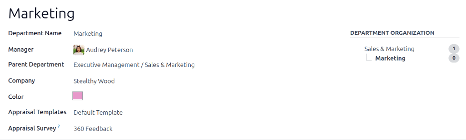

===========
Departments
===========

All employees in the *Employees* app fall under specific departments within a company.

Create new departments
======================

To make a new department, navigate to :menuselection:`Employees app --> Departments`, then click
:guilabel:`New` in the top-left to reveal a blank department form. Fill out the following
information on the department form:

- :guilabel:`Department Name`: enter a name for the department.
- :guilabel:`Manager`: using the drop-down menu, select the department manager.
- :guilabel:`Parent Department`: if the new department is housed within another department (has a
  parent department), select the parent department using the drop-down menu.
- :guilabel:`Custom Appraisal Templates`: if employees in this department require a specific
  appraisal form that is different from the default appraisal form, tick the checkbox. If this
  option is activated, an :guilabel:`Appraisal Templates` tab appears below the form. This field
  **only** appears if the *Appraisals* app is installed.
- :guilabel:`Company`: using the drop-down menu, select the company the department is part of.
- :guilabel:`Appraisal Survey`: using the drop-down menu, select the default survey to use for the
  department when requesting feedback from employees. This field **only** appears if the
  *Appraisals* app is installed, **and** the *360 Feedback* option is enabled in the settings.
- :guilabel:`Color`: select a color for the department. Click the default white color box to display
  all the color options. Click on a color to select it.
- :guilabel:`Appraisal Templates` tab: this tab **only** appears if the :guilabel:`Custom Appraisal
  Templates` options is activated on the form. Make any desired edits to the appraisal form. The
  appraisal form is used for appraisals for all employees within this department.

After the form is completed, click the :icon:`fa-cloud-upload` :guilabel:`(cloud upload)` icon to
manually save the changes. When saved, a :guilabel:`Department Organization` chart appears in the
top-right of the department card.

.. note::
   The form auto-saves while data is entered, however the :guilabel:`Department Organization` chart
   does **not** appear until the form is manually saved. If the form is not saved, the
   :guilabel:`Department Organization` chart is visible upon opening the department card from the
   :guilabel:`Departments` dashboard.

.. seealso::
   Refer to the :doc:`../appraisals` documentation for more information.

Departments dashboard
=====================

To view the currently configured departments, navigate to :menuselection:`Employees app -->
Departments`. All departments appear in a Kanban view, by default, and are listed in alphabetical
order.

.. image:: departments/departments.png
   :align: center
   :alt: The departments dashboard view with all the department cards in a Kanban view.

Kanban view
-----------

Each department has its own Kanban card on the main :guilabel:`Departments` :icon:`oi-view-kanban`
:guilabel:`(Kanban)` dashboard view, that can display the following information:

- Department name: the name of the department.
- Company: the company the department is part of.
- :guilabel:`Employees`: the number of employees within the department.
- :guilabel:`Appraisals`: the number of appraisals scheduled for employees in the department.
- :guilabel:`Time Off Requests`: the number of unapproved time off requests for employees in the
  department :ref:`awaiting approval <time_off/manage-time-off>` . This **only** appears if there
  are requests to approve.
- :guilabel:`Allocation Requests`: the number of unapproved allocation requests for employees in the
  department :ref:`awaiting approval <time_off/manage-allocations>`. This **only** appears if there
  are requests to approve.
- :guilabel:`New Applicants`: the number of :ref:`new applicants <recruitment/new>` for a position
  in this department. This **only** appears if there are new applicants.
- :guilabel:`Expense Reports`: the number of employees in the department with :doc:`open expense
  reports to approve <../../finance/expenses/approve_expenses>`. This **only** appears if there are
  any expense reports waiting for approval.
- :guilabel:`Absence`: the number of absences for the current day.
- Color bar: the selected color for the department appears as a vertical bar on the left side of the
  department card.

.. note::
   Click on an alert in a department card, such as :guilabel:`Time Off Requests`, to reveal a list
   view of the requests to approve. This list includes **all** open requests to approve, not just
   from the specific department.

The default view for the :guilabel:`Departments` dashboard is a Kanban view. It is possible to view
the departments in two other forms: a list view and a hierarchy view.

List view
---------

To view the departments in a list view, click the :icon:`fa-align-justify` :guilabel:`(list)` icon
in the top-right corner. The departments appear in a list view, which displays the
:guilabel:`Department Name`, :guilabel:`Company`, :guilabel:`Manager`, :guilabel:`Employees`,
:guilabel:`Parent Department`, and :guilabel:`Color` for each department.

The departments are sorted alphabetically by :guilabel:`Department Name`, by default.

.. image:: departments/list.png
   :align: center
   :alt: The departments presented in a list view.

.. tip::
   When in list view, departments can be managed in batch by selecting one or multiple record's
   checkbox, then select the :icon:`fa-cog` :guilabel:`Actions` button to reveal a drop-down menu of
   actions.

Hierarchy view
--------------

To view the departments in a hierarchy view, click the :icon:`fa-share-alt fa-rotate-90`
:guilabel:`(hierarchy)` icon in the top-right corner. The departments appear in an organizational
chart format, with the highest-level department at the top (typically :guilabel:`Management`), and
all other departments beneath it. All child departments of the first-level child departments are
folded.

Each department card displays the :guilabel:`Department Name`, the :guilabel:`Manager` (and their
profile image), the :guilabel:`Number of Employees` in the department, and the ability to expand the
department (:guilabel:`Unfold`) if there are child departments beneath it.

Click the :guilabel:`Unfold` button on a department card to expand it. Once expanded, the
:guilabel:`Unfold` button changes to a :guilabel:`Fold` button. To collapse the department, click
the :guilabel:`Fold` button. Only **one** department *per row* can be unfolded at a time.

Click anywhere on a department card to open the department form. Click the :guilabel:`(#) Employees`
smart button to view a list of all the employees in that department, including all employees in the
child departments beneath it, organized by individual department.

.. example::
   In the hierarchy view, if the :guilabel:`(2) Employees` button on the :guilabel:`Management` card
   is clicked (the highest-level department card), **all** employees appear in a list view, grouped
   by department. This is because **all** departments are children of the :guilabel:`Management`
   department.

   If the :guilabel:`(3) Employees` button in the :guilabel:`Sales` department card is clicked, the
   employees from the :guilabel:`Sales` department, as well as its two child departments
   (:guilabel:`East Coast Territory` and :guilabel:`West Coat Territory`), appear in the list.

  .. image:: departments/hierarchy.png
     :align: center
     :alt: The departments presented in a hierarchy view.

  .. image:: departments/employee-list.png
     :align: center
     :alt: The list view of employees for the department that was clicked, including all child
           departments.

