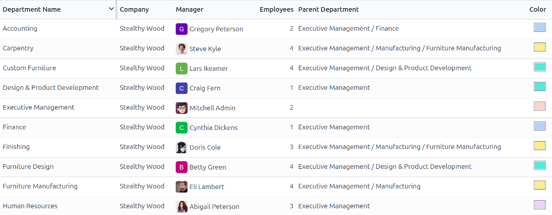

===========
Departments
===========

All employees in the **Employees** app fall under specific departments within a company.

Create new departments
======================

To make a new department, navigate to :menuselection:`Employees app --> Departments`, then click the
:guilabel:`New` button in the top-left corner to reveal a blank department form. Fill out the
following information on the department form:

- :guilabel:`Department Name`: enter a name for the department.
- :guilabel:`Manager`: using the drop-down menu, select the department manager.
- :guilabel:`Parent Department`: if the new department is housed within another department (has a
  parent department), select the parent department using the drop-down menu.
- :guilabel:`Company`: using the drop-down menu, select the company the department is part of. This
  field only appears in a multi-company database.
- :guilabel:`Color`: select a color for the department. Click the colored box to display all the
  color options. Click on a color to select it.
- :guilabel:`Appraisal Templates`: using the drop-down menu, select the appraisal form to be used
  for all employee appraisals within this department. If a new appraisal is desired, enter the name
  for the appraisal, then click :guilabel:`Create and edit...` to modify the new appraisal form.
  This field **only** appears if the **Appraisals** app is installed.
- :guilabel:`Appraisal Survey`: using the drop-down menu, select the default survey to use for the
  department when requesting feedback from employees within the department. The default options are
  :guilabel:`Employee Opinion Form`, :guilabel:`360 Feedback`, and :guilabel:`Employee Appraisal Form`.
  This field **only** appears if the **Appraisals** app is installed, *and* the *360 Feedback*
  option is enabled in the settings.

After the form is completed, click the :icon:`fa-cloud-upload` :guilabel:`(cloud upload)` icon to
manually save the changes. When saved, a :guilabel:`DEPARTMENT ORGANIZATION` chart appears in the
top-right of the department card, illustrating where the department lies in the organization.

.. image:: departments/department-form.png
   :alt: The department for with all fields filled out.

.. note::
   The form auto-saves while data is entered, however the :guilabel:`Department Organization` chart
   does **not** appear until the form is manually saved. If the form is not saved, the
   :guilabel:`Department Organization` chart is visible upon opening the department card from the
   :guilabel:`Departments` dashboard.

.. seealso::
   :doc:`../appraisals`

Departments dashboard
=====================

To view the currently configured departments, navigate to :menuselection:`Employees app -->
Departments`. All departments appear in a Kanban view, and are listed in alphabetical order.

The default view for the :guilabel:`Departments` dashboard is a :ref:`Kanban view
<employees/department-kanban>`. It is possible to view the departments in two other forms: a
:ref:`list view <employees/department-list>` and a :ref:`hierarchy view
<employees/department-hierarchy>`.

.. _employees/department-kanban:

Kanban view
-----------

Each department has its own Kanban card on the main :guilabel:`Departments` dashboard. Each
department card displays the following information, if available:

- :guilabel:`Name`: the name of the department.
- :guilabel:`Manager`: the name and image of the department manager.
- :guilabel:`Company`: the company the department is part of, including the location icon.
- :guilabel:`Employees`: the number of employees within the department.
- :guilabel:`Appraisals`: the number of appraisals scheduled for employees in the department.
- :guilabel:`Time Off Requests`: the number of unapproved time off requests for employees in the
  department :ref:`awaiting approval <time_off/manage-time-off>` . This **only** appears if there
  are requests to approve.
- :guilabel:`Allocation Requests`: the number of unapproved allocation requests for employees in the
  department :ref:`awaiting approval <time_off/manage-allocations>`. This **only** appears if there
  are requests to approve.
- :guilabel:`New Applicants`: the number of :ref:`new applicants <recruitment/new>` for a position
  within the department. This **only** appears if there are new applicants.
- :guilabel:`Expense Reports`: the number of employees in the department with :doc:`open expense
  reports to approve <../../finance/expenses/approve_expenses>`. This **only** appears if there are
  any expense reports waiting for approval.
- :guilabel:`Absence`: the number of employees with approved time off for the current day.
- Color bar: the selected color for the department appears as a vertical bar on the left side of the
  department card.

.. note::
   Click on an alert in a department card, such as :guilabel:`Time Off Requests`, to reveal a list
   view of the requests to approve for that department

.. _employees/department-list:

List view
---------

To view the departments in a list view, click the :icon:`fa-align-justify` :guilabel:`(list)` icon
in the top-right corner. The departments appear in a list view, which displays the
:guilabel:`Department Name`, :guilabel:`Company`, :guilabel:`Manager`, :guilabel:`Employees`,
:guilabel:`Parent Department`, and :guilabel:`Color` for each department.

The departments are sorted alphabetically by :guilabel:`Department Name`, by default.

.. _employees/department-hierarchy:

Hierarchy view
--------------

To view the departments in a hierarchy view, click the :icon:`fa-share-alt fa-rotate-90`
:guilabel:`(Hierarchy)` icon in the top-right corner. The departments appear in an organizational
chart format, with the highest-level department at the top (typically `Executive Management`), and
all other departments beneath it. All child departments of the first-level child departments are
folded.

Each department card displays the :guilabel:`Department Name`, the :guilabel:`Manager` (and their
profile image), the :guilabel:`Number of Employees` in the department, and the number of any child
departments.

Click the :guilabel:`Unfold` button on a department card to expand it. Once expanded, the
:guilabel:`Unfold` button changes to a :guilabel:`Fold` button. To collapse the department, click
the :guilabel:`Fold` button. Only **one** department *per row* can be unfolded at a time.

Click anywhere on a department card to open the department form. Click the :guilabel:`(#) Employees`
smart button to view a list of all the employees in that department.

