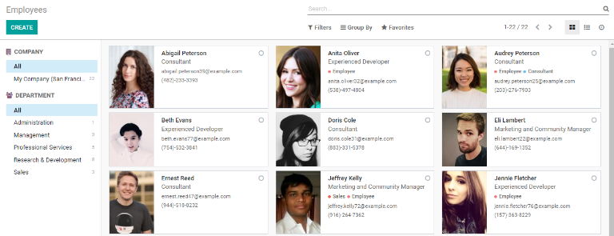
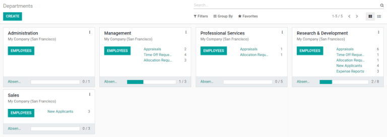
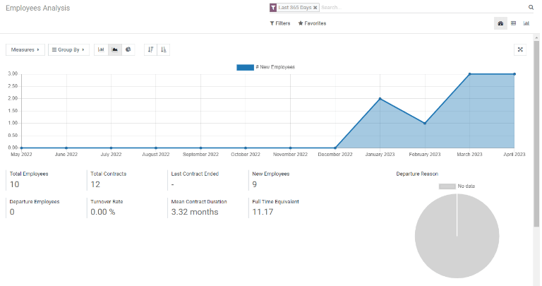
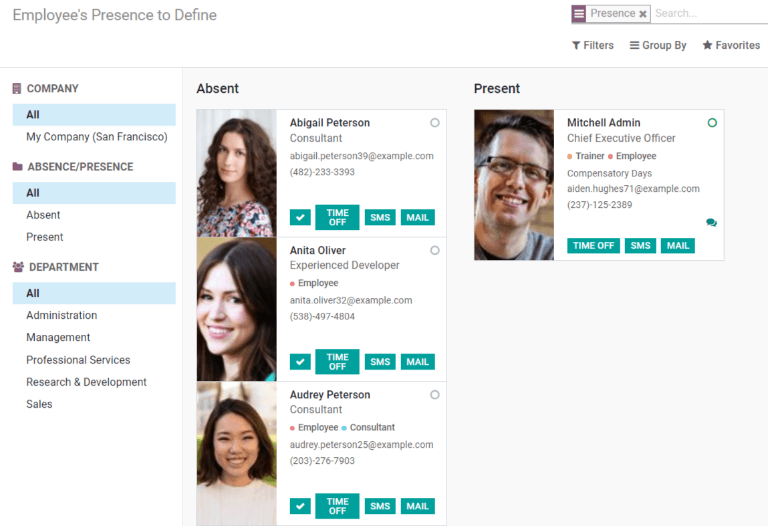

==============================
Getting started with Employees
==============================

See all the employees and related content across the organization with the :guilabel:`Employees`
application. The four main components of :guilabel:`Employees` are :guilabel:`Employees`,
:guilabel:`Employee Directory`, :guilabel:`Departments`, and :guilabel:`Reporting`. Manage
departments, view employee activity, gamify training, and organize the various positions in the
company through :guilabel:`Employees`, which integrates with other Odoo applications to better
organize the company and its workers.

Employees
=========

The list of employees directly overlaps with the :guilabel:`Payroll` application, and displays all
the employees of the business, whether full-time, part-time, or contract. The main
:guilabel:`Employees` dashboard displays a summary of each employee's information in their
individual kanban card. Employees can be sorted by company and/or department from the left side
navigation. Clicking on an employee card will allow for a variety of other actions, including
requesting an appraisal, viewing time off requests and contracts, seeing payslips, and more.

Contracts
---------

The :guilabel:`Contracts` section, housed under :guilabel:`Employees`, displays all the contracts in
a kanban view. The default view displays all stages of contracts: :guilabel:`New`,
:guilabel:`Running`, :guilabel:`Expired`, and :guilabel:`Canceled`.

Employee Directory
==================

The directory displayed under :guilabel:`Employee Directory` is an identical view of the
:guilabel:`Employee` overview with one key difference; there is no ability to create a new employee
from the directory. Adding a new employee can only be done in the :guilabel:`Employees` section, not
from the directory. Clicking on an employee card will only allow an appraisal request, and will not
display any of the other actions that are accessible in the :guilabel:`Employees` section.

Departments
===========

The :guilabel:`Departments` section shows the various departments that are currently set up in the
company, and allows for the creation of new departments. A summary of any actions that need to be
done for that department is listed in the department card, along with a small graph displaying
absentee employees. Clicking on any listed items on the card will pull up the related information,
such as :guilabel:`Time Off Requests`, :guilabel:`Appraisals`, :guilabel:`New Applicants`,
:guilabel:`Expenses`, and more. Clicking on the :guilabel:`Employees` smart button in each
department will show only the employees in that specific department.

Reporting
=========

The :guilabel:`Reporting` dashboard is designed to only report on two metrics:
:guilabel:`Contracts`, and :guilabel:`Employee Presence`.

Contracts
---------

These reports help visualize how many employees have been hired, or given a contract, over certain
periods of time in order to visualize the growth of personnel.

Employee Presence
-----------------

The :guilabel:`Employee Presence` report shows how many employees are currently working or absent,
and the options to approve :guilabel:`Time Off Requests`, or contact the employee via text  or email
regarding their attendance can be done here.

Configuration
=============

The :guilabel:`Configuration` section is where general employee settings are configured, and
job positions and departments are created and managed. Create onboarding and offboarding plans in
detail, as well as create and manage contract templates, to more easily handle new recruits. Gamify
aspects of an employee's job through the creation of challenges and badges, and view all past goals,
with metrics achieved.
