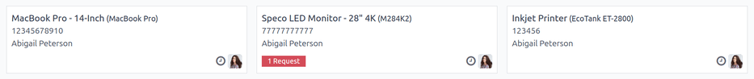
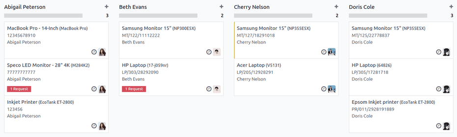

=========
Equipment
=========

Many employees are given various items to use while they work, such as laptops, phones, and
printers. Most companies track their equipment, to see who is using what, as well as having a record
of important information regarding the equipment, such as serial numbers, warranty information, and
maintenance history.

.. note::
   To track employee equipment, the **Maintenance** app *must* be installed.

.. _employees/equipment:

Individual employee equipment
=============================

Employee equipment is tracked on the employee record. To view all equipment currently assigned to an
employee, navigate to the :menuselection:`Employees` app, and click on the desired employee record.

At the top of the record, an :icon:`fa-cubes` :guilabel:`Equipment Count` smart button appears, with
a number indicating how many, if any, items are currently assigned to that employee.

Click the :icon:`fa-cubes` :guilabel:`Equipment Count` smart button, and all equipment currently
assigned to the employee appears in individual Kanban cards.

Each Kanban card displays the equipment's name and model on the first line, followed by the serial
number (if available), and lastly, the employee's name. Any current maintenance requests appear at
the bottom of the card in a red box.

.. note::
   A serial number is **not** required when logging equipment.

All employee equipment
======================

To view all equipment for all employees, start on the :ref:`equipment record of an individual
employee <employees/equipment>`.

.. note::
   It does not matter what employee is selected, or whether they have any equipment assigned to
   them. This step is only used to get to the :guilabel:`Equipment` list.

In the Kanban view of the employee's equipment, clear the default :guilabel:`Assigned Employee`
filter in the search bar. This presents *all* equipment in the database, including those assigned to
individual employees and whole departments.

Click into the search bar, and select :guilabel:`Employee` in the :icon:`oi-group` :guilabel:`Group
By` column. The equipment is now organized in a Kanban view, by employee.

In the Kanban view displaying all employee equipment records, equipment can be reassigned by
clicking and dragging an equipment card to the desired employee. This changes ownership of the
equipment.

Add equipment to an employee record
===================================

To add equipment to an employee's record, open the :menuselection:`Employees` app, click on the
desired employee record, then click the :icon:`fa-cubes` :guilabel:`Equipment Count` smart button at
the top.

All equipment currently assigned to the employee appears in individual Kanban cards. To add a new
equipment record, click the :guilabel:`New` button in the upper-left corner, and a blank
:guilabel:`Equipment` form loads.

:doc:`Fill out the equipment form <../../inventory_and_mrp/maintenance/add_new_equipment>` for the
employee's equipment.

.. tip::
   Instead of filling out a new :guilabel:`Equipment` form for the same item, a form can be
   duplicated, then updated.

   On the :guilabel:`Equipment` form, click the :icon:`fa-gear` :guilabel:`(Actions)` icon in the
   upper-left corner, then select :icon:`fa-clone` :guilabel:`Duplicate`.

   An identical form appears, with *all* the information filled out, except for the
   :guilabel:`Serial Number`.

   Enter the :guilabel:`Serial Number` on the form, and make any other necessary changes, such as
   the assigned :guilabel:`Employee`.

   .. image:: equipment/equipment-form.png
      :alt: A duplicate equipment form with all the information filled out except the serial number.
