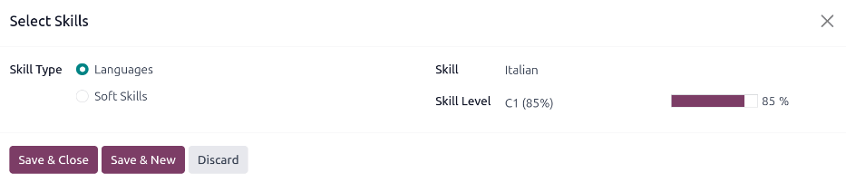

=============
New employees
=============

When a new employee is hired, the first step is to create a new employee record. This record is a
centralized place where all important information about the employee is stored, including
:ref:`general information <employees/general-info>`, :ref:`job history and skills
<employees/resume>`, :ref:`various work information <employees/work-info-tab>`, :ref:`personal
details <employees/private-info>`, :ref:`documents <employees/docs>`, and more.

To begin, open the :menuselection:`Employees` app, then click the :guilabel:`New` button in the
upper-left corner. Doing so reveals a blank employee form.

Proceed to fill out the required information, along with any additional details.

.. image:: new_employee/new-employee-form.png
   :align: center
   :alt: Create a new employee form with all fields filled out.

.. note::
   The current company phone number and name are populated in the :guilabel:`Work Phone` and
   :guilabel:`Company` fields. If the *Appraisals* application is installed, the :guilabel:`Next
   Appraisal Date` field is populated with a date six months from the current date.

.. _employees/general-info:

General information
===================

The employee form automatically saves as data is entered. However, the form can be saved manually at
any time by clicking the :guilabel:`Save manually` option, represented by a :guilabel:`(cloud with
an upwards arrow)` icon.

Required fields
---------------

- :guilabel:`Employee's Name`: enter the employee's name.
- :guilabel:`Company`: from the drop-down menu in this field, select the company the new employee
  was hired by, or create a new company by typing the name in the field, and clicking
  :guilabel:`Create` or :guilabel:`Create and edit...` from the mini drop-down menu that appears.

.. image:: new_employee/employee-new.png
   :align: center
   :alt: A new employee form with the required fields highlighted.

Optional fields
---------------

- :guilabel:`Photo`: in the top-right image box of the employee form, click on the :guilabel:`✏️
  (pencil)` edit icon to select a photo to upload.
- :guilabel:`Job Position`: enter the employee's job title under their name, or select it from the
  :guilabel:`Job Position` field drop-down menu below to have this top field auto-populate. The
  :guilabel:`Job Position` field under the employee name can be modified, and does *not* need to
  match the selection made in the :guilabel:`Job Position` drop-down menu in the field below.

  .. example::
     While it is recommended to have the job positions match, the typed-in description in this top
     field can contain more specific information than the selected drop-down :guilabel:`Job
     Position`, if desired.

     For instance, if someone is hired for a sales representative position configured as
     :guilabel:`Sales Representative` in the *Recruitment* app, that can be selected in the
     drop-down :guilabel:`Job Position` field.

     In the typed-in :guilabel:`Job Position` field beneath the :guilabel:`Employee's Name` field,
     the position could be more specific, such as `Sales Representative - Subscriptions` if the
     employee is focused solely on subscription sales.

     .. image:: new_employee/job-description-fields.png
        :align: center
        :alt: Both job position fields entered but with different information.

- :guilabel:`Tags`: select a tag from the drop-down menu to add relevant tags to the employee. Any
  tag can be created in this field by typing it in. Once created, the new tag is available for all
  employee records. There is no limit to the amount of tags that can be added.
- :guilabel:`Work Contact Information`: enter the employee's :guilabel:`Work Mobile`,
  :guilabel:`Work Phone`, :guilabel:`Work Email`, and/or :guilabel:`Company` name, if not already
  auto-populated.
- :guilabel:`Department`: select the employee's department from the drop-down menu.
- :guilabel:`Job Position`: select the employee's job position from the drop-down menu. Once a
  selection is made, the :guilabel:`Job Position` field beneath the :guilabel:`Employee's Name`
  field automatically updates to reflect the currently selected job position. These positions are
  from the :doc:`Recruitment <../../hr/recruitment/new_job/>` application, and reflect the
  currently configured job positions.
- :guilabel:`Manager`: select the employee's manager from the drop-down menu.
- :guilabel:`Coach`: select the employee's coach from the drop-down menu.
- :guilabel:`Next Appraisal Date`: this field is **only** visible if the *Appraisals* application is
  installed. The date automatically populates with a date that is computed according to the settings
  configured in the *Appraisals* application. This date can be modified using the calendar selector.

.. note::
   After a :guilabel:`Manager` is selected, if the :guilabel:`Coach` field is blank, the selected
   manager automatically populates the :guilabel:`Coach` field.

.. tip::
   To make edits to the selected :guilabel:`Department`, :guilabel:`Manager`, :guilabel:`Coach`, or
   :guilabel:`Company`, click the :guilabel:`Internal Link` arrow next to the respective selection.
   The :guilabel:`Internal Link` arrow opens the selected form, allowing for modifications. Click
   :guilabel:`Save` after any edits are made.

Additional information tabs
===========================

.. _employees/resume:

Resumé tab
----------

Resumé
~~~~~~

Next, enter the employee's work history in the :guilabel:`Resumé` tab. Each resumé line must be
entered individually. When creating an entry for the first time, click :guilabel:`Create a new
entry`, and the :guilabel:`Create Resumé lines` form appears. After an entry is added, the
:guilabel:`Create a new entry` button is replaced with an :guilabel:`Add` button. Enter the
following information for each entry.

.. image:: new_employee/resume-lines.png
   :align: center
   :alt: A resumé entry form with all the information populated.

- :guilabel:`Title`: type in the title of the previous work experience.
- :guilabel:`Employee`: select the employee from the drop-down menu.
- :guilabel:`Type`: from the drop-down menu, select either :guilabel:`Experience`,
  :guilabel:`Education`, :guilabel:`Side Projects`, :guilabel:`Internal Certification`,
  :guilabel:`Completed Internal Training`, or type in a new entry, then click :guilabel:`Create
  "(Type)"`.
- :guilabel:`Display Type`: from the drop-down menu, choose :guilabel:`Classic` for typical work
  experience, :guilabel:`Certification` for experience gained through a certification, or
  :guilabel:`Course` for non-certified classes.
- :guilabel:`Duration`: enter the start and end dates for the work experience. To select a date,
  click the first empty field to reveal a calendar pop-up window. Proceed to use the :guilabel:`<
  (left arrow)` and :guilabel:`> (right arrow)` icons to scroll to the desired month, then click on
  the day to select it. Repeat this process to locate and select the end date. When the desired
  dates have been selected, click :guilabel:`✔️ Apply`.
- :guilabel:`Description`: enter any relevant details in this field.

Once all the information is entered, click the :guilabel:`Save & Close` button if there is only one
entry to add, or click the :guilabel:`Save & New` button to save the current entry and create
another resumé line.

.. note::
   After the new employee form is saved, the current position and company is automatically added to
   the :guilabel:`Resumé` tab, with the end date listed as `current`.

.. _employees/skills:

Skills
~~~~~~

An employee's skills can be entered in the :guilabel:`Resumé` tab in the same manner that a resumé
line is created.

In order to add a skill to an employee record, the skill types must be configured first. If no skill
types are configured, a :guilabel:`Create new Skills` button appears in the :guilabel:`Skills`
section of the :guilabel:`Resumé` tab. :ref:`Configure the skill types <employees/skill-types>`
before adding any skills to the employee record.

If the skill types are configured, a :guilabel:`Pick a skill from the list` button appears instead.
Click the :guilabel:`Pick a skill from the list` button, and select the following information for
each skill.

- :guilabel:`Skill Type`: select a :ref:`skill type <employees/skill-types>` by clicking the radio
  button next to the skill type.
- :guilabel:`Skill`: after selecting a :guilabel:`Skill Type`, the corresponding skills associated
  with that selected :guilabel:`Skill Type` appear in a drop-down menu. For example, selecting
  :guilabel:`Language` as the :guilabel:`Skill Type` presents a variety of languages to select from
  under the :guilabel:`Skills` field. Select the appropriate pre-configured skill, or type in a new
  skill, then click :guilabel:`Create "(new skill)"`.
- :guilabel:`Skill Level`: pre-defined skill levels associated with the selected :guilabel:`Skill
  Type` appear in a drop-down menu. First, select a :guilabel:`Skill Level`, then the progress bar
  automatically displays the pre-defined progress for that specific skill level. Skill levels and
  progress can be modified in the :guilabel:`Skill Level` pop-up form, which is accessed via the
  :guilabel:`Internal Link` arrow next to :guilabel:`Skill Level` field.

Click the :guilabel:`Save & Close` button if there is only one skill to add, or click the
:guilabel:`Save & New` button to save the current entry and immediately add another skill.

To delete any line from the :guilabel:`Resumé` tab, click the :guilabel:`🗑️ (trash can)` icon to
delete the entry. Add a new line by clicking the :guilabel:`Add` button next to the corresponding
section.

.. important::
   Only users with :guilabel:`Officer: Manage all employees` or :guilabel:`Administrator` rights for
   the *Employees* app can add or edit skills.

.. _employees/skill-types:

Skill types
***********

In order to add a skill to an employee's form, the :guilabel:`Skill Types` must be configured. Go to
:menuselection:`Employees app --> Configuration --> Employee: Skill Types` to view the currently
configured skill types and create new skill types.

.. note::
   The default skill of :guilabel:`Languages` is pre-configured as a skill *type*, but there are no
   specific language *skills* listed within that skill type. The :guilabel:`Languages` skill type
   must be fully configured before it can be used.

Click :guilabel:`New` and a new :guilabel:`Skill Type` form appears. Fill out all the details for
the new skill type. Repeat this for all the needed skill types.

- :guilabel:`Skill Type`: enter the name of the skill type. This acts as the parent category for
  more specific skills and should be generic.
- :guilabel:`Skills`: click :guilabel:`Add a line`, and enter the :guilabel:`Name` for the new
  skill, then repeat for all other needed skills.
- :guilabel:`Levels`: click :guilabel:`Add a line`, and enter the :guilabel:`Name` of the level.
  Next, click into the :guilabel:`Progress` field, and enter a percentage (0-100) for that level.
  Repeat for all additional levels, as needed.
- :guilabel:`Default Level`: click the toggle on the level line to set that level as the default.
  Typically, the lowest level is set as the default, but any level can be chosen. The toggle turns
  green, indicating it is the default level for the skill. Only one level can be set as the default.

  .. example::
     To add a math skill set, enter `Math` in the :guilabel:`Name` field. Next, in the
     :guilabel:`Skills` field, enter `Algebra`, `Calculus`, and `Trigonometry`. Last, in the
     :guilabel:`Levels` field enter `Beginner`, `Intermediate`, and `Expert`, with the
     :guilabel:`Progress` listed as `25`, `50`, and `100`, respectively. Last, click :guilabel:`Set
     Default` on the `Beginner` line to set this as the default skill level.

     .. image:: new_employee/math-skills.png
        :align: center
        :alt: A skill form for a Math skill type, with all the information entered.

The :guilabel:`Skill Type` form automatically saves as data is entered.

.. tip::
   Once the form is completely filled out, click the :guilabel:`Save manually` button, represented
   by a :guilabel:`cloud with an upwards arrow` icon at the top of the screen, and the
   :guilabel:`Levels` rearrange in descending order, with the highest level at the top, and the
   lowest at the bottom, regardless of the default level and the order they were entered.

.. _employees/work-info-tab:

Work information tab
--------------------

The :guilabel:`Work Information` tab is where the employee's specific job related information is
found. Their working schedule, various roles, who approves their specific requests (time off,
timesheets, and expenses), their remote work schedule, and specific work location details are listed
here.

Click on the :guilabel:`Work Information` tab to access this section, and enter the following
information for the new employee:

- :guilabel:`Location`: select the :guilabel:`Work Address` from the drop-down menu. To modify the
  address, hover over the first line (if there are multiple lines) of the address to reveal an
  :guilabel:`Internal Link` arrow. Click the :guilabel:`Internal Link` arrow to open up the company
  form, and make any edits.

  Use the breadcrumb links to navigate back to the new employee form when done.

  If a new work address is needed, add the address by typing it in the field, then click
  :guilabel:`Create (new address)` to add the address, or :guilabel:`Create and edit...` to add the
  new address and edit the address form.
- :guilabel:`Approvers`: to see this section, the user must have either :guilabel:`Administrator` or
  :guilabel:`Officer: Manage all employees` rights set for the *Employees* application. Using the
  drop-down menus, select the users responsible for approving an :guilabel:`Expense`, a
  :guilabel:`Time Off` request, :guilabel:`Timesheet` entries, and :guilabel:`Attendance` records
  for the employee.

  Hover over any of the selections to reveal the :guilabel:`Internal Link` arrow.

  Click the :guilabel:`Internal Link` arrow to open a form with the approver's :guilabel:`Name`,
  :guilabel:`Email Address`, :guilabel:`Company`, :guilabel:`Phone`, :guilabel:`Mobile`, and
  :guilabel:`Default Warehouse` fields. These can be modified, if needed.

  Use the breadcrumb links to navigate back to the new employee form when done.

  .. important::
     The users that appear in the drop-down menu for the :guilabel:`Approvers` section **must** have
     *Administrator* rights set for the corresponding human resources role.

     To check who has these rights, go to :menuselection:`Settings app --> Users --> → Manage
     Users`. Then, click on an employee, and check the :guilabel:`Human Resources` section of the
     :guilabel:`Access Rights` tab.

     - In order for the user to appear as an approver for :guilabel:`Expenses`, they **must** have
       either :guilabel:`Team Approver`, :guilabel:`All Approver`, or :guilabel:`Administrator` set
       for the :guilabel:`Expenses` role.
     - In order for the user to appear as an approver for :guilabel:`Time Off`, they **must** have
       either :guilabel:`Officer:Manage all Requests` or :guilabel:`Administrator` set for the
       :guilabel:`Time Off` role.
     - In order for the user to appear as an approver for :guilabel:`Timesheets`, they **must** have
       either :guilabel:`Manager`, :guilabel:`Officer:Manage all contracts`, or
       :guilabel:`Administrator` set for the :guilabel:`Payroll` role.

- :guilabel:`Remote Work`: use the drop-down menu to select the default location the employee works
  from each day of the week. The default options are :guilabel:`Home`, :guilabel:`Office`, or
  :guilabel:`Other`.

  A new location can be typed into the field, then click either :guilabel:`Create (new location)` to
  add the location, or :guilabel:`Create and edit...` to add the new location and edit the form.

  After edits are done, click :guilabel:`Save & Close`, and the new location is added, and populates
  the field.

  Leave the field blank (:guilabel:`Unspecified`) for non-working days like Saturday and Sunday.

  .. note::
     It is also possible to add or modify work locations by navigating to :menuselection:`Employees
     app --> Configuration --> Employee: Work Locations`. To modify a location, click on an existing
     location, then make any changes on the form.

     Click :guilabel:`New` to create a new location, then enter the following information on the
     form. All fields are **required**.

     - :guilabel:`Work Location`: enter the name for the location. This can be as general or as
       specific, as needed, such as `Home` or `Building 1, Second Floor`, respectfully.
     - :guilabel:`Work Address`: using the drop-down menu, select the address for the location.
     - :guilabel:`Cover Image`: click on the icon to select it for the :guilabel:`Cover Image`.
       Options are a :guilabel:`house` icon, an :guilabel:`office building` icon, and a
       :guilabel:`GPS location marker` icon.
     - :guilabel:`Company`: using the drop-down menu, select the company the location applies to.
       The current company populates this field, by default.

     .. image:: new_employee/location.png
        :align: center
        :alt: A new work location form with all fields filled out.

- :guilabel:`Schedule`: select the :guilabel:`Working Hours` and :guilabel:`Timezone` for the
  employee. The :guilabel:`Internal Link` arrow opens a detailed view of the specific daily working
  hours. Working hours can be modified or deleted here.

  .. note::
     :guilabel:`Working Hours` are related to a company's working schedules, and an Employee
     **cannot** have working hours that are outside of a company's working schedule.

     Each individual working schedule is company-specific. So, for multi-company databases, each
     company needs to have its own working schedules set.

     If an employee's working hours are not configured as a working schedule for the company, new
     working schedules can be added, or existing working schedules can be modified.

     Working hours can be modified in the *Payroll* application, where they are referred to as
     :guilabel:`Working Schedules`.

     For more information on how to create or modify :guilabel:`Working Schedules` in the *Payroll*
     application, refer to the :doc:`../../hr/payroll` documentation.

- :guilabel:`Planning`: select a role from the drop-down menu for both the :guilabel:`Roles` and
  the :guilabel:`Default Role` fields. If the :guilabel:`Default Role` is selected as a role, it is
  automatically added to the list of :guilabel:`Roles`.

.. important::
   The users that appear in the drop-down menu for the :guilabel:`Approvers` section **must** have
   *Administrator* rights set for the corresponding human resources role.

   To check who has these rights, go to :menuselection:`Settings app --> Users --> → Manage Users`.
   Click on an employee, and check the :guilabel:`Human Resources` section of the :guilabel:`Access
   Rights` tab.

   - In order for the user to appear as an approver for :guilabel:`Expenses`, they **must** have
     either :guilabel:`Team Approver`, :guilabel:`All Approver`, or :guilabel:`Administrator` set
     for the :guilabel:`Expenses` role.
   - In order for the user to appear as an approver for :guilabel:`Time Off`, they **must** have
     either :guilabel:`Officer` or :guilabel:`Administrator` set for the :guilabel:`Time Off` role.
   - In order for the user to appear as an approver for :guilabel:`Timesheets`, they **must** have
     either :guilabel:`Manager`, :guilabel:`Officer`, or :guilabel:`Administrator` set for the
     :guilabel:`Payroll` role.

.. note::
   :guilabel:`Working Hours` are related to a company's working times, and an employee **cannot**
   have working hours that are outside of a company's working times.

   Each individual working time is company-specific. So, for multi-company databases, each company
   **must** have its own working hours set.

   If an employee's working hours are not configured as a working time for the company, new working
   times can be added, or existing working times can be modified.

   To add or modify a working time, go to the :menuselection:`Payroll app --> Configuration -->
   Working Schedules`. Then, either add a new working time by clicking :guilabel:`New`, or edit an
   existing one by selecting a :guilabel:`Working Time` from the list to modify it.

   Refer to the :ref:`Working schedules <payroll/working-times>` section of the payroll
   documentation for specific details on creating and editing working schedules.

   After the new working time is created, or an existing one is modified, the :guilabel:`Working
   Hours` can be set on the employee form. In the :guilabel:`Schedule` section of the
   :guilabel:`Work Information` tab, select the employee's working hours using the drop-down menu.

.. _employees/private-info:

Private information tab
-----------------------

No information in the :guilabel:`Private Information` tab is required to create an employee,
however, some information in this section may be critical for the company's payroll department. In
order to properly process payslips and ensure all deductions are accounted for, the employee's
personal information should be entered.

Here, the employee's :guilabel:`Private Contact`, :guilabel:`Family Status`, :guilabel:`Emergency`
contact, :guilabel:`Education`, :guilabel:`Work Permit`, and :guilabel:`Citizenship` information is
entered. Fields are entered either using a drop-down menu, ticking a checkbox, or typing in the
information.

- :guilabel:`Private Contact`: enter the :guilabel:`Private Address`, :guilabel:`Email`, and
  :guilabel:`Phone` for the employee. Then, enter the employee's :guilabel:`Bank Account Number`
  using the drop-down menu.

  If the bank is not already configured (the typical situation when creating a new employee), enter
  the bank account number, and click :guilabel:`Create and edit..`. A :guilabel:`Create Bank Account
  Number` form loads. Fill in the necessary information, then click :guilabel:`Save & Close`.

  Next, select the employee's preferred :guilabel:`Language` from the drop-down menu. Then enter the
  :guilabel:`Home-Work Distance` in the field. This field is only necessary if the employee is
  receiving any type of commuter benefits.

  Lastly, enter the employee's license plate information in the :guilabel:`Private Car Plate` field.
- :guilabel:`Family Status`: select the current :guilabel:`Marital Status` using the drop-down menu,
  either :guilabel:`Single`, :guilabel:`Married`, :guilabel:`Legal Cohabitant`, :guilabel:`Widower`,
  or :guilabel:`Divorced`. If the employee has any dependent children, enter the :guilabel:`Number
  of Dependent Children` in the field.
- :guilabel:`Emergency`: type in the :guilabel:`Contact Name` and :guilabel:`Contact Phone` number
  of the employee's emergency contact in the respective fields.
- :guilabel:`Education`: select the highest level of education completed by the employee from the
  :guilabel:`Certificate Level` drop-down menu. Default options include :guilabel:`Graduate`,
  :guilabel:`Bachelor`, :guilabel:`Master`, :guilabel:`Doctor`, or :guilabel:`Other`.

  Type in the :guilabel:`Field of Study`, and the name of the :guilabel:`School` in the respective
  fields.
- :guilabel:`Work Permit`: if the employee has a work permit, enter the information in this section.
  Type in the :guilabel:`Visa No` (visa number), and/or :guilabel:`Work Permit No` (work permit
  number) in the corresponding fields.

  Using the calendar selector, select the :guilabel:`Visa Expiration Date`, and/or the
  :guilabel:`Work Permit Expiration Date`, to enter the expiration date(s).

  If available, upload a digital copy of the :guilabel:`Work Permit` document. Click
  :guilabel:`Upload your file`, navigate to the work permit file in the file explorer, and click
  :guilabel:`Open`.
- :guilabel:`Citizenship`: this section contains all the information relevant to the citizenship of
  the employee. Some fields use a drop-down menu, as the :guilabel:`Nationality (Country)`,
  :guilabel:`Gender`, and :guilabel:`Country of Birth` fields do.

  The :guilabel:`Date of Birth` uses a calendar selector to select the date. First, click on the
  name of the month, then the year, to access the year ranges. Use the :guilabel:`< (left)` and
  :guilabel:`> (right)` arrow icons, navigate to the correct year range, and click on the year.
  Next, click on the month. Last, click on the day to select the date.

  Type in the information for the :guilabel:`Identification No` (identification number),
  :guilabel:`Passport No` (passport number), and :guilabel:`Place of Birth` fields.

  Lastly, if the employee is **not** a resident of the country they are working in, activate the
  checkbox next to the :guilabel:`Non-resident` field.

  .. note::
     Depending on the localization setting, other fields may be present. For example, for the United
     States, a :guilabel:`SSN No` (Social Security Number) field is present.

.. _employees/hr-settings:

HR settings tab
---------------

This tab provides various fields for different information, depending on the country the company is
located. Different fields are configured for different locations, however some sections appear
regardless.

- :guilabel:`Status`: select an :guilabel:`Employee Type` and, if applicable, a :guilabel:`Related
  User`, with the drop-down menus. The :guilabel:`Employee Type` options include
  :guilabel:`Employee`, :guilabel:`Student`, :guilabel:`Trainee`, :guilabel:`Contractor`, or
  :guilabel:`Freelancer`.

  .. important::
     Employees do **not** also need to be users. *Employees* do **not** count towards the Odoo
     subscription billing, while *Users* **do** count towards billing. If the new employee should
     also be a user, the user **must** be created.

     After the employee is created, click the :guilabel:`⚙️ (gear)` icon, then click
     :guilabel:`Create User`. A :guilabel:`Create User` form appears.

     Type in the :guilabel:`Name` and :guilabel:`Email Address`. Next, select the
     :guilabel:`Company` from the drop-down menu.

     Then, enter the :guilabel:`Phone` and :guilabel:`Mobile` numbers in the respective fields.

     If a photo is available, click the :guilabel:`Edit` icon (which appears as a :guilabel:`✏️
     (pencil)` icon) in the lower-left corner of the image box, which is located in the top-right
     corner of the form.

     A file explorer pops up. Navigate to the file, then click :guilabel:`Open` to select it.
     Finally, click :guilabel:`Save` after all the information is entered, and the employee record
     is automatically updated with the newly-created user populating the :guilabel:`Related User
     field`.

     Users can also be created manually. For more information on how to manually add a user, refer
     to the :doc:`../../general/users/` document.

- :guilabel:`Attendance/Point of Sale/Manufacturing`: the employee's :guilabel:`PIN Code` and
  :guilabel:`Badge ID` can be entered here, if the employee needs/has one. Click
  :guilabel:`Generate` next to the :guilabel:`Badge ID` to create a badge ID.

  The :guilabel:`PIN Code` is used to sign in and out of the *Attendance* app kiosk, and a
  :abbr:`POS (Point Of Sale)` system.
- :guilabel:`Payroll`: if applicable, enter the :guilabel:`Registration Number of the Employee` in
  this section.

  Depending on the localization setting, the other items that appear in this field vary based on
  location. In addition, other sections may appear in this tab based on location. It is recommended
  to check with the payroll and/or accounting departments to ensure this section, as well as any
  other sections relating to payroll that may appear, are filled in correctly.
- :guilabel:`Application Settings`: enter the employee's :guilabel:`Billing Time Target` for the
  billing rate leader board in the *Timesheets* application. Next, enter the :guilabel:`Hourly Cost`
  in a XX.XX format. This is factored in when the employee is working at a :doc:`work center
  <../../inventory_and_mrp/manufacturing/advanced_configuration/using_work_centers>`.

  If applicable, enter the :guilabel:`Fleet Mobility Card` number.

.. note::
   Manufacturing costs are added to the costs for producing a product, if the value of the
   manufactured product is **not** a fixed amount. This cost does **not** affect the *Payroll*
   application.

.. image:: new_employee/hr-settings.png
   :align: center
   :alt: Enter any information prompted in the HR Settings tab for the employee.

.. _employees/docs:

Documents
=========

All employee-related documents are stored in the *Documents* app. The number of associated documents
is displayed in the :guilabel:`Documents` smart button above the employee record. Click on the smart
button to access all documents.

Refer to :doc:`documentation <../../productivity/documents>` on the *Documents* app for more
information.

.. image:: new_employee/documents.png
   :align: center
   :alt: All uploaded documents associated with the employee appear in the documents smart-button.
