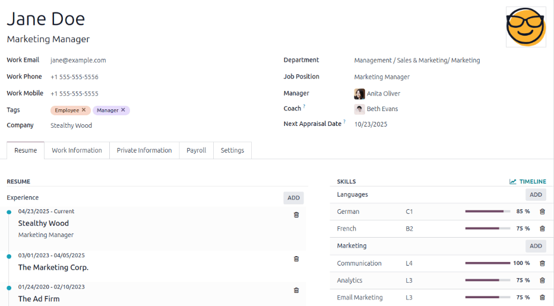
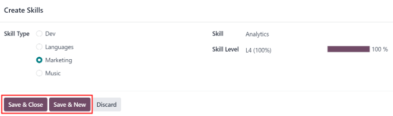
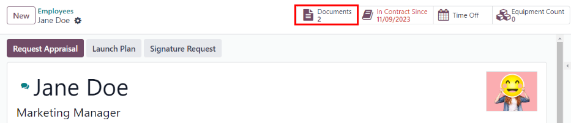

=====================
Create a new employee
=====================

When a new employee is hired, the first step is to create a new employee record. Starting in the
:menuselection:`Employees` app dashboard, click the :guilabel:`New` button and a new employee form
appears. Fill out the required information and any additional details.

.. note::
   The current company phone number and name is populated in the :guilabel:`Work Phone` and
   :guilabel:`Company` fields.

General information
===================

The employee form automatically saves as data is entered, but the save manually icon (a could with
an up arrow inside it) may be clicked at any time to manually save the form.

Required fields
---------------

- :guilabel:`Name`: Enter the employee's name.
- :guilabel:`Company`: Select the company from the drop-down menu that the new employee is hired by,
  or create a new company by typing the name in the field.

.. image:: new_employee/employee-new.png
   :align: center
   :alt: A new employee form with the required fields highlighted.

Optional fields
---------------

- :guilabel:`Photo`: In the top right image box of the employee form, click on the :guilabel:`✏️
  (pencil)` edit icon to select a photo to upload.
- :guilabel:`Job Position`: Enter the employee's job position title under their name, or select the
  job position from the :guilabel:`Job Position` drop-down menu to have this field auto-populate.
  The :guilabel:`Job Position` field under the employee name can be modified and does not need to
  match the selection made in the :guilabel:`Job Position` drop-down.

  .. example::
     It is recommended to have the job positions match, but if desired, the typed-in description in
     this field can contain more information than the selected drop-down job position.

     An example where this may be applicable is if someone is hired for a sales representative
     position configured as :guilabel:`Sales Representative` in the *Recruitment* app, and that is
     selected for the drop-down :guilabel:`Job Position` field.

     In the typed in job position field beneath the employee's name, the position could be more
     specific, such as `Sales Representative - Subscriptions` if the employee is focused solely on
     subscription sales.

     .. image:: new_employee/job-description-fields.png
        :align: center
        :alt: Both job position fields entered but with different information.

- Tags: Click on a tag in the drop-down menu to add any tags applicable to the employee. Any tag can
  be created in this field by typing it in. Once created, the new tag is available for all employee
  records. There is no limit to the amount of tags that can be added.
- Work Contact Information: Enter the employee's :guilabel:`Work Mobile`, :guilabel:`Work Phone`,
  :guilabel:`Work Email`, and/or :guilabel:`Company` name.
- :guilabel:`Department`: Select the employee's department from the drop-down menu.
- :guilabel:`Job Position`: Select the employee's job position from the drop-down menu. Once a
  selection is made, the :guilabel:`Job Position` field beneath the employee's name automatically
  updates to reflect the currently selected job position. These positions are from the
  :doc:`Recruitment <../../hr/recruitment/new_job/>` application, and reflect the currently \
  configured job positions.
- :guilabel:`Manager`: Select the employee's manager from the drop-down menu.
- :guilabel:`Coach`: Select the employee's coach from the drop-down menu.
- :guilabel:`Next Appraisal Date`: This date automatically populates with a date that is computed
  according to the settings configured in the *Appraisals* application. This date can be modified
  using the calendar selector.

.. note::
   After a :guilabel:`Manager` is selected, if the :guilabel:`Coach` field is blank, the selected
   manager automatically populates the :guilabel:`Coach` field.

.. tip::
   To make edits to the selected :guilabel:`Department`, :guilabel:`Manager`, :guilabel:`Coach`, or
   :guilabel:`Company`, click the :guilabel:`Internal Link` arrow next to the respective selection.
   The :guilabel:`Internal Link` arrow opens the selected form, allowing for modifications. Click
   :guilabel:`Save` after any edits are made.

Additional information tabs
===========================

Resumé tab
----------

Resumé
~~~~~~

Next, enter the employee's work history in the :guilabel:`Resumé` tab. Each resumé line must be
entered individually. When creating an entry for the first time, click :guilabel:`Create a new
entry`, and the :guilabel:`Create Resumé lines` form appears. After an entry is added, the
:guilabel:`Create a new entry` button is replaced with an :guilabel:`Add` button. Enter the
following information for each entry.

.. image:: new_employee/resume-lines.png
   :align: center
   :alt: A resumé entry form with all the information populated.

- :guilabel:`Title`: Type in the title of the previous work experience.
- :guilabel:`Type`: From the drop-down menu, select either :guilabel:`Experience`,
  :guilabel:`Education`, :guilabel:`Side Projects`, :guilabel:`Internal Certification`,
  :guilabel:`Completed Internal Training`, or type in a new entry, then click :guilabel:`Create
  "(new entry)"`.
- :guilabel:`Display Type`: Select either :guilabel:`Classic`, :guilabel:`Certification`, or
  :guilabel:`Course` from the drop-down menu.
- :guilabel:`Date Start` and :guilabel:`Date End`: Enter the start and end dates for the work
  experience. To select a date, use the :guilabel:`< (left)` and :guilabel:`> (right)` arrow icons
  to scroll to the desired month, then click on the day to select it.
- :guilabel:`Description`: Enter any relevant details in the field.

Once all the information is entered, click the :guilabel:`Save & Close` button if there is only one
entry to add, or click the :guilabel:`Save & New` button to save the current entry and create
another resumé line.

.. note::
   After the new employee form is saved, the current position and company is automatically added to
   the :guilabel:`Resumé` tab, with the end date listed as *current*.

Skills
~~~~~~

An employee's skills can be entered in the :guilabel:`Resumé` tab in the same manner that a resumé
line is created. When creating a skill for the first time, click the :guilabel:`Create a new entry`
button under :guilabel:`Skills` and a :guilabel:`Create Skills` form appears. After a skill is
added, the :guilabel:`Create a new entry` button is replaced with an :guilabel:`Add` button. Enter
the following information for each skill.

- :guilabel:`Skill Type`: Select a :ref:`skill type <employees/skill-types>` by clicking the radio
  button next to the skill type.
- :guilabel:`Skill`: After selecting a :guilabel:`Skill Type`, the corresponding skills associated
  with that selected :guilabel:`Skill Type` appear in a drop-down menu. For example, selecting
  :guilabel:`Language` as the :guilabel:`Skill Type` presents a variety of languages to select from
  under the :guilabel:`Skills` field. Select the appropriate pre-configured skill, or type in a new
  skill, then click :guilabel:`Create "(new skill)"`.
- :guilabel:`Skill Level`: Pre-defined skill levels associated with the selected :guilabel:`Skill
  Type` appear in a drop-down menu. First, select a :guilabel:`Skill Level`, then the progress bar
  automatically displays the pre-defined progress for that specific skill level. Skill levels and
  progress can be modified in the :guilabel:`Skill Level` pop-up form, which is accessed via the
  :guilabel:`Internal Link` arrow next to :guilabel:`Skill Level` field.

Once all the information is entered, click the :guilabel:`Save & Close` button if there is only one
skill to add, or click the :guilabel:`Save & New` button to save the current entry and immediately
create a new entry.

To delete any line from the :guilabel:`Resumé` tab, click the :guilabel:`🗑️ (trash can)` icon to
delete the entry. Add a new line by clicking the :guilabel:`Add` button next to the corresponding
section.

.. _employees/skill-types:

Skill Types
***********

In order to add a skill to an employee's form, the :guilabel:`Skill Types` must be configured. Go to
:menuselection:`Employees app --> Configuration --> Employee: Skill Types` to view the currently
configured skill types and create new skill types. Click :guilabel:`New` and a new :guilabel:`Skill
Type` form appears. Fill out all the details for the new skill type. Repeat this for all the skill
types needed.

- :guilabel:`Skill Type`: Enter the name of the skill type. This will act as the parent category
  for more specific skills and should be generic.
- :guilabel:`Skills`: Click :guilabel:`Add a line` and enter the name for the new skill, then repeat
  for all other needed skills.
- :guilabel:`Levels`:  Click :guilabel:`Add a line` and a :guilabel:`Create Levels` form appears.
  Enter the name of the level, and assign a number for the :guilabel:`Progress` percentage (0-100)
  for that level. Click :guilabel:`Save & New` to save the entry and add another level, or click
  :guilabel:`Save & Close` to save the level and close the form. Once all the levels are entered,
  click the :guilabel:`Save manually` icon at the top of the screen. Next, select a default level
  for this skill type. Click :guilabel:`Set Default` on the line to be the default value. This is
  typically the lowest level, but any level can be set as the default. A check mark appears in the
  :guilabel:`Default Level` column, indicating which level is the default.

  .. example::
     To add a math skill set, enter `Math` in the :guilabel:`Name` field. Next, in the
     :guilabel:`Skills` field, enter `Algebra`, `Calculus`, and `Trigonometry`. Last, in the
     :guilabel:`Levels` field enter `Beginner`, `Intermediate`, and `Expert`, with the
     :guilabel:`Progress` listed as `25`, `50`, and `100`, respectively. Then, click :guilabel:`Save
     & Close`, then click the :guilabel:`Save manually` icon at the top. Last, click :guilabel:`Set
     Default` on the `Beginner` line to set this as the default skill level.

       .. image:: new_employee/math-skills.png
          :align: center
          :alt: A skill form for a Math skill type, with all the information entered.

.. _employees/work-info-tab:

Work Information tab
--------------------

The Work Information tab is where the employee's specific job related information is housed. Their
working schedule, various roles, who approves their specific requests (time off, timesheets, and
expenses), and specific work location details are listed here. Click on the :guilabel:`Work
Information` tab to access this section, and enter the following information for the new employee.

- :guilabel:`Location`: Select the :guilabel:`Work Address` from the drop-down menu. To modify the
  address, hover over the first line (if there are multiple lines) of the address to reveal an
  :guilabel:`Internal Link` arrow. Click the :guilabel:`Internal Link` arrow to open up the company
  form, and make any edits. Use the breadcrumb menu to navigate back to the new employee form when
  done. If a new work address is needed, add the address by typing it in the field, then click
  :guilabel:`Create (new address)` to add the address, or :guilabel:`Create and edit...` to add the
  new address and edit the address form.
- :guilabel:`Approvers`: In order to see this section, the user must have either
  :guilabel:`Administrator` or :guilabel:`Officer: Manage all employees` rights set for the
  :guilabel:`Employees` application. Using the drop-down menus, select the users responsible for
  approving :guilabel:`Expenses`, :guilabel:`Time Off`, and :guilabel:`Timesheets` for the employee.
  Hover over any of the selections to reveal the :guilabel:`Internal Link` arrow. Click the
  :guilabel:`Internal Link` arrow to open a form with the approver's :guilabel:`Name`,
  :guilabel:`Email Address`, :guilabel:`Company`, :guilabel:`Phone`, :guilabel:`Mobile`, and
  :guilabel:`Default Warehouse` fields. These can be modified, if needed. Use the breadcrumb menu to
  navigate back to the new employee form when done.
- :guilabel:`Homeworking`: Using the drop-down menu, select the specific location the employee will
  work from, for each day of the week. The default options are :guilabel:`Home`, :guilabel:`Office`,
  or :guilabel:`Other`. A new location can be typed into the field, then click either
  :guilabel:`Create (new location)` to add the location, or :guilabel:`Create and edit...` to add
  the new location and edit the form. After edits are done, click :guilabel:`Save & Close`, and the
  new location is added, and populates the field. For days the employee does not work, for example,
  Saturday and Sunday, leave the field blank (:guilabel:`Unspecified`).

  .. note::
     It is also possible to add or modify work locations by navigating to :menuselection:`Employees
     app --> Configuration --> Employee: Work Locations`. Click :guilabel:`New` to create a new
     location, then enter the details on the form. To modify a location, click on an existing
     location, then make any changes on the form.

- :guilabel:`Schedule`: Select the :guilabel:`Working Hours` and :guilabel:`Timezone` for the
  employee. The :guilabel:`Internal Link` arrow opens up a detailed view of the specific daily
  working hours. Working hours can be modified or deleted here.

  .. note::
     Working hours can also be modified in the *Payroll* application, where they are referred to as
     :guilabel:`Working Schedules`. For more information on how to create or modify
     :guilabel:`Working Schedules` in Payroll, refer to the :doc:`../../hr/payroll` documentation.

- :guilabel:`Planning`: Click on a role from the drop-down menu for both the :guilabel:`Roles` and
  the :guilabel:`Default Role` fields to add a role. There is no limit to the amount of
  :guilabel:`Roles` that can be selected for an employee, but there can only be one
  :guilabel:`Default Role`. The default role is the *typical* role that the employee performs, where
  the :guilabel:`Roles` are *all* the specific roles the employee is able to perform. The
  :guilabel:`Default Role` must be selected as a :guilabel:`Role`, if not, when the
  :guilabel:`Default Role` is selected, that role is automatically added to the list of
  :guilabel:`Roles`.

.. tip::
   The :guilabel:`Planning` section affects the *Planning* app, and will only appear if the
   *Planning* app is installed. When planning work in the *Planning* app, employees can only be
   scheduled for specific work that corresponds to their selected roles. For example, only an
   employee with a *Functional Tester* role can be assigned to perform any activity that requires a
   *Functional Tester*.

.. important::
   The users that appear in the drop-down menu for the :guilabel:`Approvers` section must have
   *Administrator* rights set for the corresponding human resources role. To check who has these
   rights, go to :menuselection:`Settings app --> Users --> → Manage Users`. Click on an employee,
   and check the :guilabel:`Human Resources` section of the :guilabel:`Access Rights` tab.

   - In order for the user to appear as an approver for :guilabel:`Expenses`, they must have either
     :guilabel:`Team Approver`, :guilabel:`All Approver`, or :guilabel:`Administrator` set for the
     :guilabel:`Expenses` role.
   - In order for the user to appear as an approver for :guilabel:`Time Off`, they must have either
     :guilabel:`Officer` or :guilabel:`Administrator` set for the :guilabel:`Time Off` role.
   - In order for the user to appear as an approver for :guilabel:`Timesheets`, they must have
     either :guilabel:`Manager`, :guilabel:`Officer`, or :guilabel:`Administrator` set for the
     :guilabel:`Payroll` role.

.. note::
   :guilabel:`Working Hours` are related to a company's working times, and an employee cannot have
   working hours that are outside of a company's working times.

   Each individual working time is company-specific, so for multi-company databases, each company
   needs to have its own working hours set.

   If an employee's working hours are not configured as a working time for the company, new working
   times can be added, or existing working times can be modified. To add or modify a working time,
   go to the :menuselection:`Payroll app --> Configuration --> Working Times`, and add a new working
   time or edit an existing one.

   After the new working time is created, or an existing one is modified, select the employee's
   working hours using the drop-down menu in the :guilabel:`Schedule` section of the
   :guilabel:`Work Information` tab.

Private Information tab
-----------------------

No information in the :guilabel:`Private Information` tab is required to create an employee,
however, some information in this section may be critical for the company's payroll department. In
order to properly process payslips and ensure all deductions are accounted for, the employee's
personal information should be entered.

Here, the employee's :guilabel:`Private Contact`, :guilabel:`Education`, :guilabel:`Work Permit`,
:guilabel:`Family Status`, :guilabel:`Emergency` contact, and :guilabel:`Citizenship` information is
entered. Fields are entered either using a drop-down menu, activating a check box, or typing in the
information.

- :guilabel:`Private Contact`: Enter the personal :guilabel:`Address` for the employee. The
  selection can be made with the drop-down menu. If the information is not available, type in the
  name for the new address. To edit the new address, click the :guilabel:`Internal Link` arrow to
  open the address form. On the address form, enter or edit the necessary details. Some other
  information in the :guilabel:`Private Contact` section may auto-populate, if the address is
  already listed in the drop-down menu.

  Enter the employee's :guilabel:`Email` address and :guilabel:`Phone` number in the respective
  fields. Next, enter the employee's :guilabel:`Bank Account Number` using the drop-down menu. If
  the bank is not already configured (the typical situation when creating a new employee) enter the
  bank account number, and click :guilabel:`Create and edit..`. A :guilabel:`Create Bank Account
  Number` form loads. Fill in the information, then click :guilabel:`Save & Close`.

  Then, select the employee's preferred :guilabel:`Language` from the drop-down menu. Next, enter
  the :guilabel:`Home-Work Distance` in the field. This field is only necessary if the employee is
  receiving any type of commuter benefits. Lastly, enter the employee's license plate information in
  the :guilabel:`Private Car Plate` field.
- :guilabel:`Education`: Select the highest level of education completed by the employee from the
  :guilabel:`Certificate Level` drop-down menu. Options include :guilabel:`Graduate`,
  :guilabel:`Bachelor`, :guilabel:`Master`, :guilabel:`Doctor`, or :guilabel:`Other`. Type in the
  :guilabel:`Field of Study`, and the name of the :guilabel:`School` in the respective fields.
- :guilabel:`Work Permit`: If the employee has a work permit, enter the information in this section.
  Type in the :guilabel:`Visa No` (visa number) and/or :guilabel:`Work Permit No` (work permit
  number) in the corresponding fields. Using the calendar selector, select the :guilabel:`Visa
  Expire Date` and/or the :guilabel:`Work Permit Expiration Date` to enter the expiration date(s).
  If available, upload a digital copy of the work permit document. Click :guilabel:`Upload Your
  File`, navigate to the work permit file in the file explorer, and click :guilabel:`Open`.
- :guilabel:`Family Status`: Select the current :guilabel:`Marital Status` using the drop-down menu,
  either :guilabel:`Single`, :guilabel:`Married`, :guilabel:`Legal Cohabitant`, :guilabel:`Widower`,
  or :guilabel:`Divorced`. If the employee has any dependent children, enter the :guilabel:`Number
  of Dependent Children` in the field.
- :guilabel:`Emergency`: Type in the :guilabel:`Contact Name` and :guilabel:`Contact Phone` number
  of the employee's emergency contact in the respective fields.
- :guilabel:`Citizenship`: This section contains all the information relevant to the citizenship of
  the employee. Some fields use a drop-down menu, as the :guilabel:`Nationality (Country)`,
  :guilabel:`Gender`, and :guilabel:`Country of Birth` fields do. The :guilabel:`Date of Birth` uses
  a calendar selector to select the date. First, click on the name of the month, then the year, to
  access the year ranges. Use the :guilabel:`< (left)` and :guilabel:`> (right)` arrow icons,
  navigate to the correct year range, and click on the year. Next, click on the month. Last, click
  on the day to select the date. Type in the information for the :guilabel:`Identification No`
  (identification number, :guilabel:`Passport No` (passport number), and :guilabel:`Place of Birth`
  fields. Last, if the employee is not a resident of the country they are working in, activate the
  check box next to the :guilabel:`Non-resident` field.

.. _employees/hr-settings:

HR Settings tab
---------------

This tab provides various fields for different information, depending on the country the company is
located. Different fields are configured for different locations, however some sections appear
regardless.

- :guilabel:`Status`: Select an :guilabel:`Employee Type` and, if applicable, a :guilabel:`Related
  User`, with the drop-down menus. The :guilabel:`Employee Type` options include
  :guilabel:`Employee`, :guilabel:`Student`, :guilabel:`Trainee`, :guilabel:`Contractor`, or
  :guilabel:`Freelancer`.

.. important::
   Employees do not also need to be users. *Employees* do **not** count towards the Odoo
   subscription billing, while *Users* **do** count towards billing. If the new employee should also
   be a user, the user must be created. After the :guilabel:`User` is created and saved, the new
   user will appear in the :guilabel:`Related User` field.

   After the employee is created, create the user. Click the :guilabel:`⚙️ (gear)` icon, then click
   :guilabel:`Create User`. A :guilabel:`Create User` form appears. Type in the :guilabel:`Name` and
   :guilabel:`Email Address`, and then select the :guilabel:`Company` from the drop-down menu. Click
   :guilabel:`Save` after the information is entered, and the employee record is automatically
   updated with the newly created user populating the :guilabel:`Related User` field.

   Users can also be created manually. For more information on how to manually add a user, refer to
   the :doc:`../../general/users/manage_users` document.

- :guilabel:`Payroll`: If applicable, enter the :guilabel:`Registration Number of the Employee` in
  this section. The :guilabel:`Attestation (N-1)` and :guilabel:`Attestation (N)` sections appear
  only for Belgian companies, and will not be visible for other locations. These sections log the
  days that will be paid to the new employee. Enter any :guilabel:`Amount to recover`,
  :guilabel:`Number of days`, and :guilabel:`Recovered Amount` of :guilabel:`Holiday Attest (year) -
  Simple Holiday Pay from previous employer to recover in (year)`, for both N and N-1 categories.
  For the :guilabel:`Holiday Attest (year) - Previous occupation for Double Holiday Pay Recovery in
  (year)` section, click :guilabel:`Add a line`, and enter the number of :guilabel:`Months`, the
  :guilabel:`Amount`, and :guilabel:`Occupation Rate`. Repeat for all entries. Click the
  :guilabel:`🗑️ (trash can)` icon to delete a line.
- :guilabel:`SD WORX`: Enter the employee's seven digit :guilabel:`SDWorx code` in this field, if
  applicable.
- :guilabel:`Attendance/Point of Sale/Manufacturing`: The employee's :guilabel:`PIN Code` and
  :guilabel:`Badge ID` can be entered here, if the employee needs/has one. Click
  :guilabel:`Generate` next to the :guilabel:`Badge ID` to create a badge ID. The :guilabel:`PIN
  Code` is used to sign in and out of the *Attendance* app kiosk, and a :abbr:`POS (Point Of Sale)`
  system.
- :guilabel:`Application Settings`: Enter the employee's :guilabel:`Hourly Cost` in a XX.XX format.
  This is factored in when the employee is working at a :doc:`work center
  <../../inventory_and_mrp/manufacturing/management/using_work_centers>`. This value affects the
  manufacturing costs for a product, if the value of the manufactured product is not a fixed amount.
  This value does not affect the *Payroll* application. If applicable, enter the :guilabel:`Fleet
  Mobility Card` number.

.. image:: new_employee/hr-settings.png
   :align: center
   :alt: Enter any information prompted in the HR Settings tab for the employee.

Documents
=========

All documents associated with an employee are stored in the :guilabel:`Documents` app. The number of
documents associated with the employee appear in the :guilabel:`Documents` smart button above the
employee record. Click on the smart button, and all the documents appear. For more information on
the :guilabel:`Documents` app, refer to the :doc:`../../finance/documents` documentation.

