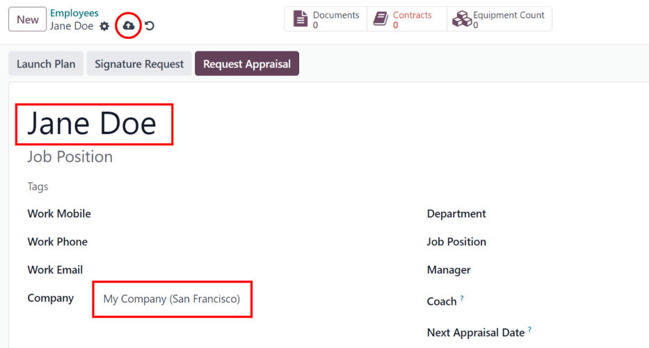
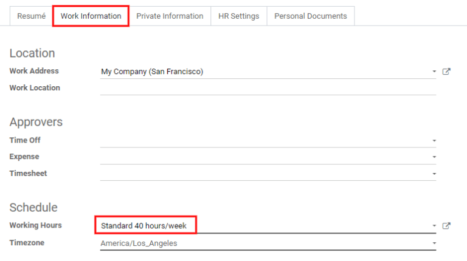
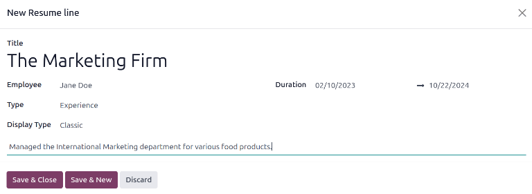
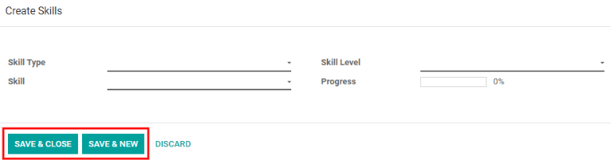
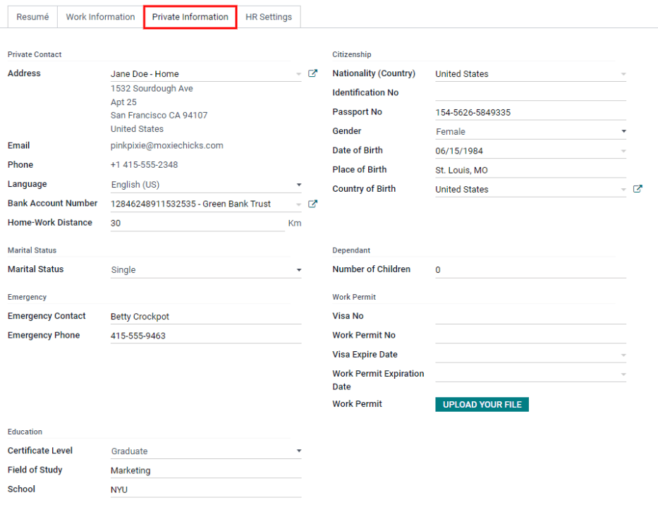
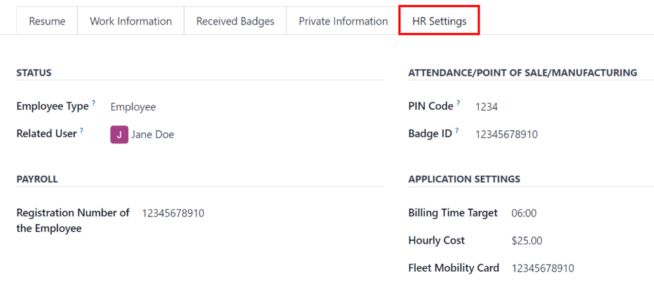
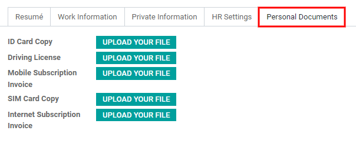

==================
Add a new employee
==================

When a new employee is hired, the first step is to create a new employee form. Starting in the
:menuselection:`Employees` app default view, click the :guilabel:`Create` button to access a new
employee form. Fill out the required information (underlined in bold) and any additional details,
then click :guilabel:`Save`.

.. note::
   The current company phone number and name is populated in the :guilabel:`Work Phone` and
   :guilabel:`Company` fields.

General information
===================

Required fields
---------------

- :guilabel:`Name`: Enter the employee's name.
- :guilabel:`Company`: Select the company from the drop-down menu that the new employee is hired by,
  or create a new company by typing the name in the field.
- :guilabel:`Working Hours`: In the :guilabel:`Work Information` tab, select the desired
  :guilabel:`Working Hours` from the drop-down menu.

.. note::
   :guilabel:`Working Hours` are related to a company's working times, and an employee cannot have
   working hours that are outside of a company's working times.

   Each individual working time is company-specific, so for multi-company databases, each company
   needs to have its own working hours set.

   If an employee's working hours are not configured as a working time for the company, new working
   times can be added, or existing working times can be modified. To add or modify a working time,
   go to the :menuselection:`Payroll app --> Configuration --> Working Times`, and add a new working
   time or edit an existing one.

   After the new working time is created, set the working hours for the employee.

Optional fields
---------------

- :guilabel:`Photo`: In the top right image box of the employee card, click on the :guilabel:`✏️
  (pencil)` edit icon to select a photo to upload.
- :guilabel:`Job Position`: Enter the employee's job position title.
- Tags: Click on a tag in the drop-down menu to add any tags applicable to the employee. Any tag can
  be created in this field by typing it in. Once created, the new tag is available for all employee
  cards. There is no limit to the amount of tags that can be added.
- Work Contact Information: Enter the employees :guilabel:`Work Mobile`, :guilabel:`Work Phone`,
  :guilabel:`Work Email`, and/or :guilabel:`Company` name.
- :guilabel:`Department`: Select the employee's department from the drop-down menu.
- :guilabel:`Manager`: Select the employee's manager from the drop-down menu.
- :guilabel:`Coach`: Select the employee's coach from the drop-down menu.

.. note::
   After a :guilabel:`Manager` is selected, if the :guilabel:`Coach` field is blank, the selected
   manager automatically populates the :guilabel:`Coach` field.

.. tip::
   To make edits to the selected :guilabel:`Department`, :guilabel:`Manager`, :guilabel:`Coach`, or
   :guilabel:`Company`, click the :guilabel:`External Link` button next to the respective selection.
   The :guilabel:`External Link` button opens the selected form, allowing for modifications. Click
   :guilabel:`Save` after any edits are made.

Additional information tabs
===========================

Resumé tab
----------

Resumé
~~~~~~

Next, the employee's work history is entered in the :guilabel:`Resumé` tab. Each previous experience
must be entered individually. Click :guilabel:`Create a New Entry`, and the :guilabel:`Create Resumé
lines` form appears. Enter the following information, then click the :guilabel:`Save & Close` button
if there is only one entry to add, or click the :guilabel:`Save & New` button to save the current
entry and create another line.

- :guilabel:`Name`: Type in the name of the previous work experience.
- :guilabel:`Type`: From the drop-down menu, select either :guilabel:`Experience`,
  :guilabel:`Education`, :guilabel:`Internal Certification`, :guilabel:`Internal Training`, or type
  in a new entry.
- :guilabel:`Display Type`: Select either :guilabel:`Classic`, :guilabel:`Certification`, or
  :guilabel:`Course` from the drop-down menu.
- :guilabel:`Date Start` and :guilabel:`Date End`: Enter the start and end dates for the work
  experience. To select a date, use the :guilabel:`< (left)` and :guilabel:`> (right)` arrow icons
  to scroll to the desired month, then click on the day to select it.
- :guilabel:`Description`: Enter any relevant details in the field.

Skills
~~~~~~

An employee's skills can be entered in the :guilabel:`Resumé` tab in the same manner a resumé line
is created. Click the :guilabel:`Create a New Entry` button under :guilabel:`Skills` and a
:guilabel:`Create Skills` form appears. Fill in the information, then click the :guilabel:`Save &
Close` button if there is only one entry to add, or click the :guilabel:`Save & New` button to save
the current entry and immediately create a new entry.

- :guilabel:`Skill Type`: Select from the drop-down menu either :guilabel:`Languages`,
  :guilabel:`Dev`, :guilabel:`Music`, :guilabel:`Marketing`, or type in a new skill type. After
  entering the new skill type, an option to :guilabel:`Create` the skill or :guilabel:`Create and
  Edit` the skill appears. Click :guilabel:`Create and Edit`, and a pop-up for the specific skill
  type appears. This can also be accessed with the :guilabel:`External Link` button next to the new
  skill. This form allows for the creation of specific skills and levels. Click :guilabel:`Add a
  line` and enter the information for the new skill, then repeat for all other added skills. Repeat
  this process for the :guilabel:`Levels` section. Click :guilabel:`Add a line` to add each level
  and progress.

  .. image:: new_employee/new-skills.png
     :align: center
     :alt: Add a new skill and levels.

  .. example::
     To add a math skill set, enter `Math` in the :guilabel:`Name` field. In the :guilabel:`Skills`
     field, enter `Algebra`, `Calculus`, and `Trigonometry`. And, in the :guilabel:`Levels` field
     enter `beginner`, `intermediate`, and `expert`. Then, either click :guilabel:`Save & Close` or
     :guilabel:`Save & New`.

- :guilabel:`Skill`: The corresponding skills associated with the selected :guilabel:`Skill Type`
  appear in a drop-down menu. For example, selecting :guilabel:`Language` as the :guilabel:`Skill
  Type` presents a variety of languages to select from under the :guilabel:`Skills` field. Select
  the appropriate pre-configured skill, or type in a new one.
- :guilabel:`Skill Level`: Pre-defined skill levels associated with the selected :guilabel:`Skill
  Type` appear in a drop-down menu. Select a level or create a new skill level by typing it in.
- :guilabel:`Progress`: Progress is automatically selected based on the selected :guilabel:`Skill
  Level`. Skill levels and progress can be modified in the :guilabel:`Skill Type` pop-up form, which
  is accessed via the :guilabel:`External Link` button next to :guilabel:`Skill Type` field.

To delete any line from the :guilabel:`Resumé` tab, click the :guilabel:`🗑️ (trash can)` delete icon
to delete the entry. Add a new line by clicking the :guilabel:`ADD` button next to the corresponding
section.

Work information tab
--------------------

- :guilabel:`Location`: Select the :guilabel:`Work Address` from the drop-down menu. The
  :guilabel:`External Link` button opens up the selected company form in a window, and allows for
  editing. The :guilabel:`Work Location` is where any specific location details should be noted,
  such as a floor, or building.
- :guilabel:`Approvers`: Using the drop-down menus, select the employees responsible for approving
  :guilabel:`Time Off`, :guilabel:`Expenses`, and :guilabel:`Timesheets` for the employee. The
  :guilabel:`External Link` button opens a form with the approver's :guilabel:`Name`,
  :guilabel:`Email Address`, :guilabel:`Company`, :guilabel:`Phone`, and :guilabel:`Mobile` fields.
  These can be modified, if needed. Click :guilabel:`Save` after making any edits.
- :guilabel:`Schedule`: Select the :guilabel:`Working Hours` (required) and :guilabel:`Timezone` for
  the employee. The :guilabel:`External Link` button opens up a detailed view of the specific daily
  working hours. Working hours can be created, modified, or deleted here. Global time off (such as
  holidays) can be entered in the :guilabel:`Global Time Off` tab. Click :guilabel:`Add a line` to
  add a new global time off.
- :guilabel:`Planning`: Click on a planning role from the drop-down menu for both the
  :guilabel:`Default Planning Role` and the :guilabel:`Planning Roles` fields to add a role. There
  is no limit to the amount of :guilabel:`Planning Roles` that can be selected for an employee, but
  there can only be one :guilabel:`Default Planning Role`. The default is the *typical* role that
  the employee performs, where the :guilabel:`Planning Roles` are *all* the specific roles the
  employee is able to perform.

  .. image:: new_employee/work-info.png
     :align: center
     :alt: Add the work information to the Work Information tab.

Private information tab
-----------------------

No information in the :guilabel:`Private Information` tab is required, however, some information in
this section may be critical for the company's payroll department. In order to properly process
payslips and ensure all deductions are accounted for, the employee's personal information should be
entered.

Here, the employee's :guilabel:`Private Contact`, :guilabel:`Marital Status`, :guilabel:`Emergency
Contact`, :guilabel:`Education`, :guilabel:`Citizenship`, :guilabel:`Dependant`, and :guilabel:`Work
Permit` information is entered. Fields are entered either using a drop-down menu, clicking a check
box, or typing in the information.

- :guilabel:`Private Contact`: Enter the :guilabel:`Address` for the employee. The selection can be
  made with the drop-down menu. If the information is not available, type in the name for the new
  address. To edit the new address, click the :guilabel:`External Link` button to open the address
  form. On the address form, enter the necessary details, then click :guilabel:`Save`. Some other
  information in the :guilabel:`Private Contact` section may auto-populate, if the address is
  already listed in the drop-down menu.
- :guilabel:`Marital Status`: Select either :guilabel:`Single`, :guilabel:`Married`,
  :guilabel:`Legal Cohabitant`, :guilabel:`Widower`, or :guilabel:`Divorced` from the drop-down
  menu.
- :guilabel:`Emergency Contact`: Type in the name and phone number of the employee's emergency
  contact.
- :guilabel:`Education`: Select the highest level of education completed by the employee from the
  :guilabel:`Certificate Level` drop-down menu. Options include :guilabel:`Graduate`,
  :guilabel:`Bachelor`, :guilabel:`Master`, :guilabel:`Doctor`, or :guilabel:`Other`. Type in the
  :guilabel:`Field of Study`, and the name of the :guilabel:`School` in the respective fields.
- :guilabel:`Citizenship`: This section houses all the information relevant to the citizenship of
  the employee. Some selections use a drop-down menu, as does the :guilabel:`Nationality (Country)`,
  :guilabel:`Gender`, and :guilabel:`Country of Birth` sections. The :guilabel:`Date of Birth` uses
  a calendar module to select the date. First, click on the name of the month, then the year, to
  access the year ranges. Use the :guilabel:`< (left)` and :guilabel:`> (right)` arrow icons,
  navigate to the correct year range, and click on the year. Next, click on the month. Last, click
  on the day to select the date. Type in the information for the :guilabel:`Identification No`,
  :guilabel:`Passport No`, and :guilabel:`Place of Birth` fields. If the employee is
  :guilabel:`Disabled` or a :guilabel:`Nonresident`, click the check box next to the respective
  fields.
- :guilabel:`Dependant`: If the employee has any dependants, that information is entered here. Type
  in the number of children the employee has, and check the boxes next to :guilabel:`Disabled
  Children` and/or :guilabel:`Other Dependent People` if applicable.
- :guilabel:`Work Permit`: If the employee has a work permit, enter the information in this section.
  Type in the :guilabel:`Visa No` and/or :guilabel:`Work Permit No` in the corresponding fields.
  Using the calendar module, select the :guilabel:`Visa Expire Date` to enter the expiration date.

HR settings tab
---------------

This tab provides various fields for different information, depending on the country the company is
located. Different fields are configured for different locations, however some sections appear
regardless.

- :guilabel:`Status`: If applicable, select a :guilabel:`Related User`, :guilabel:`Job Position`,
  and :guilabel:`Language` with the drop-down menus. Type in the :guilabel:`Registration Number of
  the Employee`, and the :guilabel:`NIF Country Code` if available.
- :guilabel:`Fleet`: If the employee has access to a company car, enter the :guilabel:`Mobility
  Card` information here.
- :guilabel:`Timesheets`: Enter the employee's cost per hour in a $XX.XX format. This is factored in
  when the employee is working at a work center. This value affects the employee's pay, and may also
  affect manufacturing costs for a product, if the value of the manufactured product is not a fixed
  amount.
- :guilabel:`Attendance`: This section may only appear for Belgian companies. Enter the
  :guilabel:`INSZ or BIS` number if applicable. :guilabel:`Badge ID` and a :guilabel:`PIN Code` can
  be entered here, if the employee needs/has one. Click :guilabel:`Generate` next to the
  :guilabel:`Badge ID` to create a badge ID.

Personal documents tab
----------------------

The :guilabel:`Personal Documents` tab is only displayed for certain countries. If this tab is not
visible, it is not applicable to the company's location.

Add a file for the employee's :guilabel:`ID Card Copy`, :guilabel:`Driving License`,
:guilabel:`Mobile Subscription Invoice`, :guilabel:`SIM Card Copy`, and :guilabel:`Internet
Subscription Invoice` by clicking the :guilabel:`Upload Your File` button next to the corresponding
field. File types that can be accepted are :file:`.jpg`, :file:`.png`, and :file:`.pdf`.

         png, or pdf.
