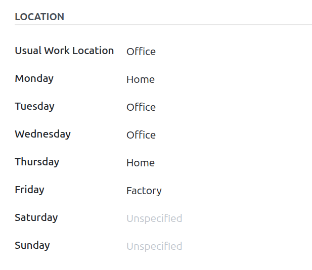
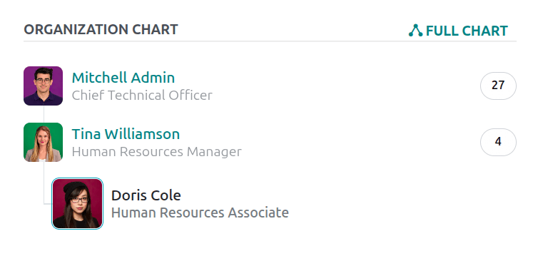
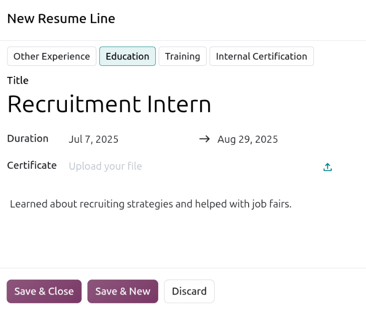
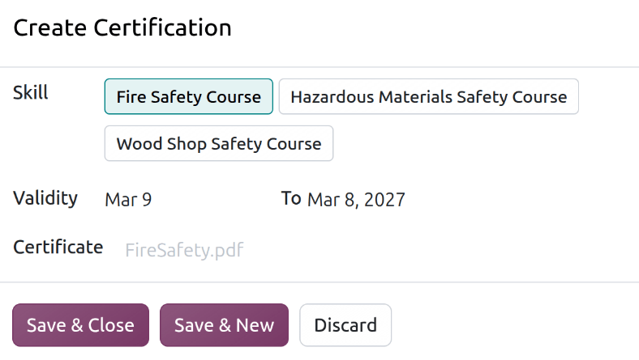
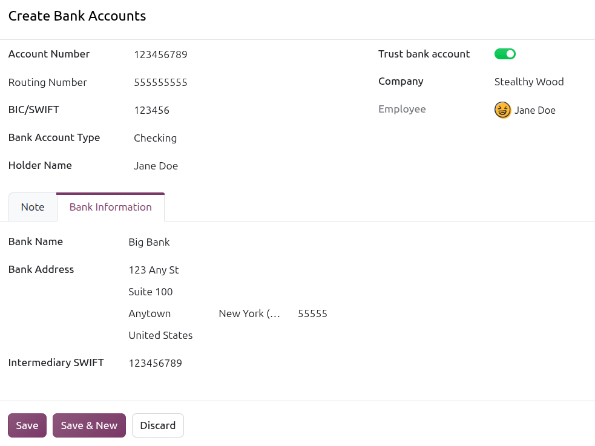
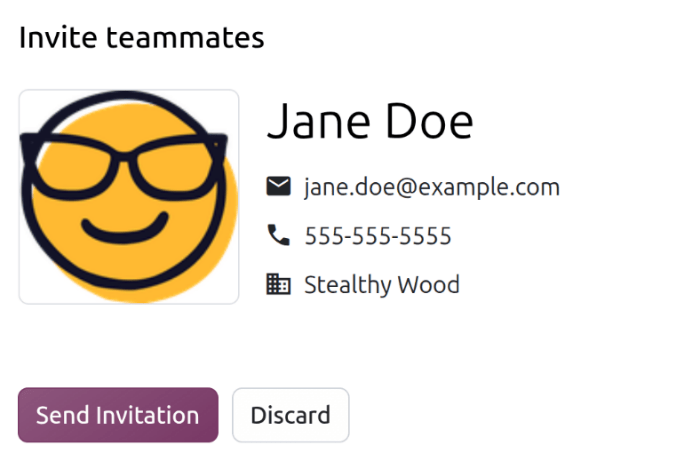

=============
New employees
=============

When a new employee is hired, the first step is to create a new employee record. This record is a
centralized place where all important information about the employee is stored, including
:ref:`general information <employees/general-info>`, :ref:`job history and skills
<employees/resume>`, :ref:`various work information <employees/work-info-tab>`, :ref:`personal
details <employees/private-info>`, :ref:`payroll-related information <employees/payroll>`, and
various :ref:`settings <employees/hr-settings>` that affect integrations with other apps in the
database.

To begin, open the :menuselection:`Employees` app, then click the :guilabel:`New` button in the
corner. Doing so reveals a blank employee form.

Proceed to fill out the required information, along with any additional details.

.. tip::
   The employee form automatically saves as data is entered. However, the form can be saved manually
   at any time by clicking the :icon:`fa-cloud-upload` :guilabel:`(Save manually)` icon.

.. important::
   **All** employee records are considered :ref:`light users <access-rights/roles>` and incur any
   corresponding fees. For more information, refer to `Odoo's billing page
   <https://www.odoo.com/pricing>`_.

.. _employees/general-info:

General information
===================

Fill out the following employee details in the top section of the employee form.

- :guilabel:`Employee's Name`: Enter the employee's name. This field is required.
- :icon:`fa-envelope` :guilabel:`(Work Email)`: Enter the employee's work email address.
- :icon:`fa-phone` :guilabel:`(Work Phone)`: Enter the employee's work phone number.
- :icon:`fa-mobile` :guilabel:`(Work Mobile)`: Enter the employee's work mobile number.
- :icon:`fa-tag` :guilabel:`(Tags)`: Select any tags from the drop-down menu to add relevant tags to
  the employee. Any tag can be created in this field by typing it in. Once created, the new tag is
  available for all employee records. There is no limit to the amount of tags that can be added on
  an employee form.
- :guilabel:`Photo`: Upload a photo of the employee in the photo placeholder.

.. image:: new_employee/gen-info.png
   :alt: The top-half of a new employee form, all filled out.

.. _employees/payroll:

Payroll tab
===========

Depending on the installed :doc:`payroll localization <../payroll/payroll_localizations>`, the
sections and fields in this tab may vary considerably. Due to the specific nature of localizations
and the variety of information that may be requested in this tab, it is recommended to check with
the accounting department to fill out this section correctly.

The *Contract overview* and *Schedule* sections are the **only** universal sections for all payroll
localizations. All other sections in the *Payroll* tab are country-specific.

.. seealso::
   :doc:`Payroll localizations <../payroll/payroll_localizations>`

Contract overview
-----------------

This section contains all the various details from the employee contract. Refer to the
:doc:`contracts <../payroll/contracts>` document for detailed information on creating and modifying
employee contracts.

.. _employees/schedule:

Schedule
--------

This section defines when the employee is expected to work. Configure the following fields:

- :guilabel:`Working Hours`: Select the hours the employee is expected to work, using the drop-down
  menu. By default, a :guilabel:`Standard 40 hours/week` working schedule is selected. If the
  **Timesheets** app is installed, an :guilabel:`Appointment Resource Default Calendar` option is
  also available.

  To view and modify the specific daily working hours, click the :icon:`oi-arrow-right`
  :guilabel:`(Internal link)` arrow at the end of the :guilabel:`Working Hours` line. Working hours
  can be modified or deleted here.

  .. note::
    :guilabel:`Working Hours` are related to a company's working schedules, and an employee
    **cannot** have working hours that are outside of a company's working schedule.

    Each individual working schedule is company-specific. For multi-company databases, each company
    **must** have its own working hours set.

    If an employee's working hours are not configured as a working schedule for the company, new
    working schedules can be added, or existing working schedules can be modified.

    Working hours can be modified in both the **Employees** and **Payroll** apps, where they are
    referred to as :guilabel:`Working Schedules`.

    For more information on how to create or modify :guilabel:`Working Schedules`, refer to the
    :doc:`working schedules <../payroll/working_schedules>` documentation.

    After the new working hours are created, or an existing one is modified, the :guilabel:`Working
    Hours` can be selected on the employee form.

  .. seealso::
     :doc:`Working hours <working_hours>`

- :guilabel:`Attendance Based`: Click this checkbox to have payslips created using the employee's
  badge records when signing in and out of work in an :ref:`attendance kiosk
  <attendances/kiosk-mode-entry>`. If left unchecked, Odoo uses the employee's selected
  :guilabel:`Working Hours` to create work entries when processing payroll.

Payslip adjustments tab
=======================

This *Payslip Adjustments* tab houses **all** additional payslip adjustments, including :doc:`salary
adjustments <../payroll/salary_attachments>`, child support, commissions, tips, bonuses, expense
reimbursements, and any other deduction taken out of the employee's paycheck.

Add each individual :ref:`payslip adjustment <payroll/salary_attachments/create>` to this tab.

.. _employees/work-info-tab:

Work tab
========

This tab is visible for all employees, and does not require any other apps to be installed.

Work
----

- :guilabel:`Company`: Select the company the new employee was hired by using the drop-down menu.
  This field is required, but only appears when in a multi-company database.
- :guilabel:`Department`: Select the employee's department from the drop-down menu.
- :guilabel:`Job Position`: Select the employee's job position from the drop-down menu. If using the
  **Recruitment** app, this list reflects configured job positions.
- :guilabel:`Job Title`: This field is automatically populated with the selection made in the
  :guilabel:`Job Position` field. Adjust the text, if desired, to best reflect the employee's role.

  .. example::
     Specific details can be added in the :guilabel:`Job Title` field, if desired.

     For example, a sales representative position configured as :guilabel:`Sales Associate` in the
     **Recruitment** app can be selected for the :guilabel:`Job Position` field.

     The :guilabel:`Job Title` field can be more specific, such as `Sales Associate - Europe` if the
     employee is focused solely on European sales.

     .. image:: new_employee/job-title-fields.png
        :alt: Both job position fields entered but with different information.

- :guilabel:`Manager`: Select the employee's manager using the drop-down menu.
- :guilabel:`Next Appraisal Date`: If the **Appraisals** app is installed, this field displays the
  next scheduled appraisal for the employee. This field is set to six months from the employee's
  contract date, by default.

Location
--------

This section states where the employee is expected to work on any given workday.

Using the drop-down menu, select the typical place the employee works from in the :guilabel:`Usual
Work Location` field. The default options are :icon:`fa-home` :guilabel:`Home`, :icon:`fa-building`
:guilabel:`Office`, or :icon:`fa-map-marker` :guilabel:`Other`. This field is **required**.

.. tip::
   To create a new location, type the location in the field, click :guilabel:`Create and edit`, and
   a *Create Usual Work Location* pop-up form loads.

   The entered name populates the :guilabel:`Work Location` field, but can be modified. Select the
   :guilabel:`Work Address` using the drop-down menu. Click the corresponding button to select the
   :guilabel:`Location Type`. In a multi-company database, a :guilabel:`Company` field appears, and
   is populated with the current company by default but can be modified if needed.

   Click :guilabel:`Save` when the form is complete. The window closes, and the newly configured
   location appears in the field.

Below the :guilabel:`Usual Work Location` field is a list of the days of the week. For each day of
the work week, select where the employee works that day using the drop-down menu. The selected
location is reflected on the employee's Kanban card, indicating their location that day.

Leave the field blank (:guilabel:`Unspecified`) for non-working days, such as Saturday and Sunday.

Note
----

Enter any relevant notes in this field.

Organization chart
------------------

The related departments appear in this section, illustrating where in the company the employee
works. The numbers to the right of each person listed indicates how many direct or indirect reports
each employee has.

.. note::
   After a :guilabel:`Department` is selected, the department's configured manager automatically
   populates the :guilabel:`Manager` field.

.. _employees/resume:

Resumé tab
==========

Resumé
------

Enter the employee's work history in the *Resumé* tab. Each resumé line must be entered
individually. When creating an entry for the first time, click the :guilabel:`Create Resume Lines`
button, and a *New Resumé Line* form appears. After an entry is added, the :guilabel:`Create Resume
Lines` button is replaced with an :guilabel:`ADD` button. Enter the following information for each
entry:

- :guilabel:`Type`: Click the corresponding button to reflect the *type* of experience being added.
  The available options are :guilabel:`Other Experience`, :guilabel:`Education`,
  :guilabel:`Training`, or :guilabel:`Internal Certification`.
- :guilabel:`Title`: Type in the title from the previous work experience.
- :guilabel:`Duration`: Enter the start and end dates for the work experience using the calendar
  module in the corresponding fields.
- :guilabel:`Certificate`: If there is a relevant certificate to attach, click the :icon:`fa-upload`
  :guilabel:`(Upload)` icon, select the desired file, and click :guilabel:`Select`. The file name
  appears in the field, not an image of the certificate.
- :guilabel:`Description`: Enter any relevant details in this field.

Once all the information is entered, click the :guilabel:`Save & Close` button if there is only one
entry to add, or click the :guilabel:`Save & New` button to save the current entry and create
another resumé line.

.. note::
   After the new employee form is saved, the current position and company is automatically added to
   the *Resumé* tab, with the end date listed as `Current`.

.. _employees/skills:

Skills & certifications
-----------------------

An employee's skills and certifications can be entered in the *Resumé* tab in the same manner that a
resumé line is created.

To add a skill to an employee record, the skill type must first be configured. By default, Odoo
comes with two :guilabel:`Skill Types` preconfigured: *Languages* and *Soft Skills*.
:ref:`Configure the rest of the skill types <employees/skill-types>` before adding any skills to the
employee record.

When adding the first skill to an employee record, a :guilabel:`Pick a skill from the list` button
appears in the *Skills* section of the *Resumé* tab. Click the :guilabel:`Pick a skill from the
list` button, and a blank *Update Skills* pop-up window loads. Configure the following information
for each skill:

- :guilabel:`Category`: Select a :ref:`skill type <employees/skill-types>` by clicking it.
- :guilabel:`Skill`: After selecting the :guilabel:`Category`, all corresponding skills associated
  with that selected category appear in individual buttons. For example, selecting
  :guilabel:`Languages` for the :guilabel:`Category` presents a variety of languages to select from
  in the :guilabel:`Skill` section. Click the appropriate skill from the list.

  .. important::
     If the desired skill does not appear in the list, it is **not** possible to add the new skill
     from this window. New skills must be added from the :ref:`Skill Types <employees/skill-types>`
     dashboard.

- :guilabel:`Skill Level`: Pre-defined skill levels associated with the selected
  :guilabel:`Category` appear. Click on a :guilabel:`Skill Level` to select it. Skill levels can be
  created and modified from the :ref:`Skill Types <employees/skill-types>` dashboard.

Click the :guilabel:`Save & Close` button if there is only one skill to add, or click the
:guilabel:`Save & New` button to save the current entry and immediately add another skill.

At any point, a new line can be added by clicking the :guilabel:`Add` button.

.. image:: new_employee/skills.png
   :alt: A skill form with the information filled out.

.. important::
   Only users with :guilabel:`Officer: Manage all employees` or :guilabel:`Administrator` rights for
   the **Employees** app can add or edit skills.

.. _employees/skill-types:

Skill types
~~~~~~~~~~~

To add a skill to an employee's form, the :guilabel:`Skill Types` must be configured. Navigate to
:menuselection:`Employees app --> Configuration --> Skill Types` to view the currently configured
skill types and create new skill types.

.. note::
   The default skill of :guilabel:`Languages` is preconfigured with twenty-one skills, and the
   default :guilabel:`Soft Skills` is preconfigured with fifteen skills.

Click the :guilabel:`New` button in the corner, and a new *Skill Type* form loads. Fill out the
following details for the new skill type. Repeat this for all the needed skill types.

- :guilabel:`Skill Type`: Enter a name for the type of skill. This acts as the parent category for
  more specific skills and should be generic.
- :guilabel:`Color`: Click on the existing color to view the available colors. Click the desired
  color to select it.
- :guilabel:`Certification`: Click the toggle to indicate the skill is a certification. The toggle
  turns green, indicating it is active and the skill can be added to the :ref:`certifications
  <employees/certifications>` tab.
- :guilabel:`Skills`: Click :guilabel:`Add a line` and enter the :guilabel:`Name` for the new skill,
  then repeat for all other needed skills.
- :guilabel:`Levels`: Click :guilabel:`Add a line`, and enter a :guilabel:`Name` and
  :guilabel:`Progress` percentage (`0`-`100`) for each level.

  Set a :guilabel:`Default Level` by clicking the toggle on the desired line. Only **one** level
  can be selected. The toggle turns green to indicate the default level. Typically, the lowest level
  is chosen, but any level can be selected.

  .. example::
     To add math skills in yellow, enter `Math` in the :guilabel:`Skill Type` field, and click the
     colored circle next to :guilabel:`Color`, and select yellow. Then, in the :guilabel:`Skills`
     field, enter `Algebra`, `Calculus`, and `Trigonometry`. Next, in the :guilabel:`Levels` field,
     enter `Beginner`, `Intermediate`, and `Expert`, with the :guilabel:`Progress` listed as `25`,
     `50`, and `100`, respectively. Click :guilabel:`Set Default` on the `Beginner` line to set this
     as the default skill level.

     .. image:: new_employee/math-skills.png
        :alt: A skill form for a Math skill type, with all the information entered.

.. tip::
   Once the form is completely filled out, click the :icon:`fa-cloud-upload` :guilabel:`(Save
   manually)` icon at the top of the screen, and the :guilabel:`Levels` rearrange in descending
   order, with the highest level at the top, and the lowest at the bottom, regardless of the default
   level and the order they were entered.

.. _employees/certifications:

Certifications tab
==================

This tab houses all the employee's certifications, which can be important for employees who are
required to hold specific certifications to perform their job, such as a :abbr:`CPA (Certified
Public Accountant)` certification for accountants, or a :abbr:`CSM (Certified Safety Manager)`
certification for a construction manager.

The tab lists each :guilabel:`Certification` in a line, and displays the validity period in the
:guilabel:`From` and :guilabel:`To` fields.

.. note::
   This tab **only** appears if *at least one* :ref:`skill type <employees/skill-types>` is
   configured as a *certification*. When adding certifications, **only** skill types marked as a
   certification can be selected.

To add a certification, click :guilabel:`Add a line` in the *Certifications* tab and a blank *Create
Certification* pop-up window loads. Enter the following information on the form:

- :guilabel:`Skill`: Click on the specific certification being added.
- :guilabel:`Validity`: Click into the two fields, and select the start and end dates for the
  certification, using the calendar selector.
- :guilabel:`Certificate`: If a proof of certification document is available, such as a course
  completion certificate, it can be added in this field. Click the :icon:`fa-upload`
  :guilabel:`(Upload)` icon, navigate to the file, and click :guilabel:`Select`.

When the form is complete, click :guilabel:`Save & New` to add the certification and add another, or
:guilabel:`Save & Close` to add the certification and close the pop-up window.

.. _employees/private-info:

Personal tab
============

No information in the *Personal* tab is required to create an employee. However, some information in
this section may be necessary for the company's payroll department.

To properly process payslips and ensure all deductions are accounted for, it is recommended to check
with the accounting department and payroll department to ensure all required fields are populated.
For example, to pay employees with direct deposit, they **must** have a trusted account listed in
the :guilabel:`Bank Accounts` field.

Enter the various information in the following sections and fields of the *Personal* tab. Fields are
entered either using a drop-down menu, clicking a checkbox, or typing in the information.

.. note::
   Depending on the localization setting, other fields or sections may be present.

.. _employees/private-contact:

Private contact
---------------

Fill out the following fields in this section:

- :guilabel:`Email`: Enter the employee's personal email address.
- :guilabel:`Phone`: Enter the employee's personal phone number.
- :guilabel:`Bank Accounts`: Enter the bank account number using the drop-down menu. If the bank
  account does not exist, :ref:`create a new bank account <employees/add-bank>` and select it.

.. _employees/add-bank:

Add a bank account
~~~~~~~~~~~~~~~~~~

When an employee is added to the database, their bank account must also be added to pay them using
the **Payroll** app. To add a new bank account, click into the :guilabel:`Bank Accounts` field in
the *Private Contact* section, then click :guilabel:`Create`.

A blank *Create Bank Accounts* pop-up window loads. Enter the following information on the form:

- :guilabel:`Account Number`: Enter the bank account number in this field.
- :guilabel:`Clearing Number`: The default name for this field is :guilabel:`Clearing Number` but
  may be different depending on the installed :doc:`payroll localization
  <../payroll/payroll_localizations>`. Using the drop-down menu, select the country-specific name
  for this field. For example, the United States displays :guilabel:`Routing Number` while the
  United Kingdom displays :guilabel:`Sort Code`. Next, enter the corresponding code in this field.
- :guilabel:`BIC/SWIFT`: Enter the Bank Identifier Code in this field. This is used for
  international wire transfers.
- :guilabel:`Bank Account Type`: Select the kind of account being added. The options are
  :guilabel:`Checking` or :guilabel:`Savings`.
- :guilabel:`Holder Name`: Enter the account holder's name in this field.
- :guilabel:`Trust bank account`: Click the toggle so it appears green, indicating it is a trusted
  bank account.
- :guilabel:`Company`: This field only appears in a multi-company environment. Select a company to
  restrict the bank account to be used **only** with the selected company. Leaving this field blank
  makes this information visible to all companies.
- :guilabel:`Employee`: The employee record the bank account is being added to automatically appears
  in this field and **cannot** be modified.
- *Note* tab: Enter any relevant notes in the *Note* tab.
- *Bank Information* tab: Enter the :guilabel:`Bank Name`, :guilabel:`Bank Address`, and the
  :guilabel:`Intermediary SWIFT` code in the corresponding fields.

.. important::
   To ensure payments are processed and sent to the bank account, mark the bank account as
   :guilabel:`Trusted`. Having an untrusted bank account for an employee causes an error in the
   **Payroll** application when processing direct deposits.

   If issuing paper checks or paying via cash, the :guilabel:`Bank` field does not need to be
   configured.

Personal information
--------------------

The *Personal Information* section houses some basic information used primarily for payroll and tax
purposes. Fill out the following fields in this section:

- :guilabel:`Legal Name`: Enter the employee's legal name in this field. By default, the name
  entered in the :ref:`general information section <employees/general-info>` populates this field.
  This is the name that typically is used for filing taxes.
- :guilabel:`Birthday`: Select the birthday of the employee using the calendar selector.
- :guilabel:`Place of Birth`: Enter both the city or town the employee was born in the first field,
  and select the country in the second field using the drop-down menu.
- :guilabel:`Sex`: Select the employee's legal sex recognized by the state from the drop-down menu.
  The default options are :guilabel:`Male` and :guilabel:`Female`.
- :guilabel:`Disabled`: Check this box if the employee is considered legally disabled.
- :guilabel:`Payslip Language`: Select the language used when printing the employee's payslips.
  Each language must be :doc:`added to the database <../../general/users/language>` to appear in the
  drop-down menu.

Citizenship
-----------

The *Citizenship* section outlines all the information relating to the employee's citizenship. This
section is primarily for employees who are working in a different country than their citizenship.
For employees working outside of their home country, for example on a work visa, this information
may be required. Different fields may be visible, depending on the localization installed. Fill out
the following fields in this section:

- :guilabel:`Nationality (Country)`: Select the country the employee is from using the drop-down
  menu.
- :guilabel:`Non-resident`: Click this checkbox if the employee is not a legal resident of the
  country where they are employed.
- :guilabel:`Identification No`: Enter the employee's national identification number issued by the
  government in this field. Some examples are Aadhaar, :abbr:`SIN (Social Insurance Number)`,
  :abbr:`SSN (Social Security Number)`, or :abbr:`NIN (National Identification Number)`.
- :guilabel:`Passport No`: Enter the employee's passport number.

.. note::
   Depending on the installed :doc:`payroll localization <../payroll/payroll_localizations>`,
   additional fields may appear in this section.

Visa & work permit
------------------

This section should be filled in if the employee is working on some type of work permit or visa.
This section may be left blank if they do not require any work permits or visas for employment.
Enter the applicable following fields in this section:

- :guilabel:`Visa No`: Enter the employee's visa number. When entered, an :guilabel:`Expires on`
  field appears. Select the date the visa expires using the calendar selector.
- :guilabel:`Work Permit No`: Enter the employee's work permit number. When entered, an
  :guilabel:`Expires on` field appears. Select the date the work permit expires using the calendar.
- :guilabel:`Document`: click the :icon:`fa-upload` :guilabel:`(Upload)` icon, then navigate to the
  work permit or visa file in the file explorer, and click :guilabel:`Select` to upload it.

  .. note::
     Typically, an employee needs either a visa *or* a work permit, not both. For this reason, only
     one document can be added to the :guilabel:`Document` field.

Emergency contact
-----------------

This section details the person to contact in the event of an emergency. Enter the following fields:

- :guilabel:`Contact`: Enter the emergency contact's name.
- :guilabel:`Phone`: Enter the emergency contact's phone number. It is recommended to enter a phone
  number that the person has the most access to, typically a mobile phone.

.. _employees/location:

Location
--------

The *Location* section is visible for all employees, and does not require any other apps to be
installed for this section to be visible. Enter the following information in this section:

- :guilabel:`Private Address`: Enter the employee's current home address in this field.
- :guilabel:`Home-Work Distance`: Enter the number of miles or kilometers the employee commutes to
  work, in one direction. The unit of measure can be changed from kilometers (:guilabel:`km`) to
  miles (:guilabel:`mi`) using the drop-down menu. This field is **only** required if the employee
  is receiving any type of commuter benefits or tax deductions based on commute distances.

Family
------

The *Family* section is used for tax purposes and affects the **Payroll** app. Enter the following
information in the following fields:

- :guilabel:`Marital Status`: Select the marital status for the employee using the drop-down menu.
  The default options are :guilabel:`Single`, :guilabel:`Married`, :guilabel:`Legal Cohabitant`,
  :guilabel:`Widower`, and :guilabel:`Divorced`.

  If :guilabel:`Married` or :guilabel:`Legal Cohabitant` is selected, two additional fields appear:
  :guilabel:`Spouse Legal Name` and :guilabel:`Spouse Birthdate`. Enter these fields with the
  respective information.
- :guilabel:`Dependent Children`: Enter the number of dependent children. This number is the same
  number used for calculating tax deductions, and should follow all tax regulations regarding
  applicable dependents.

Education
---------

The *Education* section allows for only one entry, and should be populated with the highest degree
the employee has earned. Configure the following fields:

- :guilabel:`Certificate Level`: Select the highest degree the employee has earned using the
  drop-down menu. The default options are: :guilabel:`Graduate`, :guilabel:`Bachelor`,
  :guilabel:`Master`, :guilabel:`Doctor`, and :guilabel:`Other`.
- :guilabel:`Field of Study`: Type in the subject the employee studied, such as `Business` or
  `Marketing and Communications`.

Documents
---------

The *Documents* section allows for uploading any relevant documents on the employee form. Click the
:icon:`fa-upload` :guilabel:`(Upload)` icon next to the corresponding document name, navigate to the
file, then click :guilabel:`Select` to upload the file.

The documents that can be uploaded are:

- :guilabel:`ID Card Copy`: Upload any relevant IDs that may be required by the payroll or HR
  department.
- :guilabel:`Driving License`: Upload the employee's driver's license. This field may be necessary
  if the employee drives as part of their job, or is given a company car to use.
- :guilabel:`SIM Card Copy`: Upload a copy of the SIM card if the employee is using a work-issued
  mobile phone.
- :guilabel:`Internet Subscription Invoice`: If the employee is receiving benefits or compensation
  for their internet service, upload their invoice in this field.

  .. note::
     The :guilabel:`Internet Subscription Invoice` field is for documentation purposes only.
     Employees must use the :doc:`Expenses app <../../finance/expenses>` to request reimbursement
     for expenses, or define compensation in the *Payslip Adjustments* tab.

Badges tab
==========

The *Badges* tab is where all earned and awarded :doc:`badges <badges>` are housed.

.. _employees/hr-settings:

Settings tab
============

The *Settings* tab provides various fields for different applications within the database. Depending
on the installed applications, different fields and sections may appear in this tab.

User
----

- :guilabel:`User`: If desired, select a user in the database to link to this employee using the
  drop-down menu, or :ref:`create a new user <employees/new-user>`.
- :guilabel:`Timezone`: Select the timezone for the employee using the drop-down menu.

.. _employees/new-user:

Create a user
~~~~~~~~~~~~~

If the new employee also needs access to the database, click into the drop-down menu next to the
:guilabel:`User` field. Click :icon:`fa-envelope-o` :guilabel:`Invite teammates via email` and an
*Invite teammates* pop-up window appears.

The employee name populates the :guilabel:`Name` field by default. The :guilabel:`Email Address`,
:guilabel:`Phone`, :guilabel:`Company`, and :guilabel:`photo` fields are populated with the
corresponding fields from the :ref:`general information <employees/general-info>` section of form.

Click the :guilabel:`Send Invitation` button, an email is sent, and a notification briefly appears.

Once the user is created, it populates the :guilabel:`User` field.

.. tip::
   Users can also be :doc:`created manually <../../general/users/>`.

.. _employees/approvers:

Approvers
---------

To view this section, the user must have :guilabel:`Administrator` rights set for the **Employees**
app. For the category to appear, the respective app must be installed. For example, if the **Time
Off** app is not installed, the :guilabel:`Time Off` approvers field does not appear. Only one
selection can be made for each field.

.. important::
   Only users with *Administrator* rights for the corresponding human resources role appear in the
   drop-down menu.

   To check these rights, navigate to :menuselection:`Settings app --> Users & Companies --> Users`,
   and click on a user. Scroll to the *Human Resources* section in the *Access Rights* tab, and
   check the :guilabel:`Employees` settings.

- :guilabel:`HR Responsible`: Select the user responsible for validating the employee's contracts
  using the drop-down menu.
- :guilabel:`Expense`: Select the user responsible for approving all expenses for the employee using
  the drop-down menu.
- :guilabel:`Time Off`: Select the user responsible for approving all time off requests from this
  employee using the drop-down menu.
- :guilabel:`Timesheet`: Select the user responsible for approving all the employee's timesheet
  entries using the drop-down menu.
- :guilabel:`Attendance`: Select the user responsible for approving all attendance entries for the
  employee using the drop-down menu.

.. tip::
   If any approver field is left empty, the approval is done by an Administrator or Approver.

Planning
--------

This section is **only** visible if the **Planning** app is installed, as this section affects what
the employee can be assigned in the **Planning** app.

- :guilabel:`Roles`: Select all the roles the employee can perform using the drop-down menu. There
  are no preconfigured roles available, so all roles must be :ref:`configured in the Planning app
  <planning/roles>`. There is no limit to the number of roles assigned to an employee.
- :guilabel:`Default Role`: Select the default role the employee will typically perform using the
  drop-down menu. If the :guilabel:`Default Role` is selected before the :guilabel:`Roles` field is
  configured, the selected role is automatically added to the list of :guilabel:`Roles`.

Application settings
--------------------

This section affects the **Manufacturing** app. Enter the following information in this section.

- :guilabel:`Hourly Cost`: Enter the hourly cost for the employee, in a `##.##` format. This cost is
  factored in when the employee is working at a :doc:`work center
  <../../inventory_and_mrp/manufacturing/advanced_configuration/using_work_centers>`.

  .. note::
     Manufacturing costs are added to the costs for producing a product if the value of the
     manufactured product is **not** a fixed amount. This cost does **not** affect the **Payroll**
     application.

.. _employees/new_employee/hr-attn-pos:

Attendance/Point of Sale/Manufacturing
--------------------------------------

This section determines how employees sign in to the **Attendances**, **Point Of Sale**, and
**Manufacturing** apps, and only appears if any of those apps are installed.

- :guilabel:`PIN Code`: Enter the employee's PIN code in this field. This code is used to sign in
  and out of **Attendances** app kiosks, the **Point Of Sale** app, and the **Manufacturing** app's
  *Shop Floor* companion module.
- :guilabel:`RFID/Badge Number`: Click :guilabel:`Generate` at the end of the :guilabel:`RFID/Badge
  Number` line to create a unique number. Once generated, the number populates the
  :guilabel:`RFID/Badge Number` field, and the :guilabel:`Generate` option is hidden. Click
  :guilabel:`Print Badge` to create a PDF file of the employee's badge. The badge can be printed and
  used to log into a :abbr:`POS (point of sale)` system or :ref:`check in
  <attendances/kiosk-mode-entry>` on an **Attendances** app kiosk.

  If the employee uses an RFID token or already has an ID badge issued with a barcode, click
  :guilabel:`Read a badge` and the system allows the barcode or RFID token to be read. Once read,
  the number populates the :guilabel:`RFID/Badge Number` field.

  .. tip::
     To create a new :guilabel:`RFID/Badge Number`, delete the current number, and the
     :guilabel:`Generate` option reappears. Click :guilabel:`Generate` and a new number appears.

- :guilabel:`ZKTeco Employee ID`: If the :guilabel:`Attendances ZKTeco BioTime` module is installed,
  this field appears. Enter the ZKTeco BioTime employee ID in this field.

Export
------

This section is used when exporting data to a third party. Enter the relevant code in the
:guilabel:`External Code` field.

Invite the employee
===================

After the employee is created, click the :guilabel:`Invite` button in the top corner of the employee
record. An email is sent to the address entered in the :icon:`fa-envelope` :guilabel:`(Work Email)`
field in the :ref:`General Information <employees/general-info>` section, and a notification stating
`Notification. A signup link was sent by email` briefly appears.
