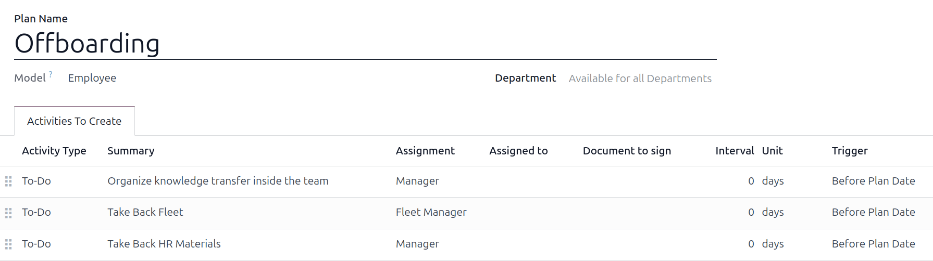
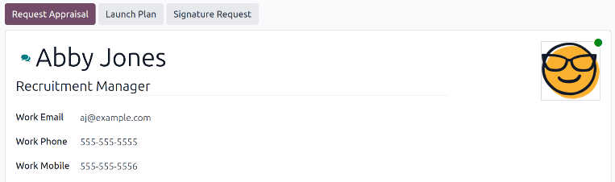
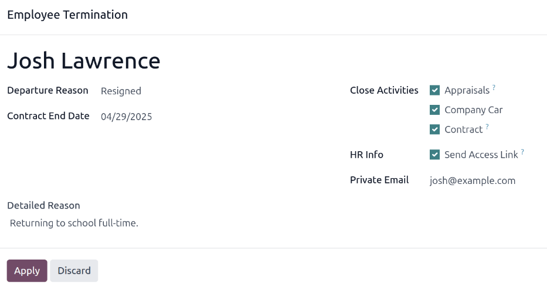

===========
Offboarding
===========

When an employee leaves the company, it is important to have an :ref:`offboarding plan
<employees/offboarding>` to ensure all necessary steps are followed, such as returning equipment,
revoking access to business systems, filling out HR forms, having an exit interview, and more.
Depending on the company, there could be several different offboarding plans, configured for
specific departments or divisions, that have different requirements and steps from the main
offboarding plan.

In addition to an offboarding plan, the employee record must be :ref:`updated to reflect their
departure <employees/archive>`, log the reason why they left, close any open activities associated
with the employee, and :ref:`provide them with any important documents <employees/send-link>`.

.. _employees/offboarding:

View offboarding plan
=====================

Before offboarding can begin, it is recommended to check the default offboarding plan that comes
preconfigured with the **Employees** app. To view the current default plan, navigate to
:menuselection:`Employees app --> Configuration --> Activity Plan`. Click :guilabel:`Offboarding` to
view the detailed offboarding plan form.

Offboarding plan steps
----------------------

The default :guilabel:`Offboarding` plan is minimal, with two default steps (three if the **Fleet**
app is installed). All steps are :guilabel:`To-Do` activities, and are scheduled for the day the
offboarding plan is launched (:guilabel:`0 days Before Plan Date`).

- :guilabel:`Organize knowledge transfer inside the team`: The manager must ensure all knowledge the
  employee has relating to their job position, is either documented or shared with colleagues so
  there is no knowledge gap.
- :guilabel:`Take Back Fleet`: The fleet manager ensures any vehicles assigned to the employee are
  either unassigned (available for other employees) or the next driver is assigned. This step only
  appears if the **Fleet** app is installed.
- :guilabel:`Take Back HR Materials`: The manager must obtain any documents and materials the HR
  department requires. It is recommended to check with the HR department to ensure everything
  required for this step is completed.

Modify offboarding plan
=======================

The default offboarding plan is minimal, so that modifications can be made to accommodate any
company's offboarding needs. Every company has different requirements, therefore it is necessary to
add the required steps to the offboarding plan.

If the offboarding plan is universal, add or modify the default offboarding plan. If the offboarding
plan needed is only for a specific department, then a new plan should be created, specifically for
that department.

To modify the default plan, first navigate to :menuselection:`Employees app --> Configuration -->
Activity Plan`, then click on :guilabel:`Offboarding`.

To modify a step, click on the step and an :guilabel:`Open: Activities` pop-up window appears. Make
any desired modifications to the step, then click :guilabel:`Save` to accept the changes and close
the pop-up window.

To add a new step, click :guilabel:`Add a line` at the bottom of the listed activities in the
:guilabel:`Activities To Create` tab, and a blank :guilabel:`Create Activities` pop-up window
appears. Enter all the information in the pop-up window, then click :guilabel:`Save & Close` if
there are no other steps to add, or click :guilabel:`Save & New` if more steps are needed.

Configure all the desired steps for the offboarding plan.

Create offboarding plan
=======================

For some companies, specific offboarding plans may be necessary for some departments. For these
cases, a new department-specific offboarding plan may be needed.

To create a new offboarding plan, first navigate to :menuselection:`Employees app -->
Configuration --> Activity Plan`. Click the :guilabel:`New` button in the upper-left corner, and a
blank plan form loads.

Enter the following information on the form:

- :guilabel:`Plan Name`: the specific name for the plan.
- :guilabel:`Model`: This field specifies where this plan can be used. In this case, in the
  **Employees** app. This field is not able to be modified.
- :guilabel:`Department`: if left blank (the default setting) the plan is available for all
  departments. To make the plan department-specific, select a department using the drop-down menu.

Next, add the various steps for the plan by clicking :guilabel:`Add a line` at the bottom of the
listed activities in the :guilabel:`Activities To Create` tab, and a blank :guilabel:`Create
Activities` pop-up window appears.

Enter the following information in the pop-up window:

- :guilabel:`Activity Type`: Using the drop-down menu, select the specific activity to be scheduled.
  The default options are :guilabel:`Email`, :guilabel:`Call`, :guilabel:`Meeting`,
  :guilabel:`To-Do`, or :guilabel:`Upload Document`. If the **Sign** app is installed, a
  :guilabel:`Request Signature` option is available.
- :guilabel:`Summary`: Enter a short description for the step.
- :guilabel:`Assignment`: Using the drop-down menu, select the person assigned to perform the
  activity. The default options are: :guilabel:`Ask at launch`, :guilabel:`Default user`,
  :guilabel:`Coach`, :guilabel:`Manager`, and :guilabel:`Employee`. If the **Fleet** app is
  installed, a :guilabel:`Fleet Manager` option is available.

  .. note::
     The selection for the :guilabel:`Assignment` role is in relation to the employee. If
     :guilabel:`Coach` is selected, the employee's coach is assigned to the activity.

     If :guilabel:`Default user` is selected, an :guilabel:`Assigned to` field appears. Using the
     drop-down menu, select the user who will always be assigned this activity.

- :guilabel:`Interval`: Configure the fields in this line to determine the due date of the activity.
  Enter a number in the first field, then, using the drop-down menus in the following two fields,
  configure when the due date should be created; (`#`) of :guilabel:`days`, :guilabel:`weeks`, or
  :guilabel:`months`, either :guilabel:`Before Plan Date` or :guilabel:`After Plan Date`.

When the :guilabel:`Create Activities` for is completed, click :guilabel:`Save & Close` if there are
no other steps to add, or click :guilabel:`Save & New` to add more steps, as needed.

.. example::
   A company specializing in after-school art programs has two separate offboarding plans, one for
   the teachers working in the field, and one for office workers.

   The offboarding plan for the teachers is set for the :guilabel:`Art Program Teachers` department,
   and includes specialized tasks relating to those jobs. These include ensuring all art supplies
   are catalogued and returned, all student feedback forms are turned in, and all access badges and
   keys for the various locations are returned.

   .. image:: offboarding/offboarding-teachers.png
      :alt: An offboarding plan configured for art teachers.

Launch offboarding plan
=======================

After an employee has given notice (typically two weeks) or once the company has decided to
terminate the working relationship with the employee, the offboarding plan should be launched.
Navigate to the :menuselection:`Employees app` and click on the departing employee profile. Click
the :guilabel:`Launch Plan` button, and a blank :guilabel:`Launch Plan` pop-up window loads.

Using the drop-down menu, select the desired offboarding plan in the :guilabel:`Plan` field. Then,
using the calendar selector, set a date in the :guilabel:`Plan Date` field. This is typically the
day the employee gave notice, but any date can be selected.

The right-side of the :guilabel:`Launch Plan` pop-up window displays all the steps in the selected
plan, grouped by what was selected in the :guilabel:`Assignment` fields for the various plan steps.

Once the :guilabel:`Plan` and :guilabel:`Plan Date` fields are configured, click the
:guilabel:`Schedule` button, and Odoo schedules everything in the plan, according to their
respective due dates. All scheduled activities appear in the chatter of the employee profile.

.. _employees/archive:

Archive an employee
===================

In Odoo, when an employee leaves the company they must be *archived*. This step should be done
*after* the employee has been fully offboarded. To archive an employee, first navigate to the
:menuselection:`Employees app`. From here, locate the employee who is leaving the company, and click
on their employee card.

The employee form loads, displaying all their information. Click the :icon:`fa-gear`
:guilabel:`(gear)` icon in the top-left corner, and a drop-down menu appears. Click
:icon:`oi-archive` :guilabel:`Archive`, and an :guilabel:`Employee Termination` pop-up window
appears.

Fill out the following fields on the form:

- :guilabel:`Departure Reason`: Select a reason the employee is leaving from the drop-down menu. The
  default options are:

  - :guilabel:`Fired`: Select this option when an employee is being let go, and the company has
    given notice.
  - :guilabel:`Resigned`: Select this option when the employee no longer wishes to be employed, and
    the employee has given notice.
  - :guilabel:`Resigned: Retired`: Select this option when the employee is retiring.
  - :guilabel:`Became Freelance`: Select this option when the employee is no longer working for the
    company, but is becoming a freelance worker instead.
  - :guilabel:`Mutual Agreement`: Select this option when both parties have agreed to terminate
    their working relationship.

- :guilabel:`Contract End Date`: Using the calendar selector, select the last day the employee is
  working for the company.
- :guilabel:`Detailed Reason`: Enter a short description for the employee's departure in this field.
- :guilabel:`Close Activities`: Tick the checkbox next to each type of activity to close or delete
  any open activities associated with it. It is recommended to tick **all** checkboxes that are
  applicable. The available options are:

  - :guilabel:`Appraisals`: cancels all appraisals scheduled after the contract end date.
  - :guilabel:`Contract`: applies an end date for the current contract.
  - :guilabel:`Company Car`: removes the employee as the driver for their current company car, and
    :ref:`assigns the next driver <fleet/new_vehicle/new-driver>`, if applicable.
  - :guilabel:`Equipment`: unassigns the employee from any assigned equipment.

- :guilabel:`HR Info`: Tick the checkbox next to :guilabel:`Send Access Link` to send a download
  link to the employee's personal email address, containing all their personal HR files.
- :guilabel:`Private Email`: This field appears if the :guilabel:`HR Info` checkbox is ticked. If
  there is a private email listed on the employee profile, this field is automatically populated. If
  no private email address is on their record, enter the private email address for the employee.

When the form is complete, click :guilabel:`Apply`. The employee record is archived, an email with a
download link to their personal documents is sent to the employee's private email address (if
selected), and a red :guilabel:`Archived` banner appears in the top-right corner of the employee
form. The chatter logs the :guilabel:`Departure Date` and :guilabel:`Departure Reason`, and if an
access link was emailed.

.. note::
   While attempting to send the HR documents access link, an :guilabel:`Invalid Operation` pop-up
   window may appear, displaying the following error message:

   :guilabel:`Employee's related user and private email must be set to use "Send Access Link"
   function: (Employee Name)`

   If this error appears, click :guilabel:`Close` to close the pop-up window, then tick the
   :guilabel:`Send Access Link` checkbox to deselect it on the :guilabel:`Employee Termination`
   pop-up window.

   Click :guilabel:`Apply` to archive the employee and close the selected activities on the
   :guilabel:`Employee Termination` pop-up window, returning to the employee form.

   Once the employee form, ensure the following fields are populated:

   - :guilabel:`Private Information` tab: Ensure an email address is entered in the
     :guilabel:`Email` field.
   - :guilabel:`HR Settings` tab: Ensure a :guilabel:`Related User` is selected in the corresponding
     field.

   After the necessary information is entered, :ref:`resend the HR documents access link
   <employees/send-link>`

.. _employees/send-link:

Send HR documents access link
-----------------------------

If the access link was not sent when first archiving the employee on the *Employee Termination*
form, it can be sent after the employee is archived at any point.

After an employee is archived, they are no longer visible on the main **Employees** app dashboard.
To view the archived employees, navigate to the :menuselection:`Employees app` dashboard, and click
the :icon:`fa-caret-down` :guilabel:`(down arrow)` in the search bar to reveal a drop-down menu.
Select :guilabel:`Archived`, towards the bottom of the :icon:`fa-filter` :guilabel:`Filters` column,
then click away from the drop-down window to close it.

Now, only archived employees appear on the dashboard. Click on the desired employee to open their
employee form. On this form, click the :icon:`fa-gear` :guilabel:`(gear)` icon in the top-left
corner, then click :guilabel:`Send HR Documents Access Link` from the resulting drop-down menu. The
chatter logs that the link was sent.
