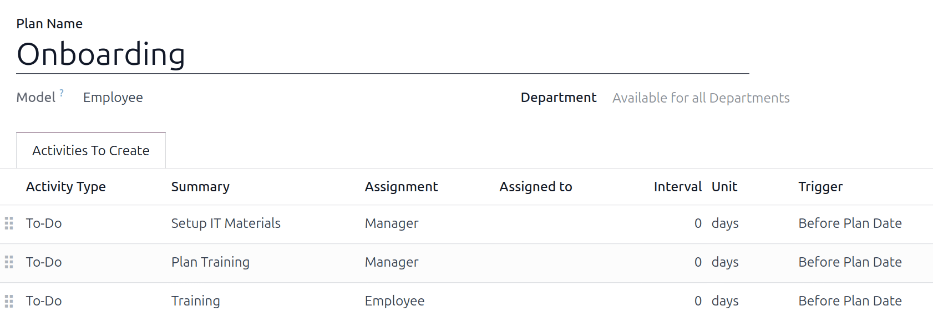
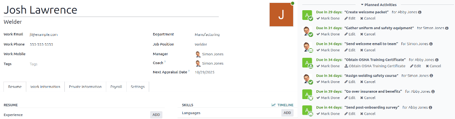

==========
Onboarding
==========

When a new employee is hired, it is important to have an onboarding procedure that can be followed.
This ensures that information, equipment, and training are provided to the employee and any other
necessary steps for the business are assigned to the correct individuals.

Proper onboarding ensures that new employees are given all the information and tools needed to be
successful in their roles and have a smooth transition to their new job.

View onboarding plan
====================

Before onboarding can begin, it is recommended to check the default onboarding plan that comes
preconfigured with the **Employees** app. To view the current default plan, navigate to
:menuselection:`Employees app --> Configuration --> Activity Plan`. Click :guilabel:`Onboarding` to
view the detailed onboarding plan form.

.. _onboarding/plan-form:

The plan form displays the following information:

- :guilabel:`Plan Name`: the specific name for the onboarding plan.
- :guilabel:`Model`: specifies where this plan can be used. In this case, in the **Employees** app.
- :guilabel:`Department`: if left blank (the default setting) this plan is available for all
  departments. Limit the use of the plan to a specific department by selecting the department using
  the drop-down menu.
- :guilabel:`Activities To Create`: this tab lists all the onboarding steps. Each row displays:

  - :guilabel:`Activity Type`: the specific activity for the step. The default options are
    :guilabel:`Email`, :guilabel:`Call`, :guilabel:`Meeting`, :guilabel:`To-Do`, or
    :guilabel:`Upload Document`. If the **Sign** app is installed, a :guilabel:`Request Signature`
    option is available.
  - :guilabel:`Summary`: a one line description of the step.
  - :guilabel:`Assignment`: chooses who completes the activity, relative to the new hire:

    - :guilabel:`Ask at launch`: choose the user in the :guilabel:`Assigned To` field when
      :ref:`launching the onboarding plan <employees/launch-plan>`.
    - :guilabel:`Default user`: choose a user who always handles this activity. Defined in the
      :guilabel:`Assigned to` field.
    - :guilabel:`Manager`: assigns the employee's manager as defined on the employee record.
    - :guilabel:`Coach`:  assigns the employee's coach as defined on the employee record.
    - :guilabel:`Employee`: the new hire completes the activity.
    - :guilabel:`Fleet Manager`: assigns the designated **Fleet** app manager. This option is only
      available if the **Fleet** app is installed.

  - :guilabel:`Assigned to`: this field remains blank, unless :guilabel:`Default user` is selected
    for the :guilabel:`Assignment` field. If :guilabel:`Default user` is selected, this field is
    populated with the selected user.
  - :guilabel:`Document to sign`: the corresponding document requiring a signature.
  - :guilabel:`Interval`: the time when the activity is active.
  - :guilabel:`Unit`: the set time interval, either :guilabel:`days`, :guilabel:`weeks`, or
    :guilabel:`months`.
  - :guilabel:`Trigger`: how scheduling is determined for the activity. Options are either
    :guilabel:`Before Plan Date` or :guilabel:`After Plan Date`.

    .. example::
       A laptop must be set up and registered to a new employee the day before they start work. The
       person who performs this step should always be the IT Manager, Abby Jones.

       To configure this activity with these parameters, the :guilabel:`Activity Type` is set to
       :guilabel:`To-Do`, with a summary of :guilabel:`Assign Laptop`. The :guilabel:`Assignment`
       field is set to :guilabel:`Default user`, and the :guilabel:`Assigned to` field is set to
       :guilabel:`Abby Jones`. The :guilabel:`Interval` is :guilabel:`1`, and the :guilabel:`Unit`
       is set to :guilabel:`days`. The :guilabel:`Trigger` is :guilabel:`Before Plan Date`.

       .. image:: onboarding/activity-plan.png
          :alt: An activity configured to assign a laoptop the day before an employee starts work.

Onboarding plan steps
---------------------

The default :guilabel:`Onboarding` plan includes three default steps. All steps are
:guilabel:`To-Do` activities, and are scheduled for the day the onboarding plan is launched
(:guilabel:`0 days Before Plan Date`).

- :guilabel:`Setup IT Materials`: the manager must gather and configure all IT materials.
- :guilabel:`Plan Training`: the manager must plan the training for the new employee.
- :guilabel:`Training`: the new employee must complete the training planned by the manager.

.. _employees/modify-plan:

Modify onboarding plan
======================

A single onboarding plan works only if the flow works for the entire company.

.. note::
   If the onboarding plan is universal, add to or modify the default onboarding plan. If
   department-specific onboarding plans are needed, :ref:`create a new onboarding plan
   <employees/create-plan>`.

To modify the default plan, first navigate to :menuselection:`Employees app --> Configuration -->
Activity Plan`, then click on :guilabel:`Onboarding`.

To modify a step, click on it. In the :guilabel:`Open: Activities` pop-up window, make any desired
modifications to the step, then click :guilabel:`Save`.

To add a new step, click :guilabel:`Add a line` at the bottom of the listed activities in the
:guilabel:`Activities To Create` tab, and a blank :guilabel:`Create Activities` pop-up window
appears. Enter all the information in the pop-up window, then click :guilabel:`Save & Close` if
there are no other steps to add, or click :guilabel:`Save & New` if more steps are needed.

.. _employees/create-plan:

Create onboarding plan
======================

Some companies require different onboarding plans, when there are department-specific onboarding
procedures that do not apply to the whole company. For these cases, a new department-specific
onboarding plan must be created.

To create a new onboarding plan, :ref:`navigate to the desired plan and configure all the desired
steps <employees/modify-plan>`.

.. example::
   A company specializing in the manufacturing and selling of outdoor metal furniture may have a
   large factory that produces the products, and a separate sales office. This company may have two
   separate onboarding plans, one for factory workers, and one for office workers.

   The onboarding plan for the factory workers is set for the :guilabel:`Manufacturing` department,
   and includes specialized tasks relating to factory jobs. These include gathering the new
   employees uniform and safety gear, assigning a safety course, emailing their team about the new
   hire, going over benefits, and more.

   .. image:: onboarding/factory-onboarding.png
      :alt: An onboarding plan configured for factory workers.

.. _employees/launch-plan:

Launch onboarding plan
======================

After an employee has been hired and their employee profile :ref:`is created
<recruitment/new-employee>`, navigate to the desired employee's profile by clicking on their Kanban
card on the **Employees** app dashboard, then click the :guilabel:`Launch Plan` button on their
employee profile, and a blank :guilabel:`Launch Plan` pop-up window loads.

In the :guilabel:`Plan` field, choose the desired onboarding plan. Then, using the calendar
selector, set a date in the :guilabel:`Plan Date` field. This is typically the employee's first day,
but any date can be selected.

The right side of the :guilabel:`Launch Plan` pop-up window displays all the steps in the selected
plan, grouped by what was selected in the :guilabel:`Assignment` fields on the :ref:`plan form
<onboarding/plan-form>`.

Once the :guilabel:`Plan` and :guilabel:`Plan Date` fields are configured, click the
:guilabel:`Schedule` button, and Odoo schedules everything in the plan, according to their
respective due dates.

All scheduled activities appear in the both chatter of the employee profile, and in the chatter of
the user's with assignments relating to the plan.

.. note::
   If any activity assignments were configured to :guilabel:`Ask at launch`, an :guilabel:`Assigned
   to` field appears on the :guilabel:`Launch Plan` pop-up window. Using the drop-down menu, select
   the user responsible for all the unassigned activities.

