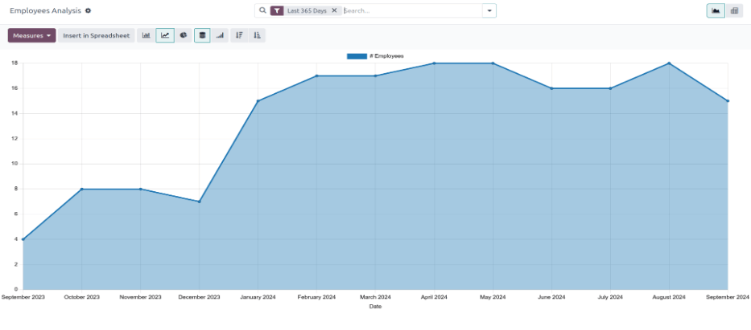
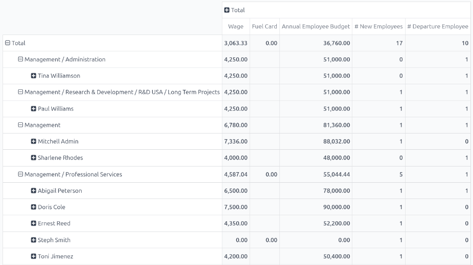

=========================
Employee retention report
=========================

It is possible to determine the retention rate for a company by modifying an existing report.

First, navigate to :menuselection:`Employees app --> Reporting --> Contracts` to open the
:guilabel:`Employee Analysis` report. This report shows the number of all employees for the
:guilabel:`Last 365 Days`, in a default :icon:`fa-line-chart` :guilabel:`Line Chart`.

Next, click the :guilabel:`Measures` :icon:`fa-caret-down` button in the upper-left corner,
revealing a drop-down menu. Click :guilabel:`# Departure Employee` in the list, then click away from
the drop-down menu to close it. Now, the report shows all the employees who were archived for the
:guilabel:`Last 365 Days`.

To view this information in an easier format, click the :icon:`oi-view-pivot` :guilabel:`(Pivot)`
icon in the upper-right corner, and the data is presented in a pivot table.

The various employees, organized by department, populate the rows. The columns display the following
totals: the monthly :guilabel:`Wage`, the :guilabel:`Fuel Card` budget, total :guilabel:`Annual
Employee Budget` (also referred to as the *annual salary*), the number of :guilabel:`New Employees`,
as well as the number of :guilabel:`Departure Employees` (employees who left).

Employee retention rate comparison report
=========================================

It is possible to compare data only for employees who left, compared to the total current employees,
between two separate time periods. This is commonly referred to as the *employee retention rate*.

To view these metrics, first open the :guilabel:`Employee Analysis` report by navigating to
:menuselection:`Employees app --> Reporting --> Contracts`. Click the :icon:`oi-view-pivot`
:guilabel:`(Pivot)` icon in the upper-right corner to view the information in a pivot table.

Next, click the :guilabel:`Measures` :icon:`fa-caret-down` button in the upper-left corner,
revealing a drop-down menu. Click :guilabel:`# New Employees`, :guilabel:`Annual Employee Budget`,
:guilabel:`Fuel Card`, and :guilabel:`Wage` in the list, to deselect these metrics and hide them in
the table. Then, click :guilabel:`Count` at the bottom of the list to enable that metric.

Click away from the drop-down menu to close it. Now, the report shows all the employees who left the
company (:guilabel:`# Departure Employee`), as well as the total number of employees
(:guilabel:`Count`), for the :guilabel:`Last 365 Days`.

To compare the data for the current year with the previous year, click the :icon:`fa-caret-down`
:guilabel:`(down arrow)` in the search bar, revealing multiple filter and grouping options. Click
:guilabel:`Last 365 Days` in the :icon:`fa-filter` :guilabel:`Filters` column, to turn off that
filter. Then, click :guilabel:`Date`, and click the current year (in this example, :guilabel:`2024`)
from the resulting drop-down menu.

Once a selection is made beneath :guilabel:`Date` in the :icon:`fa-filter` :guilabel:`Filters`
column, a :icon:`fa-adjust` :guilabel:`Comparison` column appears. Click :guilabel:`Date: Previous
Year` in the new column, then click off of the drop-down menu to close it.

.. note::
   In Odoo, in order to access the :icon:`fa-adjust` :guilabel:`Comparison` column, a specific time
   *other than* :guilabel:`Last 365 Days` **must** be selected. If not, the :icon:`fa-adjust`
   :guilabel:`Comparison` column is **not** visible.

Now, the pivot table displays the total number of employees who left the company (:guilabel:`#
Departure Employee`), as well as the total number of employees (:guilabel:`Count`) in the columns.
These are further divided by the two different years, and also displays the :guilabel:`Variation`
between the two.

The rows display the departments, and lists each individual employee for each department, in the
rows.

For a more concise view of this report, click :icon:`fa-minus-square-o` :guilabel:`Total` above the
top row of the departments and employees, to collapse the rows. Now, the table presents the total
number of employees who left the company for both years, compared to the total number of employees
for both years, including the difference, in a percentage.

.. example::
   In this example, :guilabel:`3` employees out of :guilabel:`83` left in 2023, and :guilabel:`8`
   employees out of :guilabel:`202` left in 2024. There was a :guilabel:`166.67%` increase in the
   employees who left in 2024 as compared to 2023. Additionally, there was a :guilabel:`143.37%`
   increase in the total number of employees in 2024 as compared to 2023.

   .. image:: retention_report/comparison-years.png
      :align: center
      :alt: The report modified to show the difference between two years of employees who left.

To view more detailed rates for each department, click :icon:`fa-plus-square` :guilabel:`Total` in
the single row, revealing a drop-down menu, and click :guilabel:`Department`. Click away from the
drop-down to close it, and now the pivot table displays the total number of employees who left
(:guilabel:`# Departure Employee`), the total number of employees (:guilabel:`Count`), and the
:guilabel:`Variation` (in a percentage) for both 2023 and 2024, organized by department.

.. example::
   In this example, it can be determined that the :guilabel:`Management` department had the best
   retention rate in 2024 as compared to 2023, with a :guilabel:`Variation` rate of
   :guilabel:`-100%`. Additionally, it can be determined that the :guilabel:`Management / Research &
   Development` department had the most turnover, with a :guilabel:`Variation` of :guilabel:`300%`.

   .. image:: retention_report/department-totals.png
     :align: center
     :alt: The expanded employee retention report by department.
