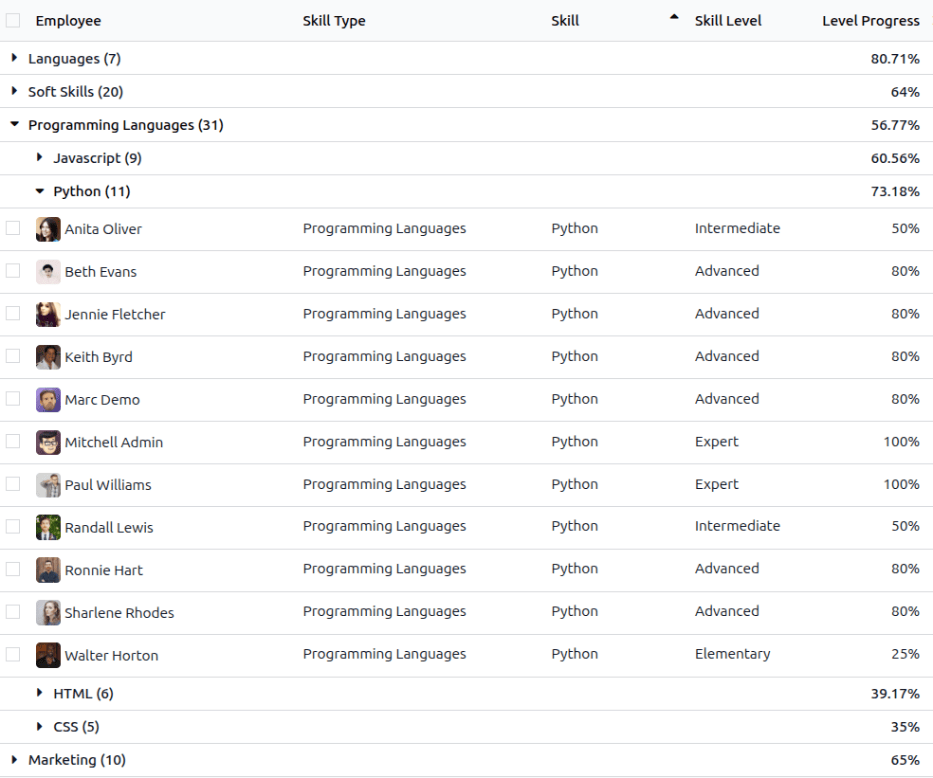
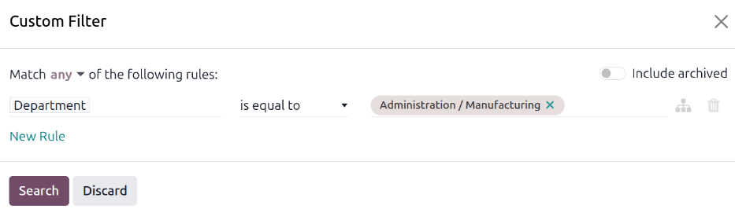
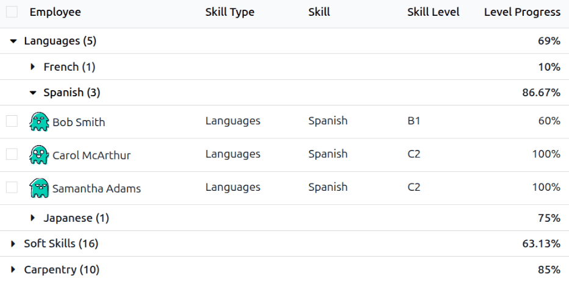

================
Skills inventory
================

The **Employees** app allows users with the correct :doc:`access rights
<../../general/users/access_rights>`, typically managers, to view current employee skills. This
report is helpful in determining which employee best fits a specific task or role requiring certain
skills.

View skills inventory report
============================

To view the *Skills Inventory* report, navigate to :menuselection:`Employees app --> Reporting -->
Skills Inventory`. The report lists all skills, grouped by :guilabel:`Skill Type`, then individual
:guilabel:`Skill`. All results are collapsed by default and must be expanded to view the
:guilabel:`Skill Type`, :guilabel:`Skill`, and :guilabel:`Skill Level`.

Click on any :guilabel:`Skill Type` to expand the list and display the individual
:guilabel:`Skills`. Click on any individual :guilabel:`Skill` to further expand the list and display
all employees with that specific :guilabel:`Skill`, alphabetically.

Both the :guilabel:`Skill Type` and :guilabel:`Skill` lines display a number after each listed line.
The number indicates how many employees have the specific :guilabel:`Skill Type` or
:guilabel:`Skill`.

When fully expanded, each line displays the following information:

- :guilabel:`Employee`: The name of the employee with the skill.
- :guilabel:`Skill Type`: The broader category of the skill.
- :guilabel:`Skill`: The specific skill nested within the :guilabel:`Skill Type`.
- :guilabel:`Skill Level`: The current level the employee has achieved for the skill.
- :guilabel:`Level Progress`: The percentage the employee has achieved, with `100%` indicating the
  skill is mastered.

.. note::
   Only skills that have employees associated with them appear on the list. If no employee has a
   specific skill, the skill is hidden by default.

Use case: Find Spanish-speaking employees
=========================================

An automobile company is experiencing issues with a subassembly manufactured overseas. It is
determined that a site visit to the factory is needed to resolve the issue. Since the staff of the
subassembly company primarily speak Spanish, and the staff of the automobile company primarily
speak English, management wants to send an employee who speaks Spanish.

The *Skills Inventory* report allows for discovering which employee speaks Spanish, and at what
level, allowing management to make the best decision.

To determine the most fluent Spanish speakers, navigate to :menuselection:`Employees app -->
Reporting --> Skills Inventory`. Since the manufacturing department is the most qualified to handle
manufacturing issues, someone from that department is desired. To only view employees from that
department, click into the search bar, and click :guilabel:`Custom filter...` in the
:icon:`fa-filter` :guilabel:`Filters` column.

In the *Custom Filter* pop-up window, set the first field to :guilabel:`Department` and the last
field to :guilabel:`Administration/Manufacturing`, then click :guilabel:`Search`.

Once the filter is active, expand :guilabel:`Languages` then expand :guilabel:`Spanish`. The
resulting list only displays employees within the manufacturing department, with Spanish language
skills.

In this example, it can be determined that both :guilabel:`Samantha Adams` and :guilabel:`Carol
McArthur` both speak Spanish fluently (a :guilabel:`Level Progress` of :guilabel:`100%`) and are
good candidates for the manufacturing trip to their subassembly manufacturer.

