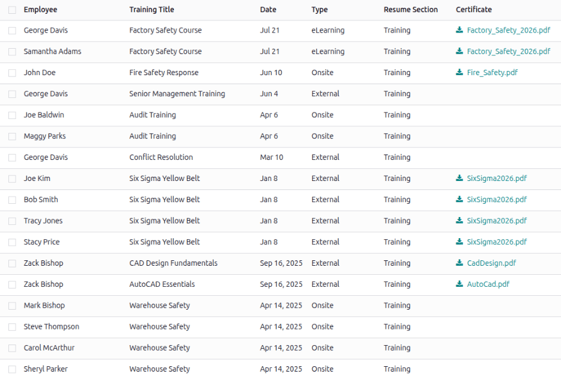
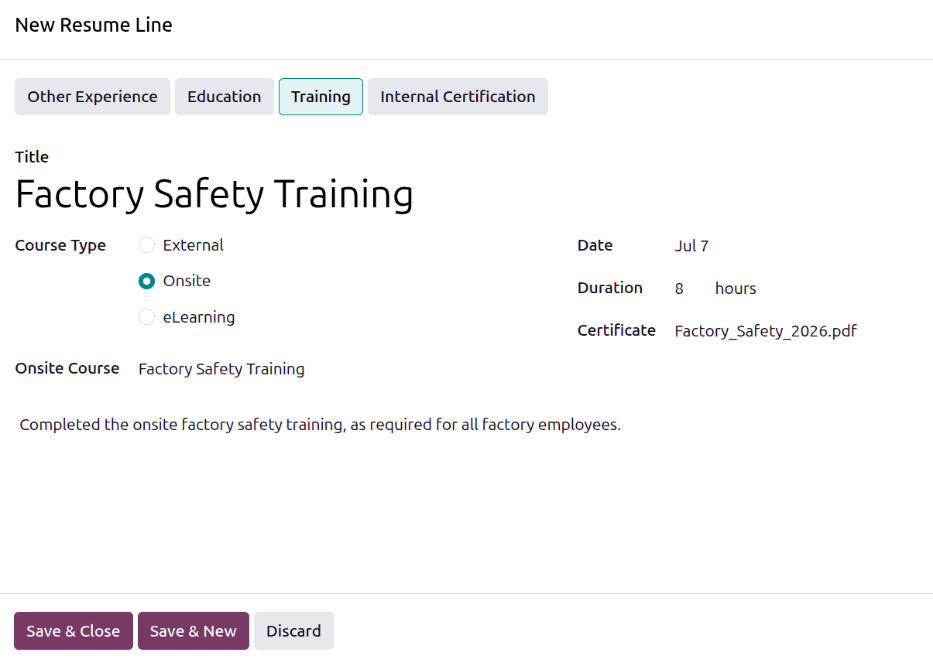

====================
Training attendances
====================

Most companies require training for their employees. As a company grows, it becomes important to
ensure that employees have the specific training required for their job. Odoo's **Employees** app
has a *Training Attendances* report to aid management in determining what employees are trained, or
which employees may be best suited for a role or project based on their training.

.. note::
   Only managers and employees with the proper :doc:`access rights
   <../../general/users/access_rights>` can access the *Training Attendances* report.

View training attendances report
================================

To view the *Training Attendances* report, navigate to :menuselection:`Employees app --> Learning
--> Training Attendances`. The report displays a list of all trainings for all employees, in
descending chronological order, with the most recent training at the top.

Each line of the report displays the following information:

- :guilabel:`Employee`: The name of the employee who received the training.
- :guilabel:`Training Title`: The title for the training course.
- :guilabel:`Date`: The date the training was completed.
- :guilabel:`Type`: The specific format the training was done in, either at the company
  (:guilabel:`Onsite`), at a training facility (:guilabel:`External`), or virtually through an
  online course (:guilabel:`eLearning`).
- :guilabel:`Resume Section`: Where the training appears on the employee record.
- :guilabel:`Certificate`: The certificate earned from the training, if available.

Add a training
==============

As employees complete training, it is important to add their training to their employee record. This
can be done from the :ref:`employee record <employees/training_attendances/employee>`, or from the
:ref:`Training Attendances report <employees/training_attendances/report>`.

.. _employees/training_attendances/employee:

From the employee record
------------------------

To add training from an employee record, open the **Employees** app, click the employee's Kanban
card, and click the *Resume* tab. On the *Resume* side of the tab, click the :guilabel:`Add` button
and a *New Resume Line* pop-up window appears. Enter the following information for each entry:

- :guilabel:`Type`: Click :guilabel:`Training` if not already selected.
- :guilabel:`Title`: Type in the title for the training.
- :guilabel:`Course Type`: Select how the training was conducted. The options are:
  :guilabel:`External` for any offsite training, including online classes or in person training,
  :guilabel:`Onsite` for in person training at the company (through the **Events** app), or
  :guilabel:`eLearning` for online training courses taken through the **eLearning** app.
- :guilabel:`External URL`: If :guilabel:`External` is selected for the :guilabel:`Course Type`,
  this field appears. Enter a relevant URL for the training, such as the online course or a summary
  of the training.
- :guilabel:`Onsite Course`: If :guilabel:`Onsite` is selected for the :guilabel:`Course Type`, this
  field appears. Using the drop-down menu, select the training event the employee attended through
  the **Events** app.
- :guilabel:`eLearning Course`: If :guilabel:`eLearning` is selected for the :guilabel:`Course
  Type`, this field appears. Using the drop-down menu, select the **eLearning** class the employee
  took.
- :guilabel:`Date`: The current date populates this field by default. Using the calendar selector,
  select the date the training was completed.
- :guilabel:`Duration`: Enter the number of hours of the training.
- :guilabel:`Certificate`: If there is a relevant certificate to attach, click the :guilabel:`Upload
  your file` button, select the desired file, and click :guilabel:`Select`. The file name appears in
  the field, not an image of the certificate.
- :guilabel:`Description`: Enter any relevant details for the training in this field.

Once all the information is entered, click the :guilabel:`Save & Close` button if there is only one
training to add, or click the :guilabel:`Save & New` button to save the current entry and create
another training record.

.. note::
   If the **eLearning** or **Events** apps are not installed, the corresponding fields and options
   do not appear on the *New Resume Line* pop-up window.

.. _employees/training_attendances/report:

From the training attendances report
------------------------------------

To add a training record from the *Training Attendances* report, navigate to
:menuselection:`Employees --> Learing --> Training Attendances`. Click the :guilabel:`New` button,
and a blank line appears at the bottom of the report. Configure the following fields on the line:

- :guilabel:`Employee`: Using the drop-down menu, select the employee who completed the training.
- :guilabel:`Training Title`: Type in the name of the training taken.
- :guilabel:`Date`: Using the calendar selector, select the date the training was completed. This
  field is populated with the current day, by default.
- :guilabel:`Type`: Using the drop-down menu, select the format for the training. The options are:
  :guilabel:`External` for any offsite training, including online classes or in person training,
  :guilabel:`Onsite` for in person training at the company (through the **Events** app), or
  :guilabel:`eLearning` for online training courses taken through the **eLearning** app.
- :guilabel:`Resume Section`: Select :guilabel:`Training` from the drop-down menu.
- :guilabel:`Certificate`: If a certificate was received or required as proof of training, click
  :icon:`fa-download` :guilabel:`Upload your file`, navigate to the desired file, and click
  :guilabel:`Select`.

As the information is entered, Odoo automatically saves the entry. Refresh the page to have the
report reload, and the entry is moved to the correct place on the report, based on the date.

.. tip::
   Since adding training records from the *Training Attendances* report does not allow for the
   selection of the corresponding training from the **eLearning** and **Events** apps, it is best to
   add these training records :ref:`from the employee record
   <employees/training_attendances/employee>`.

   If a training record is added from the *Training Attendances* report, the record can be updated
   from the employee record to add any missing information, such as the **eLearning** course,
   training event from the **Events** app, or a description.
