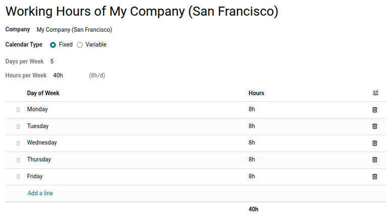
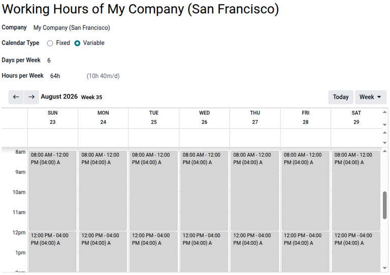

.. meta::
   :description: Working hours define the schedule during which employees or equipment are expected
                 to work or be available for use, and are configured separately for each company in
                 a database.

=============
Working hours
=============

In Odoo, *working hours* are the hours during which employees or equipment are scheduled to work or
be available for use.

.. note::
   Working hours may also be known as a *working schedule* in some Odoo applications.

Working hours are company-specific; however, working hours can be applied to all companies by
leaving the :guilabel:`Company` field blank.

Working hours appear in several apps, including:

- :menuselection:`Employees --> Configuration --> Working Schedules`
- :menuselection:`Payroll --> Configuration --> Working Schedules`
- :menuselection:`Manufacturing --> Configuration --> Work Centers`

.. _employees/working_hours/working_hours_form:

Working hours form
==================

The following fields are available in all working hours forms:

- :guilabel:`Name`: Enter the name for the new working schedule. This should be descriptive and
  clear to understand, such as `20 Hours/Week`.
- :guilabel:`Calendar Type`: Select :guilabel:`Fixed` or :guilabel:`Variable`. :ref:`Fixed working
  hours <employees/working_hours/fixed-schedule>` are good for schedules that require specific
  working hours. :ref:`Variable working hours <employees/working_hours/variable-schedule>` work best
  for businesses with split work schedules.
- :guilabel:`Days per Week`: The number of days per week that the schedule is valid is displayed.
- :guilabel:`Company`: Select the company that can use these new working hours from the drop-down
  menu. Leaving this field blank indicates that it is available for all companies.
- :guilabel:`Hours per Week`: The number of hours per week that the schedule covers is displayed.

.. _employees/working_hours/fixed-schedule:

Fixed working hours
-------------------

For the :guilabel:`Fixed` option, the :guilabel:`Hours per Week` and :guilabel:`Days per Week`
fields are automatic formula fields that update based on the number of hours configured in the
:guilabel:`Hours` column and the number of days listed in the :guilabel:`Day of the Week` column.

When the work week days and hours are configured, click :guilabel:`Save`.

The following columns are available in the form:

- :guilabel:`Day of Week`: Select the day of the week that the schedule is made for.
- :guilabel:`Hours`: Specify how many hours the schedule is for on the specified day.
- :guilabel:`Work from`: Specify the time that the schedule starts, in 24-hour format.
- :guilabel:`Work to`: Specify the time that the schedule ends, in 24-hour format.

If a column is not displayed, click the :icon:`fa-sliders` :guilabel:`(Optional column toggle)` icon
and select the checkbox for it.

.. important::
   Working hours are company-specific and **cannot** be shared between companies. Each company needs
   to have its own set of working hours.

To edit a day and its hours, click in the :guilabel:`Hours` column and enter the number of working
hours for that day. To remove the day, click the :guilabel:`Delete row` icon. At the bottom of the
:guilabel:`Hours` column is the calculated total of work hours for the work week.

.. _employees/working_hours/variable-schedule:

Variable working hours
----------------------

Variable calendar types are well-suited to businesses with split work schedules. This option allows
industries with variable demand, such as hotels or businesses that rely heavily on tourism, to staff
peak hours while reducing labor costs during slow midday periods.

When the :guilabel:`Variable` option is chosen, a calendar view displays. Multiple time blocks can
be selected per day. To add a time block, click in the desired day column at the hour the work time
starts. A time slot pop-up window displays with the following fields:

- :guilabel:`Duration`: Specify the total number of hours of the configured time slot.
- :guilabel:`Time`: Specify the start and end time of that time slot. Times are displayed in UTC.
- :guilabel:`Recurrency`: Enable to repeat the time slot to run every week. When disabled, the time
  slot does not repeat.
- :guilabel:`Repeat every`: Configure the number of days or weeks between occurrences, and
  optionally set an end date for the repetition. This field only displays when
  :guilabel:`Recurrency` is enabled.

The start and end times can be adjusted manually in the time slot window, and the
:guilabel:`Duration` field recalculates automatically based on these changes.

Click :guilabel:`Save` to confirm the time slot and add it to the calendar. After all the time slots
are configured for the variable working hours, click :icon:`fa-cloud-upload` :guilabel:`(Save
manually)`.

.. seealso::
   **Employees**:

   - :doc:`new_employee`

   **Payroll**:

   - :doc:`../payroll/contracts`
   - :doc:`../payroll/working_schedules`
   - :doc:`../payroll/salaries`

   **Manufacturing**:

   - :doc:`../../inventory_and_mrp/manufacturing/advanced_configuration/using_work_centers`
   - :doc:`../../inventory_and_mrp/manufacturing/workflows/work_center_time_off`
