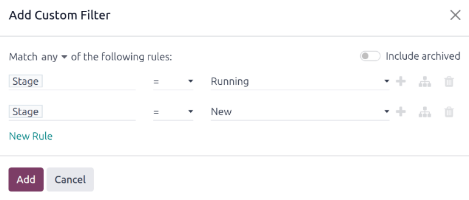

=========
Accidents
=========

When managing a fleet, accidents are inevitable. Tracking accidents is crucial for understanding
vehicle maintenance costs and identifying safe drivers.

Odoo's *Fleet* app offers multiple ways to track accidents. Below are step-by-step instructions for
only **one** method to monitor accidents and repair costs.

Structure
=========

For this example, to track accidents, two :ref:`service types <fleet/new-type>` are created:
`Accident - Driver's Fault` and `Accident - No Fault`.

This tracks various repairs associated with accidents, organized by who was at fault.

When an accident occurs, a service record is created. The specific repairs needed for the accident
are logged in the *Description* of the service record, and the details about the accident are logged
in the *Notes* section.

With this organizational structure, it is possible to view all accidents organized by fault, car,
driver, or cost.

.. note::
   To manage accidents, the creation of service records is **required**.

   Refer to the :doc:`service` documentation for detailed instructions on creating service records
   in Odoo's *Fleet* app.

Log accidents and repairs
=========================

To log an accident, and initiate the repair process, the first step is to :ref:`create a service
record <fleet/service-form>` detailing the specific repairs needed.

.. note::
   Some accidents require multiple repairs with several different vendors. For these scenarios, a
   separate service record is needed for each vendor performing repairs. To keep records organized,
   it is recommended to keep the *Notes* field identical, as well as attaching the same important
   documentation, such as a police report.

Navigate to :menuselection:`Fleet app --> Fleet --> Services` to view the main :guilabel:`Services`
dashboard. Click :guilabel:`New` in the top-left corner, and a blank service form loads.

Enter the following information on the form:

- :guilabel:`Description`: enter the description of repairs needed to fully repair the vehicle, such
  as `Bodywork`, `Windshield Replacement`, or `Replacement Bumper, Tires, and Windows`.
- :guilabel:`Service Type`: for this example, select either `Accident - Driver's Fault` or
  `Accident - No Fault`, depending on the situation.

  When entering either of these two :guilabel:`Service Types` for the first time, type in the new
  service type, then click :guilabel:`Create (new service type)`. A :guilabel:`Create Service Type`
  pop-up window appears, with the new service type populating the :guilabel:`Name` field. In the
  :guilabel:`Category` field, select :guilabel:`Service` from the drop-down menu, then click the
  :guilabel:`Save & Close` button.

  Once an accident service type has been added to the database, it is available to select from the
  drop-down menu in the :guilabel:`Service Type` field.
- :guilabel:`Date`: using the calendar popover window, select the date the accident occurred.
  Navigate to the desired month using the :icon:`fa-chevron-left` :icon:`fa-chevron-right`
  :guilabel:`(arrow)` icons, then click the date to select it.
- :guilabel:`Cost`: leave this field blank, as the repair cost is not yet known.
- :guilabel:`Vendor`: select the vendor performing the repairs using the drop-down menu. If the
  vendor has not already been entered in the system, type in the vendor name, and click either
  :guilabel:`Create` to add them, or :guilabel:`Create and edit...` to :ref:`add and configure the
  vendor <fleet/new-vendor>`.
- :guilabel:`Vehicle`: select the vehicle that was in the accident from the drop-down menu. When the
  vehicle is selected, the :guilabel:`Driver` field is populated, and the unit of measure for the
  :guilabel:`Odometer Value` field appears.
- :guilabel:`Driver`: the current driver listed for the selected vehicle populates this field when
  the :guilabel:`Vehicle` is selected. If a different driver was operating the vehicle when the
  accident occurred, select the correct driver from the drop-down menu.
- :guilabel:`Odometer Value`: enter the odometer reading when the accident occurred. The units of
  measure are either in kilometers (:guilabel:`km`) or miles (:guilabel:`mi`), depending on how the
  selected vehicle was configured.
- :guilabel:`NOTES`: enter the specific details of the accident at the bottom of the service form,
  such as `Hit a deer` or `Rear-ended at an intersection while stopped`.

Odoo provides the ability to attach any important paperwork, such as repair estimates and police
reports, to the service record. To do so, click the :icon:`fa-paperclip` :guilabel:`(paperclip)`
icon, located in the *chatter* of the form, and a file explorer pop-up window appears. Navigate to
the desired record, and click :guilabel:`Open` to upload the file.

  .. note::
     Once a file is added to a service record, a :guilabel:`Files` section appears in the *chatter*.
     To attach more records, click :icon:`fa-plus-square` :guilabel:`Attach files` to add more
     documents.

Service stages
==============

In Odoo's *Fleet* app, there are four default service stages:

.. tabs::

   .. tab:: New

      The default stage when a service record is created. The service has been requested, but
      repairs have not begun. The :guilabel:`Cost` field for this stage remains zero.

   .. tab:: Running

      The repair is in-process, but not yet complete. The estimate for repairs is listed in the
      :guilabel:`Cost` field.

   .. tab:: Completed

      All repairs listed on the service form have been completed. The :guilabel:`Cost` field is
      updated to reflect the final total cost charged for the repairs.

   .. tab:: Cancelled

      The service request has been cancelled.

During the repair process, change the service status to reflect the vehicle's current state in one
of two ways: on the individual :ref:`service record <fleet/service_record>`, or in the :ref:`Kanban
service view <fleet/Kanban>`.

.. _fleet/service_record:

Service record
--------------

Open the main *Services* dashboard, by navigating to :menuselection:`Fleet app --> Fleet -->
Services`. Next, click on the individual service record to open the detailed service form. Click the
desired stage in the top-right corner, above the service form, to change the status.

.. _fleet/Kanban:

Kanban view
-----------

Open the main *Services* dashboard, by navigating to :menuselection:`Fleet app --> Fleet -->
Services`. First, click the :icon:`oi-view-kanban` :guilabel:`Kanban` icon in the top-right of the
screen, which organizes all repairs by vehicle.

Next, remove the default :guilabel:`Service Type` filter in the search bar. Upon doing so, all
services appear in a Kanban view, organized by their respective :guilabel:`Status`.

Drag-and-drop the service record to the desired stage.

Accident reporting
==================

One of the main reasons to track accidents using the method outlined in this document is the ability
to view the total accident cost, determine the safest drivers, and calculate the actual total cost
for specific vehicles.

The main :ref:`Services dashboard <fleet/services_dashboard>` displays all the various accident
information, while the :ref:`Reporting dashboard <fleet/reporting_dashboard>` displays the total
cost for specific vehicles.

.. _fleet/services_dashboard:

Services dashboard
------------------

Navigate to :menuselection:`Fleet app --> Fleet --> Services` to view the :guilabel:`Services`
dashboard. All service records are displayed in a :icon:`oi-view-list` :guilabel:`(List)` view,
grouped alphabetically, by :guilabel:`Service Type`.

The two service types created for accident tracking appear in the list: :guilabel:`Accident -
Driver Fault` and :guilabel:`Accident - No Fault`.

Each grouping displays the number of records within each type, and lists the individual records
beneath each grouping title.

.. example::
   In this example, there are six accidents where the driver was at fault, and four accidents that
   were not the driver's fault. This dashboard also displays the estimated total :guilabel:`Cost`
   for all the accidents in each group.

   An estimated `$19,164.81` dollars are for driver-caused accident repairs, and an estimated
   `$2,548.21` dollars are for no-fault accidents.

   .. image:: accidents/group-accidents.png
      :align: center
      :alt: Accident services, with the total costs highlighted.

.. note::
   The total :guilabel:`Cost` calculates **all** costs on the repair form, including estimated
   costs, as well as final repair costs. This number may not be accurate, if there are any repairs
   in the *Running* stage, and the final bill has not yet been calculated.

.. _fleet/reporting_dashboard:

Reporting dashboard
-------------------

Navigate to :menuselection:`Fleet app --> Reporting --> Costs` to view the :menuselection:`Cost
Analysis` report. This report displays a  :icon:`fa-bar-chart` :guilabel:`(Bar Chart)` of all
:guilabel:`Contract` and :guilabel:`Service` costs for the current year, organized by month
(:guilabel:`Date : (year)`), by default. The :guilabel:`Sum`, represented by a gray dotted line, is
the combined total of both the :guilabel:`Contract` and :guilabel:`Service` costs.

To view the total cost by vehicle, click the :icon:`fa-caret-down` :guilabel:`(down arrow)` icon at
the right of the search bar, revealing a drop-down menu. Click :guilabel:`Vehicle` in the
:icon:`oi-group` :guilabel:`Group By` column, and the data is organized by vehicle.

This displays the true cost for each vehicle, including both the contract cost (such as the monthly
vehicle lease cost) and all service costs, including all accidents. Hover over a column to reveal a
data popover window, which displays the vehicle name and the total cost. This allows for a more
complete view of the vehicle cost.

To view the individual cost details for both contract costs and repairs, click the
:icon:`oi-view-pivot` :guilabel:`(Pivot)` icon in the top-right corner of the :guilabel:`Cost
Analysis` dashboard. This displays each vehicle on a separate line, and displays the
:guilabel:`Contract` cost and :guilabel:`Service` cost, as well as the :guilabel:`Total` cost.

         the total.

.. note::
   The :icon:`oi-view-pivot` :guilabel:`(Pivot)` view organizes the data by vehicle, by default,
   therefore grouping the data by :guilabel:`Vehicle` is not required. If this filer is already
   activated, it does not affect the presented data.

Manage accident repairs
=======================

For companies with multiple employees, who manage a large fleet of vehicles, displaying only service
records in the :guilabel:`New` and :guilabel:`Running` stages can be time-saving, if there are a
large number of records in the *Services* dashboard.

Navigate to :menuselection:`Fleet app --> Fleet --> Services`, where all service requests are
organized by :guilabel:`Service Type`. Next, click the :icon:`fa-caret-down` :guilabel:`(down
arrow)` icon at the right of the search bar, revealing a drop-down menu. Click :guilabel:`Add Custom
Filter` in the :icon:`fa-filter` :guilabel:`Filters` column, and a :guilabel:`Add Custom Filter`
pop-up window appears.

Three drop-down fields need to be configured on the pop-up window.

In the first field, scroll down, and select :guilabel:`Stage`.

Leave the second field set to :guilabel:`=`.

Select :guilabel:`Running` from the drop-down menu in the last field.

Next, click the :icon:`fa-plus` :guilabel:`(plus)` icon to the right of the last field, and an
identical rule appears beneath the current rule.

Then, change :guilabel:`Running` to :guilabel:`New` in the third field of the second rule, leaving
the other fields as-is.

Click the :guilabel:`Add` button at the bottom to add the new custom filter.

This slight modification only presents services in the :guilabel:`New` and :guilabel:`Running`
stages. This is a helpful report for a company managing a high number of repairs at any given time.

To have this report appear as the default report when opening the :guilabel:`Services` dashboard,
click the :icon:`fa-caret-down` :guilabel:`(down arrow)` icon at the far-right of the search bar.
Next, click :guilabel:`Save current search`, beneath the :icon:`fa-star` :guilabel:`Favorites`
column, which reveals another drop-down column beneath it. Tick the checkbox beside
:guilabel:`Default Filter`, then click :guilabel:`Save`. Then, this customized :guilabel:`Services`
dashboard appears, by default, anytime the :guilabel:`Services` dashboard is accessed.
