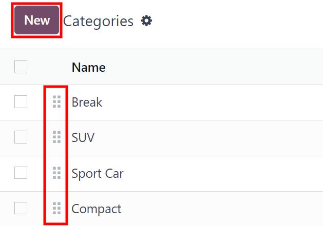

==================
Configuration menu
==================

This document outlines all of the configurations and settings for the *Fleet* application, including
:ref:`settings <fleet/configuration/settings>`, :ref:`manufacturers
<fleet/configuration/manufacturers>`, vehicle :ref:`models <fleet/configuration/models>`, and model
:ref:`categories <fleet/configuration/categories>`.

.. _fleet/configuration/settings:

Settings
========

To access the settings menu, go to :menuselection:`Fleet application --> Configuration -->
Settings`. There are two settings that need configuration, the vehicle contract end date alert, and
a new vehicle request limit.

.. image:: configuration/fleet-settings.png
   :align: center
   :alt: Settings available for the Fleet application.

End date contract alert
-----------------------

The :guilabel:`End Date Contract Alert` field defines when an alert is sent to the persons
responsible for the vehicle contracts. The responsible persons receive an email informing them when
a vehicle contract is expiring. How far in advance the email is sent is defined in this field.

.. note::
   To determine who the responsible person is for a contract, open an individual contract. The
   person listed as :guilabel:`Responsible` under the :guilabel:`Information` section of the
   contract is the one who receives the alert.

   To access all contracts, navigate to :menuselection:`Fleet app --> Fleet --> Contracts` and all
   contracts appear in the list. Click on a :guilabel:`Contract` to view it.

   An individual contract can also be found by navigating to :menuselection:`Fleet app --> Fleet -->
   Fleet` and clicking on an individual vehicle card. On the vehicle form, click the
   :guilabel:`Contracts` smart button at the top of the page. The contracts associated only with
   this vehicle appear in the list. Click on an individual contract to open it. The
   :guilabel:`Responsible` person is listed on the contract.

New vehicle request
-------------------

The :guilabel:`New Vehicle Request` field sets a limit on how many new vehicles are requested based
on fleet availability. After being offered a position, an employee filling out the online salary
configurator form is **not** able to request a new car if the number of existing cars is greater
than the number specified in the :guilabel:`New Vehicle Request` field. Enter the specific number
limit for existing available cars in this field.

.. example::
   If the :guilabel:`New Vehicle Request` limit is set to 20 vehicles, and there are 25 vehicles
   available, an employee would not be able to request a new vehicle. If there are only 10 cars
   available, then the employee would be able to request a new vehicle.

.. _fleet/configuration/manufacturers:

Models
======

Manufacturers
-------------

Odoo *Fleet* comes pre-configured with sixty-six commonly used car manufacturers in the database,
along with their logos. To view the pre-loaded manufacturers, go to :menuselection:`Fleet app -->
Configuration --> Models: Manufacturers`.

The manufacturers appear in a list view in alphabetical order. Each manufacturer's card lists how
many specific models are configured for each particular manufacturer. Odoo comes with forty five
pre-configured :ref:`models <fleet/configuration/models>` from four major auto manufacturers: Audi,
BMW, Mercedes, and Opel.

.. image:: configuration/manufacturer.png
   :align: center
   :alt: Manufacturer card with the amount of models listed.

.. _fleet/configuration/add-manufacturer:

Add a manufacturer
~~~~~~~~~~~~~~~~~~

To add a new manufacturer to the database, click :guilabel:`New`, and a blank manufacturer form
loads.

First, type the name of the manufacturer in the :guilabel:`Name` field. This is the only required
field.

Next, if a photo is available, hover over the image box and click the :guilabel:`✏️ (Pencil)` icon
that appears in the lower-left corner.

A file explorer window pops up. Navigate to the file, then click :guilabel:`Open` to select it.

The manufacturer form automatically saves as data is entered. However, the form can be saved
manually at any time by clicking the :guilabel:`Save manually` option, represented by a
:guilabel:`(cloud with an upwards arrow)` icon.

.. _fleet/configuration/models:

Models
------

Many manufacturers have a variety of models that they produce. Odoo comes with pre-configured car
models from four major auto manufacturers: Audi, BMW, Mercedes, and Opel.

If a vehicle *other* than the pre-configured models from these manufacturers is part of a fleet, the
model (and/or manufacturer) **must** be added to the database.

Pre-configured models
~~~~~~~~~~~~~~~~~~~~~

The following models are pre-configured in Odoo and do not need to be added to the database:

+-------+--------------+-----------+---------------+
| AUDI  | BMW          | Mercedes  | Opel          |
+=======+==============+===========+===============+
| A1    | Serie 1      | Class A   | Agilia        |
+-------+--------------+-----------+---------------+
| A3    | Serie 3      | Class B   | Ampera        |
+-------+--------------+-----------+---------------+
| A4    | Serie 5      | Class C   | Antara        |
+-------+--------------+-----------+---------------+
| A5    | Serie 6      | Class CL  | Astra         |
+-------+--------------+-----------+---------------+
| A6    | Serie 7      | Class CLS | AstraGTC      |
+-------+--------------+-----------+---------------+
| A7    | Serie Hybrid | Class E   | Combo Tour    |
+-------+--------------+-----------+---------------+
| A8    | Serie M      | Class GL  | Corsa         |
+-------+--------------+-----------+---------------+
| Q3    | Serie X      | Class GLK | Insignia      |
+-------+--------------+-----------+---------------+
| Q5    | Serie Z4     | Class M   | Meriva        |
+-------+--------------+-----------+---------------+
| Q7    |              | Class R   | Mokka         |
+-------+--------------+-----------+---------------+
| TT    |              | Class S   | Zafira        |
+-------+--------------+-----------+---------------+
|       |              | Class SLK | Zafira Tourer |
+-------+--------------+-----------+---------------+
|       |              | Class SLS |               |
+-------+--------------+-----------+---------------+

.. _fleet/configuration/add-model:

Add a new model
~~~~~~~~~~~~~~~

New vehicle models can easily be added to the database. To add a new model, navigate to
:menuselection:`Fleet app --> Configuration --> Models: Models`. Click the :guilabel:`New` button in
the top-left corner and a blank vehicle model form loads.

Enter the following information on the form:

.. note::
   Some fields or sections are based on the localization setting of the company, therefore not all
   fields or sections may be visible.

- :guilabel:`Model name`: enter the model name in the field.
- :guilabel:`Manufacturer`: select the manufacturer from the drop-down menu. If a logo is configured
  for the selected manufacturer, the logo automatically loads in the image box in the top-right
  corner. If the manufacturer is not already configured, type in the manufacturer name and then
  click :guilabel:`Create` to add the manufacturer, or :guilabel:`Create and edit...` to :ref:`add
  the manufacturer and the logo <fleet/configuration/add-manufacturer>` in a :guilabel:`Create
  Manufacturer` pop-up window.
- :guilabel:`Vehicle Type`: select one of two pre-configured vehicle types, either :guilabel:`Car`
  or :guilabel:`Bike`, from the drop-down menu. The vehicle types are hardcoded in Odoo and are
  integrated with the *Payroll* application since vehicles can be part of an employee's benefits.
  Adding additional vehicle types is not possible as it affects payroll.
- :guilabel:`Category`: select the category the vehicle is categorized under from the drop-down
  menu. To create a new category, type in the category name and then click :guilabel:`Create "new
  category"`.

Information tab
***************

Model
^^^^^

- :guilabel:`Seats Number`: enter how many passengers the vehicle can accommodate.
- :guilabel:`Doors Number`: enter the number of doors the vehicle has.
- :guilabel:`Color`: enter the color of the vehicle.
- :guilabel:`Model Year`: enter the year the vehicle was manufactured.
- :guilabel:`Trailer Hitch`: check this box if the vehicle has a trailer hitch installed.

Salary
^^^^^^

.. note::
   The :guilabel:`Salary` section only appears for Belgian-based companies, and only if the company
   has their localization setting set to Belgium. The cost values are all **monthly** with the
   exception of the :guilabel:`Catalog Value (VAT Incl.)`.

- :guilabel:`Can be requested`: check this box if employees can request this model for a new
  vehicle.
- :guilabel:`Catalog Value (VAT Incl.)`: enter the :abbr:`MSRP (Manufacturer's Suggested Retail
  Price)` for the vehicle at the time of purchase or lease.
- :guilabel:`C02 fee`: this value is automatically calculated based on Belgian laws and regulations,
  and cannot be modified. The value is based on the value entered in the :guilabel:`CO2 Emissions`
  field in the :guilabel:`Engine` section of the vehicle form.

.. important::
   Modifying the :guilabel:`CO2 Emissions` field adjusts the value in the :guilabel:`CO2 fee`
   field.

- :guilabel:`Cost (Depreciated)`: enter the monthly cost for the vehicle, which appears in the
  salary configurator that is available to a future employee when they are offered a job position.

  This value impacts the gross and net salary of the employee who is assigned to the vehicle. This
  figure is depreciated over time according to local tax laws.

  The :guilabel:`Cost (Depreciated)` does **not** depreciate automatically on the *vehicle model*,
  it **only** depreciates based on the *contract* linked to a specific vehicle and not on the
  general model.
- :guilabel:`Total Cost (Depreciated)`: this value is the :guilabel:`Cost (Depreciated)` and the
  :guilabel:`C02 fee` fields combined, and is also depreciated over time. This field is
  automatically calculated and cannot be modified.

Engine
^^^^^^

- :guilabel:`Fuel Type`: select the type of fuel the vehicle uses from the drop-down menu. The
  options are :guilabel:`Diesel`, :guilabel:`Gasoline`, :guilabel:`Full Hybrid`, :guilabel:`Plug-in
  Hybrid Diesel`, :guilabel:`Plug-in Hybrid Gasoline`, :guilabel:`CNG`, :guilabel:`LPG`,
  :guilabel:`Hydrogen`, or :guilabel:`Electric`.
- :guilabel:`CO2 Emissions`: enter the average carbon dioxide emissions the vehicle produces in
  grams per kilometer (g/km). This information is provided by the car manufacturer.
- :guilabel:`CO2 Standard`: enter the standard amount of carbon dioxide in grams per kilometer
  (g/km) for a similar sized vehicle.
- :guilabel:`Transmission`: select the transmission type from the drop-down menu, either
  :guilabel:`Manual` or :guilabel:`Automatic`.
- :guilabel:`Power`: if the vehicle is electric or hybrid, enter the power the vehicle uses in
  kilowatts (kW).
- :guilabel:`Horsepower`: enter the vehicle's horsepower in this field.
- :guilabel:`Horsepower Taxation`: enter the amount that is taxed based on the size of the vehicle's
  engine. This is determined by local taxes and regulations, and varies depending on the location.
  It is recommended to check with the accounting department to ensure this value is correct.
- :guilabel:`Tax Deduction`: this field auto-populates according to the engine specifications, and
  cannot be modified. The percentage is based on the localization settings and local tax laws.

Vendors tab
***********

Vehicle specific vendors, such as car dealerships, are not listed separately from other vendors. The
vendors that a vehicle can be purchased from also appear in the list of vendors in the *Purchase*
app.

The vendors the specific vehicle model can be purchased from may be added in this tab. To add a
vendor, click the :guilabel:`Add` button. An :guilabel:`Add: Vendors` pop-up window loads with a
list of all the vendors currently in the database.

Select the vendor to add by clicking the checkbox to the left of the vendor name, then click
:guilabel:`Select`. There is no limit to the number of vendors that can be added to this list.

If a vendor is not in the database, add a vendor by clicking the :guilabel:`New` button at the
bottom of the :guilabel:`Add: Vendors` pop-up window. A blank :guilabel:`Create Vendors` pop-up
form loads.

Enter the information on the :guilabel:`Create Vendors` form, including the various tabs, then click
:guilabel:`Save & Close` to add the vendor and close the window, or :guilabel:`Save & New` to add
the current vendor and create another new vendor.

.. image:: configuration/vendor.png
   :align: center
   :alt: Vendor form to fill out when adding a new vendor.

.. _fleet/configuration/categories:

Categories
----------

To best organize a fleet, it is recommended to have vehicle models housed under a specific category,
to more easily see what kinds of vehicles are in the fleet.

Model categories are set on the :ref:`vehicle model form <fleet/configuration/add-model>`.

Unlike manufacturers and models, Odoo does not come with any categories pre-configured; all
categories must be added.

To view all the currently configured categories, navigate to :menuselection:`Fleet application -->
Configuration --> Models: Categories`. All currently configured categories are displayed in a list
view.

Add a new category
~~~~~~~~~~~~~~~~~~

To add a new category, click the :guilabel:`New` button in the top-left corner. A new entry line
appears at the bottom of the list. Type in the new category, then either press the enter key on the
keyboard, or click anywhere on the screen, to save the entry.

To reorganize how the categories appear in the list, click the :guilabel:`(six small gray boxes)` to
the left of the category to be moved, and drag the line to the desired position. The order of the
list does not affect the database in any way. However, it may be preferable to view the vehicle
categories in a specific order, for example, by size, or the numbers of passengers the vehicle can
carry.

