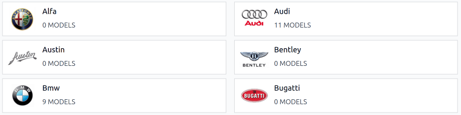
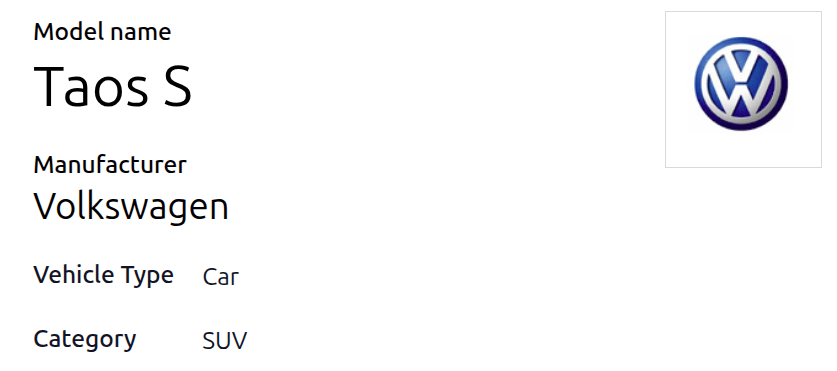
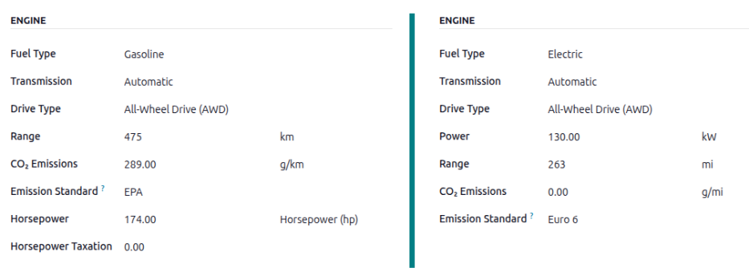

======================
Models & manufacturers
======================

Odoo's **Fleet** app categorizes each vehicle by *manufacturer* and *model* (e.g. `BMW`, `X2`).
Before a vehicle can be added to the Odoo database, its :ref:`manufacturer <fleet/manufacturers>`
and :ref:`model <fleet/add-model>` record must already exist in the database.

.. _fleet/manufacturers:

Manufacturers
=============

Odoo's **Fleet** app comes preconfigured with sixty-seven commonly used car and bicycle
manufacturers in the database, along with their logos. To view the pre-loaded manufacturers, go to
:menuselection:`Fleet app --> Configuration --> Manufacturers`, and the :guilabel:`Manufacturers`
dashboard loads.

The default filter, :guilabel:`With Models`, displays only manufacturers that already have vehicle
models. Remove the default filter to view *all* manufacturers.

Manufacturers are listed alphabetically, and each card shows how many specific :ref:`models
<fleet/models>` are configured for each particular manufacturer.

.. _fleet/add-manufacturers:

Add a manufacturer
------------------

To add a new manufacturer to the database, click :guilabel:`New` in the upper-left corner of the
:guilabel:`Manufacturers` dashboard, and a blank manufacturers form loads. Type the name of the
manufacturer in the :guilabel:`Name` field, and select an image to upload for the :guilabel:`Logo`.

.. _fleet/models:

Models
======

When adding a vehicle to the fleet, specify the vehicle model to maintain updated records, which
keeps track of specific details, like vehicle capacity and parts compatibility.

Unlike :ref:`manufacturers <fleet/manufacturers>`, models do **not** come preconfigured in the
**Fleet** app. When a new vehicle model joins the fleet, the model (and, if necessary, the
manufacturer) **must** be :ref:`added to the database <fleet/add-model>`.

.. _fleet/add-model:

Add a model
-----------

To add a new vehicle model, navigate to :menuselection:`Fleet app --> Configuration --> Models`.
Click :guilabel:`New` in the upper-left corner, and enter the following information on the new model
form.

.. note::
   Depending on the installed :doc:`localization <../../finance/fiscal_localizations>`, some fields
   or sections may not appear.

- :guilabel:`Model name`: Enter the model name in the field.
- :guilabel:`Manufacturer`: Using the drop-down menu, select the manufacturer. If it is not
  configured, :ref:`add the manufacturer <fleet/add-manufacturers>`
- :guilabel:`Vehicle Type`: Using the drop-down menu, select one of two preconfigured vehicle types,
  either :guilabel:`Car` or :guilabel:`Bike`.

  .. important::
     Additional vehicle types can **not** be added. **Fleet** keeps them fixed to preserve its
     **Payroll** integration, where vehicles may count as employee benefits.

- :guilabel:`Category`: Using the drop-down menu, select a :ref:`category <fleet/categories>` for
  the vehicle or :ref:`create a new one <fleet/new-category>`.

  .. note::
     No categories come preconfigured in Odoo's **Fleet** app. All categories must be added to the
     database.

Information tab
---------------

In the :guilabel:`Information` tab, specify details about the car model, such as the car size,
passenger capacity, and engine information.

Model
~~~~~

- :guilabel:`Model Year`: Enter the year the vehicle was manufactured.
- :guilabel:`Seating Capacity`: Enter how many passengers the vehicle can accommodate.
- :guilabel:`Number of Doors`: Enter the number of doors the vehicle has.
- :guilabel:`Color`: Enter the color of the vehicle.
- :guilabel:`Trailer Hitch`: Tick this checkbox if the vehicle has a trailer hitch installed.

Salary
~~~~~~

The :guilabel:`Salary` section **only** appears if the company has their localization setting set to
Belgium. The cost values are all *monthly*, with the exception of the :guilabel:`Catalog Value (VAT
Incl.)`.

- :guilabel:`Can be requested`: Enable this checkbox if employees can request this model vehicle, if
  a vehicle is part of their employee contract.
- :guilabel:`Catalog Value (VAT Incl.)`: Enter the :abbr:`MSRP (Manufacturer's Suggested Retail
  Price)` for the vehicle at the time of purchase or lease.
- :guilabel:`C02 fee`: Represents the carbon dioxide emission fee paid to the Belgian government.
  This value is automatically calculated, based on Belgian laws and regulations, and **cannot** be
  modified. The value is based on the figure entered in the :guilabel:`CO2 Emissions` field (in the
  :guilabel:`Engine` section of the :guilabel:`Information` tab) on the vehicle form.

  .. important::
     Modifying the :guilabel:`CO2 Emissions` field adjusts the value in the :guilabel:`CO2 fee`
     field.

- :guilabel:`Cost (Depreciated)`: Enter the monthly vehicle cost, which appears in the salary
  configurator for future employees. This value impacts the gross and net salary of the employee
  assigned to the vehicle. This figure is depreciated over time, according to local tax laws. The
  :guilabel:`Cost (Depreciated)` does **not** depreciate automatically on the *vehicle model*, it
  only depreciates based on the *contract* linked to a specific vehicle.
- :guilabel:`Total Cost (Depreciated)`: This value is the combination of the :guilabel:`Cost
  (Depreciated)` and the :guilabel:`C02 fee` fields. It also depreciated over time.

Engine
~~~~~~

- :guilabel:`Fuel Type`: Using the drop-down menu, select the type of fuel the vehicle uses. The
  default options are :guilabel:`Diesel`, :guilabel:`Gasoline`, :guilabel:`Full Hybrid`
  :guilabel:`Plug-in Hybrid Diesel`, :guilabel:`Plug-in Hybrid Gasoline`, :guilabel:`CNG`,
  :guilabel:`LPG`, :guilabel:`Hydrogen`, or :guilabel:`Electric`.
- :guilabel:`Range`: Enter the distance the vehicle can travel on one tank of gas, or one battery
  charge, in miles (:guilabel:`mi`) or kilometers (:guilabel:`km`). To change the unit of distance,
  click the drop-down next to the :guilabel:`km` or :guilabel:`mi` field, and select the desired
  unit of distance.
- :guilabel:`CO2 Emissions`: Enter the average carbon dioxide emissions the vehicle produces in
  grams per kilometer (:guilabel:`g/km`) or miles (:guilabel:`g/mi`). This information is provided
  by the car manufacturer.
- :guilabel:`Emission Standard`: Enter the regulatory test procedure or guideline used to determine
  the :guilabel:`CO2 Emissions`, such as the :abbr:`EPA (Environmental Protection Agency)` or Euro
  6.
- :guilabel:`Transmission`: Using the drop-down menu, select the type of transmission, either
  :guilabel:`Manual` or :guilabel:`Automatic`.
- :guilabel:`Power Unit`: Using the drop-down menu, select how the vehicle's power is measured,
  either in kilowatts or horsepower.
- :guilabel:`Power`: If the vehicle is electric or hybrid, enter the power the vehicle uses in
  kilowatts (:guilabel:`kW`). This field only appears if :guilabel:`kW` is selected for the
  :guilabel:`Power` field.
- :guilabel:`Horsepower`: Enter the vehicle's horsepower (hp) in this field. This field only appears
  if :guilabel:`Horsepower` is selected for the :guilabel:`Power` field.
- :guilabel:`Horsepower Taxation`: Enter the amount of taxes incurred according to the engine
  specifications. The number is dependent on the local tax laws, therefore it is recommended to
  check with the accounting department to ensure the correct taxation amount is entered. This field
  only appears if the :guilabel:`Power` field is set to :guilabel:`Horsepower` (which changes the
  :guilabel:`Power` field to :guilabel:`Range`) .
- :guilabel:`Tax Deduction`: The percentage that can be deducted from taxes is populated based on
  the localization, and **cannot** be modified. This field only appears for certain localizations.

Vendors tab
-----------

Specify the vendors a vehicle can be purchased from in this tab. With proper setup, :doc:`requests
for quotations <../../inventory_and_mrp/purchase/manage_deals/rfq>` for vehicles can be created
through Odoo's **Purchase** app.

To add a vendor, click the :guilabel:`Add Vendors` block in the :guilabel:`Vendors` tab. This opens
an :guilabel:`Add: Vendors` pop-up window, with a list of all the vendors currently in the database.
Add any preexisting vendors by clicking the checkbox next to the vendor name, then click
:guilabel:`Select`. No limitations exist on the number of vendors that can be added to this list.

If a vendor is *not* already in the database, add a new vendor by clicking :guilabel:`New` in the
bottom-left of the :guilabel:`Add: Vendors` pop-up window. In the :guilabel:`Create Vendors` form
that appears, :doc:`enter the necessary information <../../essentials/contacts>`, then click
:guilabel:`Save & Close` to add the vendor, or click :guilabel:`Save & New` to add the current
vendor and create another new vendor.

.. tip::
   Vendors are stored in the **Contacts** application.

.. image:: models/vendor.png
   :alt: Vendor form to fill out when adding a new vendor.

.. _fleet/categories:

Model category
==============

To aid with fleet organization, it is recommended to have vehicle models housed under a specific
category. Model categories are set on the :ref:`vehicle model form <fleet/add-model>`.

Odoo does **not** come with any categories preconfigured; all categories **must** be added.

To view any categories currently set up in the database, navigate to :menuselection:`Fleet app -->
Configuration --> Categories`. All categories are displayed in a list view.

.. _fleet/new-category:

Add a new model category
------------------------

To add a new category, click the :guilabel:`New` button in the top-left corner of the
:guilabel:`Categories` dashboard. A new entry line appears at the bottom of the list. Type in the
new category, then either click :guilabel:`Save`, or click anywhere on the screen, to save the
entry.

To reorganize how the categories appear in the list, click on the :icon:`oi-draggable`
:guilabel:`(draggable)` icon to the left of any desired category name, and drag the line to the
desired position.

The order of the list does *not* affect the database in any way. However, it may be preferable to
view the vehicle categories in a specific order, for example, by size, or the number of passengers
the vehicle can carry.

.. note::
   When used with the **Inventory** app, the :guilabel:`Max Weight` and :guilabel:`Max Volume`
   fields track a vehicle's capacity. This helps manage in-house deliveries by :doc:`showing how
   much space and weight remain for loading products
   <../../inventory_and_mrp/inventory/shipping_receiving/setup_configuration/dispatch>`.
