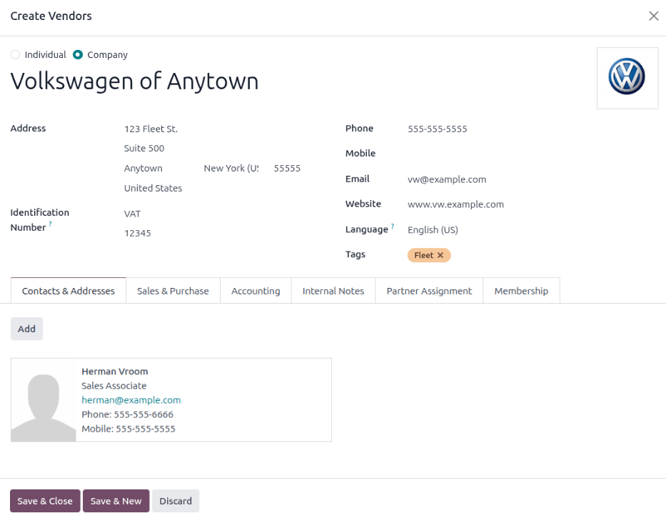

==============
Vehicle models
==============

When adding a vehicle to the fleet, specify the vehicle model to maintain updated records, which
keeps track of specific details, like maintenance schedules and parts compatibility.

Odoo comes with preconfigured car models from four major auto manufacturers: Audi, BMW, Mercedes,
and Opel.

If a new vehicle model joins the fleet, and it is not one of the preconfigured models from these
manufacturers, the model (and/or manufacturer) **must** be :ref:`added to the
database <fleet/add-model>`.

Preconfigured models
====================

The following models are preconfigured in Odoo, and do not need to be added to the database:

+-------+--------------+-----------+--------------+
| AUDI  | BMW          | Mercedes  | Opel         |
+=======+==============+===========+==============+
| A1    | Serie 1      | Class A   | Agilia       |
+-------+--------------+-----------+--------------+
| A3    | Serie 3      | Class B   | Ampera       |
+-------+--------------+-----------+--------------+
| A4    | Serie 5      | Class C   | Antara       |
+-------+--------------+-----------+--------------+
| A5    | Serie 6      |Class CL   | Astra        |
+-------+--------------+-----------+--------------+
| A6    | Serie 7      | Class CLS | AstraGTC     |
+-------+--------------+-----------+--------------+
| A7    | Serie Hybrid | Class E   | Combo Tour   |
+-------+--------------+-----------+--------------+
| A8    | Serie M      | Class GL  | Corsa        |
+-------+--------------+-----------+--------------+
| Q3    | Serie X      | Class GLK | Insignia     |
+-------+--------------+-----------+--------------+
| Q5    | Serie Z4     | Class M   | Meriva       |
+-------+--------------+-----------+--------------+
| Q7    |              | Class R   | Mokka        |
+-------+--------------+-----------+--------------+
| TT    |              | Class S   | Zafira       |
+-------+--------------+-----------+--------------+
|       |              | Class SLK | Zafira Tourer|
+-------+--------------+-----------+--------------+
|       |              | Class SLS |              |
+-------+--------------+-----------+--------------+

.. _fleet/add-model:

Add a new model
===============

To add a new vehicle model, navigate to :menuselection:`Fleet app --> Configuration --> Models:
Models`. Click :guilabel:`New`, and in a new vehicle model form, enter the following information on
the form.

.. note::
   Be advised, some fields are specific to Belgian based companies, so not all fields or sections
   may be visible depending on the location of the company.

- :guilabel:`Model name`: enter the model name in the field.
- :guilabel:`Manufacturer`: select the manufacturer from the drop-down menu. If the manufacturer is
  not configured, type in the manufacturer, and click :guilabel:`Create` or :guilabel:`Create and
  edit..`.

  .. note::
     When the manufacturer is selected, if it is one of the default manufacturers in *Odoo*, the
     logo for the manufacturer automatically loads in the image box in the top-right corner.

- :guilabel:`Vehicle Type`: select one of two preconfigured vehicle types, either :guilabel:`Car` or
  :guilabel:`Bike`, from the drop-down menu. The vehicle types are hardcoded in Odoo, and are
  integrated with the *Payroll* application, since vehicles can be part of an employee's benefits.
  Adding additional vehicle types is *not* possible as it affects payroll.
- :guilabel:`Category`: select a category for the vehicle from the drop-down menu. To create a new
  category, type in the category and then click :guilabel:`Create (new category)`.

Information tab
---------------

In the :guilabel:`Information` tab, specify details about the car model, such as the car size,
passenger capacity, cost settings (applicable to the Belgium localization only), and engine
information.

Model section
~~~~~~~~~~~~~

- :guilabel:`Seats Number`: enter how many passengers the vehicle can accommodate.
- :guilabel:`Doors Number`: enter the number of doors the vehicle has.
- :guilabel:`Color`: enter the color of the vehicle.
- :guilabel:`Model Year`: enter the year the vehicle was manufactured.
- :guilabel:`Trailer Hitch`: tick this checkbox if the vehicle has a trailer hitch installed.

Salary section
~~~~~~~~~~~~~~

.. note::
   The :guilabel:`Salary` section **only** appears for Belgian-based companies, and **only** if the
   company has their localization setting set to Belgium. The cost values are all *monthly*, with
   the exception of the :guilabel:`Catalog Value (VAT Incl.)`.

- :guilabel:`Can be requested`: tick this checkbox if employees can request this model vehicle, if a
  vehicle is part of their employee contract.
- :guilabel:`Catalog Value (VAT Incl.)`: enter the :abbr:`MSRP (Manufacturer's Suggested Retail
  Price)` for the vehicle at the time of purchase or lease.
- :guilabel:`C02 fee`: represents the carbon dioxide emission fee paid to the Belgian government.
  This value is automatically calculated, based on Belgian laws and regulations, and **cannot** be
  modified. The value is based on the figure entered in the :guilabel:`CO2 Emissions` field (in the
  :guilabel:`Engine` section of the :guilabel:`Information` tab) on the vehicle form.

.. important::
   Modifying the :guilabel:`CO2 Emissions` field adjusts the value in the :guilabel:`CO2 fee` field.

- :guilabel:`Cost (Depreciated)`: enter the monthly vehicle cost, which appears in the salary
  configurator for future employees. This value impacts the gross and net salary of the employee
  assigned to the vehicle. This figure is depreciated over time, according to local tax laws. The
  :guilabel:`Cost (Depreciated)` does **not** depreciate automatically on the *vehicle model*, it
  only depreciates based on the *contract* linked to a specific vehicle.
- :guilabel:`Total Cost (Depreciated)`: this value is the combination of the :guilabel:`Cost
  (Depreciated)` and the :guilabel:`C02 fee` fields. It also depreciated over time.

Engine
~~~~~~

- :guilabel:`Fuel Type`: select the type of fuel the vehicle uses from the drop-down menu. The
  options are :guilabel:`Diesel`, :guilabel:`Gasoline`, :guilabel:`Hybrid Diesel`, :guilabel:`Hybrid
  Gasoline`, :guilabel:`Plug-in Hybrid Diesel`, :guilabel:`Plug-in Hybrid Gasoline`,
  :guilabel:`CNG`, :guilabel:`LPG`, :guilabel:`Hydrogen`, or :guilabel:`Electric`.
- :guilabel:`CO2 Emissions`: enter the average carbon dioxide emissions the vehicle produces in
  grams per kilometer (g/km). This information is provided by the car manufacturer.
- :guilabel:`CO2 Standard`: enter the standard amount of carbon dioxide in grams per kilometer
  (g/km) for a similar-sized vehicle.
- :guilabel:`Transmission`: select :guilabel:`Manual` or :guilabel:`Automatic` transmission from the
  drop-down menu.
- :guilabel:`Power`: if the vehicle is electric or hybrid, enter the power the vehicle uses in
  kilowatts (kW).
- :guilabel:`Horsepower`: enter the vehicle's horsepower in this field.
- :guilabel:`Horsepower Taxation`: enter the amount that is taxed, based on the size of the
  vehicle's engine. This is determined by local taxes and regulations, and varies depending on the
  location. It is recommended to check with the accounting department to ensure this value is
  correct.
- :guilabel:`Tax Deduction`: this field auto-populates, according to the engine specifications, and
  **cannot** be modified. The percentage is based on the localization settings and local tax laws.

Vendors tab
-----------

Specify the vendors a vehicle can be purchased from in this tab. With proper setup, requests for
quotations for vehicles can be easily created through Odoo's *Purchase* app.

To add a vendor, click :guilabel:`Add`, which opens an :guilabel:`Add: Vendors` pop-up window, with
a list of all the vendors currently in the database. Add a vendor by ticking the checkbox next to
the vendor name, then click :guilabel:`Select`. There is no limit to the number of vendors that can
be added to this list.

If a vendor is not in the database, add a vendor by clicking :guilabel:`New` in the bottom-left of
the :guilabel:`Add: Vendors` pop-up window. In the :guilabel:`Create Vendors` form that appears,
enter the necessary information, then click :guilabel:`Save & Close` to add the vendor, or click
:guilabel:`Save & New` to add the current vendor and create another new vendor.

.. _fleet/categories:

Model category
==============

To best organize a fleet, it is recommended to have vehicle models housed under a specific category,
to easily see what kinds of vehicles are in the fleet. Model categories are set on the :ref:`vehicle
model form <fleet/add-model>`.

Odoo does **not** come with any models preconfigured; all models **must** be added.

To view any models currently set up in the database, navigate to :menuselection:`Fleet app -->
Configuration --> Models: Categories`. All models are displayed in a list view.

Add a new model category
------------------------

To add a new category, click the :guilabel:`New` button in the top-left corner of the
:guilabel:`Categories` page. A new entry line appears at the bottom of the list. Type in the new
category, then either click :guilabel:`Save`, or click anywhere on the screen, to save the entry.

To reorganize how the categories appear in the list, click on the :icon:`oi-draggable`
:guilabel:`(draggable)` icon to the left of any desired category name, and drag the line to the
desired position.

The order of the list does not affect the database in any way. However, it may be preferable to view
the vehicle categories in a specific order, for example, by size, or the numbers of passengers the
vehicle can carry.

.. image:: models/categories.png
   :align: center
   :alt: List view of the models in the fleet.
