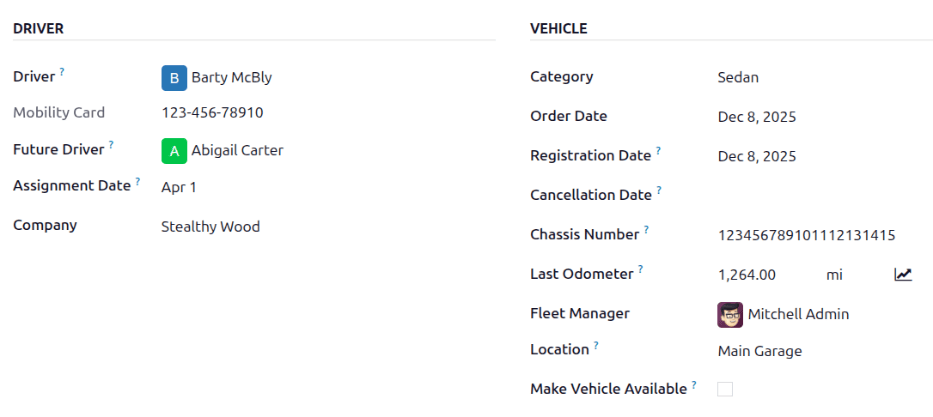
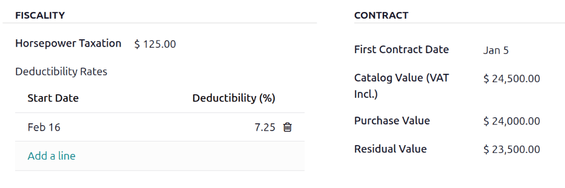
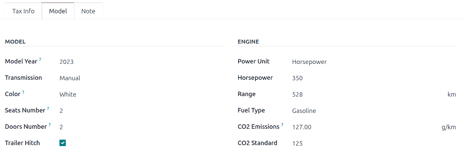

===================
Create new vehicles
===================

Odoo's *Fleet* app manages all vehicles and the accompanying documentation that comes with vehicle
maintenance and driver's records.

All vehicles are organized on the main :guilabel:`Fleet` dashboard. Each vehicle has its own
*vehicle form*, which is displayed as a card in the kanban view, according to it's status. Every
vehicle form is displayed in its current corresponding kanban stage. The default stages are
:guilabel:`New Request`, :guilabel:`To Order`, :guilabel:`Ordered`, :guilabel:`Registered`,
:guilabel:`Downgraded`, :guilabel:`Reserve`, and :guilabel:`Waiting List`.

To add a new vehicle to the fleet, click the :guilabel:`Create` button, and a blank vehicle form
loads. Enter the vehicle information in the vehicle form, then click :guilabel:`Save`.

Vehicle form fields
===================

- :guilabel:`Model`: select the vehicle's model from the drop-down menu. If the model is not listed,
  type in the model name and click either :guilabel:`Create` or :guilabel:`Create and Edit`.
- :guilabel:`License Plate`: enter the vehicle's license plate number in this field.
- :guilabel:`Tags`: select any tags from the drop-down menu, or type in a new tag. There is no limit
  on the amount of tags that can be selected.

.. note::
   The :guilabel:`Model` is the only required field on the new vehicle form. When a model is
   selected, other fields will appear on the vehicle form, and relevant information will
   auto-populate fields that apply to the model. If some of the fields do not appear, this may
   indicate there is no model selected.

Driver section
--------------

This section of the vehicle form relates to the person who is currently driving the car, as well as
any plans for a change in the driver in the future, and when.

- :guilabel:`Driver`: select the driver from the drop-down menu, or type in a new driver and click
  either :guilabel:`Create` or :guilabel:`Create and Edit`.
- :guilabel:`Mobility Card`: if the selected driver has a mobility card listed on their employee
  card in the *Employees* application, the mobility card number will appear in this field. If there
  is no mobility card listed and one should be added, :ref:`edit the employee card
  <employees/hr-settings>` in the *Employees* application.
- :guilabel:`Future Driver`: if the next driver for the vehicle is known, select the next driver
  from the drop-down menu, or type in the next driver and click either :guilabel:`Create` or
  :guilabel:`Create and Edit`.
- :guilabel:`Plan To Change Car`: if the current driver set for this vehicle plans to change their
  vehicle, either because they are waiting on a new vehicle that is being ordered, or this is a
  temporary vehicle assignment and they know which vehicle they will be driving next, check this
  box. If the current driver does not plan to change their vehicle and use this current vehicle, do
  not check this box.
- :guilabel:`Assignment Date`: select the date the vehicle will be available for another driver
  using the drop-down calendar. Select the date by navigating to the correct month and year using
  the :guilabel:`⬅️ (left arrow)` and :guilabel:`➡️ (right arrow)` icons, then click on the specific
  day. If this field is blank, this indicates the vehicle is currently available and can be
  reassigned to another driver. If it is populated, the vehicle will not be available to assign to
  another driver until the date entered.

.. important::
   A driver does **not** have to be an employee, but a driver must be listed in the *Contacts*
   application. When creating a new driver, the driver is added to the *Contacts* application, not
   the *Employees* application.

Vehicle section
---------------

This section of the vehicle form relates to the physical vehicle, it's various properties, when it
was added, where it is located, and who is managing it.

- :guilabel:`Immatriculation Date`: select the date the vehicle is acquired using the drop-down
  calendar.
- :guilabel:`Cancellation Date`: select the date the vehicle lease will expire, or when the vehicle
  will be no longer available, using the drop-down calendar.
- :guilabel:`Chassis Number`: enter the chassis number in the field. This is known in some countries
  as the :abbr:`VIN (Vehicle Identification Number)` number.
- :guilabel:`Last Odometer`: enter the last known odometer reading in the number field. Using the
  drop-down menu next to the number field, select whether the odometer reading is in kilometers
  :guilabel:`(km)` or miles :guilabel:`(mi)`.
- :guilabel:`Fleet Manager`: select the fleet manager from the drop-down menu, or type in a new
  fleet manager and click either :guilabel:`Create` or :guilabel:`Create and Edit`.
- :guilabel:`Location`: type in the location for the vehicle in the field. The most common scenario
  for when this field would be populated is if a company has several office locations. The typical
  office location where the vehicle is located would be the location entered.
- :guilabel:`Company`: select the company that the vehicle will be used for and associated with from
  the drop-down menu, or type in a new company and click either :guilabel:`Create` or
  :guilabel:`Create and Edit`.

.. important::
   Creating a new company may cause a subscription price change depending on the current plan. Refer
   to `Odoo's pricing plan <https://www.odoo.com/pricing-plan>`_ for more details.

Tax Info tab
------------

Fiscality
~~~~~~~~~

- :guilabel:`Horsepower Taxation`: enter the amount that is taxed based on the size of the vehicles
  engine. This is determined by local taxes and regulations, and varies depending on the location.
  It is recommended to check with the accounting department to ensure this value is correct.
- :guilabel:`Disallowed Expense Rate`: this is the amount of non-deductible expenses for the
  vehicle. This amount is not counted towards any deductions on a tax return or as an allowable
  expense when calculating taxable income. It is recommended to check with the accounting department
  to ensure the value(s) entered are correct.

  - :guilabel:`Start Date`: enter the :guilabel:`Start Date` and :guilabel:`(%) Percentage` for when
    the :guilabel:`Disallowed Expense Rate` value goes into effect. Click :guilabel:`Add a line` to
    enter a date. Click on the blank line to display a calendar. Select the date by navigating to
    the correct month and year using the :guilabel:`⬅️ (left arrow)` and :guilabel:`➡️ (right
    arrow)` icons, then click on the specific day. Enter the percentage that is disallowed in the
    :guilabel:`% (percent)` field to the right of the date. The percentage should be entered in an
    XX.XX format. Repeat this for all entries needed.

Contract
~~~~~~~~

- :guilabel:`First Contract Date`: select the start date for the vehicle's first contract using the
  drop-down calendar. Typically this is the day the vehicle is purchased or leased.
- :guilabel:`Catalog Value (VAT Incl.)`: enter the MSRP (Manufacturer's Suggested Retail Price) for
  the vehicle at the time of purchase or lease.
- :guilabel:`Purchase Value`: enter the purchase price or the value of the lease for the vehicle.
- :guilabel:`Residual Value`: enter the current value of the vehicle.

.. note::
   The values listed above will affect the accounting department. It is recommended to check with
   the accounting department for more information and/or assistance with these values.

Model tab
---------

If the model for the new vehicle is already configured in the database, the :guilabel:`Model` tab
will be populated with the corresponding information. If the model is not already in the database
and the :guilabel:`Model` tab needs to be configured, :ref:`configure the new vehicle model
<fleet/configuration/add-model>`.

Check the information in the :guilabel:`Model` tab to ensure it is accurate. For example, the color
of the vehicle, or whether there is a trailer hitch installed or not, are examples of information
that may need updating.

Note tab
--------

Enter any notes for the vehicle in this section.
