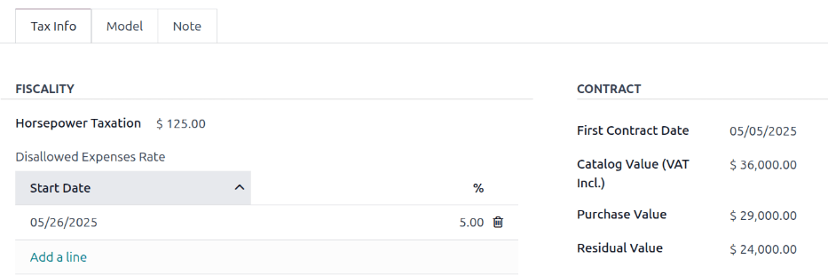

===============
Adding vehicles
===============

Odoo's **Fleet** app manages all vehicles, and the accompanying documentation that comes with
vehicle maintenance and driver records.

Upon opening the :menuselection:`Fleet` application, all vehicles are organized within the
:guilabel:`Vehicles` dashboard, which is the default dashboard. Each vehicle is displayed in its
corresponding Kanban stage, based on its status. The default stages are :guilabel:`New Request`,
:guilabel:`To Order`, :guilabel:`Registered`, and :guilabel:`Downgraded`.

.. _fleet/settings:

Settings
========

Before registering any vehicles, review two **Fleet** settings that directly affect day-to-day
operations and employee benefits:

- :ref:`End Date Contract Alert <fleet/end-contract>` — emails the contract's *Responsible* person a
  set number of days before the vehicle agreement expires, so renewals or returns aren't missed.
- :ref:`New Vehicle Request <fleet/request>` — (Belgian Payroll localization only) blocks employees
  from requesting a new company car through the salary configurator, once the available vehicles
  already exceeds the defined limit, helping control benefits costs.

To access the settings menu, go to :menuselection:`Fleet app --> Configuration --> Settings`.

.. _fleet/end-contract:

End Date Contract Alert
-----------------------

The :guilabel:`End Date Contract Alert` field shows how many days before the end of a vehicle
contract an alert should be sent. The :ref:`responsible parties <fleet/responsible>` receive an
email informing them that a vehicle contract is about to expire in the number of days defined in
this field.

.. image:: new_vehicle/fleet-settings.png
   :alt: Settings available for the Fleet application.

.. _fleet/responsible:

Responsible parties
~~~~~~~~~~~~~~~~~~~

To determine the responsible person is for a contract, open an individual contract. The person
listed as :guilabel:`Responsible` under the :guilabel:`Contract Information` section of the contract
receives the alert.

To open a contract from a list of all contracts, navigate to :menuselection:`Fleet app --> Fleet -->
Contracts` and all contracts appear in the list. Click on a :guilabel:`Contract` to open it. In the
:guilabel:`Information` section of the contract, look under :guilabel:`Responsible` to see who
receives expiration alerts.

An individual contract can also be opened from a specific vehicle by navigating to
:menuselection:`Fleet app --> Fleet --> Fleet` and clicking on an individual vehicle. On the vehicle
form, click the :guilabel:`Contracts` smart button at the top of the page. Only contracts associated
with the vehicle appear in the list. Click on an individual contract to open it. The
:guilabel:`Responsible` person is listed on the contract.

.. _fleet/request:

New Vehicle Request (Belgian Payroll - Fleet)
---------------------------------------------

Enter the maximum fleet size that may be reached through the salary-configurator flow. When the
total number of available vehicles (vehicles without an assigned driver) is equal to or below this
limit, employees can request a new company car. Once the available vehicles exceeds the limit, the
request option is hidden.

.. example::
   If the :guilabel:`New Vehicle Request` limit is set to 20 vehicles, and there are 25 vehicles
   available, employees cannot request a new car and must select from the 25 already available. If
   there are only 10 cars available, then the employee would be able to request a new vehicle.

.. note::
   This settings option **only** appears if the :guilabel:`Belgian-Payroll-Fleet` module is
   installed for the Belgian localization.

Add a vehicle
=============

To add a new vehicle to the fleet from the :guilabel:`Vehicles` dashboard, click the :guilabel:`New`
button in the top-left corner, and a blank vehicle form loads. Then, proceed to enter the vehicle
information on the vehicle form.

.. _fleet/new_vehicle/vehicle-form:

Vehicle form fields
===================

- :guilabel:`Model`: Using the drop-down menu, select the vehicle's model. Once a model is selected,
  additional fields may appear on the form. If the model is not listed, type in the model name, and
  click either :guilabel:`Create "model"`, or :guilabel:`Create and edit...` to :ref:`create a new
  model and edit the model details <fleet/add-model>`.
- :guilabel:`License Plate`: Enter the vehicle's license plate number.
- :guilabel:`Tags`: Select any tags from the drop-down menu, or type in a new tag. There is no limit
  on the amount of tags that can be selected.

.. note::
   The :guilabel:`Model` is the *only* required field on the new vehicle form. When a model is
   selected, other fields appear on the vehicle form, and relevant information auto-populates the
   fields that apply to the model. If some of the fields do not appear, this may indicate there is
   no model selected.

.. _fleet/new_vehicle/new-driver:

Driver
------

This section of the vehicle form relates to the person who is currently driving the car, as well as
any plans for a change in the driver in the future, and when.

- :guilabel:`Driver`: Using the drop-down menu, select the driver for the vehicle. If the driver is
  not listed, :ref:`create the new driver, and edit the driver details
  <fleet/new_vehicle/add-driver>`.

  .. important::
     A driver does *not* have to be an employee. When creating a new driver, the driver is added to
     the **Fleet** app, *not* the **Employees** app.

     If the **Contacts** app is installed, the driver information is also stored there.

- :guilabel:`Mobility Card`: If the selected driver has a mobility card (such as a gas card) listed
  on their employee record in the **Employees** application, the mobility card number automatically
  appears in this field. If there is no mobility card listed, and one should be added, :ref:`edit
  the employee record <employees/hr-settings>` in the **Employees** application.
- :guilabel:`Future Driver`: If the next driver for the vehicle is known, select the next driver
  from the drop-down menu. Or, type in the next driver and click either :guilabel:`Create "future
  driver"` or :guilabel:`Create and edit...` to :ref:`create a new future driver, and edit the
  driver details <fleet/new_vehicle/add-driver>`.

  .. note::
     If this field is populated, a :guilabel:`Apply New Driver` button appears on the vehicle form.
     Click the :guilabel:`Apply New Driver` button to change the driver information.

- :guilabel:`Plan To Change Car`: Tick this box when the current driver already knows they'll switch
  to another vehicle, whether they are awaiting an ordered car, using this one only temporarily, or
  are leaving the company.
- :guilabel:`Assignment Date`: Using the calendar selector, select when the vehicle is available for
  another driver. If this field is left blank, that indicates the vehicle is currently available,
  and can be assigned to another driver. If it is populated, the vehicle is not available for
  another driver until the selected date.
- :guilabel:`Company`: Select the company from the drop-down menu. This field only appears in a
  multi-company database.

.. _fleet/new_vehicle/add-driver:

Create a new driver
~~~~~~~~~~~~~~~~~~~

If a driver is not already in the system, the new driver should first be configured and added to the
database. A new driver can be added either from the :guilabel:`Driver` or :guilabel:`Future Driver`
fields on the :ref:`vehicle form <fleet/new_vehicle/vehicle-form>`.

First, type in the name of the new driver in either the :guilabel:`Driver` or :guilabel:`Future
Driver` field, then click :guilabel:`Create and edit...`. A :guilabel:`Create Driver` or
:guilabel:`Create Future Driver` form appears, depending on which field initiated the form.

Both the :guilabel:`Create Driver` and :guilabel:`Create Future Driver` forms are identical, and are
stored in the **Contacts** app. :doc:`Configure the new contact <../../essentials/contacts>`, then
click :guilabel:`Save & Close`.

.. note::
   Depending on the installed applications, different tabs or fields may be visible on the
   :guilabel:`Create Driver` and :guilabel:`Create Future Driver` forms.

.. _fleet/new_vehicle/general-info:

Vehicle
-------

This section captures key physical details of a vehicle. Selecting an existing Model may auto-fill
some fields.

Fill in the following fields on the form:

- :guilabel:`Category`: Using the drop-down menu, select the vehicle category from the available
  options. If the **Inventory** app is installed, the category affects any configured :doc:`dispatch
  management system
  <../../inventory_and_mrp/inventory/shipping_receiving/setup_configuration/dispatch>`.
- :guilabel:`Order Date`: Using the calendar selector, select the date the vehicle was ordered.
  Keeping track of how long vehicles have been in the fleet can help when making decisions on
  expensive repairs, or help decide when to surrender a vehicle.
- :guilabel:`Registration Date`: Using the calendar selector, select the date the vehicle was
  registered. Many regions require proper registration, so keeping track of registration dates is
  important.
- :guilabel:`Cancellation Date`: Using the calendar selector, select the date the vehicle lease
  expires, or when the vehicle is no longer part of the fleet (e.g., sold, plates surrendered).
- :guilabel:`Chassis Number`: Enter the chassis number in the field. This is known in some countries
  as the :abbr:`VIN (Vehicle Identification Number)` number. Every vehicle has a unique number, so
  in the event of a theft or accident, a vehicle can be identified with this unique number.
- :guilabel:`Last Odometer`: Enter the last known odometer reading in the number field. Using the
  drop-down menu next to the number field, select whether the odometer reading is in kilometers
  :guilabel:`(km)` or miles :guilabel:`(mi)`. Keeping track of a vehicle's mileage is crucial when
  determining the value of the vehicle for both tax purposes and resale value.
- :guilabel:`Fleet Manager`: Select the fleet manager from the drop-down menu, or type in a new
  fleet manager, and click either :guilabel:`Create` or :guilabel:`Create and edit...`.
- :guilabel:`Location`: Type in the specific location where the vehicle is typically located in this
  field. The entry should clearly explain where the vehicle can be found, such as `Main Garage` or
  `Building 2 Parking Lot`. This is crucial information for companies with many locations where
  vehicles are stored.

.. image:: new_vehicle/new-vehicle-type.png
   :alt: The new vehicle form, showing the vehicle tax section.

Tax Info tab
------------

Depending on the localization setting for the database, and what additional applications are
installed, other fields may be present on the form.

The sections below are default and appear for all vehicles, regardless of other installed
applications or localization settings.

Fiscality
~~~~~~~~~

- :guilabel:`Horsepower Taxation`: Enter the amount that is taxed based on the size of the vehicle's
  engine. This is determined by local taxes and regulations, and varies depending on the location.
  It is recommended to check with the accounting department to ensure this value is correct.
- :guilabel:`Disallowed Expenses Rate`: Configure the dates and percentages of the vehicle-related
  costs (fuel, maintenance, depreciation, etc.) that **cannot** be deducted from the company's
  taxable income.

Contract
~~~~~~~~

- :guilabel:`First Contract Date`: Select the start date for the vehicle's first contract using the
  calendar selector. Typically this is the day the vehicle is purchased or leased.
- :guilabel:`Catalog Value (VAT Incl.)`: Enter the :abbr:`MSRP (Manufacturer's Suggested Retail
  Price)` for the vehicle at the time of purchase or lease.
- :guilabel:`Purchase Value`: Enter the purchase price or the original value of the lease for the
  vehicle.
- :guilabel:`Residual Value`: Enter the current value of the vehicle.

.. note::
   The values listed above affect the accounting department. It is recommended to check with the
   accounting department for more information and/or assistance with these values.

Model tab
---------

If the model for the new vehicle is already configured in the database, the :guilabel:`MODEL` and
:guilabel:`ENGINE` sections are populated with the corresponding information. If the model is *not*
already in the database and the :guilabel:`Model` tab needs to be configured, :ref:`configure the
new vehicle model <fleet/add-model>`.

Check the information in the :guilabel:`Model` tab to ensure it is accurate. For example, the color
of the vehicle, or if a trailer hitch is installed, are examples of common information that may need
updating.

Note tab
--------

Enter any notes for the vehicle in this section.

.. image:: new_vehicle/model-tab.png
   :alt: The new vehicle form, showing the vehicle tax section.

.. seealso::
   - :doc:`../fleet/models`
   - :doc:`../fleet/service`
   - :doc:`../fleet/accidents`
