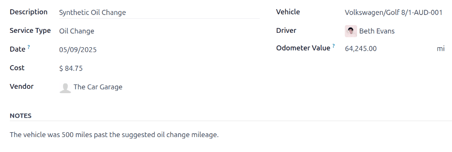
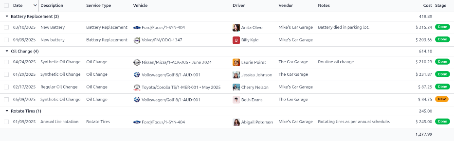
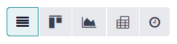
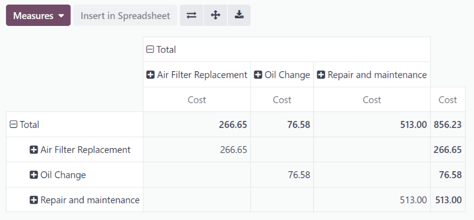

========
Services
========

To properly maintain a fleet of vehicles, regular maintenance as well as periodic repairs are
needed. Scheduling repairs and managing services for an entire fleet is necessary to ensure all
vehicles are in good working order when they are needed.

Create a service record
=======================

To log a service, go to the main services dashboard by navigating to :menuselection:`Fleet app -->
Fleet --> Services`. Click :guilabel:`Create` and a service form appears. Fill in the information on
the form and click :guilabel:`Save`. The only two fields that are required to be populated are
:guilabel:`Service Type` and :guilabel:`Vehicle`.

The fields are:

- :guilabel:`Description`: enter in a short description of the service.
- :guilabel:`Service Type`: select the type of service performed from the drop-down menu, or type in
  a new type of service and click either :guilabel:`Create` or :guilabel:`Create & Edit...`. This
  list is not pre-configured in Odoo. When creating a fleet and logging a service, the types of
  service need to be created.
- :guilabel:`Date`: using the calendar module, select the date the service was provided or is
  scheduled to be performed. Navigate to the desired month using the left and right arrow icons,
  then click on the date to select it.
- :guilabel:`Cost`: enter the cost of the service.
- :guilabel:`Vendor`: select the vendor who performed the service from the drop-down menu. If the
  vendor has not already been entered in the system, type in the vendor name and click either
  :guilabel:`Create` to add them, or :guilabel:`Create & Edit...` to create the vendor and edit the
  vendor form. The vendor form allows for other details aside form the name to be entered, such as
  contact information.
- :guilabel:`Vehicle`: select the vehicle that was serviced from the drop-down menu. When the
  vehicle is selected, the :guilabel:`Driver` field is populated, and the unit of measure for the
  :guilabel:`Mileage` field appears.
- :guilabel:`Driver`: the current driver listed for the selected vehicle is populated when the
  :guilabel:`Vehicle` is selected. If the driver needs to be changed, another driver can be selected
  from the drop-down menu.
- :guilabel:`Odometer Value`: enter the odometer reading when the service was done. The units of
  measure will either be in kilometers (:guilabel:`km`) or miles (:guilabel:`mi`). When the
  :guilabel:`Vehicle` is selected, the units of measure is populated. This comes from the vehicle
  form. To change from kilometers to miles, or vice versa, click the :guilabel:`External Link`
  button next to the vehicle selected in the :guilabel:`Vehicle` field. Change the unit of measure,
  then click :guilabel:`Save`. the unit of measure will be updated in the :guilabel:`Odometer Value`
  field.
- :guilabel:`Notes`: enter any notes for the repair in the notes tab at the bottom of the service
  form.

List of services
================

To view all services logged in the database, including old and new requests, go to
:menuselection:`Fleet application --> Fleet --> Services`. All services appear in a list view,
including all the details for each service.

Each service listed displays the following information:

- :guilabel:`Date`: the date service or repair was performed or is requested to be performed.
- :guilabel:`Description`: a short description of the specific type of service or repair performed
  to clarify the specific service.
- :guilabel:`Service Type`: the service or repair performed. This is selected from a list of
  services that must be configured.
- :guilabel:`Vehicle`: the specific vehicle the service was performed on.
- :guilabel:`Driver`: who the current driver is for the vehicle.
- :guilabel:`Vendor`: the specific vendor who performed the service or repair.
- :guilabel:`Cost`: the total cost for the service or repair.
- :guilabel:`Notes`: any information associated with the service or repair that is documented to add
  clarification.
- :guilabel:`Stage`: the status of the service or repair. Options are :guilabel:`New`,
  :guilabel:`Running`, :guilabel:`Canceled`, or :guilabel:`Done`.

View services
-------------

It is recommended to view the list of services in one of several pre-configured ways to better view
the information presented. In the top right corner of the list, there are several icons that when
clicked, sort the data in different ways.

         different ways.

List view
~~~~~~~~~

The default view of the services is the list view. This presents all the services in chronological
order, from oldest to newest, in a list.

The information can be sorted by any column. At the top of each column, hover over the column name.
An arrow appears to the right of the name. Click the arrow to sort the data by that specific column.

The default sorting is descending alphabetical order (A to Z). Click the arrow again to reverse the
order, and go in reverse alphabetical order (Z to A). The one exception to this sorting is the
default :guilabel:`Date` column, which sorts the information in chronological order (January to
December) instead of alphabetical order.

Kanban view
~~~~~~~~~~~

To view services by their stage, click on the :guilabel:`Kanban icon`, which is the second icon in
the top right, and appears as four black squares in a cube.

All the services with the same status appear in the corresponding column, from :guilabel:`Running`
to :guilabel:`Cancelled`. To change the status of a service, simply click and drag the service card
to the desired stage.

Graph view
~~~~~~~~~~

Another way to view the data is in a graph. To view the graph, click the :guilabel:`Graph icon`,
which is the third icon in the top right, and appears as a small graph.

The graph displays the information in a graph where the X axis represents the :guilabel:`Date` and
the Y axis represents the :guilabel:`Cost`. Each column represents a single month, and then is
further organized by vehicle. Each vehicle is represented by a different color, and each month's bar
is divided by each vehicle.

Pivot view
~~~~~~~~~~

The final way to view the service data is in a spreadsheet pivot table. Click on the
:guilabel:`Pivot icon`, which is the last icon in the top right, and appears as a small spreadsheet.

The data presented in the table shows the cost of each service or repair. The rows represent the
vendors, and each vehicle that was serviced by them appears beneath each vendor. The column
represent the different service types performed.

The table can be inserted in a spreadsheet or downloaded. To add the pivot table to a spreadsheet in
Odoo, click :guilabel:`Insert In Spreadsheet` and a pop-up appears. Select the spreadsheet the data
should be added to from the drop-down menu, and click :guilabel:`Confirm`. The spreadsheet then
loads on the screen. The spreadsheets are stored in Odoo's *Documents* application. To download the
table in an `xlsx` format, click the :guilabel:`Download` icon.

         Documents application.
