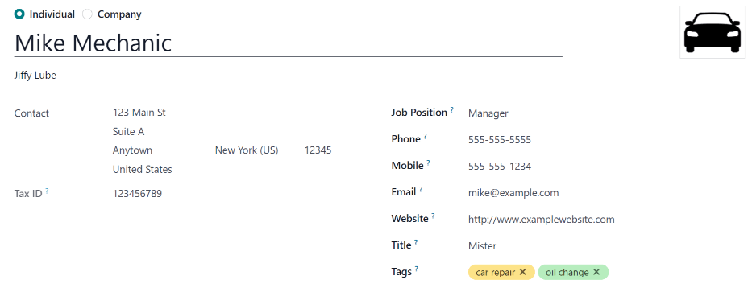
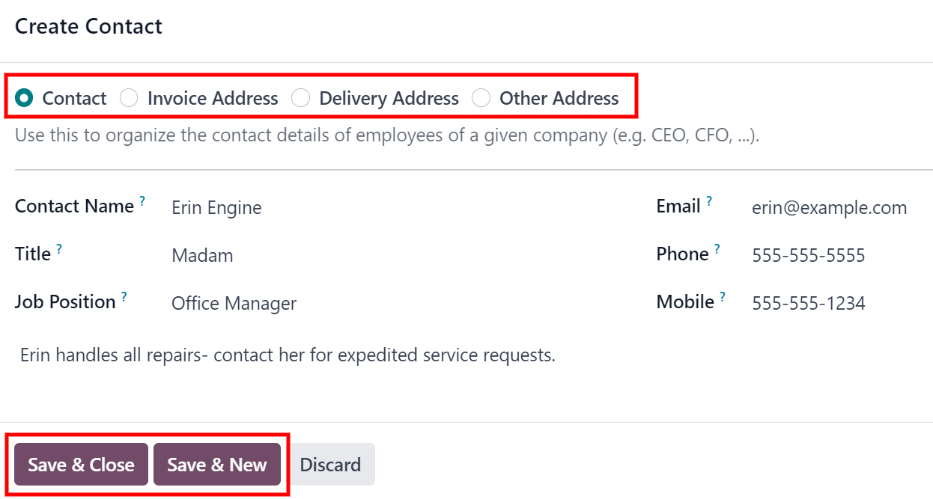
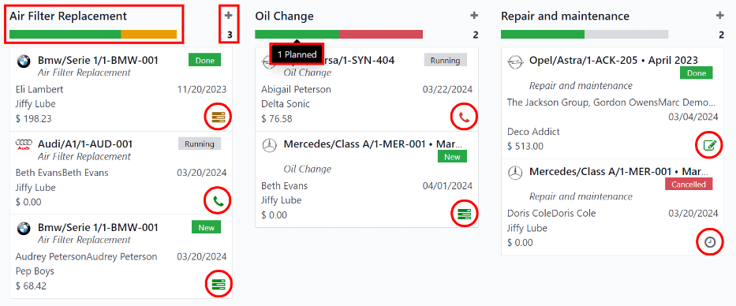
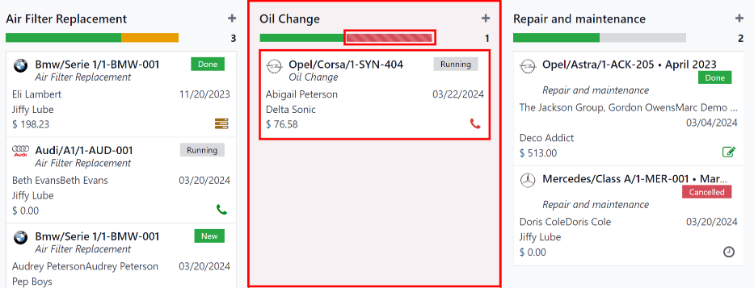
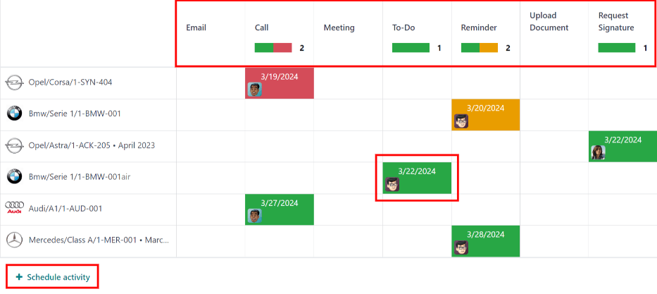

========
Services
========

To properly maintain a fleet of vehicles, regular maintenance as well as periodic repairs are
needed. Scheduling repairs and managing services for an entire fleet is necessary to ensure all
vehicles are in good working order when they are needed.

.. _fleet/service-form:

Create service records
======================

To log a service for a vehicle, go to the main :guilabel:`Services` dashboard by navigating to
:menuselection:`Fleet app --> Fleet --> Services`. Open a new service form by clicking the
:guilabel:`New` button in the top-left corner.

Fill out the information on the form. The only two fields that are required to be populated are
:guilabel:`Service Type` and :guilabel:`Vehicle`.

The service form automatically saves as data is entered. However, the form can be saved manually at
any time by clicking the :guilabel:`Save manually` option, represented by a :guilabel:`(cloud
upload)` icon.

The fields on the form are:

- :guilabel:`Description`: enter a brief description of the service.
- :guilabel:`Service Type`: select the type of service performed using the drop-down menu. Or, enter
  a new type of service, and click either :guilabel:`Create "service type"` or :guilabel:`Create and
  edit...` to :ref:`add the service type and configure it <fleet/new-type>`.

  .. important::
     :guilabel:`Service Types` are **not** pre-configured in Odoo. When logging a service for the
     first time, the *type* of service needs to be :ref:`created <fleet/new-type>` before it can be
     selected.

- :guilabel:`Date`: using the calendar popover window, select the date the service was provided, or
  is scheduled to be performed. Navigate to the desired month using the :guilabel:`< > (arrow)`
  icons, then click on the date to select it.
- :guilabel:`Cost`: enter the cost of the service.
- :guilabel:`Vendor`: select the vendor who performed the service using the drop-down menu. If the
  vendor has not already been entered in the system, type in the vendor name, and click either
  :guilabel:`Create` to add them, or :guilabel:`Create and edit...` to :ref:`add and configure the
  vendor <fleet/new-vendor>`.
- :guilabel:`Vehicle`: select the vehicle that was serviced from the drop-down menu. When the
  vehicle is selected, the :guilabel:`Driver` field is populated, and the unit of measure for the
  :guilabel:`Odometer Value` field appears.
- :guilabel:`Driver`: the current driver listed for the selected vehicle is populated when the
  :guilabel:`Vehicle` is selected. If the driver needs to be changed, another driver can be selected
  from the drop-down menu.
- :guilabel:`Odometer Value`: enter the odometer reading when the service was done. The units of
  measure are either in kilometers (:guilabel:`km`) or miles (:guilabel:`mi`), depending on how the
  selected vehicle was configured.

  When the :guilabel:`Vehicle` is selected, the unit of measure for this field is populated. This
  comes from the vehicle form.

  .. tip::
     To change from kilometers to miles, or vice versa, click the :guilabel:`Internal Link` button
     to the right of the vehicle selected in the :guilabel:`Vehicle` field.

     Change the unit of measure, then navigate back to the service form, via the breadcrumb links.
     The unit of measure is then updated in the :guilabel:`Odometer Value` field.

- :guilabel:`Notes`: enter any notes for the repair at the bottom of the service form.

.. image:: service/new-service.png
   :align: center
   :alt: Enter the information for a new service. The required fields are Service Type and Vehicle.

.. _fleet/new-type:

Create service type
-------------------

Service types must be created from a service form. There is no other way to access the list of
service types.

On the :ref:`service form <fleet/service-form>`, type in the name of the new :guilabel:`Service
Type` in the corresponding field. Then, click :guilabel:`Create and edit...`, and a
:guilabel:`Create Service Type` pop-up form appears.

The service type entered on the service form automatically populates the :guilabel:`Name` field,
which can be modified, if desired.

Then, select the :guilabel:`Category` for the new service type from the drop-down menu in that
field. The two default options to choose from are :guilabel:`Contract` or :guilabel:`Service`.
Additional categories **cannot** be created.

If the service applies to **only** contracts or services, select the corresponding
:guilabel:`Category`. If the service applies to **both** contracts *and* services, leave this field
blank.

When done, click :guilabel:`Save & Close`.

.. _fleet/new-vendor:

Create vendor
-------------

When a service is done for the first time, typically, the vendor is not in the database yet. It is
best practice to add the full details for a vendor in the database, so that any necessary
information can be easily retrieved.

On the :ref:`service form <fleet/service-form>`, type in the name of the new :guilabel:`Vendor` in
the corresponding field. Then, click :guilabel:`Create and edit...`, and a :guilabel:`Create
Vendor` form appears.

The vendor name entered on the service form populates the :guilabel:`Name` field, by default. This
field can be modified, if desired.

.. note::
   Different tabs or fields may be visible on the :guilabel:`Create Vendor` form, depending on what
   other applications are installed.

General information
~~~~~~~~~~~~~~~~~~~

Fill out the following information in the top-half of the form:

- :guilabel:`Individual` or :guilabel:`Company`: select whether the new vendor being added is an
  individual or a company, by clicking the corresponding radio button.

  When a selection is made, some fields may disappear from the form. If any of the fields below are
  not visible, that is because :guilabel:`Company` was selected, instead of :guilabel:`Individual`.
- :guilabel:`Name`: enter a name for the individual or company in this field.
- :guilabel:`Company Name`: using the drop-down menu, select the company that the vendor is
  associated with, if any.

  If the :guilabel:`Company` radio button at the top of the form is selected, this field does not
  appear.
- :guilabel:`Contact`: enter the contact information in this section.

  If desired, the :guilabel:`Contact` field can be changed to a different type of contact. Click on
  :guilabel:`Contact` to reveal a drop-down menu. The available options to select are
  :guilabel:`Contact`, :guilabel:`Invoice Address`, :guilabel:`Delivery Address`,
  :guilabel:`Follow-up Address`, or :guilabel:`Other Address`.

  If desired, select one of these other options for the :guilabel:`Contact` field, and enter the
  corresponding information.

  If :guilabel:`Company` is selected for the  :guilabel:`Individual` or :guilabel:`Company` field,
  this field is labeled :guilabel:`Address`, and **cannot** be modified.

- :guilabel:`Tax ID`: enter the vendor's tax ID in this field.
- :guilabel:`Job Position`: enter the vendor's job position in this field. If the
  :guilabel:`Company` radio button at the top of the form is selected, this field does not appear.
- :guilabel:`Phone`: enter the vendor's phone number in this field.
- :guilabel:`Mobile`: enter the vendor's mobile number in this field.
- :guilabel:`Email`: enter the vendor's email address in this field.
- :guilabel:`Website`: enter the vendor's website address in this field.
- :guilabel:`Title`: using the drop-down menu, select the vendor's title in this field. The default
  options are :guilabel:`Doctor`, :guilabel:`Madam`, :guilabel:`Miss`, :guilabel:`Mister`, and
  :guilabel:`Professor`.

  If the :guilabel:`Company` radio button at the top of the form is selected, this field does not
  appear.
- :guilabel:`Tags`: using the drop-down menu, select any tags that apply to the vendor.

  To add a new tag, type in the tag, then click :guilabel:`Create "tag"`.

  There is no limit to the number of tags that can be selected.
- :guilabel:`Image`: a photo of either the main contact person, or the company logo, can be added to
  the form. Hover over the :guilabel:`📷 (camera)` box, in the top-right of the form, to reveal a
  :guilabel:`✏️ (pencil)` icon, and click it. A file explorer window appears. Navigate to the
  desired file, then click :guilabel:`Open` to select it.

Contacts & Addresses tab
************************

After the top-half of the :guilabel:`Create Vendor` form is filled out, add any other contacts and
addresses associated with the vendor in this tab.

Click the :guilabel:`Add` button to add a new contact, and a :guilabel:`Create Contact` pop-up
window appears.

Select one of the appropriate contact type options from the radio buttons, located at the top of the
pop-up window. Those options are as follows:

- :guilabel:`Contact`: select this option to add general contact details for employees of the
  associated vendor.
- :guilabel:`Invoice Address`: select this option to add a preferred address for all invoices. When
  added to the form, this address is selected by default when sending an invoice to the associated
  vendor.
- :guilabel:`Delivery Address`: select this option to add a preferred address for all deliveries.
  When added to the form, this address is selected by default when delivering an order to the
  associated vendor.
- :guilabel:`Follow-up Address`: select this option to add a preferred address for all follow-up
  correspondence. When added to the form, this address is selected by default when sending reminders
  about overdue invoices.
- :guilabel:`Other Address`: select this option to add any other necessary addresses for the vendor.

.. note::
   If an option *other than* :guilabel:`Contact` is selected for the contact type, an
   :guilabel:`Address` section appears on the form. Enter the address details in the
   :guilabel:`Address` section.

Add any notes to the :guilabel:`Internal notes...` section of the form.

After all of the information is added, click either :guilabel:`Save & Close` to add the one new
contact, or :guilabel:`Save & New` to add the current address record and create another address
record.

As contacts are added to this tab, each contact appears in a separate box, with an icon indicating
what type of contact is listed.

.. example::
   A :guilabel:`Delivery Address` displays a :guilabel:`⛟ (truck)` icon inside that specific address
   box, whereas an :guilabel:`Invoice Address` displays a :guilabel:`💵 (dollar bill)` icon inside.

   .. image:: service/contact-tab.png
      :align: center
      :alt: The create contact form with all parts filled in.

Sales & Purchase tab
********************

Enter the following sales and purchasing information for the various sections below. Depending on
the other installed applications, additional fields and sections may appear. The following are all
default fields for the *Fleet* application only.

Sales
^^^^^

- :guilabel:`Salesperson`: using the drop-down menu, select a user as the main point of contact for
  sales with this vendor.

  This person **must** be an internal user of the company, meaning they can log into the database as
  a user.

Misc
^^^^

- :guilabel:`Company ID`: if the company has an ID number **other than** its *tax ID*, enter it in
  this field.
- :guilabel:`Reference`: enter any text to give more information regarding the contact. This is an
  internal note to provide any additional information.

  .. example::
     A company has several people with the same name, Mary Jones. The :guilabel:`Reference` field
     could state `Mary Jones at X108 - returns` to provide additional details.

Internal Notes tab
******************

Add any notes that pertain to the vendor, or any other necessary information, in this tab.

List of services
================

To view all services logged in the database, including old and new requests, navigate to
:menuselection:`Fleet app --> Fleet --> Services`. All services appear in a list view, including all
the details for each service.

The service records are grouped by :ref:`service type <fleet/new-type>`. The number of repairs for
each service type appears in parentheses after the name of the service type.

Each service listed displays the following information:

- :guilabel:`Date`: the date that the service, or repair, was performed (or requested to be
  performed).
- :guilabel:`Description`: a short description of the specific type of service, or repair, performed
  to clarify the specific service.
- :guilabel:`Service Type`: the type of service, or repair, performed. This is selected from a list
  of services that :ref:`must be configured <fleet/new-type>`.
- :guilabel:`Vehicle`: the specific vehicle the service was performed on.
- :guilabel:`Driver`: the current driver for the vehicle.
- :guilabel:`Vendor`: the specific vendor who performed the service, or repair.
- :guilabel:`Notes`: any information associated with the service, or repair, that is documented to
  add clarification.
- :guilabel:`Cost`: the total cost of the service, or repair.
- :guilabel:`Stage`: the status of the service, or repair. Options are :guilabel:`New`,
  :guilabel:`Running`, :guilabel:`Done`, or :guilabel:`Canceled`.

At the bottom of the :guilabel:`Cost` column, the total cost of all services and repairs are listed.

.. image:: service/services.png
   :align: center
   :alt: The full list of services in the Odoo database.

View services
-------------

It is recommended to view the list of services in one of several pre-configured ways to better view
the information presented. In the top-right corner of the list, there are several icons that when
clicked, sort the data in different ways.

.. image:: service/views.png
   :align: center
   :alt: The icons in the top right corner than can be clicked to present the information in
         different ways.

List view
~~~~~~~~~

The default view of the service records is a list view. This presents all the services, first
grouped alphabetically by type of service, then grouped by status.

The information can be re-sorted by any column. At the top of each column, hover over the column
name, and an arrow appears in the far-right of that column. Click the arrow to sort the data by that
specific column.

The default sorting is in descending alphabetical order (A to Z), represented by a :guilabel:`⌄
(down arrow)` icon. Click the :guilabel:`⌄ (down arrow)` icon to reverse the alphabetical order (Z
to A). The :guilabel:`⌄ (down arrow)` icon changes to an :guilabel:`^ (up arrow)` icon.

The two exceptions to this sorting are the default :guilabel:`Date` column and the :guilabel:`Cost`
column. The :guilabel:`Date` column sorts the information in chronological order (January to
December), instead of alphabetical order. The :guilabel:`Cost` column sorts the information by
repair price, from lowest to highest.

Add a service
*************

To add a service record from the list view, click the :guilabel:`New` button, and a service form
loads. :ref:`Enter all the information <fleet/service-form>` on the service form.

The form automatically saves as data is entered.

Kanban view
~~~~~~~~~~~

To view services by their stage, click the :guilabel:`Kanban` button, which is the second icon in
the top-right corner, and appears as two different length bars beneath a line.

All services are organized by service type, and appear in the corresponding Kanban column.

The number of repairs for each type of service appears in the far-right of each Kanban column
header.

The collective status of the scheduled activities for each service type appears in the color-coded
bar beneath each Kanban column title. Repairs with activities scheduled in the future appear green,
activities due today appear yellow, overdue activities appear red, and repairs with no activities
scheduled appear gray.

Each Kanban card displays a color-coded activity-related icon, such as a :guilabel:`🕘 (clock)` icon
or :guilabel:`📞 (phone)` icon, for example. These icons indicate both the type of scheduled
activity and the status. The status of the activity corresponds to the colors in the status bar.
Click on an activity icon to view the details of that specific activity.

The length of the color bar is proportionate to the number of corresponding activities with that
specific status in that particular stage. Hover over a color section to reveal the number of service
records in that specific grouping.

To view **only** the records with a specific status, click the desired color bar section. The
background color for the column changes to a pale hue of the same color (either green, yellow, red,
or gray), and the color bar appears striped instead of solid. **Only** repairs and services with the
selected status appear in the column.

.. _fleet/schedule-activity:

Schedule activities
*******************

To schedule an activity for a repair or service from the Kanban view, click the activity icon in the
lower-right corner of the service record, and click :guilabel:`+ Schedule an activity`. A
:guilabel:`Schedule Activity` pop-up window appears.

.. note::
   Depending on what kind of activity, if any, is scheduled, the activity icon may appear
   differently. For example, a :guilabel:`📞 (phone)` appears if a phone call is scheduled, or an
   :guilabel:`✉️ (envelope)` appears if an email is scheduled.

Enter the following information on the form:

- :guilabel:`Activity Type`: using the drop-down menu, select the activity being scheduled. The
  default options are :guilabel:`Email`, :guilabel:`Call`, :guilabel:`Meeting`, :guilabel:`To-Do`,
  and :guilabel:`Upload Document`.
- :guilabel:`Summary`: enter a short description of the activity, such as `Schedule oil change`.
- :guilabel:`Due Date`: using the calendar popover, select the date the activity must be completed.
  Using the :guilabel:`< (left)` and :guilabel:`> (right)` arrow icons, navigate to the desired
  month, then click on the date to select it.
- :guilabel:`Assigned to`: using the drop-down menu, select the user responsible for the activity.
- :guilabel:`Notes`: add any notes or details in the blank area in the bottom-half of the form.

When the :guilabel:`Schedule Activity` is completed, click :guilabel:`Schedule` to schedule the
activity, or click :guilabel:`Done & Schedule Next` to schedule the current activity and schedule
another activity for the same repair.

.. seealso::
   For more detailed information regarding activities, refer to the main :doc:`activities
   <../../essentials/activities>` document.

Add a service
*************

A new repair can be added from this view. Click the :guilabel:`➕ (plus icon)` in the top-right
corner of the Kanban column, and a new block appears at the top of the column, beneath the Kanban
title.

Enter a :guilabel:`Title` for the service or repair, then click :guilabel:`Add`. A
:guilabel:`Create` service form appears in a pop-up window. :ref:`Enter all the information
<fleet/service-form>` on the service form, then click :guilabel:`Save & Close` to add the record.
The new record now appears in the Kanban column.

Graph view
~~~~~~~~~~

Another way to view the data is in a graph. To change to the graph view, click the :guilabel:`Graph`
icon, which is the third icon in the top-right, and appears as a small graph.

The default graph view displays the service information in a stacked bar chart, grouped by
:guilabel:`Service Type`. The X-axis represents the :guilabel:`Service Type` and the Y-axis
represents the :guilabel:`Cost`.

Each column visually represents the total cost for all repairs and services for that specific
:guilabel:`Service Type`. Hover over any bar to reveal a popover window that displays the total
:guilabel:`Cost` for the service and repairs the bar represents.

The graph can change to either a :guilabel:`Line Chart` or a :guilabel:`Pie Chart` by clicking the
corresponding button above the graph. Additionally, the graph can display the data in either
:guilabel:`Stacked`, :guilabel:`Descending`, or :guilabel:`Ascending` order, by clicking the
corresponding buttons.

.. image:: service/bar-chart.png
   :align: center
   :alt: A bar chart view of the services and repairs, with the various option buttons highlighted.

Pivot view
~~~~~~~~~~

Another way to view the service data is in a spreadsheet pivot table. Click the :guilabel:`Pivot`
icon, which is the fourth icon in the top-right, and appears as a small spreadsheet.

The default way the data is presented shows the total cost of each type of service. The horizontal
rows represent the various types of service, with a different service type in its own line. The
vertical columns represent the total costs for each specific type of service, further divided by the
type of service.

.. image:: service/pivot.png
   :align: center
   :alt: The default pivot table view of the services.

The table can either be inserted in a spreadsheet or downloaded, if desired.

To add the pivot table to a spreadsheet in Odoo, first, the appearance of the pivot table must
change. The default pivot table view does not allow it to be inserted into a spreadsheet (the
:guilabel:`Insert in Spreadsheet` button is grayed out).

First, click the :guilabel:`➖ (minus)` icon to the left of :guilabel:`Total` at the top of the pivot
table. This collapses the service types, leaving only a single :guilabel:`Cost` column visible.

Then, click the :guilabel:`Insert in Spreadsheet` button, which is no longer grayed out, and a
:guilabel:`Select a spreadsheet to insert your pivot` pop-up window appears. Two tabs are visible in
this pop-up window, a :guilabel:`Spreadsheets` tab and a :guilabel:`Dashboards` tab.

Click the desired tab to indicate where the spreadsheet should be placed, either in a
:guilabel:`Spreadsheet` or on a :guilabel:`Dashboard`. After clicking the desired option, click
:guilabel:`Confirm`. The spreadsheet then loads on the screen.

.. note::
   Spreadsheets are stored in Odoo's *Documents* application, while dashboards are stored in Odoo's
   *Dashboards* application.

Click :guilabel:`Services` in the top-left corner to navigate back to the previous pivot table view.

To download the table in an *xlsx* format, click the download xlsx icon, represented by a
:guilabel:`⬇️ (down arrow above a line)` icon.

.. seealso::
   For more detailed information regarding reporting, refer to the main :doc:`reporting
   <../../essentials/reporting>` document.

Activity view
~~~~~~~~~~~~~

To view the scheduled activities for services or repairs, click the :guilabel:`🕗 (clock)` activity
icon in the top-right corner of the screen. This presents all activities, organized by vehicle and
activity type.

The vertical columns are organized by activity type, and the horizontal lines are organized by
vehicle.

The entries are color-coded according to the status of each activity. Green activities are scheduled
in the future, yellow activities are due today, and red activities are overdue.

The user responsible for the activity appears in a photo in the lower-left corner of each activity
entry.

The due date of each activity is written in the top-center of each activity entry.

A color-coded bar at the top of each activity column indicates the status of the activities within
that column.

The number of activities for each activity type is written on the right side of the color-coded bar
beneath the column name.

Schedule an activity
********************

To add a service record from the activity view, click :guilabel:`+ Schedule an activity` in the
bottom-left corner of the list, and a :guilabel:`Search: Services` pop-up window loads. Click the
service that the activity is being scheduled for, and a :guilabel:`Schedule Activity` form loads.

:ref:`Enter all the information <fleet/schedule-activity>` on the activity form.

When the form is complete, click the :guilabel:`Schedule` button. Then, both pop-up windows close,
and the activity now appears on the activity view.
