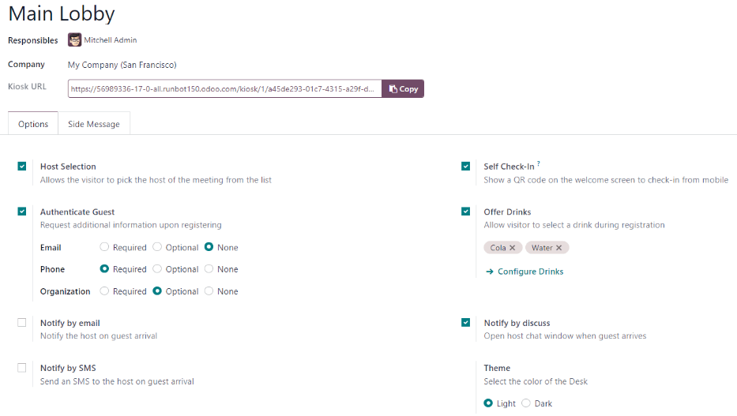
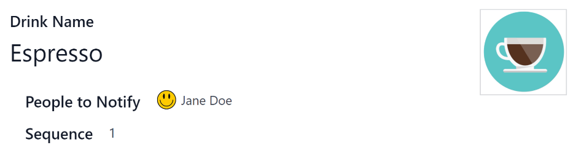
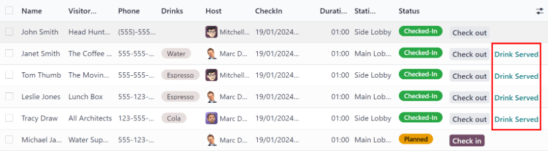

=========
Frontdesk
=========

The Odoo *Frontdesk* application provides a way for visitors to check in to a building or location,
and alert the person they are meeting about their arrival. Additionally, they can request a
pre-configured beverage to be brought to them, while they wait.

This application is ideal for businesses that do **not** have someone working at a reception desk,
locations **without** a designated waiting area available to guests and visitors.

Configuration
=============

The first item to configure with the *Frontdesk* application is the station, followed by any drink
selections that might optionally be offered.

Stations
--------

In Odoo's *Frontdesk* application, a *Station* can be thought of as any location where someone can
sign in and wait for an employee. This is typically some form of waiting room, such as a lobby. Each
station has a kiosk where visitors check in.

When setting up the *Frontdesk* application, a minimum of one station **must** be configured, but
there is no limit to how many stations can be created and configured.

To create a station, navigate to :menuselection:`Frontdesk app --> Configuration --> Stations`, and
click :guilabel:`New`. When clicked, a blank frontdesk form appears.

Enter the following information on the form:

- :guilabel:`Frontdesk Name`: enter a name for the specific frontdesk location. This should be
  short and easily identifiable, such as `Reception Desk` or `Main Lobby`. This field is required in
  order to create a station.
- :guilabel:`Responsibles`: select the person (or persons) who are alerted when a visitor checks in
  using this specific frontdesk. Multiple selections can be entered. This field is required in order
  to create a station.
- :guilabel:`Kiosk URL`: this field auto-populates once the frontdesk form is saved, with at least
  the :guilabel:`Frontdesk Name` and :guilabel:`Responsibles` fields filled. To save manually, click
  the :guilabel:`(cloud with upward arrow)` icon, located at the top of the form.

  Once saved, a URL is generated in the :guilabel:`Kiosk URL` field. This URL is one way the
  frontdesk kiosk is accessed.

  To access the kiosk, click the :guilabel:`Copy` button at the end of the URL, and navigate to that
  URL in a web browser. This URL opens that specific station's frontdesk sign-in page.

  .. tip::
     To add an image/photo to a frontdesk form, hover over the :guilabel:`(camera with a '+' sign)`
     icon in the top-right of the form to reveal a :guilabel:`✏️ (pencil)` icon.

     Click on the :guilabel:`✏️ (pencil)` icon to open a file explorer, navigate to the desired
     image/photo file, then click :guilabel:`Open` to select it.

     The image selected for the station photo appears as the background image for the station kiosk.

Options tab
~~~~~~~~~~~

.. _frontdesk/host:

- :guilabel:`Host Selection`: if the visitor is attending a meeting, this option allows the visitor
  to select the meeting host from a presented list, and notify that individual. When enabled,
  additional fields appear, as detailed below.
- :guilabel:`Authenticate Guest`: if additional information is required when a guest checks in,
  enable this option, and select which of the following are required:

  - :guilabel:`Email`: select whether the guest's email address is :guilabel:`Required`,
    :guilabel:`Optional`, or if the information is not requested at all (:guilabel:`None`).
  - :guilabel:`Phone`: select whether the guest's phone number is :guilabel:`Required`,
    :guilabel:`Optional`, or if the information is not requested at all (:guilabel:`None`).
  - :guilabel:`Organization`: select whether the guest's organization is :guilabel:`Required`,
    :guilabel:`Optional`, or if the information is not requested at all (:guilabel:`None`).

- :guilabel:`Theme`: select the color mode of the kiosk. Choose either :guilabel:`Light` or
  :guilabel:`Dark`. The :guilabel:`Light` selection displays a pale gray background on the kiosk,
  whereas the :guilabel:`Dark` selection displays a dark gray and black background.
- :guilabel:`Self Check-In`: enable this option to present a check-in QR code on the kiosk. The QR
  code allows guests to check in using their mobile device, instead of using the kiosk. This option
  is recommended for a busy kiosk with multiple guests checking in at any time.
- :guilabel:`Offer Drinks`: enable this option to offer guests a drink upon check in. If this option
  is enabled, it is necessary to :ref:`configure the drinks being offered <frontdesk/drinks>`, via
  the :guilabel:`Configure Drinks` link that appears when the option is enabled. Once all drink
  options are configured, select each drink to be offered using the drop-down menu.

.. note::
   The following options are only visible in the :guilabel:`Options` tab if the :ref:`Host Selection
   <frontdesk/host>` option is enabled.

- :guilabel:`Notify by email`: enable this option to have an email sent to the person the guest is
  visiting upon check in. When enabled, an :guilabel:`Email Template` field appears beneath, with
  the default :guilabel:`Frontdesk Email Template` selected.

  To change the default email template, click the drop-down menu in the :guilabel:`Email Template`
  field, then select another email template.

  To modify the currently selected template, click the :guilabel:`Internal link (arrow)` icon at the
  end of the line, and make any edits to the template.
- :guilabel:`Notify by SMS`: enable this option to have an SMS (text) message sent to the person the
  guest is visiting upon check in. When enabled, an :guilabel:`SMS Template` field appears beneath,
  with the default :guilabel:`Frontdesk SMS Template` selected.

  To change the default SMS template, click the drop-down menu in the :guilabel:`SMS Template`
  field, and select another SMS template.

  To modify the currently selected template, click the :guilabel:`Internal link (arrow)` icon at the
  end of the line, and make any desired edits to the content of the template. The SMS message may
  have a maximum of 242 characters, which fits in 4 SMS (UNICODE) messages.
- :guilabel:`Notify by Discuss`: this option is enabled by default when the :guilabel:`Host
  Selection` option is enabled. This option opens a *Discuss* application message window with the
  person the guest is visiting upon check in.

  When enabled, a default message appears for the person the guest is visiting. The *Discuss*
  application **must** be installed in order for this option to work.

.. note::
   *Discuss* is installed by default when creating an Odoo database, and does not count towards
   billing. As long as the *Discuss* application is not intentionally uninstalled, the
   :guilabel:`Notify by Discuss` option works.

.. example::
   The default message format for the :guilabel:`Notify by Discuss` option is: `(Frontdesk Station)
   Check-In: (Guest Name) (Guest Phone Number) (Organization) to meet (Name of employee).`

   An example of how that might appear in a *Discuss* message is: `Main Lobby Check-In: John Doe
   (123-555-1234) (Odoo, Inc.) to meet Marc Demo.`

Side Message tab
~~~~~~~~~~~~~~~~

Enter any desired text to appear on the station kiosk after a guest has checked in, such as a
welcome greeting or any necessary instructions. The text appears on the confirmation page, on the
right side of the screen after a guest has completed the check-in process.

.. _frontdesk/drinks:

Drinks
------

After a station is created, the next step is to configure the drinks to offer visitors, if desired.
This step is **not** necessary or required for the *Frontdesk* application to work, and only needs
to be configured if drinks are offered to guests.

To add a drink option, navigate to :menuselection:`Frontdesk app --> Configuration --> Drinks`, and
click :guilabel:`New`. Doing so reveals a blank drink form to configure.

Enter the following information on the drink form:

- :guilabel:`Drink Name`: type the name of the drink option in this field. This field is required.
- :guilabel:`People to Notify`: use the drop-down menu in this field to select who is notified when
  the drink is selected. Multiple people can be entered in this field. This field is required.
- :guilabel:`Sequence`: enter a numerical value in this field to indicate where in the list of drink
  options this specific option appears. The lower the number, the higher on the list the drink
  appears. For example, entering the number one would place that drink at the top of the list, and
  appear first in the sequence.

.. tip::
   To add an image/photo to a drink form, hover over the :guilabel:`(camera with a '+' sign)` icon
   in the top-right of the form to reveal a :guilabel:`✏️ (pencil)` icon.

   Click on the :guilabel:`✏️ (pencil)` icon to open a file explorer, navigate to the desired
   image/photo file, then click :guilabel:`Open` to select it.

   The image selected now appears in the picture field, and is set as the image for the drink.

Station dashboard
=================

.. tip::
   To add an image/photo to a drink form, hover over the :guilabel:`(camera with a '+' sign)` icon
   in the top-right of the form to reveal a :guilabel:`✏️ (pencil)` icon.

   Click on the :guilabel:`✏️ (pencil)` icon to open a file explorer, navigate to the desired
   image/photo file, then click :guilabel:`Open` to select it.

   The image selected now appears in the picture field, and is set as the image for the drink.

.. _frontdesk/visitors:

Visitors
========

To access a complete list of visitors that are currently checked in, navigate to
:menuselection:`Frontdesk app --> Visitors`.

The visitors are listed in a list view, with the following details that were entered when they
checked in:

.. note::
   By default, the :guilabel:`Planned or Checked-In` and :guilabel:`Today` filters appear in the
   :guilabel:`Search...` bar.

- :guilabel:`Name`: the guest's name.
- :guilabel:`Visitor Company`: the company the guest represents.
- :guilabel:`Phone`: the guest's phone number.
- :guilabel:`Drinks`: the drink the guest requested.
- :guilabel:`Host`: who the guest is waiting to see.
- :guilabel:`CheckIn`: the date and time the guest checked in.
- :guilabel:`Checkout`: the date and time the guest checked out. As mentioned, in the default view,
  only guests with a :guilabel:`Checked-In` or :guilabel:`Planned` status are visible. Guests with
  check-out times are only visible if the :guilabel:`Today` filter is not active.
- :guilabel:`Duration`: the amount of time the guest has been checked in for.
- :guilabel:`Station`: the location of where the guest checked in.
- :guilabel:`Status`: the status of the guest. The options are :guilabel:`Checked-In`,
  :guilabel:`Planned`, :guilabel:`Checked-Out`, or :guilabel:`Canceled`. In the default view, only
  guests with a :guilabel:`Checked-In` or :guilabel:`Planned` status are visible.
- :guilabel:`Email`: the guest's email address.

To the far right of the titled columns on the :guilabel:`Visitors` page is an untitled column,
where a guest's status can be updated.

When a guest leaves, click the available :guilabel:`Check out` button to update the guest's record,
and log the date and time they left.

If a scheduled guest arrives, and they did not check in using the *Frontdesk* kiosk, they can be
checked in here, by clicking the available :guilabel:`Check in` button to log the date and time they
arrived.

Beside the untitled status column a :guilabel:`Drink Served` button appears, but only if that
particular visitor requested a drink.

When their drink has been served, click the :guilabel:`Drink Served` button to indicate the drink
has been delivered to the guest. Once clicked, that button disappears.

If any column is not visible, or if a visible column is preferred to be hidden, click the
:guilabel:`Additional Options (two horizontal lines with dots)` icon, located at the end of the
column name list.

Clicking that reveals a drop-down menu of column options to enable or disable. A :guilabel:`✅
(checkmark)` icon indicates the column is visible.

Planned visitors
----------------

If a guest is expected to arrive at a future date and time, it is possible to enter their
information into the *Frontdesk* application in advance.

To create a planned guest, navigate to :menuselection:`Frontdesk app --> Visitors --> New`. Then,
enter the same information as any other :ref:`visitor <frontdesk/visitors>`. The only required
fields are the visitor's :guilabel:`Name` and the :guilabel:`Station` at which they are expected to
arrive.

.. important::
   If a guest is planned in advance, they must be checked in from the list on the
   :guilabel:`Visitors` page in the *Frontdesk* application (:menuselection:`Frontdesk app -->
   Visitors`). If a planned guest checks in using a kiosk, they will be checked in separately, and
   their planned visitor entry remains listed as :guilabel:`Planned`.

   Only when a planned guest is checked in inside the application's visitor list, their
   :guilabel:`Planned` status changes to :guilabel:`Checked-In`.

   If a guest does check in using a kiosk, ensure all records are current, and the list of
   currently on-site guests is correct. Be sure to check in and/or check out the correct entries, so
   the visitors list correctly reflects who is currently on the premises.

   Ensure planned guests are informed that they should **not** check in using the kiosk if they are
   listed as a planned guest in advance.

Frontdesk flow
==============

Set up each kiosk for use after configuring the various stations. It is recommended to use a
dedicated device for each frontdesk kiosk, such as a tablet.

Navigate to the kiosk in one of two ways:

- Navigate to the main *Frontdesk* application dashboard, and click the :guilabel:`Open Desk`
  button on the desired station card. The kiosk loads in a new browser tab.
- Navigate to :menuselection:`Frontdesk app --> Configuration --> Stations`, and click on the
  desired station. Then, click the :guilabel:`Copy` button at the end of the :guilabel:`Kiosk URL`
  line, and paste the URL into a new browser tab or window.

.. important::
   It is recommended to log out of the database, and close the tab, after navigating to the kiosk.
   That way, there is no possibility of a visitor accessing the database when checking-in.

Visitor flow
------------

When a visitor arrives at a facility, they approach a frontdesk kiosk, and enter their information.
The information requested is what was configured for that specific frontdesk station. If any
information is required, the field displays a red asterisk (*). The visitor must enter the required
information in order to check in.

Once all the information is entered, the visitor taps the :guilabel:`Check In` button.

If drinks were configured for the station, after tapping :guilabel:`Check In`, a registration
confirmation screen loads, along with the question: `Do you want something to drink?`

The visitor can tap either :guilabel:`Yes, please`, or :guilabel:`No, thank you`.

If they select :guilabel:`Yes, please`, a drink selection screen appears, and the pre-configured
options are listed. The visitor then taps the desired selection, or, if they do not want anything,
they can tap the :guilabel:`Nothing, thanks` button at the bottom of the screen.

If a drink selection was made, a `Thank you for registering! Your drink is on the way.` message
appears.

At any point in the check-in process, if ten seconds pass with no selection, the kiosk returns to
the main welcome screen.

Once the visitor has checked in, the person they are visiting, and any other users who were
configured to be notified when checks ins occur at the kiosk, are notified. The notification is
either by email, SMS message, a *Discuss* chat, or any combination of those three options.

If the visitor requested a drink, the user(s) configured as the :guilabel:`People to Notify` on the
drink form, are notified via the *Discuss* application. The message that appears is: `(Visitor Name)
just checked-in. They requested (Drink Name).`

Once the drink has been delivered to the guest, the person who delivered the drink is responsible
for marking the drink as delivered.

To mark a drink as delivered, navigate to :menuselection:`Frontdesk app --> Stations --> (#) Drinks
to serve` on the desired station card.

This opens a list of all the visitors checked in at that station, and are waiting for a drink. Click
the :guilabel:`Drink Served` button at the end of the line for the visitor who was served. Once they
are marked as having their drink served, the visitor disappears from the list.

Once the visitor has completed their business, and has left the premises, it is important to check
them out for accurate record keeping.

To check visitors out properly, navigate to :menuselection:`Frontdesk app --> Stations --> (#) On
Site`. Doing so opens a list of all the visitors who are currently checked-in at that station.

Click the :guilabel:`Check Out` button near the end of the line for the visitor who left. Once they
are marked as checked-out, the visitor disappears from the list.

.. important::
   Visitors do **not** check themselves out when they leave. It is important to check out visitors
   for accurate record keeping.

   Always have an accurate list of who is on the premises at any given time. This is important for
   security purposes, and in the case of an emergency.

Reporting
=========

The *Frontdesk* application has two reports available: :guilabel:`Visitors` and :guilabel:`Drinks`.

To access either of these reports, navigate to :menuselection:`Frontdesk app --> Reporting` to
reveal a drop-down menu containing the options: :guilabel:`Visitors` and :guilabel:`Drinks`.

The :guilabel:`Visitors` report displays the number of visitors by month, for the current year. The
:guilabel:`Drinks` report shows how many total requests were made for each drink.

As with all reports in Odoo, the filters and groups can be modified to show other metrics, as well.
