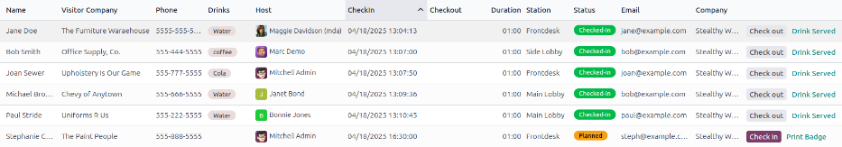

========
Visitors
========

In the Odoo *Frontdesk* application, a *visitor* is defined as any non-employee (e.g., repair
person, job candidate, etc.). These visitors can be logged upon arrival and departure for security
purposes. This ensures an accurate list of people on the premises.

.. _frontdesk/list:

Visitor list
============

To access a complete list of checked-in visitors, navigate to :menuselection:`Frontdesk app -->
Visitors`.

.. note::
   By default, the :guilabel:`Planned or Checked-In` and :guilabel:`Today` filters appear in the
   :guilabel:`Search...` bar.

All visitors are presented in a list view, with the following details that were entered upon check
in:

- :guilabel:`Name`: the guest's name.
- :guilabel:`Visitor Company`: the company the guest represents.
- :guilabel:`Phone`: the guest's phone number.
- :guilabel:`Drinks`\*: the drink the guest requested.
- :guilabel:`Host`: who the guest is waiting to see.
- :guilabel:`CheckIn`: the date and time the guest checked in.
- :guilabel:`Checkout`\*: the date and time the guest checked out. In the default view, only guests
  with a :guilabel:`Checked-In` or :guilabel:`Planned` status are visible. Guests with check-out
  times are only visible if the :guilabel:`Today` filter is not active.
- :guilabel:`Duration`: the amount of time the guest has been checked in for.
- :guilabel:`Station`: the location of where the guest checked in.
- :guilabel:`Status`: the status of the guest. The options are :guilabel:`Checked-In`,
  :guilabel:`Planned`, :guilabel:`Checked-Out`, or :guilabel:`Canceled`.
- :guilabel:`Email`\*: the guest's email address.

\* These fields are not visible in the default :guilabel:`Visitor` list. These must be enabled
using the :icon:`oi-settings-adjust` :guilabel:`(settings adjust)` icon in the top-right of the
list.

To the far-right of the titled columns on the :guilabel:`Visitors` page, there is an untitled
column, where a guest's status can be updated.

When a guest leaves, click the available :guilabel:`Check out` button to update the guest's record,
and log the date and time they left.

If a scheduled guest arrives, and they did not check in using the *Frontdesk* kiosk, they can be
checked in here, by clicking the available :guilabel:`Check in` button to log the date and time they
arrived.

Beside the untitled status column, a :guilabel:`Drink Served` button appears, but only if that
particular visitor requested a drink.

When their drink has been served, click the :guilabel:`Drink Served` button to indicate the drink
has been delivered to the guest. Once clicked, that button disappears.

If any column is not visible, or if a visible column is preferred to be hidden, click the
:icon:`oi-settings-adjust` :guilabel:`(additional options)` icon, located at the end of the column
name list. Doing so, reveals a reveals a drop-down menu of column options to enable or disable. A
:icon:`fa-check` :guilabel:`(check)` icon indicates the column is visible.

Planned visitors
================

Enter expected guest information in advance by creating a planned guest in the *Frontdesk* app.

To create a planned guest, navigate to :menuselection:`Frontdesk app --> Visitors`, and click
:guilabel:`New`. Then, enter the same information as any other :ref:`visitor <frontdesk/list>` on
the guest form that appears. The only required fields are the visitor's :guilabel:`Name` and the
:guilabel:`Station` at which they are expected to arrive.

.. important::
   If a guest is planned in advance, they must be checked in from the list on the
   :guilabel:`Visitors` page in the *Frontdesk* application (:menuselection:`Frontdesk app -->
   Visitors`). If a planned guest checks in using a kiosk, they will be checked in separately, and
   their planned visitor entry remains listed as :guilabel:`Planned`.

   The :guilabel:`Planned` status of a planned guest **only** changes to :guilabel:`Checked-In` when
   they are checked in *inside* the application's :guilabel:`Visitors` list.

   If a guest does check in using a kiosk, ensure all records are current, and the list of guests
   that are currently on-site is correct. Be sure to check in and/or check out the correct entries,
   so the visitors list correctly reflects who is currently on the premises.

   Ensure planned guests are informed that they should **not** check in using the kiosk if they are
   listed as a planned guest in advance.

Visitor flow
============

Visitor check in
----------------

When a visitor arrives at a facility, they approach a :ref:`Frontdesk kiosk <frontdesk/kiosk>`, and
click :guilabel:`Check in`. The information requested from the visitor is what was configured for
that specific *Frontdesk* station. If any information is required, the field displays a red asterisk
(\*). The visitor **must** enter the required information in order to check in.

Once all the information is entered, the visitor taps the :guilabel:`Check In` button.

.. note::
   At any point in the check-in process, if ten seconds pass with no selection, the kiosk returns to
   the main welcome screen.

Drinks
------

If drinks were configured for the station, after tapping :guilabel:`Check In`, a registration
confirmation screen loads, along with the question: :guilabel:`Do you want something to drink?`

The visitor can tap either :guilabel:`Yes, please`, or :guilabel:`No, thank you`.

If they select :guilabel:`Yes, please`, a drink selection screen appears, and the pre-configured
options are listed. The visitor then taps the desired selection, or, if they do not want anything,
they can tap the :guilabel:`Nothing, thanks` button at the bottom of the screen.

If a drink selection was made, a :guilabel:`Thank you for registering! Your drink is on the way.`
message appears.

Notifications
-------------

Once the visitor has checked in, the person they are visiting, and any other users who were
configured to be notified when check-ins occur at the kiosk, are notified. The notification is
either by email, SMS message, a *Discuss* chat, or any combination of those three options.

If the visitor requested a drink, the user(s) configured as the :guilabel:`People to Notify` on the
drink form, are notified, via the *Discuss* application. The message that appears is:
:guilabel:`(Visitor Name) just checked-in. They requested (Drink Name).`

Once the drink has been delivered to the guest, the person who delivered the drink is responsible
for marking the drink as delivered.

To mark a drink as delivered, navigate to :menuselection:`Frontdesk app --> Stations`, and choose
the desired station card displaying :guilabel:`(#) Drinks to serve`.

This opens a list of all the visitors checked in at that station, and are waiting for a drink. Click
the :guilabel:`Drink Served` button at the end of the line for the visitor who was served. Once they
are marked as having their drink served, the visitor disappears from the list.

Check out
---------

Once the visitor has completed their business, and has left the premises, it is important to check
them out for accurate record keeping.

To check visitors out properly, navigate to :menuselection:`Frontdesk app --> Stations`, and choose
the desired station card displaying :guilabel:`(#) Drinks to serve`. Doing so opens a list of all
the visitors who are currently checked-in at that station.

Click the :guilabel:`Check out` button near the end of the line for the visitor who left. Once they
are marked as checked-out, the visitor disappears from the list.

.. important::
   Visitors do **not** check themselves out when they leave. It is important for *Frontdesk* users
   to check out visitors for accurate record keeping.

   Always have an accurate list of who is on the premises at any given time. This is important for
   security purposes, and in the case of an emergency.
