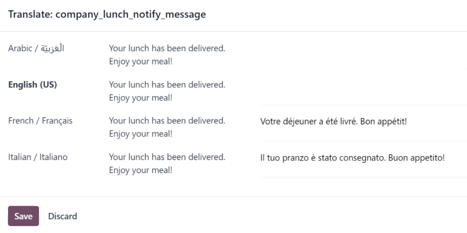

:show-content:

=====
Lunch
=====

The **Lunch** application in Odoo allows users to conveniently order food and pay for their meal
directly from the database.

Before employees can use the **Lunch** application, there are a number of configurations that need
to be made: :ref:`settings <lunch/settings>`, :doc:`vendors <lunch/vendors>`, :ref:`locations
<lunch/locations>`, :doc:`products <lunch/products>`, and :ref:`product categories
<lunch/product-categories>`. Once these are created and configured, employees can view offerings and
order food.

.. _lunch/settings:

Settings
========

In the :guilabel:`Settings` menu, only two items need to be configured: overdraft settings and
notifications. To access the settings, navigate to :menuselection:`Lunch app --> Configuration -->
Settings`.

Configure the following:

- :guilabel:`Lunch Overdraft`: Enter the maximum overdraft amount for employees. The currency format
  is determined by the localization setting of the company.
- :guilabel:`Reception notification`: Set the message users receive via the **Discuss** app when
  their food has been delivered. The default message `Your lunch has been delivered. Enjoy your
  meal!` populates this field, but can be modified, if desired.

Translation support
-------------------

If a database has multiple languages installed, many forms in the **Lunch** application have the
option of entering translations for various fields.

If translations are available to be configured, a language code appears next to a translatable field
on a form. To add translations for that field, click the two letter language code (for example,
:guilabel:`EN` for English) and a translation pop-up window appears.

The image below is an example for the :guilabel:`Reception notification` field in the settings menu.

Navigate to :menuselection:`Lunch app --> Configuration --> Settings`. Click the :guilabel:`EN` in
the top-right of the text box beneath the :guilabel:`Reception notification` section. A
:guilabel:`Translate: company_lunch_notify_message` pop-up window loads with the option to enter a
translation for the other languages used by the database.

The first column lists the different languages in alphabetical order, with the currently selected
language in bold. The second column has the currently configured message in each column. The last
column in the far-right provides a text box to type in a translation for each language.

Enter the text that should appear for each language, then click :guilabel:`Save`.

.. _lunch/locations:

Locations
=========

By default, Odoo creates an `HQ Office` location when the **Lunch** application is installed. If a
company has more than one location, they must be configured.

To add a location, navigate to :menuselection:`Lunch app --> Configuration --> Locations`. The
currently configured locations appear in a list view. Click the :guilabel:`New` button in the
top-left corner and a blank line appears beneath the last location in the list.

Enter the name of the location in the field. Next, click into the :guilabel:`Address` field to the
right of the name, and enter the location's address. It is possible to enter multiple lines in the
address field.

Repeat this for all locations that need to be added.

.. image:: lunch/locations.png
   :alt: A list view of the locations with the new button highlighted.

Alerts
======

It is possible to set up alerts that can either be displayed in the **Lunch** app, or be sent to
specific employees via the **Discuss** app.

No alerts are preconfigured by default. To set up an alert, navigate to :menuselection:`Lunch app
--> Configuration --> Alerts`. Click the :guilabel:`New` button in the top-left corner and a blank
lunch alert form loads. Enter the following information on the form:

- :guilabel:`Alert Name`: Enter a name for the alert. This should be short and descriptive, such as
  `New Lunch Vendor` or `Order by 11:00 AM`. This field is **required**.
- :guilabel:`Display`: Select how the alert is shown. The options are:

  - :guilabel:`Alert in app`: The alert is visible on the main **Lunch** app dashboard, in an orange
    box, above the user's name on the right side of the dashboard.
  - :guilabel:`Chat notification`: The alert is sent to users via the **Discuss** app in a chat
    window. If this option is selected, the following additional field appears:

    - :guilabel:`Recipients`: Select who receives the chat alert. The options are:
      :guilabel:`Everyone`, :guilabel:`Employee who ordered last week`, :guilabel:`Employee who
      ordered last month`, or :guilabel:`Employee who ordered last year`.

- :guilabel:`Location`: Select the locations the alert appears for using the drop-down menu.
  Multiple locations can be selected. This field is **required**, therefore, if the alert applies to
  all locations, select all the locations from the drop-down menu. If this field is left blank, the
  alert will **not** be displayed.
- :guilabel:`Show Until`: If the alert should expire on a specific date, select the date from the
  calendar picker.
- :guilabel:`Active`: This option is enabled (appears green) by default. To turn off the alert,
  click the toggle so that it no longer appears green.
- :guilabel:`Message`: Enter the alert message in this field. This field is **required**.
- :guilabel:`Notification Time`: Select the days of the week the alert is visible or sent. By
  default, all seven days are active. Click on a checkbox to change the setting from active to
  inactive.

  .. note::
     If :guilabel:`Chat notification` was selected for the :guilabel:`Display` option, a time field
     appears beneath the :guilabel:`Notification Time` block. Enter the time the chat message is
     sent. Next, select if the time is either :guilabel:`AM` or :guilabel:`PM` using the drop-down
     menu to the right of the time field.

.. image:: lunch/alert.png
   :alt: An alert form with all of the information filled out for a chat alert sent at 10:30 AM,
         asking employees to submit orders by 11:30 AM.

.. seealso::
   - :doc:`lunch/vendors`
   - :doc:`lunch/products`
   - :doc:`lunch/orders`
   - :doc:`lunch/user-accounts`
   - :doc:`lunch/management`

.. toctree::
   :titlesonly:

   lunch/vendors
   lunch/products
   lunch/orders
   lunch/user-accounts
   lunch/management
