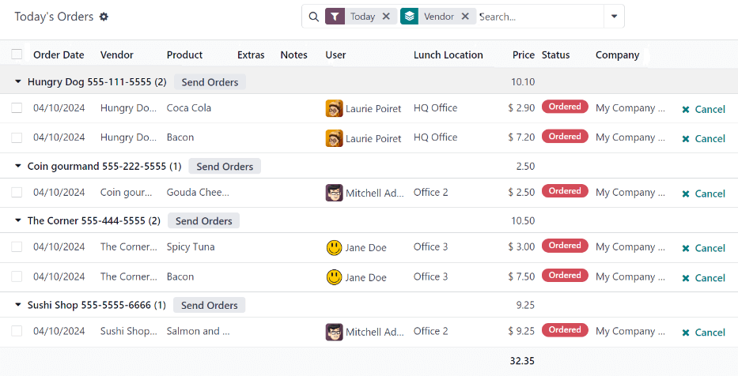
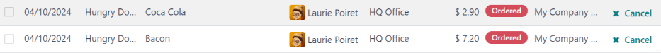
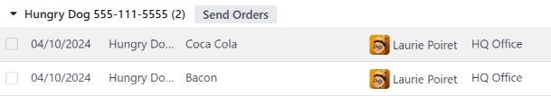
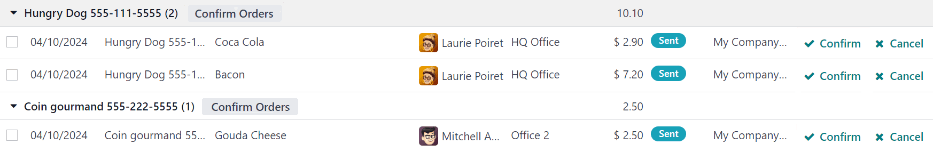
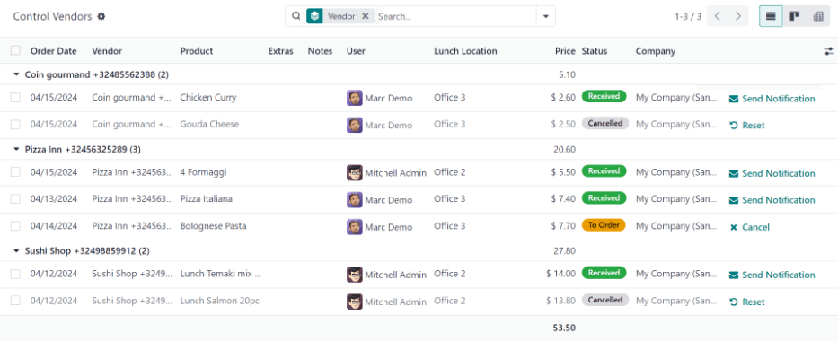

================
Lunch management
================

In Odoo's *Lunch* application, it is required to have someone manage the orders, vendors, and
products. In addition, someone must be responsible for the orders, and notifying employees when
their orders have arrived. This can be the same person.

Orders can be :ref:`canceled <lunch/cancel>`, :ref:`sent to the vendor <lunch/send-orders>`,
:ref:`confirmed <lunch/confirm-orders>` upon arrival, and :ref:`employees can be notified
<lunch/notify>`, either from the :ref:`Today's Orders <lunch/todays-orders>` dashboard, or the
:ref:`Control Vendors <lunch/control_vendors>` dashboard.

To manage the *Lunch* app, users need the appropriate :guilabel:`Administrator` rights. These can be
set by navigating to the :menuselection:`Settings app` and selecting :guilabel:`Manage Users`. Then,
click on the desired user to view their access rights.

For more information on access rights, refer to the :doc:`Access rights
<../../general/users/access_rights/>` documentation.

.. note::
   Only users with administration rights are able to view the :guilabel:`Manager` and
   :guilabel:`Configuration` menus in the *Lunch* application.

.. _lunch/todays-orders:

Today's Orders
==============

To view and manage the orders for the day, navigate to :menuselection:`Lunch app --> Manager -->
Today's Orders`. All orders for the day are presented in a list view on the :guilabel:`Today's
Orders` dashboard, with a filter for :guilabel:`Today`, and grouped by :guilabel:`Vendor`, by
default.

The following information appears in the list:

- :guilabel:`Order Date`: the date the order was placed.
- :guilabel:`Vendor`: the vendor the product is being ordered from.
- :guilabel:`Product`: the specific product ordered.
- :guilabel:`Extras`: any extras selected for the product.
- :guilabel:`Notes`: any information needed to be sent to the vendor.
- :guilabel:`User`: the user who ordered the product.
- :guilabel:`Lunch Location`: where the product is set to be delivered.
- :guilabel:`Price`: the total price for the product, including all extras.
- :guilabel:`Status`: the current status of the product.
- :guilabel:`Company`: the company under which the order was placed. This only appears in a
  multi-company database.

         names highlighted.

.. _lunch/cancel:

Cancel orders
-------------

All users can cancel an order, not just managers of the *Lunch* app.

To cancel an order from a vendor, individual products **must** be canceled one at a time.

On the :guilabel:`Today's Orders` dashboard, a :guilabel:`✖️ Cancel` button is shown at the
far-right of each product line that can be canceled. Click the :guilabel:`✖️ Cancel` button to
cancel the order for that individual product.

.. note::
   Only products with a red :guilabel:`Status` tag of :guilabel:`Ordered` can be canceled.

.. _lunch/send-orders:

Send orders
-----------

The first step in managing the *Lunch* app is to send the orders to the vendors.

When orders are ready to be sent, the manager responsible for sending orders **must** send the
orders to the vendor, outside of the database (call, online order, etc.).

Once orders have been placed with the vendors, click the :guilabel:`Send Orders` button that appears
next to each vendor's name and phone number.

Once sent, the :guilabel:`Send Orders` button changes to a :guilabel:`Confirm Orders` button, and
the :guilabel:`Status` column is updated from red :guilabel:`Ordered` tags to blue :guilabel:`Sent`
tags, indicating the order has been sent to the vendor. Users who have placed orders in the *Lunch*
app rely on the :guilabel:`Status` tags to track their orders.

.. _lunch/confirm-orders:

Confirm orders
--------------

After orders have been sent to the vendor, the next step is to confirm the orders after they have
been delivered.

On the :guilabel:`Today's Orders` dashboard, click the :guilabel:`Confirm Orders` button that
appears next to the vendor's name and phone number.

Once confirmed, the :guilabel:`Confirm Orders` button disappears, and the :guilabel:`Status` column
is updated from blue :guilabel:`Sent` tags to green :guilabel:`Received` tags, indicating the vendor
has delivered the orders.

In addition, the :guilabel:`✖️ Cancel` button at the end of each product line changes to a
:guilabel:`✉️ Send Notification` button.

If needed, instead of confirming all of the individual products from a vendor, individual products
can be confirmed one at a time. To confirm an individual product, click the :guilabel:`✔️ Confirm`
button at the end of the individual product line. When confirming individual products with this
method, the :guilabel:`Confirm Orders` button remains on the vendor line.

.. example::
   A vendor receives an order for three pizzas, and an order of garlic knots. When the delivery is
   made to the company, the *Lunch* manager notices the garlic knots are missing.

   The manager first marks the three pizzas as received, by individually confirming the products
   with the :guilabel:`✔️ Confirm` button at the end of each product line.

   Later, when the vendor delivers the garlic knots, the manager can either click the :guilabel:`✔️
   Confirm` button at the end of the line for the garlic knots, or click the :guilabel:`Confirm
   Orders` button that appears next to the vendor's name and phone number.

.. _lunch/notify:

Notify employees
----------------

After products are received, and the orders are confirmed, the employees **must** be informed that
their orders have been delivered, and are ready to be picked up.

Unlike sending and confirming orders, notifications must be sent individually, and cannot be sent in
a batch.

To notify the user their product has arrived, click the :guilabel:`✉️ Send Notification` button at
the end of each product line. An email is sent to the user informing them their products have been
delivered.

.. _lunch/control_vendors:

Control Vendors
===============

All orders for all vendors, both past and present, can be found in the *Control Vendors* dashboard.
To access these records, navigate to :menuselection:`Lunch app --> Manager --> Control Vendors`.

All orders appear in a list view, grouped alphabetically by :guilabel:`Vendor`. The list loads with
all vendors expanded to show all order lines for every vendor, by default.

The following information appears in the list:

- :guilabel:`Order Date`: the date the order was placed.
- :guilabel:`Vendor`: the vendor the product is being ordered from.
- :guilabel:`Product`: the specific product ordered.
- :guilabel:`Extras`: any extras selected for the product.
- :guilabel:`Notes`: any information needed to be sent to the vendor.
- :guilabel:`User`: the user who ordered the product.
- :guilabel:`Lunch Location`: where the product is set to be delivered.
- :guilabel:`Price`: the total price for the product, including all extras.
- :guilabel:`Status`: the current status of the product.
- :guilabel:`Company`: the company under which the order was placed. This only appears in a
  multi-company database.

Orders can be :ref:`canceled <lunch/cancel>`, :ref:`sent to the vendor <lunch/send-orders>`,
:ref:`confirmed <lunch/confirm-orders>` upon arrival, and :ref:`employees can be notified
<lunch/notify>` using the same method as on the :ref:`Today's Orders <lunch/todays-orders>`
dashboard.

.. note::
   The difference between the :ref:`Today's Orders <lunch/todays-orders>` dashboard and the
   :ref:`Control Vendors <lunch/control_vendors>` dashboard is that the *Today's Orders* dashboard
   **only** displays orders for the current day, while the :guilabel:`Control Vendors` dashboard
   displays **all** orders made in the *Lunch* app.

.. seealso::
   - :doc:`../lunch`
   - :doc:`orders`
   - :doc:`user-accounts`
