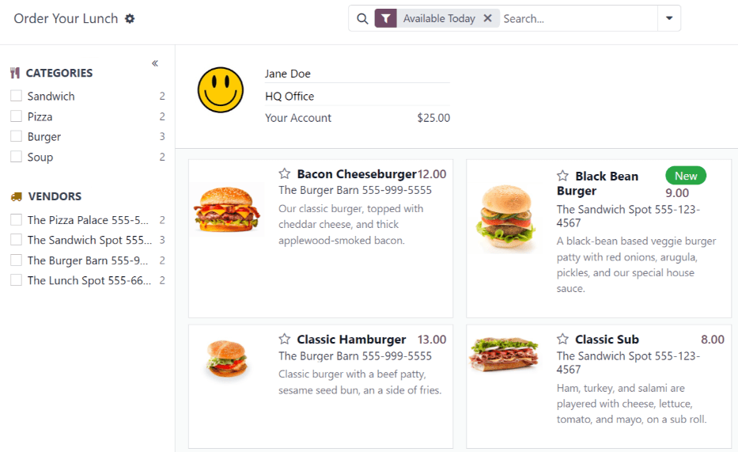
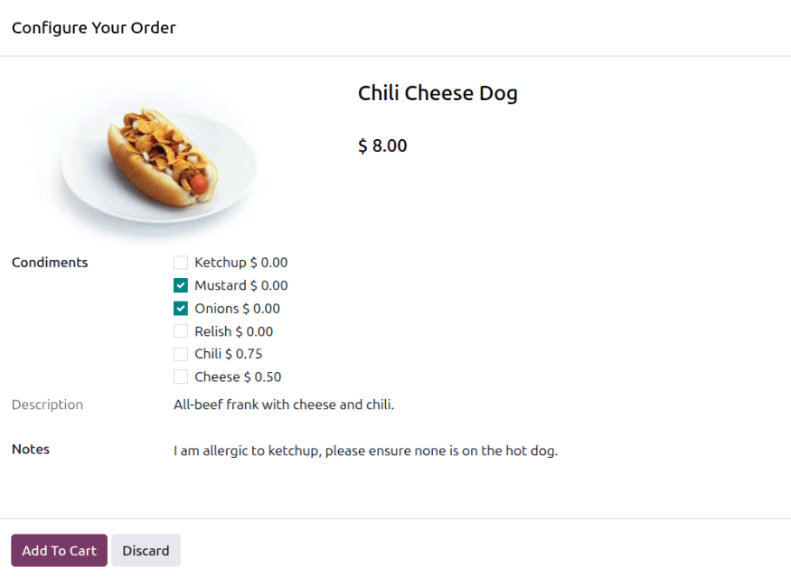
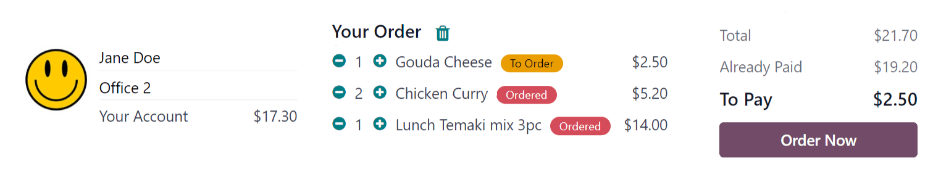
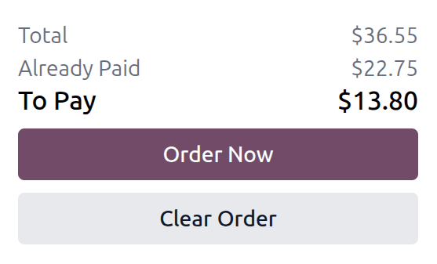
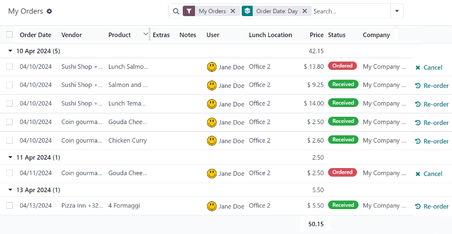
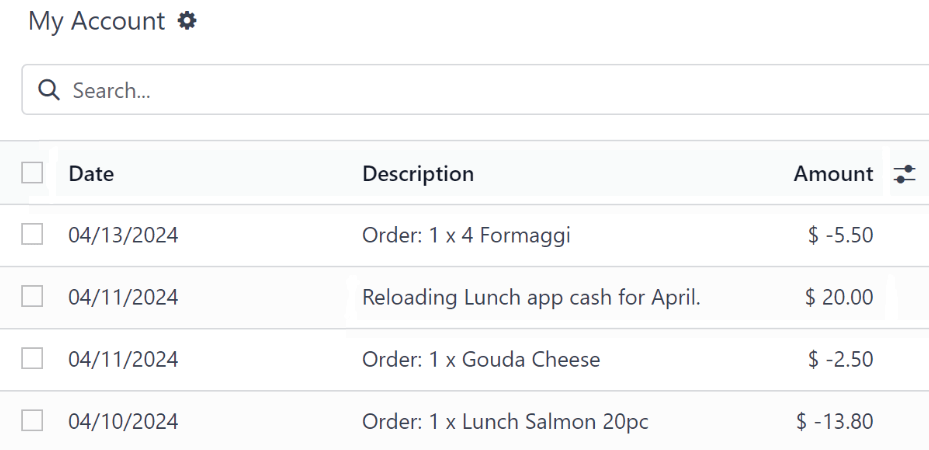

:show-content:

======
Orders
======

The **Lunch** app lets employees place lunch orders, see what is available each day, and check their
account balance, all from one place.

When the **Lunch** application is opened, the :guilabel:`Order Your Lunch` dashboard loads. This
view is also accessible by navigating to :menuselection:`Lunch app --> My Lunch --> New Order`.

The :guilabel:`Order Your Lunch` dashboard provides a summary of lunch offerings, the user's account
information, and the current day's orders, along with their statuses.

Order Your Lunch
================

On the main :guilabel:`Order Your Lunch` dashboard, all the necessary information needed to place an
order is visible. The default filter is for the current day (example: :icon:`fa-filter`
:guilabel:`Wednesday`), which shows only products that can be purchased that day, based on the
:ref:`vendor's availability <lunch/availability>`.

The left-side of the dashboard displays the various :guilabel:`Categories` of products available,
along with the :guilabel:`Vendors` supplying the products. To the right of each line is a number,
indicating how many products are associated with that category or vendor.

To filter the products by categories or vendors, click the checkbox next to the desired category or
vendor to view only items within those selections. Multiple selections can be made in each section.

.. note::
   If multiple selections are made, **only** products that fall under **all** the selected options
   are shown.

The right side of the dashboard, which serves as an account hub, displays the user, their location,
the current date, their account balance (located in the :icon:`fa-money` :guilabel:`Available
Balance` field), and order details for the current day, if any orders have been placed.

The middle section displays all the products in a default Kanban view. Each product card displays
the name, cost, vendor, photo, and description of the product. If the product is configured as new,
it also displays a green :guilabel:`New` tag.

.. note::
   Anywhere a vendor's name is listed in the **Lunch** app, such as on Kanban product cards, their
   phone number is listed, as well.

Placing orders
==============

To place a lunch order, navigate to the main :guilabel:`Order Your Lunch` dashboard by either
opening the **Lunch** app or by navigating to :menuselection:`Lunch app --> My Lunch --> New Order`.

Select the location
-------------------

Ensure the location set in the account hub on the right-side of the :guilabel:`Order Your Lunch`
dashboard is correct. Click the :guilabel:`Location` drop-down menu to view all **Lunch** app
locations, and select the user's current location (or the location the user wants their lunch
delivered to).

.. important::
   The user's work schedule, which indicates where they work each day, is **not** reflected in the
   :guilabel:`Location` field. Every available location must be configured in the **lunch** app, and
   all locations are available to all users in the database, regardless of work location. This way,
   users can order lunch and have it delivered to the location where they *will be* during
   lunchtime.

   For example, an employee works in the factory and has a lunch meeting with their supervisor at
   the main office, two blocks away. The employee selects the main office as their location in the
   **Lunch** app, and their order is delivered to the main office rather than the factory.

Select the date
---------------

The **Lunch** app allows for placing orders not only for the current day, but also for ordering
future meals. This feature allows users to plan meals in advance, without having to place daily
orders.

Click the date on the right side of the :guilabel:`Order Your Lunch` dashboard to open a calendar
pop-up window. Click on the desired date to select it. Any products added are for delivery on the
selected date.

Multiple products with multiple delivery dates can be ordered at once; each day does not need to be
processed separately.

Add products to an order
------------------------

From the :guilabel:`Order Your Lunch` dashboard, click on a desired product to add it to an order;
it appears in the *Configure Your Order* pop-up window.

At the top of the pop-up window is the product image, name, and price. Beneath that, there are
potential :guilabel:`Extras` fields that showcase any :ref:`extra items or options <lunch/extras>`,
such as toppings or drinks. Click the checkbox next to any desired extras present in the
:guilabel:`Extras` fields to add them to the order.

Each extra option is organized by a category, complete with its name and price. As extras are
selected, the displayed price at the top of the pop-up window updates to reflect all current
selections.

Beneath the :guilabel:`Extras` field is the :guilabel:`Description` of the product, followed by a
:guilabel:`Notes` field. The :guilabel:`Notes` field is used to enter vital information that is then
sent to the vendor regarding the order, such as any special requests or food allergies.

When all selections for the product have been made, click the :guilabel:`Add To Cart` button in the
lower-left of the pop-up window. To cancel the order, click the :guilabel:`Discard` button.

Errors
~~~~~~

There can be several reasons why an order cannot be placed: a :ref:`lack of funds
<lunch/insufficient-funds>`, an :ref:`incomplete order <lunch/incomplete>`, or being outside the
vendors :ref:`operating hours <lunch/outside-hours>`.

.. _lunch/insufficient-funds:

Insufficient funds
******************

If the price for the item in the :guilabel:`Configure Your Order` pop-up window exceeds the
:guilabel:`Available Balance` for the user, the following error appears:

`Your wallet does not contain enough money to order that. To add some money to your wallet, please
contact your lunch manager.`

Additionally, the :guilabel:`Add To Cart` button is hidden, and only the :guilabel:`Discard` button
appears.

If this error appears, the user must :doc:`add funds to their lunch account <user-accounts>` through
a **Lunch** app administrator before placing the order.

.. _lunch/incomplete:

Incomplete orders
*****************

Depending on how the various :ref:`extras <lunch/configure-extras>` are configured for a vendor, it
is possible to receive an error when attempting to add products to the cart.

An error occurs when a configured product **requires** the user to select an option in the
:guilabel:`Extras` field, but the user neglects to make one.

When this occurs, a :guilabel:`Validation Error` pop-up window appears. The error is briefly
explained in the pop-up window. Click :guilabel:`Close` to close the window, and make any necessary
changes to the :guilabel:`Configure Your Order` pop-up window.

.. example::
   The vendor, The Pizza Palace, provides a free beverage with any purchase. Their products are
   configured so that a beverage selection is **required** in the :guilabel:`Extras` field *before*
   adding one of their products to the cart.

   If a selection is **not** made, an error occurs. The message that appears is `You have to order
   one and only one Free Beverage with Purchase`.

   .. image:: orders/error.png
      :alt: The :guilabel:`Validation Error` pop-up window with the specific error for the free
            beverage displayed.

.. _lunch/outside-hours:

Outside vendor hours
********************

Each vendor in the **Lunch** app has their :ref:`availability <lunch/availability>` configured, with
both their operating hours as well as the deadline for sending orders via email.

If a user clicks on a product for a vendor who is either closed or whose order window is closed, the
following message appears on the *Configure Your Product* pop-up window: `The orders for this vendor
have already been sent.`

Click the :guilabel:`Discard` button, and make a selection from another vendor.

Order summary
-------------

When items are added to an order, the items appear in the :guilabel:`Your Order` summary, located on
the right-side of the :guilabel:`Order Your Lunch` dashboard.

Each product is listed in its own Kanban card, with the product name, the user's location, any
extras added, the quantity, a status tag, the delivery date for the order, and the total amount.

The available tags that can be displayed for each item in the :guilabel:`Your Order` section are:

- :guilabel:`To Order`: The product has been added to the cart, but has not been purchased yet by
  the user yet. This tag appears in gray.
- :guilabel:`Ordered`: The product has been purchased by the user and is waiting to be sent to the
  vendor by a **Lunch** app manager. This tag appears in purple.

Product quantities can be adjusted by clicking the :icon:`fa-plus` :guilabel:`(plus)` or
:icon:`fa-minus` :guilabel:`(minus)` icons beneath the listed product. The product price adjusts in
real-time to reflect the cost for the currently selected quantity of the product.

Beneath the :guilabel:`Your Order` section is a summary of the purchasing information, including the
following:

- :guilabel:`Total`: This field displays the total amount for the entire day's lunch order,
  including all items already ordered, received, and all pending orders.
- :guilabel:`Already Paid`: This field indicates how much has been paid that day towards the
  :guilabel:`Total` amount.
- :guilabel:`To Pay`: This field displays how much of the remaining :guilabel:`Total` amount must be
  paid in order to place the currently configured order (items with a tag of :guilabel:`To Order`).

.. tip::
   Users can place multiple orders throughout the day, and are not restricted to a single lunch
   order per day. Multiple orders might need to be placed, due to users forgetting to add items to
   an order, or because there are multiple meals available for purchase for the office (not just
   lunch), and so on.

   Depending on the various vendors, and how the vendors and products are configured, it is possible
   to order breakfast, lunch, dinner, coffee, and snacks.

Cancel an order
---------------

Orders can be cancelled at any time, as long as the orders have **not** been sent to the vendor. All
orders that appear in the :guilabel:`Your Order` section can be cancelled. All orders that have been
sent appear in the :guilabel:`Passed orders` section, and are ineligible for cancellation.

Orders can be cancelled in two ways, :ref:`individually <lunch/cancel-one>`, or :ref:`in bulk
<lunch/cancel-all>`.

.. tip::
   To check and ensure an order is cancelled, navigate to :menuselection:`Lunch app --> My Lunch -->
   My Order History`. A gray :guilabel:`Cancelled` icon appears next to any cancelled orders.

.. _lunch/cancel-one:

Cancel an individual item
-------------------------

On the :guilabel:`Order Your Lunch` dashboard, click the :icon:`fa-minus` :guilabel:`(minus)` icon
beneath the desired product in the :guilabel:`Your Order` section, until the quantity is zero. The
order is cancelled, and the product disappears from the :guilabel:`Your Order` section.

.. _lunch/cancel-all:

Cancel all items
----------------

All items in the :guilabel:`Your Order` section of the :guilabel:`Order Your Lunch` dashboard can be
cancelled at one time. Click the :guilabel:`Clear Order` button at the bottom of the right-side of
the dashboard, and all products are cancelled.

Submit an order
---------------

To place the order, click the :guilabel:`Order Now` button on the right side of the :guilabel:`Order
Your Lunch` dashboard, located at the bottom. The user is charged the amount that is displayed in
the :guilabel:`To Pay` field, and the cost is deducted from their **Lunch** account balance.

Once the order is placed, the tags for the purchased items in the :guilabel:`Your Order` section
change from gray :guilabel:`To Order` tags to purple :guilabel:`Ordered` tags.

Track an order
--------------

When orders have been sent to the vendors, the products move to the :guilabel:`Passed orders`
section, located on the right-side of the :guilabel:`Order Your Lunch` dashboard. All
:guilabel:`Passed orders` are collapsed, by default. Click the :icon:`fa-chevron-down`
:guilabel:`(expand)` icon and all past orders appear in their own Kanban card.

Each Kanban card displays the product name, cost, and delivery location and date for the product.

Additionally, each Kanban card has one of the following status tags:

- :guilabel:`Ordered`: This tag appears in blue and indicates the order was sent to the vendor, but
  has not been received yet.
- :guilabel:`Received`: This tag appears in green, and indicates that the order has arrived at the
  location, and has been verified by the **Lunch** app administrator.

Receive an order
----------------

When orders are received at the delivery location, the **Lunch** app manager confirms them, and a
notification is sent to the employee who ordered the food via email.

My Orders
=========

To view a full list of all orders placed in the **Lunch** app for the currently signed-in user,
navigate to :menuselection:`Lunch app --> My Lunch --> My Order History`. This navigates to the
:guilabel:`My Orders` dashboard. The data is filtered by :guilabel:`My Orders` and grouped by
:guilabel:`Order Date: Day`, by default, both of which are located in the search bar.

All products appear in a list view, organized by date. The list displays the :guilabel:`Order Date`,
:guilabel:`Vendor`, :guilabel:`Product`, :guilabel:`Extras`, :guilabel:`Notes`, :guilabel:`User`,
:guilabel:`Lunch Location`, :guilabel:`Price`, and :guilabel:`Status` information. If in a
multi-company database, a :guilabel:`Company` column also appears.

The total cost for each day's orders is displayed on the top line containing the order date. At the
bottom of the list, beneath all the lines, the overall total amount paid for all the orders appears,
under the :guilabel:`Price` column.

At the end of each product line with a status of :guilabel:`Ordered`, :guilabel:`To Order`, or
:guilabel:`Sent`, a :icon:`fa-times` :guilabel:`Cancel` button appears. Click :icon:`fa-times`
:guilabel:`Cancel` to cancel that product order. Once a product order has been cancelled, the money
paid for that product is refunded and appears in the user's account.

At the end of each product line with a status of :guilabel:`Received`, a :icon:`fa-history`
:guilabel:`Re-order` button appears. Click :icon:`fa-history` :guilabel:`Re-order` to instantly
reorder that same product, with the same extras, if applicable. The new order appears in the list,
under the current date, and the product is paid for, with money deducted from the user's account.

Any order with a status of :guilabel:`Cancelled` has a :icon:`fa-undo` :guilabel:`Reset` button at
the end of the line. To un-cancel and order, click the :icon:`fa-undo` :guilabel:`Reset` button, and
the product status changes to :guilabel:`Ordered`.

My Account
==========

To view a summary of all transactions in the user's account, navigate to :menuselection:`Lunch app
--> My Lunch --> My Account History`. Doing so reveals the :guilabel:`My Account` dashboard.

The default presentation of the :guilabel:`My Account` dashboard displays all entries, from newest
to oldest. The :guilabel:`Date`, :guilabel:`Description`, and :guilabel:`Amount` are the only fields
displayed in the list.

Entries with a negative figure listed in the :guilabel:`Amount` column represent products purchased
in the **Lunch** app. These appear in a `$-XX.XX` format.

Entries with a positive balance either represent funds added to the user's lunch account, or
cancelled orders that were eventually refunded to the user. These appear in a `$XX.XX` format.

