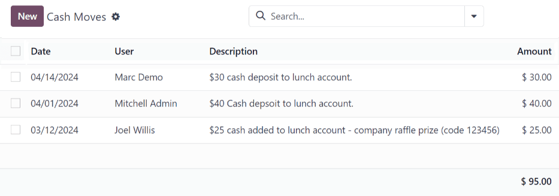
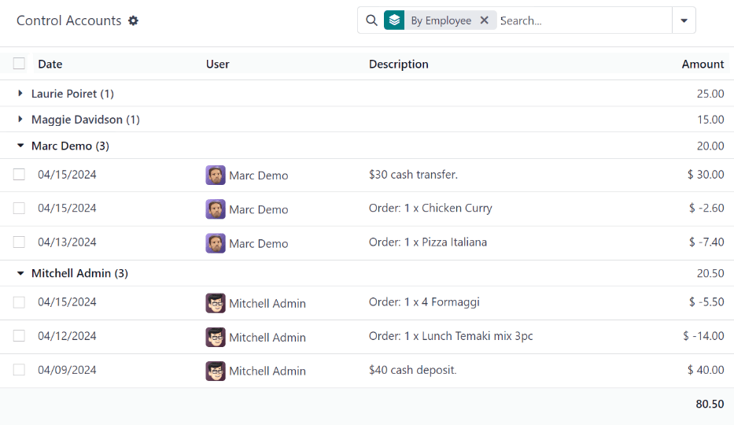

====================
Manage user accounts
====================

In Odoo's *Lunch* application, users pay for products directly from their *Lunch* app account. For
funds to appear in their account, a *Lunch* app manager **must** transfer funds into each user's
account.

.. important::
   To add funds and manage user accounts, the user must have :guilabel:`Administrator` access rights
   set for the *Lunch* application. This is verified by navigating to :menuselection:`Settings app
   --> → Manage Users`. Then, click on a user to view their various settings and access rights.

   For more information, refer to the
   :doc:`Access rights <../../general/users/access_rights/>` documentation.

The *Lunch* application does **not** directly interface in any way with software or products linked
to any monetary accounts or billing. Money **cannot** be transferred from users' bank accounts, nor
can users' credit cards be charged.

Odoo's *Lunch* application **only** allows for manual entries of cash exchanges that are handled by
the *Lunch* app manager. It is up to each individual company to create the method with which lunch
accounts are replenished.

.. example::
   Some examples of how money can be organized and transferred within a company:

   - Cash is handed to the *Lunch* app manager, who then updates the user's account.
   - Money is automatically deducted from the user's paychecks, then the *Lunch* app manager updates
     the account when paychecks are issued. This requires :ref:`adding a salary attachment
     <payroll/worked-days-inputs>` for the user's payslip in the *Payroll* app.
   - Companies can sell "lunch tickets" at a set price (for example, one ticket costs $5.00). Users
     can purchase tickets from a *Lunch* app manager, who then updates the user's account.

.. _lunch/cash-moves:

Cash Moves
==========

To add funds to user accounts, each cash move must be individually logged. To view all cash move
records, or create a new cash move, navigate to :menuselection:`Lunch app --> Manager --> Cash
Moves`. Doing so reveals the :guilabel:`Cash Moves` dashboard.

On the :guilabel:`Cash Moves` dashboard, all cash moves are presented in a default list view,
displaying each record's :guilabel:`Date`, :guilabel:`User`, :guilabel:`Description`, and
:guilabel:`Amount`. The total of all the cash moves is displayed at the bottom of the
:guilabel:`Amount` column.

Add funds
---------

To add funds to a lunch account, click the :guilabel:`New` button, located in the top-left corner of
the :guilabel:`Cash Moves` dashboard.

A blank :guilabel:`Cash Moves` form loads. Enter the following information on the form:

- :guilabel:`User`: select the user depositing cash into their account from the drop-down menu. If
  the user is not in the database, they can be created by typing their name in the :guilabel:`User`
  field, and clicking either :guilabel:`Create "user"` or :guilabel:`Create and edit...` to create
  the user and edit the :guilabel:`Create User` form.
- :guilabel:`Date`: using the calendar popover, select the date the transaction occurred.
- :guilabel:`Amount`: enter the amount being added to the lunch account.
- :guilabel:`Description`: enter a brief description of the transaction.

.. image:: user-accounts/cash-move-form.png
   :align: center
   :alt: The cash move form filled out for a transaction of $40.00.

Control Accounts
================

An overview of every transaction in the *Lunch* app, including all cash deposits and purchases, can
be viewed on the main *Control Accounts* dashboard. To access this dashboard, navigate to
:menuselection:`Lunch app --> Manager --> Control Accounts.`

All transactions are grouped :guilabel:`By Employee`, and listed alphabetically by the user's first
name. At the end of the user's name, a number appears. This indicates the number of individual
records logged for that user.

The default view is to have all individual transactions hidden. To view all transactions for a user,
click the :guilabel:`▶ (triangle)` icon to the left of the desired name to expand that specific
group.

Each record includes the :guilabel:`Date`, :guilabel:`User`, :guilabel:`Description`, and
:guilabel:`Amount`.

.. important::
   This list only displays the various transactions within the *Lunch* app, and does **not** allow
   modifications to be made to any records listed.

   Cash moves can be modified, but **only** from the :ref:`Cash Moves <lunch/cash-moves>`
   dashboard, not from the :guilabel:`Control Accounts` dashboard.

   It is **not** possible to modify any product-related records.
