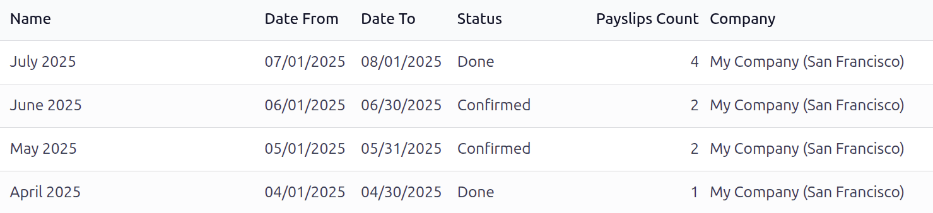
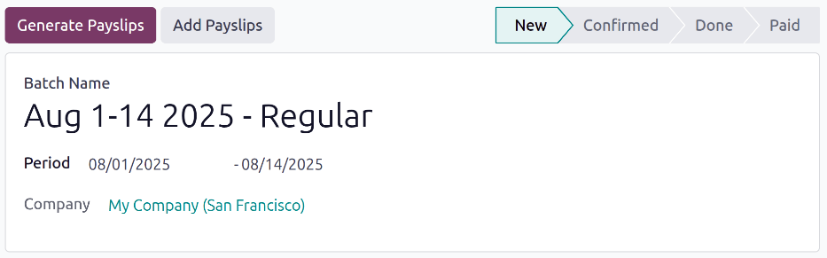
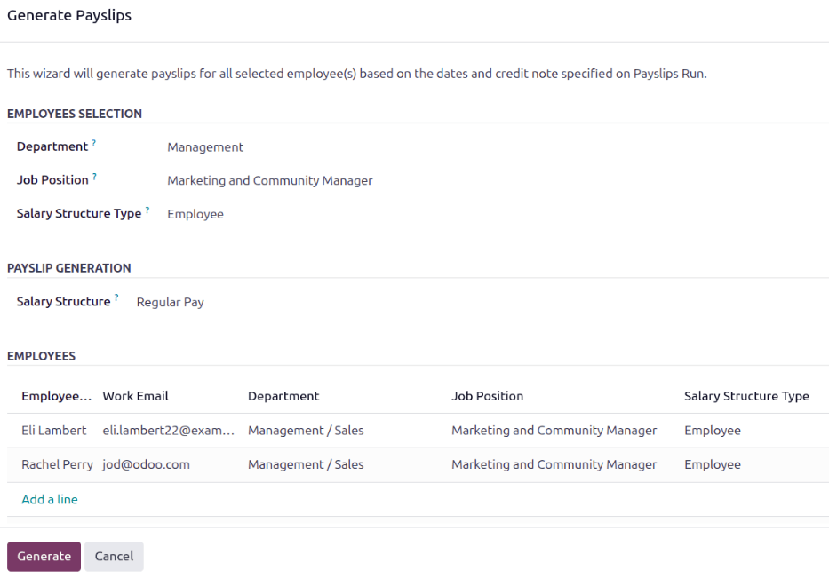
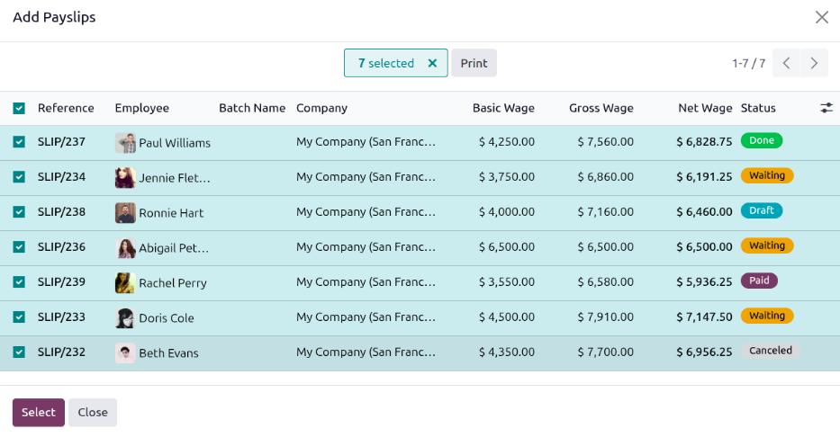
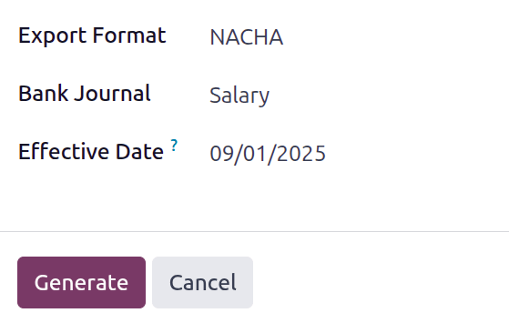

=======
Batches
=======

Batches are used to generate multiple :doc:`payslips <payslips>` at once and process them in a
group, rather than create and process individual payslips. This method not only helps the payroll
department pay employees in less time, but it also helps keep payslips organized.

Typically, a company's payroll department :ref:`creates a new batch <payroll/new-batch>` for each
salary structure, for every pay period (usually weekly, bi-weekly, or monthly). If desired, batches
can be further organized by department, job position, or salary structure type.

Once a batch is made, :ref:`payslips are added to the batch <payroll/add-payslips>`, then the batch
is processed, and employees are paid.

View batches
============

To view all the batches in the database, navigate to :menuselection:`Payroll app --> Payslips -->
Batches` to display all payslip batches that have been created. These payslip batches are displayed
in a list view, by default.

Each batch displays the :guilabel:`Name`, the dates the batch includes (the :guilabel:`Date From`
and :guilabel:`Date To` fields), its :guilabel:`Status`, the number of payslips in the batch
(:guilabel:`Payslips Count`), and the :guilabel:`Company`.

.. _payroll/new-batch:

Create a new batch
==================

New batches of payslips must be created from the :guilabel:`Payslips Batches` dashboard, by
navigating to :menuselection:`Payroll app --> Payslips --> Batches`. Click the :guilabel:`New`
button in the top-left corner. Doing so reveals a blank payslip batch form on a separate page.

On the new payslip batch form, enter the :guilabel:`Batch Name`. This should be something short and
descriptive, to keep records organized.

.. example::
   A company pays its employees on a bi-weekly basis, and creates separate batches for their two
   different :ref:`salary structures <payroll/structure-types>` they use: worker pay and regular
   pay.

   The names for their four August 2025 batches are:

   - `Aug 1-14 2025 - Worker`
   - `Aug 1-14 2025 - Regular`
   - `Aug 15-31 2025 - Worker`
   - `Aug 15-31 2025 - Regular`

Next, select the date range to which the batch applies. Click into one of the :guilabel:`Period`
fields, and a calendar pop-up window appears. From this calendar pop-up window, navigate to the
correct month, and click on the corresponding day for both the start and end dates of the batch.

The current company populates the :guilabel:`Company` field. If operating in a multi-company
environment, it is **not** possible to modify the :guilabel:`Company` from the form. The batch
**must** be created while in the database for the desired company.

.. _payroll/add-payslips:

Add payslips to a batch
=======================

Once a :ref:`batch has been created <payroll/new-batch>`, payslips need to be added to the batch.
Payslips can either be :ref:`created and added <payroll/generate>` to the batch, or if they have
*already* been created, they can be :ref:`added to the batch <payroll/add>`.

.. important::
   Batches can only have payslips added to them when they are in the :guilabel:`New` stage. Payslips
   can either be :ref:`created by the database <payroll/generate>` and added to the batch, or
   :ref:`pre-existing payslips can be individually added <payroll/add>` to the batch.

   Once either of these methods has been used, the status of the batch changes to
   :guilabel:`Confirmed`, and both options to add payslips no longer appears.

.. _payroll/generate:

Generate payslips
-----------------

To generate the payslips and add them to the batch, first open the batch by navigating to
:menuselection:`Payroll app --> Payslips --> Batches`, and click on the desired batch. Next, click
the :guilabel:`Generate Payslips` button and a :guilabel:`Generate Payslips` pop-up window loads.

This form contains three sections, and the configuration of this form determines which payslips are
created. The :guilabel:`Employees Selection` section determines which employees' payslips to create.
Using the drop-down menus, configure the :guilabel:`Department`, :guilabel:`Job Position`, and
:guilabel:`Salary Structure Type` fields, if desired. As selections are made, the
:guilabel:`Employees` section at the bottom updates to show which payslips are going to be
generated.

The :guilabel:`Payslip Generation` section allows the user to pick a specific :guilabel:`Salary
Structure` to create payslips for. If left blank, the default structure for each employee is used to
calculate their pay.

.. note::
   By default, Odoo lists all employees in the :guilabel:`Employees` section when generating
   payslips.

   The list filters automatically as selections are made.

   Configuration is optional unless a batch is being created **excluding** certain employees.

Once all the desired configurations have been made, click the :guilabel:`Generate` button, and all
payslips are created and attached to the batch. Once generated, a :icon:`fa-book`
:guilabel:`Payslips` smart button appears at the top, along with the number of payslips in the
batch. Click this smart button to view a list of all the payslips in the batch.

Once the payslips have been generated and attached to the batch, the status of the batch changes to
:guilabel:`Confirmed`.

.. _payroll/add:

Add payslips
------------

Instead of generating payslips, :ref:`individual payslips that have already been created
<payroll/new-payslip>` can be added to a  batch. Start by opening the desired batch by navigating to
:menuselection:`Payroll app --> Payslips --> Batches`, and clicking on the desired batch.

Next, click the :guilabel:`Add Payslips` button, and an :guilabel:`Add Payslips` form loads in a
pop-up window. All available payslips that have not yet been added to a batch, appear on the list.

.. note::
   **All** payslips not yet assigned to a batch appear in the list, regardless of status
   (:guilabel:`Draft`, :guilabel:`Waiting`, :guilabel:`Paid`, or :guilabel:`Cancelled`). This allows
   already processed or cancelled payslips to be grouped retroactively for reporting or record
   keeping purposes.

Tick the checkbox next to each desired payslip to be added, then click the :guilabel:`Select` button
at the bottom. All selected payslips are added to the batch, and the status of the batch changes to
:guilabel:`Confirmed`. A :icon:`fa-book` :guilabel:`Payslips` smart button appears at the top, along
with the number of payslips in the batch. Click this smart button to view a list of all the payslips
in the batch.

.. _payroll/batch-process:

Process a batch
===============

After a :ref:`batch has been created <payroll/new-batch>` , and :ref:`all required payslips have
been added <payroll/add-payslips>`, the batch must then be processed, and employees paid.

Open the desired batch by navigating to :menuselection:`Payroll app --> Payslips --> Batches`, and
clicking on the desired batch. For a batch to be processed, it must have a status of
:guilabel:`Confirmed`. That means the batch has been created and payslips have been added to them,
but the payslips have *not* been processed yet.

Click the :guilabel:`Create Draft Entry` button to confirm and create a draft of the individual
payslips. After this occurs, the batch status changes to :guilabel:`Done`.

.. note::
   At any time, the batch needs to be reverted back to a status of :guilabel:`New`, click the
   :guilabel:`Set to Draft` button. This action does **not** remove any payslips that have already
   been added to the batch, instead, the status changes back to :guilabel:`New`.

   After any desired changes have been made, click :guilabel:`Confirm` and the batch status changes
   to :guilabel:`Confirmed`.

   It is important to note, that if any payslips in the batch have a status of :guilabel:`Paid`, the
   batch **cannot** revert to a status of :guilabel:`New`.

Once the status has changed to :guilabel:`Done`, the payments must be logged in the database. Click
the :guilabel:`Create Payment Report` button, and a pop-up window loads, where the payment report
details are entered.

Using the drop-down menu, select the :guilabel:`Export Format` for the payment report. The two
default options available are :guilabel:`NACHA`, and :guilabel:`CSV`.

The :guilabel:`NACHA` option creates a compatible ACH file which is sent to the company's bank, and
outlines all the banking information to transfer money from the company to the employees, either via
direct deposit (most common) or a check. Refer to the :ref:`fiscal localization document
<l10n_us/nacha>` for more information.

.. note::
   Other options may be available depending on the :doc:`payroll localization
   <payroll_localizations>` installed in the database.

   If :guilabel:`CSV` is selected, all other fields are hidden form view. Once this is selected,
   click the :guilabel:`Generate` button to create the payment report.

Next, select the desired :guilabel:`Bank Journal` the paychecks are logged on. Last, using the
calendar selector, set the date the paychecks are issued in the :guilabel:`Effective Date` field.

Once the pop-up window is configured, click the :guilabel:`Generate` button, and the file appears on
the batch form, in a new :guilabel:`Payment Report` field.

After the report is created, click the :guilabel:`Mark as paid` button to mark the payslips as paid
in the database.

