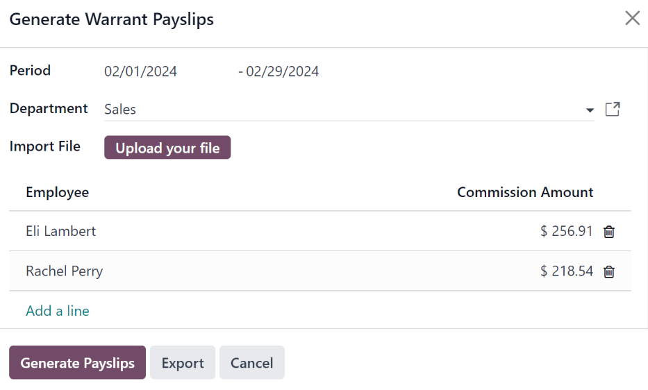

===========
Commissions
===========

Commissions are payments made to employees that are earned as part of their salary. The payments are
awarded after a sale has been made, and the amount depends on how much the sale was. Typically the
amount is either a percentage of the sale, or a set commission based on a structure created by the
company.

To pay an employee a commission they earned, a separate commission paycheck must be issued to the
employee. In Odoo, a commission payslip is referred to as a *warrant payslip*.

Create warrant payslips
=======================

Warrant payslips are generated directly from the :guilabel:`Payslips Batches` dashboard, which is
accessed by navigating to :menuselection:`Payroll app --> Payslips --> Batches`.

First, click the :guilabel:`Generate Warrant Payslips` button in the top-left corner. Doing so
reveals a :guilabel:`Generate Warrant Payslips` pop-up window, in which the necessary information
**must** be filled out.

Set the time frame the commission was earned, in the two fields next to :guilabel:`Period`. Click
into each field, and a calendar pop-up window loads. Navigate to the desired date and click on it
to select it.

Using the drop-down menu, select the :guilabel:`Department` in the corresponding field. When a
department is selected, the employees listed for that department appear in the :guilabel:`Employee`
section, below.

If a file is needed for the record, upload a file to the :guilabel:`Import File` field, such as a
sales invoice, using the :guilabel:`Upload your file` button. Any file type is accepted.

Under the :guilabel:`Employee` section, enter the individual :guilabel:`Commission Amount` for each
employee in the far-right column. To remove an employee, click the :icon:`fa-trash-o`
:guilabel:`(trash)` icon to remove the line.

Add a new commission by clicking :guilabel:`Add a Line`, and entering the :guilabel:`Employee` and
the appropriate :guilabel:`Commission Amount`.

Once all the commissions are properly entered, click the :guilabel:`Generate Payslips` button to
create the warrant payslips in a batch, or click :guilabel:`Export` to export a CSV file of the
commissions.

:ref:`Process the batch <payroll/batch-process>` in the same way as a typical batch to complete the
payment process.

.. seealso::
   :doc:`Commissions <../../sales/sales/commissions>`
