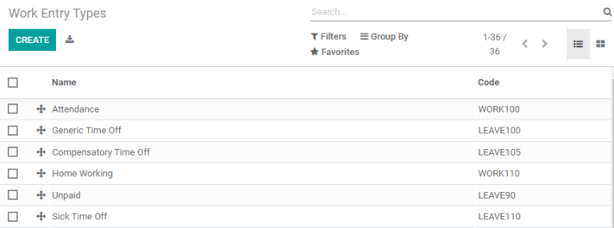
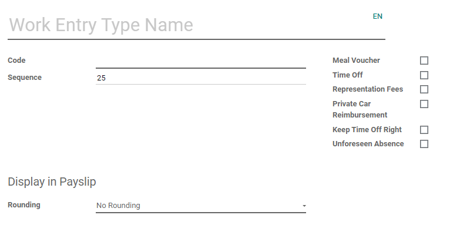
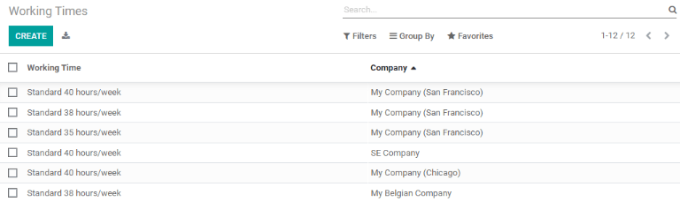
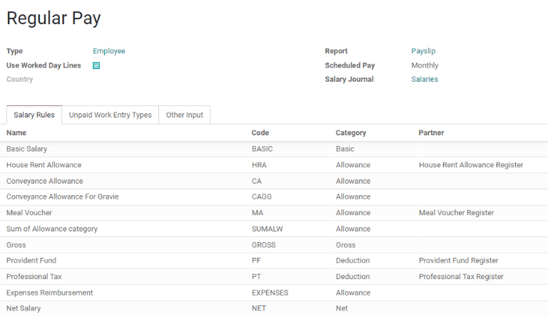
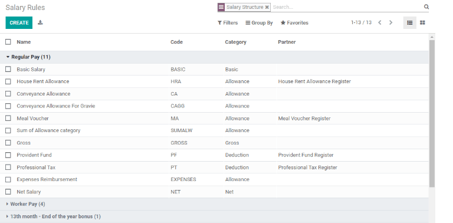
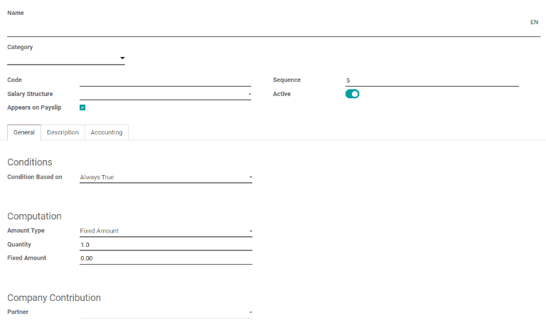
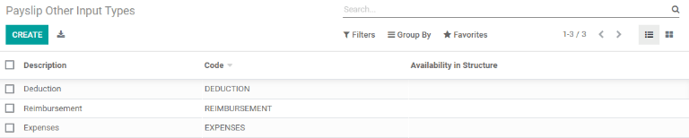
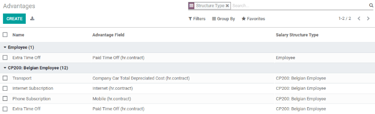
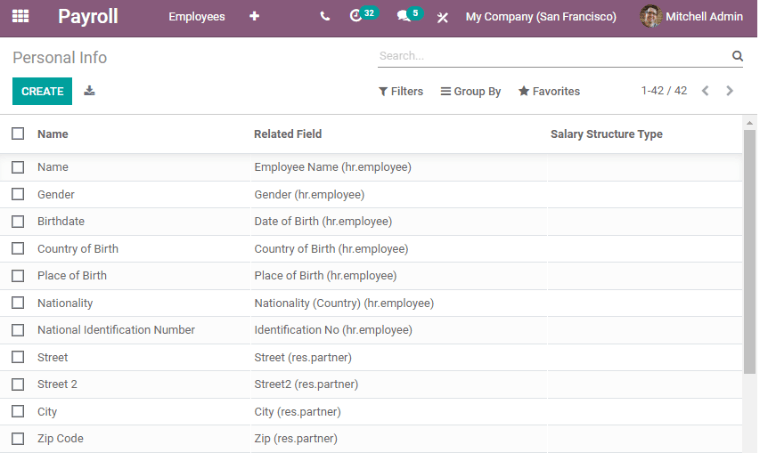

=====================
Payroll configuration
=====================

Odoo *Payroll* is used to process work entries and create payslips for employees, including both
regular pay and commission. Payroll works in conjunction with other Odoo apps, such as *Employees*,
*Timesheets*, *Time Off*, and *Attendances*.

The *Payroll* app helps ensure there are no issues or conflicts when validating work entries,
handles country-specific localizations to ensure that payslips follow local rules and taxes, and
allows for salary assignments. Payroll configuration is critical to ensure accurate and timely
processing of payslips.

Settings
========

To access the *Settings*, go to :menuselection:`Payroll --> Configuration --> Settings`. Whether or
not payslips are posted in accounting, and whether SEPA payments are created, is selected here.

The :guilabel:`Settings` screen is where localization settings are configured. *Localizations* are
country-specific settings pre-configured in Odoo at the creation of the database, and account for
all taxes, fees, and allowances for that particular country. The :guilabel:`Localization` section of
the :guilabel:`Settings` includes a detailed view of all benefits provided to employees.

.. image:: configuration/payroll-settings.png
   :align: center
   :alt: Settings available for Payroll.

Any country-specific localizations are set up in the :guilabel:`Localization` section of the
:guilabel:`Settings` screen. All localization items are pre-populated when the country is specified
during the creation of the database. It is not recommended to alter the localization settings unless
specifically required.

Work entries
============

A *work entry* is an individual record on an employee's timesheet. Work entries can be configured to
account for all types of work and time off, such as :guilabel:`Attendance`, :guilabel:`Sick Time
Off`, :guilabel:`Training`, or :guilabel:`Public Holiday`.

Work entry types
----------------

When creating a work entry in the *Payroll* application, or when an employee enters information in
the *Timesheets* application, a :guilabel:`Work Entry Type` needs to be selected. The list of
:guilabel:`Work Entry Types` is automatically created based on localization settings set in the
database.

To view the current work entry types available, go to :menuselection:`Payroll --> Configuration -->
Work Entry Types`.

Each work entry type has a code to aid in the creation of payslips, and ensure all taxes and fees
are correctly entered.

New work entry type
~~~~~~~~~~~~~~~~~~~

To create a new work entry type, click the :guilabel:`Create` button. Enter the information on the
form:

- :guilabel:`Work Entry Type Name`: The name should be short and descriptive, such as `Sick Time` or
  `Public Holiday`.
- :guilabel:`Code`: This code appears with the work entry type on timesheets and payslips. Since the
  code is used in conjunction with the *Accounting* application, it is advised to check with the
  accounting department for a code to use.
- :guilabel:`Sequence`: The sequence determines the order that the work entry is computed in the
  payslip list.
- Check boxes: If any of the items in the list applies to the work entry, check off the box by
  clicking it. If :guilabel:`Time Off` is checked off, a :guilabel:`Time Off Type` field appears.
  This field has a drop-down menu to select the specific type of time off, or a new type of time off
  can be entered.

- :guilabel:`Rounding`: The rounding method determines how timesheet entries are displayed on the
  payslip.

  - :guilabel:`No Rounding`: A timesheet entry is not modified.
  - :guilabel:`Half Day`: A timesheet entry is rounded to the closest half day amount.
  - :guilabel:`Day`: A timesheet entry is rounded to the closest full day amount.

.. example::
   If the working time is set to an 8-hour work day (40-hour work week), and an employee enters a
   time of 5.5 hours on a timesheet, and :guilabel:`Rounding` is set to :guilabel:`No Rounding`, the
   entry remains 5.5 hours. If :guilabel:`Rounding` is set to :guilabel:`Half Day`, the entry is
   changed to 4 hours. If it is set to :guilabel:`Day`, it is changed to 8 hours.

Working times
-------------

To view the currently configured working times, go to :menuselection:`Payroll --> Configuration -->
Working Times`. The working times that are available for an employee's contracts and work entries
are found in this list.

Working times are company-specific. Each company must identify each type of working time they use.
For example, an Odoo database containing multiple companies that use a standard 40-hour work week
needs to have a separate working time entry for each company that uses the 40-hour standard work
week.

New working time
~~~~~~~~~~~~~~~~

To create a new working time, click the :guilabel:`Create` button. Enter the information on the
form.

.. image:: configuration/new-working-times.png
   :align: center
   :alt: New working type form.

The fields are auto-populated for a regular 40-hour work week but can be modified. First, change the
name of the working time by modifying the text in the :guilabel:`Name` field. Next, make any
adjustments to the days and times that apply to the new working time.

In the :guilabel:`Working Hours` tab, modify the :guilabel:`Day of Week`, :guilabel:`Day Period`,
and :guilabel:`Work Entry Type` selections by clicking on the drop-down menus in each column and
making the desired selection. The :guilabel:`Work From` and :guilabel:`Work To` columns are modified
by typing in the time.

.. note::
   The :guilabel:`Work From` and :guilabel:`Work To` times must be in a 24-hour format. For example,
   `2:00 PM` would be entered as `14:00`.

If the working time should be in a two-week configuration, click the :guilabel:`Switch To 2 Week
Calendar` button. This creates entries for an :guilabel:`Even week` and an :guilabel:`Odd week`.

Salary
======

.. _payroll/structure-types:

Structure types
---------------

In Odoo, an employee's payslip is based on *structures* and *structure types*, which both affect how
an employee enters timesheets. Each structure type is an individual set of rules for processing a
timesheet entry, which consists of different structures nested within it. Structure types define how
often an employee gets paid, the working hours, and if wages are based on a salary (fixed) or how
many hours the employee worked (varied).

For example, a structure type could be `Employee`, and that structure type could have two different
structures in it: a `Regular Pay` structure which includes all the separate rules for processing
regular pay, as well as a structure for an `End of Year Bonus` which includes the rules only for the
end of year bonus. Both the `Regular Pay` structure and `End of Year Bonus` structure are structures
within the `Employee` structure type.

The different structure types can be seen by going to :menuselection:`Payroll --> Configuration -->
Structure Types`.

There are two default structure types configured in Odoo: *Employee* and *Worker*. Typically,
*Employee* is used for salaried employees, which is why the wage type is *Monthly Fixed Wage*, and
*Worker* is typically used for employees paid by the hour, so the wage type is *Hourly Wage*.

.. image:: configuration/structure-type.png
   :align: center
   :alt: List of all structure types.

Click the :guilabel:`Create` button to make a new structure type. Most fields are pre-populated, but
all fields can be edited. Once the fields are edited, click the :guilabel:`Save` button to save the
changes, or click :guilabel:`Discard` to delete the entry.

.. image:: configuration/new-structure.png
   :align: center
   :alt: New structure type box.

Structures
----------

*Salary structures* are the different ways an employee gets paid within a specific *structure*, and
are specifically defined by various rules.

The amount of structures a company needs for each structure type depends on how many different ways
employees are paid, and how their pay is calculated. For example, a common structure that could be
useful to add may be a `Bonus`.

To view all the various structures for each structure type, go to :menuselection:`Payroll -->
Configuration --> Structures`.

.. image:: configuration/salary-structure.png
   :align: center
   :alt: All available salary structures.

Each :ref:`structure type <payroll/structure-types>` lists the various structures associated with
it. Each structure contains a set of rules that define it.

Click on a structure to view its :guilabel:`Salary Rules`. These rules are what calculate the
payslip for the employee.

Rules
-----

Each structure has a set of *salary rules* to follow for accounting purposes. These rules are
configured by the localization, and affect the *Accounting* application, so modifications to the
default rules, or the creation of new rules, should only be done when necessary.

To view all the rules, go to :menuselection:`Payroll app --> Configuration --> Rules`. Click on a
structure (such as :guilabel:`Regular Pay`) to view all the rules.

To make a new rule, click :guilabel:`Create`. A new rule form appears. Enter the information in the
fields, then click :guilabel:`Save`.

The required fields for a rule are:

- :guilabel:`Name`: Enter a name for the rule.
- :guilabel:`Category`: Select a category the rule applies to from the drop-down menu, or enter a
  new one.
- :guilabel:`Code`: Enter a code to be used for this new rule. It is recommended to coordinate with
  the accounting department for a code as this will affect them.
- :guilabel:`Salary Structure`: Select a salary structure the rule applies to from the drop-down
  menu, or enter a new one.
- :guilabel:`Condition Based on`: In the :guilabel:`General` tab, select from the drop-down menu
  whether the rule is :guilabel:`Always True` (always applies), a :guilabel:`Range` (applies to a
  specific range, which is entered beneath the selection), or a :guilabel:`Python Expression` (the
  code is entered beneath the selection).
- :guilabel:`Amount Type`: In the :guilabel:`General` tab, select from the drop-down menu whether
  the amount is a :guilabel:`Fixed Amount`, a :guilabel:`Percentage (%)`, or a :guilabel:`Python
  Code`. Depending on what is selected, the fixed amount, percentage, or Python code needs to be
  entered next.

Rule parameters
---------------

.. note::
   Currently, the :guilabel:`Rule Parameters` feature found inside the :menuselection:`Payroll app
   --> Configuration` menu is still in development and only serves a specific use case for Belgian
   markets. The documentation will be updated when this section has matured to more markets.

Other input types
-----------------

When creating payslips, it is sometimes necessary to add other entries for specific circumstances,
like expenses, reimbursements, or deductions. These other inputs can be configured by going to
:menuselection:`Payroll --> Configuration --> Other Input Types`.

To create a new input type, click the :guilabel:`Create` button. Enter the :guilabel:`Description`,
the :guilabel:`Code`, and which structure it applies to in the :guilabel:`Availability in Structure`
field. Click the :guilabel:`Save` button to save the changes, or click :guilabel:`Discard` to delete
the entry.

.. image:: configuration/input-type-new.png
   :align: center
   :alt: Create a new Input Type.

Salary package configurator
===========================

The various options under the :guilabel:`Salary Package Configurator` section of the
:menuselection:`Payroll --> Configuration` menu all affect an employee's potential salary. These
sections (:guilabel:`Advantages`, :guilabel:`Personal Info`, and :guilabel:`Resume`) specify what
benefits can be offered to an employee in their salary package.

Depending on what information an employee enters (such as deductions, dependents, etc.), their
salary is adjusted accordingly. When an applicant applies for a job on the company website, the
sections under :guilabel:`Salary Package Configurator` directly affect what the applicant sees, and
what is populated as the applicant enters information.

Advantages
----------

When offering potential employees a position, there can be certain *advantages* set in Odoo in
addition to the salary to make the offer more appealing (such as extra time off, access to a company
car, reimbursement for a phone or internet, etc.).

To see the advantages, go to :menuselection:`Payroll --> Configuration --> Advantages`. Advantages
are grouped by :guilabel:`Structure type`.

To make a new advantage, click the :guilabel:`Create` button. Enter the information in the fields,
then click the :guilabel:`Save` button to save the changes, or click :guilabel:`Discard` to delete
the entry.

.. image:: configuration/new-advantage.png
   :align: center
   :alt: List of advantages employee's can have.

The required fields for an advantage are:

- :guilabel:`Name`: Enter the name for the advantage.
- :guilabel:`Advantage Field`: Select from the drop-down menu what field in the payslip this
  advantage appears under.
- :guilabel:`Advantage Type`: Select from the drop-down menu what type of advantage the benefit is.
  Select from :guilabel:`Monthly Benefit in Kind`, :guilabel:`Monthly Advantages in Net`,
  :guilabel:`Monthly Advantages in Cash`, or :guilabel:`Yearly Advantages in Cash`.
- :guilabel:`Salary Structure Type`: Select from the drop-down menu which salary structure type this
  advantage applies to.

Personal info
-------------

Every employee in Odoo has an *employee card* that includes all of their personal information,
resume, work information, and documents. To view an employee's card, go to the main
:menuselection:`Payroll` app dashboard, and click on the employee's card, or go to
:menuselection:`Payroll --> Employees --> Employees` and click on the employee's card. Employee
cards can also be viewed by going to the :menuselection:`Employees` app.

.. note::
   An employee card can be thought of as an employee personnel file.

The *Personal Information* section lists all of the fields that are available to enter on the
employee's card. To access this section, go to :menuselection:`Payroll --> Configuration -->
Personal Info`.

To edit an entry, select it from the list. Then, click the :guilabel:`Edit` button, and modify the
entry. When done, click :guilabel:`Save` or :guilabel:`Discard` to save the information or cancel
the edits.

.. image:: configuration/personal-new.png
   :align: center
   :alt: New personal information entry.

The two most important fields on the personal info form are :guilabel:`Is Required` and
:guilabel:`Display Type`. Checking the :guilabel:`Is Required` box makes the field mandatory on the
employee's card.

The :guilabel:`Display Type` drop-down menu allows for the information to be entered in a variety of
ways, from a :guilabel:`Text` box, to a customizable :guilabel:`Radio` button, a
:guilabel:`Checkbox`, a :guilabel:`Document`, and more.

Once the information is entered, click the :guilabel:`Save` button to save the entry.

Resume
------

.. note::
   Currently, the :guilabel:`Resume` feature found inside the :menuselection:`Payroll app -->
   Configuration` menu is still in development and only serves a specific use case for Belgian
   markets. The documentation will be updated when this section has matured to more markets.
