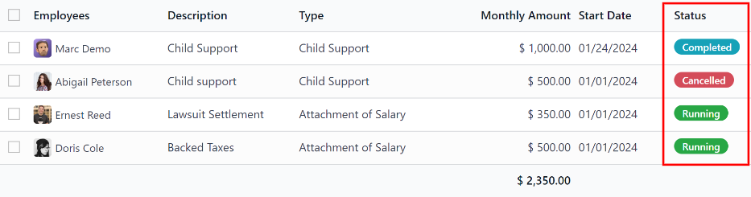
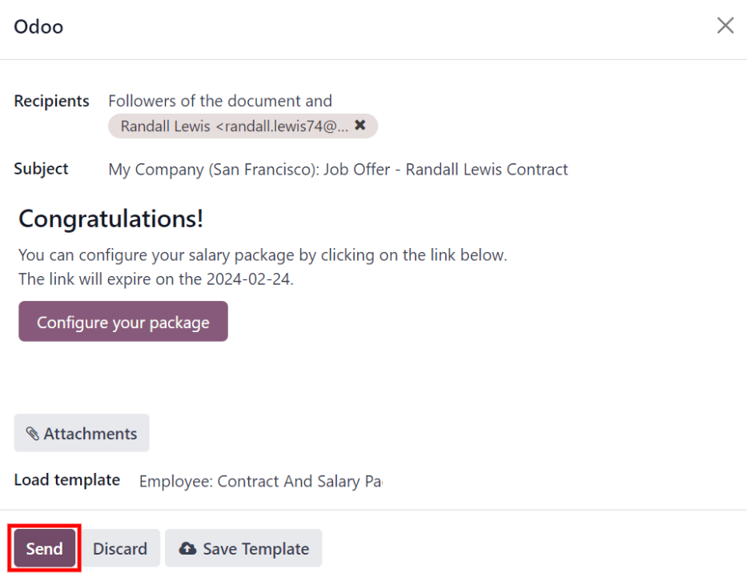
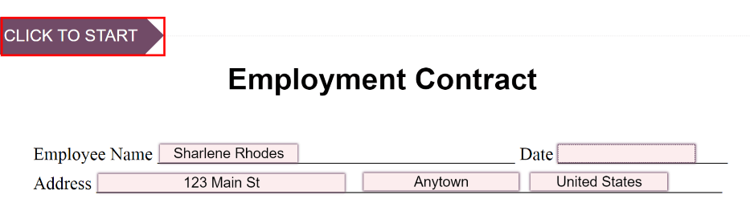

=========
Contracts
=========

Every employee in Odoo is required to have a contract to be paid. A contract outlines the terms of
an employee's job position, compensation, working hours, and any other details specific to their
role.

.. important::
   Contract documents (PDFs) are uploaded and organized using the *Documents* application, and are
   signed using the *Sign* application. Ensure these applications are installed to send and sign
   contracts. Please refer to the :doc:`../../productivity/documents` and
   :doc:`../../productivity/sign` documentation.

To view the employee contracts, go to :menuselection:`Payroll app --> Contracts --> Contracts` from
the top menu. All employee contracts are displayed in a default list view, grouped into four
categories: :guilabel:`New`, :guilabel:`Running`, :guilabel:`Expired`, and :guilabel:`Cancelled`.

The default view has all categories collapsed. The number of contracts in each category is displayed
next to the category name (example: `Running (20)`). To view the list of contracts under any
category, click on the category, and the list expands downward, showing all contracts beneath it.

.. image:: contracts/contracts-overview.png
   :align: center
   :alt: Contracts dashboard view showing running contracts and contracts with issues.

.. note::
   The list of contracts in the *Payroll* application matches the list of contracts in the
   *Employees* application.

.. _payroll/new-contract:

Create new contracts
====================

For an employee to be paid, an active contract is required. When a new contract is needed, click the
:guilabel:`New` button on the :guilabel:`Contracts` dashboard. A contract form appears where the
information can be entered.

.. _payroll/gen-info:

General information section
---------------------------

- :guilabel:`Contact Reference`: type in the name or title for the contract, such as `John Smith
  Contract`. This field is **required**.
- :guilabel:`Employee`: using the drop-down menu, select the employee that the contract applies to.
- :guilabel:`Contract Start Date`: the date the contract starts. To choose a date, click the
  drop-down menu, navigate to the correct month and year with the :guilabel:`< > (arrow)` icons,
  then click on the desired date. This field is **required**.
- :guilabel:`Contract End Date`: if the contract has a specific end date, click the drop-down menu,
  navigate to the correct month and year with the :guilabel:`< > (arrow)` icons, then click on the
  desired date.
- :guilabel:`Working Schedule`: select one of the working schedules from the drop-down menu. This
  field is **required**.

  .. tip::
     The :guilabel:`Working Schedule` drop-down menu displays all the working schedules for the
     selected company. To modify or add to this list, go to :menuselection:`Payroll app -->
     Configuration --> Working Schedules`. Click :guilabel:`New`, and create a new working schedule,
     or click on an existing working schedule and make edits.

- :guilabel:`Work Entry Source`: select how the :doc:`work entries <work_entries>` are generated.
  This field is **required**. Click the radio button next to the desired selection. The options are:

  - :guilabel:`Working Schedule`: work entries are generated based on the selected
    :guilabel:`Working Schedule`.
  - :guilabel:`Attendances`: work entries are generated based on the employee's check-in records in
    the *Attendances* application. (This requires the *Attendances* application).
  - :guilabel:`Planning`: work entries are generated based on the planned schedule for the employee
    from the *Planning* application. (This requires the *Planning* application).

- :guilabel:`Salary Structure Type`: select one of the salary structure types from the drop-down
  menu. The default salary structure types are :guilabel:`Employee` or :guilabel:`Worker`. A
  :ref:`new salary structure type <payroll/new-structure-type>` can be created, if needed.
- :guilabel:`Department`: select the department the contract applies to from the drop-down menu.
- :guilabel:`Job Position`: select the specific job position the contract applies to from the
  drop-down menu.

  .. note::
     If the selected :guilabel:`Job Position` has a contract template linked to it with a specific
     :guilabel:`Salary Structure Type`, the :guilabel:`Salary Structure Type` changes to the one
     associated with that :guilabel:`Job Position`.

- :guilabel:`Wage on Payroll`: enter the employee's monthly wage.
- :guilabel:`Contract Type`: choose either :guilabel:`Permanent`, :guilabel:`Temporary`,
  :guilabel:`Seasonal`, :guilabel:`Full-Time`, or :guilabel:`Part-Time` from the drop-down menu.

.. figure:: contracts/required-fields.png
   :align: center
   :alt: New contract form to be filled in when creating a new contract, with required fields
         outlined in red.

   The general information section filled out, with the required fields highlighted in red.

Salary Information tab
----------------------

This section is where the specific salary details are defined. This section is country-specific, so
depending on where the company is located, these fields may vary.

The following fields are universal and apply to all localizations:

- :guilabel:`Wage Type`: select either :guilabel:`Fixed Wage` or :guilabel:`Hourly Wage` from the
  drop-down menu.
- :guilabel:`Schedule Pay`: select how often the employee is paid using the drop-down menu. Options
  are :guilabel:`Annually`, :guilabel:`Semi-annually`, :guilabel:`Quarterly`,
  :guilabel:`Bi-monthly`, :guilabel:`Monthly`, :guilabel:`Semi-monthly`, :guilabel:`Bi-weekly`,
  :guilabel:`Weekly`, or :guilabel:`Daily`.
- :guilabel:`Wage`: enter the employee's gross wage. The metric for the :guilabel:`Wage` is based on
  what is selected for the :guilabel:`Schedule Pay`.

  .. example::
     If :guilabel:`Annually` is selected for the :guilabel:`Schedule Pay`, then the :guilabel:`Wage`
     field appears in a `$0.00/year` format. If the :guilabel:`Schedule Pay` is set to
     :guilabel:`Bi-weekly`, then the :guilabel:`Wage` field appears in a `$0.00/two weeks` format.

- :guilabel:`Yearly Cost (Real)`: this field automatically updates after the :guilabel:`Schedule
  Pay` and :guilabel:`Wage` fields are entered. This amount is the total yearly cost for the
  employer. This field can be modified. However, if this is modified, the :guilabel:`Wage` field
  updates, accordingly. Ensure both the :guilabel:`Wage` and :guilabel:`Yearly Cost (Real)` are
  correct if this field is modified.
- :guilabel:`Monthly Cost (Real)`: this field automatically updates after the :guilabel:`Schedule
  Pay` and :guilabel:`Wage` fields are entered. This amount is the total monthly cost for the
  employer. This field **cannot** be modified, and is calculated based on the :guilabel:`Yearly
  Cost (Real)`.

  .. image:: contracts/salary-info.png
     :align: center
     :alt: Optional tabs for a new contract.

Contract Details tab
--------------------

The contract details section allows for the addition and editing of a contract, and the ability to
send the contract to the employee for approval and signatures.

- :guilabel:`Contract Template`: select a pre-existing contract template from the drop-down menu.
  Contract templates are typically created through the configuration menu, and stored in the
  *Documents* application.

Sign section
~~~~~~~~~~~~

- :guilabel:`HR Responsible`: select the person who is responsible for validating the contract from
  the drop-down menu. This field is required.
- :guilabel:`New Contract Document Template`: select a contract from the drop-down menu to be
  modified for this new employee contract. These documents are stored in the *Sign* application.
- :guilabel:`Contract Update Document Template`: select a contract from the drop-down menu, if the
  employee has an existing contract that requires updating. These documents are stored in the *Sign*
  application.

.. important::
   The :guilabel:`HR Responsible`, :guilabel:`New Contract Document Template`, and
   :guilabel:`Contract Update Document Template` fields are only visible if the *Sign* application
   is installed, along with the `hr_contract_salary` and `hr_contract_salary_payroll` :doc:`modules
   <../../general/apps_modules>`. The *Sign* application is where the contract templates are stored.
   This application is required for an employee to sign any contract.

Accounting section
~~~~~~~~~~~~~~~~~~

- :guilabel:`Analytic Account`: select the account the contract affects from the drop-down menu. It
  is recommended to check with the accounting department to ensure the correct account is selected.

Part Time section
~~~~~~~~~~~~~~~~~

- :guilabel:`Part Time`: tick this box if the employee is working part-time. When active, additional
  fields appear:

  - :guilabel:`% (Percentage)`: enter the percent of time the employee works as compared to a
    full-time employee.
  - :guilabel:`Standard Calendar`: select the working hours that a typical full-time worker uses
    from the drop-down menu.
  - :guilabel:`Part Time Work Entry Type`: select the work entry type that generates the balance of
    a full-time working schedule.

    .. example::
       If a full-time employee works 40 hours a week, and the employee works 20, enter `50` in the
       :guilabel:`% (Percentage)` field (50% of 40 hours = 20 hours). The employee generates twenty
       (20) hours of work entries under the work entry type `part-time`, and another twenty (20)
       hours of work entries under the work entry type `generic time off`, for a total of forty (40)
       hours worth of work entries.

Notes section
~~~~~~~~~~~~~

- :guilabel:`Notes`: a text field where any notes for the employee contract are entered for future
  reference.

.. image:: contracts/contract-details.png
   :align: center
   :alt: Contract details in optional tabs for a new contract.

Personal Documents tab
----------------------

Once an :guilabel:`Employee` is selected in the :ref:`General Information section
<payroll/gen-info>`, the :guilabel:`Personal Documents` tab appears.

If any documents are needed to keep on file, add them in the :guilabel:`Personal Documents` tab.
Depending on what other applications are installed, and what kind of benefits are enabled (and
offered) to the employee, the various options to add a file varies. The :guilabel:`Image` option
always appears, and is available by default.

Click the :guilabel:`Upload your file` button next to the corresponding document, navigate to the
file, then click :guilabel:`Open` to select the document and add it to the tab.

Modifying contract templates
============================

Contracts templates can be modified at any point when changes are needed.

To modify a contract template, refer to the :ref:`contract templates <payroll/contract-templates>`
section of the main payroll documentation.

Salary attachments
==================

Any automatic deductions or allocations for an employee, such as child support payments and wage
garnishments, are referred to as a *salary attachment*. Navigate to :menuselection:`Payroll app -->
Contracts --> Salary Attachments` to view a list of all the currently configured salary attachments.

Each salary attachment appears with all its relevant details displayed. The :guilabel:`Status` for
each attachment is color-coded in the far right column.

Currently running salary attachments have a :guilabel:`Status` of :guilabel:`Running`, and appear in
green. Salary attachments that have been paid in-full, and are no longer active, have a
:guilabel:`Status` of :guilabel:`Completed`, and appear in blue. Cancelled salary attachments have a
:guilabel:`Status` of :guilabel:`Cancelled`, and appear in red.

New salary attachment
---------------------

To create a new salary attachment from the :guilabel:`Salary Attachment` page, click
:guilabel:`New`, and a blank salary attachment form loads. Enter the following information on the
form:

- :guilabel:`Employees`: add any employees the salary attachment applies to using the drop-down
  menu.

  .. tip::
     Multiple employees can be added, if the salary attachment details are identical. After all
     employees are added, a :guilabel:`Create Individual Attachments` button appears at the top of
     the form.

     After the form is completed, click the :guilabel:`Create Individual Attachments` button to
     create separate salary attachments for each of the employees listed in this field.

     .. image:: contracts/individual-attachments.png
        :align: center
        :alt: The Create Individual Attachments button that appears after multiple employees are
              added to the Employees field.

     This is a time-saving tip, so that separate salary attachments do not need to be created
     individually. They can be created in a batch using this method.

- :guilabel:`Description`: enter a description for the specific type of salary attachment.
- :guilabel:`Type`: select the :ref:`type of salary attachment <payroll/salary-attachment-types>`
  from the drop-down menu. The options listed come from the salary attachment types configured in
  the configuration menu.
- :guilabel:`Start Date`: enter the date the salary attachment begins. The first of the current
  month populates this field, by default. Click on the date, and a calendar appears. Navigate to the
  desired month and year, using the :guilabel:`< > (arrow)` icons, and click on the date to select
  it.
- :guilabel:`Document`: if any documents are needed for the salary attachment, click the
  :guilabel:`Upload your file` button, and a file explorer appears. Navigate to the file, and click
  :guilabel:`Open` to select them, and attach them to the form.
- :guilabel:`Monthly Amount`: enter the amount to be taken out of the paycheck each month for this
  salary attachment.
- :guilabel:`Estimated End Date`: this field only appears after the :guilabel:`Monthly Amount` field
  is populated, and if the :guilabel:`Type` is **not** set to :guilabel:`Child Support`. This date
  is when the salary attachment is predicted to end, and is automatically calculated once both, the
  :guilabel:`Monthly Amount` and :guilabel:`Total Amount`, fields are populated. This is calculated
  based on how much is required to be paid, and how much is paid towards that amount each month. If
  either the :guilabel:`Monthly Amount` or :guilabel:`Total Amount` changes, this field
  automatically updates. It is **not** possible to modify this field.
- :guilabel:`Total Amount`: enter the total amount to be paid in this field. If :guilabel:`Child
  Support` is selected for the :guilabel:`Type`, this field does **not** appear.

.. image:: contracts/garnishment.png
   :align: center
   :alt: Enter a new line for each type of garnishment.

.. important::
   When the total amount has been paid for the salary attachment, navigate to the individual salary
   attachment, and click the :guilabel:`Mark as Completed` button at the top of the form. This
   changes the status to :guilabel:`Completed`, and the garnishments are no longer taken out of the
   employee's paychecks.

Offers
======

Once a contract has been created or modified, the contract **must** be sent to the employee to be
accepted and signed.

Send an offer
-------------

Open an individual contract by navigating to :menuselection:`Payroll app --> Contracts ->
Contracts`, and click on a contract to open the contract form. Click on the :guilabel:`Generate
Offer` button at the top of the page, and a :guilabel:`Generate Simulation Link` pop-up form
appears.

.. image:: contracts/send-contract.png
   :align: center
   :alt: Send the contract to the employee via one of the buttons.

The :guilabel:`Generate Simulation Link` pop-up form contains all the information pulled from the
contract, including the :guilabel:`Contract Template`, :guilabel:`Job Position`, :guilabel:`Job
Title`, :guilabel:`Department`, :guilabel:`Contract Start Date`, :guilabel:`Default Vehicle`,
:guilabel:`Contract Type`, and :guilabel:`Yearly Cost`.

At the bottom of the pop-up form is a :guilabel:`Link Expiration Date`. This is the timeframe that
the contract offer is valid for. By default, this field is pre-populated with `30 days`, but it can
be modified.

Click the :guilabel:`Send By Email` button, and a :guilabel:`Send Offer Email` template pop-up
window appears. Make any modifications to the email, and attach any additional documents needed,
then click :guilabel:`Send` to send the offer.

.. note::
   To send a contract using the :guilabel:`Generate Simulation Link`, there **must** be a signature
   field in the contract PDF being sent to the employee, so they can sign it.

Accept an offer
---------------

Once the offer email is received, the offer can be accepted, and the contract can be signed.

In the offer email, click the :guilabel:`Configure your package` button, and the offer loads in a
new tab. Enter the requested information on the form. Next, click the :guilabel:`Review Contract &
Sign` button to begin the signing process.

Click the :guilabel:`CLICK TO START` button at the top-left of the contract. Follow the prompts to
complete the signature request. The contract auto-populates with the information entered on the
:guilabel:`Configure your package` page. When done, click the :guilabel:`Validate & Send Completed
Document` button at the bottom of the contract.

After the document is signed by the (potential) employee, management signs the contract next. The
manager's signature is completed directly in the *Sign* application.

.. note::
   Depending on the localization settings, there may be the option to customize the offer in the
   :guilabel:`Configure your package` tab.

View offers
-----------

To view the current offers, navigate to :menuselection:`Payroll app --> Contracts --> Offers`. This
presents all offers in a list view, grouped by status, and displays the number of offers in each
status category. The statuses are: :guilabel:`Fully Signed`, :guilabel:`Partially Signed`,
:guilabel:`In Progress`, and :guilabel:`Expired`.

To view the offers with a specific status, click on the status to expand the list. If a specific
status has no offers, the status is not visible in the list.

.. image:: contracts/offers.png
   :align: center
   :alt: The offers in a list view, grouped by status.
