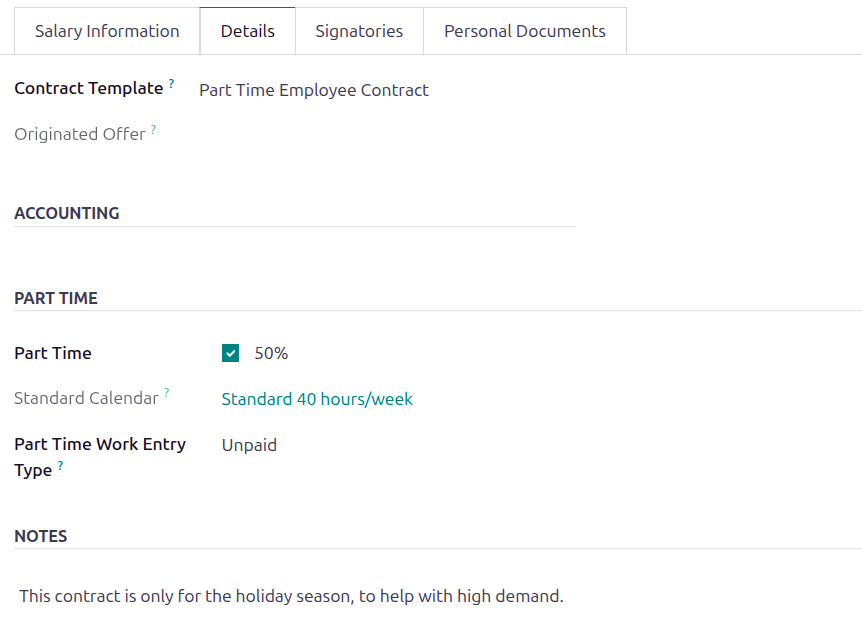
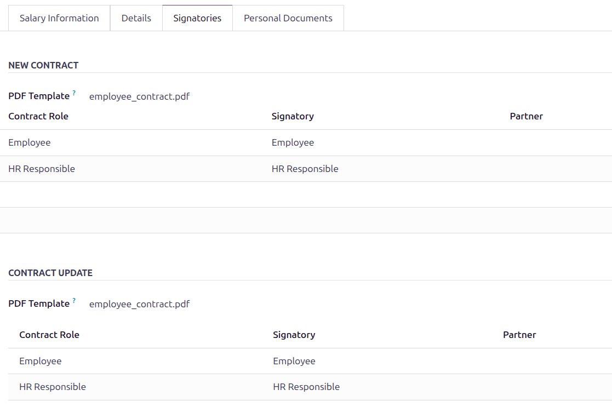
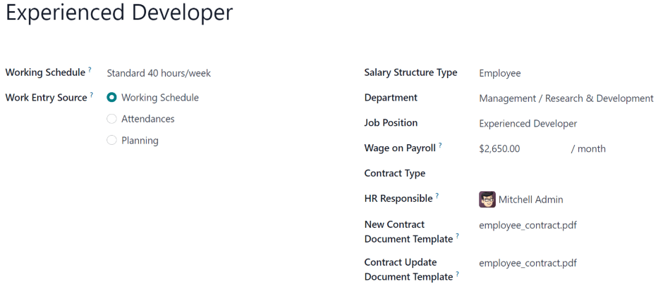
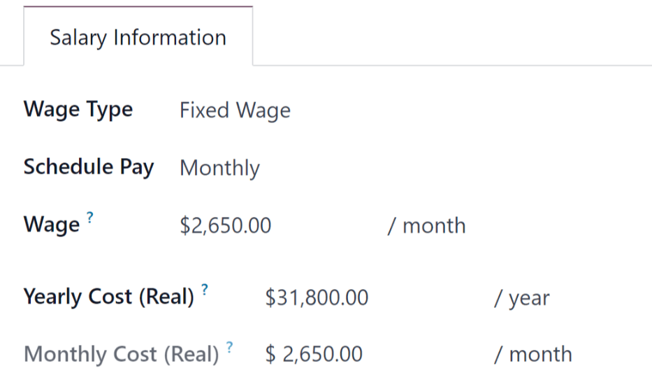

=========
Contracts
=========

Every employee in Odoo is required to have a running contract in order to be paid. A contract
outlines the terms of an employee's position, compensation, working hours, and any other relevant
terms.

.. important::
   Contract documents (PDFs) are uploaded and organized using the **Documents** application, and are
   signed using the **Sign** application. Ensure these applications are installed to send and sign
   contracts. Please refer to the :doc:`../../productivity/documents` and
   :doc:`../../productivity/sign` documentation for more information.

.. _payroll/contract-dashboard:

Contracts dashboard
===================

Both the **Payroll** and **Employees** apps display *identical employee contract information*.

To access the contracts dashboard from the **Employees** app, navigate to :menuselection:`Employees
app --> Employees --> Contracts`. To access the contracts dashboard from the **Payroll** app,
navigate to :menuselection:`Payroll app --> Contracts --> Contracts`.

The :guilabel:`Contracts` dashboard displays all employee contracts in a default list view, grouped
by :guilabel:`Status`. The available status groupings are :guilabel:`New`, :guilabel:`Running`,
:guilabel:`Expired`, and :guilabel:`Cancelled`. Each grouping displays the number of contracts
within the grouping.

.. image:: contracts/contracts-overview.png
   :alt: Contracts dashboard view showing running contracts and contracts with issues.

.. note::
   Any changes made to contracts in the **Employees** app is reflected in the **Payroll** app, and
   vice versa. Contract information remains identical, regardless of where the contract information
   is accessed.

.. _payroll/new-contract:

Create a contract
=================

To create a new contract, click the :guilabel:`New` button on the :ref:`Contracts dashboard
<payroll/contract-dashboard>`, and a blank contract form appears.

.. _payroll/gen-info:

General information section
---------------------------

Enter the following information in the top-half of the blank contract form:

- :guilabel:`Contact Reference`: Type in the name or title for the contract, such as `John Smith
  Contract`. This field is **required**.
- :guilabel:`Employee`: Using the drop-down menu, select the employee the contract is for.
- :guilabel:`Contract Start Date`: Select the date the contract goes into effect. Contracts can be
  created retroactively, or be created to begin at a future date. The current date populates this
  required field by default, but can be modified.
- :guilabel:`Contract End Date`: If the contract has a firm end date, enter the date in this field.
  Leave this field blank if the contract runs indefinitely, or until a new contract is made (when
  the employee has a change to their job title, salary, or benefits).
- :guilabel:`Working Schedule`: Select one of the available working schedules the employee is
  expected to work, from the drop-down menu. The selected working schedule determines how :doc:`work
  entries <work_entries>` are generated, which determines the employees schedule and compensation.
  If this field is left blank, this allows the employee to work as many or as few hours as desired
  every week, with no restrictions.

  .. tip::
     The :guilabel:`Working Schedule` drop-down menu displays all the working schedules for the
     selected company. To modify or add to this list, go to :menuselection:`Payroll app -->
     Configuration --> Working Schedules`. Click :guilabel:`New`, and create a new working schedule,
     or click on an existing working schedule and make edits.

.. _payroll/work-entry-source:

- :guilabel:`Work Entry Source`: Using the drop-down menu, select how the :doc:`work entries
  <work_entries>` are generated. This field is **required**. Click the radio button next to the
  desired selection. The options are:

  - :guilabel:`Working Schedule`: Work entries are generated based on the selected
    :guilabel:`Working Schedule`.
  - :guilabel:`Attendances`: Work entries are generated based on the employee's check-in records in
    the **Attendances** app. (This requires the **Attendances** app to be installed).
  - :guilabel:`Planning`: Work entries are generated based on the planned schedule for the employee
    from the **Planning** app. (This requires the **Planning** app to be installed).

- :guilabel:`Salary Structure Type`: Select one of the salary structure types from the drop-down
  menu. The default salary structure types are :guilabel:`Employee` or :guilabel:`Worker`. A
  :ref:`new salary structure type <payroll/new-structure-type>` can be created, if needed.
- :guilabel:`Department`: Select the department the employee is working within, using the drop-down
  menu.
- :guilabel:`Job Position`: Select the employee's specific job position using the drop-down menu.

  .. note::
     If the selected :guilabel:`Job Position` has a contract template linked to it with a specific
     :guilabel:`Salary Structure Type`, the :guilabel:`Salary Structure Type` changes to the one
     associated with that :guilabel:`Job Position`.

- :guilabel:`Contract Type`: Using the drop-down menu, select the type of contract being created.
  The default options are :guilabel:`Permanent`, :guilabel:`Temporary`, :guilabel:`Seasonal`,
  :guilabel:`Full-Time`, :guilabel:`Intern`, :guilabel:`Student`, :guilabel:`Apprenticeship`,
  :guilabel:`Thesis`, :guilabel:`Statutory`, and :guilabel:`Employee`.
- :guilabel:`Wage on Payroll`: Enter the employee's monthly wage in this field.

  .. tip::
     The :guilabel:`Working Schedule` drop-down menu displays all the working times for the selected
     :guilabel:`Company`. To modify or add to this list, go to :menuselection:`Payroll app -->
     Configuration --> Working Times`, and either :guilabel:`Create` a new working time, or click on
     an existing working time, then edit it by clicking :guilabel:`Edit`.

- :guilabel:`HR Responsible`: Select the person who is responsible for validating the contract using
  the drop-down menu. This field is required.

  .. note::
     The :guilabel:`HR Responsible` field only appears if the  **Salary Configurator**
     (`hr_contract_salary`) module and the **Sign** app are both installed.

.. figure:: contracts/required-fields.png
   :alt: New contract form to be filled in when creating a new contract.

Salary information tab
----------------------

The :guilabel:`Salary Information` tab is where the specific details of how much and how often the
employee is paid. Fill in the following fields in this tab:

- :guilabel:`Wage Type`: Using the drop-down menu, select what kind of pay the employee receives.
  The two default options are :guilabel:`Fixed Wage` or :guilabel:`Hourly Wage`. Select
  :guilabel:`Fixed Wage` for salaried employees, and select :guilabel:`Hourly Wage` for employees
  who are paid based on their logged worked hours.
- :guilabel:`Schedule Pay`: Using the drop-down menu, select how often the employee is paid. The
  default options are :guilabel:`Annually`, :guilabel:`Semi-annually`, :guilabel:`Quarterly`,
  :guilabel:`Bi-monthly`, :guilabel:`Monthly`, :guilabel:`Semi-monthly`,  :guilabel:`Bi-weekly`,
  :guilabel:`Weekly`, or :guilabel:`Daily`.
- :guilabel:`Wage`: Enter the amount the employee receives each pay period. The first field allows
  for a wage to be entered, the second field displays how often the pay is issued to the employee.
  The second field *cannot* be modified, and is updated when the :guilabel:`Schedule Pay` field
  changes.
- :guilabel:`Yearly Cost (Real)`: This field automatically updates after the :guilabel:`Schedule
  Pay` and :guilabel:`Wage` fields are entered. This amount is the total yearly cost for the
  employer. This field can be modified. However, if this is modified, the :guilabel:`Wage` field
  updates, accordingly. Ensure both the :guilabel:`Wage` and :guilabel:`Yearly Cost (Real)` are
  correct if this field is modified.
- :guilabel:`Monthly Cost (Real)`: This field automatically updates after the :guilabel:`Schedule
  Pay` and :guilabel:`Wage` fields are entered. This amount is the total monthly cost for the
  employer. This field **cannot** be modified, and is calculated based on the :guilabel:`Yearly Cost
  (Real)`.

.. figure:: contracts/salary-info.png
   :alt: The Salary Information tab filled out.

Details tab
-----------

The :guilabel:`Details` tab of the contract houses the contract template information, accounting
information (refer to the :doc:`country-specific localization document <payroll_localizations>` for
more information), any part time work information, and notes. Fill out the following fields in this
tab:

- :guilabel:`Contract Template`: Using the drop-down menu, select a :ref:`contract template
  <payroll/contract-template>` to use when making an offer to an applicant.
- :guilabel:`Originated Offer`: This field automatically populates with the original offer sent to
  the employee. This field is **not** modifiable, and is only populated if applicable.
- :guilabel:`Part Time`: Tick the checkbox if the contract is for part time work. Once enabled, a
  percentage field appears next to the checkbox. The percentage **cannot** be modified, and
  automatically updates based on the selected :guilabel:`Working Schedule` in the top-half of the
  contract, compared to the typical working schedule for the company (typically 40 hours/week).

  - :guilabel:`Standard Calendar`: This field is automatically populated with the default working
    schedule for the company. In most cases, this is :guilabel:`Standard 40 hours/week`.
  - :guilabel:`Part Time Work Entry Type`: Using the drop-down menu, select the work entry type that
    generates the balance of a full-time working schedule.

  .. example::
     An employee contract is being created for a part-time employee who works 20 hours a week.

     To configure this, the employee's :guilabel:`Working Schedule` is set to :guilabel:`20
     Hours/Part time` in the :ref:`general information section <payroll/gen-info>`. In the
     :guilabel:`Details` tab, the :guilabel:`Part Time` checkbox is ticked, and the percentage is
     set to `50`. The :guilabel:`Standard Calendar` is set to :guilabel:`Standard 40 hours/week`,
     and the :guilabel:`Part Time Work Entry Type` is set to :guilabel:`Unpaid`.

     When a typical work week is processed in the **Payroll** app, the employee generates twenty
     (20) hours of regular work entries under the work entry type `Attendance`, and another twenty
     (20) hours of work entries under the work entry type `Unpaid`, for a total of forty (40) hours
     worth of work entries.

- :guilabel:`Notes`: Enter any relevant notes for the contract in this field.

Signatories tab
---------------

The :guilabel:`Signatories` tab is where the default contract templates are selected, for both new
and updated contracts.

Using the drop-down menu, select the default contract template to use when creating a new or updated
contract, in the respective fields.

Once a PDF template is selected, any mapped signature fields in the file appear in a list, below the
selection, identifying who must sign the document. These fields **cannot** be updated.

Any changes to the template and signatories but be done in the **Sign** app, where contract
templates are uploaded, modified, and stored.

.. important::
   The :guilabel:`PDF Template` fields are only visible if the **Sign** app is installed, along with
   the :guilabel:`hr_contract_salary` and :guilabel:`hr_contract_salary_payroll` :doc:`modules
   <../../general/apps_modules>`.

Personal documents tab
----------------------

Occasionally, additional paperwork may be required when creating a contract, such as legal documents
declaring the employee is able to work in the country. When this situation occurs, Odoo allows for
one image file of the necessary document to be attached to a contract in the :guilabel:`Personal
Documents` tab.

Click the :guilabel:`Upload your file` button, navigate to the desired document, and click
:guilabel:`Select` to attach the file to the contract. The file name appears on the
:guilabel:`Image` line.

.. note::
   This tab **only** appears after an :guilabel:`Employee` is selected. Additionally, only image
   files can be attached in this field at this time.

Salary attachments
------------------

After an employee is selected for the contract, a :icon:`fa-book` :guilabel:`Salary Attachments`
smart button appears at the top of the page.

For new employees who do not currently have a contract, the smart button displays :guilabel:`New`.
If the contract is being updated for a current employee who already has salary attachments
configured, the smart button displays the number of salary attachments currently running.

:doc:`Create or update any necessary salary attachments <salary_attachments>` for the contract,
before sending.

Send a contract
===============

After a contract has been created and configured, the next step is to send it to the employee or
applicant. Click the :guilabel:`Generate Offer` button, and the :guilabel:`Offer for (Employee)`
form loads.

The :guilabel:`Offer for (Employee)` form displays all the basic information from the contract, as
well as a link the employee can use to sign the contract. The last field on the form is a
:guilabel:`Validity Days Count` field. This indicates how long the offer is valid. Enter the desired
number of days in the field. The default is `30` days.

Click :guilabel:`Send By Email` and a pop-up email window loads, using a preconfigured default email
template. Click :guilabel:`Send` to send the offer.

.. Important::
   In order to send a contract using the :guilabel:`Generate Offer` button, there **must** be an
   employee signature field on the contract PDF being sent.

.. image:: contracts/send-contract.png
   :alt: Send the contract to the employee via one of the buttons.

Contract status
===============

When creating and sending out a contract, the default status of the contract is :guilabel:`New`.

Once there is a minimum of one completed signature on the document, the status changes to
:guilabel:`Partially Signed`. Internal users, such as HR and recruitment employees, are alerted in
the database when there is a signature requested of them.

After all required parties have signed the contract, the status changes to :guilabel:`Fully Signed`.

All status changes happen automatically as the document is signed.

.. _payroll/contract-template:

Contract templates
==================

Contract *templates* eliminate the need to configure new contracts every time an employee is
hired.

Having multiple contract templates allows for faster contract creation for different types of
employment positions that are commonly filled, such as full time, part time, seasonal, etc.

Contract templates are created through the **Payroll** app configuration menu, and stored in the
**Documents** app.

.. important::
   To access contract templates, the **Salary Configurator** (`hr_contract_salary`) module **must**
   be :ref:`installed <general/install>`.

To view all contract templates, navigate to :menuselection:`Payroll app --> Configuration -->
Templates`.

The :guilabel:`Contract Templates` page lists all existing templates. Click a template line to open
and edit it.

To create a new contract template, click the :guilabel:`New` button. Then, enter the following
information on the blank contract template form that appears:

- :guilabel:`Contract Reference`: Enter a brief description for the template. This should be clear
  and easily understood, as this name appears in the **Recruitment** application, as well.
- :guilabel:`Working Schedule`: Select the desired working schedule the contract applies to from the
  drop-down menu. If a new working schedule is needed, create a :ref:`new working schedule
  <payroll/new-working-schedule>`.
- :guilabel:`Work Entry Source`: Select :ref:`how the work entries are generated
  <payroll/work-entry-source>`.
- :guilabel:`Salary Structure Type`: Select the :ref:`salary structure type
  <payroll/structure-types>` from the drop-down menu.
- :guilabel:`Department`: Select the department the contract template applies to from the drop-down
  menu. If blank, the template applies to all departments.
- :guilabel:`Job Position`: Select the :ref:`job position <payroll/job-positions>` the contract
  template applies to from the drop-down menu. If blank, the template applies to all job positions.
- :guilabel:`Contract Type`: Select the type of contract from the drop-down menu. This list is the
  same as the *employment type*.
- :guilabel:`Wage on Payroll`: Enter the monthly wage in the field.
- :guilabel:`HR Responsible`: Select the employee responsible for validating contracts, using this
  template, from the drop-down menu.

Salary information tab
----------------------

- :guilabel:`Wage Type`: Select either :guilabel:`Fixed Wage` or :guilabel:`Hourly Wage` from the
  drop-down menu.
- :guilabel:`Schedule Pay`: Using the drop-down menu, select how often the employee is paid. Options
  include :guilabel:`Annually`, :guilabel:`Semi-annually`, :guilabel:`Quarterly`,
  :guilabel:`Bi-monthly`, :guilabel:`Monthly`, :guilabel:`Semi-monthly`, :guilabel:`Bi-weekly`,
  :guilabel:`Weekly`, or :guilabel:`Daily`.
- :guilabel:`Wage`: Enter the gross wage. The time period presented in this field is based on what
  is selected for the :guilabel:`Scheduled Pay` field. It is recommended to populate the
  :guilabel:`Yearly Cost (Real)` field *first*, since that entry updates this field automatically.
- :guilabel:`Yearly Cost (Real)`: Enter the total yearly cost the employee costs the employer. When
  this value is entered, the :guilabel:`Monthly Cost (Real)` is automatically updated.
- :guilabel:`Monthly Cost (Real)`: This field is **not** editable. The value is automatically
  populated after the :guilabel:`Yearly Cost (Real)` is entered.

.. important::
   The :guilabel:`Schedule Pay`, :guilabel:`Wage`, and :guilabel:`Yearly Cost (Real)` fields are all
   linked. If any of these fields are updated, the other two fields automatically update to reflect
   the change. It is best practice to check these three fields if any modifications have been made,
   to ensure they are accurate.

Benefits and deductions
~~~~~~~~~~~~~~~~~~~~~~~

Depending on the :doc:`payroll localization <payroll_localizations>` for the company, the entries
presented in this section either vary, or may not appear at all. For example, some entries may
pertain to retirement accounts, health insurance benefits, and commuter benefits.

Enter the monetary amounts or percentages to specify how much of the employee's salary goes to the
various benefits and deductions.

Signatories tab
---------------

This tab outlines which documents the employee must sign to either accept a new offer or an updated
contract.

- :guilabel:`New Contract PDF Template`: Select the default document that a new employee has to sign
  to accept an offer.
- :guilabel:`Contract Update PDF Template`: Select the default document that a current employee has
  to sign to update their contract.

.. seealso::
   - :doc:`../../productivity/documents`
   - :doc:`../../productivity/sign`
