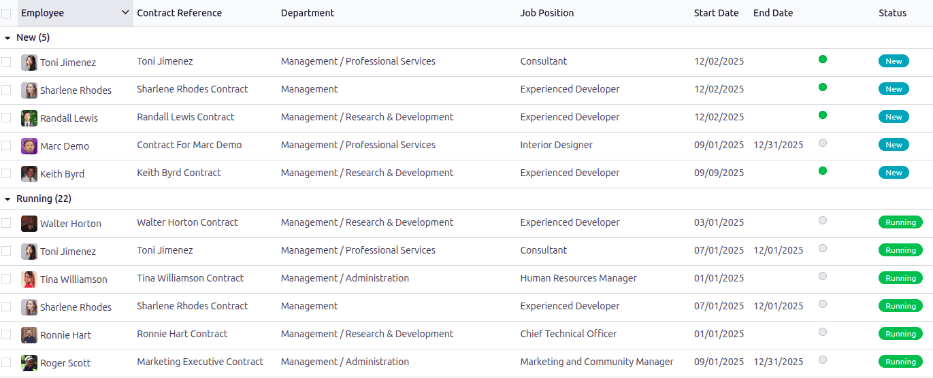

=========
Contracts
=========

Every employee in Odoo is required to have a contract in order to be paid. A contract outlines the
terms of an employee's position, their compensation, working hours, and any other details about
their position.

.. important::
   Contract documents (PDFs) are uploaded and organized using the *Documents* application, and are
   signed using the *Sign* application. Ensure these applications are installed to send and sign
   contracts. Please refer to the :doc:`../../productivity/documents` and
   :doc:`../../productivity/sign` documentation.

To view the employee contracts, go to the :menuselection:`Payroll app --> Contracts --> Contracts`
from the top menu. All employee contracts, and their current contract status, are displayed in a
Kanban view, by default. The Kanban view displays running contracts, contracts that require action,
expired contracts, and cancelled contracts.

.. note::
   The list of contracts in the *Payroll* application matches the list of contracts in the
   *Employees* application.

.. _payroll/new-contract:

In order for an employee to be paid, an active contract is required. If a new contract is needed,
click the :guilabel:`Create` button on the :guilabel:`Contracts` dashboard. A contract form appears
where the information can be entered. Required fields are underlined in bold.

New contract form
-----------------

.. _payroll/gen-info:

General information section
---------------------------

- :guilabel:`Contact Reference`: type in the name or title for the contract, such as `John Smith
  Contract`. This field is **required**.
- :guilabel:`Employee`: using the drop-down menu, select the employee that the contract applies to.
- :guilabel:`Contract Start Date`: the date the contract starts. To choose a date, click the
  drop-down menu, navigate to the correct month and year with the :guilabel:`< > (arrow)` icons,
  then click on the desired date. This field is **required**.
- :guilabel:`Contract End Date`: if the contract has a specific end date, click the drop-down menu,
  navigate to the correct month and year with the :guilabel:`< > (arrow)` icons, then click on the
  desired date.
- :guilabel:`Working Schedule`: select one of the working schedules from the drop-down menu. This
  field is **required**.

  .. tip::
     The :guilabel:`Working Schedule` drop-down menu displays all the working schedules for the
     selected company. To modify or add to this list, go to :menuselection:`Payroll app -->
     Configuration --> Working Schedules`. Click :guilabel:`New`, and create a new working schedule,
     or click on an existing working schedule and make edits.

- :guilabel:`Work Entry Source`: select how the :doc:`work entries <work_entries>` are generated.
  This field is **required**. Click the radio button next to the desired selection. The options are:

  - :guilabel:`Working Schedule`: work entries are generated based on the selected
    :guilabel:`Working Schedule`.
  - :guilabel:`Attendances`: work entries are generated based on the employee's check-in records in
    the *Attendances* application. (This requires the *Attendances* application).
  - :guilabel:`Planning`: work entries are generated based on the planned schedule for the employee
    from the *Planning* application. (This requires the *Planning* application).

- :guilabel:`Salary Structure Type`: select one of the salary structure types from the drop-down
  menu. The default salary structure types are :guilabel:`Employee` or :guilabel:`Worker`. A
  :ref:`new salary structure type <payroll/new-structure-type>` can be created, if needed.
- :guilabel:`Department`: select the department the contract applies to from the drop-down menu.
- :guilabel:`Job Position`: select the specific job position the contract applies to from the
  drop-down menu.

  .. note::
     If the selected :guilabel:`Job Position` has a contract template linked to it with a specific
     :guilabel:`Salary Structure Type`, the :guilabel:`Salary Structure Type` changes to the one
     associated with that :guilabel:`Job Position`.

- :guilabel:`Wage on Payroll`: enter the employee's monthly wage.
- :guilabel:`Contract Type`: choose either :guilabel:`Permanent`, :guilabel:`Temporary`,
  :guilabel:`Seasonal`, :guilabel:`Full-Time`, or :guilabel:`Part-Time` from the drop-down menu.

.. figure:: contracts/required-fields.png
   :align: center
   :alt: New contract form to be filled in when creating a new contract, with required fields
         outlined in red.

- :guilabel:`Contact Reference`: type in the name or title for the contract, such as `John Smith
  Contract`. This field is **required**.
- :guilabel:`Employee`: name of the employee the contract applies to.
- :guilabel:`Contract Start Date`: the date the contract starts. Choose a date by clicking on the
  drop-down menu, navigating to the correct month and year by using the :icon:`fa-chevron-left`
  :icon:`fa-chevron-right` :guilabel:`(arrow)` icons, then clicking on the desired date. This field
  is **required**.
- :guilabel:`Contract End Date`: the date the contract ends. Choose a date by clicking on the
  drop-down menu, navigating to the correct month and year by using the :icon:`fa-chevron-left`
  :icon:`fa-chevron-right` :guilabel:`(arrow)` icons, then clicking on the desired date. This field
  is **required**.
- :guilabel:`Salary Structure Type`: select one of the salary structure types from the drop-down
  menu. The default salary structure types are :guilabel:`Employee` or :guilabel:`Worker`. A new
  salary structure type can be created by typing the name in the field. This field is **required**.
- :guilabel:`Working Schedule`: select one of the working schedules from the drop-down menu. This
  field is **required**.
- :guilabel:`Department`: the department the contract applies to.
- :guilabel:`Job Position`: the specific job position the contract applies to.
- :guilabel:`Wage on Payroll`: the amount to be paid to the employee each month.
- :guilabel:`Contract Type`: choose from :guilabel:`CDI`, :guilabel:`CDD`, or :guilabel:`PFI` from
  the drop-down menu.

  - :guilabel:`CDI` is an open-ended contract with only a start date, but no end date.
  - :guilabel:`CDD` is a contract with both a start date and an end date.
  - :guilabel:`PFI` is a Belgian-specific contract used when hiring employees that need training,
    and covers the training period specifically.

- :guilabel:`HR Responsible`: if there is a specific person in HR that is responsible for the
  contract, select the person from the drop-down menu. This field is required.

.. tip::
   The :guilabel:`Working Schedule` drop-down menu displays all the working times for the selected
   :guilabel:`Company`. To modify or add to this list, go to :menuselection:`Payroll app -->
   Configuration --> Working Times`, and either :guilabel:`Create` a new working time, or click on
   an existing working time, then edit it by clicking :guilabel:`Edit`.

- :guilabel:`Yearly Cost (Real)`: this field automatically updates after the :guilabel:`Schedule
  Pay` and :guilabel:`Wage` fields are entered. This amount is the total yearly cost for the
  employer. This field can be modified. However, if this is modified, the :guilabel:`Wage` field
  updates, accordingly. Ensure both the :guilabel:`Wage` and :guilabel:`Yearly Cost (Real)` are
  correct if this field is modified.
- :guilabel:`Monthly Cost (Real)`: this field automatically updates after the :guilabel:`Schedule
  Pay` and :guilabel:`Wage` fields are entered. This amount is the total monthly cost for the
  employer. This field **cannot** be modified, and is calculated based on the :guilabel:`Yearly
  Cost (Real)`.

  .. image:: contracts/salary-info.png
     :align: center
     :alt: Optional tabs for a new contract.

Contract Details tab
--------------------

The :guilabel:`Contract Details` tab allows for the addition and editing of a contract, along with
specifying which template to use when a new contract is created. These fields **must** be populated
in order to create a new contract.

.. important::
   To access the various contract template fields in the :guilabel:`Contract Details` tab, the
   *Salary Configurator* (`hr_contract_salary`) module **must** be :ref:`installed
   <general/install>`.

   When the *Salary Configurator* module is installed, the *Salary Configurator - Holidays* and
   *Salary Configurator - Payroll* modules install, as well.

   Once the modules are installed, the database reverts to the main dashboard.

- :guilabel:`Contract Template`: select a pre-existing contract template from the drop-down menu.
  Contract templates are typically created through the configuration menu, and stored in the
  *Documents* application.

Sign section
~~~~~~~~~~~~

- :guilabel:`HR Responsible`: select the person who is responsible for validating the contract from
  the drop-down menu. This field is required.
- :guilabel:`New Contract Document Template`: select a contract from the drop-down menu to be
  modified for this new employee contract. These documents are stored in the *Sign* application.
- :guilabel:`Contract Update Document Template`: select a contract from the drop-down menu, if the
  employee has an existing contract that requires updating. These documents are stored in the *Sign*
  application.

.. important::
   The :guilabel:`HR Responsible`, :guilabel:`New Contract Document Template`, and
   :guilabel:`Contract Update Document Template` fields are only visible if the *Sign* application
   is installed, along with the `hr_contract_salary` and `hr_contract_salary_payroll` :doc:`modules
   <../../general/apps_modules>`. The *Sign* application is where the contract templates are stored.
   This application is required for an employee to sign any contract.

Accounting section
~~~~~~~~~~~~~~~~~~

- :guilabel:`Analytic Account`: select the account the contract affects from the drop-down menu. It
  is recommended to check with the accounting department to ensure the correct account is selected.

Part Time section
~~~~~~~~~~~~~~~~~

- :guilabel:`Part Time`: tick this box if the employee is working part-time. When active, additional
  fields appear:

  - :guilabel:`% (Percentage)`: enter the percent of time the employee works as compared to a
    full-time employee.
  - :guilabel:`Standard Calendar`: select the working hours that a typical full-time worker uses
    from the drop-down menu.
  - :guilabel:`Part Time Work Entry Type`: select the work entry type that generates the balance of
    a full-time working schedule.

    .. example::
       If a full-time employee works 40 hours a week, and the employee works 20, enter `50` in the
       :guilabel:`% (Percentage)` field (50% of 40 hours = 20 hours). The employee generates twenty
       (20) hours of work entries under the work entry type `part-time`, and another twenty (20)
       hours of work entries under the work entry type `generic time off`, for a total of forty (40)
       hours worth of work entries.

Notes section
~~~~~~~~~~~~~

- :guilabel:`Notes`: a text field where any notes for the employee contract are entered for future
  reference.

.. image:: contracts/contract-details.png
   :align: center
   :alt: Contract details in optional tabs for a new contract.

- :guilabel:`Analytic Account`: this field allows a link between the contract and a specific
  analytic account for accounting purposes.
- :guilabel:`Contract Template`: select a pre-existing contract template from the drop-down menu.
  Contract templates are typically created through the *Recruitment* application.
- :guilabel:`New Contract Document Template`: select a contract from the drop-down menu to be
  modified for this new employee contract.
- :guilabel:`Contract Update Document Template`: select a contract from the drop-down menu, if the
  employee has an existing contract that requires updating.
- :guilabel:`Notes`: the notes field is a text field where any notes for the employee contract can
  be entered for future reference.

Modify a contract template
~~~~~~~~~~~~~~~~~~~~~~~~~~

Click the :icon:`fa-external-link` :guilabel:`(external Link)` icon at the end of either the
:guilabel:`New Contract Document Template` or :guilabel:`Contract Update Document Template` to open
the corresponding contract template, and proceed to make any desired changes.

Click the :guilabel:`Upload your file` button next to the corresponding document, navigate to the
file, then click :guilabel:`Open` to select the document and add it to the tab.

Modifying contract templates
============================

Contracts templates can be modified at any point when changes are needed.

- :guilabel:`Tags`: select any tags associated with the contract.
- :guilabel:`Signed Document Workspace`: this is where the signatures are stored. Choose a
  pre-configured workspace, or create a new one. To create a new :guilabel:`Signed Document
  Workspace`, type in the name of the workspace, then click either :guilabel:`Create` to add the new
  workspace, or :guilabel:`Create and Edit` to add the workspace and modify the workspace details.
- :guilabel:`Signed Document Tags`: select or create any tags that are only associated with the
  signed contract, as opposed to the original unsigned contract.
- :guilabel:`Redirect Link`: enter a redirect link for the employee to access the contract. A
  redirect link takes the user from one URL to another. In this case, it takes them to the
  newly-updated contract specifically written for them.
- :guilabel:`Who can Sign`: select either :guilabel:`All Users` or :guilabel:`On Invitation`.

  - :guilabel:`All Users`: any user in the organization can sign the contract.
  - :guilabel:`On Invitation`: only users selected in this field can sign the contract.

- :guilabel:`Invited Users`: select the person (or people) that can sign the document.
- :guilabel:`Document`: the attached document can be replaced by clicking the :icon:`fa-pencil`
  :guilabel:`(pencil)` icon. A pop-up window appears, so another document can be selected for
  upload. The file **must** be a PDF. To remove the document, click the :icon:`fa-trash-o`
  :guilabel:`(trash can)` icon.

Once the edits are complete, click the :guilabel:`Save` button. All the information for the selected
contract template populates the fields in the :guilabel:`Salary Information` tab. Any additional
tabs, such as :guilabel:`Personal Documents`, appears if applicable.

Salary information
------------------

.. image:: contracts/salary-info.png
   :align: center
   :alt: Optional tabs for a new contract.

This section is where the specific salary details are defined. This section is country-specific, so
these fields vary, depending on where the company is located.

Enter the amount in the various fields, or tick a checkbox to apply a benefit. Some options that can
be entered here include :guilabel:`Group Insurance Sacrifice Rate` and :guilabel:`Canteen Cost`, for
example.

Some fields may be automatically filled in as other fields are entered. For example, the
:guilabel:`Yearly Cost (Real)` and :guilabel:`Monthly Cost (Real)` updates once the :guilabel:`Wage`
is populated.

Personal documents
------------------

This tab **only** appears after an :guilabel:`Employee` is selected, and houses any documents that
are linked to the employee on their employee record. Documents cannot be added to this tab, this tab
**only** shows documents that are already uploaded and associated with the employee.

The available documents in this tab can be downloaded. Click the :icon:`fa-download`
:guilabel:`(download)` icon next to the document to download it.

Save and send the contract
--------------------------

Once a contract has been created and/or modified, save the contract by clicking the :guilabel:`Save`
button. Next, the contract must be sent to the employee to be signed.

Click on one of the following buttons to send the contract to the employee:

.. image:: contracts/send-contract.png
   :align: center
   :alt: Send the contract to the employee via one of the buttons.

- :guilabel:`Generate Simulation Link`: this option is **only** for Belgian companies. Clicking this
  opens a pop-up window that contains the basic information from the contract, as well as a link for
  the contract when using the salary configurator. Click :guilabel:`Send` to send an email to the
  employee, so they can sign the contract.

At the bottom of the pop-up form is a :guilabel:`Link Expiration Date`. This is the timeframe that
the contract offer is valid for. By default, this field is pre-populated with `30 days`, but it can
be modified.

  .. note::
     In order to send a contract using the :guilabel:`Generate Simulation Link`, there **must** be a
     signature field in the contract PDF being sent to the employee, so they can sign it.

- :guilabel:`Signature Request`: clicking this reveals a pop-up window, where an email can be typed
  to the employee. Select the document (such as a contract, NDA, or Homeworking Policy) from the
  drop-down menu, and fill out the email section. Click :guilabel:`Send` when the email is ready to
  be sent.

.. note::
   To send a contract using the :guilabel:`Generate Simulation Link`, there **must** be a signature
   field in the contract PDF being sent to the employee, so they can sign it.

Salary attachments
------------------

Any automatic deductions or allocations for an employee, such as child support payments and wage
garnishments, are referred to as a *salary attachment*. This section is where all of these
deductions or allocations are set.

To add a new deduction, first navigate to :menuselection:`Payroll app --> Contracts --> Salary
Attachments`. Next, click :guilabel:`Create`, and a new salary attachment form loads.

.. image:: contracts/garnishment.png
   :align: center
   :alt: The salary attachment form with everything filled in for Ronnie Hart's child support.

Fill out the following fields on the form:

- :guilabel:`Employee`: using the drop-down menu, select the employee the salary attachment applies
  to.
- :guilabel:`Description`: enter a short description for the salary attachment, such as `Child
  Support` or `529 Contribution`.
- :guilabel:`Type`: using the drop-down menu, select the type of salary attachment being created.
  Choose from:

  - :guilabel:`Attachment of Salary`: any payments taken out towards something that is *not* child
    support. Typically any garnishments, such as lawsuit payments, payments toward taxes owed, etc.
  - :guilabel:`Assignment of Salary`: any deduction that is not required, but voluntary, such as a
    pre-tax allocation to a college savings account.
  - :guilabel:`Child Support`: any payments taken out specifically for child support.

- :guilabel:`Start Date`: the date the salary attachment starts. Choose a date by clicking on the
  drop-down menu, navigating to the correct month and year by using the :icon:`fa-chevron-left`
  :icon:`fa-chevron-right` :guilabel:`(arrow)` icons, then clicking on the desired date. This field
  is **required**.
- :guilabel:`Estimated End Date`: this field automatically populates after both the
  :guilabel:`Monthly Amount` and :guilabel:`Total Amount` fields are populated. This field is
  **not** modifiable.
- :guilabel:`Document`: attach any documents relevant to the salary attachment. Click the
  :guilabel:`Upload Your File` button, navigate to the desired document in the file explorer, then
  click :guilabel:`Open` to select the document, and attach it to the form. To change the attached
  document, click the :icon:`fa-pencil` :guilabel:`(pencil)` icon, and select a different document.
  To remove a document, click the :icon:`fa-trash-o` :guilabel:`(trash can)` icon.
- :guilabel:`Monthly Amount`: enter the amount to be taken out of the employee's paycheck every
  month for this specific salary attachment.
- :guilabel:`Total Amount`: enter the total amount that the employee pays for the salary attachment
  to be completed.
