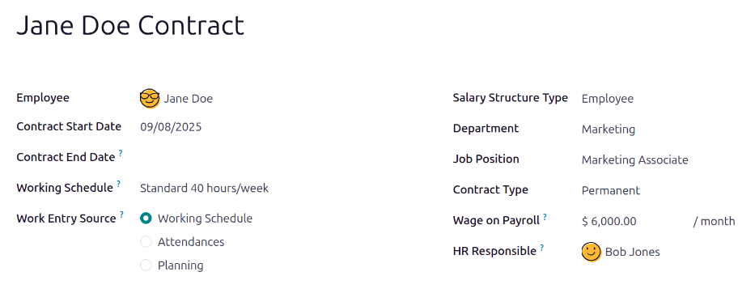

=========
Contracts
=========

Every employee in Odoo is required to have a contract in order to be paid. A contract outlines the
terms of an employee's position, their compensation, their working hours, and any other details
about their position.

.. important::
   Contract documents (PDFs) are uploaded and organized using the *Documents* application, and are
   signed using the *Sign* application. Ensure these applications are installed in order to send and
   sign contracts. Please refer to the :doc:`/applications/finance/documents` and
   :doc:`/applications/finance/sign` documentation.

To view the employee contracts, go to the :menuselection:`Payroll app --> Employees --> Contracts`
from the top menu. All employee contracts, and their current contract status, are displayed in a
default kanban view. The default view displays both running contracts and contracts that need
action. Expired and canceled contracts are hidden in the default view.

.. image:: contracts/contracts-overview.png
   :align: center
   :alt: Contracts dashboard view showing running contracts and contracts with issues.

.. note::
   The list of contracts in the *Payroll* application matches the list of contracts in the
   *Employees* application. The default contracts view in the *Payroll* application displays running
   contracts and contracts needing attention, while the default contracts view in the *Employees*
   application displays all contracts in a kanban view, organized by their stage, regardless of
   status. All contracts can be viewed by changing the filters.

Create a new contract
=====================

In order for an employee to be paid, an active contract is required. If a new contract is needed,
click the :guilabel:`Create` button on the contracts dashboard. A contract form appears where the
information can be entered. Required fields are underlined in bold.

Required fields
---------------

- :guilabel:`Contact Reference`: Type in the name or title for the contract, such as `John Smith
  Contract`.
- :guilabel:`Company`: Select the company the contract applies to by clicking on the drop-down menu.
  A new company can be created by typing the name in the field, then clicking either
  :guilabel:`Create` to create the new company, or :guilabel:`Create and Edit` to create the new
  company and edit the company details.
- :guilabel:`Salary Structure Type`: Select one of the salary structure types from the drop-down
  menu. The default salary structure types are :guilabel:`Employee` or :guilabel:`Worker`. A new
  salary structure type can be created by typing the name in the field.
- :guilabel:`Start Date`: The date the contract starts. Choose a date by clicking on the drop-down
  menu, navigating to the correct month and year by using the :guilabel:`< > (arrow)` icons, then
  clicking on the :guilabel:`date`.
- :guilabel:`Working Schedule`: Select one of the working schedules from the drop-down menu.

.. tip::
   The :guilabel:`Working Schedule` drop-down menu displays all the working times for the selected
   :guilabel:`Company`. To modify or add to this list, go to :menuselection:`Payroll -->
   Configuration --> Working Times` and either :guilabel:`Create` a new working time or click on an
   existing working time and edit it by clicking :guilabel:`Edit`.

Optional fields
---------------

- :guilabel:`Employee`: Name of the employee that the contract applies to.
- :guilabel:`Department`: The department the contract applies to.
- :guilabel:`Job Position`: The specific job position the contract applies to.
- :guilabel:`Contract Type`: Choose from :guilabel:`CDI`, :guilabel:`CDD`, or :guilabel:`PFI` from
  the drop-down menu.

  - :guilabel:`CDI` is an open-ended contract with only a start date but no end date.
  - :guilabel:`CDD` is a contract with both a start date and an end date.
  - :guilabel:`PFI` is a Belgian-specific contract used when hiring employees that need training,
    and covers the training period specifically.

- :guilabel:`End Date`: If the contract has a specific end date, click the drop-down menu, navigate
  to the correct month and year using the arrow icons, then click on the date.
- :guilabel:`HR Responsible`: If there is a specific person in HR that is responsible for the
  contract, select the person from the drop-down menu.
- :guilabel:`Analytic Account`: This field allows a link between the contract and a specific
  analytic account for accounting purposes.

Contract details
----------------

The contract details section allows for the addition and editing of a contract, and the ability to
send the contract to the employee for approval and signatures.

.. image:: contracts/contract-details.png
   :align: center
   :alt: Contract details in optional tabs for a new contract.

- :guilabel:`Contract Template`: Select a pre-existing contract template from the drop-down menu.
  Contract templates are typically created through the *Recruitment* application.
- :guilabel:`New Contract Document Template`: Select a contract from the drop-down menu to be
  modified for this new employee contract.
- :guilabel:`Contract Update Document Template`: Select a contract from the drop-down menu if the
  employee has an existing contract that requires updating.
- :guilabel:`Notes`: The notes field is a text field where any notes for the employee contract can
  be entered for future reference.

Modifying a contract
~~~~~~~~~~~~~~~~~~~~

Click the :guilabel:`External Link` button at the end of each line to open the corresponding
contract template and make any changes.

.. image:: contracts/external-link.png
   :align: center
   :alt: Contract details in optional tabs for a new contract.

A pop-up window appears with all the contract details. Modify the fields for the contract as needed.

.. image:: contracts/modify-contract.png
   :align: center
   :alt: Edit the details for the contract.

- :guilabel:`Tags`: Select any tags associated with the contract.
- :guilabel:`Signed Document Workspace`: This is where the signatures are stored. Choose a
  pre-configured workspace or create a new one.
- :guilabel:`Signed Document Tags`: Select or create any tags associated only with the signed
  contract as opposed to the original unsigned contract.
- :guilabel:`Redirect Link`: Enter a redirect link for the employee to access the contract. A
  redirect link takes the user from one URL to another, in this case, to the newly updated contract
  specifically written for them.
- :guilabel:`Who can Sign`: Select either :guilabel:`All Users` or :guilabel:`On Invitation`.

  - :guilabel:`All Users`: Any user in the organization can sign the contract.
  - :guilabel:`On Invitation`: Only users selected in this field can sign the contract.

- :guilabel:`Invited Users`: Select the person(s) that can sign the document.
- :guilabel:`Document`: The attached document can be replaced by clicking the :guilabel:`✏️
  (pencil)` icon. A pop-up window appears so another document can be selected for upload. The file
  must be a PDF. To remove the document, click the :guilabel:`🗑️ (trash can)` icon.

Once the edits are complete, click the :guilabel:`Save` button. All the information for the selected
contract template populates the fields in the :guilabel:`Salary Information` tab. Any additional
tabs, such as :guilabel:`Personal Documents`, appears if applicable.

Salary information
------------------

.. image:: contracts/salary-info.png
   :align: center
   :alt: Optional tabs for a new contract.

This section is where the specific salary details are defined. This section is country-specific, so
depending on where the company is located, these fields may vary.

Enter the amount in the various fields, or check a box to apply a benefit. Some options that can be
entered here include :guilabel:`Meal Vouchers`, :guilabel:`Fuel Card`, :guilabel:`Internet`,
:guilabel:`Paid Time Off`, etc.

Some fields may be automatically filled in based off of the contracts selected in the
:guilabel:`Contract Details` tab.

Attachment of salary
--------------------

Any automatic deductions or allocations for an employee, such as child support payments and wage
garnishments, are referred to as a *salary attachment*. This section is where all of these
deductions or allocations are set.

To add a new deduction, click :guilabel:`Add a line`. Type in a description for the allocation under
:guilabel:`Description`.

.. image:: contracts/garnishment.png
   :align: center
   :alt: Enter a new line for each type of garnishment.

Select the :guilabel:`Garnished Type` from the drop-down menu. Choose from:

- :guilabel:`Attachment of Salary`: Any payments taken out towards something that is *not* child
  support. Typically any garnishments such as lawsuit payments, payments toward taxes owed, etc.
- :guilabel:`Assignment of Salary`: Any deduction that is not required but voluntary, such as a
  pre-tax allocation to a college savings account.
- :guilabel:`Child Support`: Any payments taken out specifically for child support.

Enter the start and end dates the entry applies to. Click on the drop-down menu under
:guilabel:`From` and :guilabel:`To`, navigate to the correct month and year by using the
:guilabel:`< > (arrow)` icons, then click on the :guilabel:`date`.

Last, enter the :guilabel:`Amount` that each payslip pays towards the entry.

To delete a line, click the :guilabel:`🗑️ (trash can)` icon at the end of the line.

Save and send the contract
--------------------------

Once a contract has been created and/or modified, save the contract by clicking the :guilabel:`Save`
button. Next, the contract must be sent to the employee to be signed.

Click on one of the following buttons to send the contract to the employee:

.. image:: contracts/send-contract.png
   :align: center
   :alt: Send the contract to the employee via one of the buttons.

- :guilabel:`Generate Simulation Link`: This option is for Belgian companies only. Clicking this
  opens a pop-up window that contains the basic information from the contract as well as a link for
  the contract when using the salary configurator. Click :guilabel:`Send Offer` to send an email to
  the employee so they can sign the contract.

  .. image:: contracts/simulation.png
     :align: center
     :alt: Sends a link to the employee for the contract.

  .. note::
     In order to send a contract using the :guilabel:`Generate Simulation Link`, there must be a
     signature field in the contract PDF being sent to the employee so they can sign it.

- :guilabel:`Signature Request`: Click this and a pop-up window appears where an email can be typed
  to the employee. Select the document, such as a contract, NDA, or Homeworking Policy, from the
  drop-down menu, and fill out the email section. Click :guilabel:`Send` when the email is ready to
  be sent.

  .. image:: contracts/sign-contract.png
     :align: center
     :alt: Request a signature for the contract via email.

- :guilabel:`Credit Time`: This option is for Belgian companies only. When clicked, a pop-up window
  appears that allows for the changing of working times, and can compute time off.
