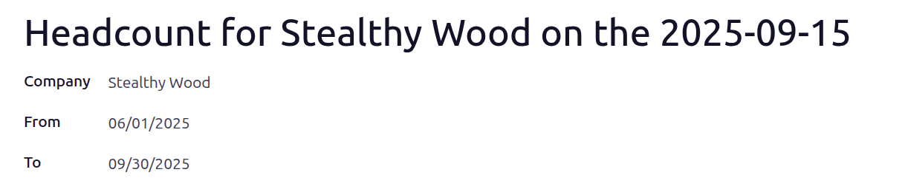

================
Headcount report
================

The *Headcount report* in the **Payroll** app shows the number of employees on payroll and allows
headcount comparisons between different periods of time.

Create a headcount report
=========================

Create a headcount report to see the number of employees at a specific time or compare headcounts
across periods.

To create a headcount report, navigate to :menuselection:`Payroll app --> Reporting --> Headcount`
and click :guilabel:`New`.

- Report name: generated automatically as `Headcount for (Company Name) on the (YYYY-MM-DD)` and
  **cannot** be modified.
- :guilabel:`Company`: populated automatically (works in both single and multi-company databases)
- :guilabel:`From`/:guilabel:`To` dates: defaults to current date (from) and blank (to). Adjust
  these to define the period to analyze.

Next, click :guilabel:`Populate` to generate the report.

At the top of the form, a :icon:`fa-people` :guilabel:`Employees` smart button appears. Clicking the
button displays the total number of employees for the selected period.

View all headcount reports
==========================

See how the company headcount has changed over time by viewing all headcount reports in a list view.

To view all headcount reports, navigate to :menuselection:`Payroll app --> Reporting --> Headcount`.

View employees in a headcount
-----------------------------

TO get an overall view of employees and their salary impact on the company, view all employee
records of a specific headcount report.

To view the employees of a specific headcount report, click the :icon:`fa-people`
:guilabel:`Employees` smart button at the top of a headcount report.

All employees from the headcount appear in a list view, grouped by :guilabel:`Department`.

-  :guilabel:`Employee`: the employee's full name
-  :guilabel:`Department`: the department their job position is in
-  :guilabel:`Job Title`: their role
-  :guilabel:`Employer Cost`: how much the company pays the employee each pay-period
- :guilabel:`Wage on Payroll`: the dollar amount on payroll reports
