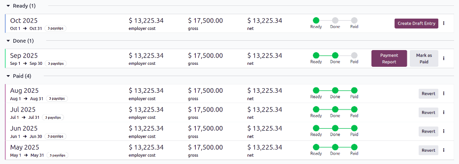
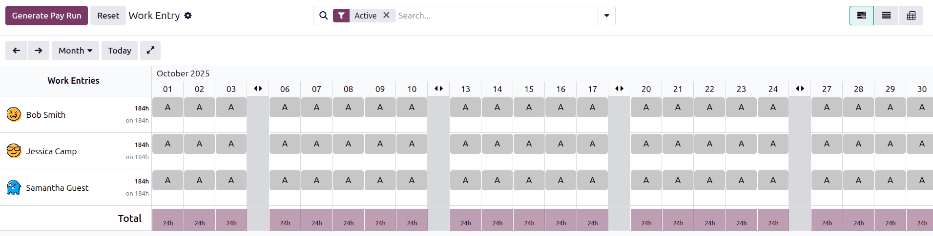
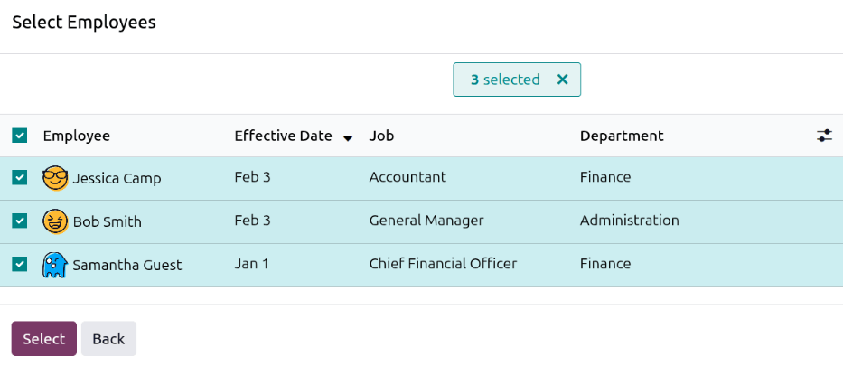

========
Pay runs
========

*Pay runs* are used to generate multiple :doc:`payslips <payslips>` at once and process them in a
group, rather than create and process individual payslips. This method not only helps the payroll
department pay employees in less time, but it also helps keep payslips organized.

Typically, a company's payroll department :ref:`creates a new pay run <payroll/new-pay-run>` for
each salary structure, for every pay period (usually weekly, bi-weekly, or monthly). If desired, pay
runs can be further organized by department, job position, etc.

Once a pay run is made, :ref:`payslips are added to the pay run <payroll/add-payslips>`, then the
pay run is processed, and employees are paid.

View pay runs
=============

To view all the pay runs in the database, navigate to :menuselection:`Payroll app --> Payslips -->
Pay Runs` to display all payslip pay runs that have been created. These payslip pay runs are
displayed in a list view, grouped by :icon:`oi-group` :guilabel:`Status` (either :guilabel:`Ready`,
:guilabel:`Done`, or :guilabel:`Paid`), by default.

Each pay run displays the name, the dates it includes, the number of payslips, and the total
:guilabel:`employer cost`, :guilabel:`gross`, and :guilabel:`net` amounts for all payslips.

.. _payroll/new-pay-run:

Create a new pay run
====================

New pay runs can be created from the :ref:`Work Entry <payroll/work-entry-pay-run>`, :ref:`Employee
Payslips <payroll/payslips-pay-run>`, or :ref:`Pay Runs <payroll/pay-runs-pay-run>` dashboards.

.. _payroll/work-entry-pay-run:

Work entry dashboard
--------------------

To create a pay run from the work entry dashboard, navigate to :menuselection:`Payroll app --> Work
Entries --> Work Entries`. The current time period is displayed, with the current day highlighted in
yellow.

All employees appear in a default Gantt view, with all work entries displayed. If necessary,
navigate to the desired time period.

Once all :ref:`missing work entries are added <payroll/new-work-entry>` and all :ref:`conflicts are
resolved <payroll/conflicts>`, click the :guilabel:`Generate Pay Run` button. The pay run is created
for all employees, with a status of :guilabel:`Ready`.

.. _payroll/payslips-pay-run:

Employee payslips dashboard
---------------------------

To create a pay run from the payslips dashboard, navigate to :menuselection:`Payroll app -->
Payslips --> Payslips`. All payslips for all employees are displayed in a default list view, in
chronological order.

.. _payroll/new-pay-run-pop-up:

Click the :guilabel:`Pay Run` button and a :guilabel:`New Pay Run` pop-up window loads. Select the
:guilabel:`Salary Structure` using the drop-down menu. If no :guilabel:`Salary Structure` is
selected, the pay run applies to *all* salary structures. Next, select the :guilabel:`Pay Schedule`,
which is *how often* employees are paid. The default options are :guilabel:`year`,
:guilabel:`half-year`, :guilabel:`quarter`, :guilabel:`2 months`, :guilabel:`month`,
:guilabel:`half-month`, :guilabel:`2 weeks`, :guilabel:`week`, or :guilabel:`day`.

Last, using the calendar selector, set the first day the pay run covers in the first blank
:guilabel:`Period` field. The second field is automatically populated based on the selection in the
:guilabel:`Pay Schedule` field.

.. example::
   A company pays its employees every month. To configure the pay run for November, the
   :guilabel:`Pay Schedule` is set to :guilabel:`month`, and the first :guilabel:`Period` field is
   set to `Nov 1`. Once entered, the second field is automatically populated with `Nov 30`.

   .. image:: pay_runs/new-pay-run.png
      :alt: A monthly pay run configured for November.

When the :guilabel:`New Pay Run` pop-up window is configured, click :guilabel:`Continue`, and the
pop-up window changes to a :guilabel:`Select Employees` window. All employees who match the
parameters set in the :guilabel:`New Pay Run` pop-up window appear in the list. Select the desired
employees to add to the pay run, or click the box next to :guilabel:`Employees` to select *all*
employees in the list.

Once all desired employees are selected, click :guilabel:`Select`. The pop-up window closes, and the
pay run appears on the screen.

.. _payroll/pay-runs-pay-run:

Pay runs dashboard
------------------

To create a pay run from the pay runs dashboard, navigate to :menuselection:`Payroll app -->
Payslips --> Pay Runs`. Click the :guilabel:`New` button and a :guilabel:`New Pay Run` pop-up window
loads.

 Follow the same directions as if creating a :ref:`pay run form the payslips dashboard
 <payroll/new-pay-run-pop-up>`.

.. _payroll/add-payslips:

Add a payslips to a pay run
===========================

Once a :ref:`pay run has been created <payroll/new-pay-run>`, payslips are added as part of the pay
run creation. If needed, additional payslips can be created individually, and added to a pay run
after it has been created.

To add a new payslip, navigate to :menuselection:`Payroll app --> Payslips --> Payslips`. Click the
:guilabel:`New Off-Cycle` button and a blank :guilabel:`Employee Payslips` form loads.
:ref:`Configure the payslip form <payroll/new-payslip>`, and ensure the :guilabel:`Pay Run` field is
populated.

Once the form is configured, click :guilabel:`Compute Sheet` to calculate the payslip and add it to
the selected pay run.

.. _payroll/pay-run-process:

Process a pay run
=================

After a :ref:`pay run has been created <payroll/new-pay-run>`, and :ref:`all required payslips have
been added <payroll/add-payslips>`, the pay run must then be processed, and employees paid.

Open the desired pay run by navigating to :menuselection:`Payroll app --> Payslips --> Pay Runs`,
and clicking on the desired pay run.

For a pay run to be processed, it must have a status of :guilabel:`Ready`. That means the pay run
has been created and payslips have been added, but the payslips have *not* been processed.

Click the :guilabel:`Create Draft Entry` button, then click :guilabel:`OK` in the
:guilabel:`Confirmation` pop-up window to confirm and create a draft of all the individual payslips
in the pay run. After this occurs, the pay run status changes to :guilabel:`Done`, and moves to the
corresponding grouping on the :guilabel:`Pay Runs` dashboard.

.. tip::
   At any time, the pay run needs to be reverted back to a status of :guilabel:`Ready`, click the
   :guilabel:`Revert` button. This action does **not** remove any payslips that have already been
   added to the pay run, instead, the status changes back to :guilabel:`Ready`.

   After any desired changes have been made, click :guilabel:`Create Draft Entry` and the pay run
   status changes to :guilabel:`Done`.

   It is important to note, that if any payslips in the pay run have a status of :guilabel:`Paid`,
   the pay run **cannot** revert to a status of :guilabel:`Ready`.

Once the status has changed to :guilabel:`Done`, the payments must be logged in the database. Click
the :guilabel:`Payment Report` button, and a pop-up window loads, where the payment report details
are entered.

Using the drop-down menu, select the :guilabel:`Export Format` for the payment report. The universal
option is :guilabel:`CSV`, while all other available options depend on the installed :doc:`payroll
localization <payroll_localizations>`.

Next, select the :guilabel:`Payment Date` using the calendar selector. This is the date the
paychecks are issued.

Some :doc:`payroll localizations <payroll_localizations>` cause a :guilabel:`Bank Journal` field to
also appear. If visible, select the journal the payslips are logged on, using the drop-down menu.

Once the pop-up window is configured, click the :guilabel:`Generate` button. The :guilabel:`Payment
Report` button changes to a :icon:`fa-download` :guilabel:`Download (filetype)` button. To save a
copy of the payment report, click the :icon:`fa-download` :guilabel:`Download (filetype)` button,
select the location for the file, then click :guilabel:`Save`.

.. note::
   If the screen is enlarged beyond a certain amount, the :icon:`fa-download` :guilabel:`Download
   (filetype)` button is hidden from view. In this scenario, click the :icon:`fa-ellipsis-v`
   :guilabel:`(vertical ellipsis)` icon to view and select the :icon:`fa-download`
   :guilabel:`Download (filetype)` option.

After the report is created, click the :guilabel:`Mark as paid` button to mark the payslips as paid
in the database.

.. tip::
   Odoo automatically creates the name of the pay run according to the various selections made when
   creating the pay run (salary structure, pay schedule, etc). In some situations, a company may
   want to rename the pay runs, for better organization and a clearer understanding of what pay
   slips are part of each pay run.

   For example, a company pays its employees monthly, for both hourly and salaried employees.

   The names for their four August 2025 pay runs are:

   - `Aug 1-14 2025 - Hourly`
   - `Aug 1-14 2025 - Salary`
   - `Aug 15-31 2025 - Hourly`
   - `Aug 15-31 2025 - Salary`
