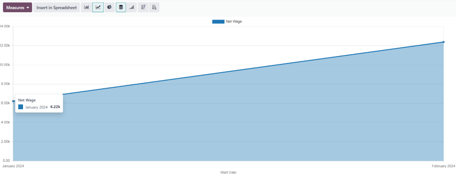
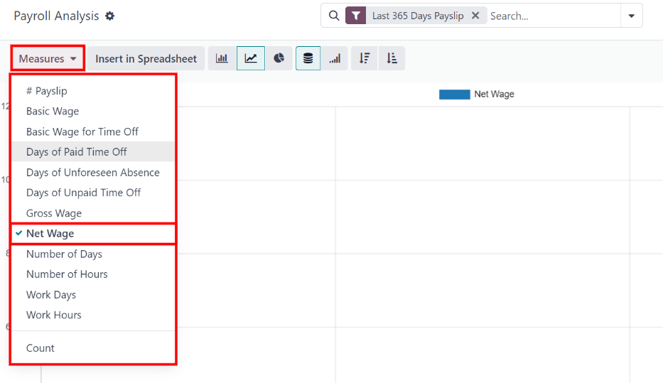
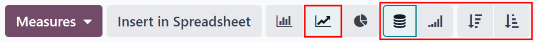
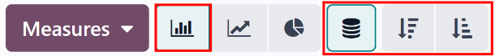
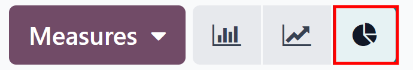
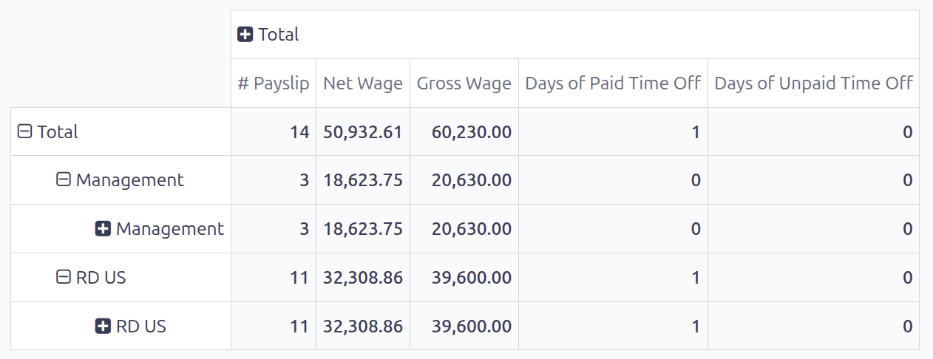
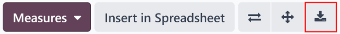
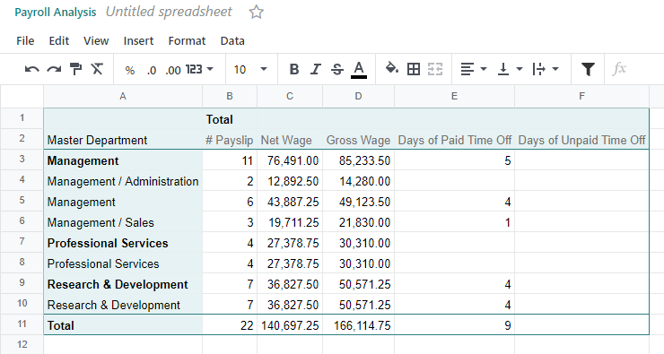

================
Payroll analysis
================

Click on :menuselection:`Payroll app --> Reporting --> Payroll` to display the :guilabel:`Payroll
Analysis` report. This report shows all the payslips generated in the last 365 days, due to the
default :ref:`filter <payroll/filters>`: `Last 365 Days Payslip`.

The report can display metrics for a variety of parameters. Click the :guilabel:`Measures` box to
view a drop-down menu with the various metric options to display. The default options available
include:

- :guilabel:`# Payslip`
- :guilabel:`Basic Wage`
- :guilabel:`Basic Wage for Time Off`
- :guilabel:`Days of Paid Time Off`
- :guilabel:`Days of Unforeseen Absence`
- :guilabel:`Days of Unpaid Time Off`
- :guilabel:`Gross Wage`
- :guilabel:`Net Wage`
- :guilabel:`Number of Days`
- :guilabel:`Number of Hours`
- :guilabel:`Work Days`
- :guilabel:`Work Hours`
- :guilabel:`Count`

:guilabel:`Net Wage` is the default metric for the :guilabel:`Payroll` report.

Line chart
~~~~~~~~~~

A line chart is the default view for the *Payroll* report. If a different view is selected, click
the :guilabel:`Line Chart` button (represented by a :guilabel:`📈 (chart increasing)` icon) in the
menu bar to change the view back to a line chart.

Several options are available for the line chart. Click the corresponding button to activate the
selection, and change the way the data is presented. These icons appear at the end of the chart
options. The various options are:

.. _payroll/stacked:

- :guilabel:`Stacked`: data is presented with each metric in its own line, "stacked" on top of each
  other. This helps visualize the distribution and variances between different categories.

.. _payroll/cumulative:

- :guilabel:`Cumulative`: data is presented with each metric on an individual line, with the total
  amount calculated by combining all the lines. This provides a comprehensive view of the cumulative
  data.

.. _payroll/descending:

- :guilabel:`Descending`: data is shown with the largest values on the left side of the chart,
  gradually decreasing towards the smallest values on the right side, along the x-axis. This
  arrangement helps emphasize trends or outliers at the extremes.

.. _payroll/ascending:

- :guilabel:`Ascending`: data is presented with the smallest values on the left side of the chart,
  increasing towards the largest values on the right side, along the x-axis. This arrangement can be
  useful for highlighting progressive growth or trends.

.. note::
   These options can be combined to create a variety of views.

Bar chart
~~~~~~~~~

To display the data in a bar chart, click on the :guilabel:`Bar Chart` button (represented by a
:guilabel:`📊 (bar chart)` icon) in the menu bar.

Click the :ref:`Stacked <payroll/stacked>` icon to view the bar chart in a stacked format (where
multiple values appear in each column). :ref:`Cumulative <payroll/cumulative>` bar charts are useful
for visualizing the progression over time or other categories.

An option to display the columns in :ref:`Descending <payroll/descending>` or :ref:`Ascending
<payroll/ascending>` order appears at the end of the options.

.. tip::
   Clicking an option enables it. To turn off the option, click it again. When the option is enabled
   the icon appears lighter, with a turquoise outline. When it is inactive, it appears gray, with no
   outline.

Pie chart
~~~~~~~~~

To display the data in a pie chart, click on the :guilabel:`Pie Chart` button (represented by a
:guilabel:`(pie chart)` icon) in the menu bar. There are no additional options available in this
view.

Pivot table
~~~~~~~~~~~

To display the data in a pivot table, click on the :guilabel:`Pivot` button (represented by a
:guilabel:`(pivot)` icon) located in the far-right side of the top menu bar.

The default information displayed includes the number of payslips (:guilabel:`# Payslip`), the
:guilabel:`Net Wage`, the :guilabel:`Gross Wage`, the number of :guilabel:`Days of Paid Time Off`,
and the number of :guilabel:`Days of Unpaid Time Off`. The information is organized by department.

To display more information on the report, click the :guilabel:`Measures` button to reveal a
drop-down menu. Then, click on any other metric to display it on the pivot table.

To sort the entries by a specific column, such as :guilabel:`Net Wage`, click on the column name
twice. The first click selects the column, and the second click sorts the information in descending
order.

To export the data in an XLSX format, click the :guilabel:`Download xlsx` button, represented by a
:guilabel:`⬇️ (down arrow above a horizontal bar)` icon, located at the far-right of the available
icons. The information is then downloaded into a spreadsheet.

Any report can be inserted into a spreadsheet by clicking the :guilabel:`Insert in Spreadsheet`
button. A :guilabel:`Select a spreadsheet to insert your (type of report)` pop-up window appears,
asking which spreadsheet to place the information in. Select an existing spreadsheet or dashboard,
or select a new :guilabel:`Blank spreadsheet`. Click the :guilabel:`Confirm` button to move to a
spreadsheet view with the report added to it.

.. _payroll/doc-storage:

.. note::
   If the *Documents* app is **not** installed, the :guilabel:`Insert in Spreadsheet` option places
   the newly-created spreadsheet in the *Dashboards* app.

   If the *Documents* application **is** installed, the spreadsheet has the option to be stored in
   either the *Dashboards* app or *Documents* app.
