=========
Australia
=========

.. |YTD| replace:: :abbr:`YTD (Year to Date)`
.. |ATO| replace:: :abbr:`ATO (Australian Taxation Office)`
.. |STP| replace:: :abbr:`STP (Single Touch Payroll)`

The Australian payroll localization covers salary computations for employees, including both
employee and employer payroll taxes. It accounts for all local and national regulations.

Before configuring the Australia localization, refer to the general :doc:`payroll <../../payroll>`
documentation, which includes the basic information for all localizations, as well as all universal
settings and fields.

.. important::
   It is **not** recommended for companies to use the **Payroll** app for the following business
   flows:

   - Income stream types: *Foreign Employment Income*
   - Tax treatment category: *actors & performers*
   - Death benefits reporting
   - Reporting obligations for :abbr:`WPN (Withholding Payer Number)` (instead of :abbr:`ABN
     (Australian Business Number)`)
   - Allowances subject to a varied rate of withholding (such as cents per kilometer allowance and
     travel allowances)

   `Contact us <https://www.odoo.com/help>`_  to make sure Odoo fits the specific payroll
   requirements in Australia.

.. _payroll/au_apps:

Apps & modules
==============

:ref:`Install <general/install>` the following modules to get all the features of the Australia
payroll localization:

.. list-table::
   :header-rows: 1

   * - Name
     - Technical name
     - Dependencies
     - Description
   * - :guilabel:`Australia - Payroll`
     - `l10n_au_hr_payroll`
     - - hr_payroll
       - hr_work_entry_holidays
       - hr_payroll_holidays
       - base_address_extended
     - Provides Australian payroll basics, including employee tax details, salary structures
       (Basic/Gross/Net), and tax rules.
   * - :guilabel:`Australia - Payroll with Accounting`
     - `l10n_au_hr_payroll_account`
     - - l10n_au_hr_payroll
       - hr_payroll_account
       - l10n_au
       - l10n_au_aba
     - Links payroll and accounting by creating journal entries (per payslip if needed) to record
       payroll in the company's books.
   * - :guilabel:`Australia - Payroll with API`
     - `l10n_au_hr_payroll_api`
     - - l10n_au_hr_payroll_account
       - account_edi_proxy_client
       - auth_timeout
     - Provides STP and Super Stream compliance via the Superchoice API, with ATO-approved security
       controls including MFA, session timeouts, and audit logging.

.. seealso::
   :doc:`Configure the Australia fiscal localization
   <../../../finance/fiscal_localizations/australia>`

.. _payroll/payroll_localizations/au_gen:

General configurations
======================

First, the company must be configured. Navigate to :menuselection:`Settings app --> Users &
Companies --> Companies`. From the list, select the desired company, and ensure the following fields
are configured:

- :guilabel:`Company Name`: Enter the business name in this field.
- :guilabel:`Address`: Complete the full address, including the :guilabel:`City`, :guilabel:`State`,
  :guilabel:`Zip Code`, and :guilabel:`Country`.
- :guilabel:`Trading Name`: If the business has an unregistered alias (businesses could use these
  informally in Australia before May 2012), enter it here.

  .. important::
     In May 2012, the :abbr:`ASIC (Australian Securities and Investments Commission)` required
     businesses to register all names. From November 1, 2025 on, all unregistered trading names are
     retired from the :abbr:`ABR (Australian Business Register)`, and businesses are required to
     register their trading name as a business name.

- :guilabel:`ABN`: Enter the company's eleven-digit :abbr:`ABN (Australian Business Number)` in this
  field. After this is entered, click :guilabel:`Verify ABN`, to ensure the number is correct.
- :guilabel:`GST registered`: Select this checkbox if the company is registered for Australian
  :abbr:`GST (Goods and Services Tax)`.
- :guilabel:`ACN`: Enter the company's nine-digit :abbr:`ACN (Australian Company Number)`. This
  number is issued by the :abbr:`ASIC (Australian Securities and Investments Commission)`.
- :guilabel:`Currency`: By default, :abbr:`AUD (Australian Dollars)` is selected. If not, select
  :guilabel:`AUD` from the drop-down menu.
- :guilabel:`Phone`: Enter the company phone number.
- :guilabel:`Email`: Enter the email used for general contact information.
- :guilabel:`Website`: Enter the company's web address.
- :guilabel:`Email Domain`: Enter the email domain for the company.
- :guilabel:`Color`: Select a color for the company.

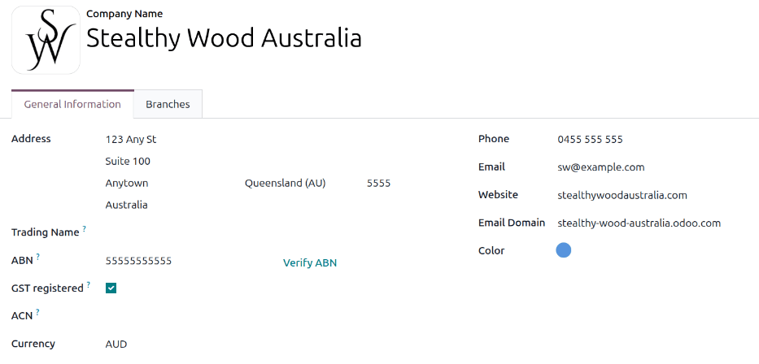

Payroll settings
----------------

In addition to configuring the company, some **Payroll** app settings must be configured. Navigate
to :menuselection:`Payroll app --> Configuration --> Settings`, and scroll to the
:guilabel:`Australian Localization` section.

Company Information
~~~~~~~~~~~~~~~~~~~

Configure the following fields in the *Company Information* section:

- :guilabel:`Branch Code`: Enter the six-digit :abbr:`BSB (Bank State Branch)` code. This identifies
  the specific bank and branch for payroll transactions.

  .. tip::
    The *Branch Code* can be found in the |ATO| portal. In Odoo, only the numeric value is relevant.
    For example, `Activity statement 002` would translate in Odoo as 2 (002 = 2).

- :guilabel:`Withholding Payer Number`: If available, enter the eight or nine-digit :abbr:`WPN
  (Withholding Payer Number)` issued by the |ATO|. This is for companies *not* entitled to an
  :abbr:`ABN (Australian Business Number)`.
- :guilabel:`Registered for Working Holiday Maker`: Select this checkbox if the company is
  registered for the :abbr:`WHM (Working Holiday Maker)` program. This indicates the company is
  registered with the |ATO| to withhold the correct taxes for employees working in Australia with an
  eligible visa, for a period of less than 12 months.

   .. seealso::
      `Employer registration for working holiday makers website
      <https://www.ato.gov.au/businesses-and-organisations/starting-registering-or-closing-a-business/registration-obligations-for-businesses/work-out-which-registrations-you-need/taxation-registrations/employer-registration-for-working-holiday-makers>`_

- :guilabel:`Registered for PALM Scheme`: Select this checkbox if the company is registered for the
  :abbr:`PALM (Pacific Australia Labour Mobility)` scheme, which allows the company to hire
  employees from ten different Pacific island nations.

  .. seealso::
     - `PALM (Pacific Australia Labour Mobility Scheme) website <https://www.palmscheme.gov.au/>`_

SuperStream and Single Touch Payroll
~~~~~~~~~~~~~~~~~~~~~~~~~~~~~~~~~~~~

Configure the following fields in the *SuperStream and Single Touch Payroll* section:

- :guilabel:`Payroll Mode`: Using the drop-down menu, select whether SuperStream and :abbr:`STP
  (Single Touch Payroll)` are in :guilabel:`Testing` mode, or :guilabel:`Production` (live) mode.
- :guilabel:`Registration Status`: This field is unable to be modified, as it displays the current
  registration status for the SuperStream and :abbr:`STP (Single Touch Payroll)` payroll.

.. important::
   Odoo is compliant with :guilabel:`SuperStream and Single Touch Payroll` Phase 2. Before
   registering in Production mode, we recommend consulting with Odoo's sales or support teams to
   ensure it aligns with your company’s specific payroll requirements.

To complete the registration process, click :guilabel:`Start Payroll Onboarding`, and a
:guilabel:`Payroll Onboarding` pop-up window loads. Select the :guilabel:`Payroll Responsible` user
using the drop-down menu. Once selected, the :guilabel:`Work Email` and :guilabel:`Work Phone`
fields are autopopulated with the user's contact information, and cannot be changed.

.. note::
   Only users of the database can be selected for the :guilabel:`Payroll Responsible`.

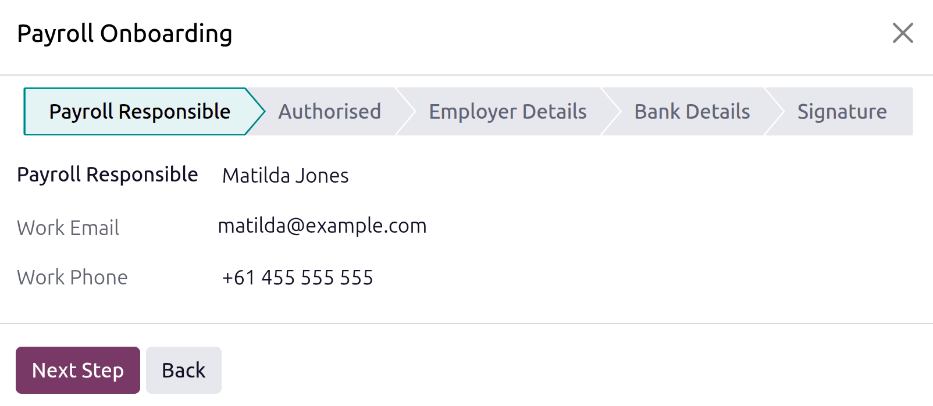

Next, click :guilabel:`Next Step`, and the status changes to :guilabel:`Authorised`, and displays
the question :guilabel:`Are you authorised to register for this service on behalf of your employer?`
Click :guilabel:`Yes` to confirm, then click :guilabel:`Next Step`.

The status changes to :guilabel:`Employer Details`, and displays the contact information for both
the company and the selected payroll responsible. Ensure the :guilabel:`Employer Details` and
:guilabel:`Employee Contact` are correct on the form.

If any information needs to be updated, exit the form and update the company or employee information
in the **Settings** app or **Employees** app, then return to the **Payroll** settings page. Click
the :guilabel:`Start Payroll Onboarding` button, and the pop-up window loads to the
:guilabel:`Employer Details` again.

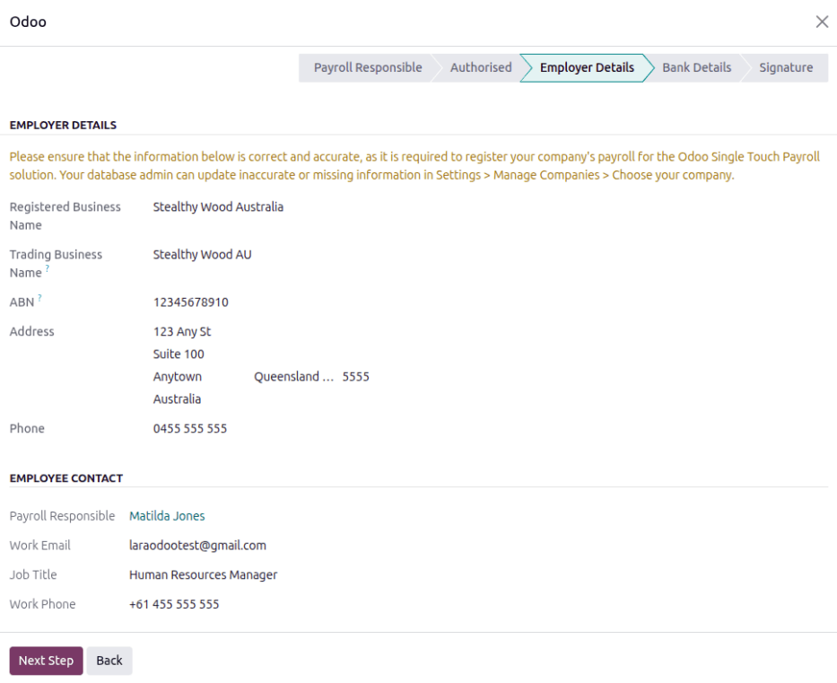

When the displayed information is correct, click :guilabel:`Next Step` and the status changes to
:guilabel:`Bank Details`. Using the drop-down menu, select the :guilabel:`Bank Journal` for payroll.
After a journal is selected, the :guilabel:`Bank Name`, :guilabel:`Account Name`, :guilabel:`Bank
Account Number`, and :guilabel:`BSB` fields are populated with the selected bank journal's details,
and **cannot** be modified. If any changes are needed, exit the form and update the information for
the journal in the **Accounting** app.

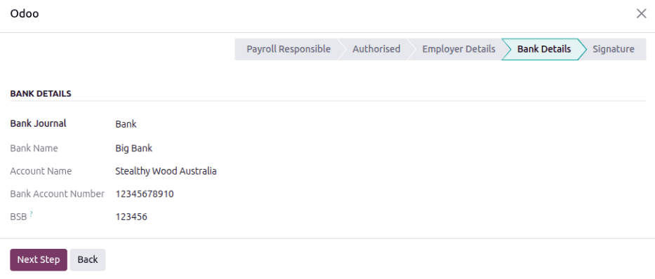

When the :guilabel:`Bank Details` are correctly filled out, click :guilabel:`Next Step`, and the
status changes to :guilabel:`Signature`. Two PDFs appear, :guilabel:`Odoo Terms & Conditions`, and
:guilabel:`SuperChoice FSG PDS DDA`. Download and read the two PDFs, then select the two checkboxes
next to the :guilabel:`I have read and signed (PDF name)` lines.

Finally, click :guilabel:`Register` to complete the registration.

Employees
=========

Every employee being paid must have their employee profiles configured for the Australia payroll
localization. Additional fields are present after configuring the database for Australia.

To update an employee form, open the :menuselection:`Employees` app and click on the desired
employee record. Ensure a :guilabel:`Work Email` and :guilabel:`Work Phone` are configured on the
employee form, and configure the required fields in the related tabs.

Work tab
--------

Enter the :guilabel:`Department`, :guilabel:`Job Position`, and :guilabel:`Job Title`, in the *Work*
section.

Enter a :guilabel:`Work Address` for the employee in the *Location* section.

Personal tab
------------

Ensure the employee has a minimum of one :ref:`trusted bank account <employees/private-contact>`
listed in the :guilabel:`Bank Accounts` field in the *Private Contact* section.

These accounts are used to pay the employee. Payroll **cannot** be processed for employees without a
*trusted* :ref:`bank account <employees/private-contact>`. If no trusted bank account is set, a
warning appears on the **Payroll** dashboard and an error occurs when attempting to run payroll.

Ensure the following fields are configured: :guilabel:`Email`, :guilabel:`Phone`, :guilabel:`Legal
Name`, :guilabel:`Other Given Names`, :guilabel:`Birthday`, :guilabel:`Gender`, :guilabel:`Private
Address`, :guilabel:`Marital status`, and :guilabel:`Dependent Children`.

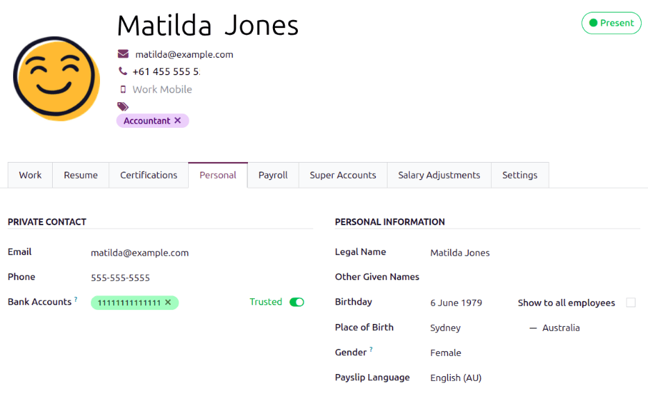

.. _payroll/payroll_localizations/payroll_tab:

Payroll tab
-----------

Fill out all the information regarding employees' contracts, residency status, tax treatments,
deductions, etc. in the sections below.

Contract overview section
~~~~~~~~~~~~~~~~~~~~~~~~~

This section holds information that drives salary calculations.

Keep the :guilabel:`Salary Structure Type` set to :guilabel:`Australian Employee` and
:guilabel:`Working hours` set to :guilabel:`AU Standard 38 hours/week`. This structure covers all of
the |ATO|'s tax schedules.

If using the **Attendances** or **Planning** app, select the :guilabel:`Work Entry Source` to define
how working hours and days are accounted for on the employee's payslip.

- :guilabel:`Working Schedule`: Work entries are automatically generated based on the employee's
  working schedule, starting from the contract's start date.

  .. example::
     An employee works 38 hours a week, their contract begins on 01/01, today's date is 16/01, and
     the user generates a pay run from 14/01 to 20/01. The working hours on the payslip will be
     automatically calculated to be 38 hours (5 * 7.36 hours) if no unpaid leave is taken.

- :guilabel:`Attendances`: Work entries are only generated after clocking in and out of the
  **Attendances** app. Note that attendances can be imported.
- :guilabel:`Planning`: Work entries are generated from planning shifts in the **Planning** app.

.. important::
   Timesheets do not impact work entries in Odoo. If timesheets need to be imported in Odoo, import
   them by navigating to :menuselection:`Payroll app --> Work Entries --> Work Entries` instead.

Ensure the following fields are configured:

  - Select :guilabel:`Fixed Wage` for full-time and part-time employees.
  - Select :guilabel:`Hourly Wage` for casual workers. This allows for adding a `Casual Loading`
    percentage.

  .. tip::
     Set a default :guilabel:`Wage Type` in the salary :ref:`Structure Type
     <payroll/structure-types>` to configure employees in bulk. If needed, the default can be
     overridden on individual employee records if exceptions are needed.

- :guilabel:`Wage`: Enter the wage, and select the corresponding time period. The following options
  are the **only** pay run frequencies accepted by Australia: :guilabel:`Daily`, :guilabel:`Weekly`,
  :guilabel:`Fortnightly` (bi-weekly), :guilabel:`Monthly`, and :guilabel:`Quarterly`.
- :guilabel:`Wage / Period`: Assign a wage to the contract according to the pay frequency. On
  payslips, the corresponding annual and hourly rates will be computed automatically.
- :guilabel:`Employee Type`: Select the *type* of employee.
- :guilabel:`Contract Type`: Determines how the employee is paid and classified, such as
  :guilabel:`Permanent`, :guilabel:`Temporary`, :guilabel:`Apprenticeship`.
- :guilabel:`Pay Category`: Select :guilabel:`Australia: Employee` for this field. This defines when
  the employee is paid, their default working schedule, and the work entry type it applies to.

Schedule section
~~~~~~~~~~~~~~~~

- :guilabel:`Work Entry Source`: Defines how :doc:`work entries <../work_entries>` are generated for
  payroll during the specified pay period. The options are:

  - :guilabel:`Working Schedule`: Based on the employee's assigned :ref:`working schedule
    <employees/schedule>` (e.g., 40 hours per week).
  - :guilabel:`Attendances`: Based on :doc:`approved checked-in hours
    <../../attendances/management>` in the **Attendances** app.
  - :guilabel:`Planning`: Based on :ref:`scheduled shifts <planning/shifts>` in the **Planning**
    app.

- :guilabel:`Working Hours`: Using the drop-down menu, select the default work schedule. This is
  particularly important for employees available to receive overtime pay (typically hourly
  employees, not salaried). The common selection is :guilabel:`AU Standard 38 hours/week`.

General section
~~~~~~~~~~~~~~~

- :guilabel:`Regular Pay Day`: Day of a week to process the payments if relevant.
- :guilabel:`Report in BAS - W3`: Enable this to add PAYG withholding amounts in BAS section W3
  instead of W2. Refer to the `ATO's web page on PAYG withholding
  <https://www.ato.gov.au/businesses-and-organisations/preparing-lodging-and-paying/business-activity-statements-bas/pay-as-you-go-payg-withholding>`_
  for more information.

Personal information section
~~~~~~~~~~~~~~~~~~~~~~~~~~~~

- :guilabel:`Non-resident`: Check this box if the employee is not a legal resident of Australia.
- :guilabel:`Tax-free Threshold`: Check this box if the employee is claiming tax-free threshold.
- :guilabel:`TFN Status`: Using the drop-down menu, select the employee's declaration.
- :guilabel:`Tax File Number`: Enter the employee's tax file number.
- :guilabel:`Previous Payroll ID`: This is only available in Debug Mode. This should be used if the
  employee has payroll records in a previous system and you want to maintain payslip continuity in
  Odoo.

Tax and contributions sections
~~~~~~~~~~~~~~~~~~~~~~~~~~~~~~

- :guilabel:`Employment Type`: Select the kind of employment the employee has. This affects tax
  calculations. Options are :guilabel:`Full time`, :guilabel:`Part time`, :guilabel:`Casual`,
  :guilabel:`Labour hire`, :guilabel:`Voluntary agreement`, :guilabel:`Death beneficiary`, or
  :guilabel:`Non-employee.`
- :guilabel:`Income Stream Type`: Select where the employee is receiving their pay from. The typical
  employee is :guilabel:`Salary and wages`, however some other circumstances may require a different
  selection.
- :guilabel:`Tax Treatment Category`: The |STP| Phase 2 report includes a 6-character tax treatment
  code for each employee. The tax treatment code is an abbreviated way of explaining the factors
  that can influence the amount withheld from employees. The |STP| solution automates the reporting
  of these codes and ensure that the tax treatment code reported is valid. Even though the creation
  of this code is automated, it is still part of the |STP| report, and it is important to understand
  what it means. For more details, check the |ATO| website on `how to report employment and tax
  information through STP Phase 2
  <https://www.ato.gov.au/businesses-and-organisations/hiring-and-paying-your-workers/single-touch-payroll/in-detail/single-touch-payroll-phase-2-employer-reporting-guidelines/how-to-report-employment-and-tax-information-through-stp-phase-2>`_.
- :guilabel:`HELP / STSL`: Click this checkbox if the employee is a :abbr:`HELP (Higher Education
  Loan Program)` loan or :abbr:`STSL (Study Training Support Loan)` recipient.
- :guilabel:`Medicare Variation Form` and :guilabel:`Medicare levy surcharge`: Click
  :guilabel:`Upload your file` to upload the filled form and select the appropriate surcharge if
  applicable.

Deductions, offsets, and withholding section
~~~~~~~~~~~~~~~~~~~~~~~~~~~~~~~~~~~~~~~~~~~~

- :guilabel:`Child Support Deduction`: The amount that has to be deducted every pay period, subject
  to :abbr:`PEA (Protected Earnings Amount)`.
- :guilabel:`Child Support Garnishee Amount %`: The percentage of pay that is legally withheld and
  paid towards child support.
- :guilabel:`Withhold for Extra Pay`: An amount that has to be deducted every pay period, subject to
  :abbr:`PEA (Protected Earnings Amount)`.
- :guilabel:`Withholding Variation`: A formal adjustment to the standard tax withholding rate based
  on specific circumstances (e.g. financial hardship or |ATO| approval).
- :guilabel:`Additional Withholding Amount`: Additional amount will be withheld from the employee's
  salary after PAYG withholding (Schedule 14)5.

Leave loading / workplace giving section
~~~~~~~~~~~~~~~~~~~~~~~~~~~~~~~~~~~~~~~~

- :guilabel:`Eligible for Leave Loading`: Check if the employee is eligible for leave loading.
- :guilabel:`Workplace Giving Employee`: Set the amount to be deducted.
- :guilabel:`Salary Sacrificed Workplace Giving`: Set the amount to be salary sacrificed (e.g.,
  receiving a benefit instead of a deduction).

Super contributions section
~~~~~~~~~~~~~~~~~~~~~~~~~~~

- :guilabel:`Extra Negotiated Super %`: Set the additional percentage amount to be contributed on
  top of the super guarantee.
- :guilabel:`Extra Compulsory Super %`: Set the additional percentage amount to be contributed as
  per industrial agreements or awards obligations.

Salary sacrifice section
~~~~~~~~~~~~~~~~~~~~~~~~

- :guilabel:`Salary Sacrifice Superannuation`: Allows employees to sacrifice part of their salary in
  favour of :abbr:`RESC (Reportable Employer Superannuation Contributions)` account, which is an
  Australian retirement account.
- :guilabel:`Salary Sacrifice Other Benefits`: Allows employees to sacrifice part of their salary
  towards some other form of benefit. Refer to the `ATO's web page on Salary sacrificing for
  employees
  <https://www.ato.gov.au/individuals-and-families/jobs-and-employment-types/working-as-an-employee/salary-sacrificing-for-employees>`_
  for more information.

.. note::
   Salary sacrificing for other benefits does not affect :abbr:`FBT (Fringe Benefits Tax)`
   reporting.

Super accounts tab
------------------

A super account is the term for an Australian retirement savings account. This tab houses the
employee's various retirement accounts, or *super funds*.

.. note::
   If an employee has an *Extra Negotiated Super*, *Extra Compulsory Super*, or *Salary Sacrifice
   Superannuation,* these configuration can be found under the :ref:`Payroll tab
   <payroll/payroll_localizations/payroll_tab>`, in the *Super Contributions* section.

Click :guilabel:`Add a line`. In the *Create Super Accounts* pop-up window, enter the following
information:

- :guilabel:`Employee`: Ensure the employee is selected in this field.
- :guilabel:`TFN`: The :abbr:`TFN (Tax Filing Number)` entered in the *Payroll* tab of the employee
  form populates this field, and **cannot** be modified.
- :guilabel:`Member Since`: By default, the current date populates this field. Select the date the
  employee created the super fund.
- :guilabel:`Active`: Enable this option if the account is active (this is the likely scenario).
- :guilabel:`Proportion`: Enter the percentage amount being added to the account. By default, the
  field displays `100`.

  .. note::
     Use the :guilabel:`Proportion` field if an employee's contributions should be sent to multiple
     funds at a time.

- :guilabel:`Super Fund`: In the drop-down menu, select the type of account associated with the
  super fund.
- :guilabel:`Fund ABN`: This field is autopopulated with the selected :guilabel:`Super Fund`
  :abbr:`ABN (Australian Business Number)`, and **cannot** be modified.
- :guilabel:`Member Number`: After selecting a :guilabel:`Super Fund`, this field appears. Enter the
  member number for the employee's super fund account.

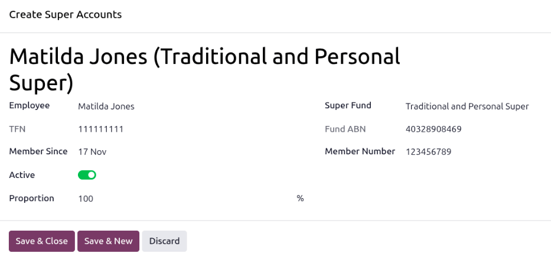

.. tip::
   Odoo comes with pre-installed and updated Super funds, but self-managed super funds (SMSF) can be
   added by navigating to :menuselection:`Payroll --> Configuration --> Super Funds`. Manage all
   super accounts by navigating to :menuselection:`Payroll --> Configuration --> Super Accounts`.

Salary adjustments tab
----------------------

If the employee has pay allowances (e.g., laundry allowance, travel allowance, cents per km
allowance, transport allowance), :ref:`configure them in the Salary Adjustment tab
<payroll/salary-adjustment/create>`.

.. _payroll/payroll_localizations/stp:

STP Responsible Employee
========================

One employee responsible for |STP| **must** be nominated. Navigate to the **Employees** app, and
select the desired employee. Ensure the following fields are configured on their :ref:`employee
profile <employees/general-info>`: :guilabel:`Name`, :guilabel:`Work phone`, :guilabel:`Work email`,
and :guilabel:`Job Title`.

.. _payroll/payroll_localizations/bank_journals:

Bank account and bank journal
=============================

The bank account that direct debit payments are drafted from via the clearing house **must** be
configured.

Navigate to :menuselection:`Contacts app --> Configuration --> Bank Accounts`. Click :guilabel:`New`
to add a bank account, and a *Bank Accounts* form loads.

Configure the form, ensuring the following fields are populated:

- :guilabel:`Account Number`: Enter the bank account number in this field.
- :guilabel:`Clearing Number`: Enter the clearing number in this field.
- :guilabel:`BSB`: Enter the Bank State Branch code in this field.
- :guilabel:`Account Holder`: Using the drop-down menu, select the corresponding **Contact** app
  record for the account holder, typically the company.
- :guilabel:`Account Holder Name`: The selected :guilabel:`Account Holder` populates this field by
  default. Make any necessary modifications.
- :guilabel:`Bank`: Using the drop-down menu, select the bank the account is under. Once selected, a
  *Bank Information* tab appears, containing the various bank information. Make any desired edits to
  this tab.
- :guilabel:`Send Money`: Ensure this toggle is set to :guilabel:`Trusted`.
- :guilabel:`Currency`: Set this field to :guilabel:`AUD`.

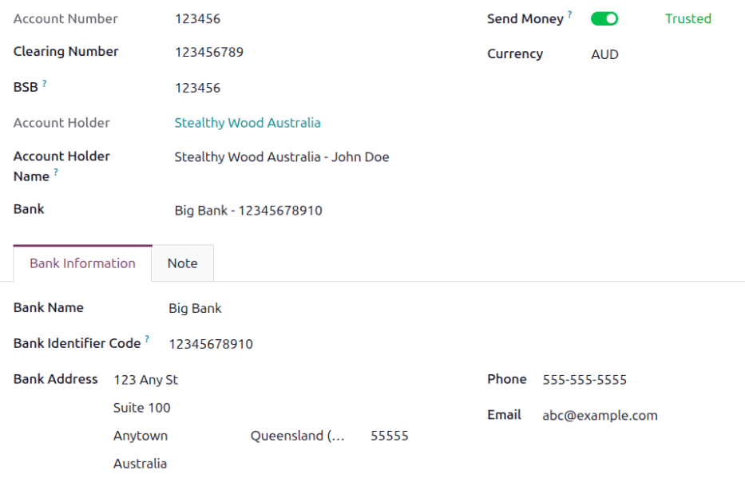

Then, navigate to :menuselection:`Accounting app --> Configuration --> Journals`, and select the
corresponding bank journal. Ensure the :guilabel:`Bank Account` number in the *Journal Entries* tab
is the same as the bank account configured above.

.. important::
   Odoo takes direct debits from this account to pay employee's superannuation.

.. _payroll/payroll_localizations/au_config:

Payroll configuration
=====================

Several sections within the **Payroll** app also install a salary structure, structure type, rules,
and parameters specific to Australia.

Salary structures & structure types
-----------------------------------

When the **l10n_au_hr_payroll** module is :ref:`installed <payroll/au_apps>`, a new
:guilabel:`Salary Structure` gets installed, :guilabel:`Australian Employee`. This structure
includes one :guilabel:`Structure Type`, :guilabel:`Australian Employee Pay`.

The :guilabel:`Salary Structure` contains all the individual :ref:`salary rules <payroll/au_apps>`
that informs the **Payroll** app how to calculate employee payslips.

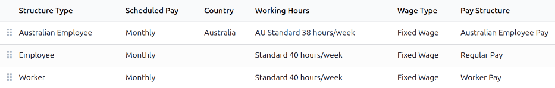

.. _payroll/au_rules:

Salary rules
------------

To view the salary rules that inform the salary structure what to do, navigate to
:menuselection:`Payroll app --> Configuration --> Structures` and expand the :guilabel:`Australian
Employee` group to reveal the :guilabel:`Australian Employee Pay` structure type. Click
:guilabel:`Australian Employee Pay` to view the detailed salary rules.

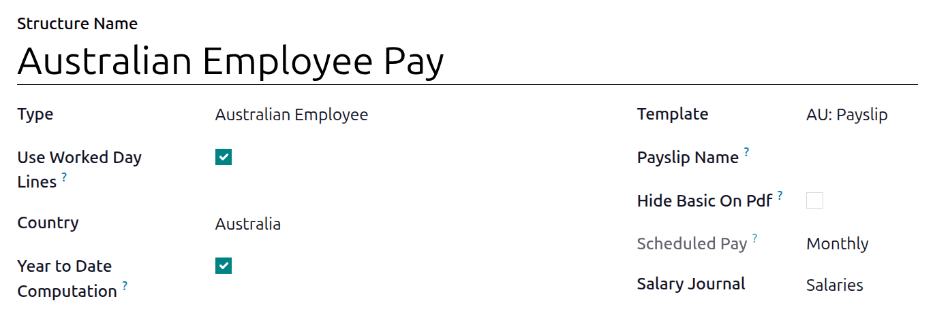

Rule parameters
---------------

Some calculations require specific rates associated with them, or wage caps. *Rules Parameters* are
capable of listing a value, either a percentage or a fixed amount, to reference in the salary rules.

Most rules pull information stored in the parameters module to get the rate of the rule (a
percentage) and the cap (a dollar amount).

To view rule parameters, navigate to :menuselection:`Payroll app --> Configuration --> Rule
Parameters`. Here, all rule parameters are displayed with their linked :guilabel:`Salary Rules`,
which can be accessed. Review the parameters associated with a rule by looking for the
:guilabel:`Name` of the rule, and make any edits as needed.

.. important::
   Odoo adds updated rule parameters for the current calendar year. It is **not** recommended to
   edit rule parameters **unless a national or local parameter has changed**, and is different from
   the rule parameters created by Odoo. Check with all local and national regulations *before*
   making any changes to rule parameters.

Payroll onboarding
==================

Once the :ref:`company <payroll/payroll_localizations/au_gen>`, the :ref:`STP responsible employee
<payroll/payroll_localizations/stp>`, and the :ref:`bank journal for direct debit
<payroll/payroll_localizations/bank_journals>` are configured, navigate to :menuselection:`Payroll
app --> Configurations --> Settings` to start the onboarding process.

Scroll to the *Australian Localization* section, and under *SuperStream and Single Touch Payroll*,
select the :guilabel:`Payroll Mode`. Choose :guilabel:`Production` for a production database with a
valid subscription code, or otherwise, select :guilabel:`Testing`. Then, click the :guilabel:`Start
Payroll Onboarding` button, and a *Payroll Onboarding* pop-up window loads.

.. important::
   It is strongly recommended to test payroll on the testing database prior to configuring the
   production environment, as any payroll processed in the production database will be submitted
   directly to the |ATO|.

On the *Payroll Responsible* stage, select the :ref:`STP responsible employee
<payroll/payroll_localizations/stp>` in the :guilabel:`Payroll Responsible` field, then click the
:guilabel:`Next Step` button.

On the *Authorised* stage, click the :guilabel:`Yes` option for the question :guilabel:`Are you
authorised to register for this service on behalf of your employer`, then click the :guilabel:`Next
Step` button.

On the *Employee Details* stage, review the business details and ensure they are all correct, then
click :guilabel:`Next Step`.

On the *Bank Details* stage, select the company's :ref:`Bank journal
<payroll/payroll_localizations/bank_journals>` for direct debit, then click :guilabel:`Next Step`.

On the *Signature* stage, read the following PDF's:

- Odoo's Terms & Conditions
- SuperChoice FSG PDS DDA

After the documents have been reviewed, click the two check boxes attesting that the documents have
been read, then, click the :guilabel:`Register` button.

.. important::
   Read the provided documents carefully before signing.

Lastly, Odoo will provide advice on how to proceed in case the company needs to switch from another
|STP| software to Odoo.

On the *Import YTD Balances* pop-up window, select :guilabel:`Zeroed Previous Payroll` if the
previous payroll system has been zeroed out, or if there is no previous payroll system. Next, enter
the :guilabel:`Previous BMS ID` in the corresponding field.

.. note::
   :guilabel:`BMS ID` is the *Business Management System Identifier* for your organisation in the
   payroll system. This is important when transitioning from other payroll systems to Odoo, as it
   ensures employees maintain continuous year-to-date records on their payslips and |ATO| Portal.

Enter the :guilabel:`Fiscal Year Start Date` in the corresponding field, then click the
:guilabel:`Transfer and Generate YTD` button.

Importing YTD balances
======================

To import the year-to-date balances, navigate to :menuselection:`Payroll app --> Configuration -->
YTD Opening Balances`.

After importing the YTD balances from the previous software, the |ATO| needs to be notified of the
change of BMS ID and payroll IDs. This step does not apply for strategy 1.

To do so, after importing YTD balances, navigate to :menuselection:`Payroll app --> Reporting -->
Single Touch Payroll`, and submit the update event created for this purpose.

Once the update event submitted to the |ATO|, pay runs and payslips can be created for employees.

Run Australian payroll
======================

Before running payroll, the payroll officer must validate employee :doc:`work entries
<../work_entries>` to confirm pay accuracy and catch errors. This includes checking that all time
off is approved and any overtime is appropriate.

Work entries sync based on the employee's :doc:`contract <../contracts>` configuration. Odoo pulls
from the assigned working schedule, attendance records, planning schedule, and approved time off.

Any :ref:`discrepancies or conflicts <payroll/conflicts>` must be resolved, then the work entries
can be :ref:`regenerated <payroll/regenerate-work-entries>`.

Once everything is correct, draft payslips can be :ref:`created individually <payroll/process>` or
in batches, referred to in the **Payroll** app as :ref:`pay runs
<payroll/payroll_localizations/au_run>`.

.. important::
   In Australia, :ref:`individual payslips <payroll/process>` (not part of a pay run) are considered
   *out-of-cycle* runs. The same payslip rules apply, but the way individual payslips are submitted
   to the |ATO| in the framework of :abbr:`STP (Single Touch Payroll)` is slightly different.

   Adding an out-of-cycle payslip to an existing batch is **not** recommended.

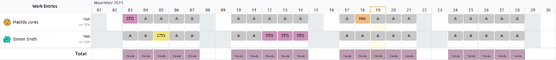

.. note::
   To reduce payroll processing time, payroll officer typically handle payslips in batches. These
   batches can be grouped by wage type (e.g., fixed salary or hourly), pay schedule (weekly,
   bi-weekly, or monthly), department (direct cost or administration), or any other structure that
   suits the company.

.. _payroll/payroll_localizations/au_run:

Create a pay run
----------------

First, create a pay run for the desired time period. Navigate to :menuselection:`Payroll app -->
Payslips --> Pay Runs` and click :guilabel:`New`. Select the desired :guilabel:`Salary Structure`,
:guilabel:`Pay Schedule`, and time :guilabel:`Period`, then click :guilabel:`Continue`.

Select the employees to create the pay run for, then click :guilabel:`Select`.

.. tip::
   Employees on a pay run can be filtered by :guilabel:`Salary Structures`.

:doc:`Work entries <../work_entries>` are directly linked to the time an employee worked. They can
be created in the following ways:

- Automatically, using the employee's :ref:`work schedule <employees/schedule>`.
- Automatically, using the :doc:`Attendances app  <../../attendances/attendance_logs>`
- Automatically, after publishing :ref:`planned shifts <planning/shifts>`.
- Manually, via import.

To manually upload work entries, navigate to :menuselection:`Payroll App --> Work Entries --> Work
Entries`, and view the data in a list. Next, click the :icon:`fa-gear` :guilabel:`(Actions)` icon
and select :guilabel:`Import Records`.

.. tip::
   Alternatively, use the built-in **Timesheets** app to record hours. These can then be exported,
   adjusted slightly (with a few field changes), and re-imported as work entries.

.. important::
   Currently there is **no** integration with Odoo's **Timesheets** app.

Generate payslips
-----------------

Payslips can be generated in two ways:

- :ref:`Pay Runs <payroll/payroll_localizations/au_run>`: The recommended method for Australia.
- Off-Cycle Payslips: Mainly used for termination payslips, or other payments outside of a pay
  cycle.

There is no limit to the amount of payslips that can be created in one pay run.

After creating a :ref:`pay run <payroll/payroll_localizations/au_run>`, one payslip is created per
employee in the Waiting stage, which can be reviewed and amended before validation.

.. note::
   In the future, payslips that are not related to hours worked should also be handled using
   off-cycle payslips.

Payslips
--------

On the payslip form view, there are two types of inputs:

- :guilabel:`Worked days`: Computed based on the work entry source set on the employee's contract.
  Work entries can be configured according to different types: attendance, overtime, Saturday rate,
  Sunday rate, public holiday rate, etc.
- :guilabel:`Salary inputs`: Individual payments or amounts of different types (allowances, lump
  sums, deductions, termination payments, leaves, etc.) that have little to do with the hours worked
  during the current pay period. The previously configured salary attachments are simply recurring
  other inputs attached to a contract.

Under the *Salary Computation* tab, Odoo automatically computes payslip rules based on employees,
contracts, worked hours and salary input types.

The salary structure *Australian Employee* has 35 payslip rules that automatically compute and
dynamically display according to the payslip inputs.

.. example::
   The following rules apply for the pay period in the accompanying payslip:

   - Basic Salary: The pre-sacrifice gross salary (total contract amount before any deductions).
   - Ordinary Time Earnings: Amount to which the super guarantee percentage needs to be applied
   - Salary Sacrifice Total: includes the $150 sacrificed to superannuation
   - Taxable Allowance Payments: includes the $10 allowance (cents per KM in this case)
   - Taxable Salary: Gross salary amount minus non-taxable amounts
   - Salary Withholding and Total Withholding: The total tax amounts to be withheld from the taxable
     salary and remitted to the ATO.
   - Net Salary: The "take-home pay" or the employee's actual wage after all taxes and deductions.
   - Concessional Super Contribution: In this scenario, the amount sacrificed to superannuation,
     payable to the employee's super fund in addition to the super guarantee
   - Super Guarantee: This is computed as 12% of the ordinary time earnings amount

Confirming payslips
-------------------

Once all payslip data is deemed correct, click :guilabel:`Create Draft Entry` on the pay run. This
can also be done payslip by payslip for control reasons.

This has several impacts:

- The employee receives their payslip via email + portal accessibility.
- Marking the batch and its payslips as Done.
- Creating a draft accounting entry per payslip or one entry for the whole batch, depending on the
  payroll settings. At this stage, accountants can post entries to affect the balance sheet, P&L
  report, and BAS report.
- Preparing the |STP| submission (or payroll data to be filed to the ATO as part of |STP|
  compliance). This needs to be performed by the STP Responsible user, defined under
  :menuselection:`Payroll --> Configuration --> Settings`.
- Preparing super contribution lines as part of SuperStream compliance. This needs to be done by the
  HR Super Send user selected under :menuselection:`Payroll --> Configuration --> Settings`.

Impact on accounting
--------------------

Four accounts from the Australian :abbr:`CoA (Chart of Accounts)` are included with the payroll
localization:

- `611000 Salaries & Wages`
- `230100 Employee Payroll Taxes`
- `230200 Employer Payroll Taxes`
- `230000 Salary Payable`

.. note::
   The :abbr:`CoA (Chart of Accounts)` configuration is done by default when a company is located in
   Australia. The account codes and names can be edited to suit the company's needs. If there is no
   :abbr:`CoA (Chart of Accounts)` account associated with a salary rule (used in a salary
   structure), Odoo uses the account `Salary Expenses` to create the journal entry, regardless of
   the nature of the move.

Once payslips are confirmed, a draft journal entry per payslip is created, in the Salaries journal.

The level of detail in a payslip's linked journal entry is determined by how the employee settings
are configured and accounts on the salary rules.

.. note::
   The following salary rules that impact accounting:

   - Fees and Deductions
   - Total Withholding
   - Child Support Total
   - Expense Reimbursement
   - Net Salary
   - Concessional Super Contribution
   - Super Guarantee

Once the journal entry is posted, predefined accounts will impact the company's balance sheet
(PAYGW, wages, and superannuation liabilities) and profit & loss report (wages and superannuation
expenses). In addition, the employee's gross wage and PAYG withholding will update the BAS report
for the relevant period (see Tax Grid: W1 and W2). Accounts can be adjusted to the company's chart
of accounts.

Closing the BAS
---------------

Closing the BAS report now includes payroll sections (W1 to W5)

Most Common:

- **W1**: Total salary, wages and other payments
- **W2**: Amounts withheld from salaries or wages and other payments shown at W1
- **W5**: Total amounts withheld (W2 + W4 + W3).

Special cases

- **W4**: Amounts withheld where no ABN is quoted (NOT a payroll tax! You can record W4 amounts on
  vendor bills by using the No ABN tax)
- **W3**: Other amounts withheld (excluding any amount shown at W2 or W4). To use it, select the
  *Report in W3* checkbox in the employee's record, in the *Payroll* tab.

.. note::
   For Consolidated payroll accounting entries, navigate to :menuselection:`Payroll -->
   Configuration --> Settings` and enable :guilabel:`Batch Account Move Lines`.

Submit STP files to the ATO
---------------------------

As per |ATO| requirements, |STP| submissions for a pay run **must** be done *on or before* the
payday. For this reason, submit |STP| data to the |ATO| **before** proceeding with payment. To
submit the data, click :guilabel:`Submit to ATO` on the payslip or pay run.

.. tip::
   A warning message appears if important information is missing.

On the |STP| record for the pay run, a few useful information is displayed:

- A warning message if important information is missing.
- An automatically generated activity for the |STP| responsible user.
- A summary of payslips contained in this pay run, auditable from this view.

Always test the submission before submitting.

Once the |STP| record is ready, click :guilabel:`Submit to ATO`, then read and accept the related
terms and conditions.

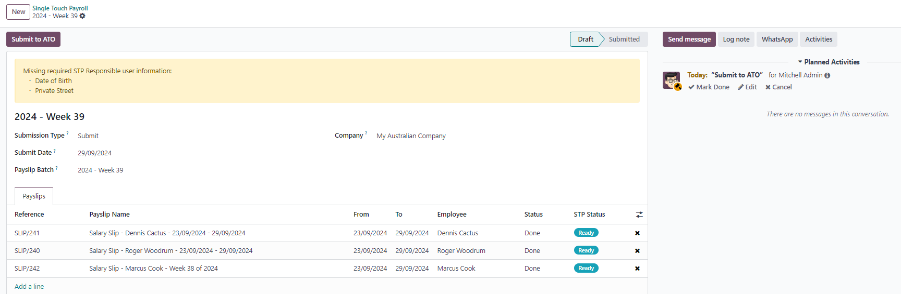

Pay, refund, and print payslips
-------------------------------

When payslips are submitted to |ATO| you will see 2 options:

- :guilabel:`Mark as Paid`: Click this if you are not using Odoo for accounting (this serves as an
  internal note that the pay run was paid).
- :guilabel:`Paid`: Click this if you want to generate a payment file for later reconciliation.
  Here, you can also select :guilabel:`ABA Credit Transfer` as the payment method. The ABA file can
  be downloaded directly from the pay run.

.. seealso::
   - :ref:`ABA files for batch payments <australia/aba>`
   - :ref:`How to pay, refund and print payslips <payroll/new-payslip>`

Super contributions
-------------------

Superannuation payments to employees' super funds must be processed at least once per quarter, or
more frequently when preparing for Payday Super.

There are two ways to access Super Contribution records:

- Navigate to :menuselection:`Payroll app --> Reporting --> Super Contributions`.
- Click the :icon:`fa-cash` :guilabel:`Super Contribution` smart button on the individual payslip.

Super Record Information includes:

- Bank Information (used for direct debit processing)
- Payslip Lines associated with the contributions
- Contribution Amounts for each employee
- Reporting Status
- Direct Debit Status
- Fund Update Banner (to highlight any required updates or issues)

Paying super
------------

#. Lock the super record. Navigate to :menuselection:`Payroll app --> Reporting --> Super
   Contributions` and lock the record. Once locked, further contributions create a new super record,
   just like replenishing new products in the **Purchasing** app create a new RFQ.
#. Register the super payment. This will create a payment record in Odoo, and authorise the clearing
   house to collect the contributions via direct debit.
#. Wait for the following statuses to update:

   - Direct debit status (payment status from the employer to the clearing house)
   - Fund payment status (payment status from the clearing house to the super funds)
   - Payment status (payment status of the entire transaction)

#. Reconcile. You can now reconcile the payment with the bank statement.

.. note::
   As of July 1, 2026, Australian businesses will be **required** to pay super at the same time as
   salary & wages. This Governmental initiative is called *Payday Super*. Find more information on
   the `ATO website
   <https://www.ato.gov.au/businesses-and-organisations/super-for-employers/payday-super>`_ .

Special cases
-------------

The following are common situations and their resolutions:

- *What if I need to cancel my super payment?*

Navigate to :menuselection:`Payroll app --> Reporting --> Super Contributions`. Find the entry to
cancel and click :guilabel:`Cancel`. The chatter log will display information regarding the *Direct
Debit Status*, identifying whether it is a cancellation or a refund.

- *What if my direct debit payment fails?*

On the Super record, the *Direct Debit Status* will be marked as *Failed*. Either resubmit or cancel
the super transaction

- *What if one of the fund payment fails?*

On the Super record lines, the *Fund Payment Status* will be marked as *Failed*. Either resubmit or
cancel the super transaction.

Payroll links to other apps
---------------------------

The following apps integrate with the **Payroll** app, and require specific configurations or
considerations.

Time Off
~~~~~~~~

Logging time off of any kind replaces the employee's work entries. This takes place because time off
types are linked to work entry types.

Navigate to :menuselection:`Time Off app --> Configuration --> Time Off Types`. For each type,
configure the following two fields under the *Payroll* section:

- :guilabel:`Work Entry Type`: Defines which work entry is selected on the *Worked Days* table of
  the payslip.
- :guilabel:`Unused Leave Type`: Choose between :guilabel:`General Leave`, :guilabel:`Long Service`,
  or :guilabel:`Unpaid at Termination`. If :guilabel:`Unpaid at Termination` is selected, the
  remaining leave balance for this time off type will not show up as an entitlement at the time of
  termination.

Expenses
~~~~~~~~

Navigate to :menuselection:`Expenses app --> Configuration --> Settings` and enable the option
 :guilabel:`Reimburse in Payslip`.

When an employee on the payroll submits an approved expense to be reimbursed, it can be reimbursed
in two ways:

- If the expense is to be reimbursed *outside* of a pay run, click :guilabel:`Post Journal Entries`.
  The payment must be made manually.
- If the expense is to be reimbursed as part of the next *pay run*, click :guilabel:`Report in Next
  Payslip` instead.

The expense will be visible under *Payslip Salary Inputs*, *Salary Computation*, and the printed
payslip.

.. _payroll/payroll_localizations/attn_au:

Attendances
~~~~~~~~~~~

On the employee's record, set the :guilabel:`Work Entry Source` field to :guilabel:`Attendances`.

Work entries will be created as soon as the employee signs in and out via the **Attendances** app.

On the payslip, only the actual time worked will be displayed in the worked days and hours table.

.. _payroll/payroll_localizations/plan_au:

Planning
~~~~~~~~

On the employee's record, set the :guilabel:`Work Entry Source` field to :guilabel:`Planning`.

Work entries will be created as soon as planning shifts are published.

On the payslip, only time worked will show in the worked days table.

Casual workers
==============

*Casual employment* is specific to Australia and New Zealand.

An employee is considered casual if, at the time they commence employment, one of the following
applies:

No firm commitment
------------------

There is no firm advance commitment to ongoing and indefinite work, taking into account various
relevant factors; and work schedules cannot be reliably used for casual employees in Odoo due to the
absence of a fixed or ongoing commitment to work.

Instead, it is recommended to use the **Planning** or **Attendances** apps to record actual work
entries.

.. note::
   The :guilabel:`Working Hours` field on an employee record can be left empty for casual employees.

Entitled to casual loading
--------------------------

They are entitled to receive a casual loading or a specific casual pay rate under an award,
registered agreement, or employment contract.

A casual loading rate can be applied to employees who are paid on an hourly basis, rather than a
fixed wage, which is intended for full-time or part-time staff.

Penalty rates
-------------

In addition to casual loading, Odoo allows you to apply penalty rates based on the timing of a shift
(e.g., Saturdays, Sundays, Public Holidays).

To implement this, :ref:`create a separate work entry type <payroll/new-work-entry-type>` for each
penalty category.

Overtime
--------

Using the same field as for penalty rates, you can apply an additional percentage for overtime
hours.

For each overtime type, :ref:`create a separate work entry type <payroll/new-work-entry-type>`.
Unlike penalties, overtime is different because casual loading does not apply to overtime hours.

Managing casual worker rates
----------------------------

#. Configure all work entry types with the appropriate *penalty* and *overtime* rates.
#. Record work entries using the :ref:`Attendances <payroll/payroll_localizations/attn_au>` or
   :ref:`Planning <payroll/payroll_localizations/plan_au>` apps.
#. Manually update work entries daily or weekly in the **Attendance** app, assigning them to the
   correct work entry type.
#. If manual updates are not suitable, a practical alternative is to import work entries from a
   spreadsheet.

You can view this information on the employee's payslip. There are two active smart buttons that
allow for quick access to work entries, to make adjustments and attendance records as well.

.. _payroll/au-terminate:

Terminate employees
-------------------

Employees can be terminated by going to :menuselection:`Payroll app --> Reporting --> Terminate
Employee`. The following fields must be completed:

- :guilabel:`Contract End Date`: Once the termination is validated, this date is added to the
  contract automatically, and marks the contract as *Expired* when the date has been reached.
- :guilabel:`Cessation Type Code`: A mandatory field for the ATO's STP reporting.
- :guilabel:`Termination Type`: The type of redundancy (genuine or non-genuine) affects the
  computation of unused annual and long service leave withholding.

The Final payslip will be marked as final pay. Besides normal wages & benefits, it will contain
unused leaves, auto-calculated by Odoo.

On top of these payments, you can add ETPs. These can be of 2 types: Excluded ETPs & Non-excluded
ETPs. These are simply taxed differently, and cover different types of employment scenarios. They
also depend on the type of redundancy. Find more information on the `ATO website
<https://www.ato.gov.au/businesses-and-organisations/super-for-employers/payday-super>`_ .

.. note::
   Annual leaves will be taxed as per |ATO| schedule 7. ETPs will be taxed as per |ATO| schedule 11.

Advanced configurations
=======================

In some cases, if there is a need to add more inputs to an employee's salary that are not covered by
the default input type, other input types can be configured or created.

Other input types
-----------------

To edit or create another input types, navigate to :menuselection:`Payroll --> Configuration -->
Other Input Types`. To modify an existing type, click on the rule and make the desired changes. To
create a new input type, click :guilabel:`New`, then fill out the :guilabel:`Payslip Other Input
Types` form.

.. important::
   A total of sixty-three other input types are related to the Australia payroll localization. It is
   **not** recommended to use these other input types, since they **cannot** be used in the frame of
   |STP|. These can be archived or deleted.

On each input type being used, ensure the following fields are populated:

- :guilabel:`Payment Type`: Select the classification for the input types using the drop-down menu.
  The default options are:

  - :guilabel:`ETP`: The input is an :abbr:`ETP (Employment Termination Payments)`. These are either
    considered excluded or non-excluded. Refer to the |ATO| web page on :abbr:`ETP (Employment
    Termination Payments)` components taxation.
  - :guilabel:`Allowance`: The input is a separate amount paid to employees in addition to their
    salary and wages. Some of these allowances are mandated by modern awards, such as laundry,
    transportation, etc.

  .. important::
     Contact Odoo if planning to use allowances subject to varied rates of withholding (such as
     cents per kilometer or travel allowances) to ensure Odoo currently covers the particular
     business case.

  .. note::
    As of Odoo 18, some allowances, such as :guilabel:`Laundry`, which is used for approved
    uniforms, are managed by two other inputs: one to lodge the amount paid up to the |ATO| limit,
    and the other one to lodge the amount exceeding the ATO limit. This is necessary for Odoo to
    compute PAYGW correctly. Some businesses may require to shift the reporting of an allowance from
    OTE to Salary & Wages depending on the employee. In this case, the input type must be duplicated
    and reconfigured from an existing other input type. For example, :guilabel:`Work-Related
    Non-Expense: Allowance to compensate for specific work, activities, disabilities, skills or
    qualifications` is OTE by default.

  - :guilabel:`Deduction`: The input is a deduction such as union fees and child support.
  - :guilabel:`Leave`: The input is a leave-related other input that does not pertain to a single
    pay period (lump sum, cashing out leaves while in service, unused leaves, etc.).
  - :guilabel:`Lump Sum`: This input is a return to work and lump sums (for back payments).
  - :guilabel:`Other`: The input is another payment with its own specific logic.

- :guilabel:`PAYGW Treatment`: This field affects how Odoo withholds tax for the input type. Using
  the drop-down menu, select either: :guilabel:`Regular`, :guilabel:`No PAYG Withholding`, or
  :guilabel:`Taxed above ATO limit`
- :guilabel:`Superannuation Treatment`: Using the drop-down menu, select if the input is considered
  a :guilabel:`OTE` (one-time earning), :guilabel:`Salary & Wages`, or :guilabel:`Not Salary &
  Wages`.
- :guilabel:`STP Code`: This field is only visible in developer mode. This field tells Odoo how to
  report the gross value of the payment to the |ATO|. It is **not** recommended to change the value
  of this field if it is already populated by default.
- :guilabel:`Is OTE`: This field determines whether time spent in this category can be considered
  ordinary time earnings, meaning that the superannuation guarantee rate will apply (e.g., regular
  attendance, paid leave, etc.).
- :guilabel:`Penalty Rate`: This field is used to determine the percentage of penalty that applies
  to time spent in this category. It is important to configure the penalty rate that applies in the
  state or industry according to the type of work (e.g., Saturday rate, Sunday rate, overtime rate,
  etc.).

Close Payroll
-------------

If there are no errors, payroll is completed for the pay period.

Reports
=======

The Australian localization contains several reports unique to Australia, which provide information
on superfund contributions, single touch payroll, :abbr:`STP (Single Touch Payroll)` Finalisation,
and the ability to terminate employees.

STP Finalisation
----------------

The fiscal year in Australia ends on June 30th, but :abbr:`STP (Single Touch Payroll)` finalisation
declarations are due by July 14th. These can be done in :ref:`one single report for all employees
<payroll/stp-total>`, or :ref:`individually <payroll/stp-individual>`.

.. _payroll/stp-total:

EOFY finalisation
~~~~~~~~~~~~~~~~~

To finalize the fiscal year's :abbr:`STP (Single Touch Payroll)`, navigate to
:menuselection:`Payroll app --> Reporting --> STP Finalisation`, and a :guilabel:`Finalise Payroll`
pop-up window loads.

The :guilabel:`Company`, :guilabel:`ABN`, and :guilabel:`Branch Code` are populated from the
:ref:`company information <payroll/payroll_localizations/au_gen>`.

Configure the following fields on the form:

- :guilabel:`BMS ID`: Enter the company's :abbr:`BMS ID (Business Management Software Identifier)`,
  issued by the |ATO|.
- :guilabel:`EOFY Declaration`: Select this checkbox to indicate the finalisation is for the entire
  fiscal year (not an :ref:`individual finalisation <payroll/stp-individual>`). Once selected, the
  name of the report changes to `EOFY Finalisation - YYYY/YY`.
- :guilabel:`Finalisation`: Select this checkbox to indicate this is a finalisation and not an
  amendment.
- :guilabel:`Date Start`: This field displays `1 July`, by default.
- :guilabel:`Date End`: If :guilabel:`EOFY Declaration` is selected, this field displays `30 June
  YYYY`
- :guilabel:`Fiscal Year`: The current fiscal year populates this field.
- :guilabel:`Responsible User`: Using the drop-down menu, select the user responsible for this
  report.

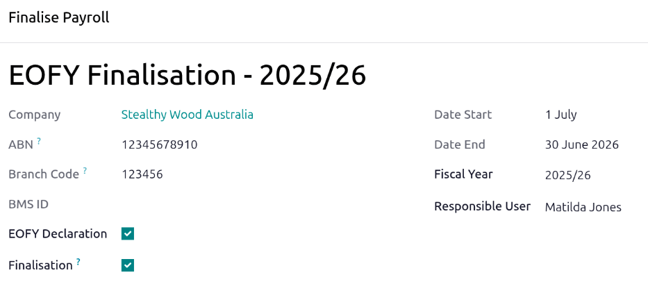

Both active and :ref:`terminated <payroll/au-terminate>` employees to finalise are displayed in the
:guilabel:`Employee Finalisation` tab. Ensure all balances for all employees are correct. Once
verified, click :guilabel:`Submit to ATO` to create the report and submit it.

Employee payment information changes to *Tax ready* on their online income statement, after the end
of the financial year.

.. _payroll/stp-individual:

Individual finalisation
~~~~~~~~~~~~~~~~~~~~~~~

Employees can be individually finalised during the year. This can be useful when:

- A one-off (off-cycle) payment is made *after* a finalisation is sent to the :abbr:`ATO (Australian
  Taxation Office)`.
- After an employee is :ref:`terminated <payroll/au-terminate>` during the year.

To create an individual finalisation, navigate to :menuselection:`Payroll app --> Reporting --> STP
Finalisation`.

Configure the top-half of the form in the same manner as the :ref:`typical annual finalization
<payroll/stp-total>`, but **do not** select the checkbox next to the :guilabel:`EOFY Declaration`.
Leaving this unchecked displays a :guilabel:`Deadline Date` field. This is populated with the
current date, by default. Adjust this date if needed.

Next, manually add the employees to be finalised by clicking :guilabel:`Add a line` in the
:guilabel:`Employee Finalisation` tab, and selecting the employee.

.. important::
   If an employee record is finalised partway through the financial year, the |ATO| will **not**
   pre-fill the information into the employee's tax return until **after** the end of the financial
   year.

ATO Security Compliance Requirements
====================================

To ensure |STP| compliance, the |ATO| requires Digital Service Providers (DSPs) like Odoo to adhere
to strict security standards. The following requirements have been implemented within the Odoo
ecosystem:

#. Audit Logging: Odoo maintains comprehensive audit logs for all payroll and accounting-related
   records. These logs are stored in the database and synchronized with our IAP server for a rolling
   12-month period.

#. Mandatory MFA: Multi-Factor Authentication (MFA) is mandatory for all users with access to
   payroll and accounting records. This security feature cannot be disabled.

#. Authentication Persistence: The "Remember Me" functionality is limited to a maximum of 24 hours
   after 2FA authentication. Once this period expires, Odoo will automatically log the user out and
   require a fresh 2FA login.

#. Idle Session Timeout: Sessions will automatically time out after 30 minutes of inactivity.

#. Brute Force Protection: User accounts will be locked after a maximum of 5 unsuccessful login
   attempts.

#. Onshore Data Hosting: By default, all payroll and accounting records must be hosted onshore. If
   data is hosted offshore, the customer or partner must proactively contact the |ATO|'s Digital
   Partnership Office (DPO).

#. SSO Restrictions: Users are prohibited from using social media Single Sign-On (SSO) to access
   sensitive records. While this primarily affects Facebook SSO in standard Odoo, the restriction
   applies to all third-party social media integrations.

#. Credential Expiry: Any security tokens or temporary credentials issued to users with access to
   Odoo |STP| & SS must expire within 24 hours.

#. Encryption Integrity: Any technical modifications to encryption keys, encryption at rest, or
   encryption in transit may jeopardize ATO compliance status.
