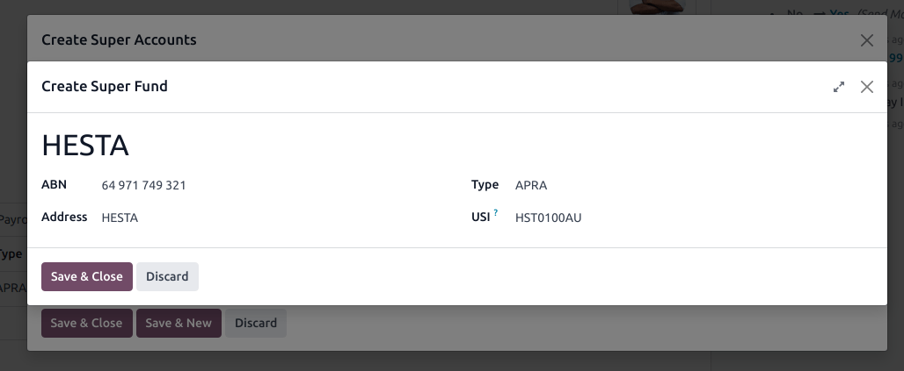
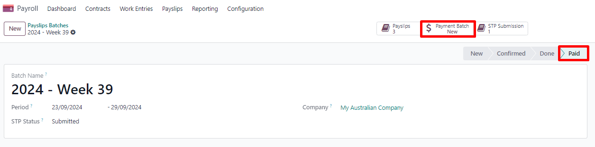
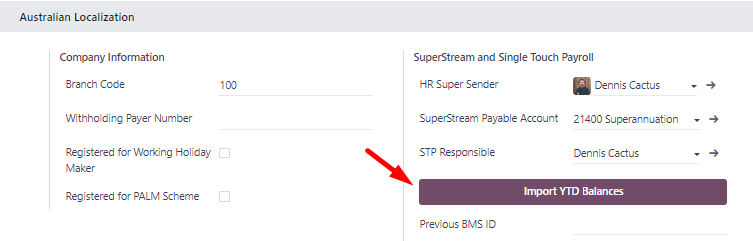
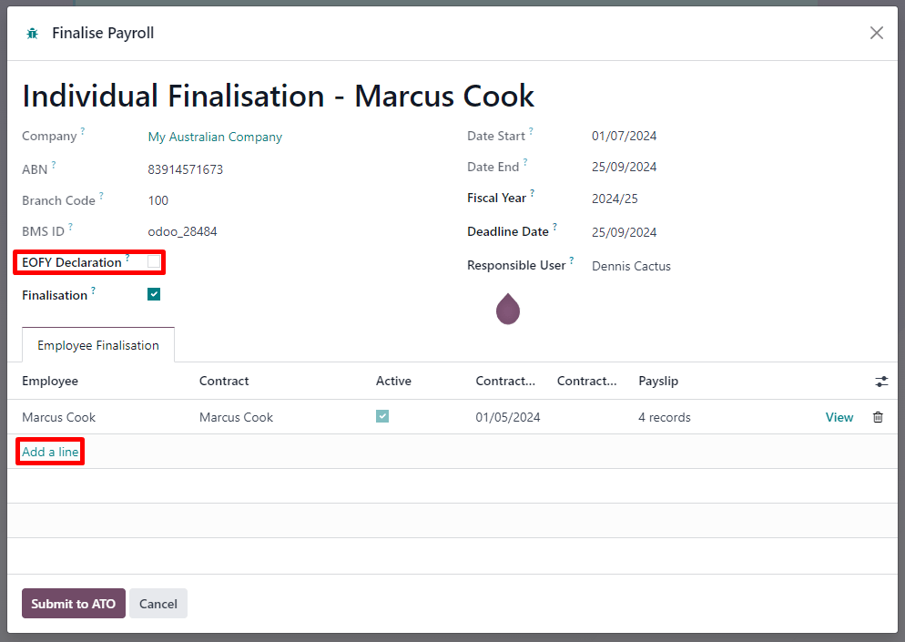
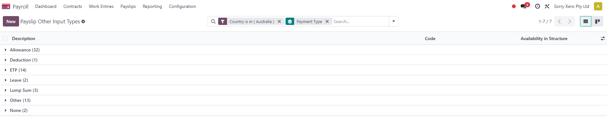
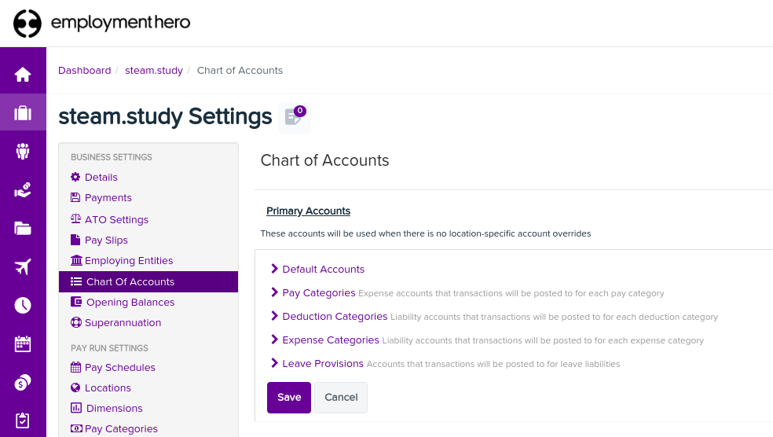

=========
Australia
=========

.. _payroll/l10n_au/payroll:

.. important::
   Odoo is currently in the process of becoming compliant with STP Phase 2 and SuperStream. An
   announcement will be made as soon as companies can use Odoo for payroll as a one-stop platform.

Setting up employees
====================

Employee settings
-----------------

Create an employee by going to :menuselection:`Employees --> New`. Go to the :guilabel:`Settings`
tab, and configure the :guilabel:`Australian Payroll` section, for example checking if they are
:guilabel:`Non-resident`, if they benefit from the :guilabel:`Tax-free Threshold`, their
:guilabel:`TFN Status`, :guilabel:`Employee Type`, etc.

Employee private information
----------------------------

In addition, some personal employee information is required for payroll compliance with Single Touch
Payroll, and to process superannuation payments. Open the employee's :guilabel:`Private Information`
tab and fill in the following fields:

- :guilabel:`Private Address`
- :guilabel:`Private Email`
- :guilabel:`Private Phone`
- :guilabel:`Date of Birth`

.. note::
   Odoo will remind you to complete the required data at different stages of the process.

Super accounts and funds
------------------------

You can add the superannuation details of new employees under the employee's :guilabel:`Super
Accounts` tab. Click :guilabel:`Add a line` and make sure to include the :guilabel:`Member Since`
date, :guilabel:`Member Number`, and :guilabel:`Super Fund`.

..  tip::
    Use the :guilabel:`Proportion` field if an employee's contributions should sent to multiple
    funds at a time.

.. image:: australia/payroll-super-account.png
   :alt: Configuring a super fund and super account for the Australian payroll localization.

To create a new :guilabel:`Super Fund`, start typing its name and click :guilabel:`Create and
edit...`. Fill in its:

- :guilabel:`Address`
- :guilabel:`ABN`
- :guilabel:`Type` (APRA / SMSF)
- unique identifier (:guilabel:`USI` for APRA, :guilabel:`ESA` for SMSF)
- (for SMFS only) :guilabel:`Bank Account`

..  tip::
    Manage all super accounts and funds by going to :menuselection:`Payroll --> Configuration -->
    Super Funds` or :menuselection:`Super Accounts`.

.. important::
   Odoo is currently in the process of becoming SuperStream-compliant.

Contracts
---------

Once the employee has been created, create their employment contract by clicking the :icon:`fa-book`
:guilabel:`Contracts` smart button, or by going to :menuselection:`Employees --> Employees -->
Contracts`.

.. note::
   Only one contract can be active per employee at a time. However, an employee can be assigned
   consecutive contracts during their employment.

Employment contract creation: recommended steps
~~~~~~~~~~~~~~~~~~~~~~~~~~~~~~~~~~~~~~~~~~~~~~~

1. Basic contractual information
~~~~~~~~~~~~~~~~~~~~~~~~~~~~~~~~

- Select the :guilabel:`Contract Start Date` and :guilabel:`Working Schedule` (set, or flexible for
  casual workers).
- Keep the :guilabel:`Salary Structure Type` set to :guilabel:`Australian Employee`. This structure
  covers all of the ATO's tax schedules.

.. _payroll/l10n_au/work-entry-source:

- (if using the Attendances or Planning app) Select the :guilabel:`Work Entry Source` to define how
  working hours and days are accounted for on the employee's payslip.

  - :guilabel:`Working Schedule`: work entries are automatically generated based on the employee's
    working schedule, starting from the contract's start date.

    .. example::
       An employee works 38 hours a week, their contract begins on 01/01, today's date is 16/01, and
       the user generates a pay run from 14/01 to 20/01. The working hours on the payslip will be
       automatically calculated to be 38 hours (5 * 7.36 hours) if no unpaid leave is taken.

  - :guilabel:`Attendances`: the working schedule is ignored, and work entries are only generated
    after clocking in and out of the Attendances app. Note that attendances can be imported.
  - :guilabel:`Planning`: the working schedule is ignored, and work entries are generated from
    planning shifts in the Planning app.

  .. important::
     Timesheets do not impact work entries in Odoo. If you need to import your timesheets in Odoo,
     import them by going to :menuselection:`Payroll --> Work Entries --> Work Entries` instead.

2. Salary Information tab
~~~~~~~~~~~~~~~~~~~~~~~~~

- :guilabel:`Wage Type`: select :guilabel:`Fixed Wage` for full-time and part-time employees, and
  :guilabel:`Hourly Wage` for casual workers. The latter allows you to add a :guilabel:`Casual
  Loading` percentage.

  .. note::
     For hourly workers, the :guilabel:`Hourly Wage` field should exclude casual loading.

- :guilabel:`Schedule Pay`: in Australia, only the following pay run frequencies are accepted:
  :guilabel:`Daily`, :guilabel:`Weekly`, :guilabel:`Bi-weekly` (or fortnightly),
  :guilabel:`Monthly`, and :guilabel:`Quarterly`.
- :guilabel:`Wage` /*period*: assign a wage to the contract according to their pay frequency. On
  payslips, the corresponding annual and hourly rates will be computed automatically.

3. Australia tab
~~~~~~~~~~~~~~~~

.. image:: australia/payroll-contract-australia.png
   :alt: Australia tab of a contract.

- :guilabel:`General`

  - Add the :guilabel:`Regular Pay Day` if relevant.
  - Enable :guilabel:`Report in BAS - W3` if you choose to add PAYG withholding amounts in BAS
    section W3 instead of W2 (refer to the `ATO's web page on PAYG withholding
    <https://www.ato.gov.au/businesses-and-organisations/preparing-lodging-and-paying/business-activity-statements-bas/in-detail/instructions/payg-withholding-how-to-complete-your-activity-statement-labels#W3Otheramountswithheldexcludinganyamount>`_
    for more information).

- :guilabel:`Leave loading / workplace giving`

  - Define whether your employees are :guilabel:`Eligible for Leave Loading`.
  - Set the :guilabel:`Workplace Giving Employee` amount in exchange for deductions.
  - Set the :guilabel:`Salary Sacrificed Workplace Giving` amount (e.g., receiving a benefit instead
    of a deduction).

- :guilabel:`Super contributions`

  - Add the :guilabel:`Extra Negotiated Super %` on top of the *super guarantee*.
  - Add the :guilabel:`Extra Compulsory Super %` as per industrial agreements or awards obligations.

- :guilabel:`Salary sacrifice`

  - :guilabel:`Salary Sacrifice Superannuation` allows employees to sacrifice part of their salary
    in favor of reportable employer superannuation contributions (RESC).
  - :guilabel:`Salary Sacrifice Other Benefits` allows them to sacrifice part of their salary
    towards some other form of benefit (refer to the `ATO's web page on Salary sacrificing for
    employees <https://www.ato.gov.au/individuals-and-families/jobs-and-employment-types/working-as-an-employee/salary-sacrificing-for-employees>`_
    for more information).

    .. note::
       As of Odoo 18, salary sacrificing for other benefits currently does not impact fringe
       benefits tax (FBT) reporting.

.. _payroll/l10n_au/salary-attachments:

4. Salary attachments
~~~~~~~~~~~~~~~~~~~~~

If the employee is to receive additional recurring payments every pay run, whether indefinitely or
for a set number of periods, click the :icon:`fa-book` :guilabel:`Salary Attachments` smart button
on the contract. Choose a :guilabel:`Type` and a :guilabel:`Description`.

.. note::
   Around 32 recurring salary attachment types exist for Australia. These are mostly related to
   allowances and child support. `Contact us <https://www.odoo.com/help>`_ for more information as
   to whether allowances from your industry can be covered.

5. Run the contract
~~~~~~~~~~~~~~~~~~~

Once all the information has been completed, change the contract stage from :guilabel:`New` to
:guilabel:`Running`.

Prepare pay runs
================

Regular
-------

Pay runs are created by going to :menuselection:`Payroll --> Payslips --> Batches`. After clicking
:guilabel:`New`, enter a :guilabel:`Batch Name`, select a :guilabel:`Period`, and click
:guilabel:`Generate Payslips`.

Employees on a pay run can be filtered down by :guilabel:`Department` and :guilabel:`Job Position`.
There is no limit to the amount of payslips that can be created in one batch. After clicking
:guilabel:`Generate`, one payslip is created per employee in the :guilabel:`Waiting` stage, in which
they can be reviewed and amended before validation.

On the payslip form view, there are two types of inputs:

- :guilabel:`Worked days` are computed based on the :ref:`work entry source set on the employee's
  contract <payroll/l10n_au/work-entry-source>`. :ref:`Work entries can be configured
  <payroll/l10n_au/work-entry-types>` according to different types: attendance, overtime,
  Saturday rate, Sunday rate, public holiday rate, etc.
- :guilabel:`Other inputs` are individual payments or amounts of :ref:`different types
  <payroll/l10n_au/other-input-types>` (allowances, lump sums, deductions, termination payments,
  leaves, etc.) that have little to do with the hours worked during the current pay period. The
  :ref:`previously configured salary attachments <payroll/l10n_au/salary-attachments>` are simply
  recurring other inputs attached to a contract.

Under the :guilabel:`Salary Computation` tab, Odoo automatically computes payslip rules based on
employees, contracts, worked hours, other input types, and salary attachments.

The salary structure *Australian Employee* has 35 payslip rules that automatically compute and
dynamically display according to the payslip inputs.

.. example::

   .. image:: australia/payroll-payslip-salary.png
      :alt: Salary computation tab of a payslip

   The following rules apply for that pay period in the above example:

   - :guilabel:`Basic Salary`: pre-sacrifice gross salary
   - :guilabel:`Ordinary Time Earnings`: amount to which the super guarantee percentage needs to be
     applied
   - :guilabel:`Salary Sacrifice Total`: includes the $150 sacrificed to superannuation
   - :guilabel:`Taxable Allowance Payments`: includes the $10 allowance (*cents per KM* in this
     case)
   - :guilabel:`Taxable Salary`: gross salary amount minus non-taxable amounts
   - :guilabel:`Salary Withholding` and :guilabel:`Total Withholding`: amounts to be withheld from
     the taxable salary
   - :guilabel:`Net Salary`: the employee's net wage
   - :guilabel:`Concessional Super Contribution`: in this scenario, the amount sacrificed to
     superannuation, payable to the employee's super fund in addition to the super guarantee
   - :guilabel:`Super Guarantee`: as of 01 July 2024, it is computed as 11.5% of the ordinary time
     earnings amount

.. note::
   As of Odoo 18, the most recent tax schedule rates (2024-2025) have been updated for all salary
   rules and computations.

Out-of-cycle
------------

In Australia, payslips created without a batch are considered to be *out-of-cycle* runs. Create them
by going to :menuselection:`Payroll --> Payslips --> Individual Payslips`. The same payslip rules
apply, but the way these payslips are submitted to the ATO in the frame of Single Touch Payroll
(STP) is slightly different.

.. important::
   As of Odoo 18, adding an out-of-cycle payslip to an existing batch is **not** recommended.

Finalise pay runs
=================

Validate payslips
-----------------

Once all payslip data is deemed correct, click :guilabel:`Create Draft Entry` on the payslip batch.
This can also be done payslip by payslip for control reasons.

This has several impacts:

- Marking the batch and its payslips as :guilabel:`Done`.
- Creating a draft accounting entry per payslip or one entry for the whole batch, depending on your
  payroll settings. At this stage, accountants can post entries to affect the balance sheet, P&L
  report, and BAS report.
- Preparing the STP submission (or payroll data to be filed to the ATO as part of STP compliance).
  This needs to be performed by the :guilabel:`STP Responsible` user, defined under
  :menuselection:`Payroll --> Configuration --> Settings`.
- Preparing super contribution lines as part of SuperStream compliance. This needs to be done by the
  :guilabel:`HR Super Send` user selected under :menuselection:`Payroll --> Configuration -->
  Settings`.

.. image:: australia/payroll-stp-record.png
   :alt: Example of a draft payslip.

Submit payroll data to the ATO
------------------------------

.. important::
   Odoo is currently in the process of becoming compliant with STP Phase 2, and this step described
   above does not submit data yet to the ATO.

As per ATO requirements, STP submission for a pay run needs to be done on or before the payday. For
this reason, submit your STP data to the ATO first before proceeding with payment. To do so, click
:guilabel:`Submit to ATO` on the payslip batch.

On the STP record for this pay run, a few useful information is displayed:

- a warning message if important information is missing,
- an automatically generated activity for the STP responsible user, and
- a summary of payslips contained in this pay run, auditable from this view.

.. image:: australia/payroll-stp-record.png
   :alt: Example of an STP record.

Once the STP record is ready to go, click :guilabel:`Submit to ATO`, then read and accept the
related terms and conditions.

Pay employees
-------------

Once the ATO submission is complete, you can proceed to pay your employees. To facilitate the
payment matching process, remember to post the payslip-related journal entries prior to validating a
payment.

Although you may decide to pay your employees individually, we recommend creating a batch payment
from your payslip batch. To do so, click :guilabel:`Pay` on the payslip batch, and select
:guilabel:`ABA Credit Transfer` as the :guilabel:`Payment Method`.

This has two impacts:

- Marking the batch and its payslips as :guilabel:`Paid`.
- Creating a :guilabel:`Payment Batch` linked to the payslip batch.

When receiving the bank statement in Odoo, you can now match the statement line with the batch
payment in one click. The payment is not reconciled against the payslip batch, and all individual
payslips.

Impact on accounting
--------------------

Depending on the employee and contract configuration, the journal entry linked to a payslip will be
more or less exhaustive.

.. example::
   For instance, here is the journal entry generated by the employee Marcus Cook configured above.

   .. image:: australia/payroll-accounting-entry.png
      :alt: Example of a journal entry for a payslip

Once posted, predefined accounts will impact the company's balance sheet (PAYGW, wages, and
superannuation liabilities) and profit & loss report (wages and superannuation expenses). In
addition, the employee's gross wage and PAYG withholding will update the BAS report for the relevant
period (see Tax Grid: W1 and W2). Accounts can be adjusted to the company's chart of accounts.

Other payroll flows
===================

Paying super contributions
--------------------------

.. important::
   Odoo has a partnership with a clearing house to process both superannuation payments and data to
   the right funds in one click, via direct debit. Odoo is currently in the process of becoming
   compliant with SuperStream, and an announcement will be made as soon as superannuation
   contributions can be processed via Odoo's payroll solution.

Once a quarter (or more frequently, in preparation for `Payday Super
<https://www.ato.gov.au/about-ato/new-legislation/in-detail/superannuation/payday-superannuation>`_),
you have to process superannuation payments to your employees' super funds. To do so, go to
:menuselection:`Payroll --> Reporting --> Super Contributions`.

When ready to pay, add the :guilabel:`Bank Journal` that will be used to pay the super from, then
click :guilabel:`Lock` to prevent the contributions from subsequent payslips from being added to
that file. Instead, a new Super file will be created.

Once the payment has been processed, it can be traced back to the Super file and matched with a bank
statement.

Terminating employees
---------------------

Employees can be terminated by going to :menuselection:`Payroll --> Reporting --> Terminate
Employee`.

The following fields must be completed:

- :guilabel:`Contract End Date`: once the termination is validated, this date will be added to the
  contract automatically, and mark the contract as :guilabel:`Expired` when the date has been
  reached.
- :guilabel:`Cessation Type Code`: a mandatory field for the ATO's STP reporting.
- :guilabel:`Termination Type`: the type of redundancy (genuine or non-genuine) affects the
  computation of unused annual and long service leave withholding.

The balance of unused annual leaves and long service leaves is displayed for reference.

Confirming the termination creates an out-of-cycle payslip with the tag :guilabel:`final pay`. It
computes the worked days until the contract end date, in addition to the employee's unused annual
and long service leave entitlements.

Odoo automatically computes unused leave entitlements based on the employee's current hourly rate
leave loading (for annual leaves only), and the remaining leave balance. However, these amounts can
be manually edited in the :guilabel:`Other Inputs` table if necessary.

Employment Termination Payments (ETP) can also be added to the :guilabel:`Other Inputs` table. Odoo
has a comprehensive list of excluded and non-excluded ETPs for companies to select from.

.. note::
   Withholding for unused leaves and ETPs is computed according to the ATO's `Schedule 7
   <https://www.ato.gov.au/tax-rates-and-codes/payg-withholding-schedule-7-tax-table-for-unused-leave-payments-on-termination-of-employment>`_
   and `Schedule 11 <https://www.ato.gov.au/tax-rates-and-codes/payg-withholding-schedule-11-tax-table-for-employment-termination-payments>`_
   and updated as of 01 July 2024.

.. tip::
   Once an employee has been terminated and the last detailed of their employment resolved, you can
   archive the employee by clicking the :icon:`fa-cog` (:guilabel:`Actions`) icon, then
   :icon:`oi-archive` :guilabel:`Archive` on the employee's form view.

Switching from another STP software to Odoo
-------------------------------------------

When switching from another STP-enabled software to Odoo, you might need to maintain the continuity
in the YTD values of your employees. Odoo allows importing employees' YTD values by going to
:menuselection:`Payroll --> Configuration --> Settings` and clicking :guilabel:`Import YTD
Balances`.

For the ATO to recognize the employee records of your previous software and keep a continuity in
Odoo, you must enter the:

- :guilabel:`Previous BMS ID` (one per database)
- :guilabel:`Previous Payroll ID` (one per employee)

Ask your previous software provider if you cannot find its BMS ID or your employees' payroll IDs.

This will give you the opportunity to add your employees' YTD opening balances in the current
fiscal year. The ATO reports on a lot of different types of YTD. These are represented by the 13
following :guilabel:`Salary Rules` in Odoo.

.. example::
   Let us say that the employee Marcus Cook has been transitioned from another STP-enabled software
   on September 1. Marcus has received two monthly payslips in his previous software (for July and
   August). Here are the YTD balances Marcus's company needs to transfer to Odoo:

   .. list-table::
      :header-rows: 1

      * - YTD category
        - YTD balance to transfer
      * - Gross (normal attendance)
        - $13,045.45
      * - Gross (overtime)
        - $1,000
      * - Paid leave
        - $954.55
      * - Laundry allowance
        - $200
      * - Total withholding
        - $2,956
      * - Super Guarantee
        - $1,610

If some YTD balances need to be reported with more granularity to the ATO, you can use the salary
rule's inputs.

.. example::
   For instance, the *Basic Salary* rule can contain six inputs, and three are necessary in our
   example: regular gross amounts, overtime, and paid leaves. These are all reported differently in
   terms of YTD amounts.

   .. image:: australia/payroll-ytd-basic-rule.png
      :alt: Adding YTD inputs

   The finalized YTD opening balances for Marcus Cook look like the following.

   .. image:: australia/payroll-ytd-final.png
      :alt: Example of finalized YTD opening balances

As a result, YTD computations on payslips are based on the employee's opening balances instead of
starting from zero.

STP finalisation
----------------

.. important::
   Odoo is currently in the process of becoming compliant with STP Phase 2, and the finalisation
   flows described below do not yet submit data to the ATO.

EOFY finalisation
~~~~~~~~~~~~~~~~~

Employers reporting through STP must make a finalization declaration by 14 July each year. To do so,
go to :menuselection:`Payroll --> Reporting --> STP Finalisation`.

Both active and terminated employees to finalise are displayed.

.. image:: australia/payroll-stp-eofy-list.png
   :alt: List of employees to finalise.

From the finalisation form view, you can proceed with a final audit of all employees' payslips
during the relevant financial year. Once ready, click :guilabel:`Submit to ATO`. When you have made
the finalisation declaration, employees will see the status of their payment information change to
:guilabel:`Tax ready` on their online income statement after the end of the financial year.

Individual finalisation
~~~~~~~~~~~~~~~~~~~~~~~

Odoo also allows you to finalise employees individually during the year. This can be useful when:

- one-off payments are made after a first finalisation; and
- finalisation after termination of employment during the year.

To proceed with an individual finalisation, go to :menuselection:`Payroll --> Reporting --> STP
Finalisation`, leave the :guilabel:`EOFY Declaration` checkbox unticked, and manually add employees
to be finalised.

Even if you finalise an employee record partway through the financial year, the ATO will not
pre-fill the information into the employee's tax return until after the end of the financial year.

Adjustments
-----------

.. important::
   Odoo is currently in the process of becoming compliant with STP Phase 2, and the adjustment flows
   described below do not yet submit data to the ATO.

Amend finalisation
~~~~~~~~~~~~~~~~~~

If you need to amend YTD amounts for an employee after a finalisation declaration was made, it is
still possible to remove the finalisation indicator for that employee. To do so, go to
:menuselection:`Payroll --> Reporting --> STP Finalisation`, select the employee, and leave the
:guilabel:`Finalisation` checkbox unticked.

When ready, click :guilabel:`Submit to ATO` to file the finalisation update to the ATO.

Once the correct YTD details are ready for that employee after amendment, finalise that employee
again.

.. note::
   The ATO expects employers to correct errors within 14 days of detection or, if your pay cycle is
   longer than 14 days (e.g., monthly), by the date you would be due to lodge the next regular pay
   event. Finalisation amendments can be done through STP up to five years after the end of the
   financial year.

Finalising and amending finalisation for a single employee can also be useful when rehiring an
employee within the same financial year.

Full file replacements
~~~~~~~~~~~~~~~~~~~~~~

An employer can make full file replacements of pay runs to replace the last lodgement sent to the
ATO if it turns out to contain significantly inaccurate data.

To do so, open the last STP submission and click :guilabel:`Replace File`. Then, select which
payslips need to be reset by ticking the :guilabel:`Reset Payslip` checkbox.

Resetting payslips does not create new payslips or a new pay run, but instead:

- The payslips batch is reset from :guilabel:`Paid` or :guilabel:`Done` to :guilabel:`Confirmed`.
- The status of the reset payslips revert back to :guilabel:`Draft`.
- The correct payslips remain paid and matched against the original payment.
- A new STP submission is created to replace the former one. For traceability purposes, the former
  STP submission is not deleted but marked as replaced.

First, correct the reset payslips and create their draft entry. Once done, the :guilabel:`Submit to
ATO` reappears on the payslip batch to process the full file replacement.

.. image:: australia/payroll-stp-resubmit.png
   :alt: Resubmitting a payslip batch.

When ready, submit the pay run to the ATO once again. Please note that full file replacements are
only meant as a last resort to amend a substantial amount of erroneous data. When possible, the ATO
recommends correcting an incorrect payslips by submitting a correction as part of the next pay run
or via update event.

Moreover, it is not possible to submit a second full file replacement of the same submission, and a
full file replacement can only be done once every 24 hours.

Zero out YTD values
~~~~~~~~~~~~~~~~~~~

In case of a mid-year change of several key identifiers, YTD values need to be zeroed out, and then
re-posted with the updated key identifier.

For the following **company identifiers**, all employees need to be zeroed out:

- ABN
- Branch Code
- BMS ID

For the following **employee identifiers**, only individual employees can be zeroed out:

- TFN
- Payroll ID

#. Before updating any key identifiers, create a new STP submission by going to
   :menuselection:`Payroll --> Reporting --> Single Touch Payroll` and:

   - Change the :guilabel:`Submission Type` to :guilabel:`Update`.
   - Tick the :guilabel:`Zero Out YTD` checkbox.
   - Click :guilabel:`Add a line` to specify which employees.
   - Click :guilabel:`Submit to ATO`.

   .. image:: australia/payroll-stp-zero-out.png
      :alt: Creating a new STP submission to zero out YTD values.

#. Once that is done, modify the key identifier(s) to amend.

#. Finally, go back to :menuselection:`Payroll --> Reporting --> Single Touch Payroll` to create and
   submit a new :guilabel:`Update`, this time without ticking the :guilabel:`Zero Out YTD` checkbox.
   This will notify the ATO that the previously recorded YTD balances are to be adjusted to the new
   key identifiers.

Payroll links to other apps
===========================

Time Off
--------

The :doc:`Time Off app <../../../hr/time_off>` is natively integrated with the Payroll app in Odoo.
Different types of leaves will populate payslips based on the concept of *work entries*.

Go to :menuselection:`Time Off --> Configuration --> Time Off Types`, and for each type, configure
the following two fields under the :guilabel:`Payroll` section:

- :guilabel:`Work Entry Type`: defines which work entry should be selected on the :guilabel:`Worked
  Days` table of the payslip.
- :guilabel:`Unused Leave Type`: choose between :guilabel:`Annual`, :guilabel:`Long Service`, or
  :guilabel:`Personal Leave`. If :guilabel:`Personal Leave` is selected, the remaining leave balance
  for this time off type will not show up as an entitlement at the time of termination. Unused
  leaves of the type :guilabel:`Annual` will include leave loading if the employee is eligible for
  it.

Expenses
--------

The :doc:`Expenses app <../../../finance/expenses>` is also natively integrated with the **Payroll**
app in Odoo. First of all, go to :menuselection:`Expenses --> Configuration --> Settings` and enable
:guilabel:`Reimburse in Payslip`.

When an employee on your payroll submits an approved expense to be reimbursed, you can reimburse
them using two ways:

- If the expense is to be reimbursed outside of a pay run, click :guilabel:`Post Journal Entries`.
  The payment must be made manually.
- If the expense is to be reimbursed as part of the next pay run, click :guilabel:`Report in Next
  Payslip` instead.

After an expense has been added to the next payslip, you can find it in the :guilabel:`Other Inputs`
table. This input type is then computed as an addition to the net salary.

After paying the employee, the payslip's journal item related to the employee's reimbursement is
automatically matched against the expense's vendor bill.

Advanced configurations
=======================

.. _payroll/l10n_au/other-input-types:

Other input types
-----------------

You can access other input types by going to :menuselection:`Payroll --> Configuration --> Other
Input Types`. There are 63 other input types related to Australia. We do not recommend using the
other ones as part of your payroll solution, since they cannot be used in the frame of STP. You can
archive or delete them.

On each input type, the following fields are important:

- :guilabel:`Payment Type` classifies input types in six categories:

  #. :guilabel:`Allowance`: a separate amount you pay to your employees in addition to salary and
     wages. Some of these allowances are mandated by modern awards: laundry, transport, etc.

     .. important::
        `Contact us <https://www.odoo.com/help>`_ if you plan to use allowances subject to varied
        rates of withholding (such as *cents per KM* or *travel allowances*) to see whether Odoo
        currently covers your business case.

     .. note::
        - As of Odoo 18, some allowances such as :guilabel:`Laundry: Allowance for approved
          uniforms` are managed by two other inputs: one to lodge the amount paid up to the ATO
          limit, and the other one to lodge the amount exceeding the ATO limit. This is necessary
          for Odoo to compute PAYGW correctly.
        - Some businesses may require to shift the reporting of an allowance from :guilabel:`OTE` to
          :guilabel:`Salary & Wages` depending on the employee. In this case, you must duplicate and
          re-configure an existing other input type. For example, :guilabel:`Work-Related
          Non-Expense` allowance is :guilabel:`OTE` by default.

  #. :guilabel:`Deduction`: union fees and child support deductions are considered deductions.
  #. :guilabel:`ETP`: employment termination payments. These are either considered excluded or
     non-excluded (see `ATO's web page on ETP components taxation <https://www.ato.gov.au/individuals-and-families/jobs-and-employment-types/working-as-an-employee/leaving-your-job/employment-termination-payments-for-employees/how-etp-components-are-taxed>`_).
  #. :guilabel:`Leave`: leave-related other inputs that are not pertaining to a single pay period
     (lump sum, cashing out leaves while in service, unused leaves, etc.).
  #. :guilabel:`Lump Sum`: return to work and lump sum E (for back payments) fall under this
     category.
  #. :guilabel:`Other`: other payments with their own specific logic.

- :guilabel:`PAYGW Treatment` affects how Odoo withholds tax for this input type:
  :guilabel:`Regular`, :guilabel:`No PAYG Withholding`, and :guilabel:`Excess Only` (for
  allowances).
- :guilabel:`Superannuation Treatment`: :guilabel:`OTE`, :guilabel:`Salary & Wages`, and
  :guilabel:`Not Salary & Wages`.
- :guilabel:`STP Code`: only visible in :ref:`developer mode <developer-mode>`, this field tells
  Odoo how to report the gross value of this payment to the ATO. We do not recommend changing the
  value of this field if it was already set by default.

Grouping other input types by :guilabel:`Payment Type` can help you understand the different
scenarios in which these inputs can be used.

.. _payroll/l10n_au/work-entry-types:

Work entry types
----------------

A *work entry type* is a type of attendance for employees (e.g., attendance, paid leave, overtime,
etc.). A few work entry types are created by default in every Australian database.

Before using Odoo's payroll solution for Australia, it is recommended you trim work entry types to
keep the ones you need only by going to :menuselection:`Payroll --> Configuration --> Work Entry
Types`

For each type, make sure to configure the following fields for Australia:

- :guilabel:`Is OTE`: determines whether time spent in this category can be considered ordinary time
  earnings, meaning that the superannuation guarantee rate will apply (e.g., regular attendance,
  paid leave, etc.).
- :guilabel:`Penalty Rate`: used to determine the percentage of penalty that applies to time spent
  in this category. It is important that you configure the penalty rate that applies in your state
  or industry according to the type of work (e.g., Saturday rate, Sunday rate, overtime rate, etc.).
- :guilabel:`STP Code`: only visible in :ref:`developer mode <developer-mode>`, this field tells
  Odoo how to report the time spent in this category to the ATO. We do not recommend changing the
  value of this field if it was already set by default.

Current limitations
===================

As of Odoo 18, we do not recommend companies to use the Payroll app for the following business
flows:

- Income stream types: Foreign Employment Income
- Tax treatment category: actors & performers
- Death benefits reporting
- Reporting obligations for WPN (instead of ABN)
- Allowances subject to a varied rate of withholding (such as *cents per kilometer* allowance and
  *travel allowances*)

`Contact us <https://www.odoo.com/help>`_ if you would like to make sure whether Odoo fits your
payroll requirements in Australia.

.. _payroll/l10n_au/employment-hero:

Employment Hero integration
===========================

If your business is already up and running with Employment Hero, you can use the connector as an
alternative payroll solution. The Employment Hero module synchronizes payslip accounting entries
(e.g., expenses, social charges, liabilities, taxes) automatically from Employment Hero to Odoo.
Payroll administration is still done in Employment Hero; Odoo only records the journal entries.

Configuration
-------------

#. :ref:`Install <general/install>` the Employment Hero Payroll module (`l10n_employment_hero`).
#. Configure the Employment Hero API by going to :menuselection:`Accounting --> Configuration -->
   Settings`. More fields become visible after ticking the :guilabel:`Enable Employment Hero
   Integration` checkbox.

   .. image:: australia/payroll-employment-hero-settings.png
      :alt: Enabling the Employment Hero integration.

   - Find the :guilabel:`API Key` in the :guilabel:`My Account` section of the Employment Hero
     platform.

     .. image:: australia/payroll-employment-hero-api-key.png
        :alt: Finding the Employment Hero API key under the My Account section.

   - The :guilabel:`Payroll URL` is pre-filled with `https://keypay.yourpayroll.com.au`.

     .. warning::
        Do not change the pre-filled :guilabel:`Payroll URL`.

   - Find the :guilabel:`Business Id` in the Employment Hero URL (e.g., `189241`).

     .. image:: australia/payroll-employment-hero-business-id.png
        :alt: Finding the Employment Hero Business ID in the URL.

   - Select any Odoo journal as the :guilabel:`Payroll Journal` to post the payslip entries.

#. Configure the tax by going to :menuselection:`Accounting --> Configuration --> Taxes`. Create the
   necessary taxes for the Employment Hero payslip entries. Fill in the tax code from Employment
   Hero in the :menuselection:`Matching Employment Hero Tax` field.

The API explained
-----------------

The API syncs the journal entries from Employment Hero to Odoo and leaves them in draft mode. The
reference includes the Employment Hero payslip entry ID in brackets for the user to easily retrieve
the same record in Employment Hero and Odoo.

By default, the synchronization happens once per week. It is possible to fetch the records manually
by going to :menuselection:`Accounting --> Configuration --> Settings` and, in the
:guilabel:`Employment Hero`, clicking :guilabel:`Fetch Payruns Manually`.

Employment Hero payslip entries also work based on double-entry bookkeeping. The accounts used by
Employment Hero are defined in the Payroll settings section.

For the API to work, you must create the same accounts as the default accounts of your Employment
Hero business (same name and same code) in Odoo. You also need to choose the correct account types
in Odoo to generate accurate financial reports.
