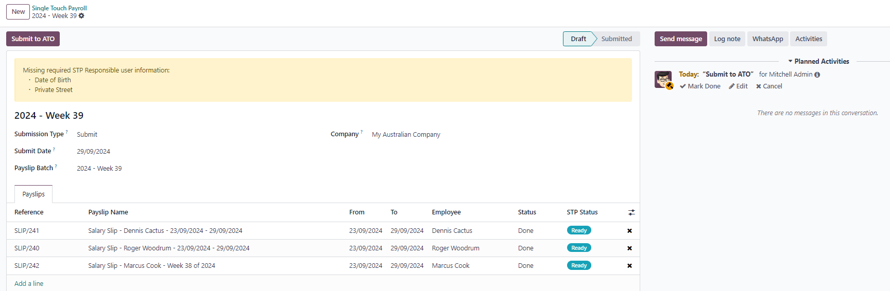

=========
Australia
=========

.. |YTD| replace:: :abbr:`YTD (Year to Date)`
.. |ATO| replace:: :abbr:`ATO (Australian Taxation Office)`

The Australian payroll localization covers salary computations for employees, including both
employee and employer payroll taxes. It accounts for all local and national regulations.

Before configuring the Australia localization, refer to the general :doc:`payroll <../../payroll>`
documentation, which includes the basic information for all localizations, as well as all universal
settings and fields.

.. important::
   As of Odoo 19, it is **not** recommended for companies to use the **Payroll** app for the
   following business flows:

   - Income stream types: *Foreign Employment Income*
   - Tax treatment category: *actors & performers*
   - Death benefits reporting
   - Reporting obligations for WPN (instead of ABN)
   - Allowances subject to a varied rate of withholding (such as cents per kilometer allowance and
     travel allowances)

  `Contact us <https://www.odoo.com/help>`_  to make sure Odoo fits the specific payroll
  requirements in Australia.

.. _payroll/au_apps:

Apps & modules
==============

:ref:`Install <general/install>` the following modules to get all the features of the Australia
payroll localization:

.. list-table::
   :header-rows: 1

   * - Name
     - Technical name
     - Dependencies
     - Description
   * - :guilabel:`Australia - Payroll`
     - `l10n_au_hr_payroll`
     - - hr_payroll
       - hr_work_entry_holidays
       - hr_payroll_holidays
       - base_address_extended
     - Provides Australian payroll basics, including employee tax details, salary structures
       (Basic/Gross/Net), and tax rules.
   * - :guilabel:`Australia - Payroll with Accounting`
     - `l10n_au_hr_payroll_account`
     - - l10n_au_hr_payroll
       - hr_payroll_account
       - l10n_au
       - l10n_au_aba
     - Links payroll and accounting by creating journal entries (per payslip if needed) to record
       payroll in the company's books.
   * - :guilabel:`Australia - Payroll with API`
     - `l10n_au_hr_payroll_api`
     - - l10n_au_hr_payroll_account
       - account_edi_proxy_client
       - auth_timeout
     - Provides STP and Super Stream compliance via the Superchoice API, with ATO-approved security
       controls including MFA, session timeouts, and audit logging.

.. seealso::
   :doc:`Configure the Australia fiscal localization
   <../../../finance/fiscal_localizations/australia>`

.. _payroll/au_gen:

General configurations
======================

First, the company must be configured. Navigate to :menuselection:`Settings app --> Users &
Companies --> Companies`. From the list, select the desired company, and ensure the following fields
are configured:

- :guilabel:`Company Name`: Enter the business name in this field.
- :guilabel:`Address`: Complete the full address, including the :guilabel:`City`, :guilabel:`State`,
  :guilabel:`Zip Code`, and :guilabel:`Country`.
- :guilabel:`Trading Name`: If the business has an unregistered alias (businesses could use these
  informally in Australia before May 2012), enter it here.

  .. important::
     In May 2012, the :abbr:`ASIC (Australian Securities and Investments Commission)` required
     businesses to register all names. From November 1, 2025 on, all unregistered trading names are
     retired from the :abbr:`ABR (Australian Business Register)`, and businesses are required to
     register their trading name as a business name.

- :guilabel:`ABN`: Enter the company's eleven-digit :abbr:`ABN (Australian Business Number)` in this
  field. After this is entered, click :guilabel:`Verify ABN`, to ensure the number is correct.
- :guilabel:`GST registered`: Tick this box if the company is registered for Australian :abbr:`GST
  (Goods and Services Tax)`.
- :guilabel:`ACN` Enter the company's nine-digit :abbr:`ACN (Australian Company Number)`. This
  number is issued by the :abbr:`ASIC (Australian Securities and Investments Commission)`.
- :guilabel:`Currency`: By default, :abbr:`AUD (Australian Dollars)` is selected. If not, select
  :guilabel:`AUD` from the drop-down menu.
- :guilabel:`Phone`: Enter the company phone number.
- :guilabel:`Email`: Enter the email used for general contact information.
- :guilabel:`Website`: Enter the company's web address.
- :guilabel:`Email Domain`: Enter the email domain for the company.
- :guilabel:`Color`: Select a color for the company.

.. image:: australia/sw-au.png
   :alt: Australian company form configured for Australia.

Payroll settings
----------------

In addition to configuring the company, some **Payroll** app settings must be configured. Navigate
to :menuselection:`Payroll app --> Configuration --> Settings`, and scroll to the
:guilabel:`Australian Localization` section.

Company Information
~~~~~~~~~~~~~~~~~~~

Configure the following fields in the :guilabel:`Company Information` section:

- :guilabel:`Branch Code`: Enter the six-digit :abbr:`BSB (Bank State Branch)` code. This identifies
  the specific bank and branch for payroll transactions.
- :guilabel:`Withholding Payer Number`: If available, enter the eight or nine-digit :abbr:`WPN
  (Withholding Payer Number)` issued by the ATO. This is for companies *not* entitled to an
  :abbr:`ABN (Australian Business Number)`.
- :guilabel:`Registered for Working Holiday Maker`: Tick this box if the company is registered for
  the :abbr:`WHM (Working Holiday Maker)` program. This indicates the company is registered with the
  ATO to withhold the correct taxes for employees working in Australia with an eligible visa, for a
  period of less than 12 months.
- :guilabel:`Registered for PALM Scheme`: Tick this checkbox if the company is registered for the
  :abbr:`PALM (Pacific Australia Labour Mobility)` scheme, which allows the company to hire
  employees from ten different Pacific island nations.

SuperStream and Single Touch Payroll
~~~~~~~~~~~~~~~~~~~~~~~~~~~~~~~~~~~~

Configure the following fields in the :guilabel:`SuperStream and Single Touch Payroll` section:

- :guilabel:`Payroll Mode`: Using the drop-down menu, select whether SuperStream and :abbr:`STP
  (Single Touch Payroll)` are in :guilabel:`Testing` mode, or :guilabel:`Production` (live) mode.
- :guilabel:`Registration Status`: This field is unable to be modified, as it displays the current
  registration status for the SuperStream and :abbr:`STP (Single Touch Payroll)` payroll.

.. important::
   Odoo is currently compliant with :guilabel:`SuperStream and Single Touch Payroll` Phase 2 and
   SuperStream. However, since this is relatively new, it is recommended the company contacts Odoo's
   sales or support teams *prior to* registration in **Production** mode, to ensure the
   configuration suits the business's needs.

To complete the registration process, click :guilabel:`Start Payroll Onboarding`, and a
:guilabel:`Payroll Onboarding` pop-up window loads. Select the :guilabel:`Payroll Responsible` user
using the drop-down menu. Once selected, the :guilabel:`Work Email` and :guilabel:`Work Phone`
fields are autopopulated with the user's contact information, and cannot be changed.

.. note::
   Only users of the database can be selected for the :guilabel:`Payroll Responsible`.

.. image:: australia/au-onboarding.png
   :alt: The first page of the onboarding pop-up window.

Next, click :guilabel:`Next Step`, and the status changes to :guilabel:`Authorised`, and displays
the question :guilabel:`Are you authorised to register for this service on behalf of your employer?`
Click :guilabel:`Yes` to confirm, then click :guilabel:`Next Step`.

The status changes to :guilabel:`Employer Details`, and displays the contact information for both
the company and the selected payroll responsible. Ensure the :guilabel:`Employer Details` and
:guilabel:`Employee Contact` are correct on the form.

If any information needs to be updated, exit the form and update the company or employee information
in the **Settings** app or **Employees** app, then return to the **Payroll** settings page. Click
the :guilabel:`Start Payroll Onboarding` button, and the pop-up window loads to the
:guilabel:`Employer Details` again.

.. image:: australia/au-employer-details.png
   :alt: The employer and responsible page of the onboarding pop-up window.

When the displayed information is correct, click :guilabel:`Next Step` and the status changes to
:guilabel:`Bank Details`. Using the drop-down menu, select the :guilabel:`Bank Journal` for payroll
using the drop-down menu. After a journal is selected, the :guilabel:`Bank Name`, :guilabel:`Bank
Name`, :guilabel:`Account Name`, :guilabel:`Bank Account Number`, and :guilabel:`BSB` fields are
populated with the selected bank journal's details, and **cannot** be modified. If any changes are
needed, exit the form and update the information for the journal in the **Accounting** app.

.. image:: australia/au-bank-details.png
   :alt: The bank info page of the onboarding pop-up window.

When the :guilabel:`Bank Details` are correctly filled out, click :guilabel:`Next Step`, and the
status changes to :guilabel:`Signature`. Two PDFs appear, :guilabel:`Odoo Terms & Conditions`, and
:guilabel:`SuperChoice FSG PDS DDA`. Download and read the two PDFs, then tick the two checkboxes
next to the :guilabel:`I have read and signed (PDF name)` lines.

Finally, click :guilabel:`Register` to complete the registration.

Employees
=========

Every employee being paid must have their employee profiles configured for the Australia payroll
localization. Additional fields are present after configuring the database for Australia.

To update an employee form, open the :menuselection:`Employees` app and click on the desired
employee record. On the employee form, configure the required fields in the related tabs.

Work tab
--------

Enter the :guilabel:`Work Address` for the employee in the :guilabel:`Location` section of the
:guilabel:`Work` tab.

Personal tab
------------

Ensure the employee has a minimum of one :ref:`trusted bank account <employees/private-contact>`
listed in the :guilabel:`Bank Accounts` field in the :guilabel:`Private Contact` section.

These accounts are used to pay the employee. Payroll **cannot** be processed for employees without a
*trusted* :ref:`bank account <employees/private-contact>`. If no trusted bank account is set, a
warning appears on the **Payroll** dashboard and an error occurs when attempting to run payroll.

.. image:: australia/au-bank.png
   :alt: Where bank account information is located on the employee profile.

Payroll tab
-----------

Contract overview section
~~~~~~~~~~~~~~~~~~~~~~~~~

This section holds information that drives salary calculations. Ensure the following fields are
configured:

- :guilabel:`Contract`: Ensure a start date is listed for the current contract.
- :guilabel:`Wage Type`: Select how the employee is paid.

  - Select :guilabel:`Fixed Wage` for salaried employees who receive the same amount each pay
    period.
  - Select :guilabel:`Hourly Wage` for employees paid based on hours worked.

  .. tip::
     Set a default :guilabel:`Wage Type` in the salary :ref:`Structure Type
     <payroll/structure-types>` to configure employees in bulk. If needed, the default can be
     overridden on individual employee records if exceptions are needed.

- :guilabel:`Wage`: Enter the wage, and select the corresponding time period. The available options
  are :guilabel:`Daily`, :guilabel:`Weekly`, :guilabel:`Fortnightly`, :guilabel:`Monthly`, and
  :guilabel:`Quarterly`.
- :guilabel:`Employee Type`: Select the *type* of employee.
- :guilabel:`Contract Type`: Determines how the employee is paid and classified, such as
  :guilabel:`Permanent`, :guilabel:`Temporary`, :guilabel:`Apprenticeship`.
- :guilabel:`Pay Category`: Select :guilabel:`Australia: Employee` for this field. This defines when
  the employee is paid, their default working schedule, and the work entry type it applies to.

Schedule section
~~~~~~~~~~~~~~~~

- :guilabel:`Work Entry Source`: Defines how :doc:`work entries <../work_entries>` are generated for
  payroll during the specified pay period. The options are:

  - :guilabel:`Working Schedule`: Based on the employee's assigned :ref:`working schedule
    <employees/schedule>` (e.g., 40 hours per week).
  - :guilabel:`Attendances`: Based on :doc:`approved checked-in hours
    <../../attendances/management>` in the **Attendances** app.
  - :guilabel:`Planning`: Based on :ref:`scheduled shifts <planning/shifts>` in the **Planning**
    app.

- :guilabel:`Working Hours`: Using the drop-down menu, select the default work schedule. This is
  particularly important for employees available to receive overtime pay (typically hourly
  employees, not salaried). The common selection is :guilabel:`AU Standard 38 hours/week`.

Deductions, offsets, and withholding section
~~~~~~~~~~~~~~~~~~~~~~~~~~~~~~~~~~~~~~~~~~~~

- :guilabel:`Child Support Deduction`: Enter the amount due each pay period for child support.
- :guilabel:`Child Support Garnishee Amount %`:
- :guilabel:`Withhold for Extra Pay`:
- :guilabel:`Withholding Variation`:
- :guilabel:`Additional Withholding Amount`:

Super contributions section
~~~~~~~~~~~~~~~~~~~~~~~~~~~

- :guilabel:`Extra Negotiated Super %`: Enter the percentage the company pays *in addition to* the
  government mandated minimum into the employee's :abbr:`RESC (Reportable Employer Superannuation
  Contributions)` (retirement) account.
- :guilabel:`Extra Compulsory Super %`:

General section
~~~~~~~~~~~~~~~

- :guilabel:`Regular Pay Day`: Select the day of the week the employee is paid using the drop-down
  menu.
- :guilabel:`Report in BAS - W3`:

Personal information section
~~~~~~~~~~~~~~~~~~~~~~~~~~~~

- :guilabel:`Non-resident`: Tick this checkbox if the employee is **not** a legal resident of
  Australia.
- :guilabel:`Tax-free Threshold`: If the employee **is** a legal Australian resident, this field
  appears.
- :guilabel:`TFN Status`: Using the drop-down menu, select the :abbr:`TFN (Tax Filing Number)`
  status of the employee. All options aside from :guilabel:`Declaration not completed...` are
  treated as if a :abbr:`TFN (Tax Filing Number)` is provided
- :guilabel:`Tax File Number`: If :guilabel:`Declaration provided` is selected for the
  :guilabel:`TFN Status` field, enter the tax filing number in the field. If another option was
  selected, this field is populated with a placeholder number, and **cannot** be modified.

Tax and contributions sections
~~~~~~~~~~~~~~~~~~~~~~~~~~~~~~

- :guilabel:`Employment Type`: Select the kind of employment the employee has. This affects tax
  calculations. Options are :guilabel:`Full time`, :guilabel:`Part time`, :guilabel:`Casual`,
  :guilabel:`Labour hire`, :guilabel:`Voluntary agreement`, :guilabel:`Death beneficiary`, or
  :guilabel:`Non-employee.`
- :guilabel:`Income Stream Type`: Select where the employee is receiving their pay from. The typical
  employee is :guilabel:`Salary and wages`, however some other circumstances may require a different
  selection.
- :guilabel:`Tax Treatment Category`:
- :guilabel:`HELP / STSL`: Tick this checkbox if the employee is a :abbr:`STSL (Study Training
  Support Loan)` recipient.
- :guilabel:`Medicare Variation Form`:

Leave loading / workplace giving section
~~~~~~~~~~~~~~~~~~~~~~~~~~~~~~~~~~~~~~~~

- :guilabel:`Eligible for Leave Loading`:
- :guilabel:`Workplace Giving Employee`:
- :guilabel:`Salary Sacrificed Workplace Giving`:

Salary sacrifice section
~~~~~~~~~~~~~~~~~~~~~~~~

- :guilabel:`Salary Sacrifice Superannuation`: Enter the amount per pay period the employee provides
  to the *company*, which then puts that amount into the employee's :abbr:`RESC (Reportable Employer
  Superannuation Contributions)` account, which is an Australian retirement account.
- :guilabel:`Salary Sacrifice Other Benefits`: Enter the amount per pay period the employee puts
  aside towards some other benefit. Refer to the `ATO's web page on Salary sacrificing for employees
  <https://www.ato.gov.au/individuals-and-families/jobs-and-employment-types/working-as-an-employee/salary-sacrificing-for-employees>`_.
  for more information.

.. note::
   As of Odoo 18, salary sacrificing for other benefits currently does not impact :abbr:`FBT (Fringe
   Benefits Tax)` reporting.

Super accounts tab
------------------

A super account is the term for an Australian retirement savings account. This tab houses the
employee's various retirement accounts, or *super funds*.

Click :guilabel:`add a line`, and a :guilabel:`Create Super Accounts` pop-up window loads. Enter the
following information in the pop-up window:

- :guilabel:`Employee`: Ensure the employee is selected in this field.
- :guilabel:`TFN`: The :abbr:`TFN (Tax Filing Number)` entered in the *Payroll* tab of the employee
  form populates this field, and **cannot** be modified.
- :guilabel:`Member Since`: By default, the current date populates this field. Select the date the
  employee created the super fund.
- :guilabel:`Active`: Enable this option if the account is active (this is the likely scenario).
- :guilabel:`Proportion`: Enter the percentage amount being added to the account. By default, the
  field displays `100`.
- :guilabel:`Super Fund`: Using the drop-down menu, select the specific kind of account the super
  fund is associated with.
- :guilabel:`Fund ABN`: This field is autopopulated with the selected :guilabel:`Super Fund`
  :abbr:`ABN (Australian Business Number)`, and **cannot** be modified.
- :guilabel:`Member Number`: After selecting a :guilabel:`Super Fund`, this field appears. Enter the
  member number for the employee's super fund account.

.. image:: australia/create-super.png
   :alt: A Create Super Accounts form all filled out.

.. tip::
   Manage all super funds by navigating to :menuselection:`Payroll --> Configuration --> Super
   Funds`, and manage all super accounts by navigating to :menuselection:`Payroll --> Configuration
   --> Super Accounts`.

.. important::
   Odoo is currently in the process of becoming SuperStream-compliant.

Payroll configuration
=====================

Several sections within the **Payroll** app also installs a salary structure, structure type, rules,
and parameters specific to Australia.

Salary structures & structure types
-----------------------------------

When the **l10n_au_hr_payroll** module is :ref:`installed <payroll/au_apps>`, a new
:guilabel:`Salary Structure` gets installed, :guilabel:`Australian Employee`. This structure
includes one :guilabel:`Structure Type`, :guilabel:`Australian Employee  Pay`.

The :guilabel:`Salary Structure` contains all the individual :ref:`salary rules <payroll/au_apps>`
that informs the **Payroll** app how to calculate employee payslips.

.. image:: australia/au-structure-types.png
   :alt: The Australian salary structure in the salary structures list.

.. _payroll/au_rules:

Salary rules
------------

To view the salary rules that inform the salary structure what to do, navigate to
:menuselection:`Payroll app --> Configuration --> Structures` and expand the :guilabel:`Australian
Employee` group to reveal the :guilabel:`Australian Employee Pay` structure type. Click
:guilabel:`Australian Employee Pay` to view the detailed salary rules.

.. image:: australia/au-rules-top-half.png
   :alt: The top portion of the Australian salary rules.

Rule parameters
---------------

Some calculations require specific rates associated with them, or wage caps. *Rules Parameters* are
capable of listing a value, either a percentage or a fixed amount, to reference in the salary rules.

Most rules pull information stored in the parameters module to get the rate of the rule (a
percentage) and the cap (a dollar amount).

To view rule parameters, navigate to :menuselection:`Payroll app --> Configuration --> Rule
Parameters`. Here, all rule parameters are displayed with their linked :guilabel:`Salary Rules`,
which can be accessed. Review the parameters associated with a rule by looking for the
:guilabel:`Name` of the rule, and make any edits as needed.

.. important::
   Odoo adds updated rule parameters for the current calendar year. It is **not** recommended to
   edit rule parameters **unless a national or local parameter has changed**, and is different from
   the rule parameters created by Odoo. Check with all local and national regulations *before*
   making any changes to rule parameters.

Run Australian payroll
======================

Before running payroll, the payroll officer must validate employee :doc:`work entries
<../work_entries>` to confirm pay accuracy and catch errors. This includes checking that all time
off is approved and any overtime is appropriate.

Work entries sync based on the employee's :doc:`contract <../contracts>` configuration. Odoo pulls
from the assigned working schedule, attendance records, planning schedule, and approved time off.

Any :ref:`discrepancies or conflicts <payroll/conflicts>` must be resolved, then the work entries
can be :ref:`regenerated <payroll/regenerate-work-entries>`.

Once everything is correct, draft payslips can be :ref:`created individually <payroll/process>` or
in :doc:`batches <../batches>`, referred to in the **Payroll** app as *Pay Runs*.

.. important::
   In Australia, :ref:`individual payslips <payroll/process>` (not part of a pay run) are considered
   *out-of-cycle* runs. The same payslip rules apply, but the way individual payslips are submitted
   to the ATO in the framework of :abbr:`STP (Single Touch Payroll)` is slightly different.

   As of Odoo 18, adding an out-of-cycle payslip to an existing batch is **not** recommended.

.. image:: australia/au-work-entries.png
   :alt: The work entries for a pay run, with some time off entered in the work entries.

.. note::
   To cut down on the payroll officer's time, it is typical to process payslips in batches, either
   by wage type (fixed salary vs hourly), pay schedule (weekly, bi-weekly, monthly, etc.),
   department (direct cost vs. administration), or any other grouping that best suits the company.

The process of running payroll includes different actions that need to be executed to ensure that
the amount withheld from payroll taxes is correct, the amount that the employee receives as their
net salary is correct, and the computation of hours worked reflects the employee's actual hours
worked, among others.

When running a payroll batch, check that the period, company, and employees included are correct
*before* starting to analyze or validate the data.

Once the payslips are drafted, review them for accuracy. Check the :guilabel:`Worked Days & Inputs`
tab, and ensure the listed worked time is correct, as well as any other inputs. Add any missing
inputs, such as commissions, tips, reimbursements, that are missing.

Next, check the various totals (gross pay, employee taxes, benefits, employer taxes, net salaries),
then click :guilabel:`Compute Sheet` to update the salary calculations, if there were edits. If
everything is correct, click :guilabel:`Create Draft Entry`.

.. image:: australia/au-check-payslips.png
   :alt: The worked days tab of a payslip.

Accounting check
----------------

The accounting process when running payroll has two components: :ref:`creating journal entries
<payroll/journal>`, and :ref:`registering payments <payroll/register>`.

.. _payroll/journal:

Journal entry creation
~~~~~~~~~~~~~~~~~~~~~~

After payslips are confirmed and validated, journal entries are posted either individually, or in a
batch. The journal entry is created first as a draft.

.. important::
   It must be decided if journal entries are done individually or in batches *before* running
   payroll.

Four accounts from the Australian :abbr:`CoA (Chart of Accounts)` are included with the payroll
localization:

- `611000 Salaries & Wages`:
- `230100 Employee Payroll Taxes`:
- `230200 Employer Payroll Taxes`:
- `230000 Salary Payable`:

.. note::
   The :abbr:`CoA (Chart of Accounts)` configuration is done by default when a company is located in
   Australia. The account codes and names can be edited to suit the company's needs. If there is no
   :abbr:`CoA (Chart of Accounts)` account associated with a salary rule (used in a salary
   structure), Odoo uses the account `Salary Expenses` to create the journal entry, regardless of
   the nature of the move.

If everything seems correct on the journal entry draft, post the journal entries.

.. _payroll/register:

Register Payments
-----------------

After the :ref:`journal entries <payroll/journal>` are validated, Odoo can generate payments.

.. important::
   To generate payments from payslips,employees **must** have a *trusted* bank account. If the
   employee's bank account is *not* marked as `trusted`, ATO files **cannot** be generated through
   Odoo.

Payments can be :guilabel:`Grouped by Partner` if there is a partner associated with a salary rule.

Submit payroll data to the ATO
------------------------------

As per ATO requirements, :abbr:`STP (Single Touch Payroll)` submissions for a pay run **must** be
done *on or before* the payday. For this reason, submit :abbr:`STP (Single Touch Payroll)` data to
the ATO **before** proceeding with payment. To submit the data, click :guilabel:`Submit to ATO` on
the pay run.

.. tip::
   A warning message appears if important information is missing.

On the :abbr:`STP (Single Touch Payroll)` record for the pay run, an automatically generated
activity for the :abbr:`STP (Single Touch Payroll)` responsible user appears, and a summary of
payslips contained in the pay run, which is able to be audited from this view.

Once the :abbr:`STP (Single Touch Payroll)` record is ready, click :guilabel:`Submit to ATO`, then
read and accept the related terms and conditions.

.. important::
   Odoo has a partnership with a clearing house to process both superannuation payments and data to
   the right funds in one click, via direct debit.

   Odoo is currently in the process of becoming compliant with SuperStream, and an announcement will
   be made as soon as superannuation contributions can be processed via Odoo's payroll solution.

Once a quarter, or more frequently, in preparation for Payday Super, process the superannuation
payments to your employees' super funds. To do so, go to :menuselection:`Payroll --> Reporting -->
Super Contributions`.

When ready to pay, add the :guilabel:`Bank Journal` that is used to pay the super from, then click
:guilabel:`Lock` to prevent the contributions from subsequent payslips from being added to that
file. Instead, a new Super file is created.

Once the payment has been processed, it can be traced back to the Super file and matched with a bank
statement.

Adjustments
-----------

Amend finalisation
~~~~~~~~~~~~~~~~~~

If needed, YTD amounts for an employee can be amended *after* a finalisation declaration is made,
removing the finalisation indicator for that employee. To do so, navigate to :menuselection:`Payroll
app --> Reporting --> STP Finalisation`, select the desired employee, then uncheck the
:guilabel:`Finalisation` checkbox.

When ready, click :guilabel:`Submit to ATO` to file the finalisation update to the ATO.

Once the correct YTD details are ready for that employee after amendment, finalise that employee
again.

.. note::
   The ATO expects employers to correct errors *within 14 days of detection* or, if the pay cycle is
   longer than 14 days (e.g., monthly), by the date due to lodge the next regular pay event.
   Finalisation amendments can be done through STP up to five years after the end of the financial
   year.

.. tip::
   Finalising and amending finalisation for a single employee can be useful when rehiring an
   employee within the same financial year.

Full file replacements
~~~~~~~~~~~~~~~~~~~~~~

An employer can make full file replacements of pay runs that contain significantly inaccurate data,
replacing the last lodgement sent to the ATO.

To do so, open the last STP submission and click :guilabel:`Replace File`. Then, select which
payslips need to be reset by ticking the :guilabel:`Reset Payslip` checkbox.

Resetting payslips does **not** create new payslips or a new pay run, but instead:

- The payslips batch is reset from :guilabel:`Paid` or :guilabel:`Done`, to :guilabel:`Confirmed`.
- The status of the reset payslips revert back to :guilabel:`Draft`.
- The correct payslips remain :guilabel:`Paid` and matched against the original payment.
- A new STP submission is created to replace the former one.

  .. note::
     For traceability purposes, the former STP submission is **not** deleted, but marked as
     replaced.

First, correct the reset payslips and create a draft entry. Once done, the :guilabel:`Submit to ATO`
button reappears on the payslip batch to process the full file replacement.

When ready, submit the pay run to the ATO again.

.. important::
   Full file replacements are only meant as a **last resort** to amend a substantial amount of
   erroneous data. When possible, the ATO recommends correcting incorrect payslips by submitting a
   correction as part of the next pay run or via update event.

   Moreover, it is **not** possible to submit a second full file replacement of the same submission,
   and a full file replacement can **only** be done *once every 24 hours*.

Zero out YTD values
~~~~~~~~~~~~~~~~~~~

In case of a mid-year change of several key identifiers, YTD values need to be zeroed out, and then
re-posted with the updated key identifier.

The following *company* identifiers need to be zeroed out for all employees:

- ABN
- Branch Code
- BMS ID

The following *employee* identifiers can be zeroed out for individual employees:

- TFN
- Payroll ID

Before updating any key identifiers, create a new STP submission by navigating to
:menuselection:`Payroll --> Reporting --> Single Touch Payroll` and:

- Change the :guilabel:`Submission Type` to :guilabel:`Update`.
- Tick the :guilabel:`Zero Out YTD` checkbox.
- Click :guilabel:`Add a line` to specify which employees.
- Click :guilabel:`Submit to ATO`.

Next, modify the key identifiers to amend them. Finally, go back to :menuselection:`Payroll -->
Reporting --> Single Touch Payroll` and create and submit a new Update, this time without ticking
the :guilabel:`Zero Out YTD` checkbox.

This will notify the ATO that the previously recorded YTD balances are to be adjusted to the new key
identifiers.

Advanced configurations
=======================

In some cases, if there is a need to add more inputs to an employee's salary that are not covered by
the default input type, other input types can be configured or created.

Other input types
-----------------

To edit or create another input types, navigate to :menuselection:`Payroll --> Configuration -->
Other Input Types`. To modify an existing type, click on the rule and make the desired changes. To
create a new input type, click :guilabel:`New`, then fill out the :guilabel:`Payslip Other Input
Types` form.

.. important::
   A total of sixty-three other input types are related to the Australia payroll localization. It is
   **not** recommended to use these other input types, since they **cannot** be used in the frame of
   STP. These can be archived or deleted.

On each input type being used, ensure the following fields are populated:

- :guilabel:`Payment Type`: Select the classification for the input types using the drop-down menu.
  The default options are:

  - :guilabel:`ETP`: The input is an :abbr:`ETP (Employment Termination Payments)`. These are either
    considered excluded or non-excluded. Refer to the ATO web page on :abbr:`ETP (Employment
    Termination Payments)` components taxation.
  - :guilabel:`Allowance`: The input is a separate amount paid to employees in addition to their
    salary and wages. Some of these allowances are mandated by modern awards, such as laundry,
    transportation, etc.

  .. important::
     Contact Odoo if planning to use allowances subject to varied rates of withholding (such as
     cents per kilometer or travel allowances) to ensure Odoo currently covers the particular
     business case.

  .. note::
    As of Odoo 18, some allowances, such as :guilabel:`Laundry`, which is used for approved
    uniforms, are managed by two other inputs: one to lodge the amount paid up to the ATO limit, and
    the other one to lodge the amount exceeding the ATO limit. This is necessary for Odoo to compute
    PAYGW correctly. Some businesses may require to shift the reporting of an allowance from OTE to
    Salary & Wages depending on the employee. In this case, the input type must be duplicated and
    reconfigured from an existing other input type. For example, :guilabel:`Work-Related
    Non-Expense: Allowance to compensate for specific work, activities, disabilities, skills or
    qualifications` is OTE by default.

  - :guilabel:`Deduction`: The input is a deduction such as union fees and child support.
  - :guilabel:`Leave`: The input is a leave-related other input that does not pertain to a single
    pay period (lump sum, cashing out leaves while in service, unused leaves, etc.).
  - :guilabel:`Lump Sum`: This input is a return to work and lump sums (for back payments).
  - :guilabel:`Other`: The input is another payment with its own specific logic.

- :guilabel:`PAYGW Treatment`: This field affects how Odoo withholds tax for the input type. Using
  the drop-down menu, select either: :guilabel:`Regular`, :guilabel:`No PAYG Withholding`, or
  :guilabel:`Taxed above ATO limit`
- :guilabel:`Superannuation Treatment`: Using the drop-down menu, select if the input is considered
  a :guilabel:`OTE` (one-time earning), :guilabel:`Salary & Wages`, or :guilabel:`Not Salary &
  Wages`.
- :guilabel:`STP Code`: This field is only visible in developer mode. This field tells Odoo how to
  report the gross value of the payment to the ATO. It is **not** recommended to change the value of
  this field if it is already populated by default.
- :guilabel:`Is OTE`: This field determines whether time spent in this category can be considered
  ordinary time earnings, meaning that the superannuation guarantee rate will apply (e.g., regular
  attendance, paid leave, etc.).
- :guilabel:`Penalty Rate`: This field is used to determine the percentage of penalty that applies
  to time spent in this category. It is important to configure the penalty rate that applies in the
  state or industry according to the type of work (e.g., Saturday rate, Sunday rate, overtime rate,
  etc.).

Close Payroll
-------------

If there are no errors, payroll is completed for the pay period.

Reports
=======

The Australian localization contains several reports unique to Australia, which provide information
on superfund contributions, single touch payroll, :abbr:`STP (Single Touch Payroll)`  Finalisation,
and the ability to terminate employees.

Super contributions
-------------------

Single touch payroll
--------------------

STP Finalisation
----------------

The fiscal year in Australia ends on June 30th, but :abbr:`STP (Single Touch Payroll)` finalisation
declarations are due by July 14th. These can be done in :ref:`one single report for all employees
<payroll/stp-total>`, or :ref:`individually <payroll/stp-individual>`.

.. _payroll/stp-total:

EOFY finalisation
~~~~~~~~~~~~~~~~~

To finalize the fiscal year's :abbr:`STP (Single Touch Payroll)`, navigate to
:menuselection:`Payroll app --> Reporting --> STP Finalisation`, and a :guilabel:`Finalise Payroll`
pop-up window loads.

The :guilabel:`Company`, :guilabel:`ABN`, and :guilabel:`Branch Code` are populated from the
:ref:`company information <payroll/au_gen>`.

Configure the following fields on the form:

- :guilabel:`BMS ID`:
- :guilabel:`EOFY Declaration`: Tick this checkbox to indicate the finalisation is for the entire
  fiscal year (not an :ref:`individual finalisation <payroll/stp-individual>`). Once ticket, the
  name of the report changes to `EOFY Finalisation - YYYY/YY`.
- :guilabel:`Finalisation`: Tick this checkbox to indicate this is a finalisation and not an
  amendment.
- :guilabel:`Date Start`: This field displays `1 July`, by default.
- :guilabel:`Date End`: If :guilabel:`EOFY Declaration` is ticked, this field displays `30 June
  YYYY`
- :guilabel:`Fiscal Year`: The current fiscal year populates this field.
- :guilabel:`Responsible User`: Using the drop-down menu, select the user responsible for this
  report.

.. image:: australia/au-stp-eofy.png
   :alt: EOFY finalisation top half filled out.

Both active and :ref:`terminated <payroll/au-terminate>` employees to finalise are displayed in the
:guilabel:`Employee Finalisation` tab. Ensure all balances for all employees are correct. Once
verified, click :guilabel:`Submit to ATO` to create the report and submit it.

Employee payment information changes to *Tax ready* on their online income statement, after the end
of the financial year.

.. _payroll/stp-individual:

Individual finalisation
~~~~~~~~~~~~~~~~~~~~~~~

Employees can be individually finalised during the year. This can be useful when:

- A one-off (off-cycle) payment is made *after* a finalisation is sent to the :abbr:`ATO (Australian
  Taxation Office)`.
- After an employee is :ref:`terminated <payroll/au-terminate>` during the year.

To create an individual finalisation, navigate to :menuselection:`Payroll app --> Reporting --> STP
Finalisation`.

Configure the top-half of the form in the same manner as the :ref:`typical annual finalization
<payroll/stp-total>`, except **do not** tick the checkbox next to the :guilabel:`EOFY Declaration`.
Leaving this unchecked displays a :guilabel:`Deadline Date` field. This is populated with the
current date, by default. Adjust this date if needed.

Next, manually add the employees to be finalised by clicking :guilabel:`Add a line` in the
:guilabel:`Employee Finalisation` tab, and selecting the employee.

.. important::
   If an employee record is finalised partway through the financial year, the ATO will **not**
   pre-fill the information into the employee's tax return until **after** the end of the financial
   year.

.. _payroll/au-terminate:

Terminate employee
------------------

Th terminate an Australian employee, navigate to :menuselection:`Payroll app --> Reporting -->
Terminate Employee`, and a :guilabel:`Terminate Employee` pop-up window loads.

Enter the following information on the form:

- :guilabel:`Employee`: Using the drop-down menu, select the employee being terminated in the top
  blank field.
- :guilabel:`Version`: The employee's latest version populates this field by default.
- :guilabel:`Contract End Date`: Select the date the employee is terminated in this field. The
  current date populates this field by default.
- :guilabel:`Cessation Type Code`: Using the drop-down menu, select the *code* for the termination.
  The available options are:

  - :guilabel:`(V) Voluntary Cessation`: Employees who are resigning themselves.
  - :guilabel:`(I) Ill Health`: Employees leaving the company due to illness.
  - :guilabel:`(D) Deceased`: Employees who have passed away.
  - :guilabel:`(R) Redundancy`: Employees who have been laid-off.
  - :guilabel:`(F) Dismissal`: Employees who have been fired.
  - :guilabel:`(C) Contract Cessation`: Employees who worked for a specific period of time as
    outlined on a contract, and the contract is not renewed.
  - :guilabel:`(T) Transfer`: Employees transferring from one business to another.

- :guilabel:`Termination Type`: Select :guilabel:`Genuine Redundancy` if the dismissal is due to the
   elimination of the employee's position. Select this only if the dismissal follows the Australian
   rules and regulations regarding what can be considered a genuine redundancy. Select
   :guilabel:`Non-Genuine Redundancy` for all other situations.

The :guilabel:`Unused Leaves` section outlines how many days for both :guilabel:`Annual Leaves` and
:guilabel:`Long Service Leaves` the employee still has. These fields are automatically populated
based on **Time Off** app balances.

When the form is complete, click :guilabel:`Confirm Termination`, and the final payslip for the
employee loads with a red :guilabel:`FINAL PAY` banner in the upper-right corner. The payslip covers
the time period from the last payslip to the termination date. After the employee is terminated, the
:guilabel:`Contract End Date` is populated on the employee form.

.. image:: australia/au-terminate.png
   :alt: A terminate employee form filled out due to a contract ending.

.. important::
   Even though the employee is terminated in the **Payroll** app, the employee is **not**
   :ref:`archived <employees/archive>` in the **Employees** app; they still appear in the employee
   list.

Employment Hero integration
===========================

If the business is already up and running with Employment Hero, the connector can be used as an
alternative payroll solution. The Employment Hero module synchronizes payslip accounting entries
(e.g., expenses, social charges, liabilities, taxes) automatically from Employment Hero to Odoo.

Payroll administration is still done in Employment Hero; Odoo only records the journal entries.

Settings
--------

:ref:`Install <general/install>` the Employment Hero Payroll module
(:guilabel:`l10n_employment_hero`). Configure the Employment Hero API by navigating to
:menuselection:`Accounting app --> Configuration --> Settings`. Scroll down to the
:guilabel:`Employment Hero` section and enable the :guilabel:`Enable Employment Hero Integration`
option. Once enabled, additional fields are visible. COnfigure the following fields:

- :guilabel:`API Key`: Enter the API Key, which is found in the `My Account` section of the
  Employment Hero platform.
- :guilabel:`Payroll URL`: Enter `https://keypay.yourpayroll.com.au`, if not already populated.

  .. warning::
     The :guilabel:`Payroll URL` field is typically populated by default. Do **not** change the
     pre-filled URL in the :guilabel:`Payroll URL` field.

- :guilabel:`Business Id`: Enter the business ID found in the Employment Hero URL (e.g., 189241).
- :guilabel:`Fetch Payrun After Payroll Journal`: Select any Odoo journal using the drop-down menu,
  for the payroll journal to post the payslip entries to.

Taxes
-----

Next, configure the taxes by navigating to :menuselection:`Accounting --> Configuration--> Taxes`.

To create the necessary taxes for the Employment Hero payslip entries, click :guilabel:`New` and a
blank :guilabel:`Taxes` form loads. Fill in the tax code information from Employment Hero in the
corresponding fields.

ATO API
-------

The ATO :abbr:`APO (Application Programming Interfaces)` syncs the journal entries from Employment
Hero to Odoo, and leaves the journal in draft mode. The reference includes the Employment Hero
payslip entry ID in brackets for the user to retrieve the same record in Employment Hero and Odoo.

By default, the records sync once per week. To fetch the records manually, navigate to
:menuselection:`Accounting --> Configuration --> Settings``and, in the :guilabel:`Employment Hero`
section, click :guilabel:`Fetch Payruns Manually`.

Employment Hero payslip entries also work based on double-entry bookkeeping. The accounts used by
Employment Hero are defined in the :guilabel:`Settings` menu of the **Payroll** app.

For the API to work, create the same accounts in Odoo as the default accounts of the Employment Hero
business, with the same name and same code, Additionally, choose the correct account types in Odoo
to generate accurate financial reports.
