=======
Belgium
=======

.. _payroll/l10n_be/payslip_explained:

Understanding the Belgian payslip
=================================

Overview
--------

Providing employees with a clear, transparent payslip is essential for compliance and employee
satisfaction. This guide explains how to interpret a Belgian payslip, detailing key components that
impact salary calculations and deductions.

General information
-------------------

The first section of the payslip contains the employee's general details. It is crucial to verify
the accuracy of the civil status and the number of dependents, as these factors influence tax
calculations. Employers can ensure updates are made through their internal salary configurator or
employee profile management systems.

.. image:: belgium/payslip-explained-01.png
   :alt: How to read a payslip - General Information.

Work entries
------------

This section outlines time-off applications and their impact on salary. The base salary typically
remains constant unless unpaid leave is taken. If an employee has taken unpaid leave, parental
leave, or any unexpected absence, their salary will reflect the corresponding deductions.

.. image:: belgium/payslip-explained-02.png
   :alt: How to read a payslip - Work Entries.

Payroll calculation
-------------------

The core of the payslip details various salary components, deductions, and benefits. Below are the
primary elements:

- **Benefits in Kind**: If applicable, benefits in kind (such as a mobile or internet subscription
  or a laptop) are subject to taxation and impact net remuneration.

  When a company car is provided for personal use, a taxable benefit (ATN) is added to the
  employee's salary. This is determined by:

  - The catalog value and age of the vehicle
  - The vehicle's CO2 emissions

  This benefit is subject to withholding tax and will be adjusted later in the payroll process.
- **Social Security contributions**: A mandatory 13.07% deduction from gross salary is allocated to
  the National Social Security Office (ONSS). This includes:

  - Pensions: 7.5%
  - Health Insurance for Care: 3.55%
  - Health Insurance for Benefits: 1.15%
  - Unemployment: 0.87%

  Additionally, the employer contributes on average 25% of the employer's contributions to the
  National Social Security Office.
- **Employment bonus**: A reduction in employee contributions based on gross salary, which is phased
  out if the salary exceeds a specific threshold.

  .. seealso::
     `More info on job bonuses <https://www.socialsecurity.be/employer/instructions/dmfa/fr/latest/instructions/deductions/workers_reductions/workbonus.html>`_

- **Withholding taxes**: Withholding tax rates are revised annually by the `SPF Finances
  <https://finances.belgium.be/fr/entreprises/personnel_et_remuneration/precompte_professionnel/calcul>`_.

  The tax amount is influenced by:

  - Gross salary
  - Marital status (married, legally cohabiting, or single)
  - Household composition (children or other dependents)

  This serves as an advance payment on professional income tax.
- **Reduction in withholding tax**: A reduction based on gross salary, which is ignored if salary
  surpasses a specific amount.
- **Special Social Security contribution**: A household income-based tax applicable to all employees
  covered by social security.
- **Meal voucher deduction**: Employees receive meal vouchers valued for instance at €8 per workday,
  where:

  - The employer contributes €6.91
  - The employee contributes €1.09

  .. example::
     - 5 worked days -> deduction of €5.45 (:math:`5\times\text{€}1.09`)
     - 22 worked days -> deduction of €23.98 (:math:`22\times\text{€}1.09`)

  Variations in this deduction impact monthly net salary.
- **Representation fees**: An optional net salary component, allocated in two parts:

  - A fixed portion, independent of working hours
  - A prorated portion, adjusted for part-time schedules
- **Net salary**: The final amount deposited into the employee's bank account after deductions.

.. _payroll/l10n_be/december_pay:

December pay
============

Why a December settlement?
--------------------------

An employer must pay a vacation allowance to an employee in December under two conditions:

- If the employee has reduced their working hours during the vacation year.
- If the employee is unable to take all their vacation days before the end of the year.

In principle, employers must ensure that employees take their annual vacation before December 31.
However, certain circumstances may prevent employees from using all their vacation days. In these
cases, the employer must pay the simple vacation allowance for unused days before the end of the
year. Additionally, if the employee has not received the double vacation allowance earlier in the
year (typically in May or June), they are entitled to receive it.

Reduction of working hours
--------------------------

When an employee reduces their average working hours with the same employer, the employer must pay
the vacation allowance in December of the year in which the reduction occurs, as if the employee
had left the company.

**Possible scenarios**:

- Transition to part-time work.
- Partial career break.
- Thematic leave on a part-time basis.
- Partial return to work after a full incapacity period.

The settlement is calculated based on the previous vacation year's earnings and includes:

- **Simple vacation allowance**: 7.67% of the yearly gross salary from the previous year, including
  any fictitious salary for assimilated interruption days, minus the simple vacation allowance
  already paid during the vacation year.
- **Double vacation allowance**: 7.67% of the yearly gross salary from the previous year, including
  any fictitious salary for assimilated interruption days, minus the double vacation allowance
  already paid during the vacation year.

If all vacation days have been taken before the reduction in working hours, no additional
calculation is required.

Inability to use vacation days
------------------------------

As a general rule, all vacation days must be used within the vacation year. However, if an employee
is unable to take all their vacation due to force majeure or specific suspension reasons, the
employer must pay the following by December 31:

- **Simple vacation allowance** for unused days, based on the December salary.
- **Double vacation allowance** if it has not yet been paid, based on the December salary.

**Eligible reasons include**:

- Common illness or accident.
- Work accident or occupational disease.
- Maternity leave, paternity leave (converted maternity leave), prophylactic leave.
- Birth, adoption, or reception leave.
- Parental leave or protective maternity leave measures.

New rule (effective end of 2024)
~~~~~~~~~~~~~~~~~~~~~~~~~~~~~~~~

Employees unable to take vacation due to the above reasons (except force majeure or protective
maternity leave measures) can carry over unused days for up to 24 months. Since the vacation
allowance is already paid in December of the vacation year, no additional payment will be made when
the carried-over days are used.

Employer payment responsibilities
---------------------------------

The employer must pay any outstanding simple vacation allowance based on 7.67% of the gross salary
from the previous year. However, an exit vacation allowance based on the current year's gross salary
is not due.

If an employee reduces their working hours and continues in the same role the following year, an
additional vacation allowance calculation may be required in December.

Example calculation
-------------------

#. In 2013, an employee works full-time (5 days per week).
#. In 2014, the employee works full-time until June 30, then switches to part-time (5 half-days per
   week).
#. The employee takes vacation in August 2014 under the new part-time regime (20 half-days over 4
   weeks).
#. They receive a simple vacation allowance for 20 half-days and a double vacation allowance
   equivalent to 92% of their monthly salary.
#. In December 2014, the employee receives additional simple (7.67%) and double (7.67%) vacation
   allowances based on 2013's gross salary, minus previously paid amounts.
#. In 2015, if the employee continues part-time, they receive vacation based on part-time hours plus
   5 full-time vacation days from the 2014 vacation year.
#. A second settlement in December 2015 includes additional simple (7.67%) and double (7.67%)
   vacation allowances based on the 2014 gross salary, minus previously paid amounts.

How to do it in Odoo
--------------------

On a classic :doc:`payslip <../payslips>` issued in December, press the :guilabel:`Compute December
Holiday Pay` button to open a configuration wizard.

Based on the allocated and requested time off, the :guilabel:`Simple Holiday Pay N-1` and
:guilabel:`Double Holiday Pay N-1` for the December payslip are computed (and editable for manual
encoding). Click :guilabel:`Validate` to confirm.

After validation, two additional inputs are stored on the payslip, and the payslip is re-computed to
take those new remunerations into account.

The simple holiday pay is included into the gross remuneration.

.. image:: belgium/december-pay-04.png
   :alt: December Pay Simple.

The double holiday pay is computed separately and included into the net amount.

.. image:: belgium/december-pay-05.png
   :alt: December Pay Double.

.. _payroll/l10n_be/holiday_attests:

Departure: holiday attests
==========================

Overview
--------

In Belgium, when an employee leaves a company, the employer is required to provide vacation
attestations. These documents help the new employer determine the employee's vacation entitlements
and any vacation pay due. Odoo facilitates the automatic generation of these attestations based on
payroll and time-off data.

Types of attestations
---------------------

Odoo generates two types of vacation attestations:

#. **For the previous year (N-1)**: If the employee has not yet taken all the vacation days from the
   previous year.
#. **For the current year (N)**: Covering the vacation rights accrued in the year of departure.

Each attestation includes details such as:

- The period the employee was employed.
- Agreed working time and any modifications.
- Gross amounts of single and double vacation pay paid.
- Social security contributions paid by the employer.
- Number of vacation days already taken.
- Additional (European) vacation pay and days.

Calculation logic in Odoo
-------------------------

Odoo computes the attestations based on payroll and leave data. The main calculations include:

#. **Retrieving payroll and leave records**

   - The system identifies the employee's payroll records for the current and previous years.
   - It retrieves validated leave requests and allocations.

#. **Computing gross remuneration**

   - The gross annual salary for both the current and previous years is computed from payroll
     records.
   - The average monthly salary is calculated for unpaid leave adjustments.

#. **Time-off calculations**

   - The number of vacation days taken and allocated in the current year is determined.
   - Unpaid leave days are accounted for separately.

#. **Fictitious remuneration calculation**

   - If unpaid leave was taken, Odoo computes a fictitious remuneration adjustment using the
     formula:

     .. math::
        :class: overflow-scroll

        \text{Fictitious Remuneration} = (\text{Unpaid Leave Days} \times
        \text{Average Monthly Salary} \times 3) \div (13 \times 5)

#. **Generating the final attestation**

   - Odoo creates a payroll entry reflecting the vacation pay due.
   - The attestation document is generated and can be printed or exported.

Two payslips are created:

#. **Payslip for the current year** (`termination_payslip_n`)

   This payslip covers the employee's last salary period in the year of termination.

#. **Payslip for the previous year** (`termination_payslip_n1`)

   The one accounts the amount of money converted from the untaken time off of previous year.

Each payslip is generated using the appropriate payroll structure, ensuring correct calculations for
all entitlements and deductions.

Before computing the final payment, the system gathers necessary payroll data:

#. **Annual gross salary calculation**

   To estimate the employee's **annual gross salary**, the system looks for the most recent
   validated monthly payslip. If a payslip is found, the **gross salary** from that payslip is
   multiplied by 12 to get an annual estimate. If no payslip exists, the annual gross salary is set
   to **zero**.

#. **European leave recovery**

   The system retrieves all **European leave days (LEAVE216)** taken by the employee during the
   current year. It then calculates the **total amount paid for these leaves** and determines how
   much should be deducted.

   The deduction follows these principles:

   - If an employee has taken **European holidays (additional vacation days)**, the amount paid in
     advance must be recovered.
   - The recovery is either:

     - Deducted from **the double vacation pay (85%)** for the next year.
     - Or, if the employee leaves, deducted from the final termination payslip.

   - If leave has been taken, the **termination certificate** must specify:

     - The **number of European leave days** already granted.
     - The **gross allowance** corresponding to these days.

   To ensure fairness, the system first checks whether a deduction has already been applied in the
   **double vacation pay**. If so, only the remaining amount is deducted from the final payslip.

   Once the required values are determined, they are recorded in the payslip as
   **additional payroll inputs**:

   - **Gross salary reference**: Includes the final salary amount plus any fictitious remuneration.
   - **European leave deduction**: Deducts the previously paid European leave amounts.
   - **Other inputs**: Allocates time off taken, taxable amounts, and any outstanding allocations.

   After setting these values, the system **computes the payslip** to ensure all deductions and
   payments are correctly applied.

   This process ensures that the final **termination payslip** takes into account all salary
   components, including **annual gross pay, European leave recovery, and any unpaid entitlements**.
   Odoo retrieves past payslips and time-off records to ensure compliance with
   **Belgian payroll regulations**.

By automating this process, Odoo minimizes manual intervention, reducing errors and ensuring
employees receive the correct termination payments.

How does it work in Odoo?
-------------------------

In Odoo, to access the holiday attests process, go to the employee form view and click on
:icon:`fa-cog` :guilabel:`(Action)` then :guilabel:`Departure: Holiday Attests` or navigate to
:menuselection:`Payroll --> Reporting --> Departure: Holiday Attests`.

In the wizard that appears, you can see all the payslips over the current and last year, the time
off requests and allocations. You can also encode the unpaid time off you would like to declare on
that holiday attest.

Once you're ready, click the :guilabel:`Validate & Compute holiday attests` button. Two payslips are
generated for each considered period (N and N-1).

Once validated, two :file:`.pdf` documents are generated. One **classic payslip** and one **holiday
attests** for the future employer.

.. example::

   .. image:: belgium/departure-attests-02.png
      :alt: Departure Holiday Attests Payslips.

   .. image:: belgium/departure-attests-03.png
      :alt: Departure Holiday Attests Time off.

   .. image:: belgium/departure-attests-04.png
      :alt: Departure Holiday Attests Unpaid.

   .. image:: belgium/departure-attests-05.png
      :alt: Departure Holiday Attests Payslips.

   In our example, the employee also took one European time off during the N-year.

   For year N-1, you can see that all legal time off were taken.

   .. image:: belgium/departure-attests-06.png
      :alt: Departure Holiday Attests Attest N-1.

   .. image:: belgium/departure-attests-07.png
      :alt: Departure Holiday Attests Payslip N-1.

   For year N, you can also see the number off additional time off (European) and already taken legal
   time off are taken into account as well.

   .. image:: belgium/departure-attests-08.png
      :alt: Departure Holiday Attests Attest N.

   .. image:: belgium/departure-attests-09.png
      :alt: Departure Holiday Attests Payslip N.

Important Notes
---------------

By using Odoo's automated attestation generation, companies can ensure compliance with Belgian
labor laws while reducing manual administrative work.

.. important::
   - The feature is only available for companies registered in Belgium.
   - If the notice period is not set for an employee, Odoo will prompt for this information.
   - Employers must ensure vacation attestations are provided before the employee needs to submit
     them to their new employer or the ONEM.

.. _belgium_payroll/notice_period:

Departure: notice period & termination fees
===========================================

This documentation explains how the employee departure process works in the application, focusing
on the notice period calculation and severance pay when the employee does not serve their notice
period.

Overview
--------

This module helps manage employee departures by determining the correct notice period based on
seniority, departure reasons, and specific country regulations (Belgium). It also calculates
severance pay when the employee does not work during their notice period.

Key features
------------

- Automatic calculation of notice period start and end dates.
- Consideration of public holidays and company-specific schedules.
- Calculation of severance pay based on company policies and government rules.
- Generation of a final payslip including termination fees.

Notice period calculation
-------------------------

The notice period depends on several factors:

- The employee's seniority in the company.
- The reason for departure (resignation, dismissal, retirement, etc.).
- Whether the employee works during the notice period or not.
- The salary level before January 1, 2014 (for some cases).

The notice period starts on the first Monday after the departure date unless a specific rule applies
(e.g., a mandatory waiting period of three days for certain dismissals).

Notice duration rules
---------------------

The following table shows the duration of the notice period based on the length of service:

For resigned employees
~~~~~~~~~~~~~~~~~~~~~~

+---------------------+-----------------------+
| Seniority (months)  | Notice Period (weeks) |
+=====================+=======================+
| 0 - 3               | 1                     |
+---------------------+-----------------------+
| 3 - 6               | 2                     |
+---------------------+-----------------------+
| 6 - 12              | 3                     |
+---------------------+-----------------------+
| 12 - 18             | 4                     |
+---------------------+-----------------------+
| 18 - 24             | 5                     |
+---------------------+-----------------------+
| 24 - 48             | 6                     |
+---------------------+-----------------------+
| 48 - 60             | 7                     |
+---------------------+-----------------------+
| 60 - 72             | 9                     |
+---------------------+-----------------------+
| 72 - 84             | 10                    |
+---------------------+-----------------------+
| 84 - 96             | 12                    |
+---------------------+-----------------------+
| 96+                 | 13                    |
+---------------------+-----------------------+

For dismissed employees
~~~~~~~~~~~~~~~~~~~~~~~

+---------------------+-----------------------+
| Seniority (months)  | Notice Period (weeks) |
+=====================+=======================+
| 0 - 3               | 1                     |
+---------------------+-----------------------+
| 3 - 4               | 3                     |
+---------------------+-----------------------+
| 4 - 5               | 4                     |
+---------------------+-----------------------+
| 5 - 6               | 5                     |
+---------------------+-----------------------+
| 6 - 9               | 6                     |
+---------------------+-----------------------+
| 9 - 12              | 7                     |
+---------------------+-----------------------+
| 12 - 15             | 8                     |
+---------------------+-----------------------+
| 15 - 18             | 9                     |
+---------------------+-----------------------+
| 18 - 21             | 10                    |
+---------------------+-----------------------+
| 21 - 24             | 11                    |
+---------------------+-----------------------+
| 24 - 36             | 12                    |
+---------------------+-----------------------+
| 36 - 48             | 13                    |
+---------------------+-----------------------+
| 48 - 60             | 15                    |
+---------------------+-----------------------+
| 60 - 72             | 18                    |
+---------------------+-----------------------+
| 72 - 84             | 21                    |
+---------------------+-----------------------+
| 84 - 96             | 24                    |
+---------------------+-----------------------+
| 96 - 108            | 27                    |
+---------------------+-----------------------+
| 108 - 120           | 30                    |
+---------------------+-----------------------+
| 120 - 132           | 33                    |
+---------------------+-----------------------+
| 132 - 144           | 36                    |
+---------------------+-----------------------+
| 144 - 156           | 39                    |
+---------------------+-----------------------+
| 156 - 168           | 42                    |
+---------------------+-----------------------+
| 168 - 180           | 45                    |
+---------------------+-----------------------+
| 180 - 192           | 48                    |
+---------------------+-----------------------+
| 192 - 204           | 51                    |
+---------------------+-----------------------+
| 204 - 216           | 54                    |
+---------------------+-----------------------+
| 216 - 228           | 57                    |
+---------------------+-----------------------+
| 228 - 240           | 60                    |
+---------------------+-----------------------+
| 240 - 252           | 62                    |
+---------------------+-----------------------+
| 252 - 264           | 63                    |
+---------------------+-----------------------+
| 264 - 276           | 64                    |
+---------------------+-----------------------+
| 276 - 288           | 65                    |
+---------------------+-----------------------+
| 288+                | 66+                   |
+---------------------+-----------------------+

Special case: employees hired before 2014
-----------------------------------------

For employees who started before January 1, 2014, the notice period calculation is divided into two
parts:

Part 1: Seniority acquired before December 31, 2013
~~~~~~~~~~~~~~~~~~~~~~~~~~~~~~~~~~~~~~~~~~~~~~~~~~~

- **Lower-level employees** (annual gross salary ≤ €32,254): The notice period is 3 months for the
  first 5 years of seniority, increasing by 1.5 months per additional year.
- **Higher-level employees** (annual gross salary > €32,254): The notice period is 1 month per
  started year of seniority, with a minimum of 3 months.

Part 2: Seniority acquired from January 1, 2014 onwards
~~~~~~~~~~~~~~~~~~~~~~~~~~~~~~~~~~~~~~~~~~~~~~~~~~~~~~~

The standard notice period rules from 2014 apply to seniority acquired after this date.

The total notice period is the sum of both periods calculated separately.

Severance pay calculation
-------------------------

If an employee does not serve their notice period, severance pay is calculated based on:

- The remaining notice duration.
- The employee's last salary.
- Additional compensation such as bonuses, stock options, and insurance contributions.

The severance pay consists of:

- The current salary, which corresponds either to the full notice period that should normally be
  observed or the remaining part of it.
- Benefits acquired during the contract (e.g., meal vouchers, company car, mobile phone usage).

The current salary is determined as follows:

- The employee's gross monthly salary at the time of dismissal.
- All recurring bonuses, except for one-time bonuses (e.g., team work bonus, seniority bonus).
- Additional compensation for overtime hours worked over a longer period.
- Variable salary (average over the last twelve months).

The system automatically generates a termination payslip including these calculations, ensuring
compliance with Belgian labor laws.

How does it work in Odoo?
-------------------------

In Odoo, to access the departure process, go to the employee form view and click on :icon:`fa-cog`
:guilabel:`(Action)` then :guilabel:`Departure: Notice Period and payslip` or navigate to
:menuselection:`Payroll --> Reporting --> Departure: Notice Period`.

In the wizard that appears, select the reason for departure, provide a description of the departure,
and specify the dismissal date. The employee's seniority is calculated based on their contract
history, and the notice period is determined accordingly. You can also indicate whether the employee
will be working during the notice period.

.. image:: belgium/departure-notice-02.png
   :alt: Departure Notice Wizard.

If the employee is working during the notice period, there are no termination fees to calculate, and
the notice period will be recorded on the employee's form. Click the :guilabel:`Validate` button.

.. note::
   If the employee is working partially or not at all, the wizard will generate and calculate a
   termination fees payslip. Click the :guilabel:`Validate & Compute termination fees` button.

The payslip takes into account all the salaries and benefits the employee would have received over
the course of a year to calculate a virtual annual remuneration. This amount is then prorated based
on the notice period to convert it into a gross salary.

A detailed summary is provided on the payslip.

.. example::
   .. image:: belgium/departure-notice-04.png
      :alt: Departure Notice: Termination Fees Payslip 1.

   .. image:: belgium/departure-notice-05.png
      :alt: Departure Notice: Termination Fees Payslip 2.

Conclusion
----------

This module simplifies the departure process by providing clear and automatic calculations for the
notice period and severance pay. It helps HR teams ensure compliance and streamline the exit process
for employees.

.. _payroll/l10n_be/dimona:

DIMONA
======

What is the Dimona?
-------------------

Obligation
~~~~~~~~~~

All employers, both in the public and private sectors, are required to electronically communicate
the entry and exit of their personnel to the National Social Security Office (Royal Decree of
November 5, 2002).

This involves the immediate declaration of employment, also known as DIMONA (Déclaration Immédiate -
Onmiddellijke Aangifte). Its purpose is to immediately notify social security institutions of the
beginning and end of an employment relationship between the worker and the employer.

The declarations submitted by the employer and immediately checked by the NSSO feed into a database
called the *personnel file*. The employer can access it in a secure environment. There are numerous
search criteria: they can be based on characteristics and combinations of characteristics.

Failure to comply with this reporting obligation may result in criminal penalties as provided for
in Article 181 of the Social Penal Code.

Furthermore, in case of omission of declaration, the employer will owe the NSSO a solidarity
contribution.

Concept and terminology
~~~~~~~~~~~~~~~~~~~~~~~

Employer-worker relationship
****************************

The relationship between the "employer" and the "worker" couple. This relationship includes stable
data (employer identification number, worker's national identification social security number
(NISS), start date of the relationship, and optionally end date), which will be maintained even in
case of creation, closure, modification, or cancellation of a period. This relationship begins with
the worker's first engagement and ends at the end of their last occupation. In the personnel file,
"employer-worker" relationships constitute the first level of consultation. The second level
encompasses all Dimona periods;

Dimona period
*************

A period is created with each IN declaration, thus at the beginning of each new occupation. It is
closed by an exit date at the end of each occupation. The employer-worker relationship, on the
other hand, is maintained until the end of the last occupation. Several Dimona periods may or may
not succeed each other within the same employer-worker relationship.

Any changes generated by an OUT declaration, a modification (UPDATE), or a cancellation (CANCEL)
occur at this second level.

This Dimona period is identified by a "period identification number". It is assigned to each IN
declaration and constitutes the unique identification key of a period for submitting OUT,
modification, or cancellation declarations.

Dimona number
*************

A unique number assigned by the NSSO to each Dimona declaration (IN, OUT, UPDATE, CANCEL,...). For
an IN declaration, it is the period identification number. When declarations are submitted via file
transfer, multiple Dimona numbers are created: one number per employment relationship included in
the structured message;

Dimona characteristics
**********************

Mandatory data of a Dimona declaration. There are four: the industry sector number, worker type,
sub-entity (reserved for certain public sector employers), and user (for temporary workers).
Characteristics are always linked to a period. In case of different characteristics, multiple
periods can coexist;

Receipt confirmation
********************

Confirms for web users that the declaration has been received (appears immediately on the screen);

Receipt acknowledgment
**********************

Electronic message for batch senders indicating whether the file is usable for the NSSO. This
"receipt acknowledgment" contains the ticket number (:dfn:`file identification number`) and the file
status: accepted or rejected depending on whether the file is readable or not;

Notification
************

Electronic message with feedback on the processing of the declaration. The notification is the
immediate result of form and content checks. It can be of three types: positive (Dimona accepted),
negative (Dimona rejected), or provisional (only in case of problems with worker identification).
The provisional notification will always be followed by a positive or negative notification.

For the declaration of students under a student contract (STU), the notification will also contain
a warning if the student is declared for more than 475 hours. If the declaration was made via a
secure channel, the exact number of days of excess will be communicated.

For the daily declaration of occasional workers in the hospitality industry, the notification will
also contain a warning if the worker is declared for more than 50 days and/or for the employer
quota, if more than 100 days of occasional work have been declared.

Once you have received this notification, you have five working days to contest the accuracy of the
data mentioned therein. At the end of this period, these data will be considered final. For any
disputes, you must contact the Eranova Contact Center (tel: 02 511 51 51, email:
contactcenter@eranova.fgov.be).

Note that if the employer is affiliated with an approved social secretariat or a full-service
secretariat, they may not receive any notification. In this case, notifications are electronically
transmitted to the social secretariat or full-service secretariat, even for declarations that the
employer has submitted personally. However, the employer has access to the personnel file, where
they can view all data.

Channels
~~~~~~~~

The Dimona declaration must be submitted in the form of an electronic message via one of the
following channels:

- web
- personnel file
- file transfer
- web service (REST)
- Dimona Mobile

The choice of one channel over another has no impact on the declaration. Therefore, you can freely
choose the channel you will use.

Any declaration modifications can also be made through any of these four channels. The channel
through which the original declaration was submitted plays no role.

A Dimona declaration cannot be submitted via SMS.

Dimona in Odoo
--------------

Manual
~~~~~~

In Odoo, when you have the Belgian Payroll Localization installed, as soon as you have a contract
set to the running stage, it creates an activity for the HR responsible that they need to introduce
the Dimona for today with the correct link to the Dimona Platform (the web channel mentioned in
the Channels section of this article).

.. image:: belgium/dimona-01.png
   :alt: Dimona Activity.

Automated
~~~~~~~~~

In Odoo, when you have the Belgian Payroll Localization installed, it is also possible to install
the module Belgium - Payroll - Dimona. This module will allow you to perform the 4 main actions
needed in the Dimona (as seen in Section 1 of this article):

#. Open the dimona
#. Update the dimona
#. Close the dimona
#. Cancel the Dimona

These actions answer the different use case explained in Section 1.

Contract and employee data
**************************

Basically, it checks the contract and employee data needed to create, update, close or cancel.

Error handling
**************

If some information is missing or wrongly configured, the system will return errors and you can
take corrective action in order to make sure your Dimona is correctly sent, updated, closed or
canceled.

Synchronization status
**********************

The status of sync and errors are shown in the chatter of the contract.

Scheduled action
****************

Finally, the cron checks every day, for all contracts that have the status dimona waiting and
triggers the necessary actions to update the dimona status accordingly.

Technical configuration (outside Odoo)
**************************************

Regarding the technical configuration, everything is described in the module information with all
the technical prerequisites. If your customer or partner need further assistance with that, they
need to contact their IT department or representatives as this is not part of Odoo configuration.

Functional configuration (within Odoo)
**************************************

From the Odoo configuration point of view, navigate to :menuselection:`Payroll app --> Configuration
--> Settings` and in the :guilabel:`Belgian Localization` section for :guilabel:`ONSS`, configure
the following:

- :guilabel:`ONSS Company ID`: VAT Number of the Company
- :guilabel:`Registration Number`: 9 digits code received from the NSSO (ONSS - RSZ)
- :guilabel:`DMFA Employer Class`: 3 digits code received from the NSSO (ONSS - RSZ)
- :guilabel:`Expeditor Number ONSS`: Not Mandatory (see technical documentation of the module for
  more information)
- :guilabel:`PEM Certificate`, :guilabel:`PEM Passphare`, :guilabel:`KEY file`: check the module
  information for explanation

.. _payroll/l10n_be/dmfa:

DmfA - Multifunctional Declaration
==================================

Overview
--------

DmfA stands for "Déclaration Multifonctionnelle" or "Multifunctionele Aangifte." It has replaced
the quarterly ONSS declaration since the first quarter of 2003. Through this declaration, employers
submit salary and working time data for their employees.

These data are processed in a way that allows all social security institutions to work with the
same information. The declaration is called "multifunctional" because it is used not only for
social security contribution calculations and reductions but also as a data source for institutions
managing social security rights and benefits.

Sectors utilizing DmfA data include:

- Health insurance
- Unemployment benefits
- Pensions
- Occupational risks (Fedris)
- Family allowances
- Annual leave

All employers registered with ONSS must submit a DmfA declaration.

Relationship with Dimona and DRS
--------------------------------

DmfA is closely linked to two other mandatory declarations:

Dimona (immediate declaration)
~~~~~~~~~~~~~~~~~~~~~~~~~~~~~~

Dimona records the start and end of an employment relationship with an employee.

DRS (social risks declaration)
~~~~~~~~~~~~~~~~~~~~~~~~~~~~~~

During an employment relationship, various social risks may arise, such as termination, workplace
accidents, or long-term illness. When a social risk occurs, social security institutions require
additional information beyond that provided by DmfA and Dimona.

DRS is now primarily an electronic declaration, though paper submissions remain possible.

Who submits the DmfA declaration?
---------------------------------

Self-declaration options
~~~~~~~~~~~~~~~~~~~~~~~~

Employers can submit their DmfA declaration themselves via:

1. **Web Submission:** Suitable for employers with a small workforce. Declarations are entered
   directly through the social security portal.
2. **Batch Submission:** Designed for large employers or organizations handling multiple
   declarations (e.g., social secretariats, payroll software providers). Declarations are submitted
   via file transfer (FTP, SFTP, etc.).

Advantages of web submission
~~~~~~~~~~~~~~~~~~~~~~~~~~~~

- **Automatic access to the company's employee list**: Based on Dimona data. If an employee is
  missing, they must first be declared via Dimona. After 24 hours, the employee list is updated,
  allowing for an accurate DmfA submission.
- **Automatic calculation of net payable amount**: Once all required data is entered, the system
  calculates the total payable amount.
- **Reduction calculations**: The system calculates applicable reductions, except for reductions
  under code "0001" (personal contribution reductions for low-income workers). Employers need to
  check the relevant boxes and, if necessary, provide additional details.

Advantages of batch submission
~~~~~~~~~~~~~~~~~~~~~~~~~~~~~~

- **Submission of large volumes of declarations**: Ideal for organizations managing multiple
  payrolls.
- **Quick response on acceptance status**: Employers receive immediate feedback on whether their
  declaration has been accepted.
- **Error reporting**: The system generates a report on detected anomalies, regardless of
  acceptance status.
- **Automatic correction of calculation errors**: When possible, errors are corrected
  automatically, and employers are notified of adjustments.

Third-Party submission options
------------------------------

Employers who do not wish to submit the DmfA themselves can delegate the task to:

#. **Accredited Social Secretariats**: These organizations handle payroll and declaration tasks
   on behalf of employers.
#. **Service Providers**: These may be companies or individuals with whom the employer has a
   contractual agreement to manage payroll declarations securely.

For more information on accredited social secretariats or service providers, please refer to the
relevant `official DmfA documentation
<https://www.socialsecurity.be/site_fr/employer/applics/dmfa/index.htm>`_.

Configuration
-------------

The declaration is generated under :menuselection:`Payroll app --> Reporting --> Belgium --> DmfA`
as is supposed to work properly after several required configuration steps.

Company
~~~~~~~

To generate a valid DmfA declaration, specific company and employer-related information is required,
(under :menuselection:`Payroll app --> Configuration --> Settings`). These include:

- :guilabel:`ONSS Company ID`
- :guilabel:`ONSS Registration Number`
- :guilabel:`DMFA Employer Class`
- :guilabel:`ONSS Certificate`: certificate for signature file generation (required for batch
  declarations)
- VAT :guilabel:`Company Number`
- :guilabel:`Revenue Code`
- :guilabel:`FFE Employer Type` (Fonds de Fermeture d'Entreprise)

Employee
~~~~~~~~

Additionally, each employee must be assigned to a valid working address, identified with a DmfA
code, in their employee record. This operating unit must be linked to a valid ONSS identification
number to ensure compliance with declaration requirements. Failing to configure this properly may
result in errors during the declaration submission process.

On the employee form, the :guilabel:`Work Address` must be defined.

Under :menuselection:`Payroll app --> Configuration --> DMFA: Work Locations`, you can link the work
address to a ONSS identification number.

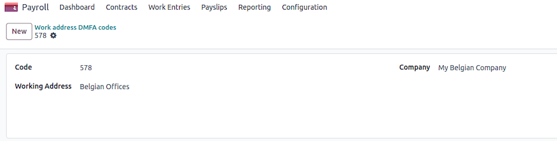

Work entry type
~~~~~~~~~~~~~~~

A DmfA code should be defined for each work entry type that is declared. Under
:menuselection:`Payroll app --> Configuration --> Work Entries --> Work Entry Types`, specify the
:guilabel:`DMFA code`.

Potential configuration errors
~~~~~~~~~~~~~~~~~~~~~~~~~~~~~~

During the declaration generation process, configuration issues may arise, triggering errors such
as:

- Terminated employees without or with invalid start/end notice period
- Invalid NISS number for some employees
- Work addresses not linked to an ONSS identification code
- Work entry type missing a corresponding DmfA code
- Other inconsistencies in employer or employee records

Employers should ensure accurate configuration to avoid delays and rejection of their declarations.

Web declaration
~~~~~~~~~~~~~~~

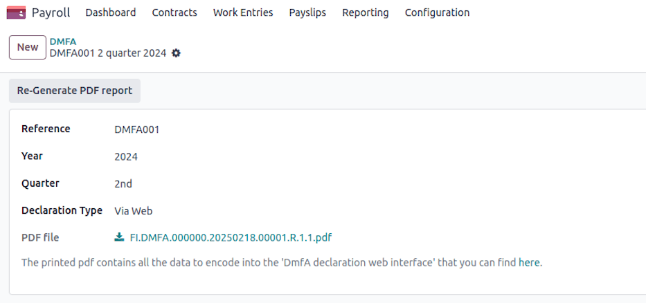

A web declaration generates a PDF summarizing the company's general information, as well as all
employee data that must be manually entered into the system. This includes:

For the company:

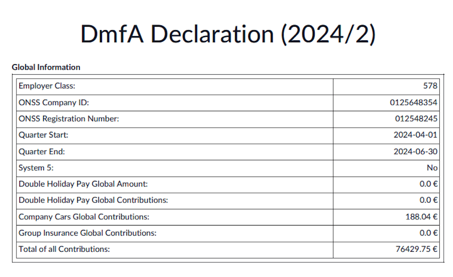

For a specific employee:

.. image:: belgium/dmfa-02.png
   :alt: DmfA - PDF Employee.

- **Occupations**: Work schedules, part-time codes, parental leave, exploitation unit, reference
  working hours.
- **Services**: Aggregated work performance (in days and hours) for the quarter, categorized by
  occupation and type. The codification of working time in the DmfA declaration ensures accurate
  reporting of employee activities. Each code corresponds to a specific type of working time or
  absence. For a complete and detailed list of codes, please refer to the official social security
  website: `socialsecurity.be <https://www.socialsecurity.be/employer/instructions/dmfa/fr/latest/instructions/fill_in_dmfa/dmfa_fillinrules/servicedatadeclaration/workingtimecodification.html>`_

  - **1**: All performances covered by a salary subject to ONSS contributions, excluding legal and
    additional vacation for workers.
  - **2**: Legal vacation days for workers.
  - **3**: Additional vacation days for workers.
  - **4**: Compensatory rest days.
  - **5**: Days of illness or non-occupational accident.
  - **6**: Family leave days.
  - **7**: Maternity or paternity leave days.
  - **8**: Strike days.
  - **9**: Temporary unemployment for economic reasons.
  - **10**: Temporary unemployment for bad weather.
  - **11**: Temporary unemployment for force majeure.
  - **12**: Professional training days.
  - **13**: Suspension for disciplinary reasons.
  - **14**: Additional vacation days for employment start or resumption.
  - **15**: Flexible vacation days.

- **Remunerations**: Aggregated by code per occupation:

  - **1**: Regular salary amounts excluding certain indemnities.
  - **2**: Bonuses and similar benefits granted independently of actual working days.
  - **3**: Severance payments expressed in working hours.
  - **7**: Simple vacation pay for exiting employees (subject to contributions).
  - **10**: Personal use of a company vehicle and other mobility benefits.
  - **11**: Simple vacation pay for exiting employees (not subject to contributions).
  - **12**: Advance vacation pay paid by a previous employer (not subject to contributions).

- **Contributions**: Employer and employee contributions, such as:

  - **256**: Asbestos fund contribution.
  - **255**: Special work accident contribution.
  - **495**: Total employer + 13.07% employee contribution.
  - **809**: Enterprise closure fund contribution.
  - **810**: Special enterprise closure fund contribution.
  - **831**: Auxiliary Joint Committee for Employees (CP200) contribution.
  - **855**: Wage restraint contribution.
  - **856**: Special social security contribution.
  - **859**: Temporary unemployment contribution.

Batch declaration
~~~~~~~~~~~~~~~~~

.. image:: belgium/dmfa-05.png
   :alt: DmfA - Web Declaration.

Batch declarations require technical knowledge, including SSH keys, SFTP servers, and electronic
signatures. Employers should refer to the `official batch documentation
<https://www.socialsecurity.be/site_fr/employer/applics/dmfa/batch/home.htm>`_ and `process overview
<https://www.socialsecurity.be/site_fr/employer/applics/dmfa/batch/outline.htm>`_.

A batch submission generates three files:

#. **Declaration file** (e.g., FI.DMFA.112768.20250109.00014.R.1.1)
#. **Launch file** (e.g., GO.DMFA.112768.20250109.00014.R.1)
#. **Electronic signature file** (e.g., FS.DMFA.112768.20250109.00014.R.1.1) (only for real
   declarations, not tests)

The full process includes creating, sending, validating, and potentially correcting declarations.
Rejections and anomalies must be addressed before final acceptance.

.. image:: belgium/dmfa-09.png
   :alt: DmfA - Web Declaration.

#. **Creation of the Declaration**

   - Create an XML document containing employee benefit data, remuneration, and contributions for
     the company.
   - More information on XML files can be found in the *Specifications* page.

#. **Sending the Declaration**

   - Use FTP or SFTP for sending the file. Access requires prior authorization for secure zone
     access by a local manager.
   - Detailed instructions are available on the `Introduce and Modify (via batch)
     <https://www.socialsecurity.be>`_.

#. **File Acknowledgment Receipt**

   - **Positive Receipt**: Indicates the file can be processed. However, this does not guarantee
     acceptance.
   - **Negative Receipt**: Indicates issues with the file structure or access rights.

#. **Notification and Ticket Number for the Declaration**

   - A positive notification is sent for each accepted declaration.
   - Negative notification: Provides information on encountered anomalies.

#. **Sending PID**

   - Employers and SSA will receive PID and version numbers via batch for declarations.

#. **Modification Notification with System Corrections**

   - If corrections are made, a modification notification is sent with corrected values.

.. _payroll/l10n_be/double_holiday_pay:

Double holiday pay
==================

Double holiday pay is an additional bonus paid to employees and workers during their annual leave.
The amount depends on the employee's or worker's salary.

How is double holiday pay calculated?
-------------------------------------

For employees, double holiday pay amounts to 92% of their gross salary for the month when they
take their main annual leave. This amount is calculated based on the number of months worked or
considered equivalent in the previous year.

Impact of additional or European leave
--------------------------------------

If you take additional or European leave, your employer will pay you regular holiday pay for that
leave. However, the following year, this amount will be deducted from your double holiday pay. This
is because additional leave is considered an advance on the next year's legal leave.

Factors affecting the calculation
---------------------------------

#. **Months Worked**: The calculation is based on the number of months you worked in the previous
   year.
#. **Absences**: If you had unpaid absences, they may reduce your double holiday pay.
#. **Variable Revenues**: Bonuses and commissions earned in the previous year can impact the total
   amount of double holiday pay.
#. **Withholding Taxes**: The double holiday pay is subject to income tax deductions, which depend
   on your annual earnings and family situation.

Withholding tax calculation
---------------------------

The withholding tax is calculated using a progressive rate system. The process involves:

#. **Identify the Employee's Annual Taxable Revenue**:

   - Compute the annualized salary, including benefits in kind (e.g., company car, internet, mobile
     phone, laptop).
   - Apply reductions for dependent children.

#. **Apply Tax Rates**:

   - Use predefined tax brackets to determine the base withholding tax rate.
   - If applicable, apply a reduction based on the number of dependent children.

Tax brackets
~~~~~~~~~~~~

The withholding tax is applied progressively based on the following brackets (as of 2025):

+--------------+--------------+------------+
| Lower Bound  | Upper Bound  | Tax Rate   |
+==============+==============+============+
| 0.00         | 10,415.00    | 0.00%      |
+--------------+--------------+------------+
| 10,415.01    | 13,330.00    | 19.17%     |
+--------------+--------------+------------+
| 13,330.01    | 16,960.00    | 21.20%     |
+--------------+--------------+------------+
| 16,960.01    | 20,340.00    | 26.25%     |
+--------------+--------------+------------+
| 20,340.01    | 23,020.00    | 31.30%     |
+--------------+--------------+------------+
| 23,020.01    | 25,710.00    | 34.33%     |
+--------------+--------------+------------+
| 25,710.01    | 31,070.00    | 36.34%     |
+--------------+--------------+------------+
| 31,070.01    | 33,810.00    | 39.37%     |
+--------------+--------------+------------+
| 33,810.01    | 44,770.00    | 42.39%     |
+--------------+--------------+------------+
| 44,770.01    | 58,460.00    | 47.44%     |
+--------------+--------------+------------+
| 58,460.00    | ∞            | 53.50%     |
+--------------+--------------+------------+

Tax exemption
~~~~~~~~~~~~~

A withholding tax exemption is granted when the normal annual gross income does not exceed a
specific threshold, which is determined based on the number of dependent children [2].

A disabled dependent child counts as two.

The method involves referring to a two-column table:

- **Column 1**: Indicates the number of dependent children.
- **Column 2**: Specifies the maximum allowable normal annual gross income, based on the number of
  dependent children listed in Column 1, which must not be exceeded to qualify for full or partial
  exemption from withholding tax.

After determining the annual gross income, two scenarios may arise:

#. If the annual income exceeds the threshold, no exemption is granted.
#. If the annual income does not exceed the threshold, an exemption will be applied.

The amount of this exemption corresponds to the difference between the annual gross income and the
threshold amount.

Of course, if this difference exceeds the base withholding tax amount, no withholding tax will
be due.

+-----------------+------------------------+
| No. of Children | Max Revenue (EUR)      |
+=================+========================+
| 1               | 18,400.00              |
+-----------------+------------------------+
| 2               | 21,930.00              |
+-----------------+------------------------+
| 3               | 28,270.00              |
+-----------------+------------------------+
| 4               | 35,330.00              |
+-----------------+------------------------+
| 5               | 42,390.00              |
+-----------------+------------------------+
| 6               | 49,450.00              |
+-----------------+------------------------+
| 7               | 56,510.00              |
+-----------------+------------------------+
| 8               | 63,570.00              |
+-----------------+------------------------+
| 9               | 70,630.00              |
+-----------------+------------------------+
| 10              | 77,690.00              |
+-----------------+------------------------+
| 11              | 84,750.00              |
+-----------------+------------------------+
| 12              | 91,810.00              |
+-----------------+------------------------+

Tax reductions
~~~~~~~~~~~~~~

When there is no justification for fully or partially exempting the exceptional allowance from
withholding tax, it is still possible to grant a reduction in withholding tax.

To determine eligibility for this reduction, one must check whether the normal annual gross salary
exceeds a certain higher threshold, which varies according to the number of dependent children [3].
This threshold is higher than the one used for exemption purposes.

A disabled child counts as two.

The method involves referring to a three-column table:

- **Column 1**: Indicates the number of dependent children (up to a maximum of 5).
- **Column 2**: Specifies the percentage reduction in withholding tax, based on the number of
  dependent children listed in Column 1, which must not be exceeded to qualify for the reduction.
- **Column 3**: Shows the threshold amount that must not be exceeded, corresponding to the number
  of dependent children listed in Column 1.

Two scenarios may arise:

#. If the threshold amount is exceeded, no reduction will be granted.
#. If the threshold amount is not exceeded, a reduction will be applied to the withholding
   tax amount, up to a percentage rate determined in Column 2.

For employees with dependent children, tax reductions apply as follows:

+-----------------+------------------+----------------+
| No. of Children | Reduction (%)    | Max Revenue    |
+=================+==================+================+
| 1               | 7.5%             | 28,245.00      |
+-----------------+------------------+----------------+
| 2               | 20.0%            | 28,245.00      |
+-----------------+------------------+----------------+
| 3               | 35.0%            | 31,070.00      |
+-----------------+------------------+----------------+
| 4               | 55.0%            | 36,720.00      |
+-----------------+------------------+----------------+
| 5+              | 75.0%            | 39,550.00      |
+-----------------+------------------+----------------+

Final tax calculation
~~~~~~~~~~~~~~~~~~~~~

The final withholding tax amount is:

.. math::
   :class: overflow-scroll

   \text{Tax} = \text{Gross Double Holiday} \times \text{Applicable Tax Rate} -
   \text{Reduction (if applicable)}

The resulting tax is deducted from the gross double holiday salary to determine the net amount
payable to the employee.

The calculation considers work duration, absences, variable revenue, and applicable withholding
taxes. Odoo automates these calculations to ensure compliance with Belgian labor laws and tax
regulations.

Generate a batch in Odoo
------------------------

Navigate to :menuselection:`Payroll App --> Payslips --> Batches` and create a new record with valid
dates (here december 2024)

Then click the **Generate Payslips** button, select the CP200 salary structure type and the
Thirteen Month salary structure. You can also filter eligible employees by department and / or
job position.

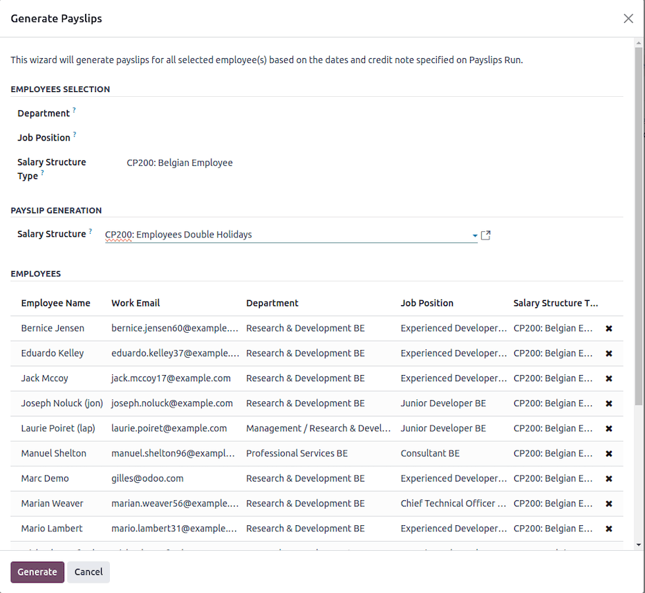

Once validated, a payslip is generated for each employee.

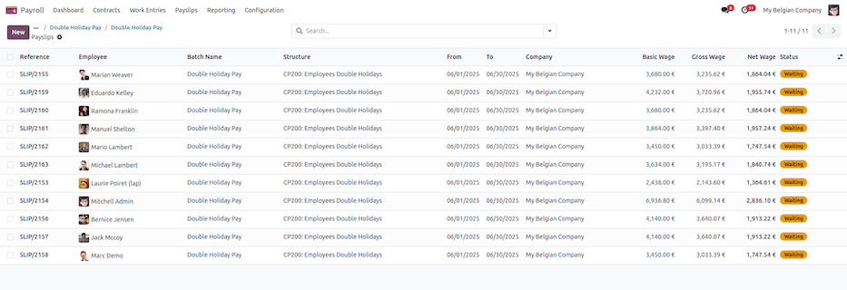

You can now check the different payslips before validation. Once validated, the PDF files are
generated and posted on employee portals as for classic payslips.

.. image:: belgium/double-holiday-04.png
   :alt: Double Holiday PDF.

Conclusion
----------

Double holiday pay is a significant benefit that rewards employees for their work in the previous
year. Understanding how it is calculated helps in better financial planning for the holiday period.

.. _payroll/l10n_be/eco_vouchers:

Eco vouchers
============

Overview
--------

Eco vouchers are a tax-free employee benefit designed to support the purchase of
environmentally-friendly products and services. These vouchers are ordered via external providers
and are exempt from social security contributions.

Eligibility & allocation
------------------------

Employees who have worked during the **reference period (01/06/N-1 - 31/05/N)** are eligible for
up to **250€** in eco vouchers, which are granted at the beginning of **July**.

.. example::
   For 2025, employees must have worked between **01/06/2024 and 31/05/2025** to qualify.

For employees who join during the reference period, the voucher amount is prorated based on their
worked days.

.. example::
   An employee hired on **06/01**, having worked **6 out of 12 months**, would receive:

   .. math::
      :class: overflow-scroll

      250\text{€} \times (6/12) = 125\text{€}

For part-time employees, the amount is adjusted as follows:

.. list-table::
   :header-rows: 1

   * - Work Regime
     - Voucher Amount (€)
   * - 4/5
     - 250€
   * - 3/5
     - 200€
   * - 1/2
     - 125€
   * - < 1/2
     - 100€

.. example::
   If an employee starts on **1st September** in **full-time** and then switches to **half-time** on
   **1st April 2024**, the calculation will be:

   .. math::
      :class: overflow-scroll

      250\text{€} \times (7/12) + 125\text{€} \times (2/12) = 166\text{€}

Exceptions & adjustments
------------------------

If an employee worked full-time for the entire reference period but did not receive **250€**,
certain non-assimilated leave days may have affected the calculation.

The following leave types are **not** considered for eco-voucher entitlement:

- **Unpaid leaves**
- **Sick leave compensated by mutual insurance** (after 30 days of work incapacity)

Usage & validity
----------------

Eco vouchers are valid for **24 months** from the date of issuance.

.. seealso::
   The list of eligible products and services that can be purchased with eco vouchers is available
   here:

   - `Eco-Voucher Eligible Products <https://cnt-nar.be/sites/default/files/documents/fr/Liste-F-23.pdf>`_

.. _belgium_payroll/end_of_year_bonus:

End of year bonus
=================

This document explains the calculation of the thirteenth-month salary (year-end bonus) in Belgium
within Odoo. The calculation considers the employee's contracts, working time rates, and applicable
taxes.

Calculation of the thirteenth-month salary
------------------------------------------

Eligibility criteria
~~~~~~~~~~~~~~~~~~~~

- The employee must have worked for at least **six complete months** in the year.
- Both full-time and part-time employees are eligible, with prorated calculations based on work
  time.

Salary calculation
~~~~~~~~~~~~~~~~~~

The thirteenth-month salary is computed as follows:

#. **Determine the basic salary**:

   - Retrieve the employee's contractual wage.
   - Identify the applicable work rate.

#. **Compute eligible months**:

   - If explicitly provided (`MONTHS` input), use the given number of months.
   - Otherwise, calculate the number of complete months worked.
   - Prorate the salary for partial-year work.

#. **Adjust for absences**:

   - Deduct unpaid absences to obtain the presence prorata.
   - Consider up to 60 days of sick leave as paid time off.

#. **Include variable revenues**:

   - If explicitly provided (`VARIABLE` input), use the given value.
   - Otherwise, calculate the average variable revenue over the last year.

#. **Final amount**:

   - The final thirteenth-month amount is the sum of the prorated fixed salary and average variable
     revenues.

Withholding tax calculation
---------------------------

The withholding tax is calculated using a progressive rate system. The process involves:

#. **Identify the employee's annual taxable revenue**:

   - Compute the annualized salary, including benefits in kind (e.g., company car, internet, mobile
     phone, laptop).
   - Apply reductions for dependent children.

#. **Apply Tax Rates**:

   - Use predefined tax brackets to determine the base withholding tax rate.
   - If applicable, apply a reduction based on the number of dependent children.

Tax brackets
~~~~~~~~~~~~

The withholding tax is applied progressively based on the following brackets (as of 2025):

+--------------+--------------+------------+
| Lower Bound  | Upper Bound  | Tax Rate   |
+==============+==============+============+
| 0.00         | 10,415.00    | 0.00%      |
+--------------+--------------+------------+
| 10,415.01    | 13,330.00    | 23.22%     |
+--------------+--------------+------------+
| 13,330.01    | 16,960.00    | 25.23%     |
+--------------+--------------+------------+
| 16,960.01    | 20,340.00    | 30.28%     |
+--------------+--------------+------------+
| 20,340.01    | 23,020.00    | 35.33%     |
+--------------+--------------+------------+
| 23,020.01    | 25,710.00    | 38.36%     |
+--------------+--------------+------------+
| 25,710.01    | 31,070.00    | 40.38%     |
+--------------+--------------+------------+
| 31,070.01    | 33,810.00    | 43.41%     |
+--------------+--------------+------------+
| 33,810.01    | 44,770.00    | 46.44%     |
+--------------+--------------+------------+
| 44,770.01    | 58,460.00    | 51.48%     |
+--------------+--------------+------------+
| 58,460.00    | ∞            | 53.50%     |
+--------------+--------------+------------+

Tax exemption
~~~~~~~~~~~~~

A withholding tax exemption is granted when the normal annual gross income does not exceed a
specific threshold, which is determined based on the number of dependent children [2].

A disabled dependent child counts as two.

The method involves referring to a two-column table:

- **Column 1**: Indicates the number of dependent children.
- **Column 2**: Specifies the maximum allowable normal annual gross income, based on the number of
  dependent children listed in Column 1, which must not be exceeded to qualify for full or partial
  exemption from withholding tax.

After determining the annual gross income, two scenarios may arise:

#. If the annual income exceeds the threshold, no exemption is granted.
#. If the annual income does not exceed the threshold, an exemption will be applied.

The amount of this exemption corresponds to the difference between the annual gross income and the
threshold amount.

Of course, if this difference exceeds the base withholding tax amount, no withholding tax will
be due.

+-----------------+------------------------+
| No. of Children | Max Revenue (EUR)      |
+=================+========================+
| 1               | 18,400.00              |
+-----------------+------------------------+
| 2               | 21,930.00              |
+-----------------+------------------------+
| 3               | 28,270.00              |
+-----------------+------------------------+
| 4               | 35,330.00              |
+-----------------+------------------------+
| 5               | 42,390.00              |
+-----------------+------------------------+
| 6               | 49,450.00              |
+-----------------+------------------------+
| 7               | 56,510.00              |
+-----------------+------------------------+
| 8               | 63,570.00              |
+-----------------+------------------------+
| 9               | 70,630.00              |
+-----------------+------------------------+
| 10              | 77,690.00              |
+-----------------+------------------------+
| 11              | 84,750.00              |
+-----------------+------------------------+
| 12              | 91,810.00              |
+-----------------+------------------------+

Tax reductions
~~~~~~~~~~~~~~

When there is no justification for fully or partially exempting the exceptional allowance from
withholding tax, it is still possible to grant a reduction in withholding tax.

To determine eligibility for this reduction, one must check whether the normal annual gross salary
exceeds a certain higher threshold, which varies according to the number of dependent children [3].
This threshold is higher than the one used for exemption purposes.

A disabled child counts as two.

The method involves referring to a three-column table:

- **Column 1**: Indicates the number of dependent children (up to a maximum of 5).
- **Column 2**: Specifies the percentage reduction in withholding tax, based on the number of
  dependent children listed in Column 1, which must not be exceeded to qualify for the reduction.
- **Column 3**: Shows the threshold amount that must not be exceeded, corresponding to the number
  of dependent children listed in Column 1.

Two scenarios may arise:

#. If the threshold amount is exceeded, no reduction will be granted.
#. If the threshold amount is not exceeded, a reduction will be applied to the withholding
   tax amount, up to a percentage rate determined in Column 2.

For employees with dependent children, tax reductions apply as follows:

+-----------------+------------------+----------------+
| No. of Children | Reduction (%)    | Max Revenue    |
+=================+==================+================+
| 1               | 7.5%             | 28,245.00      |
+-----------------+------------------+----------------+
| 2               | 20.0%            | 28,245.00      |
+-----------------+------------------+----------------+
| 3               | 35.0%            | 31,070.00      |
+-----------------+------------------+----------------+
| 4               | 55.0%            | 36,720.00      |
+-----------------+------------------+----------------+
| 5+              | 75.0%            | 39,550.00      |
+-----------------+------------------+----------------+

Final tax calculation
~~~~~~~~~~~~~~~~~~~~~

The final withholding tax amount is:

.. math::
   :class: overflow-scroll

   \text{Tax} = \text{Gross Thirteenth Month} \times \text{Applicable Tax Rate} -
   \text{Reduction (if applicable)}

The resulting tax is deducted from the gross thirteenth-month salary to determine the net amount
payable to the employee.

The calculation considers work duration, absences, variable revenue, and applicable withholding
taxes. Odoo automates these calculations to ensure compliance with Belgian labor laws and tax
regulations.

How to do it in Odoo
--------------------

Navigate to :menuselection:`Payroll app --> Payslips --> Batches` and create a new record with valid
dates (here december 2024).

Then click the :guilabel:`Generate Payslips` button, select the :guilabel:`CP200: Belgian Employee`
:guilabel:`Salary Structure Type` and the :guilabel:`CP200: Employees 13th Month` :guilabel:`Salary
Structure`. You can also filter eligible employees by :guilabel:`Department` and / or :guilabel:`Job
Position`.

Once validated, a payslip is generated for each employee.

You can now check the different payslips before validation. Once validated, the PDF files are
generated and posted on employee portals as for classic payslips.

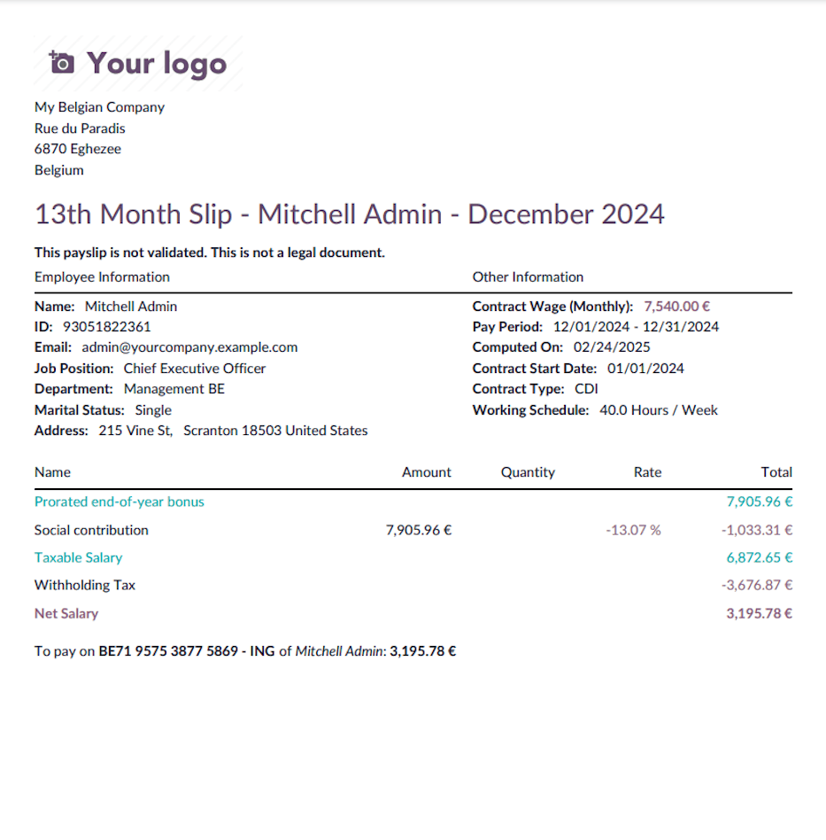

.. _payroll/l10n_be/holiday_pay_recovery:

Holiday pay recovery
====================

This document explains how Odoo calculates the recovery of holiday pay (both simple and double) for
employees in Belgium who have changed employers. When an employee moves from one company to another,
their previous employer may have already paid their holiday pay for the previous year. This amount
needs to be recovered by the new employer, and this guide outlines how this is managed in Odoo.

Understanding holiday pay in Belgium
------------------------------------

In Belgium, employees are entitled to annual leave and corresponding holiday pay, which consists of:

- **Simple holiday pay**: Regular salary payments for the days of leave taken.
- **Double holiday pay**: An additional payment, typically equal to approximately 92% of the gross
  monthly salary, given when employees take their annual leave.

When an employee changes jobs, their previous employer may have already paid these amounts. To avoid
double payment, the new employer needs to recover the amounts already paid.

Recovery of simple holiday pay
------------------------------

The recovery of simple holiday pay in Odoo is based on the following criteria:

#. The recovery applies if the employee has taken leave in the current year and their previous
   employer already paid the holiday pay.
#. The calculation considers the number of leave days taken and the hours worked per week.
#. The recovery process is split into:

   - **Year N**: The current year's holiday pay recovery.
   - **Year N-1**: The recovery of holiday pay from the previous year.

The system checks:

- If the employee's first contract date with the company was in the previous year.
- If the employee has a pending holiday pay recovery amount.
- If the recovery has not already been processed.
- If the employee has taken annual leave.

If all conditions are met, Odoo calculates the amount to be deducted from the payroll to account
for the holiday pay already received from the previous employer.

Recovery of double holiday pay
------------------------------

The recovery of double holiday pay follows these steps:

#. The system verifies the employee's contract and determines their employment duration.
#. The gross salary is calculated based on the employee's contract.
#. The number of months worked in the previous year is identified.
#. A threshold amount is computed as follows:

   .. math::
      :class: overflow-scroll

      \text{Threshold} = \text{Current monthly salary} \times \text{Months worked in previous year}
      \times \text{Occupation rate} \times 7.67%

   If the amount on the holiday certificate from the previous employer is lower than this threshold,
   no limit applies.

#. The system recovers the lower of:

   - The calculated threshold.
   - The actual amount paid by the previous employer.

If the employee has worked for more than 12 months in the current company, no double holiday pay
needs to be recovered.

How to configure in Odoo
------------------------

In the employee form view, under the :guilabel:`Settings` tab, you can enter the various amounts
from holiday attests provided by the new employee.

.. image:: belgium/holiday-pay-recovery-01.png
   :alt: Holiday Pay Recovery Configuration.

For simple holiday pay recovery, you need to enter:

- The :guilabel:`Number of days` for paid leave
- The :guilabel:`Amount to recover` by the employee

.. note::
   The :guilabel:`Recovered Amount` field displays the amount already recovered.

For double holiday pay recovery, you must enter a **line for each employer's holiday attest**. Each
line should include:

- The :guilabel:`# Months` (number of months) the employee worked for that employer
- The :guilabel:`Amount` provided to the employee
- The :guilabel:`Occupational Rate`

Odoo uses this data to compute a **recovery limit**. If the employee now has a lower salary, the
full amount cannot be recovered.

.. tip::
   Be careful not to mix holiday attests for the current year (N) and the previous year (N-1).

For simple holiday pay recovery, the system deducts the amount from each legal time-off period
until:

#. The **total amount** has been fully recovered, or
#. The **number of time-off days** has been matched (if the employee's current salary is lower than
   before).

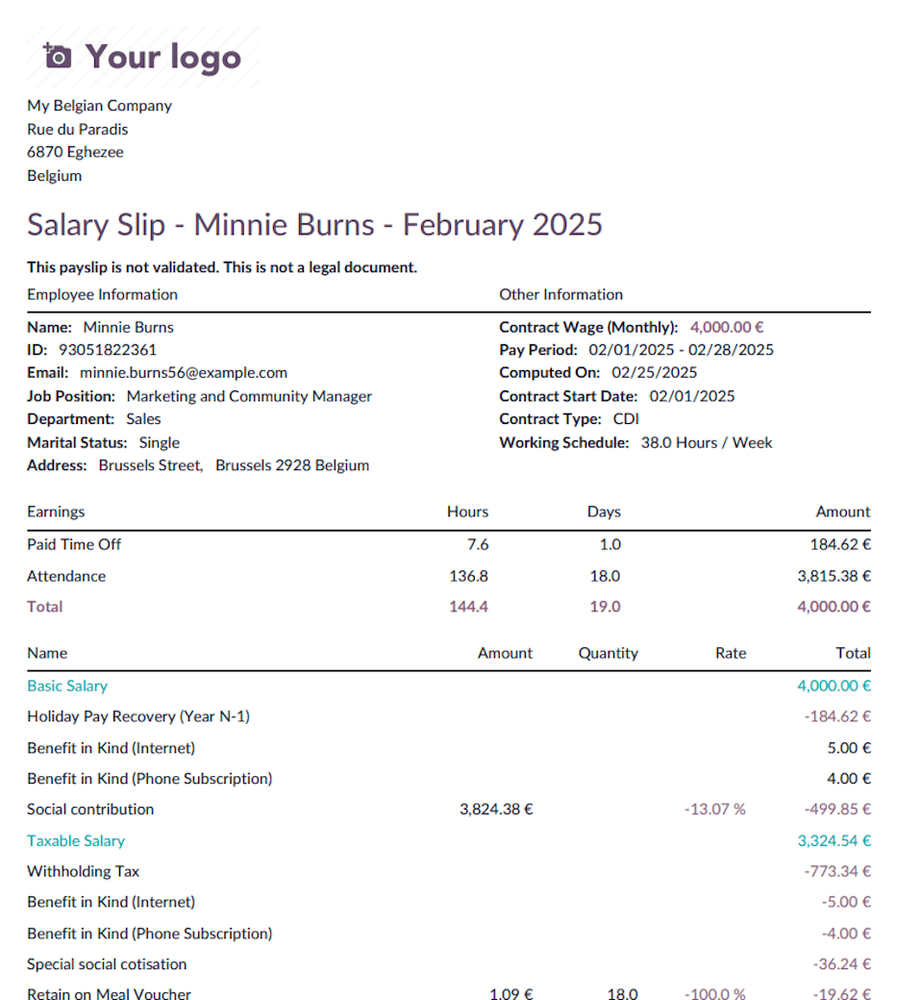

Once the **payslip** is validated and paid, the recovered simple holiday pay is reflected in the
employee form view.

.. image:: belgium/holiday-pay-recovery-03.png
   :alt: Holiday Pay Recovery Simple Amount.

On the double holiday payslip, click :guilabel:`Compute Double Pay Recovery` to open a wizard that
helps calculate the recoverable amount.

In the :guilabel:`Double Pay Recovery Computation` wizard, you'll find:

- The relevant holiday attests listed in the :guilabel:`Occupation Lines`
- The :guilabel:`Double Pay To Recover` amount based on the threshold

This amount is **editable** if manual adjustments are needed.

Once validated, the double pay recovery is applied to the payslip.

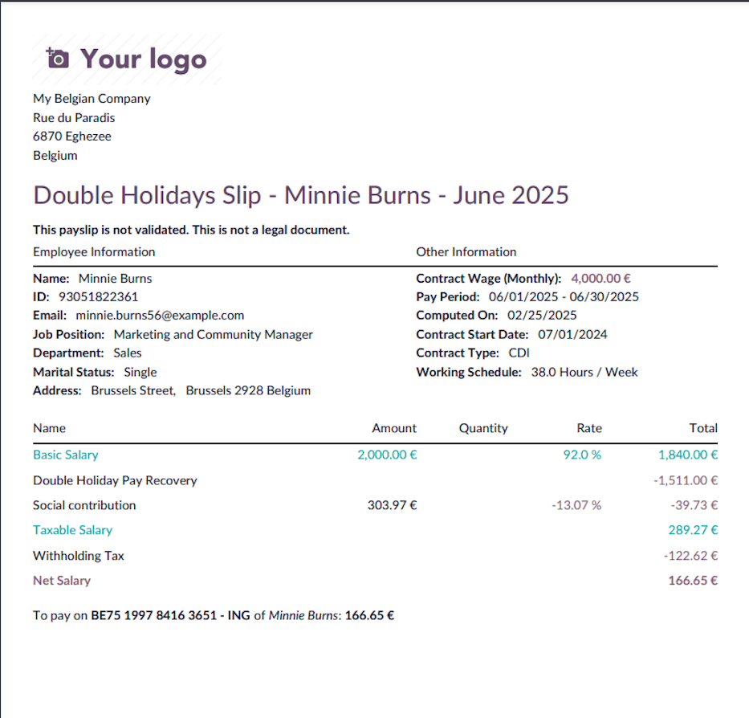

Odoo automates the recovery of both **simple** and **double** holiday pay, ensuring compliance with
**Belgian labor laws**. By analyzing contract details, employment duration, and past payments, Odoo
calculates the necessary deductions and prevents duplicate holiday pay payments.

.. _payroll/l10n_be/individual_accounts:

Individual accounts
===================

Introduction
------------

The individual account provides workers with a detailed overview of their earnings, deductions
(such as social security contributions, withholding tax, etc.), and the working days performed, on
a pay period basis. Additionally, it contains all relevant administrative data related to
remuneration.

Required information in the individual account
----------------------------------------------

The individual account must include several mandatory details as determined by Royal Decree.

**Employer identification:**

- Name, address, ONSS number, ONVA number
- Relevant joint committee (or sub-committee)
- Name of the holiday fund for workers
- Insurer for work-related accidents
- Approved social secretariat
- Relevant affiliation numbers

**Worker identification:**

- Name, address, date of birth, gender, tax status
- Type of employment contract, job title, professional qualification
- Workplace location (or note if working at multiple locations)
- Start and end date of employment
- Employee ID number, starting salary
- Remuneration components and payment periodicity

**Remuneration components:**

- Per pay period (daily, weekly, bi-weekly, or monthly):

  - Number of working days and hours (regular, additional, and overtime)
  - Days of work interruption and reasons (illness, vacations, public holidays, replacement days,
    compensatory rest days, etc.)
  - Fixed or hourly salary, variable remuneration, bonuses, meal vouchers, eco vouchers, holiday
    pay (including early holiday pay if applicable), severance pay, year-end bonuses (as per
    sectoral or other collective labor agreements), benefits in kind and their estimated value
  - Gross amount of all remuneration components
  - Amounts subject to social and tax deductions
  - Various social and tax deductions: personal ONSS contributions, withholding tax, special
    social security contributions
  - Net amount payable to the worker
  - Other payments made by the employer, including reimbursement of travel expenses, allowances,
    and other payments

- Per quarter:

  - Number of actual working days
  - Days of work interruption by reason
  - Total remuneration subject to social security contributions
  - Employee social security contribution amounts

- Per year:

  - Total amounts subject to social security contributions
  - Employee social security contribution amounts
  - Taxable remuneration and other amounts
  - Withholding tax amount

Responsibility for establishing and updating the individual account
-------------------------------------------------------------------

Belgian employers using **Odoo Payroll** can generate the individual accounts of their workers.

However, to ensure accurate record-keeping, employers must:

- Ensure payment of sector-mandated year-end bonuses
- Ensure that all public holidays, legal vacation days, and compensatory rest days are taken
  before the end of the year
- Plan collective vacation and replacement public holidays in advance
- Pay workers their holiday pay (including early holiday pay if applicable)
- Distribute due eco vouchers
- Pay any required travel expenses between home and work

If these obligations are met, the corresponding data will be included in the individual account.

Storage and retention period of the individual account
------------------------------------------------------

The individual account is a social document that must be kept by the employer for a specified
period after its creation.

Employers may store individual accounts:

- At the ONSS-registered address
- At a workplace
- At their home or registered office if located in Belgium; otherwise, at the residence of a
  designated agent in Belgium
- At the office of the approved social secretariat, if affiliated

Records must be kept legible and in a format allowing efficient oversight. The retention period is
**five years** from the end of the annual closing of the account.

When must workers receive a copy of their individual account?
-------------------------------------------------------------

Each worker must receive a copy of their individual account:

- **During employment:** Before March 1 of the following year
- **At the end of employment:** Within two months following the end of the quarter in which the
  contract ended
- **If additional payments occur after contract termination:** A copy reflecting the additional
  payment must be provided within two months of the payment

Additionally, employers must issue a **simplified individual account** with certain worker and
employer details within two months of the worker's employment start date.

Any modifications to mandatory details, such as job function or workplace location, must be
communicated in writing (e.g., an updated simplified individual account) within one month of the
effective change date.

Generate individual accounts in Odoo
------------------------------------

Navigate to :menuselection:`Payroll app --> Reporting --> Belgium --> Individual Accounts`.

Then select the reference year and click the :guilabel:`Populate` button. The :file:`.pdf` are
displayed as soon as they are available and are generated 30 by 30, this could take some time
according to the number of employees.

On the first page, the :guilabel:`Employer Information` and the :guilabel:`Employee Information` is
listed.

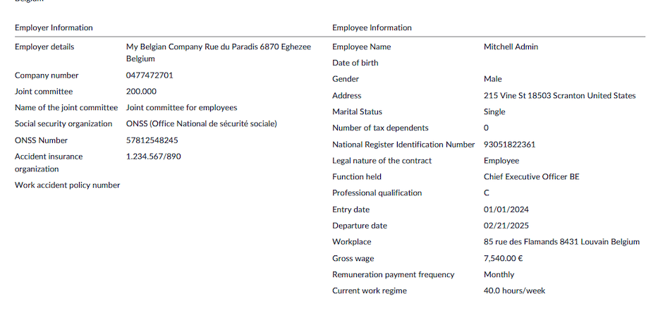

The next page displays all the employee worked days and payslip lines, month by month, split by
structure (e.g., End of year bonus and monthly pay).

.. image:: belgium/individual-account-04.png
   :alt: Individual Account PDF Month by Month.

The next page displays the same information quarter by quarter and summarized for the whole year.

.. image:: belgium/individual-account-05.png
   :alt: Individual Account PDF Quarter by Quarter.

Once all PDF files are generated, they can be posted to the employee documents portal if the
**Documents** application is :doc:`installed and properly configured
<../../../productivity/documents>`.

Select the checkbox of each employee whose documents you want to post, and click the :guilabel:`Post
PDF` button.

.. _payroll/l10n_be/273_sheets:

Intellectual property and 273 sheets
====================================

Introduction
------------

The 273S declaration is used for the **Prepayment on Mobile Income (Pr.M)**, which concerns the
taxation of **Author's Rights** and **Neighboring Rights** (also known as **Revenus Mobilier**).
These are specific types of income that are subject to particular tax treatment in certain
jurisdictions.

This document provides users with essential information about how the 273S declaration functions
within Odoo for reporting income derived from these rights, including applicable tax rates and
conditions.

Tax rates and calculation
-------------------------

The net income from Author's Rights and Neighboring Rights is taxable at a specific rate of **15%**.
However, the effective tax rate can vary based on the application of flat-rate deductions. These
flat rates reduce the taxable amount, leading to a lower effective tax rate for lower incomes.

Key points of taxation:

- **Effective tax rate**:

  - For incomes below the first flat-rate threshold, the effective tax rate can be as low as
    **7.5%**.
  - For incomes reaching the flat-rate ceiling of **37,500 EUR** (indexed annually), the rate can
    increase to **12%**.

- **Additional taxes**: Income from Author's Rights and Neighboring Rights must be declared in the
  personal income tax declaration. As a result, municipal surcharges may also apply to the tax due.

The **prepayment** of the tax is handled via a withholding tax on the income. The debtor of the
income (e.g., the employer or company paying the royalties) must submit the 273S declaration to the
tax authorities. This withholding tax rate is generally **15%**, but for incomes exceeding the
indexed ceiling of **37,500 EUR**, the rate increases to **30%**.

Benefits of Author's Rights in employment contracts
---------------------------------------------------

Companies can offer tax-advantageous remuneration to their directors or employees by granting
**Author's Rights**. These rights are subject to a **15% withholding tax**, but there are flat-rate
deductions that make this tax treatment very favorable, especially when incomes are lower.

Important considerations:

- **Creative works**: To qualify for Author's Rights protection, the work must be creative,
  original, and fixed in a tangible form. Simple ideas or concepts are not eligible.
- **Exploitation requirement**: From January 1, 2023, a new regulation mandates that transferred or
  licensed protected works must be exploited, meaning they must be used for public communication,
  execution, representation, or reproduction.
- **Eligibility for tax benefits**: To benefit from the favorable tax regime, the rights holder
  must meet specific criteria, such as:

  - Holding an "Artistic Work Certificate."
  - Licensing or transferring rights to a third party for public communication or reproduction.

- **Income ratio restrictions**: The proportion of income from Author's Rights in relation to
  regular salary will be capped at **30%**, with **70%** of the total income being subject to
  regular income tax.
- **Income cap**: The absolute ceiling for qualifying income under this regime remains
  **37,500 EUR** (indexed at **70,220 EUR** for the 2024 income year).

If your average income from the last four years exceeds this ceiling, you will no longer be
eligible for the advantageous tax regime.

- **Ruling Request**: For greater clarity on the scope and remuneration of the transfer of Author's
  Rights, an advanced agreement with the tax authorities (referred to as a **ruling**) can be
  requested.

Tax treatment of Author's Rights income
---------------------------------------

Since 2008, income from the transfer or licensing of Author's Rights has benefited from a favorable
tax treatment. Specifically, the income is subject to:

- **15% Withholding Tax** up to an indexed ceiling of **70,220 EUR** (2023 income year).
- **Flat-Rate Deductions**:

  - **50% flat-rate deduction** applies to the first **18,720 EUR** of income.
  - **25% flat-rate deduction** applies to the next **18,730 EUR** (from **18,720 EUR to 37,450
    EUR**).

Example of tax impact:

For example, if a company director receives **10,000 EUR** in Author's Rights income, they will pay
**750 EUR** in tax (15% of the income after the flat-rate deductions), leaving them with a net
income of **9,250 EUR**. This results in an effective tax rate of **7.5%** on the Author's Rights
income.

Odoo integration for Declaration 273S
-------------------------------------

Odoo users can efficiently manage the submission of the **273S Declaration** for Author's Rights
and Neighboring Rights income via the **Odoo Payroll** module. Here's a quick overview of how this
can be done:

Set up Author's Rights in Odoo
~~~~~~~~~~~~~~~~~~~~~~~~~~~~~~

On the employees form view, make sure the :guilabel:`Intellectual Property` checkbox is enabled, and
the allocated salary percentage is specified as well.

Once a payslip is generated, the :abbr:`IP (intellectual property)` part is computed based on the
intellectual property percentage and the gross salary. The tax is computed accordingly based on the
revenue amount.

.. image:: belgium/273s-07.png
   :alt: Intellectual Property Payslip 1.

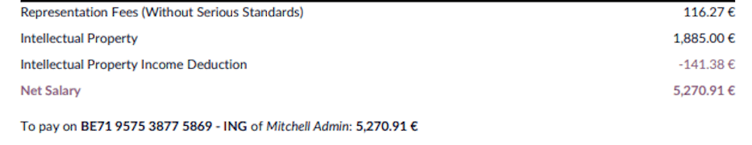

Generate the 273S form
~~~~~~~~~~~~~~~~~~~~~~

Odoo can generate the 273S form automatically based on the income data entered into the system.
Ensure that all required details, including the amount of income subject to the tax, are accurately
entered.

Navigate to :menuselection:`Payroll app --> Reporting --> Belgium --> 273S Sheet` to create a
:guilabel:`New` record.

Select the reference :guilabel:`Year` and :guilabel:`Month`, then click :guilabel:`Export XML file`
to generate the declaration. Click :guilabel:`Export PDF File` to generate the printed details.

On the first PDF section, the company information and the global declaration is listed.

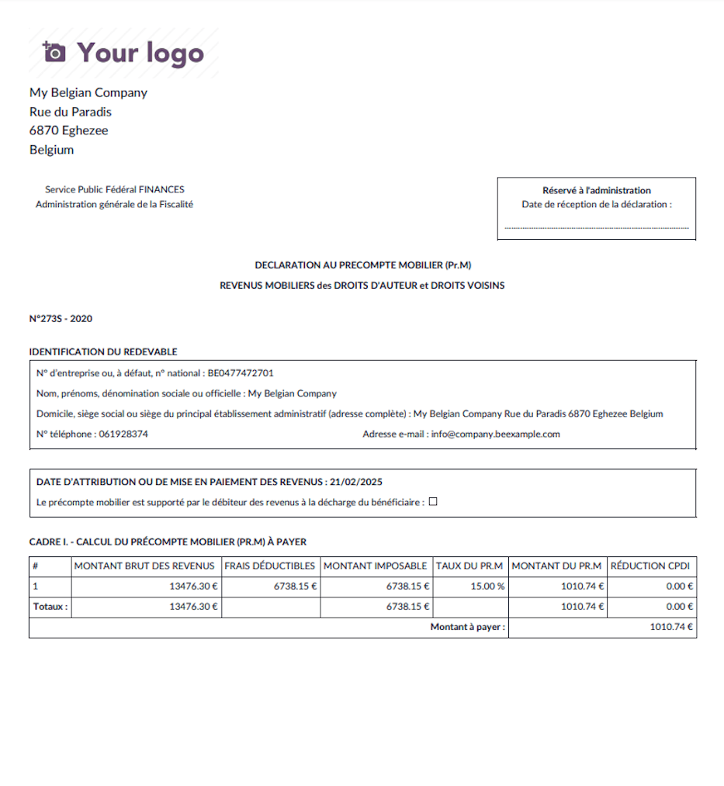

On the second section, the employees specific information is listed.

.. image:: belgium/273s-05.png
   :alt: 273S PDF Employee Info.

File the 273S Declaration
~~~~~~~~~~~~~~~~~~~~~~~~~

After generating the XML file, the company or the debtor of the income can submit it to the tax
authorities directly from MyMinfin. Keep track of the filing and payment deadlines to ensure timely
submission and compliance.

Conclusion
----------

The **273S Declaration** is an essential tool for companies and individuals benefiting from the
favorable tax regime on Author's Rights and Neighboring Rights. By leveraging Odoo's tax management
features, users can ensure compliance while optimizing their tax liabilities.

For further assistance, please consult a tax professional.

.. _payroll/l10n_be/representation_fees:

Representation fees
===================

Introduction
------------

Representation fees must be **allocated on the payslip** between **serious and non-serious
representation costs**. By default, the threshold is set at **€283.73**, but it can be adjusted
based on what the company can **legally justify**.

The representation fees is configured on the employee's contract form in the :guilabel:`Expense
Fees` field.

On the payslip, two or one line are displayed in the case the representation fees amount exceeds
the threshold or not.

Breakdown of the threshold
--------------------------

Only part of the representation costs are pro-rated because certain costs are **fully covered** by
the company. These fixed costs include:

.. math::
   :class: overflow-scroll

   \text{€}283.73\text{ Total} = \begin{cases}
   + \text{ €148.73 (Tax, since 2021 - coronavirus)} \\
   + \text{ €30 (Internet)} \\
   + \text{ €25 (Phone)} \\
   + \text{ €80 (Car management fees)} \\
   \end{cases}

The **serious portion** of the representation costs is **not prorated**, while the
**non-serious portion** is prorated based on working time.

Navigate to :menuselection:`Payroll app --> Configuration --> Salary --> Rule Parameters`, and
search for the `CP200: Representation Fees Threshold` record. Then, adapt the current value or
introduce a new one from a given date.

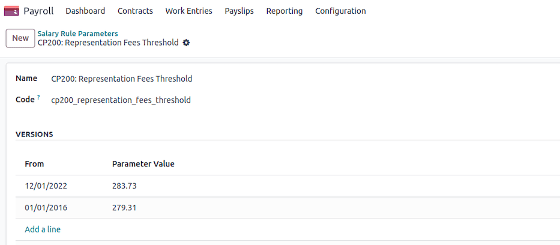

.. note::
   It is possible to define, based on job position, which jobs are eligible to certain criteria in
   the :guilabel:`Payroll` tab.

   .. image:: belgium/representation-fees-04.png
      :alt: Representation Fees Job Position.

Calculation of representation fees
----------------------------------

Conditions for payment
~~~~~~~~~~~~~~~~~~~~~~

Representation fees are only granted if:

- The employee **receives a basic salary**, and
- The employee has **worked at least part of the time**, unless a **salary simulation** is in
  progress.

If the employee is on **full leave** (without any working days), they are **not eligible** for
representation fees.

Determining the work time rate
~~~~~~~~~~~~~~~~~~~~~~~~~~~~~~

- The number of **working days per week** is extracted from the employee's contract.
- If the employee has periods of **incapacity for work** (e.g., illness), the calculation adjusts
  the **work time rate** accordingly:

  - The total **incapacity hours** are determined.
  - If the company follows a **biweekly schedule**, the incapacity hours are divided by **two**.
  - The incapacity **rate** is calculated as:

    .. math::
       :class: overflow-scroll

       \text{incapacity rate} = 1 - \frac{\text{incapacity hours}}{\text{total weekly hours}}

  - The **final work time rate** is then adjusted by multiplying it with the incapacity rate.

Applying the threshold and pro-rating rules
~~~~~~~~~~~~~~~~~~~~~~~~~~~~~~~~~~~~~~~~~~~

- The **default threshold (€283.73)** is applied unless adjusted by the company.
- If the employee has **worked a full-time schedule**, they receive the **full representation fees**
  without reduction.
- If the employee works **part-time** (contractual or due to time credit), only the **non-serious
  portion** of the fees is prorated.

  - The prorated formula for non-serious expenses is:

    .. math::
       :class: overflow-scroll

       \text{adjusted amount} = \text{threshold} + (\text{total fees} - \text{threshold}) \times
       \frac{\text{work time rate}}{100}

- If the employee has **missing workdays**, the final amount is further adjusted:

  - First calculate the **daily reduction**:

    .. math::
       :class: overflow-scroll

       \text{daily reduction} = \frac{(\text{total amount} - \text{threshold}) \times 3}{13 \times \text{days per week}}

  - Then calculate the **final amount**:

    .. math::
       :class: overflow-scroll

       \text{final amount} = max(0, \text{total amount} - \text{daily reduction} \times
       \text{missing days})

Final calculation
~~~~~~~~~~~~~~~~~

- If the employee meets all conditions, the final representation fees amount is
  **rounded to two decimal places** for payroll purposes.
- Employees working a full schedule receive **full reimbursement**, while those working
  **reduced hours** have the **non-serious portion prorated** accordingly.

Conclusion
----------

This calculation ensures **fair allocation** of representation fees by distinguishing between
**fixed serious costs** and **prorated non-serious costs**. The company can adjust the
**threshold (€283.73 by default)** based on **justifiable business expenses**.

Employees working **full-time** receive their full representation fees, while those working
**part-time or with absences** only receive a **pro-rated portion** of the non-serious fees.

.. _payroll/l10n_be/sick_time_off:

Sick time off and relapse
=========================

In Belgium, sick leave is managed according to two main regimes:

- **With guaranteed salary**: The employer continues to pay the worker's salary for a specified
  period.
- **Without guaranteed salary**: The worker receives benefits from the mutual insurance company
  after the guaranteed salary period.

Sick leave with guaranteed salary
---------------------------------

The guaranteed salary is a period during which the employer continues to pay the salary of the
worker who is unable to work.

**Employees**: The employer pays 100% of the salary during the first full month of incapacity.
After this period, if the incapacity continues, the worker falls under the mutual insurance regime.

Sick leave without guaranteed salary
------------------------------------

After the guaranteed salary period, the ONEM (National Employment Office) or the mutual insurance
company takes over.

- **Long-term illness**: An incapacity lasting more than 30 days leads to benefits from the mutual
  insurance company.
- **Relapse**: If a worker returns to work and then becomes ill again for the same reason within
  14 days, this may be considered a relapse, and the rules for guaranteed salary may be adjusted.

Management in Odoo
------------------

In Odoo, sick leave is automatically managed if the absences are related to the *Sick Time Off*
work entry type.

- **Recording time off**: The employee records their absence through the **Time Off** module.
- **Automation of work entries**: If the request is approved, Odoo automatically generates the
  corresponding Work Entries.
- **Impact on payroll**: The guaranteed salary is automatically calculated according to the rules
  configured based on the worker's status (employee).
- **Compensation after the guaranteed salary**: Once the guaranteed salary period has expired, Odoo
  adjusts the Work Entries to reflect the transition to the mutual insurance company.

Thus, Odoo ensures a smooth and compliant management of sick leave according to Belgian regulations.

.. _payroll/l10n_be/social_balance_sheet:

Social Balance Sheet
====================

Introduction
------------

The *Social Balance Sheet* was introduced by the law of December 22, 1995, as part of measures for
the implementation of the multi-year employment plan. Companies required to file annual accounts
(including some that are not obligated to publish such accounts - see the
`National Bank of Belgium website <https://www.nbb.be>`_ for details) must also prepare and submit a
Social Balance Sheet to the National Bank of Belgium.

The Royal Decree of August 4, 1996, incorporates the Social Balance Sheet into the annual accounts,
specifically as an annex. This makes it an integral part of a company's financial statements.

Contents of the Social Balance Sheet
------------------------------------

The content of the Social Balance Sheet is determined by the Royal Decree of January 30, 2001,
implementing the Company Code. The Social Balance Sheet consists of several sections:

- Sections I and II: Information on employed persons and personnel movements during the fiscal year.
- Section III: Initiatives related to training.

Since the Social Balance Sheet is part of a company's annual accounts, the works council receives
this information as part of its mission regarding economic and financial information.

Additionally, the works council receives data on employment-related benefits along with annual
employment-related information (Trillium). These details were fully integrated into the Social
Balance Sheet until 2008.

Scope of the Social Balance Sheet
---------------------------------

The Social Balance Sheet contains specific data related to workforce composition, staff turnover,
and training programs. Some organizations not required to publish annual accounts must still file a
separate Social Balance Sheet. This applies primarily to certain hospitals and private legal
entities employing at least 20 full-time equivalents (FTEs).

Any company, association, or foundation with at least 20 workers on an annual average (in FTE) must
complete and submit the Social Balance Sheet.

The Social Balance Sheet is part of:

- "Other documents to be filed under the Company and Associations Code" (for companies);
- "Explanatory Notes" (for associations and foundations).

Obligations by entity type
--------------------------

Companies, associations, and foundations required to publish a Social Balance Sheet
~~~~~~~~~~~~~~~~~~~~~~~~~~~~~~~~~~~~~~~~~~~~~~~~~~~~~~~~~~~~~~~~~~~~~~~~~~~~~~~~~~~

For Belgian companies employing at least one FTE:

- **Standardized model**: This schema includes a "Social Balance Sheet" section, which must be
  completed.
- **Specific model**: If the model used does not include a Social Balance Sheet, it must be
  provided separately.

For Belgian associations and foundations employing at least 20 FTEs:

- **Standard model**: Includes a "Social Balance Sheet" section that must be completed.
- **Specific model**: A separate Social Balance Sheet must be submitted if the chosen model does
  not include one.

Associations and foundations with fewer than 20 FTEs may voluntarily complete the Social Balance
Sheet but are not legally required to do so.

For foreign companies, such as branches of foreign corporations and foreign non-profit organizations
(ASBL) with activities in Belgium, the Social Balance Sheet applies only to their Belgian
operations.

The Social Balance Sheet is made publicly available by the Central Balance Sheet Office as part of
the financial statements submission.

Entities required to file a separate Social Balance Sheet
~~~~~~~~~~~~~~~~~~~~~~~~~~~~~~~~~~~~~~~~~~~~~~~~~~~~~~~~~

Certain organizations that do not need to publish annual accounts must still submit a Social Balance
Sheet to the Central Balance Sheet Office. This data is used exclusively for statistical purposes
and is not made publicly available. Submission in these cases is free of charge.

This exception applies to:

- **Hospitals**, unless they are structured as limited liability companies or large ASBLs, which
  must submit full financial statements, including the integrated Social Balance Sheet.
- **Private legal entities** that are not required to submit annual accounts but have at least 20
  employees.

The required model depends on the entity type:

- **Hospitals** must use the full or abridged Social Balance Sheet model based on their size.
- **Foreign entities** must use the full or abridged Social Balance Sheet model, based on the size
  of their Belgian establishments.
- **Private legal entities** with at least 50 employees must use the full model, while those with
  20-49 employees may use the abridged model.

Social Balance Sheet models
---------------------------

The latest versions of the Social Balance Sheet models can be found at the following links:

- **Full Model**

  - PDF: `Full Social Balance Sheet PDF <https://www.nbb.be/doc/ba/models/social%20balance/release_2021_fr_bilan_social_c_20121201.pdf>`_
  - Word: `Full Social Balance Sheet Word <https://www.nbb.be/doc/ba/models/social%20balance/release_2021_fr_bilan_social_c_20121201.docx>`_

- **Abridged Model**

  - PDF: `Abridged Social Balance Sheet PDF <https://www.nbb.be/doc/ba/models/social%20balance/release_2021_fr_bilan_social_a_20121201.pdf>`_
  - Word: `Abridged Social Balance Sheet Word <https://www.nbb.be/doc/ba/models/social%20balance/release_2021_fr_bilan_social_a_20121201.docx>`_

Assistance in completing the Social Balance Sheet
-------------------------------------------------

For guidance on completing the Social Balance Sheet, refer to the following resources:

- **CNC Opinion S100**: `Questions and Answers on the Social Balance Sheet <https://www.nbb.be/doc/ba/models/social%20balance/avis_cnc_s100.pdf>`_
- **CNC Opinion 2009/12**: `Social Balance Sheet and Statutory Workers <https://www.nbb.be/doc/ba/models/social%20balance/avis_cnc_2009_12.pdf>`_
- **Explanatory Note**: `Information on Training Activities <https://www.nbb.be/doc/ba/models/social%20balance/notice_formations_fr_4%20avril%202008.pdf>`_

Submitting a separate Social Balance Sheet
------------------------------------------

A separate Social Balance Sheet must be submitted online as a PDF via the **Filing** application.
The model can be selected under :guilabel:`Other Documents`, with options for :guilabel:`Abridged
Social Balance Sheet` or :guilabel:`Full Social Balance Sheet`.

For further details, visit the National Bank of Belgium's website: `www.nbb.be <https://www.nbb.be/>`_.

Generating Social Balance Sheet in Odoo
---------------------------------------

Navigate to :menuselection:`Payroll app --> Reporting --> Belgium --> Social Balance Sheet` and
select the reference :guilabel:`Period`.

.. image:: belgium/social-balance-sheet-01.png
   :alt: Social Balance Sheet Wizard.

Then click :guilabel:`Export to PDF` or :guilabel:`Export to XLSX` to generate the social balance
sheets containing all the data available in your Odoo database.

The different pieces of information are split by gender, or by working schedule (Part Time, Full
Time, Full Time equivalent), for the whole period, and month by month, as requested by the National
Bank of Belgium.

.. image:: belgium/social-balance-sheet-02.png
   :alt: Social Balance Sheet PDF Header.

.. image:: belgium/social-balance-sheet-03.png
   :alt: Social Balance Sheet PDF Content.

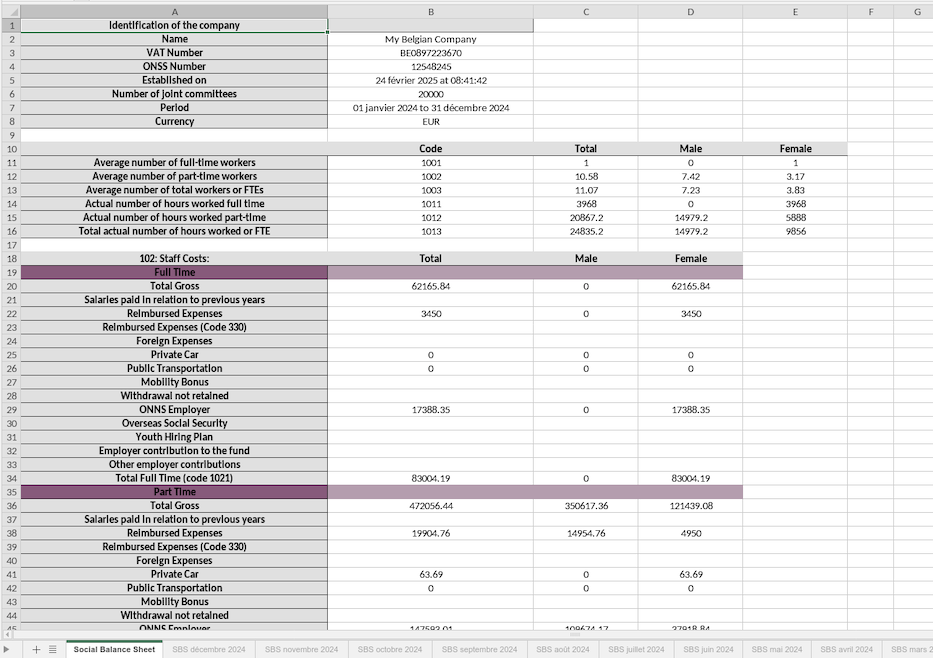

.. _payroll/l10n_be/social_security_certificate:

Social Security certificate
===========================

The Social Security certificate in Odoo provides a detailed breakdown of all social charges paid by
the employee or employer, categorized by type (e.g., year-end bonus, private car reimbursement,
double holiday pay, etc.). This report is particularly useful for audit companies and for verifying
that the declared amounts align with accounting entries.

Accessing the Social Security certificate
-----------------------------------------

To generate the Social Security certificate, follow these steps:

#. Navigate to :menuselection:`Payroll app --> Reporting --> Belgium --> Social Security
   Certificate`.
#. Select the reference :guilabel:`Period`.
#. Choose the data :guilabel:`Aggregation Level`:

   - :guilabel:`Whole Company`
   - :guilabel:`By Department`
   - :guilabel:`By Employee`

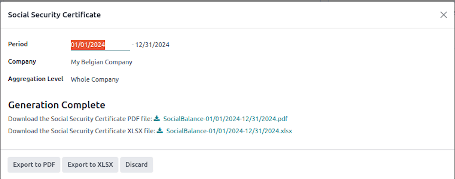

Exporting the report
--------------------

Once the selections are made, you can export the report in different formats:

- Click :guilabel:`Export to PDF` to generate a printable version of the Social Security
  certificate.
- Click :guilabel:`Export to XLSX` to generate an Excel file containing all relevant data.

.. image:: belgium/social-security-certificate-02.png
   :alt: Social Security Certificate PDF Header.

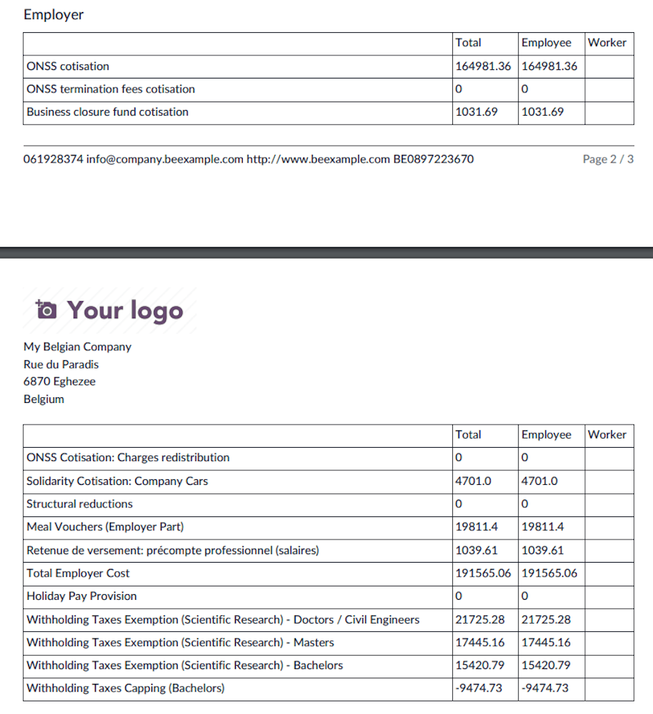

.. image:: belgium/social-security-certificate-04.png
   :alt: Social Security Certificate XLSX Content.

This feature ensures full transparency and compliance with social security regulations in Belgium.

.. _payroll/l10n_be/time_off:

Time off
========

.. _payroll/l10n_be/legal_time_off:

Legal time off
--------------

This guide provides an overview of the basic rules governing legal holiday entitlements in Belgium
for employers using Odoo.

Holiday entitlement calculation
~~~~~~~~~~~~~~~~~~~~~~~~~~~~~~~

Your holiday entitlement for the current year (N) is determined by the number of months worked in
Belgium during the previous year (N-1).

**Calculation details:**

- Employees earn **2 days of leave per month** based on a 6-day work week.
- The entitlement is adjusted for a 5-day work week: :math:`(\text{Total Days} \div 6) \times 5`.

.. example::
   If an employee worked **7 months** in the previous year (N-1):

   - **6-day work week:** :math:`7 \times 2 = 14 \text{ days}`
   - **5-day work week:** :math:`14 \div 6 \times 5 = 11.67 \text{ days}`

**Partial Month Calculation:**

- Worked **1st to 10th**: Full month counted.
- Worked **11th to 19th**: Half month counted.
- Worked **20th onwards**: Month not counted.

**Rounding Rules:**

- Less than **0.35**: Round to **0**.
- Between **0.35 - 0.74**: Round to **0.5**.
- **0.75 and above**: Round to **1**.

For a full-time employee, this typically results in **11.5 days of legal holiday** entitlement.

Maximum holiday entitlement
~~~~~~~~~~~~~~~~~~~~~~~~~~~

Employees are entitled to a maximum of **4 weeks** of holiday based on their working schedule. If an
employee switches between full-time and part-time work, their entitlement is adjusted accordingly.

**Calculation details:**

- **5-day work week**: :math:`4 \times 5 = 20 \text{ days}`
- **4-day work week**: :math:`4 \times 4 = 16 \text{ days}`
- **3-day work week**: :math:`4 \times 3 = 12 \text{ days}`

.. example::
   If an employee joined **Odoo on January 1, 2024**, and plans to switch to a **3-day work week
   from April 1, 2024**:

   **Step 1: Calculate holiday entitlement for 2024**

   - The employee worked **9 months in 2023**.
   - **6-day work week basis**: :math:`9 \times 2 = 18 \text{ days}`
   - Adjusted for **5-day work week**: :math:`18 \div 6 \times 5 = 15 \text{ days}`

   **Step 2: Verify maximum holiday entitlement**

   - For a **5-day work week**, the maximum entitlement is **20 days**.
   - Since the employee is entitled to **15 days**, they remain within the limit.

   **Step 3: Adjust entitlement for the new work schedule**

   - From April 1, 2024, the employee moves to a **3-day work week**.
   - Maximum entitlement for a **3-day work week**: :math:`3 \times 4 = 12 \text{ days}`.
   - If no leave is taken before April 1, the employee may take up to **12 days** from
     their 15-day entitlement.
   - The **remaining 3 days** will be settled at the end of the year.

This ensures compliance with Belgian legal leave regulations and allows employers to manage holiday
entitlements effectively within Odoo.

Legal time off allocation
~~~~~~~~~~~~~~~~~~~~~~~~~

This is possible to generate the legal time off for all your employees at the beginning of a new
year using the wizard in :menuselection:`Payroll app --> Reporting --> Belgium --> Paid Time Off
Allocation`.

Based on your employees occupation over last year, the number of available time off is pre-computed
for each employee.

Once validated, a draft allocation is generated for each single employee, waiting a manual
confirmation that can be done in batch.

.. image:: belgium/paid-time-off-allocation-02.png
   :alt: Paid Time Off Allocations.

.. _payroll/l10n_be/european_time_off:

European time off
-----------------

How does it work?
~~~~~~~~~~~~~~~~~

If you were not subject to Belgian ONSS contributions before joining our company and do not have
entitlement to legal holidays, or if your entitlement is incomplete, you can apply for European
leave.

To qualify for European leave in a given year, you must work for at least 3 months during that year,
whether with us or another employer. Once you have met this requirement, you will earn 5 days of
European leave. Subsequently, you will accumulate additional days of vacation each month as follows:

- After 3 months: 5 days
- After 4 months: 7 days
- After 5 months: 9 days
- After 6 months: 10 days
- After 7 months: 12 days
- After 8 months: 14 days
- After 9 months: 15 days
- After 10 months: 17 days
- After 11 months: 19 days

.. important::
   The total of legal leave and European leave cannot exceed 20 days per year. You must use all your
   legal holidays before taking European leave.

   European leave entitlement expires on December 31st of the year it is earned and cannot be
   carried over to the following year. To qualify for European leave in a new year, you must
   complete another 3 months of work.

How are these days paid?
~~~~~~~~~~~~~~~~~~~~~~~~

European leaves are paid holidays taken in advance of your "Double Holiday Pay" (the June extra pay)
for the following year. Essentially, the more European leave days you take in a given year, the less
you will receive as June extra pay in the following year.

.. _payroll/l10n_be/working_schedule_change:

Working schedule change
=======================

This guide explains how to modify an employee's working time schedule in the Belgian payroll module
of Odoo. Changing an employee's working hours affects their wage calculation, time-off allocation,
and contract terms.

Steps to change an employee's working schedule
----------------------------------------------

#. Navigate to the employee's contract (:menuselection:`Payroll app --> Contracts`), and select the
   contract of the employee whose working schedule you want to modify.
#. Click on :icon:`fa-cog` :guilabel:`(Action)` and select :guilabel:`Working Schedule Change`. The
   wizard displays the current contract details and allows you to set new working time parameters.
#. Set the new working schedule:

   - Choose the new :guilabel:`Working Schedule` from the available resource calendars.
   - Define the :guilabel:`Start Date` for the change (mandatory).
   - If applicable, specify an :guilabel:`End Date`.
   - If the :guilabel:`Part Time` checkbox is selected, any difference between the reference
     calendar and the employee's new calendar will be covered using the *Absence Work Entry Type*.
     This ensures that the employee's monthly salary remains the same, regardless of the number of
     absence days in a given month. This setup is required for configuring *Time Credit*, *Parental
     Leave*, or *Medical Half-Time* correctly.

#. Adjust the employee's wage:

   - The wizard automatically computes the full-time equivalent wage based on the new working
     schedule.
   - You can review and modify the new wage if necessary.

#. Manage time off allocation:

   - Select the relevant :guilabel:`Time Off Type`.
   - Odoo automatically adjusts the employee's time-off entitlement based on the new working
     schedule using the following formula:

     .. math::
        :class: overflow-scroll

        \text{New Time Off Allocation} = \max(\min(\text{ Computed Allocation},
        \text{ Max Allocation}) + \text{ Leaves Taken}, \text{ Leaves Taken})

     - **Computed Allocation** is the expected leave allocation based on the new schedule.
     - **Max Allocation** is the maximum number of days allowed under the new working time.
     - **Leaves Taken** ensures the employee does not receive fewer days than already used.

#. Decide on a follow-up contract

   - If the working time change is temporary, you can enable :guilabel:`Post Change Contract
     Creation` to automatically create a contract that resumes the previous working schedule after
     the specified end date.

#. Validate the changes

   - Click :guilabel:`Validate` to apply the new working schedule.
   - If the new schedule is the same as the current one, an error will be displayed.
   - The system will create a new contract with the updated working time and wage.
   - If a previous contract existed, it will be closed with an end date before the new contract
     begins.

Result
------

- The employee's new working schedule is recorded.
- Wage and time-off entitlements are adjusted accordingly.
- A follow-up contract is created if applicable.

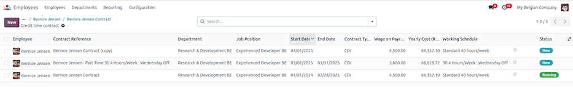

.. _payroll/l10n_be/work_entries_exports:

Work entries exports
====================

What are work entries?
----------------------

In the context of payroll, *work entries* typically refer to records or documentation related to an
employee's work hours and earnings for a specific pay period. These entries are crucial for
accurately calculating and processing employee compensation.

Work entries in the context of payroll are essential for both employees and employers. They provide
a transparent and accurate record of an employee's compensation and deductions, ensuring that
employees are paid correctly and that tax and legal requirements are met. Payroll software and
systems are commonly used to manage and automate these work entries, making the payroll process more
efficient and accurate.

Main concepts
-------------

General
~~~~~~~

In Odoo, work entries mainly refer to *time entries* (attendance tracking), these are work entries
that consist of time records, which include the number of hours worked by an employee during a
given pay period. These entries may specify regular working hours, overtime hours, and any other
relevant time-related information, such as breaks, paid time off, unpaid time off, parental leave,
credit-time, etc.

Work entries serve a dual role in payroll management. First, they enable organizations to
independently compute employee payslips. Second, they facilitate the transmission of pertinent data
to external payroll service providers, who then use this information to calculate and generate the
payslips.

Work entries
~~~~~~~~~~~~

- They have a Name: used to identify the type of entry (e.g., Attendance, Paid Time Off, etc.).
- They have a Payroll Code: used in Odoo's salary rules computations
- They have an External Code: used to provide the correct Work Entry code to an external payroll
  service provider.
- They are generated based on the configuration of the contract and the time off types
- They have a duration, a start and end date, a state and are always linked to an employee.

Work entry types
~~~~~~~~~~~~~~~~

- They are the main source of configuration for your work entries. Thanks to your different types
  of work entries, you'll be able to differentiate the time records of your employees.
- They have a name.
- They contain a code, external code, payroll code and a color for visual tracking.
- They allow other types of configurations such as how they are displayed in payslips, decide
  whether this type of work entry should be considered as paid or unpaid (eg. unpaid leave), decide
  whether this type of work entry has a link with time off, is valid for some advantages or how it
  should be reflected in your reporting.

Time off types
~~~~~~~~~~~~~~

As mentioned above, since work entry types can be linked to a time off type, you are also able to
define the work entry type for each time-off type. On the time off type you have a many2one
relation with the work entry type.

Steps to generate the work entries of your staff
------------------------------------------------

#. Create all the employees
#. Create a contract and set its status to :guilabel:`Running` for each employee.

   In the contract, choose the :guilabel:`Work Entry Source`. It tells the system how work entries
   for an employee should be generated. It can be based on:

   - :guilabel:`Working Schedule`: Odoo uses the predefined working hours and days set in the
     employee's working schedule to generate work entries. This is useful for regular, predictable
     shifts.
   - :guilabel:`Attendances`: Work entries are generated from the employee's attendance records
     (i.e., when they check-in and check-out).
   - :guilabel:`Planning`: Work entries are created based on the validated shifts or slots allocated
     to the employee in the **Planning** app (often used for scheduling roles like retail shifts,
     restaurants, etc.).

#. Generate the work entries each month

   Odoo automatically creates the work entries in the **Payroll** app based on the work entry source
   of the contract and the different time-offs taken. You can edit the work entries manually. You
   can always decide to regenerate work entries manually but be careful if you already made some
   manual changes, Odoo will regenerate the work entries based on what it knows (e.g., your working
   schedule and time off).
#. Managing conflicts

   Conflicts are pointing to entries that can't be validated without your intervention. This means
   you'll have to qualify the entry and decide which is the correct entry to be defined for the time
   period if you want to be able to generate the payslip or validate the entries. Conflicts arise
   when there are overlapping entries or when Odoo detects that there is a time off request still
   pending for validation. For instance, if an employee is marked as attending work and at the same
   time there's a paid leave request to be validated for the same period, that's a conflict.

   Conflicts can be managed by filtering on the conflicting entries and resolving the discrepancy.
   Since **Odoo 16.4**, Odoo filters by default on conflicting entries. For prior versions, you can
   still filter manually on conflicting entries or use the conflicting menu item.
#. Once the conflict is resolved you can either proceed to generate the payslips for your employees
   or export your work entries to the right entity.

Export work entries
-------------------

.. tip::
   This section is about exporting work entries to SD Worx, but the configuration and behavior is
   similar for other exports to Partena, Group S and UCM.

Introduction
~~~~~~~~~~~~

This sheet is here to help you learn how Odoo's **SD Worx** (`l10n_be_hr_payroll_sd_worx`) module
simplifies payroll by enabling easy export of work entries. This guide provides quick steps to
generate :file:`.txt` files for direct import into SD Worx calendars, saving time and ensuring
accuracy.

First and foremost, it's important to understand there is no direct integration between Odoo and
SD Worx. There is no automatic exchange of information, either way. Odoo does not communicate
directly with SD Worx, and the reverse is also true.

How does it work?
~~~~~~~~~~~~~~~~~

In reality, Odoo provides a standardized export in .txt format for employees' work entries,
allowing the generation of a file that conforms to a specific format for inputting these entries
into the SD Worx software.

What does it mean in terms of data management?
~~~~~~~~~~~~~~~~~~~~~~~~~~~~~~~~~~~~~~~~~~~~~~

Since there is no direct integration between both systems, it implies that certain data will need
to be manually entered into both systems. For instance, when you create a new employee in Odoo,
you'll also need to manually create the employee in SD Worx (and vice versa). This manual data
entry requirement extends to various aspects such as contracts, work schedules, salary details,
and personal information about employees.

Essentially, all the information necessary for SD Worx to calculate salaries and generate payslips
must be manually inputted into both systems.

What's the advantage of exporting to SD worx?
~~~~~~~~~~~~~~~~~~~~~~~~~~~~~~~~~~~~~~~~~~~~~

Odoo is an integrated software that can comprehensively handle all variable payroll elements,
including employee personal information, contract details, various time-off types, and other work
entry categories. Through Odoo's integration capabilities, you can access all this crucial data in
one centralized location, making it easily accessible for your HR team and employees.

This integration not only ensures data accuracy but also maintains consistency, reducing the
likelihood of errors when transmitting work entry information to your external payroll provider.
With the module in place, a single click generates a :file:`.txt` file that's ready for direct
import into SD Worx, streamlining the entire data transmission process.

Steps to set up the SD Worx module
~~~~~~~~~~~~~~~~~~~~~~~~~~~~~~~~~~

.. important::
   You must be logged into a Belgian company for the following steps to work.

#. :ref:`install <general/install>` the **Belgium - Payroll - Export to SD Worx**
   (`l10n_be_hr_payroll_sd_worx`) module.
#. Go to :menuselection:`Payroll app --> Configuration --> Settings` to fill in the :guilabel:`SD
   Worx code` field. This is the company's SD Worx code, you get it directly from the SD worx
   software. When you create a company, it has a unique identifier which you need to set in the
   field.
#. For each employee, under the :guilabel:`Settings` tab, fill in the :guilabel:`SDWorx code` field.
#. For work entry types, under the :guilabel:`Settings` tab, fill in the :guilabel:`SDWorx code`
   field as well.

You can now export your work entries in the SD Worx :file:`.txt` format by opening the wizard under
:menuselection:`Payroll app --> Reporting --> Belgium --> Export Work Entries to SDWorx`.

The file contains a series of lines such as the following line of text:
`1111110000024K2023042370100360`

Each line represents a work entry, and the structure is outlined below:

- `111111` -> Company SD Worx code
- `0000024` -> Employee SD Worx code
- `K` -> Delimiter
- `20230423` -> Date
- `7010` -> SD Worx work entry code
- `0360` -> Duration (edited)

Once the :file:`.txt` file is exported, it can be directly imported in this format into the SD Worx
software. Doing so updates the calendars of each collaborator.

.. _payroll/l10n_be/274xx_sheets:

274.XX sheets
=============

This section provides an overview of Declaration 274, its components, and how it is handled within
Odoo.

Declaration 274.10
------------------

Withholding tax is an advance payment on professional income tax. It is calculated based on
guidelines established by the tax administration. While reducing withholding tax is generally not
allowed, employees may request to pay more in order to better match their final tax liability.

Withholding tax must be deducted from both employees' and company directors' income. If the
withholding tax is insufficient, advance tax payments must be made to avoid additional tax
penalties.

In practice, some employees do not inform their employer of personal changes (e.g., having a child),
which can affect tax calculations.

Withholding tax must be declared and paid either quarterly or monthly using form 274. These
declarations must be submitted via the FINPROF application by the 15th of the month following the
reporting period.

Taxable income and corresponding withholding tax must be recorded in fiscal remuneration forms
281.x and summary statements 325x. Employers failing to report these correctly may be subject to a
309% penalty on undisclosed amounts.

The tax administration compares the declared amounts in form 274 with the amounts reported in the
fiscal forms. If withholding tax payments are insufficient, the company may be charged the
difference. If a 274 form is submitted without corresponding tax payment, additional tax penalties
will apply.

It is crucial to adhere to all administrative guidelines to avoid unexpected tax charges.

Declarations 274.32, 274.33, 274.34
-----------------------------------

Withholding tax exemptions for research employees
~~~~~~~~~~~~~~~~~~~~~~~~~~~~~~~~~~~~~~~~~~~~~~~~~

Companies employing scientific researchers may qualify for withholding tax reductions under
specific conditions:

- **Form 281.32** applies to civil engineers and PhD holders.
- **Form 281.33** applies to employees holding a master's degree.
- **Form 281.34** applies to employees holding a bachelor's degree.

Employers engaged in scientific research may be eligible for an exemption from withholding tax
payments. To qualify, they must register their R&D projects with Belspo. From August 1, 2023, this
registration must occur before the project begins.

Tax exemption details
~~~~~~~~~~~~~~~~~~~~~

This tax incentive allows companies to retain 80% of the withholding tax deducted from researchers'
salaries. However, the exemption rate differs for researchers based on their qualifications:

- PhD and master's degree holders: Full 80% exemption.
- Bachelor's degree holders: 50% of the full exemption amount.
- For non-SME companies, this limit is further reduced to 25%.

The exemption applies only to the portion of working time dedicated to scientific research, covering
fundamental research, industrial research, or experimental development.

This exemption does not affect the net salary of employees.

Capping rules
~~~~~~~~~~~~~

The total exemption granted to researchers with a bachelor's degree is limited to 25% of the
exemption granted to PhD and master's degree holders. For small companies (as defined in Article 15
§§ 1-6 of the Companies Code), this limit is doubled. These rules have remained unchanged since
January 1, 2020.

How it works in Odoo
--------------------

Odoo automates the calculation and declaration of withholding tax exemptions using predefined
payroll structures. Below is an explanation of how the system processes these exemptions.

Navigate to :menuselection:`Payroll app --> Reporting --> 274.XX Sheets` to create a
new declaration.

Select the reference :guilabel:`Year` and :guilabel:`Month`, and the different amounts are computed
accordingly.

#. **Payroll calculation**

   - Odoo calculates gross salary and total withholding tax.
   - It accounts for specific payroll components, including December double bonuses.

#. **Filtering eligible payslips**

   - Payslips linked to research-related contracts are considered.
   - Employees are categorized based on their qualifications (PhD, master's, or bachelor's degrees).

#. **Exemption calculation**

   - The withholding tax exemption is calculated at 80% of the withheld amount.
   - Exemptions for bachelor's degree holders are capped according to regulations.

#. **Final adjustments**

   - The system ensures compliance with legal capping rules.
   - If necessary, adjustments are made based on the total exemption granted.

Click on :guilabel:`Export XML file` to generate the file to post on FINPROF portal and the
structured communication to link to your payment.

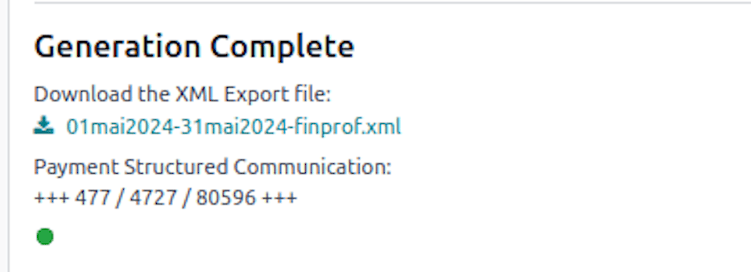

Click on :guilabel:`Create 274.XX Sheets` to generate the :file:`.pdf` files of those declarations.

.. note::
   In order to for the exemption to work properly, the *Certificate Level* should be correctly
   configured on the employee's form.

   The *Time Percentage R&D* rate should be specified on the employee's contract form as well.

If the accounting application is installed and running properly, you can also post directly the
different amounts in your accounting entries with the :guilabel:`Post Journal Entries` button.

.. note::
   If the *Post Journal Entries* is not present on the wizard, you need to configure the journal and
   the different accounts for each amount type from :menuselection:`Payroll app --> Configuration
   --> Settings`.

   In the :guilabel:`Belgian Localization` section, complete each of the :guilabel:`Witholding
   Taxes Exemption` journal entry accounts.

Employers using Odoo can efficiently manage and report withholding tax exemptions, ensuring
compliance with regulatory requirements.

For further details, consult the Odoo finance documentation or your tax adviser.

.. _payroll/l10n_be/28110_declaration:

281.10 Declaration
==================

Introduction
------------

The Belgian fiscal declaration 281.10 is an annual statement that employers must submit to the tax
authorities, detailing the salaries and benefits provided to each employee. This declaration ensures
accurate tax calculations and compliance with Belgian tax regulations.

Generating the declaration in Odoo
----------------------------------

Odoo provides a streamlined process for generating the 281.10 declaration, offering both a
comprehensive XML file for electronic submission and individual PDF files for record-keeping.

Global XML declaration
~~~~~~~~~~~~~~~~~~~~~~

To generate the global XML file in Odoo, navigate to :menuselection:`Payroll app --> Reporting -->
281.10 Sheet`.

Then, create a new record by selecting the reference :guilabel:`Year`.

.. important::
   The :guilabel:`Sending Type` and :guilabel:`Treatment Type` options are currently experimental
   and should be kept at their default values to ensure a valid original declaration.

Click the :guilabel:`Populate` button to generate the eligible employees, then click the
:guilabel:`Create XML` button. A green indicator will appear to confirm successful file generation.

Individual PDF declaration
~~~~~~~~~~~~~~~~~~~~~~~~~~

To generate individual PDF files for each employee, click the :guilabel:`Populate` button. A line is
generated for each employee who received a payslip during the reference year.

.. note::
   The PDF files are generated automatically in batches of 30, so the process may take some time to
   complete.

Once all PDF files are generated, they can be posted to the employee documents portal if the
**Documents** application is :doc:`installed and properly configured
<../../../productivity/documents>`.

Select the employees whose documents you want to post, then click the :guilabel:`Post PDF` button.

Once posted, employees can access the PDF from their documents portal via the :icon:`fa-file-text`
:guilabel:`Documents` smart button on their profile.

Submitting the XML declaration
------------------------------

After generating the XML file, it must be submitted to the Belgian tax authorities. Ensure you are
familiar with the `official submission process
<https://finances.belgium.be/fr/E-services/Belcotaxonweb/documentation-technique>`_.

The XML files containing the fiscal data to be sent via the Belcotax-on-web (BOW) application must
be converted to the .bow format.

This conversion requires the use of a validation module available under the *Technical
Documentation* section.

The validation module has two prerequisites:

- Java 8 must be installed.
- The certificate authority that signed the validation module must be recognized.

.. _payroll/l10n_be/28145_declaration:

281.45 Declaration
==================

Introduction
------------

The Belgian fiscal declaration 281.45 is an annual statement that entities must submit to the tax
authorities, detailing the amounts of author's rights and neighboring rights paid to beneficiaries.
This declaration ensures accurate tax reporting and compliance with Belgian tax regulations.

Generating the declaration in Odoo
----------------------------------

Odoo provides a streamlined process for generating the 281.45 declaration, offering both a
comprehensive XML file for electronic submission and individual PDF files for record-keeping.

Global XML declaration
~~~~~~~~~~~~~~~~~~~~~~

To generate the global XML file in Odoo, navigate to :menuselection:`Payroll app --> Reporting -->
281.45 Sheet`.

Then, create a new record by selecting the reference :guilabel:`Year`.

.. important::
   The :guilabel:`Sending Type` and :guilabel:`Treatment Type` options are currently experimental
   and should be kept at their default values to ensure a valid original declaration.

Click the :guilabel:`Populate` button to generate the eligible employees, then click the
:guilabel:`Create XML` button. A green indicator will appear to confirm successful file generation.

Individual PDF declaration
~~~~~~~~~~~~~~~~~~~~~~~~~~

To generate individual PDF files for each employee, click the :guilabel:`Populate` button. A line
is generated for each employee who received a payslip during the reference year.

.. note::
   The PDF files are generated automatically in batches of 30, so the process may take some time to
   complete.

Once all PDF files are generated, they can be posted to the employee documents portal if the
**Documents** application is :doc:`installed and properly configured
<../../../productivity/documents>`.

Select the employees whose documents you want to post, then click the :guilabel:`Post PDF` button.

Once posted, employees can access the PDF from their documents portal via the :icon:`fa-file-text`
:guilabel:`Documents` smart button on their profile.

Submitting the XML declaration
------------------------------

After generating the XML file, it must be submitted to the Belgian tax authorities. Ensure you are
familiar with the `official submission process
<https://finances.belgium.be/fr/E-services/Belcotaxonweb/documentation-technique>`_.

The XML files containing the fiscal data to be sent via the Belcotax-on-web (BOW) application must
be converted to the :file:`.bow` format.

This conversion requires the use of a validation module available under the *Technical
Documentation* section.

The validation module has two prerequisites:

- Java 8 must be installed.
- The certificate authority that signed the validation module must be recognized.
