.. _payroll/hong_kong:

=========
Hong Kong
=========

The Hong Kong payroll localization ensures all salary computations strictly comply with the
`Employment Ordinance (Cap. 57) <https://www.labour.gov.hk/eng/legislat/content2.htm>`_ and
`Inland Revenue Department (IRD) <https://www.ird.gov.hk/eng/ese/erc.htm>`_ requirements.
This includes automated calculations for Mandatory Provident Fund (MPF) contributions, the
generation of IR56 reports, and the processing of leave payments such as Payment in Lieu of
Notice, Severance Payments (SP), and Long Service Payments (LSP)—fully updated for the 2025
MPF offsetting transition rules.

.. note::
   Before configuring the Hong Kong localization, refer to the general :doc:`payroll
   <../../payroll>` documentation. It covers foundational information applicable to all
   localizations, including universal settings, salary structures, and global payroll fields.

.. _payroll/hk/apps_modules:

Apps & modules
==============

:ref:`Install <general/install>` the following modules to get all the features of the Hong
Kong payroll localization:

.. list-table::
   :header-rows: 1

   * - Name
     - Technical name
     - Description
   * - :guilabel:`Hong Kong - Accounting`
     - `l10n_hk`
     - The base module to manage the chart of accounts and localization for Hong Kong.
   * - :guilabel:`Hong Kong - Payroll`
     - `l10n_hk_hr_payroll`
     - Enables payroll specific localization features for the Odoo Payroll app. This module
       also installs Hong Kong - Payroll with Accounting and Documents - Hong Kong Payroll.
   * - :guilabel:`Hong Kong - Payroll with Accounting`
     - `l10n_hk_hr_payroll_account`
     - Installs the link between Hong Kong payroll and accounting.
   * - :guilabel:`Hong Kong - Payroll eMPF`
     - `l10n_hk_hr_payroll_empf`
     - Enables the eMPF module to process eMPF contributions and reports.
   * - :guilabel:`Documents - Hong Kong Payroll`
     - `documents_l10n_hk_hr_payroll`
     - Integrates employee IR56 forms in the Odoo Documents app.

.. seealso::
   :doc:`Configure the Hong Kong fiscal localization
   <../../../finance/fiscal_localizations/hong_kong>`

.. _payroll/hk/general_configurations:

General configurations
======================

Odoo supports multicompany management. First, the company must be configured. Navigate to
:menuselection:`Settings app --> Users & Companies --> Companies`. Create a new company or select
an existing one, and configure the following fields:

- :guilabel:`Company Name`: Enter the business name in this field.
- :guilabel:`Address`: Complete the full address, including the :guilabel:`City`,
  :guilabel:`State`, :guilabel:`Zip Code`, and :guilabel:`Country`.
- :guilabel:`Currency`: By default, `HKD` is selected. If not, select `HKD` from the
  drop-down menu.
- :guilabel:`Phone`: Enter the company phone number.
- :guilabel:`Email`: Enter the email used for general contact information.

.. note::
   The :guilabel:`Company Name` entered here automatically populates as the Employer's
   Name on reports for IRD reporting. Only `HKD` is supported for compliant Hong Kong
   localization payroll calculations.

.. _payroll/hk/payroll_configuration:

Payroll configuration
=====================

Several sections in the configuration menu (Settings, Salary Structures & Rules, Work Entry
Types, Working Schedule, MPF Scheme) define specific localization rules for Hong Kong.

Settings
--------

Advantages
~~~~~~~~~~

- :guilabel:`HK: Internet Subscription`: Add a default monthly internet allowance.
- :guilabel:`End of Year Payments Month`: Select the month to automatically add end-of-year
  payments to payslips (if any).
- :guilabel:`Use MPF Offsetting`: Enable this to define pre-set and post-set offset periods
  for calculating Severance Payments (SP) and Long Service Payments (LSP).

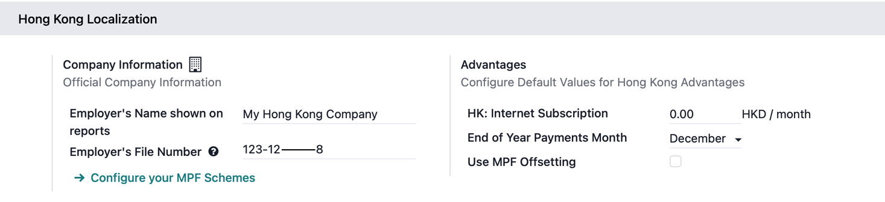

.. tip::
   The Advantages section is optional. Configuring benefits here applies the same value to
   all employees, reducing manual configuration.

Accounting section
~~~~~~~~~~~~~~~~~~

Configure the entries for the :guilabel:`Accounting` section:

- :guilabel:`Payroll HSBC Autopay`: Enable to create HSBC payment files.
- :guilabel:`Batch Account Move Lines`: Enable to merge all accounting entries for the same
  period into a single account move line. This anonymizes accounting entries but disables
  single payment generations.

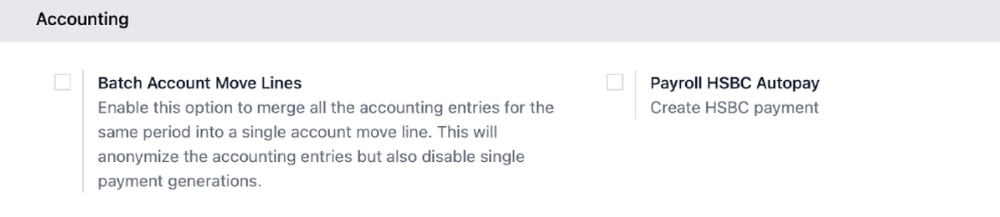

.. _payroll/hk/structures_rules:

Structures & rules
------------------

Navigate to :menuselection:`Payroll app --> Configuration --> Structures --> Rules` to check
salary rules or configure specific company salary rules.

CAP57: Employees Monthly Pay
~~~~~~~~~~~~~~~~~~~~~~~~~~~~

Odoo provides the :guilabel:`CAP57: Employees Monthly Pay` salary structure to calculate
compliant payroll for regular employees. The following salary rules are mandatory, which
are added automatically to payslips:

- :guilabel:`Rent Allowance`: Amount derived from the employee's active rental record.
- :guilabel:`Basic Salary`: Amount of base salary provided (after rent allowance deduction).
- :guilabel:`713 Gross`: Net payable amount considering commissions, internet allowance,
  reimbursements, back-pay, deductions, etc.
- :guilabel:`MPF Gross`: Net payable amount from 713 gross after consideration of additional
  allowances, deductions, and end-of-year payment.
- :guilabel:`Employee Mandatory Contribution`: Mandatory employee MPF contribution.
- :guilabel:`Employer Mandatory Contribution`: Mandatory employer MPF contribution.
- :guilabel:`Employee Voluntary Contribution`: Voluntary employee contribution (if any).
- :guilabel:`Employer Voluntary Contribution`: Voluntary employer contribution (if any).
- :guilabel:`Employer Voluntary Contribution 2`: Additional voluntary employer contribution
  (if any).
- :guilabel:`Gross`: Net payable amount from MPF gross after consideration of MPF deductions.
- :guilabel:`Net Salary`: Final payable amount to be paid to the employee.

The following salary rules are optional rules for employee benefits, which can be manually
added as salary inputs in the payslip under the :guilabel:`Salary Inputs` tab:

- :guilabel:`Back Pay`: Additional salary payout can be included under this category.
- :guilabel:`Commission`: The commission earned during the period can be manually entered.
- :guilabel:`Global Deduction`: A lump-sum deduction from the entire payslip.
- :guilabel:`Global Reimbursement`: A lump-sum reimbursement to the entire payslip.
- :guilabel:`Referral Fee`: The additional bonus offered for any form of business-related
  referral.
- :guilabel:`Moving Daily Wage`: To override the ADW value used for leave computation.
- :guilabel:`Skip Rent Allowance`: If set, the rental allowance is excluded from the current
  payslip.
- :guilabel:`Custom Average Monthly Salary`: To override the average monthly salary used for
  end-of-year payment (rule is only applicable to payslips generated in December).

CAP57: Payment in Lieu of Notice
~~~~~~~~~~~~~~~~~~~~~~~~~~~~~~~~

Odoo provides the :guilabel:`CAP57: Payment in Lieu of Notice` salary structure to process a
final payment to an employee in place of serving a required notice period upon termination.

Mandatory rule for this salary structure which is automatically added to the payslip:

- :guilabel:`Payment in Lieu of Notice`: This is the calculated amount paid to the employee
  corresponding to the unserved notice period.

Optional rule for this salary structure which can be manually added as a salary input in the
payslip under the :guilabel:`Salary Inputs` tab:

- :guilabel:`Lieu of Notice Period (Months)`: Only applicable to the `CAP57: Payment in Lieu
  of Notice` salary structure. By default, the final payout is set to 1-month. Use the
  :guilabel:`Count` field under the salary inputs tab to set a different notice period duration.

CAP57: Long Service Payment (LSP)
~~~~~~~~~~~~~~~~~~~~~~~~~~~~~~~~~

Odoo provides the :guilabel:`CAP57: Long Service Payment` salary structure to process an
employee whose continuous employment with the employer, under a contract of employment,
reaches 5 years.

Mandatory rules for this salary structure which are automatically added to the payslip:

- :guilabel:`Long Service Payment`: The final calculated amount of long service payment paid
  to the employee (after applying offsets, if any).
- :guilabel:`Long Service Payment Pre Transition`: The portion of the long service payment
  calculated based on the employment period before the transition date of the offsetting
  arrangement, where MPF contributions can still be used to offset the payment.
- :guilabel:`Long Service Payment Post Transition`: The portion of the long service payment
  calculated based on the employment period on or after the transition date of the offsetting
  arrangement.

Enable :guilabel:`Use MPF Offsetting` in the Hong Kong localization section to use these
offset salary rules:

- :guilabel:`Pre-transition Offset`: The amount of MPF contribution (or benefits from an
  :abbr:`ORSO (Occupational Retirement Schemes Ordinance)` scheme) that can be used to offset
  the pre-transition amount.
- :guilabel:`Post-transition Offset`: The amount of MPF contribution (or benefits from an
  :abbr:`ORSO (Occupational Retirement Schemes Ordinance)` scheme) that can be used to offset
  the post-transition amount.

CAP57: Severance Payment (SP)
~~~~~~~~~~~~~~~~~~~~~~~~~~~~~

Odoo provides the :guilabel:`CAP57: Severance Payment` salary structure to process an
employee whose continuous employment with the employer, under a contract of employment,
reaches 2 years.

Mandatory rules for this salary structure which are automatically added to the payslip:

- :guilabel:`Severance Payment`: The final calculated amount of severance payment paid to the
  employee (after applying offsets, if any).
- :guilabel:`Severance Payment Pre Transition`: The portion of the severance payment
  calculated based on the employment period before the transition date of the offsetting
  arrangement, where MPF contributions can still be used to offset the payment.
- :guilabel:`Severance Payment Post Transition`: The portion of the severance payment
  calculated based on the employment period on or after the transition date of the offsetting
  arrangement.

Enable :guilabel:`Use MPF Offsetting` in the Hong Kong localization section to use these
offset salary rules:

- :guilabel:`Pre-transition Offset`: The amount of MPF contribution (or benefits from an
  :abbr:`ORSO (Occupational Retirement Schemes Ordinance)` scheme) that can be used to offset
  the pre-transition amount.
- :guilabel:`Post-transition Offset`: The amount of MPF contribution (or benefits from an
  :abbr:`ORSO (Occupational Retirement Schemes Ordinance)` scheme) that can be used to offset
  the post-transition amount.

.. _payroll/hk/work_entry_types:

Work entry type
---------------

Navigate to :menuselection:`Payroll app --> Configuration --> Work Entries --> Work Entry
Types` to check work entry types or configure a new work entry type.

In defining each work entry type for Hong Kong, employers can define:

- :guilabel:`Rate`: The rate that is used to calculate for each leave (e.g., 80% for
  sick leave).
- :guilabel:`ADW Calculation`: Enable this to calculate the employee's pay according to the
  Average Daily Wage (ADW) rules under Hong Kong employment regulations.

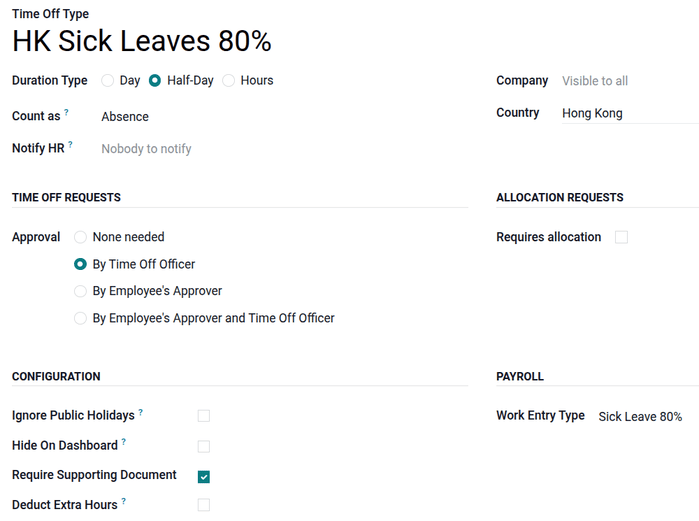

Odoo supports 11 work specific HK work entry types which are used together with the
**Time Off** app:

- :guilabel:`Sick Leave 80%`: Paid sick leave compensated at 80% of the employee's average
  daily wage.
- :guilabel:`Compassionate Leave`: Leave granted for personal emergencies, such as the death
  of a family member.
- :guilabel:`Marriage Leave`: Time off granted to an employee for their wedding.
- :guilabel:`Examination Leave`: Leave granted to an employee to take professional
  examinations.
- :guilabel:`Maternity Leave`: Statutory leave granted to female employees for childbirth.
- :guilabel:`Maternity Leave 80%`: Maternity leave compensated at 80% of the average daily
  wage.
- :guilabel:`Paternity Leave`: Statutory leave granted to male employees following a child's
  birth.
- :guilabel:`Statutory Holiday`: Mandatory public holidays recognized by Hong Kong employment
  law.
- :guilabel:`Public Holiday`: General holidays observed by banks and businesses in Hong Kong.
- :guilabel:`Weekend`: Standard non-working days for the employee.

.. _payroll/hk/mpf_schemes:

MPF schemes
-----------

Odoo allows multiple MPF scheme configurations (currently 24 schemes), creation of new
schemes, different MPF groups and member classes, and definition of income for automated MPF
calculations. In alignment with eMPF requirements, Odoo-generated eMPF contribution reports
are ready to upload to the `eMPF portal <https://www.empf.org.hk/?language_id=1>`_.

Configuring an eMPF scheme
~~~~~~~~~~~~~~~~~~~~~~~~~~

Follow these steps to configure an eMPF scheme:

1. Click :guilabel:`New` or select an eMPF scheme to configure. Enter the
   :guilabel:`Employer Account No.` (this value is specific to the current company).
2. Click :guilabel:`Add a line` to create new payroll groups (used for mandatory
   contributions) and member classes (used for voluntary contributions).

.. note::
   Employers can define one default payroll group or member class which is shown as the
   default selection upon MPF selection whenever creating new employees in
   :menuselection:`Employees --> Payroll --> MPF`.

In creating a member class, click :guilabel:`View` to configure each contribution type,
option, amount of income, and definition of income.

- :guilabel:`Contribution Type`: Select :guilabel:`Employee's Voluntary Contribution`,
  :guilabel:`Employer's Voluntary Contribution`, or :guilabel:`Employer's Voluntary Contribution 2`.
- :guilabel:`Option`: Defines how much voluntary contribution is calculated.

  - :guilabel:`Fixed Percentage of Income`: Contribution according to a percentage.
  - :guilabel:`Fixed Amount`: Contribution according to a fixed amount.
  - :guilabel:`Match Employee's Voluntary Contribution`: Contribution matches the employee's
    voluntary contribution.
  - :guilabel:`Fixed Percentage of Income minus Mandatory Contribution`: Contribution capped
    with mandatory contribution.

- :guilabel:`Amount`: Amount to apply as a percentage or fixed amount.
- :guilabel:`Definition of Income`: Define which income is used to calculate voluntary
  contributions.

  - :guilabel:`Relevant Wages`: Based on all wages (commissions, bonuses, etc.) the employee
    receives after calculation.
  - :guilabel:`Basic Wage`: Based on the basic wage (wage on contract) the employee receives.

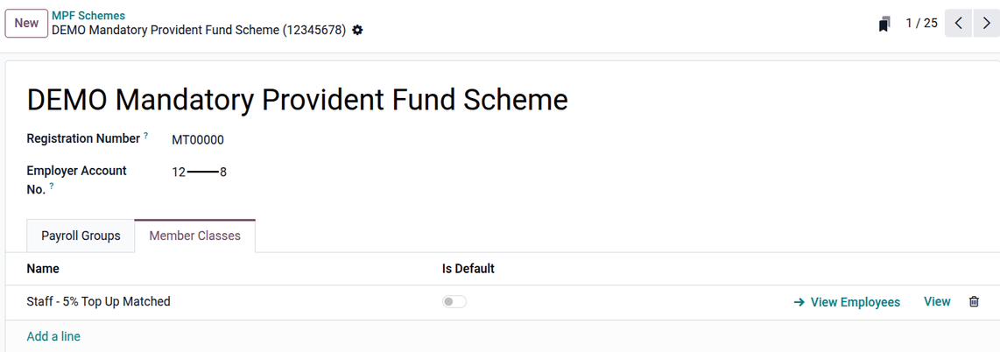

.. _payroll/hk/employee_configuration:

Employee configuration
======================

To create an employee record, navigate to :menuselection:`Payroll app --> Employees -->
Employees`. Click :guilabel:`New` in the upper-left corner. Fill in the primary contact
details, then configure the following tabs:

Work tab
--------

Under the :guilabel:`Work` tab, configure organizational information.

- :guilabel:`Work`: Set department, job title, and manager.
- :guilabel:`Departure`: Only visible after archiving an employee record.

  - :guilabel:`Departure reason`: Used in eMPF reports for termination payment checks.
  - :guilabel:`Departure date`: Used in IR56 forms.

Personal tab
------------

Under the :guilabel:`Personal` tab, configure personal information.

- :guilabel:`Private Contact`: Set surname, given name, name in Chinese (if any), private
  email, phone number, and bank accounts.
- :guilabel:`Personal information`: Set employee legal name, birth date, and gender.
- :guilabel:`Identification No`: Set the HKID of the employee.
- :guilabel:`Location`: Set :guilabel:`Private Address`.

.. important::
   The :guilabel:`Bank Account` needs to be marked as *trusted*. Having an untrusted bank
   account for an employee causes an error in the pay run. To achieve this, click on the
   right-arrow button next to the bank account number field. Set the
   :guilabel:`Send Money to` field to :guilabel:`Trusted` by clicking on the toggle.

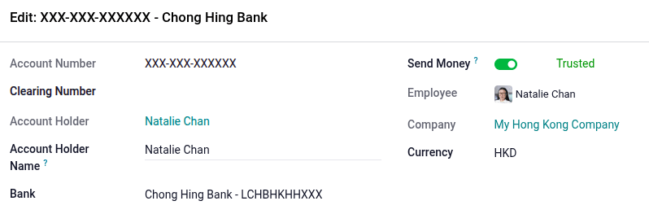

.. note::
   Mandatory personal information for government reports:
   MPF: :guilabel:`Surname`, :guilabel:`Given Name`, :guilabel:`Name in Chinese`,
   :guilabel:`Phone`, :guilabel:`Birthday`, :guilabel:`Private Address`,
   :guilabel:`Identification No` / :guilabel:`Passport No`.
   IRD Reports: :guilabel:`Surname`, :guilabel:`Given Name`, :guilabel:`Phone`,
   :guilabel:`Birthday`, :guilabel:`Gender`, :guilabel:`Identification No` /
   :guilabel:`Passport No`.

Payroll tab
-----------

Contract overview section
~~~~~~~~~~~~~~~~~~~~~~~~~

- :guilabel:`Contract`: Select contract start and end dates for contract management.
- :guilabel:`Wage Type`: Select :guilabel:`Fixed Wage` or :guilabel:`Hourly Wage`.
- :guilabel:`Wage`: Define the employee's monthly wage.
- :guilabel:`Pay Category`: Select :guilabel:`CAP57: Hong Kong Employee` for monthly Hong
  Kong payroll calculations. This defines when the employee is paid, their default working
  schedule, and the work entry type it applies to.

.. tip::
   When the hourly wage option is selected, the :guilabel:`Hourly Wage` field is displayed to
   input the employee's hourly rate. You shouldn't put any value in the :guilabel:`Wage`
   field for hourly paid employees, as that field is based on monthly pay.

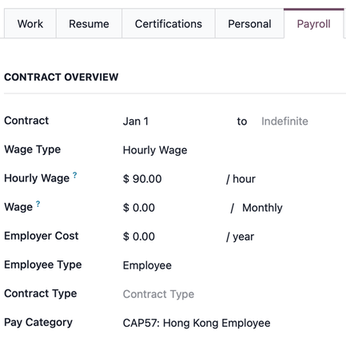

Schedule section
~~~~~~~~~~~~~~~~

- :guilabel:`Work Entry Source`: Select either :guilabel:`Working Schedule`,
  :guilabel:`Attendances`, or :guilabel:`Planning`. This field determines how the work
  entries are accounted for in the payslip.

  - :guilabel:`Working Schedule`: Work entries are generated automatically based on the
    employee's working schedule.
  - :guilabel:`Attendances`: Work entries are generated based on the check-in and check-out
    period logged in the **Attendances** app.
  - :guilabel:`Planning`: Work entries are generated from planning shifts only.

- :guilabel:`Working Hours`: Select :guilabel:`HK Standard 40 hours/week` or any newly
  created working schedule.

MPF section
~~~~~~~~~~~

- :guilabel:`Exempt of MPF`: Enable this option for MPF-exempt employees.
- :guilabel:`MPF Scheme`: Select the MPF scheme.
- :guilabel:`Member Account No.`: Enter the employee's member account number.
- :guilabel:`Payroll Group`: Select the MPF payroll group.
- :guilabel:`Member Class`: Select the MPF member class for voluntary contributions.
- :guilabel:`Registration Status`: Define employee status.

  - :guilabel:`Registration At Next Contribution`: Select for enrolling a new MPF member.
  - :guilabel:`Registered`: Select for an existing MPF member.
  - :guilabel:`Terminated`: Select for a terminated MPF member.

- :guilabel:`Start Contribution`: Define the contribution starting period for new or existing
  members.

  - :guilabel:`Immediately Upon Registration`: Start contribution after registering MPF,
    starting from the first payslip.
  - :guilabel:`At Due Date`: Start contribution after the contribution holiday period. This
    starts its contribution mostly in the second or third payslip.

- :guilabel:`Date of Joining the Scheme`: Leave empty to set the date automatically upon
  registration through the eMPF contribution report date.

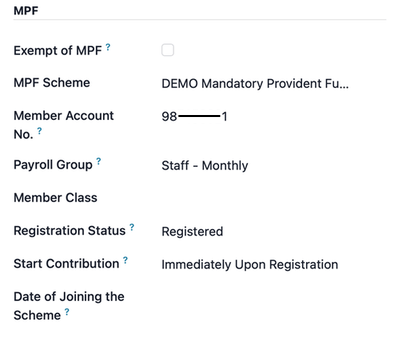

Benefits section
~~~~~~~~~~~~~~~~

- :guilabel:`Internet Subscription`: Set an additional internet allowance on top of the
  current salary package.
- :guilabel:`Current Rental`: Configure rental information that is used as a rental allowance
  in the payslip for the IR56B reporting period.

To create a rental record:
Click the :guilabel:`History` button near the current rental field. Click :guilabel:`New` to
create a rental history. Enter the rental reference, rental start date, rental end date,
rental type, rental amount, and address. Change the rental status to :guilabel:`Running`.

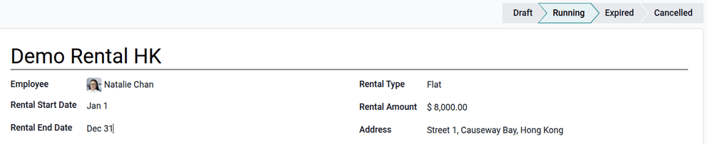

.. note::
   Rental status definition:
   :guilabel:`Draft`: Rental just created.
   :guilabel:`Running`: Rental amount starts adding to payslips from the rental start date.
   :guilabel:`Expired`: Rental amount is no longer added to payslips.
   :guilabel:`Cancelled`: Rental has been canceled.

.. _payroll/hk/run_hk_payroll:

Run HK payroll
==============

Before running payroll, the payroll officer must validate employee work entries to confirm
pay accuracy and catch errors. This includes checking that all time off is approved and any
overtime is appropriate.

Work entries sync based on the employee's contract configuration. Odoo pulls from the
assigned working schedule, attendance records, planning schedule, and approved time off. Any
discrepancies or conflicts must be resolved, then the work entries can be regenerated.

Once everything is correct, draft payslips can be created individually or in groups, referred
to in the **Payroll** app as pay runs.

.. note::
   If the work entry or salary inputs for an employee are amended, click the (gear) icon
   :menuselection:`--> Recompute Whole Sheet` to refresh the payslip's worked days and salary
   inputs tab.

Individual payslip
------------------

To create an individual payslip in the **Payroll** app:
Go to :menuselection:`Payroll app --> Payslips --> Payslips`. Click
:guilabel:`New Off-Cyle` to create a payslip for a single employee. Select the
employee and period.

.. tip::
   Odoo automatically excludes out-of-contract days for pro-rata calculations (i.e., you
   do not need to select the period according to the employee joining date; Odoo
   automatically excludes out-of-contract days and reduces from the basic salary).

Once the payslips are drafted, review them for accuracy. Check the :guilabel:`Worked Days`
tab, :guilabel:`Salary Inputs` tab, and :guilabel:`Other info` tab. Ensure the listed worked
time is correct, as well as any other inputs. Add any missing optional inputs, such as
commissions, tips, reimbursements, etc.

Click the :guilabel:`Compute Sheet` button, then click the :guilabel:`Validate` button.

.. important::
   Once the payslip is validated, work entries are generated and cannot be
   edited. Cancel the payslip and set it to draft again if there are any updates.

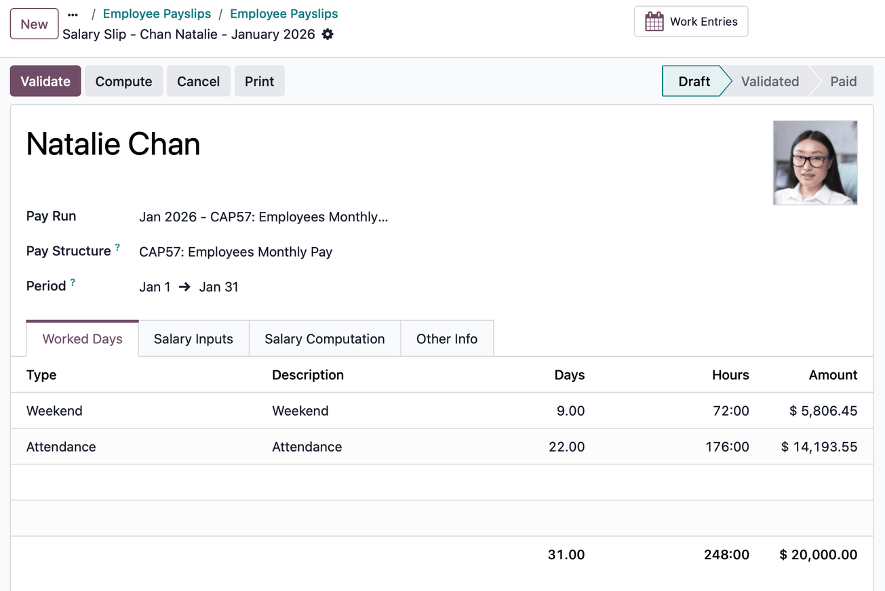

Batch pay run (payslips in groups)
----------------------------------

To create a batch pay run in the **Payroll** app:
Go to :menuselection:`Payroll app --> Payslips --> Pay Runs`. Click
:guilabel:`New` to create a new pay run. Select the salary structure, pay schedule, MPF
scheme, payroll group, and period.

.. note::
   The MPF scheme and payroll group are optional; if there is only one scheme and one group,
   you can leave it blank.

Select employee(s). A pay run is created along with the drafted employee payslips. Check
all calculations and click the :guilabel:`Validate` button.

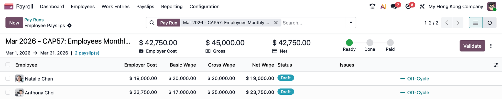

.. important::
   An eMPF report is automatically generated after every pay run. Click the eMPF report or
   find it in :menuselection:`Reporting --> eMPF Contribution`.

.. _payroll/hk/accounting_check:

Accounting check
----------------

The accounting process when running payroll has two components: creating journal entries, and
registering payments. For each component, there are two possible scenarios: individual
or batch.

Journal entry creation
~~~~~~~~~~~~~~~~~~~~~~

After payslips are confirmed and validated, journal entries are posted either individually or
in a batch. The journal entry is created first as a draft.

.. important::
   It must be decided if journal entries are done individually or in batches
   (:guilabel:`Batch Account Move Lines`) in the configuration before running payroll.

Individual journal entries
**************************

Without enabling the batch account move line option, you need manual journal entries postings
for each payslip, regardless of using a pay run or individual payslip. Select a payslip and
click the :guilabel:`Journal Entry (Draft)` button.

.. important::
   The :guilabel:`Pay` button appears only for individual journal entries posting.
   Enabling the :guilabel:`Batch Account Move Lines` option causes this button to disappear.

Click the :guilabel:`Post` button. Each payslip is automatically posted as individual
journal entries in :menuselection:`Accounting --> Journal entries`.

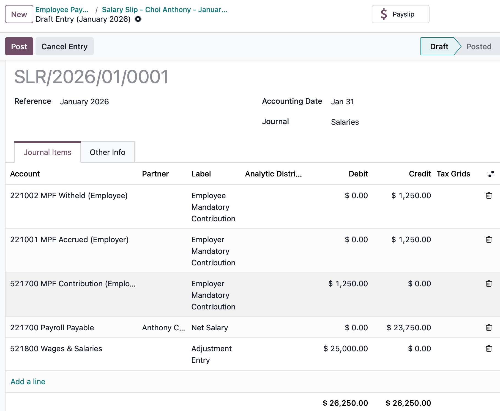

Four accounts from the Hong Kong CoA are included with the payroll localization:

- `221001 MPF Accrued (Employer)`: Accrue MPF benefits that are spent by employers.
- `221002 MPF Withheld (Employee)`: Withheld MPF benefits that are paid by employees, which
  are paid to the MPF provider soon.
- `521700 MPF Contribution (Employer)`: Employer portion of MPF contributions expected to be
  paid to the MPF provider soon.
- `221700 Salaries & Wages Payable`: Net salary owed to the employee.

Batch entries
^^^^^^^^^^^^^

Enabling :guilabel:`Batch Account Move Lines` aggregates all accounting entries for the
period into a single account move line. Click the :guilabel:`Journal Entry (Draft)` button
(which only appears after enabling the batch account move line in payroll configuration for
pay runs). Click the :guilabel:`Post` button. All payslips are automatically consolidated as
one journal entry.

Register payment
----------------

After the journal entries are validated, Odoo generates payment report files.

.. important::
   To generate payments from payslips, an employee must have a trusted bank account. If the
   employee's bank account is not marked as trusted, payment files cannot be generated.

- **HSBC Auto Pay Report**: Click :guilabel:`HSBC Auto Pay Report`. (You must configure the
  HSBC Autopay bank account in configuration for this button to appear). Configure the HSBC
  Autopay report information. Click the :guilabel:`Confirm` button. Click the download icon
  to download the `.apc` HSBC report.
- **Payment Report**: Click :guilabel:`Payment Report`. Payments can be grouped by partner if
  there is a partner associated with a salary rule. Select the export format and click
  :guilabel:`Generate` to download the CSV.

.. _payroll/hk/payroll_reporting:

Payroll reporting
=================

The Hong Kong localization contains several reports unique to HK, which provide eMPF
contribution reports and auto-generated IR56 reports (both in `.xml` and PDF formats).

.. important::
   Payslips must be validated in order to generate eMPF reports and IR56 reports.

eMPF contribution reports
-------------------------

eMPF contribution reports can be generated in two ways:

1. **Auto generated reports**: After every pay run, eMPF contributions reports can be found
   in :menuselection:`Payroll app --> eMPF Contributions`.
2. **Manual generated reports**: eMPF contribution reports can be generated manually only
   after the payslips are validated.

Click :menuselection:`Payroll --> eMPF Contributions`. Click :guilabel:`New`. Select the
contribution period, scheme, and payroll group to generate the report.

**Member status**:

- :guilabel:`Existing Member`: Employees making monthly contributions.
- :guilabel:`New Member`: New employees in holiday periods for contributions.
- :guilabel:`Terminated Member`: Employee leaving the company.

**Termination payment**:

- :guilabel:`L`: Appears if a leaving employee has a long service payment.
- :guilabel:`S`: Appears if a leaving employee has a severance payment.

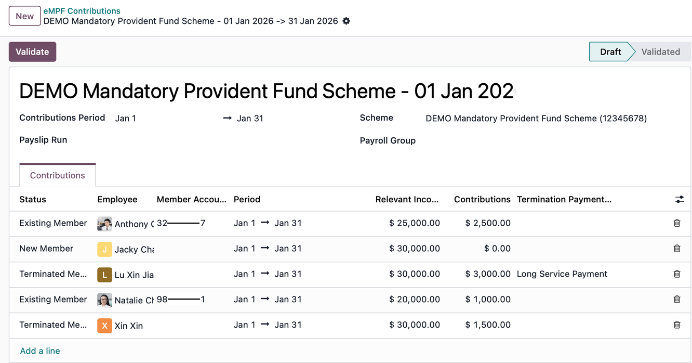

.. important::
   Each contribution line can be amendable (i.e., member status and termination payment type
   can be updated or deleted). However, relevant income and contributions cannot be edited.
   If the contribution line for an employee is amended, click the (gear) icon
   :menuselection:`--> Recompute contribution` to refresh the information.

Click the :guilabel:`Validate` button. If there are no errors, eMPF contribution reports
are generated in three different `.csv` files inside a zip file, which are ready to
upload to the eMPF portal: `new employees.csv`, `contributions.csv`, and
`terminated employees.csv`.

.. important::
   Warnings mainly raise to align with eMPF requirements for employee information. Employees
   must be 18-60 years of age. The phone number must be a valid Hong Kong phone number.

IR56 reports
------------

Odoo provides four IRD reports:

- :guilabel:`IR56B (Annual Return)`: The Employer's Return of Remuneration and Pensions;
  submitted annually for all existing employees.
- :guilabel:`IR56E (New Hire)`: Notification of Commencement of Employment; submitted for new
  employees within three months of their start date.
- :guilabel:`IR56F (Termination)`: Notification of Cessation of Employment for employees
  leaving the company but remaining in Hong Kong.
- :guilabel:`IR56G (Departure)`: Notification of Cessation of Employment for employees
  leaving Hong Kong permanently or for a long period.

.. note::
   When generating the IR56B in Odoo, the system automatically looks at the date on the
   payslips to pull all records falling within the last year, April 1 to March 31 of the
   current year. Once an employer files an IR56F or IR56G for an employee, it should not be
   included again in the annual IR56B to avoid double-reporting income.

Generating an IR56 report
~~~~~~~~~~~~~~~~~~~~~~~~~

Go to :menuselection:`Payroll app --> Reporting`, and select one of the IR56B/E/F/G sheet
options. Click :guilabel:`New`. Fill in the relevant information for the IRD report (e.g.,
:guilabel:`Submission Date`, :guilabel:`Year of Employer's Return`). Click the
:guilabel:`Populate` button.

The :guilabel:`Create XML` and :guilabel:`Eligible Employees` smart buttons appear if there
is relevant generated payslip information. Click :guilabel:`Create XML` to download the XML
report. Click :guilabel:`Eligible Employees` to view the list and select :guilabel:`Generate
PDFs` to queue PDF document generation.

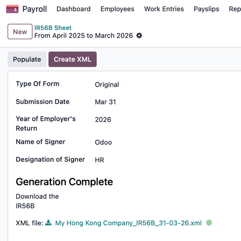

.. _payroll/hk/payslip_tabs:

Payslip tabs
============

Different tabs in each payslip define worked days used to calculate payroll, additional
salary inputs to add to the payslip, how salary computation is handled, and other info that
impacts the payslip.

- :guilabel:`Worked Days`: Details all the individual attendance records for the time
  period, including both worked time and any time off taken. It is auto-populated and cannot
  be edited.
- :guilabel:`Salary Inputs`: Details where additional salary inputs are listed, such as
  deductions, reimbursements, and expenses. Click :guilabel:`Add Inputs` to manually include
  them.
- :guilabel:`Salary Computation`: Where all the individual salary rules are listed and
  calculated, including everything from the employee's salary to all the deductions, taxes,
  and MPF contributions.
- :guilabel:`Other Info`: Shows the :guilabel:`Average Daily Wage` rate that is used to
  calculate statutory HK holidays and entitlements. Also contains the
  :guilabel:`End-of-Year Pay` :

.. note::
     Manually adding an end-of-year payment to a specific payslip may require saving
     the record manually, clicking the (gear) icon, and then selecting
     :guilabel:`Recompute Whole Sheet`.

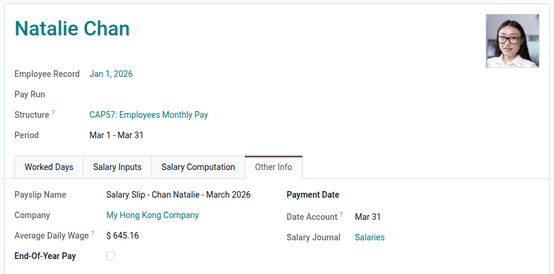

.. _payroll/hk/payslip_explained:

Understanding Hong Kong payroll
===============================

In Hong Kong, payroll calculations typically follow a standard daily wage formula:

.. math::

   \text{Daily Wage} = \frac{\text{Total wage in a month}}{\text{Total days in a month}}

However, the Employment (Amendment) Ordinance 2007 (often referred to as the "713 Ordinance")
requires employers to use the Average Daily Wage (ADW) when calculating specific statutory
entitlements. Statutory entitlements requiring ADW include: holiday pay, annual leave pay,
sickness allowance, maternity leave pay, paternity leave pay, end of year payment, and
payment in lieu of notice.

To calculate the ADW, use the earnings and days from the preceding 12 months:

.. math::

   \text{ADW} = \frac{\text{Total Wage in 12-month period} - \text{Wages of Non-full pay}}{\text{Total Days in 12-month period} - \text{Days of Non-full pay}}

Where:

- **Total Wage in 12-month period**: All earnings in the last 12 months (e.g., basic salary,
  overtime, commissions, and allowances).
- **Wages of Non-full pay**: Any wages paid at less than the full rate (e.g., sick leave,
  maternity/paternity leave, etc).
- **Total Days in 12-month period**: Total calendar days in the 12-month reference period.
- **Days of Non-full pay**: The specific number of days for which the employee was not paid
  in full.

.. important::
   Odoo requires historical payroll records to calculate ADW accurately. If no prior records
   exist, the ADW calculation always results in zero.

.. _payroll/hk/calculation_examples:

Calculation examples
====================

CAP 57: Employees Monthly Pay
-----------------------------

Calculate the March payslip for Natalie Chan who joined Jan 1, 2026, with a monthly salary of
20K.

- Jan: Monthly salary 20K.
- Feb: Monthly salary 20K and 5K commission.
- Mar: Apply for one full-paid paternity leave and one sick leave with 80% ADW in March.

**Calculate ADW:**

- Total wages earned: 20,000 + 25,000 = 45,000
- Total days: 31 + 28 = 59 days

.. math::

   \text{ADW} = \frac{45,000}{59} = 762.71

**Calculate leave payment and total wages:**

- One full day paternity leave (full paid ADW) = 762.71
- One full day sickness leave 80% (80% paid ADW) = 762.71 * 80% = 610.17
- Attendance = Daily wage * num of working days = (20,000 / 31) * 20 = 12,903.23
- Weekend = Daily wage * num of weekends = (20,000 / 31) * 9 = 5,806.45
- Wages earned for Mar = 762.71 + 610.17 + 12,903.23 + 5,806.45 = 20,082.56

**Calculate HK compliant payslip:**

- Basic salary = 20,082.56
- MPF gross = 20,082.56
- Employee mandatory contribution = 20,082.56 * 5% = 1,004.13
- Net salary earned for Mar = 20,082.56 - 1,004.13 = 19,078.43

CAP 57: Payment in Lieu of Notice
---------------------------------

Calculate payment in lieu of notice for Natalie Chan who joined Jan 1, 2026, with a monthly
salary of 20K and was fired in Mar with one month of payment in lieu of notice.

- Jan: Monthly salary 20K.
- Feb: Monthly salary 20K and 5K commission.

**1. Calculate average monthly salary:**

- Days in average month: 365 days / 12 months = 30.41667 days

.. math::

   \text{Average monthly salary} = \text{ADW} \times \text{Days in average month}

.. math::

   \text{Average monthly salary} = 762.71 \times 30.41667 = 23,199.15

**2. Calculate payment in lieu of notice:**

.. math::

   \text{Payment in Lieu of Notice} = \text{Average monthly salary} \times \text{Notice Period}

.. math::

   \text{Payment in Lieu of Notice} = 23,199.15 \times 1 = 23,199.15

CAP 57: Long Service Payment
----------------------------

Calculate long service payment for Anthony Choi who joined Jan 1, 2021, with a monthly salary
of 20K and leaves the company on Feb 28, 2026.

- Jan: Monthly salary 20K.
- Feb: Monthly salary 20K.

**1. Calculate long service payment:**

Last month's monthly salary record must be in Odoo to calculate SP/LSP. The LSP is
based on pre/post transition according to the `HK Labour calculator
<https://www.lr.labour.gov.hk/web/en/calculator/index.html>`_:

.. math::

   \text{LSP} = \left(\text{Last Full Month's Wages} \times \frac{2}{3}\right) \times \text{Years of Service}

.. math::

   \text{LSP} = \text{Pre-transition portion} + \text{Post-transition portion}

.. math::

   \text{LSP} = \left(20,000 \times \frac{2}{3} \times \left(4 + \frac{120}{365}\right)\right) + \left(20,000 \times \frac{2}{3} \times \left(0 + \frac{304}{365}\right)\right)

.. math::

   \text{LSP} = 57,716.89 + 11,105.02 = 68,821.91

**2. Calculate long service payment with MPF offset:**

- **Pre-transition offset**: Total employee mandatory contributions made before May 2025 can
  be excluded from the long service payment. Example: If Anthony's total employee mandatory
  contribution before May 2025 was 7,047.98, this amount is treated as a pre-transition
  offset and excluded from the long service payment.
- **Post-transition offset**: Employee mandatory contributions made after May 2025 cannot be
  excluded (no post-transition offset).

CAP 57: Severance Payment
-------------------------

Calculate severance payment for Anthony Choi who joined Jan 1, 2023, with a monthly salary of
20K and leaves the company on Feb 28, 2026.

- Jan: Monthly salary 20K.
- Feb: Monthly salary 20K.

**1. Calculate severance payment:**

Last month's monthly salary record must be in Odoo to calculate SP/LSP. The SP is
based on pre/post transition according to the `HK Labour calculator
<https://www.lr.labour.gov.hk/web/en/calculator/index.html>`_:

.. math::

   \text{SP} = \left(\text{Last Full Month's Wages} \times \frac{2}{3}\right) \times \text{Years of Service}

.. math::

   \text{SP} = \text{Pre-transition portion} + \text{Post-transition portion}

.. math::

   \text{SP} = \left(20,000 \times \frac{2}{3} \times \left(2 + \frac{120}{365}\right)\right) + \left(20,000 \times \frac{2}{3} \times \left(0 + \frac{304}{365}\right)\right)

.. math::

   \text{SP} = 31,050.23 + 11,105.02 = 42,155.25

**2. Calculate severance payment with MPF offset:**

- **Pre-transition offset**: Total employee mandatory contributions made before May 2025 can
  be excluded from the severance payment. Example: If Anthony's total employee mandatory
  contribution before May 2025 was 7,047.98, this amount is treated as a pre-transition
  offset and excluded from the severance payment.
- **Post-transition offset**: Employee mandatory contributions made after May 2025 cannot be
  excluded (no post-transition offset).
