=====
India
=====

**Indian Payroll Localization** provides the complete Indian salary structure,
including allowances, deductions, statutory compliance, and employee benefits.
It automatically calculates and deducts contributions for both employees and employers,
ensuring full compliance with Indian labor and taxation laws.

Before configuring the Indian localization, refer to the general :doc:`payroll <../../payroll>`
documentation, which includes the basic information for all localizations,
as well as all universal settings and fields.

.. _payroll/indian_apps:

Apps & Modules
==============

:ref:`Install <general/install>` the following modules to get all the features of
the Indian payroll localization:

.. list-table::
   :header-rows: 1

   * - Name
     - Technical name
     - Description
   * - :guilabel:`India - Payroll`
     - ``l10n_in_hr_payroll``
     - Provides the statutory salary structure, allowances, deductions, and compliance rules for
       Indian payroll.
   * - :guilabel:`India - Payroll with Accounting`
     - ``l10n_in_hr_payroll_account``
     - Adds accounting entries and mappings for payslips generated with the Indian localization.
   * - :guilabel:`India - Time Off`
     - ``l10n_in_hr_holidays``
     - Adds India-specific leave policies, including sandwich leave and optional holidays.

.. seealso::
   :doc:`Configure the Indian fiscal localization <../../../finance/fiscal_localizations/india>`

General Configurations
======================

First, the company must be configured. Navigate to :menuselection:`Settings app --> Users & Companies --> Companies`.
From the list, select the desired company, and configure the following fields:

- :guilabel:`Company Name`: Enter the business name in this field.
- :guilabel:`Address`: Complete the full address, including the City, State, Zip Code, and Country.

.. important::
   The state selected in the company's address is associated as the work address by default
   for the employee, and the one used to calculate payroll taxes.

- :guilabel:`GSTIN`: Enter a 15-digit tax identification number required for GST-registered
  businesses in India.
- :guilabel:`PAN`: Enter a 10-character alphanumeric ID issued by the Income Tax Department
  for tax reporting.
- :guilabel:`Company ID`: Enter the business's state ID number.
- :guilabel:`Currency`: By default, INR is selected. If not, select INR from the drop-down menu.
- :guilabel:`UPI Id`: Enter a virtual payment address used for receiving digital payments through
  India's UPI system.
- :guilabel:`Phone`: Enter the company phone number.
- :guilabel:`Email`: Enter the email used for general contact information.

Next, configure the payroll settings for the Indian payroll localization. Navigate to
:menuselection:`Payroll app --> Configuration --> Settings`, and enable the following
options that apply to the company:

- :ref:`Employee Provident Fund <payroll/epf>`: Enter your :abbr:`EPF (Employee Provident Fund)`
  Employer ID (alphanumeric code issued by the :abbr:`EPFO (Employees' Provident Fund Organisation)`)
  to enable automatic :abbr:`PF (Provident Fund)` deductions and contributions. Enabling this will
  activate the **Provident Fund (PF) contribution** section in employee payroll setting and contract template.
- :ref:`Professional Tax <payroll/pt>`: Enter your state-issued :abbr:`PT (Professional Tax)`
  registration number (usually numeric/alphanumeric) to allow salary-based professional tax deduction.
  Enabling this will activate the **Professional Tax slab** field under the **Tax Deductions** section in
  employee payroll setting and contract template.
- :ref:`Employee State Insurance <payroll/esic>`: Enter your :abbr:`ESIC (Employee State Insurance)`
  Employer Code/IP Number (10-digit numeric ID provided by ESIC)
  to process mandatory medical insurance contributions. Enabling this will activate the
  **ESIC (Employee State Insurance)** section in employee payroll setting and contract template.
- :ref:`Labour Welfare Fund <payroll/lwf>`: Enter your :abbr:`LWF (Labour Welfare Fund)`
  Establishment/Identification Number (state-issued numeric/alphanumeric ID)
  to deduct and remit statutory welfare fund contributions. Enabling this will
  activate the **Labour Welfare Fund (LWF)** section in employee payroll setting and contract template.

.. image:: india/in-payroll-configuration.png
   :alt: Indian Localization Settings

Employees
=========

Create the :doc:`employee <../../employees/new_employee>` record before configuring the
salary package in the :doc:`contract <../contracts>`.

Employee contracts serve as the foundation for payroll calculations, with the salary structure
covering allowances, deductions, and statutory compliances configured directly within the contract.

Personal Tab
------------

Configure the following information in the employee's :guilabel:`Personal Information` section:

- :guilabel:`UAN`: A 12-digit unique identifier issued by the
  :abbr:`EPFO (Employees' Provident Fund Organisation)` for each employee; it links all
  :abbr:`PF (Provident Fund)` accounts across different employers and is used for
  tracking PF contributions, withdrawals, and transfers.

- :guilabel:`ESIC Number`: A 17-digit unique Insurance Number assigned to an employee under
  the Employee State Insurance Corporation; used to provide access to medical benefits,
  insurance coverage, and compliance under the :abbr:`ESI (Employee State Insurance)` scheme.

- :guilabel:`PAN`: A 10-character alphanumeric identifier issued by the Income Tax Department;
  used for income-tax reporting, verifying employee identity, and ensuring correct
  :abbr:`TDS (Tax Deducted at Source)` processing.

- :guilabel:`LWF Account Number`: A state-specific employee Labour Welfare Fund ID;
  used to record employee-level contributions toward the Labour Welfare Fund, enabling
  welfare-related statutory compliance.

Payroll Tab
-----------

Statutory compliance
~~~~~~~~~~~~~~~~~~~~

.. _payroll/epf:

Provident Fund (PF) Contribution
********************************

The **EPF** is a retirement benefit scheme for employees, where both the employer
and employee contribute a fixed percentage of the employee's salary each month.

The Provident Fund (PF) configuration option in Indian Payroll allows you to choose whether to:
   - Cap Basic at ₹15,000 (as per EPF statutory rule), or
   - Calculate PF on the actual Basic (prorated wage) without cap.

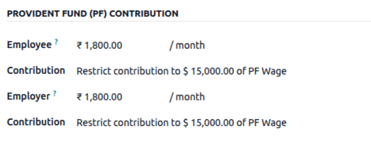

.. seealso::
   More information about `Employees' Provident Fund Organisation (EPFO)
   <https://www.epfindia.gov.in/site_en/index.php>`_

.. _payroll/pt:

Tax Deductions
**************

Tax Deductions allow companies to define statutory and employer-specific tax deductions, such as
Professional Tax and TDS, which are automatically applied during payslip computation.

- Tax deductions are statutory or company-defined amounts subtracted from an employee's salary to comply
  with income tax and state tax regulations.

- The **Professional Tax** is a state-level tax levied on employees' income.

- The system reads the employee's income and state from the contract and automatically applies the
  correct PT slab rate when generating payslips.

.. seealso::
   More information about `Professional Tax <https://cleartax.in/s/professional-tax>`_

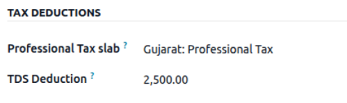

.. _payroll/esic:

Employee State Insurance (ESIC)
*******************************

The **ESIC** is a social security scheme that provides medical and cash benefits
to employees and their families.

Both employer and employee contributions are automatically calculated as a percentage of the wage.

.. seealso::
   More information about `Employees' State Insurance Corporation (ESIC) <https://esic.gov.in/>`_

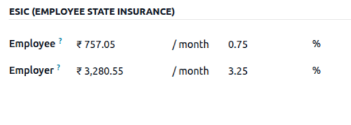

.. _payroll/lwf:

Labour Welfare Fund (LWF)
*************************

The **Labour Welfare Fund (LWF)** is a statutory compliance aimed at the welfare
of workers, managed by state-specific Labour Welfare Boards.

Fixed contributions for both employer and employee can be defined.

.. seealso::
   More information about `Labour Welfare Fund (LWF) <https://cleartax.in/s/labour-welfare-fund>`_

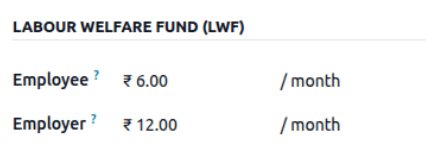

Salary benefits
~~~~~~~~~~~~~~~

Salary benefits such as phone and internet subscriptions, meal vouchers, company transport, and
medical insurance can be configured in employee contracts as allowances or benefits, and
they will be automatically reflected in the employee's payslip.

Configure the **Benefits** and **Insurance Benefits** sections on the contract, then
set the monthly contribution amounts for each benefit. Typical examples include:

- **Benefits**: Phone subscription, internet subscription, meal vouchers, company transport,
  and similar allowances.
- **Insurance Benefits**: Medical insurance, insured spouse, insured first child, insured
  second child, etc.

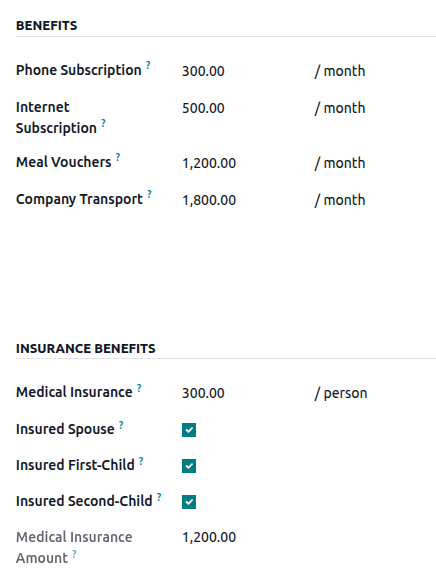

Other Deductions
~~~~~~~~~~~~~~~~

Other Deductions include statutory items such as Gratuity.

Gratuity is a statutory employer contribution calculated as a percentage of the employee's wage,
accrued monthly as part of end-of-service benefits.

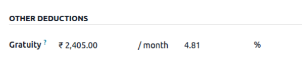

Configure salary from contract template
=======================================

Configure the Employee Salary page to automatically load and display details based on the
default contract template.

When creating a new employee, load the default contract template in the :guilabel:`Employee Payroll`
tab to configure a predefined salary package automatically.

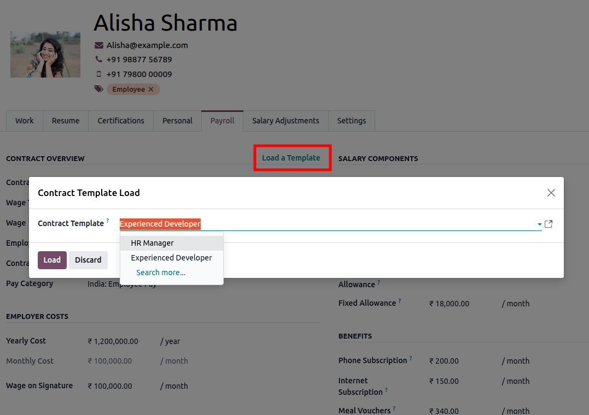

The contract template defines the salary structure and includes all applicable salary components,
statutory compliances, and benefits.

To configure the contract template go to :menuselection:`Payroll app --> Configuration --> Contract Templates`,
create or open an existing contract template, then In the contract template, configure
the salary package for the applicant/employee, including the **Salary components**,
**Statutory compliances**, **Benefits** and **Insurance Benefits** described above.

   .. image:: india/in-contract-template.png
      :alt: Indian Contract Template

Time off Configuration
======================

The Indian Localization for Time Off includes specific leave management features designed for Indian
organizations, such as :ref:`Sandwich Leave <payroll/in_sandwich>` and
:ref:`Optional Holidays <payroll/in_optional>`.

Install the :guilabel:`India - Time Off` application to enable these policies.

.. seealso::
   :doc:`About Time Off <../../time_off>`

.. _payroll/in_sandwich:

Sandwich leave
--------------

A *sandwich Leave* is a time off policy where weekends and public holidays falling between two applied
leave days are also counted as time off.
To enable this on a :ref:`time off types <time_off/time-off-types>` navigate to
:menuselection:`Time Off app --> Configuration --> Time Off Types`, and click the desired
time off type to enable this feature on. Tick the checkbox next to :guilabel:`Sandwich Leave`
in the :guilabel:`Configuration` section of the :guilabel:`Time Off Type` form.

.. example::
   An employee applies for leave on Friday November 28th and Monday December 1st.
   Both Saturday November 29th and Sunday November 30th (the weekend)
   are also counted as time off, making the total time off requested **four** days *not* **two** days.

.. _payroll/in_optional:

Optional holidays
-----------------

Optional Holidays, also called *Flexible Holidays* are special holidays assigned to specific
calendar dates, such as regional or religious holidays. Employees may apply for leave only
on these defined dates.

If an employee attempts to request leave on any other date, a validation
error will be raised.

To enable this on a :ref:`time off types <time_off/time-off-types>` navigate to
:menuselection:`Time Off app --> Configuration --> Time Off Types`, and create a new time off type or
open an existing one, Tick the checkbox next to :guilabel:`Limited to Optional Holiday` in the
:guilabel:`Configuration` section of the :guilabel:`Time Off Type` form.
Then, go to :menuselection:`Time Off app --> Configuration --> Optional Holidays`.
Create new optional holidays by assigning them to specific calendar dates
The optional holiday can be seen on the dashboard

Employees can request these leave types, but only on the configured optional (flexible) holiday dates.

Payroll configuration
=====================

When the **l10n_in_hr_payroll** module is :ref:`installed <payroll/indian_apps>`,
a new salary structure for India is added: :guilabel:`India: Regular Pay` under the
:guilabel:`India: Employee Pay` structure type.

The salary structure contains all salary rules needed to calculate wages, statutory salary structure,
allowances, deductions, and compliance rules.

Salary rules
------------

The salary rules control how each allowance, deduction, benefit, and statutory compliances is calculated.

To view the salary rules, navigate to :menuselection:`Payroll app --> Configuration --> Structures`.
Click on :guilabel:`India: Employee Pay` to expand it, and then click :guilabel:`India: Regular Pay`.

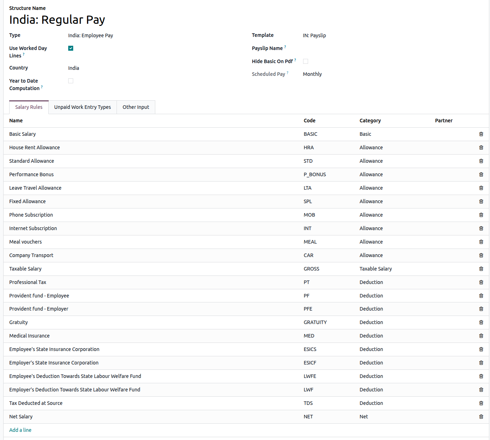

Rule parameters
---------------

Certain payroll calculations require specific rates or wage caps, and Rule Parameters
provide values either as percentages or fixed amounts that can be referenced in salary rules.

Rule parameters can be accessed via :menuselection:`Payroll app --> Configuration --> Rule Parameters`.
All the Rule parameters will be listed here with the associated salary rules.

Rule parameters are used by salary rules for statutory calculations, ensuring that
payslips stay compliant with national and state-level regulations.

.. important::
   Odoo updates rule parameters as needed.
   It is recommended **not to modify** rule parameters unless there is an official change
   in national or state regulations.

Run India Payroll
=================

Before running payroll, the payroll officer must validate employee :doc:`work entries
<../work_entries>` to confirm pay accuracy and catch any errors. This includes ensuring
that all time off is approved, any overtime is appropriate.

Work entries are synchronized based on the employee's :doc:`contract <../contracts>`
configuration. Odoo pulls from the assigned working schedule, attendance records,
planning schedule, and approved time off.

Any :ref:`discrepancies or conflicts <payroll/conflicts>` must be resolved, then the
work entries can be :ref:`regenerated <payroll/regenerate-work-entries>`.

Once everything is correct, draft payslips can be :ref:`created individually
<payroll/process>` or in :doc:`groups <../pay_runs>`, referred to in the Payroll app as Pay Runs.

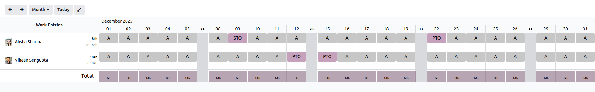

.. note::
   To cut down on the payroll officer's time, it is typical to process payslips in batches, either
   by wage type (fixed salary vs hourly), pay schedule (weekly, bi-weekly, monthly, etc.),
   department (direct cost vs. administration), or any other grouping that best suits the company.

The process of running payroll includes different actions that need to be executed to ensure that
the amount withheld from payroll taxes is correct, the amount that the employee receives as their
net salary is correct, and the computation of hours worked reflects the employee's actual hours
worked, among others.

When running a payroll batch, check that the period, company, and employees included are correct
*before* starting to analyze or validate the data.

Once the payslips are drafted, review them for accuracy. Check the :guilabel:`Worked Days & Inputs`
tab, and ensure the listed worked time is correct, as well as any other inputs. Add any missing
inputs, such as commissions, tips, reimbursements, that are missing.

Next, check the various totals (gross pay, employee taxes, benefits, employer taxes, net salaries),
then click :guilabel:`Compute Sheet` to update the salary calculations, if there were edits. If
everything is correct, click :guilabel:`Validate`.

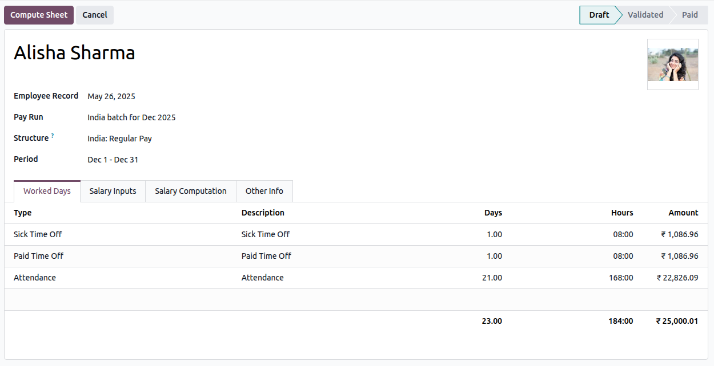

Accounting check
----------------

The accounting process when running payroll has two components: :ref:`creating journal entries
<payroll/in-journal>`, and :ref:`registering payments <payroll/in-register>`.

.. _payroll/in-journal:

Journal entry creation
~~~~~~~~~~~~~~~~~~~~~~

After payslips are confirmed and validated, journal entries are posted either individually, or in a
batch. The journal entry is created first as a draft.

.. important::
   It must be decided if journal entries are done individually or in batches *before* running
   payroll.

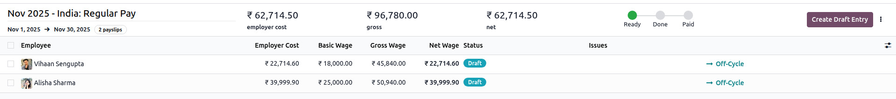

Six accounts from the India :abbr:`CoA (Chart of Accounts)` are included with the India
payroll localization:

- `210100 Salary Expense`: Records the gross salary expense for employees, including the
  basic pay and any earnings not allocated to specific allowance accounts. This account
  captures the main salary cost for financial reporting.
- `300001 House Rent Allowance Expense`: Records the portion of salary paid as House Rent
  Allowance. Used to track HRA separately for statutory reporting and tax computation purposes.
- `300002 Standard Allowance Expense`: Records recurring allowances that are part of the salary
  package but do not fall under special categories like HRA or performance bonus.
  Examples include transport or utility allowances.
- `300005 Performance Bonus`: Records discretionary or performance-linked bonuses paid to
  employees. This account helps separate one-time or variable incentive costs from regular
  salary expenses.
- `300011 Leave Travel Allowance Expense`: Tracks Leave Travel Allowance paid to employees.
  LTA is often partially tax-exempt under Indian Income Tax rules, so tracking it separately
  is important for compliance.
- `300004 Fixed Allowance Expense`: Records fixed, recurring allowances paid to employees
  such as meal allowances, special duty allowances, or any other structured component of the salary.

.. note::
   The :abbr:`CoA (Chart of Accounts)` configuration is set up by default when a company is located
   in India. The account codes and names can be customized to match the company's salary structure
   and reporting requirements. If a salary rule (used in a salary structure) does not have an
   associated :abbr:`CoA (Chart of Accounts)` account, Odoo will use the default account `Salary
   Expense` to create the journal entry, regardless of the type of move.

Once the journal entry draft appears correct, post the journal entries.

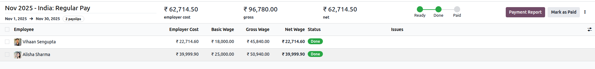

.. _payroll/in-register:

Register Payments
-----------------

After the :ref:`journal entries <payroll/in-journal>` are validated, Odoo can generate payments.

Payments can be :guilabel:`Grouped by Partner` if there is a partner associated with a salary rule.

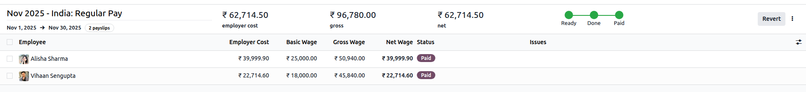

Close Payroll
-------------

If there are no errors, payroll is completed for the pay period.

Understanding the Indian Payslip
================================

This payslip provides detailed information on allowances, deductions, compliance requirements,
and benefits. It helps employees understand how their salary is calculated, the statutory and
organizational deductions applied, and the benefits they are entitled to, ensuring transparency
and trust in the payroll process.

.. seealso::
   :doc:`Create a Payslip <../payslips>`

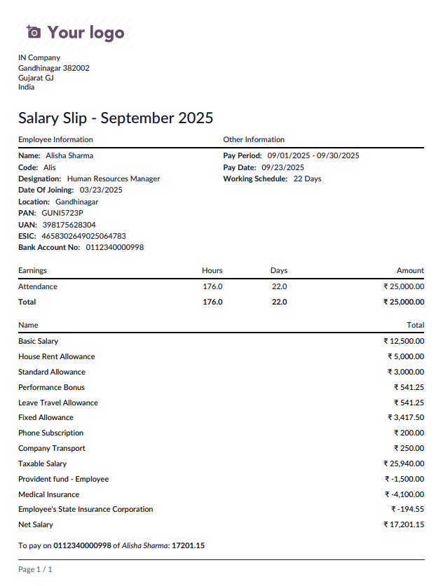

Payroll reports
===============

The Indian payroll localization includes payslip-related reports and statutory compliance reports,
including:

- :ref:`Salary Register <payroll/in_salary_register>`
- :ref:`EPF Report <payroll/in_epf_report>`
- :ref:`ESI Report <payroll/in_esi_report>`
- :ref:`Labour Wlefare Fund Report <payroll/in_lwf_report>`
- :ref:`Salary Statement Report <payroll/in_salary_statement_report>`
- :ref:`Yearly Salary by Employee <payroll/in_yearly_salary_report>`

.. _payroll/in_salary_register:

Salary Register
---------------

The Register report provides a detailed month-wise record of salaries paid to employees.
This includes allowances, tax compliance, deductions, and benefits for each employee. Employers
can use this report to track payroll expenditures and employee earnings.

To generate the report, navigate to :menuselection:`Payroll app --> Reporting --> Salary Register`.
A :guilabel:`Salary Register` pop-up window will appear. Set the :guilabel:`Start Date` and :guilabel:`End Date`,
select a specific :guilabel:`Salary Structure` to filter them by the Salary Structure
(otherwise all employees are included), and choose the desired :guilabel:`Payslip Status`
(:guilabel:`Paid`, :guilabel:`Done`, or both) to filter the payslips.
Once the filters are set, click :guilabel:`Export XLSX` to download the salary register report.

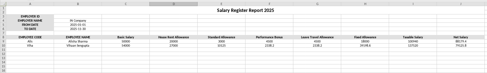

.. _payroll/in_epf_report:

EPF Report
----------

The :abbr:`EPF (Employee Provident Fund)` report lists the contributions made by
both employer and employee toward the Provident Fund. It includes the
employee's EPF number, contribution amounts, and employer matching
contributions, ensuring compliance with the Employees' Provident Funds
and Miscellaneous Provisions Act, 1952.

To generate the report, navigate to :menuselection:`Payroll app --> Reporting --> EPF Report`.
Click on :guilabel:`New`, set desired :guilabel:`Year` and :guilabel:`Month` and click on
:guilabel:`Export XLSX File`.

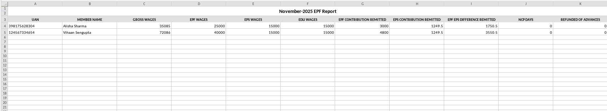

.. _payroll/in_esi_report:

ESI Report
----------

The :abbr:`ESI (Employee State Insurance)` report details the contributions made
toward the ESI scheme. It provides both employer and employee
contribution amounts, along with the employee's ESI number, which is
required for statutory filing with the Employee State Insurance
Corporation.

To generate the report, navigate to :menuselection:`Payroll app --> Reporting --> ESI Report`.
Click on :guilabel:`New`, set desired :guilabel:`Year` and :guilabel:`Month`, Select the Report type
as per the need and click on :guilabel:`Export XLSX File`.

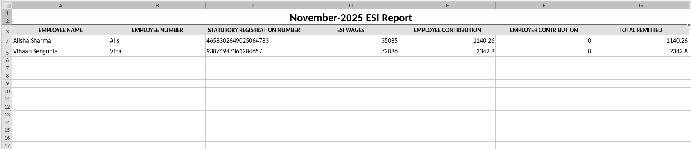

.. _payroll/in_lwf_report:

Labour Welfare Fund (LWF) Report
--------------------------------

This report covers the contributions made toward the Labour Welfare Fund
(LWF) by both employer and employee. It tracks the deduction amounts and
helps ensure compliance with state-level welfare fund requirements.

To generate the report, navigate to :menuselection:`Payroll app --> Reporting --> Labour Welfare Fund Report`.
A :guilabel:`Labour Welfare Fund Report` pop-up window will appear. Set the
:guilabel:`Start Date` and :guilabel:`End Date`, select a specific :guilabel:`Department`
to filter them by Department (otherwise all employees are included), click :guilabel:`Export XLSX` to
download the Labour Welfare Fund Report report.

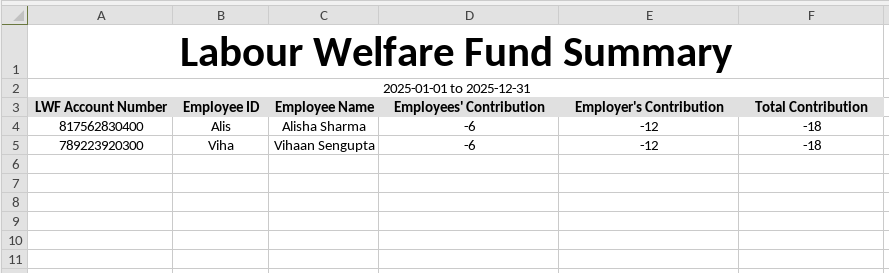

.. _payroll/in_salary_statement_report:

Salary Statement Report
-----------------------

The salary statement report is used to provide employees with their current salary and cumulative
salary, along with all salary components, for the selected year.

To generate the report, navigate to :menuselection:`Payroll app --> Reporting --> Salary Statement Report`.
Click on :guilabel:`New`, set desired :guilabel:`Year` and :guilabel:`Month`, set the
:guilabel:`description` for pdf name. Then Click on :guilabel:`Populate` to create a pdf for each employee,
which can be accessed through the smart button which appears after populating.

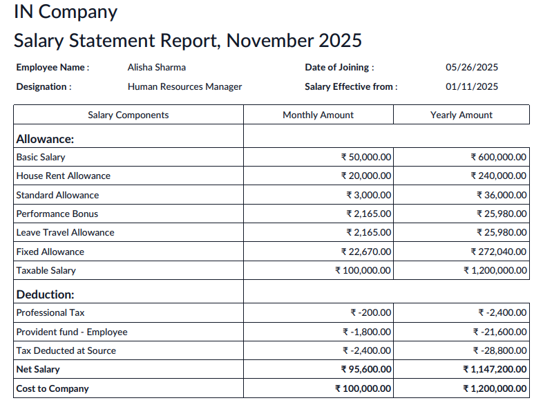

.. _payroll/in_yearly_salary_report:

Yearly Salary by Employee
-------------------------

The Yearly Salary by Employee report provides month-wise salary details for the selected year,
including salary components and the applicable salary structure.

To generate the report, navigate to :menuselection:`Payroll app --> Reporting --> Yearly Salary by Employee`.
A :guilabel:`Labour Welfare Fund Report` pop-up window will appear. Set the :guilabel:`Year`,
set :guilabel:`Department` or :guilabel:`Job Position` to filter out the employees.
Click on :guilabel:`Print` to download Yearly Salary by Employee Report.

.. image:: india/in-yearly-salary-by-employee.png
      :alt: Yearly Salary by Employee Report
