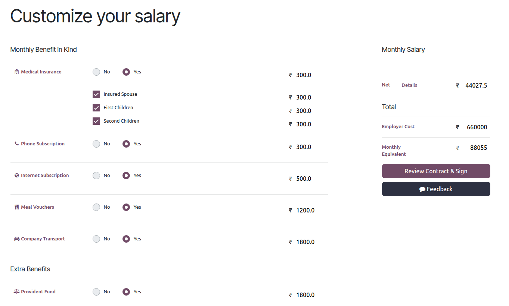

=====
India
=====

**Indian Payroll Localization** provides the complete Indian salary structure,
including allowances, deductions, statutory compliance, and employee benefits.
It automatically calculates and deducts contributions for both **employees** and **employers**,
ensuring full compliance with Indian labor and taxation laws.

Configure Salary Package
========================

Employee contracts serve as the foundation for payroll calculations, with the salary structure covering allowances,
deductions, and statutory compliances configured directly within the contract.

.. image:: india/in-employee-payroll-setting.png
   :alt: Employee Payroll Setting

Statutory Compliance
====================

In the **Settings** menu, under the section **Indian Localization**, the following checkboxes can be found:

- **Employee Provident Fund (EPF)**
- **Professional Tax (PT)**
- **ESIC (Employee State Insurance)**
- **Labour Welfare Fund (LWF)**

.. image:: india/in-payroll-configuration.png
   :alt: Indian Localization Settings

Enabling these options will activate their respective sections in both:

- The **Employee Payroll setting**
- The **Contract Template**

This allows to configure and manage statutory compliances at the employee contract.

Employee Provident Fund (EPF)
-----------------------------

The **EPF** is a retirement benefit scheme for employees, where both the employer
and employee contribute a fixed percentage of the employee's salary each month.

- Once enabled, a **Provident Fund (PF) Contribution** section becomes available in the contract.
- Provident Fund (PF) configuration option in Indian Payroll — whether to:
    - Cap Basic at ₹15,000 (as per EPF statutory rule), or
    - Calculate PF on the actual Basic (prorated wage) without cap.

Professional Tax (PT)
---------------------

The **Professional Tax (PT)** is a state-level tax levied on employees' income.

- Enabling this option activates the **Professional Tax slab** field under **Tax Deductions** section in the contract.
- The system reads the **employee's income** and **state** from the contract and automatically
  applies the correct **Professional Tax (PT)** slab rate when generating payslips

Employee State Insurance (ESIC)
-------------------------------

The **ESIC** is a social security scheme that provides medical and cash benefits
to employees and their families.

- Once enabled, an **ESIC (Employee State Insurance)** section appears in the contract.
- Both employer and employee contributions are automatically calculated
  as a percentage of the wage.

Labour Welfare Fund (LWF)
-------------------------

The **Labour Welfare Fund (LWF)** is a statutory compliance aimed at the welfare
of workers, managed by state-specific Labour Welfare Boards.

- Enabling this activates the **Labour Welfare Fund (LWF)** section in the contract.
- Fixed contributions for both employer and employee can be defined.

.. image:: india/in-statutory-compliance.png
   :alt: Indian Statutory Compliance

Understanding the Indian Payslip
================================

This payslip provides detailed information on allowances, deductions, compliance requirements, and benefits.
It helps employees understand how their salary is calculated, the statutory and organizational deductions applied,
and the benefits they are entitled to, ensuring transparency and trust in the payroll process.

.. image:: india/in-payslip.png
   :alt: Indian Salary Payslip

Salary Benefits
===============

Salary benefits such as phone and internet subscriptions, meal vouchers, company transport, and
medical insurance can be configured in employee contracts as allowances or benefits, and
they will be automatically reflected in the employee's payslip.

- configure the **Benefits** and **Insurance Benefits**:

   - **Benefits**: Phone Subscription, Internet Subscription,
     Meal Vouchers, Company Transport, etc.
   - **Insurance Benefits**: Medical Insurance, Insured Spouse,
     Insured First-Child, Insured Second-Child, etc.
- Set the monthly contribution amounts for each benefit.

     .. image:: india/in-benefits.png
      :alt: Indian Benefits

Salary Configurator
===================

Once the salary structure and localization rules are configured, companies can generate an **offer**
for employees. Using the **Salary Configurator**, employees can review the proposed salary package and
make adjustments to benefits based on their preferences.

To use this feature, make sure the **Salary Configurator (India)**
application is installed.

Configuration
-------------

To send an offer to an applicant or employee, a **contract template** must be configured. The contract
template defines the salary structure and includes all applicable benefits

To configure the contract template:

1. Go to :menuselection:`Payroll app --> Configuration --> Contract Templates`.
2. Create or open an existing contract template.
3. In the contract template, configure the salary package for the applicant/employee along with Benefits
   and Insurance details:

   - **Benefits**: Phone Subscription, Internet Subscription,
     Meal Vouchers, Company Transport, etc.
   - **Insurance Benefits**: Medical Insurance, Insured Spouse,
     Insured First-Child, Insured Second-Child, etc.

     .. image:: india/in-contract-template.png
      :alt: Indian Contract Template

Generate Offer
--------------

Once the contract template is ready:

1. Navigate to the :menuselection:`Employees app`.
2. Open the employee.
3. Generate Offer.
4. Send the **offer** to the employee.

Customize Salary Package
------------------------

When the offer is sent, the employee receives an interactive **salary offer** that displays the
predefined package and provides the option to customize it.

- The applicant/employee can select benefits according to their needs.

- They may choose insurance coverage for their spouse and children.

- The right-side panel immediately displays the updated values for:

    - Net Salary

    - Employer Cost

    - Monthly Equivalent

After configuring their package, the applicant/employee signs the contract. Once the signing process is
complete, all selected package details are available in the employee contract.

Time Off
========

The Indian Localization for Time Off includes specific leave management features designed for Indian
organizations, such as **Sandwich Leave** and **Optional Holidays**.

To use this feature, make sure the **India - Time Off**
application is installed.

Sandwich Leave
--------------

Sandwich Leave is a leave policy where weekends and public holidays falling between two applied
leave days are also counted as leave.

Example: If an employee applies for leave on Friday and Monday, then Saturday and Sunday (the weekend)
will also be considered as leave days.

.. image:: india/in-sandwich-leave.png
   :alt: Sandwich Leave

Configuration
~~~~~~~~~~~~~

To enable sandwich leave:

1. Go to :menuselection:`Time Off app --> Configuration --> Leave Types`.
2. Create a new leave type, or open an existing one.
3. Enable the checkbox :guilabel:`Sandwich Leave`.
4. Save the leave type.

Once enabled, any leave request spanning a weekend or holiday will
automatically count the intermediate non-working days as part of the
leave duration.

Optional Holidays
-----------------

Optional Holidays (also called Flexible Holidays) are special holidays assigned to specific
calendar dates, such as regional or religious holidays. Employees may apply for leave only on these defined dates.

If an employee attempts to request leave on any other date, a validation
error will be raised.

Configuration
~~~~~~~~~~~~~

To configure optional holidays:

1. Go to :menuselection:`Time Off app --> Configuration --> Leave Types`.
2. Create a new leave type, or open an existing one.
3. Enable the checkbox :guilabel:`Limited to Optional Holiday`.
    .. image:: india/in-optional-holiday-checkbox.png
       :alt: Optional Holiday Checkbox
4. Save the leave type.
5. Then, go to :menuselection:`Time Off app --> Configuration --> Optional Holidays`.
6. Create new optional holidays by assigning them to specific calendar dates.
7. The optional holiday can be seen on the dashboard.

   .. image:: india/in-optional-holiday-dashboard.png
      :alt: Optional Holiday on dashboard

Employees can request these leave types, but only on the configured optional (flexible) holiday dates.

Payroll Reports
===============

The Indian Payroll includes payslip related reports and statutory compliance reports.
These reports can be accessed from the
:menuselection:`Payroll app --> Reporting --> India` section.

Available Reports
-----------------

**Salary Register**
The Register report provides a detailed month-wise record of salaries paid to employees.
It includes allowances, tax compliance, deductions, and benefits for each employee. Employers
can use this report to track payroll expenditures and employee earnings.

**EPF Report**
The Employee Provident Fund (EPF) report lists the contributions made by
both employer and employee toward the Provident Fund. It includes the
employee's EPF number, contribution amounts, and employer matching
contributions, ensuring compliance with the Employees' Provident Funds
and Miscellaneous Provisions Act, 1952.

**ESI Report**
The Employee State Insurance (ESI) report details the contributions made
toward the ESI scheme. It provides both employer and employee
contribution amounts, along with the employee's ESI number, which is
required for statutory filing with the Employee State Insurance
Corporation.

**Labour Welfare Fund (LWF) Report**
This report covers the contributions made toward the Labour Welfare Fund
(LWF) by both employer and employee. It tracks the deduction amounts and
helps ensure compliance with state-level welfare fund requirements.
