=====
India
=====

**Indian Payroll Localization** provides the complete Indian salary structure,
including allowances, deductions, statutory compliance, and employee benefits.
It automatically calculates and deducts contributions for both **employees** and **employers**,
ensuring full compliance with Indian labor and taxation laws.

.. _payroll/indian_apps:

Apps & Modules
==============

:ref:`Install <general/install>` the following modules to enable the Indian payroll features that
match your needs:

.. list-table::
   :header-rows: 1

   * - Name
     - Technical name
     - Description
   * - :guilabel:`India - Payroll`
     - ``l10n_in_hr_payroll``
     - Provides the statutory salary structure, allowances, deductions, and compliance rules for
       Indian payroll.
   * - :guilabel:`India - Payroll with Accounting`
     - ``l10n_in_hr_payroll_account``
     - Adds accounting entries and mappings for payslips generated with the Indian localization.
   * - :guilabel:`India - Time Off`
     - ``l10n_in_hr_holidays``
     - Adds India-specific leave policies, including sandwich leave and optional holidays.

Install at least :guilabel:`India - Payroll`; the remaining modules are optional but required for the
features they unlock.

General Configurations
======================

In :menuselection:`Payroll app --> Configuration --> Settings`, enable the :guilabel:`Indian Localization`
options that apply to your company:

- **Employee Provident Fund (EPF)**
- **Professional Tax (PT)**
- **ESIC (Employee State Insurance)**
- **Labour Welfare Fund (LWF)**

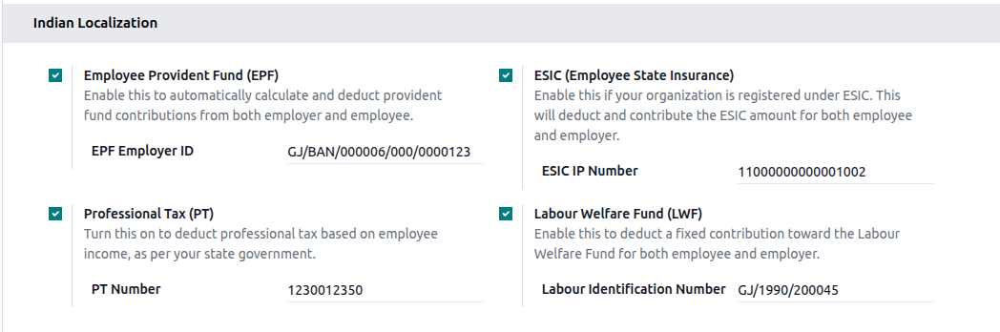

Enabling these options will activate their respective sections in both:

- The :guilabel:`Employee Payroll` setting
- The :guilabel:`Contract Template`

This allows payroll administrators to configure and manage statutory compliance directly on each
contract.

Employees
=========

Create the employee record before configuring the salary package in the contract.

.. seealso::
   :doc:`Create a New Employee <../../employees/new_employee>`

Employee contracts serve as the foundation for payroll calculations, with the salary structure covering allowances,
deductions, and statutory compliances configured directly within the contract.

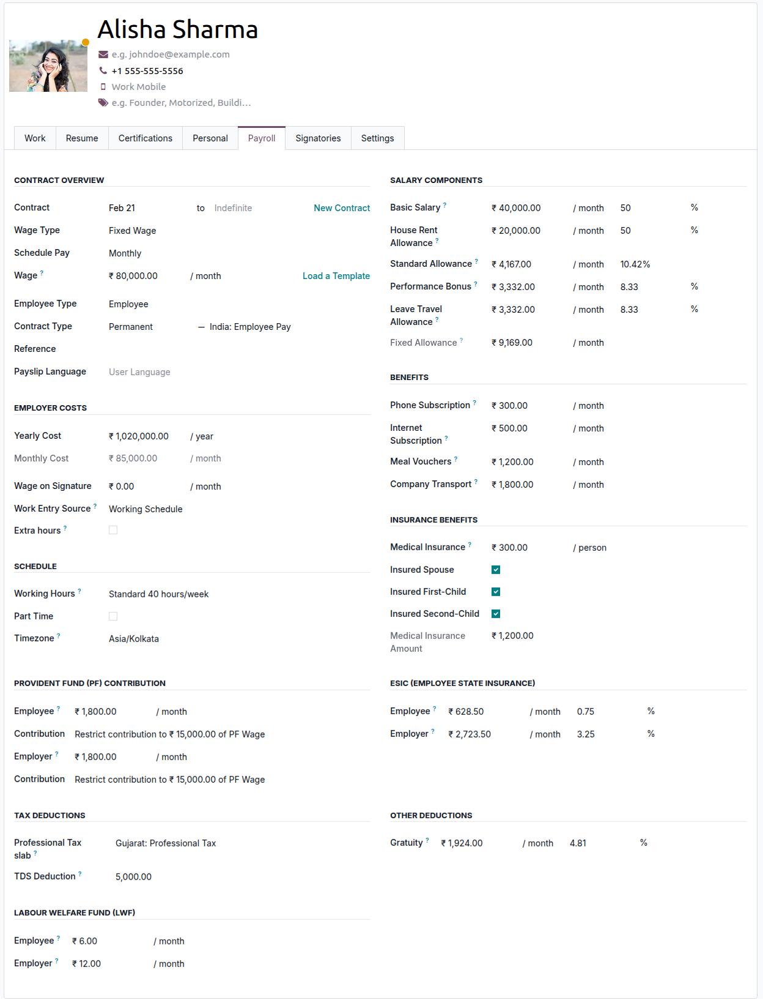

Statutory compliance
--------------------

Employee Provident Fund (EPF)
~~~~~~~~~~~~~~~~~~~~~~~~~~~~~

The **EPF** is a retirement benefit scheme for employees, where both the employer
and employee contribute a fixed percentage of the employee's salary each month.

- Once enabled, a **Provident Fund (PF) Contribution** section becomes available in the contract.
- The Provident Fund (PF) configuration option in Indian Payroll allows you to choose whether to:
    - Cap Basic at ₹15,000 (as per EPF statutory rule), or
    - Calculate PF on the actual Basic (prorated wage) without cap.

.. seealso::
   More information about `Employees' Provident Fund Organisation (EPFO) <https://www.epfindia.gov.in/site_en/index.php>`_

Professional Tax (PT)
~~~~~~~~~~~~~~~~~~~~~

The **Professional Tax (PT)** is a state-level tax levied on employees' income.

- Enabling this option activates the :guilabel:`Professional Tax slab` field under the
  :guilabel:`Tax Deductions` section in the contract.
- The system reads the employee's income and state from the contract and automatically applies the
  correct PT slab rate when generating payslips.

.. seealso::
   More information about `Professional Tax <https://cleartax.in/s/professional-tax>`_

Employee State Insurance (ESIC)
~~~~~~~~~~~~~~~~~~~~~~~~~~~~~~~

The **ESIC** is a social security scheme that provides medical and cash benefits
to employees and their families.

- Once enabled, an **ESIC (Employee State Insurance)** section appears in the contract.
- Both employer and employee contributions are automatically calculated
  as a percentage of the wage.

.. seealso::
   More information about `Employees' State Insurance Corporation (ESIC) <https://esic.gov.in/>`_

Labour Welfare Fund (LWF)
~~~~~~~~~~~~~~~~~~~~~~~~~

The **Labour Welfare Fund (LWF)** is a statutory compliance aimed at the welfare
of workers, managed by state-specific Labour Welfare Boards.

- Enabling this activates the **Labour Welfare Fund (LWF)** section in the contract.
- Fixed contributions for both employer and employee can be defined.

.. seealso::
   More information about `Labour Welfare Fund (LWF) <https://cleartax.in/s/labour-welfare-fund>`_

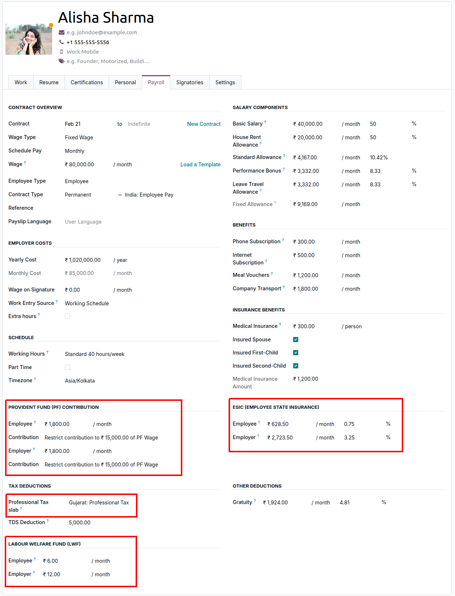

Salary benefits
---------------

Salary benefits such as phone and internet subscriptions, meal vouchers, company transport, and
medical insurance can be configured in employee contracts as allowances or benefits, and
they will be automatically reflected in the employee's payslip.

Configure the **Benefits** and **Insurance Benefits** sections on the contract, then
set the monthly contribution amounts for each benefit. Typical examples include:

- **Benefits**: Phone subscription, internet subscription, meal vouchers, company transport,
  and similar allowances.
- **Insurance Benefits**: Medical insurance, insured spouse, insured first child, insured
  second child, etc.

   .. image:: india/in-benefits.png
      :alt: Indian Benefits

Configure salary from contract template
=======================================

Configure the Employee Salary page to automatically load and display details based on the default contract template.

When creating a new employee, load the default contract template in the :guilabel:`Employee Payroll`
tab to configure a predefined salary package automatically.

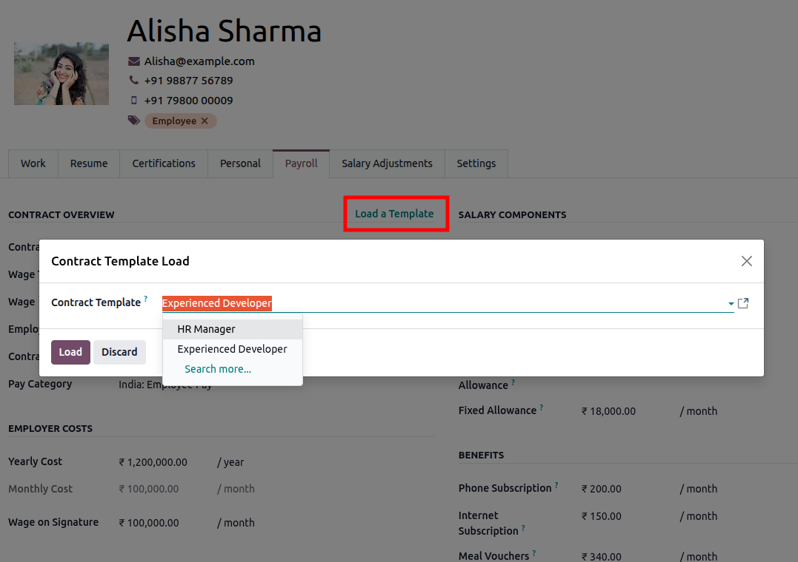

Configuration
-------------

The contract template defines the salary structure and includes all applicable salary components,
statutory compliances, and benefits.

To configure the contract template:

1. Go to :menuselection:`Payroll app --> Configuration --> Contract Templates`.
2. Create or open an existing contract template.
3. In the contract template, configure the salary package for the applicant/employee,
   including the **Salary components**, **Statutory compliances**, **Benefits**
   and **Insurance Benefits** described above.

   .. image:: india/in-contract-template.png
      :alt: Indian Contract Template

Time off
========

The Indian Localization for Time Off includes specific leave management features designed for Indian
organizations, such as **Sandwich Leave** and **Optional Holidays**.

Install the :guilabel:`India - Time Off` application to enable these policies.

.. seealso::
   :doc:`About Time Off <../../time_off>`

Sandwich leave
--------------

Sandwich Leave is a leave policy where weekends and public holidays falling between two applied
leave days are also counted as leave.

Example: If an employee applies for leave on Friday and Monday, then Saturday and Sunday (the weekend)
will also be considered as leave days.

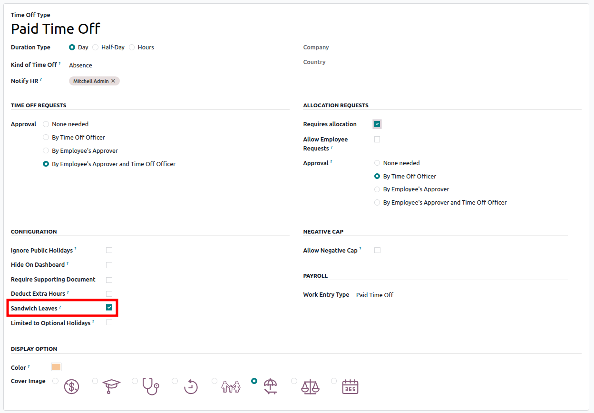

Configuration
~~~~~~~~~~~~~

To enable sandwich leave:

1. Go to :menuselection:`Time Off app --> Configuration --> Leave Types`.
2. Create a new leave type, or open an existing one.
3. Enable the checkbox :guilabel:`Sandwich Leave`.
4. Save the leave type.

Once enabled, any leave request spanning a weekend or holiday will
automatically count the intermediate non-working days as part of the
leave duration.

Optional holidays
-----------------

Optional Holidays (also called Flexible Holidays) are special holidays assigned to specific
calendar dates, such as regional or religious holidays. Employees may apply for leave only on these defined dates.

If an employee attempts to request leave on any other date, a validation
error will be raised.

Configuration
~~~~~~~~~~~~~

To configure optional holidays:

1. Go to :menuselection:`Time Off app --> Configuration --> Leave Types`.
2. Create a new leave type, or open an existing one.
3. Enable the checkbox :guilabel:`Limited to Optional Holiday`.

   .. image:: india/in-optional-holiday-checkbox.png
      :alt: Optional Holiday Checkbox

4. Save the leave type.
5. Then, go to :menuselection:`Time Off app --> Configuration --> Optional Holidays`.
6. Create new optional holidays by assigning them to specific calendar dates.
7. The optional holiday can be seen on the dashboard.

   .. image:: india/in-optional-holiday-dashboard.png
      :alt: Optional Holiday on dashboard

Employees can request these leave types, but only on the configured optional (flexible) holiday dates.

Payroll configuration
=====================

When the l10n_in_hr_payroll module is :ref:`installed <payroll/indian_apps>`, a new salary structure for India is added:
:guilabel:`India: Regular Pay` under the :guilabel:`India: Employee Pay` structure type.

The salary structure contains all salary rules needed to calculate wages, statutory salary structure,
allowances, deductions, and compliance rules.

Salary rules
------------

The salary rules control how each allowance, deduction, benefit, and statutory compliances is calculated.

To view the salary rules:

1. Go to :menuselection:`Payroll app --> Configuration --> Structures`.
2. Expand :guilabel:`India: Employee Pay`.
3. Select :guilabel:`India: Regular Pay`.

This opens the full list of salary rules used in the Indian localization.

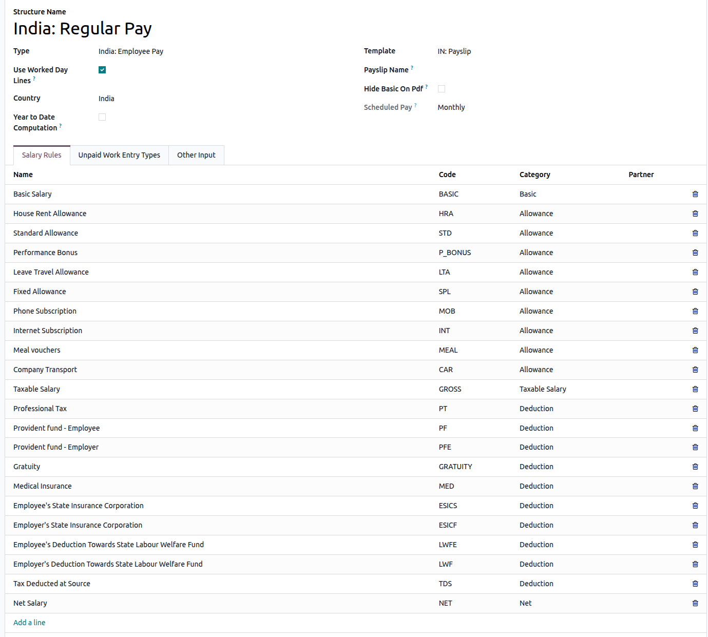

Rule parameters
---------------

Certain payroll calculations require specific rates or wage caps, and Rule Parameters
provide values either as percentages or fixed amounts that can be referenced in salary rules.

Rule parameters can be accessed via :menuselection:`Payroll app --> Configuration --> Rule Parameters`.
All the Rule parameters will be listed here with the associated salary rules.

Rule parameters are used by salary rules for statutory calculations, ensuring that
payslips stay compliant with national and state-level regulations.

.. important::
   Odoo updates rule parameters as needed.
   It is recommended **not to modify** rule parameters unless there is an official change
   in national or state regulations.

Understanding the Indian Payslip
================================

This payslip provides detailed information on allowances, deductions, compliance requirements, and benefits.
It helps employees understand how their salary is calculated, the statutory and organizational deductions applied,
and the benefits they are entitled to, ensuring transparency and trust in the payroll process.

.. seealso::
   :doc:`Create a Payslip <../payslips>`

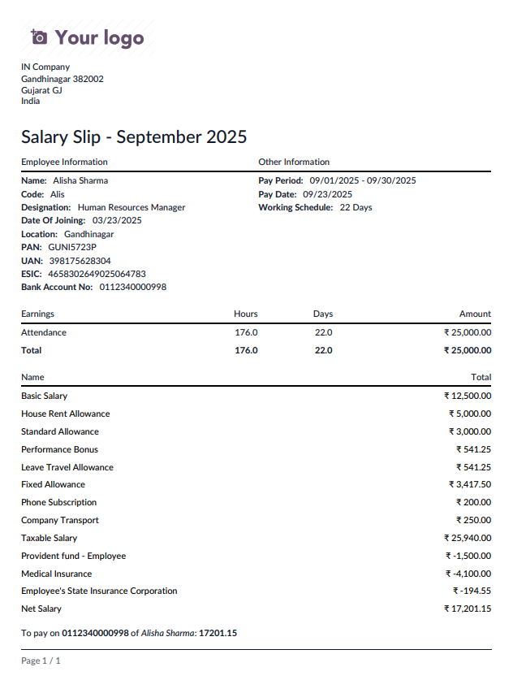

Payroll reports
===============

The Indian Payroll includes payslip related reports and statutory compliance reports.
These reports can be accessed from the
:menuselection:`Payroll app --> Reporting --> India` section.

Available reports
-----------------

Salary Register
~~~~~~~~~~~~~~~

The Register report provides a detailed month-wise record of salaries paid to employees.
It includes allowances, tax compliance, deductions, and benefits for each employee. Employers
can use this report to track payroll expenditures and employee earnings.

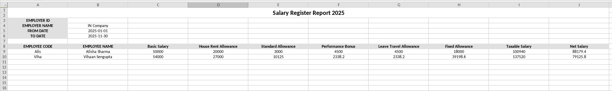

EPF Report
~~~~~~~~~~

The Employee Provident Fund (EPF) report lists the contributions made by
both employer and employee toward the Provident Fund. It includes the
employee's EPF number, contribution amounts, and employer matching
contributions, ensuring compliance with the Employees' Provident Funds
and Miscellaneous Provisions Act, 1952.

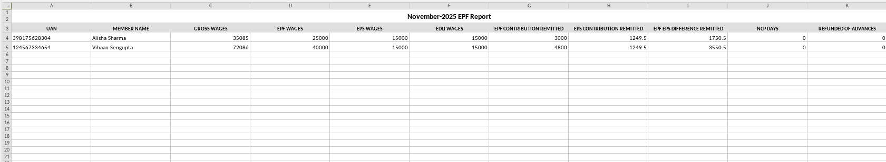

ESI Report
~~~~~~~~~~

The Employee State Insurance (ESI) report details the contributions made
toward the ESI scheme. It provides both employer and employee
contribution amounts, along with the employee's ESI number, which is
required for statutory filing with the Employee State Insurance
Corporation.

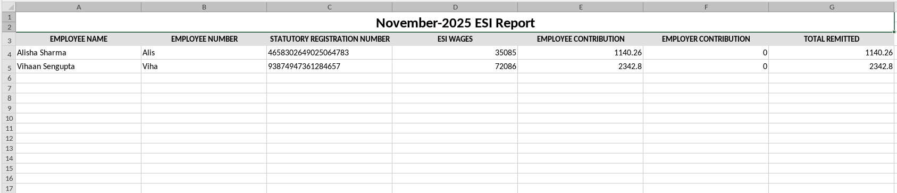

Labour Welfare Fund (LWF) Report
~~~~~~~~~~~~~~~~~~~~~~~~~~~~~~~~

This report covers the contributions made toward the Labour Welfare Fund
(LWF) by both employer and employee. It tracks the deduction amounts and
helps ensure compliance with state-level welfare fund requirements.

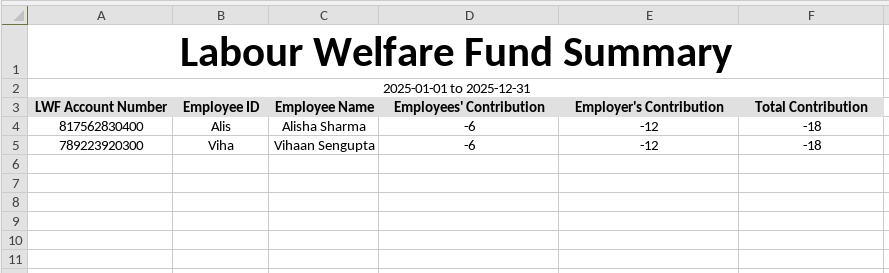
