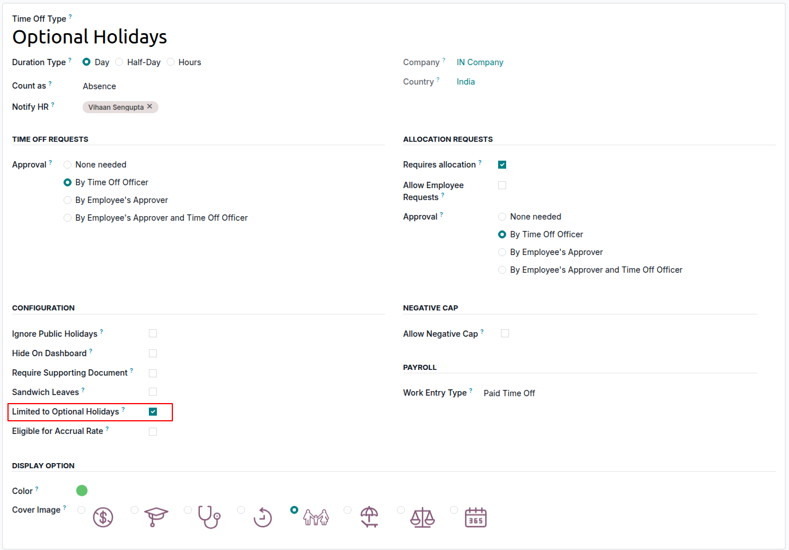

=====
India
=====

Indian Payroll Localization in Odoo supports the complete Indian salary structure,
including allowances, deductions, statutory compliance, and employee benefits.
It automatically calculates and deducts contributions for both **employees** and **employers**,
ensuring full compliance with Indian labor and taxation laws.

Configure Salary Package
========================
Employee contracts in Odoo act as the base for payroll computation. The salary structure,
including allowances, deductions, and statutory compliances, is configured directly from the contract.

.. image:: india/in-employee-payroll-setting.png
   :alt: Employee Payroll Setting

Statutory Compliance
====================
In the **Settings** menu, under the section **Indian Localization**, the following checkboxes can be found:

- **Employee Provident Fund (EPF)**
- **Professional Tax (PT)**
- **ESIC (Employee State Insurance)**
- **Labour Welfare Fund (LWF)**

.. image:: india/in-payroll-configuration.png
   :alt: Indian Localization Settings

Enabling these options will activate their respective sections in both:

- The **Employee Payroll setting**
- The **Contract Template**

This allows to configure and manage statutory compliances at the employee contract.

Employee Provident Fund (EPF)
-----------------------------

The **EPF** is a retirement benefit scheme for employees, where both the employer
and employee contribute a fixed percentage of the employee's salary each month.

- Once enabled, a **Provident Fund (PF) Contribution** section becomes available in the contract.
- Provident Fund (PF) configuration option in Indian Payroll — whether to:
    - Cap Basic at ₹15,000 (as per EPF statutory rule), or
    - Calculate PF on the actual Basic (prorated wage) without cap.

Professional Tax (PT)
---------------------

The **Professional Tax (PT)** is a state-level tax levied on employees' income.

- Enabling this option activates the **Professional Tax slab** field under **Tax Deductions** section in the contract.
- The system reads the **employee's income** and **state** from the contract and automatically
  applies the correct **Professional Tax (PT)** slab rate when generating payslips

Employee State Insurance (ESIC)
-------------------------------

The **ESIC** is a social security scheme that provides medical and cash benefits
to employees and their families.

- Once enabled, an **ESIC (Employee State Insurance)** section appears in the contract.
- Both employer and employee contributions are automatically calculated
  as a percentage of the wage.

Labour Welfare Fund (LWF)
-------------------------

The **Labour Welfare Fund (LWF)** is a statutory compliance aimed at the welfare
of workers, managed by state-specific Labour Welfare Boards.

- Enabling this activates the **Labour Welfare Fund (LWF)** section in the contract.
- Fixed contributions for both employer and employee can be defined.

.. image:: india/in-statutory-compliance.png
   :alt: Indian Statutory Compliance

Salary Benefits
===============

Salary benefits such as phone and internet subscriptions, meal vouchers, company transport, and
medical insurance can be configured in Odoo employee contracts as allowances or benefits, and
they will be automatically reflected in the employee's payslip.

- configure the **Benefits** and **Insurance Benefits**:

   - **Benefits**: Phone Subscription, Internet Subscription,
     Meal Vouchers, Company Transport, etc.
   - **Insurance Benefits**: Medical Insurance, Insured Spouse,
     Insured First-Child, Insured Second-Child, etc.

     .. image:: india/in-benefits.png
      :alt: Indian Benefits
- Set the monthly contribution amounts for each benefit.

Salary Configurator
===================

Once the salary structure and localization rules are configured, Odoo
allows companies to generate an **offer** for employees.
Through the **Salary Configurator**, employees can review the proposed
salary package and adjust the benefits according to their needs.

To use this feature, make sure the **Salary Configurator (India)**
application is installed.

Configuration
-------------

Before sending an offer, a **contract template** must be created
for the employee. The contract template defines the salary structure
and includes all available benefits.

To configure the contract template:

1. Go to :menuselection:`Payroll app --> Configuration --> Contract Templates`.
2. Create or open an existing contract template.
3. In the template form, configure the **Benefits** and **Insurance Benefits**:

   - **Benefits**: Phone Subscription, Internet Subscription,
     Meal Vouchers, Company Transport, etc.
   - **Insurance Benefits**: Medical Insurance, Insured Spouse,
     Insured First-Child, Insured Second-Child, etc.

     .. image:: india/in-contract-template.png
      :alt: Indian Contract Template

4. Set up the monthly salary package

Generate Offer
--------------

Once the contract template is ready:

1. Navigate to the :menuselection:`Employees app`.
2. Open the employee.
3. Generate Offer.
4. Send the **offer** to the employee.

Customize Salary Package
------------------------

When the offer is sent, the employee receives an interactive
**Salary Configurator** screen.

On this screen, the employee can:

- **Enable or disable benefits** according to their needs.
- **Select insurance coverage** for spouse and children.
- Immediately see the updated **Net Salary**, **Employer Cost**,
  and **Monthly Equivalent** on the right-hand panel.

.. image:: india/in-salary-configurator.png
   :alt: Indian Salary Configurator

Once the employee has made their selections, they can confirm by clicking
**Review Contract & Sign**. The system will then generate the contract with
the chosen benefits and finalize the payroll configuration accordingly.

Time Off
========

The Indian Payroll Localization includes specific leave management
features tailored for Indian organizations:  **Sandwich Leave** and **Optional Holidays**.

To use this feature, make sure the **India - Time Off**
application is installed.

Sandwich Leave
--------------

The sandwich leave rule ensures that weekends and public holidays falling
between two applied leave days are also counted as leave days. This rule
is commonly used by Indian organizations to prevent misuse of the leave
system.

.. image:: india/in-sandwich-leave.png
   :alt: Sandwich Leave

Configuration
~~~~~~~~~~~~~

To enable sandwich leave:

1. Go to :menuselection:`Time Off app --> Configuration --> Leave Types`.
2. Create a new leave type, or open an existing one.
3. Enable the checkbox :guilabel:`Sandwich Leave`.
4. Save the leave type.

Once enabled, any leave request spanning a weekend or holiday will
automatically count the intermediate non-working days as part of the
leave duration.

Optional Holidays
-----------------

Optional holidays are special holidays assigned to specific calendar
dates (for example, regional or religious holidays). Employees may
apply for leave only on those defined dates.

If an employee attempts to request leave on any other date, a validation
error will be raised.

Configuration
~~~~~~~~~~~~~

To configure optional holidays:

1. Go to :menuselection:`Time Off app --> Configuration --> Leave Types`.
2. Create a new leave type, or open an existing one.
3. Enable the checkbox :guilabel:`Limited to Optional Holiday`.
4. Save the leave type.
5. Then, go to :menuselection:`Time Off app --> Configuration --> Optional Holidays`.
6. Create new optional holidays by assigning them to specific calendar dates.

Employees can then request these leave types, but only on the configured
optional holiday dates.

Reports
=======

The Indian Payroll Localization package provides several statutory and
salary-related reports. These reports can be accessed from the
:menuselection:`Payroll app --> Reporting --> India` section.

Available Reports
-----------------

**Salary Register**
This report provides a detailed month-wise register of salaries paid to
employees. It includes gross salary, deductions, and net salary for each
employee. Employers can use this report to keep track of payroll
expenditure and employee earnings.

**EPF Report**
The Employee Provident Fund (EPF) report lists the contributions made by
both employer and employee toward the Provident Fund. It includes the
employee's EPF number, contribution amounts, and employer matching
contributions, ensuring compliance with the Employees' Provident Funds
and Miscellaneous Provisions Act, 1952.

**ESI Report**
The Employee State Insurance (ESI) report details the contributions made
toward the ESI scheme. It provides both employer and employee
contribution amounts, along with the employee's ESI number, which is
required for statutory filing with the Employee State Insurance
Corporation.

**Labour Welfare Fund (LWF) Report**
This report covers the contributions made toward the Labour Welfare Fund
(LWF) by both employer and employee. It tracks the deduction amounts and
helps ensure compliance with state-level welfare fund requirements.
