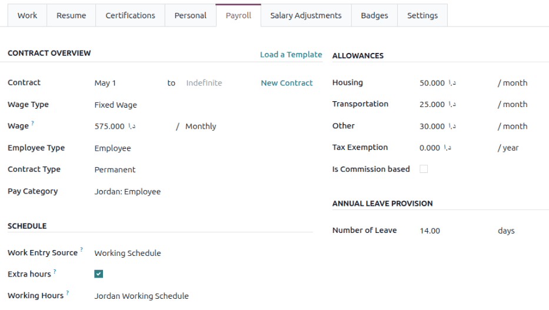
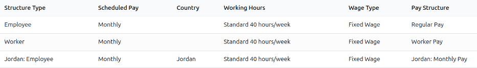
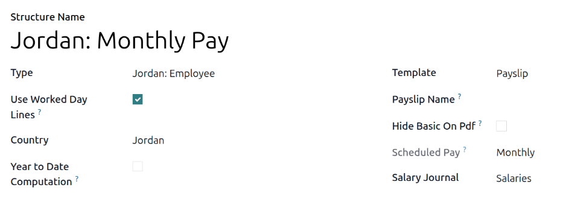
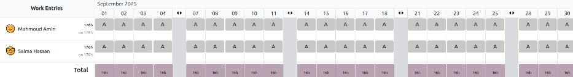
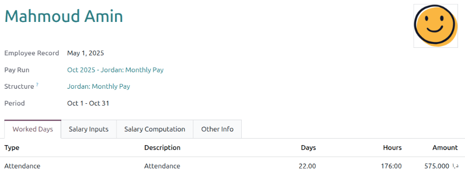
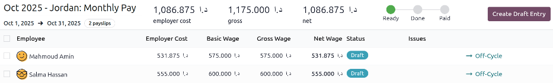
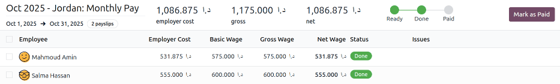
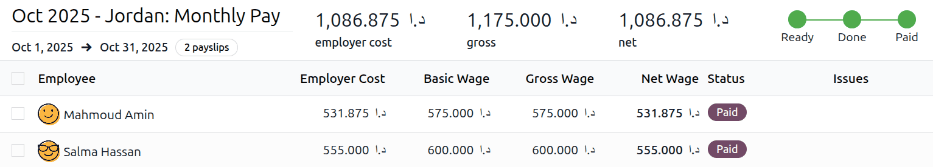

======
Jordan
======

The Jordan **Payroll** localization offers a comprehensive solution for managing payroll in
compliance with Jordanian labor laws. It supports income tax calculations using progressive tax
brackets, social security contributions from both employees and employers and basic salary
calculations, including allowances such as housing and transportation.

.. _payroll/jordan_apps:

Apps & modules
==============

:ref:`Install <general/install>` the following modules to get all the features of the Jordan
**Payroll** localization:

.. list-table::
   :header-rows: 1

   * - Name
     - Technical name
     - Dependencies
     - Description
   * - :guilabel:`Jordan - Payroll`
     - `l10n_jo_hr_payroll`
     - - hr_payroll
       - hr_payroll_holidays
     - Includes all salary rules, leave logic, and compensation rules compliant with Jordan Labor
       Law.
   * - :guilabel:`Jordan - Payroll with Accounting`
     - `l10n_jo_hr_payroll_account`
     - - hr_payroll_account
       - l10n_jo
       - l10n_jo_hr_payroll
     - Links payroll and accounting by creating journal entries to record payroll in the company's
       books.

Before configuring the Jordan localization, refer to the general :doc:`payroll <../../payroll>`
documentation, which includes the basic information for all localizations, as well as all universal
settings and fields.

.. seealso::
   :doc:`Jordan fiscal localization documentation <../../../finance/fiscal_localizations/jordan>`

General configurations
======================

First, the company must be configured. Navigate to :menuselection:`Settings app --> Users &
Companies --> Companies`. From the list, select the desired company, and configure the following
fields:

- :guilabel:`Company Name`: Enter the business name in this field.
- :guilabel:`Address`: Complete the full address, including the :guilabel:`City`, :guilabel:`Zip
  Code`, and :guilabel:`Country` fields.

  .. Note::
     Jordan does not use the :guilabel:`State` field, this remains blank. The :guilabel:`Zip Code`
     refers to the Jordanian `Postal Code`.

- :guilabel:`Tax ID`: Enter the company's tax identification number.
- :guilabel:`Company ID` : Enter the business's registry number.
- :guilabel:`Currency`: By default, :abbr:`JOD (Jordanian Dollars)` is selected. If not, select
  :guilabel:`JOD` from the drop-down menu.

Employees
=========

Every employee being paid must have their employee profiles configured for the Jordan payroll
localization. Additional fields are present after configuring the database for Jordan.

To update an employee form, open the :menuselection:`Employees` app and click on the desired
employee record. On the employee form, configure the required fields in the related tabs.

Work tab
--------

Enter the :guilabel:`Work Address` for the employee in the :guilabel:`Location` section of the
:guilabel:`Work` tab.

Personal tab
------------

Ensure the employee has a minimum of one :ref:`trusted bank account <employees/private-contact>`
listed in the :guilabel:`Bank Accounts` field in the :guilabel:`Private Contact` section.

These accounts are used to pay the employee. Payroll **cannot** be processed for employees without a
*trusted* :ref:`bank account <employees/private-contact>`. If no trusted bank account is set, a
warning appears on the **Payroll** dashboard and an error occurs when attempting to run payroll.

If the employee is **not** a resident of Jordan, tick the :guilabel:`Non-resident` box. This
indicates the employee is *not* eligible for personal exemptions.

Under the :guilabel:`Family` section, ensure the :guilabel:`Has Dependants` box is ticked if the
employee has any dependants, such as a spouse, children, or parents. This ensures they receive an
additional exemption on their taxable salary.

By default, the :guilabel:`Is Eligible for EOS` checkbox is ticked, in the :guilabel:`Personal
Information` section, indicating the employee is eligible for end of service benefits. If the
employee is **not** eligible, ensure the box is unchecked.

Additionally, if the employee is blind, tick the :guilabel:`Is Blind` checkbox. This ensures the
employee's entire salary is tax-exempt.

Payroll tab
-----------

Contract overview section
~~~~~~~~~~~~~~~~~~~~~~~~~

This section holds information that drives salary calculations. Ensure the following fields are
configured:

- :guilabel:`Contract`: Ensure the contract dates are populated. The contract start date populates
  the first field, and if the contract has a set end date, that is populated in the second field.
- :guilabel:`Wage Type`: Select how the employee is paid.

  - Select :guilabel:`Fixed Wage` for salaried employees who receive the same amount each pay
    period.
  - Select :guilabel:`Hourly Wage` for employees paid based on hours worked.

  .. tip::
     Set a default :guilabel:`Wage Type` in the salary :ref:`Structure Type
     <payroll/structure-types>` to configure employees in bulk. If needed, the default can be
     overridden on individual employee records if exceptions are needed.

- :guilabel:`Wage`: Enter the monthly wage in this field, in :abbr:`JOD (Jordanian Dollars)`.
- :guilabel:`Employee Type`: Select what kind of employee the contract is for, such as
  :guilabel:`Employee` or :guilabel:`Freelance`.
- :guilabel:`Contract Type`: Determines how the employee is paid and classified, such as
  :guilabel:`Permanent`, :guilabel:`Temporary`, :guilabel:`Seasonal`.
- :guilabel:`Pay Category`: Select :guilabel:`Jordan: Employee` for this field. This defines when
  the employee is paid, their default working schedule, and the work entry type it applies to.

Schedule section
~~~~~~~~~~~~~~~~

- :guilabel:`Work Entry Source`: Defines how :doc:`work entries <../work_entries>` are generated for
  payroll during the specified pay period. The options are:

  - :guilabel:`Working Schedule`: Based on the employee's assigned :ref:`working schedule
    <employees/schedule>` (e.g., 40 hours per week).
  - :guilabel:`Attendances`: Based on :doc:`approved checked-in hours
    <../../attendances/management>` in the **Attendances** app.
  - :guilabel:`Planning`: Based on :ref:`scheduled shifts <planning/shifts>` in the **Planning**
    app.

- :guilabel:`Extra Hours`: Tick the checkbox to allow the **Attendances** app to add any extra work
  entries logged by the employee.
- :guilabel:`Working Hours`: Using the drop-down menu, select :guilabel:`Jordan Working Schedule`,
  which consists of a Sunday - Thursday, 40-hour work week.

Allowances section
~~~~~~~~~~~~~~~~~~

The following sections of benefits are considered common ones offered by Jordanian employers. This
information needs to be populated with the information selected by the employee.

.. note::
   The benefits listed in this section are considered the ones most commonly offered by companies.
   If other employee benefits exist that require regular paycheck deductions, they can be added as
   *inputs*.

Enter the monthly allowance amount for :guilabel:`Housing`, :guilabel:`Transportation`, and
:guilabel:`Other` allowances.

If the employee is tax exempt, enter the annual amount that is not subject to taxes in the
:guilabel:`Tax Exemption` field.

If the employee's salary is based on commission, tick the :guilabel:`Is Commission based` checkbox.

Annual leave provision section
~~~~~~~~~~~~~~~~~~~~~~~~~~~~~~

Every year, employees receive days off. Enter the number of days in the :guilabel:`Number of Leave
days` field. The default value is 14.

Social Insurance
================

Social insurance rules calculate the contribution amounts that are to be paid by the employer and
employee to the :abbr:`Social Security Corporation (SSC)`. This is only available for Jordanian
employees.

The employer contributes 14.25% of the employee's salary to the :abbr:`Social Security Corporation
(SSC)`, while the employee contributes 7.5% of their salary, which is deducted from their payslip.

For both employer and employee contributions, the base amount on which they are calculated is bound
by a cap that gets updated every year.

Leaves
======

The following leave types are available to employees working in Jordan:

- :guilabel:`Annual leave`: Employee's are eligible for 21 days of annual leave, and if the employee
  requires more days, they have to be requested from HR managers accordingly.

.. important::
   Since the annual leave is fully paid, it is not connected to a salary rule, but it will appear on
   the worked days on the payslip form and on the PDF printout.

- :guilabel:`Sick leave`: Employee's working in Jordan are entitled to 14 days of paid sick leave
  per year, with the possibility of an additional 14 days if hospitalized. No deductions are applied
  to the employee in those cases.

- :guilabel:`Other leave types`: These leave types are fully paid and do not affect the final
  payslip, but are tracked for reporting purposes:

  - :guilabel:`Maternity leave`
  - :guilabel:`Paternity Leave`
  - :guilabel:`Pilgrimage Leave`
  - :guilabel:`Study leave`

Income Tax
==========

In Jordan, employees are subject to a progressive income tax system, where tax rates increase with
higher annual income brackets.

Tax brackets
------------

Depending on the annual income of the employee, the following rates apply:

.. list-table::
   :header-rows: 1
   :stub-columns: 0

   * - Taxable Bracket
     - Range
   * - 5%
     - 0-5,000
   * - 10%
     - 5,001 - 10,000
   * - 15%
     - 10,001 - 15,000
   * - 20%
     - 15,001 - 20,000
   * - 25%
     - 20,001 - 1,000,000
   * - 30%
     - More than 1,000,000

.. note::
   Tax brackets are applied progressively. This means each portion of an employee's income is taxed
   at its respective rate within each bracket, rather than their entire income being taxed at the
   rate of the highest bracket they fall into.

Exemptions
----------

Several factors contribute to exempting part of an employee's gross income, including:

- **Jordanian residency**: Residents are entitled to a yearly exemption of 12,000 JOD.
- **Blindness**: Individuals who are blind are **fully** exempt from income tax.
- **Dependents**: An additional 12,000 JOD exemption per year for employees with dependents.

Overtime
========

Employees are entitled to additional pay for overtime worked, depending on when the overtime hours
are worked:

- On working days: Overtime is paid at 1.25 times the regular hourly wage.
- On rest days: Overtime is compensated at 1.5 times the regular hourly wage.

These percentages are recorded in the input parameters model.

.. note::
   The number of overtime hours is registered as other inputs directly on payslips.

Provisions
==========

Provisions are the amounts computed by the employer to account for the payments made to the employee
for :abbr:`end-of-service (EOS)` benefits or annual leaves. It is computed on a monthly basis.

- **End of service benefit provision**: This is computed by dividing the monthly gross salary by 12

  .. math::

     \frac{\text{Basic} + \text{Allowances}}{12}

- **Annual leave provision**: This is computed by dividing the gross salary by 30 to get the daily
  salary, then multiplying that by the number of leave days, and dividing the result by 12.

  .. math::

     \left(\frac{\text{Basic} + \text{Allowances}}{30}\right)
     \times
     \left(\frac{\text{Number of Leave Days}}{12}\right)

End of Service
==============

At the end of the employee's service, if they are eligible for end-of-service benefits, they should
receive the following two benefits:

- **Unused leaves compensation**: The Annual Leave Balance is shown on the employee's record. It is
  based on the annual leave type defined in the **Payroll** app settings and is calculated as the
  total remaining allocations for that specific leave type assigned to the employee.

  The balance represents the total remaining leave allocated to the employee but does not reflect
  the portion of leave days the employee has earned up to the current month.

  When calculating the benefit value, the deserved leave balance is determined based on the portion
  of the year worked. The benefit value is then calculated by multiplying this deserved balance by
  the employee's daily rate.

  .. example::
     If an employee is entitled to 14 leave days per year and has worked for 6 months, they deserve
     7 leave days so far. If their daily rate is 50 JOD, the benefit value is: 7 days × 50 JOD = 350
     JOD

  .. important::
     The flow mentioned above requires the allocation for the annual leave to be given fully upfront
     in the beginning of the year for that employee

- **End of Service Benefit**: The calculation begins by determining the total number of days the
  employee has worked at the company, starting from their joining date up to their last working day.

  The total service duration is calculated out of a 365-day year.

  The resulting period in years is then multiplied by the employee's gross salary, which includes
  the basic salary and the allowances defined in the payroll tab on the employee record.

  .. math::

   (\text{Basic} + \text{Allowances}) \times \left(\frac{\text{Number of Days}}{365}\right)

Payroll configuration
=====================

Several sections within the **Payroll** app installs a Salary Structure, Structure Type, Rules, and
Parameters specific to Jordan.

Salary structures & structure types
-----------------------------------

When the **l10n_jo_hr_payroll** module is :ref:`installed <payroll/jordan_apps>`, a new
:guilabel:`Salary Structure` gets installed, :guilabel:`Jordan: Monthly Pay`. This structure
includes one :guilabel:`Structure Type`, :guilabel:`Jordan: Employee`.

The :guilabel:`Salary Structure` contains all the individual :ref:`salary rules
<payroll/jordan_apps>` that informs the **Payroll** app how to calculate employee payslips.

.. _payroll/jordan_rules:

Salary rules
------------

To view the salary rules that inform the salary structure what to do, navigate to
:menuselection:`Payroll app --> Configuration --> Structures` and expand the :guilabel:`Jordan:
Employee` entry to reveal the :guilabel:`Jordan: Monthly Pay` structure type. Click
:guilabel:`Jordan: Monthly Pay` to view the detailed salary rules.

Each rule defines how pay is calculated, taking into account factors such as allowances, deductions,
and taxes.

Rule parameters
---------------

Some calculations require specific rates associated with them, or wage caps. *Rules Parameters* are
capable of listing a value, either a percentage or a fixed amount, to reference in the salary rules.

.. example::
   The percentage rate for employee Social Security deductions is set in the `Jordan Social Security
   Employee Deduction Rate %` parameter.

Most rules pull information stored in the parameters module to get the rate of the rule (a
percentage) and the cap (a dollar amount).

To view rule parameters, navigate to :menuselection:`Payroll app --> Configuration --> Rule
Parameters`. Here, all rule parameters are displayed with their linked :guilabel:`Salary Rules`,
which can be accessed. Review the parameters associated with a rule by looking for the
:guilabel:`Name` of the rule, and make any edits as needed.

.. important::
   Odoo adds updated rule parameters for the current calendar year. It is **not** recommended to
   edit rule parameters **unless a national parameter has changed**, and is different from the rule
   parameters created by Odoo. Check with all national regulations *before* making any changes to
   rule parameters.

Run Jordan payroll
==================

Before running payroll, the payroll officer must validate employee :doc:`work entries
<../work_entries>` to confirm pay accuracy and catch errors. This includes checking that all time
off is approved and any overtime is appropriate.

Work entries sync based on the employee's :doc:`contract <../contracts>` configuration. Odoo pulls
from the assigned working schedule, attendance records, planning schedule, and approved time off.

Any :ref:`discrepencies or conflicts <payroll/conflicts>` must be resolved, then the work entries
can be :ref:`regenerated <payroll/regenerate-work-entries>`.

Once everything is correct, draft payslips can be :ref:`created individually <payroll/process>` or
in :doc:`batches <../batches>`, referred to in the **Payroll** app as *Pay Runs*.

.. note::
   To cut down on the payroll officer's time, it is typical to process payslips in batches, either
   by wage type (fixed salary vs hourly), pay schedule (weekly, bi-weekly, monthly, etc.),
   department (direct cost vs. administration), or any other grouping that best suits the company.

The process of running payroll includes different actions that need to be executed to ensure that
the amount withheld from payroll taxes is correct, the amount that the employee receives as their
net salary is correct, and the computation of hours worked reflects the employee's actual hours
worked, among others.

When running a payroll batch, check that the period, company, and employees included are correct
*before* starting to analyze or validate the data.

Once the payslips are drafted, review them for accuracy. Check the :guilabel:`Worked Days & Inputs`
tab, and ensure the listed worked time is correct, as well as any other inputs. Add any missing
inputs, such as commissions, tips, reimbursements, that are missing.

Next, check the various totals (gross pay, employee taxes, benefits, employer taxes, net salaries),
then click :guilabel:`Compute Sheet` to update the salary calculations, if there were edits. If
everything is correct, click :guilabel:`Validate`.

Accounting check
----------------

The accounting process when running payroll has two components: :ref:`creating journal entries
<payroll/jo-journal>`, and :ref:`registering payments <payroll/jo-register>`.

.. _payroll/jo-journal:

Journal entry creation
~~~~~~~~~~~~~~~~~~~~~~

After payslips are confirmed and validated, journal entries are posted either individually, or in a
batch. The journal entry is created first as a draft.

.. important::
   It must be decided if journal entries are done individually or in batches *before* running
   payroll.

Thirteen accounts from the Jordan :abbr:`CoA (Chart of Accounts)` are included with the Jordan
payroll localization:

- `500301 Basic Salary`: Tracks the basic wages paid to employees.
- `500302 Housing Allowance`: Captures housing allowance payments provided to employees.
- `500303 Transportation Allowance`: Captures transportation allowance payments to employees.
- `500308 Staff Other Allowances`: Covers employee allowances that do not fit any other available
  categories.
- `500310 Salary Deductions`: Reflects deductions applied to employee salaries (e.g., advances,
  fines, statutory deductions).
- `500305 Leave Salary`: Records salaries actually paid to employees while on paid leave.
- `201022 Social Security Payable`: Holds both employee and employer amounts payable for social
  insurance contributions.
- `200502 Leave Days Provision`: Accrues the cost of paid leave; the balance is reduced when leave
  is taken, and any leave not taken may be paid out when the employee leaves the company.
- `200503 End of Service Provision`: Accumulates the end-of-service benefit monthly, so the amount
  can be paid (partially or fully) when the employee leaves, per service length and reason.
- `200101 Payables`: Shows amounts payable to employees as salaries (unpaid salary liability at
  period end).
- `500202 End of Service Indemnity`: Captures company expenses set aside to fund end-of-service
  benefits (expense-side counterpart to the provision).
- `200307 Employee Income Tax`: Accumulates the income tax amount withheld from the employee's
  salary.
- `500311 Social Security Expenses`: Captures The total expense amount from payments to the social
  insurance authority.

.. note:: The :abbr:`CoA (Chart of Accounts)` configuration is done by default when installing the
   Jordan payroll localization. The account codes and names can be edited to suit the company's
   needs.

If everything seems correct on the journal entry draft, post the journal entries.

.. _payroll/jo-register:

Register Payments
-----------------

After the :ref:`journal entries <payroll/journal>` are validated, Odoo can generate payments.

Payments can be :guilabel:`Grouped by Partner` if there is a partner associated with a salary rule.

Close Payroll
-------------

If there are no errors, payroll is completed for the pay period.

Reports
=======

No additional payroll reports unique to the Jordan payroll localization exist. All reports are the
standard preconfigured reports included with the **Payroll** app.
