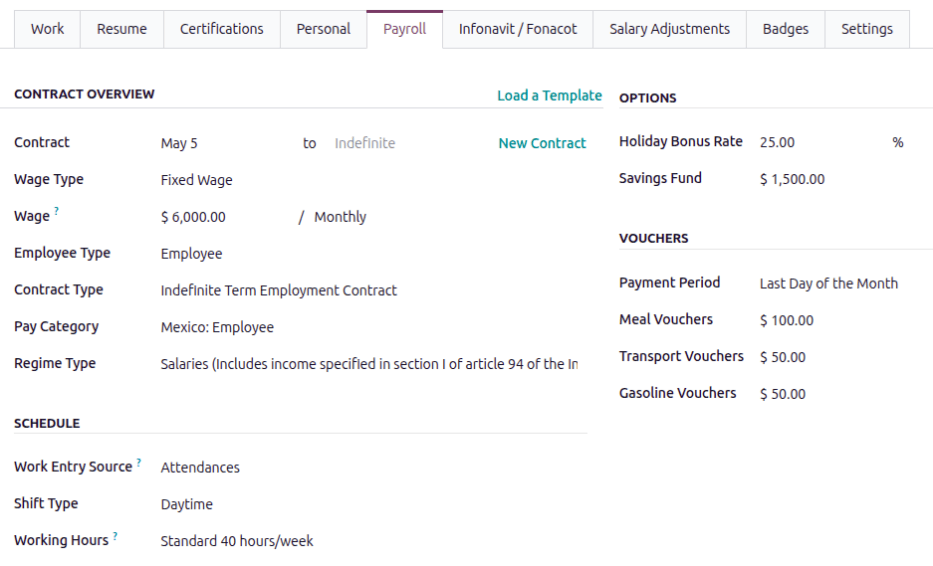

======
Mexico
======

.. |PAC| replace:: :abbr:`PAC (Proveedor Autorizado de Certificación / Authorized Certification
   Provider)`
.. |RFC| replace:: :abbr:`RFC (Registro Federal de Contribuyentes)`
.. |CFDI| replace:: :abbr:`CFDI (Comprobante Fiscal Digital por Internet)`
.. |IMSS| replace:: :abbr:`IMSS (Instituto Mexicano del Seguro Social)`

The Mexico payroll localization covers salary computations for employees, including employee and
employer payroll taxes.

Before configuring the Mexico localization, review the general :doc:`payroll documentation
<../../payroll>`, which covers basic configurations and settings applicable to all localizations.

.. _payroll/mexico_apps:

Apps & modules
==============

:ref:`Install <general/install>` the following modules to get all the features of the Mexico payroll
localization:

.. list-table::
   :header-rows: 1

   * - Name
     - Technical name
     - Dependencies
     - Description
   * - :guilabel:`Mexico - Payroll`
     - `l10n_mx_hr_payroll`
     - - hr_payroll
       - hr_work_entry_holidays
       - hr_payroll_holidays
     - Adds the required fields to manage employee payroll and time off data.
   * - :guilabel:`Mexico - Payroll CFDI`
     - `l10n_mx_hr_payroll_account_edi`
     - - l10n_mx_hr_payroll_account
       - l10n_mx_edi
     - Adds the ability to sign |CFDI| payroll documents with the government.
   * - :guilabel:`Mexico - Payroll with Accounting`
     - `l10n_mx_hr_payroll_account`
     - - hr_payroll_account
       - l10n_mx
       - l10n_mx_hr_payroll
       - l10n_mx_edi
     - Adds the required rules and parameters to manage local payroll calculations.

.. tip::
   Installing the :guilabel:`Mexico - Payroll CFDI` module automatically installs both the
   :guilabel:`Mexico - Payroll` and :guilabel:`Mexico - Payroll with Accounting` modules.

.. seealso::
   :doc:`Configure the Mexico fiscal localization <../../../finance/fiscal_localizations/mexico>`

Company configurations
======================

First, the company must be configured. Navigate to :menuselection:`Settings app --> Users &
Companies --> Companies`. From the list, select the desired company, and configure the following
fields:

- :guilabel:`Company Name`: Enter the business name in this field.
- :guilabel:`Address`: Complete the full address, including the :guilabel:`City`, :guilabel:`State`,
  :guilabel:`Zip Code`, and :guilabel:`Country`.

  .. important::
     The state selected in the company's address is associated as the *work address* by default for
     the employee, and the one used to calculate payroll taxes.

- :guilabel:`RFC`: Enter the company's :abbr:`RFC (Registro Federal de Contribuyentes, or Federal
  Taxpayer Registry)` number.
- :guilabel:`Company ID` : This field is not used in the Mexico localization, and should remain
  blank.
- :guilabel:`Currency`: By default, :abbr:`MXN (Mexican pesos)` is selected. If not, select
  :guilabel:`MXN` from the drop-down menu.
- :guilabel:`Phone`: Enter the company phone number.
- :guilabel:`Email`: Enter the email used for general contact information.

.. warning::
   Ensure the information is accurate, as it is used when calculating various taxes.

Employees
=========

Every employee being paid must have their employee profiles configured for the Mexico payroll
localization. Additional fields are present after configuring the database for Mexico.

To update an employee form, open the :menuselection:`Employees` app and click on the desired
employee record. On the employee form, configure the required fields in the related tabs.

Work tab
--------

Enter the :guilabel:`Work Address` for the employee in the :guilabel:`Location` section of the
:guilabel:`Work` tab.

.. important::
   The state selected in this address determines which salary rules Odoo applies when calculating
   taxes.

Personal tab
------------

Ensure the employee has a minimum of one :ref:`trusted bank account <employees/private-contact>`
listed in the :guilabel:`Bank Accounts` field in the :guilabel:`Private Contact` section.

These accounts are used to pay the employee. Payroll **cannot** be processed for employees without a
*trusted* :ref:`bank account <employees/private-contact>`. If no trusted bank account is set, a
warning appears on the **Payroll** dashboard and an error occurs when attempting to run payroll.

Ensure the :guilabel:`Legal Name` and :guilabel:`Gender` fields are populated and configured in the
:guilabel:`Personal Information` section.

Ensure the following fields are properly populated in the :guilabel:`Citizenship` section:

- :guilabel:`Nationality (Country)`: The employee's country of citizenship.
- :guilabel:`SSN No (Social Security Number)`: A personal 11-digit :abbr:`NSS (Número de Seguridad
  Social)` number.
- :guilabel:`RFC (Registro Federal de Contribuyentes)`: A personal 13-digit alphanumeric tax
  identification number.
- :guilabel:`CURP (Clave Única de Registro de Población)`: A personal 18-character alphanumeric
  code.

Payroll tab
-----------

Contract overview section
~~~~~~~~~~~~~~~~~~~~~~~~~

This section holds information that drives salary calculations. Ensure the following fields are
configured:

- :guilabel:`Contract`: The time period the contract is valid for. If the second field is left
  blank, the contract runs indefinitely.
- :guilabel:`Wage Type`: Select how the employee is paid.

  - Select :guilabel:`Fixed Wage` for salaried employees who receive the same amount each pay
    period.
  - Select :guilabel:`Hourly Wage` for employees paid based on hours worked.

  .. tip::
     Set a default :guilabel:`Wage Type` in the salary :ref:`Structure Type
     <payroll/structure-types>` to configure employees in bulk. If needed, the default can be
     overridden on individual employee records if exceptions are needed.

- :guilabel:`Wage`: Enter the amount and frequency the employee is paid.
- :guilabel:`Contract Type`: Determines how the employee is paid and classified, such as
  :guilabel:`Indefinite Term Employment Contract`, :guilabel:`Hourly Wage Employment`,
  :guilabel:`Seasonal Employment Contract`.

  .. important::
     The :guilabel:`Contract Type` field is visible on payslips.

- :guilabel:`Pay Category`: Select :guilabel:`Mexico: Employee.` for this field. This defines when
  the employee is paid, their default working schedule, and the work entry type it applies to.
- :guilabel:`Regime Type`: Select the correct regime type (Régimen de Contratación) for the
  employee. The selected regime type determines the employee's benefits, taxes, and social security
  contributions.

Schedule section
~~~~~~~~~~~~~~~~

- :guilabel:`Work Entry Source`: Select :guilabel:`Working Schedule`, which creates :doc:`work
  entries <../work_entries>`  based on the employee's assigned :ref:`working schedule
  <employees/schedule>` (e.g., 40 hours per week).

  .. note::
     The Mexico payroll localization is currently not able to create work entries from the
     **Attendances** or **Planning** apps.

- :guilabel:`Extra Hours`: Tick the checkbox to allow the **Attendances** app to add any extra work
  entries logged by the employee.
- :guilabel:`Working Hours`: Using the drop-down menu, select the default work schedule. This is
  particularly important for employees available to receive overtime pay (typically hourly
  employees, not salaried).

Options section
~~~~~~~~~~~~~~~

Enter the :guilabel:`Holiday Bonus Rate` percentage given annually ot the employee in the
corresponding field. The percentage is calculated from the employee's base salary.

If the employee is contributing to a :guilabel:`Savings Fund`, enter the monthly amount to be
contributed. The employer typically matches this amount, and the money is placed in a savings
account that is accessible once a year to the employee.

Vouchers section
~~~~~~~~~~~~~~~~

Some companies may offer extra benefits in the form of vouchers, which are paid to employees for
food and transportation costs. If the company provides these benefits, configure the following
fields:

- :guilabel:`Payment Period`: Using the drop-down menu, select how often the vouchers are paid out.
  The default options are either :guilabel:`Last Day of the Month`, if employees are paid at the end
  of the month, or :guilabel:`In the period`, if the vouchers are broken up and evenly distributed
  according to the payment schedule, such as weekly or bi-weekly.
- :guilabel:`Meal Vouchers`: Enter the monthly amount paid to the employee towards food expenses.
- :guilabel:`Transport Vouchers`: Enter the monthly amount paid to the employee towards
  transportation, such as bus fare or parking fees.
- :guilabel:`Gasoline Vouchers`: Enter the monthly amount paid to the employee for their vehicle's
  gas.

.. note::
   The monetary amount for the vouchers is the *monthly amount* given to employees. If the
   :guilabel:`Payment Period` is set to :guilabel:`In the period`, Odoo calculates the voucher
   amount for each pay period.

   For example, if an employee is paid weekly, and their :guilabel:`Meal Voucher` is set to $100,
   the employee receives $25 in every weekly paycheck.

Infonavit / Fonacot tab
-----------------------

Infonavit section
~~~~~~~~~~~~~~~~~

:abbr:`INFONAVIT (Instituto del Fondo Nacional de la Vivienda para los Trabajadores)` is a
government institution that assists employees with affordable mortgage credits, which can be used to
buy, build, or remodel a home, or pay off an existing mortgage.

Add an Infonavit credit
***********************

To create an :abbr:`INFONAVIT (Instituto del Fondo Nacional de la Vivienda para los Trabajadores)`
credit, click :guilabel:`Add a line`, and a :guilabel:`Create an Infonavit Credit` pop-up window
loads.

By default, the :guilabel:`Status` field is populated with :guilabel:`In Progress`. This indicates
the credit is active.

Next, select the :guilabel:`Type` of credit, either a :guilabel:`Fixed Monetary Fee`, a
:guilabel:`Percentage`, or a :guilabel:`Discount Factor`. After this field is configured, a
corresponding field appears on the form.

Enter the :guilabel:`Monthly Insurance` to be paid directly to the debt. If any additional funds are
contributed by the employee, enter the additional amount in the :guilabel:`Extra Fixed Monthly
Contribution` field.

The last field corresponds to the :guilabel:`Type` selected. Enter the :guilabel:`Fixed Monetary
Fee`, :guilabel:`Percentage`, or  :guilabel:`Discount Factor` in the field.

Once all fields are configured, click the :guilabel:`Save & Close` button, and the credit is added
to the :abbr:`INFONAVIT (Instituto del Fondo Nacional de la Vivienda para los Trabajadores)`
section.

.. important::
   Once :abbr:`INFONAVIT (Instituto del Fondo Nacional de la Vivienda para los Trabajadores)`
   credits are fully paid, the payroll officer **must** change the :guilabel:`Status` of each
   completed line item to :guilabel:`Closed`.

   If the payroll officer does **not** change the status, money will continue to be contributed to
   the employee's account in all subsequent paychecks.

Fonacot section
~~~~~~~~~~~~~~~

:abbr:`FONACOT (Fondo Nacional para el Consumo de los Trabajadores)` is a Mexican government program
that provides employees with low-cost loans for various needs, such as home improvements, education,
or emergencies.

The :abbr:`FONACOT (Fondo Nacional para el Consumo de los Trabajadores)` section is where employee
repayments are configured.

Add a Fonacot credit
********************

To add a line to the :abbr:`FONACOT (Fondo Nacional para el Consumo de los Trabajadores)` section,
click :guilabel:`Add a line`, and a blank line loads. The :guilabel:`Status` is set to :guilabel:`In
Progress`, by default.

Enter the monthly payment amount in the :guilabel:`Import` field. If the employee wishes to make any
additional payments each month, enter the value in the :guilabel:`Extra Monthly Contribution` field.

.. important::
   Once :abbr:`FONACOT (Fondo Nacional para el Consumo de los Trabajadores)` loans are paid off, the
   payroll officer **must** change the :guilabel:`Status` of each completed line item to
   :guilabel:`Closed`.

   If the payroll officer does **not** change the status, money will continue to be taken out of the
   employee's account in all subsequent paychecks.

Payroll configuration
=====================

Several sections within the **Payroll** app installs a *salary structure*, *structure type*,
*rules*, and *rule parameters* specific to Mexico.

Prior to running payroll, the :abbr:`CFDI (Comprobante Fiscal Digital por Internet)` must also be
configured.

CFDI configuration
------------------

The :abbr:`CFDI (Comprobante Fiscal Digital por Internet)` is a **required** electronic tax receipt
that acts as a digital invoice. The :abbr:`CFDI (Comprobante Fiscal Digital por Internet)` **must**
be certified by a :abbr:`PAC (Authorized Certification Provider)` *before* being submitted to the
Mexican Tax Administration (:abbr:`SAT (Servicio de Administración Tributaria)`).

This document serves as proof of income, expenses, and payroll, and requires both a :abbr:`UUID
(Universally Unique Identifier)` and a digital signature, to comply with Mexican tax laws.

First, navigate to :menuselection:`Payroll app --> Configuration --> Settings`, and scroll to the
:guilabel:`CFDI` section.

Enter the :guilabel:`Employer IMSS ID` in the corresponding field, and select the appropriate
:guilabel:`Risk Type` using the drop-down menu. If no risk is associated with the company, select
:guilabel:`Does Not Apply`.

.. note::
   Mexico assigns different :guilabel:`Risk Types` based on several factors, including information
   cross-referenced from previously submitted employee and employer. Consult the company's payroll
   officer to determine the correct risk type.

Salary structures & structure types
-----------------------------------

When the **l10n_mx_hr_payroll** module is :ref:`installed <payroll/mexico_apps>`, a new
:guilabel:`Salary Structure` gets installed, :guilabel:`Mexico: Employee`. This structure includes
two :guilabel:`Structure Types`, a :guilabel:`Mexico: Regular Pay`, and a :guilabel:`Mexico:
Christmas Bonus`.

The :guilabel:`Salary Structure` contains all the individual :ref:`salary rules
<payroll/mexico_rules>` for each :guilabel:`Structure Type`, which informs the **Payroll** app how
to calculate employee payslips.

.. _payroll/mexico_rules:

Salary rules
------------

To view the salary rules that inform the salary structure what to do, navigate to
:menuselection:`Payroll app --> Configuration --> Structures` and expand the :guilabel:`Mexico:
Employee` group to reveal the two available structure types. Click :guilabel:`Mexico: Regular Pay`
to view the detailed regular pay salary rules.

Each rule defines how pay is calculated, taking into account factors such as bonuses, allowances,
vouchers, and taxes.

Rule parameters
---------------

Some calculations require specific rates associated with them, such as bonuses and holidays. *Rule
Parameters* are capable of listing a value, either a percentage or a fixed amount, to reference in
the salary rules.

Most rules pull information stored in the parameters module to get the rate of the rule (a
percentage) and the cap (a dollar amount).

To view rule parameters, navigate to :menuselection:`Payroll app --> Configuration --> Rule
Parameters`. Here, all rule parameters are displayed with their linked :guilabel:`Salary Rules`,
which can be accessed. Review the parameters associated with a rule by looking for the
:guilabel:`Name` of the rule, and make any edits as needed.

In Mexico, all companies are **required** to configure the following rule parameters:

- :guilabel:`Mexico: Risk Bonus Rate` (Prima de Riesgo del IMSS): The :guilabel:`Risk Bonus Rate` is
  referred to as the *Occupational Risk Premium (Prima de Riesgo de Trabajo)*. This is the amount
  the company must contribution to the :abbr:`IMSS (Instituto Mexicano del Seguro Social)`, aka the
  *Mexican Social Security Institute*. This amount is based on the company's *accident rate*, which
  is calculated using multiple factors, including the number of accidents the company has reported,
  and the general level of risk the type of company works with. The rate is determined by the
  :abbr:`IMSS (Instituto Mexicano del Seguro Social)` for each company, therefore this rate **must**
  be updated when configuring the Mexico payroll localization.
- :guilabel:`Mexico: Christmas Bonus` (Días de Aguinaldo): In Mexico, an annual Christmas bonus is
  given to all employees. The bonus must be for a minimum of 15 days of pay. Companies that provide
  a higher bonus **must** modify this value. In Odoo, all employees of a company recieve the same
  amout of paid days for their Chirstmas bonus.
- :guilabel:`Mexico: Holiday Table` (Tabla de vacaciones): This rule outlines the number of vacation
  days an employee is allocated, based on their years of service. This **must** be modified, if
  needed, to reflect the company's paid vacation policy.

.. example::
   The :guilabel:`Mexico: Risk Bonus Rate` of a company is different from the one added by default
   in Odoo. To update this, navigate to :menuselection:`Payroll app --> Configuration --> Rule
   Parameters`, then, filter the results by :guilabel:`Mexico: Risk Bonus Rate`, and edit the
   :guilabel:`Parameter Value`.

.. important::
   Odoo adds updated rule parameters for the current calendar year. It is **not** recommended to
   edit rule parameters (other than the four that must be reviewed and updated, listed above)
   **unless a national or state parameter has changed**, and is different from the rule parameters
   created by Odoo. Check with all local and national regulations *before* making any changes to
   rule parameters.

.. _payroll/run_mexico:

Run Mexico payroll
==================

Before running payroll, the payroll officer must validate employee :doc:`work entries
<../work_entries>` to confirm pay accuracy and catch errors. This includes checking that all time
off is approved and any overtime is appropriate.

Work entries sync based on the employee's :doc:`contract <../contracts>` configuration. Odoo pulls
from the assigned working schedule, attendance records, planning schedule, and approved time off.

Any :ref:`discrepencies or conflicts <payroll/conflicts>` must be resolved, then the work entries
can be :ref:`regenerated <payroll/regenerate-work-entries>`.

Once everything is correct, draft payslips can be :ref:`created individually <payroll/process>` or
in :doc:`batches <../batches>`, referred to in the **Payroll** app as *Pay Runs*.

.. note::
   To cut down on the payroll officer's time, it is typical to process payslips in batches, either
   by wage type (fixed salary vs hourly), pay schedule (weekly, bi-weekly, monthly, etc.),
   department (direct cost vs. administration), or any other grouping that best suits the company.

The process of running payroll includes different actions that need to be executed to ensure that
the amount withheld for funds and government institutions is correct, the amount that the employee
receives as their net salary is correct, and the computation of hours worked reflects the employee's
actual hours worked, among others.

When running a payroll batch, check that the period, company, and employees included are correct
*before* starting to analyze or validate the data.

Once the payslips are drafted, review them for accuracy. Check the :guilabel:`Worked Days` and
:guilabel:`Salary Inputs` tabs, and ensure the listed worked time is correct, as well as any other
inputs. Add any missing inputs, such as commissions, bonuses, and :abbr:`ISR (Impuesto Sobre la
Renta)` adjustments that are missing.

Next, check the various totals (gross pay, vouchers, IMSS contributions, :abbr:`CEAV (Cesantía en
Edad Avanzada y Vejez)`, taxes, and gross pay), then click :guilabel:`Compute Sheet` to update the
salary calculations, if there were edits. If everything is correct, click :guilabel:`Validate`.

Accounting check
----------------

The accounting process when running payroll has two components: :ref:`creating journal entries
<payroll/journal-mx>`, and :ref:`registering payments <payroll/register-mx>`.

.. _payroll/journal-mx:

Journal entry creation
~~~~~~~~~~~~~~~~~~~~~~

After payslips are confirmed and validated, journal entries are posted either individually, or in a
batch. The journal entry is created first as a draft.

.. important::
   It must be decided if journal entries are done individually or in batches *before* running
   payroll.

Twenty-two accounts from the Mexico :abbr:`CoA (Chart of Accounts)` are included with the payroll
localization:

- :guilabel:`110.01.01 Employment subsidy to apply`
- :guilabel:`210.02.01 Provision for vacation to pay`
- :guilabel:`211.01.01 Provision for employer IMSS to pay`
- :guilabel:`211.02.01 Provision for SAR to pay`
- :guilabel:`216.01.01 Withholding or income tax for wages and salaries`
- :guilabel:`216.11.01 IMSS withholding tax`
- :guilabel:`601.01.01 Wages and salaries`
- :guilabel:`601.07.01 Holiday Bonus`
- :guilabel:`601.15.01 Pantry`
- :guilabel:`601.19.01 Savings fund`
- :guilabel:`601.26.01 IMSS quota`
- :guilabel:`601.27.01 Contributions to infonavit`
- :guilabel:`601.28.01 Contributions to the SAR`
- :guilabel:`201.01.02 Employee Reimbursement`
- :guilabel:`205.06.02 Other Various Short-Term Credits (Fonacot)`
- :guilabel:`210.03.01 Provision for bonus to pay`
- :guilabel:`210.04.01 Provision for savings fund to pay`
- :guilabel:`211.03.01 Provision for infonavit to pay`
- :guilabel:`601.12.01 Bonus`
- :guilabel:`601.16.02 Transport (gasoline vouchers)`
- :guilabel:`601.16.01 Transport (support)`
- :guilabel:`601.74.01 Commissions on sales`

.. note::
   The :abbr:`CoA (Chart of Accounts)` configuration is done by default when a company is located in
   Mexico. The account codes and names can be edited to suit the company's needs. If there is no
   :abbr:`CoA (Chart of Accounts)` account associated with a salary rule (used in a salary
   structure), Odoo uses the account `Salary Expenses` to create the journal entry, regardless of
   the nature of the move.

If everything seems correct on the journal entry draft, post the journal entries.

.. _payroll/register-mx:

Register Payments
-----------------

After the :ref:`journal entries <payroll/journal-mx>` are validated, Odoo can generate payments.

.. important::
   To generate payments from payslips,employee's **must** have a *trusted* bank account. If the
   employee's bank account is *not* marked as `trusted`, CFDI files **cannot** be generated through
   Odoo.

Generate CFDI XML files
-----------------------

After payslips have bee processed and paid, a :abbr:`CFDI (Comprobante Fiscal Digital por Internet)`
XML file must be generated, which is then electronically submitted to Mexico's :abbr:`SAT (Servicio
de Administración Tributaria)`.

To create the :abbr:`CFDI (Comprobante Fiscal Digital por Internet)` file, open the individual
payslip, and click the :guilabel:`Generate CFDI` button.

Once the file has been created and sent, a record is stored in the chatter.

Close Payroll
-------------

If there are no errors, payroll is completed for the pay period.

Run Christmas bonus payroll
===========================

To run the annual Christmas bonus, follow the same workflow for :ref:`regular Mexico payroll
<payroll/run_mexico>`, using the :guilabel:`Mexico: Christmas Bonus` salary structure.
