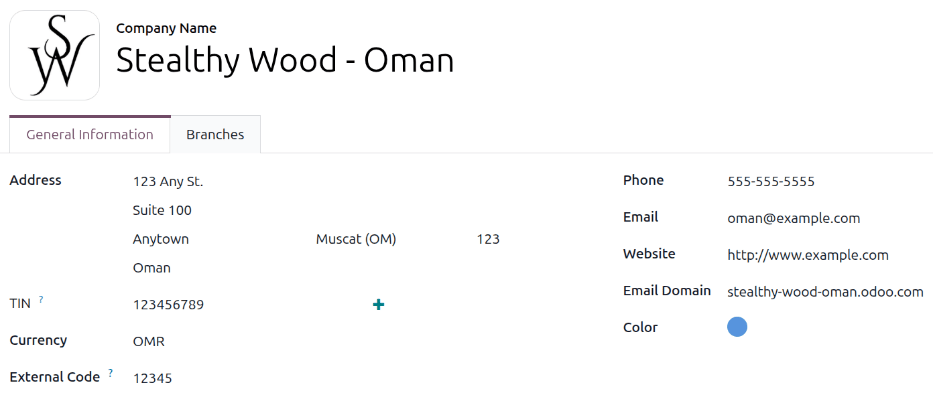
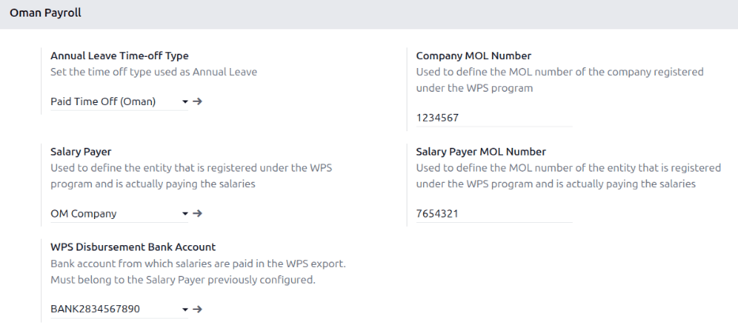
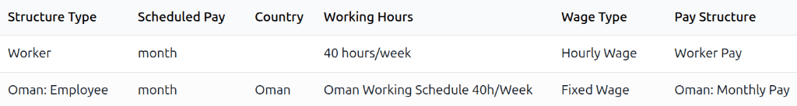
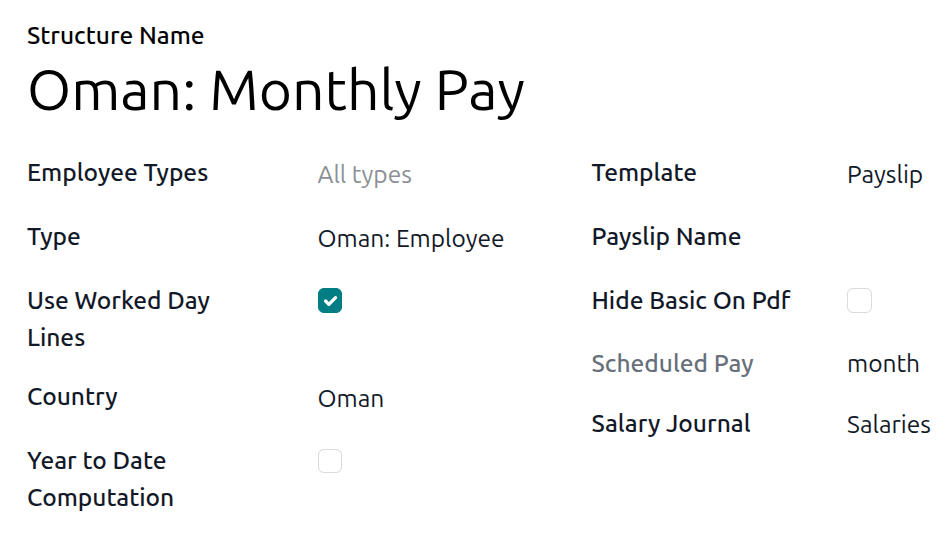

====
Oman
====

.. |MOL| replace:: :abbr:`MOL (Ministry of Labour)`
.. |WPS| replace:: :abbr:`WPS (Wages Protection System)`
.. |SPF| replace:: :abbr:`SPF (Social Protection Fund)`
.. |EOS| replace:: :abbr:`EOS (End Of Service)`
.. |IBAN| replace:: :abbr:`IBAN (International Bank Account Number)`
.. |BIC| replace:: :abbr:`BIC (Business Identifier Code)`

The Oman payroll localization covers salary computations for employees, including both employee and
employer payroll taxes. It accounts for all local and national regulations.

Before configuring the Oman localization, refer to the general :doc:`payroll <../../payroll>`
documentation, which includes the basic information for all localizations, as well as all universal
settings and fields.

.. _payroll/om_apps:

Apps & modules
==============

:ref:`Install <general/install>` the following modules to get all the features of the Oman payroll
localization:

.. list-table::
   :header-rows: 1

   * - Name
     - Technical name
     - Dependencies
     - Description
   * - :guilabel:`Oman - Payroll`
     - `l10n_om_hr_payroll`
     - - hr_payroll
       - hr_work_entry_holidays
       - hr_payroll_holidays
       - base_address_extended
     - Includes all salary rules, leave logic, end of service wps, and compensation rules compliant
       with Oman Labor Law.
   * - :guilabel:`Oman - Payroll with Accounting`
     - `l10n_om_hr_payroll_account`
     - - hr_payroll_account
       - l10n_om
       - l10n_om_hr_payroll
     - Links payroll and accounting by creating journal entries (per payslip if needed) to record
       payroll in the company's books.

.. seealso::
   :doc:`Configure the Oman fiscal localization <../../../finance/fiscal_localizations/oman>`

.. _payroll/payroll_localizations/om_gen:

General configurations
======================

First, the company must be configured. Navigate to :menuselection:`Settings app --> Users &
Companies --> Companies`. From the list, select the desired company, and ensure the following fields
are configured:

- :guilabel:`Company Name`: Enter the business name in this field.
- :guilabel:`Address`: Complete the full address, including the :guilabel:`City`, :guilabel:`State`,
  :guilabel:`Zip`, and :guilabel:`Country`.
- :guilabel:`TIN`: Enter the company's identification number.
- :guilabel:`Currency`: By default, :abbr:`OMR (Omani Rials)` is selected. If not, select
  :guilabel:`OMR` from the drop-down menu.
- :guilabel:`External Code`: Enter the code used to export data to third parties.
- :guilabel:`Phone`: Enter the company phone number.
- :guilabel:`Email`: Enter the email used for general contact information.
- :guilabel:`Website`: Enter the company's web address.
- :guilabel:`Email Domain`: Enter the email domain for the company.
- :guilabel:`Color`: Select a color for the company.

.. _payroll/payroll_localizations/om_payroll:

Payroll settings
----------------

In addition to configuring the company, some **Payroll** app settings must be configured. Navigate
to :menuselection:`Payroll app --> Configuration --> Settings`, scroll to the *Oman Payroll*
section, and configure the following fields:

- :guilabel:`Annual Leave Time-off Type`: Using the drop-down menu, select the time type used for
  annual leave. The time type is used to compute the remaining unused annual leave balance when the
  employee leaves the company.
- :guilabel:`Company MOL Number`: Enter the company's |MOL| number that is registered under the
  |WPS| program.
- :guilabel:`Salary Payer`: Using the drop-down menu, select the entity registered under the |WPS|
  program that actually pays the employee's salaries.
- :guilabel:`Salary Payer MOL Number`: Enter the |MOL| number for the selected :guilabel:`Salary
  Payer`.
- :guilabel:`WPS Disbursement Bank Account`: Using the drop-down menu, select the bank account used
  to pay employees, or create a new one. The account **must** belong to the selected
  :guilabel:`Salary Payer`.

  .. important::
     If creating a new bank account for the :guilabel:`WPS Disbursement Bank Account` field, ensure
     to configure the following fields on the *Create WPS Disbursement Bank Account* pop-up window:

    - :guilabel:`Account Number`: Enter a valid |IBAN|.
    - :guilabel:`Short name`: Enter a 3 to 4 character alphabetic code uniquely identifying the
      bank, used as a shorthand instead of the full bank name (e.g., *NBO* for National Bank of
      Oman, or *HSBC* for HSBC Middle East).
    - :guilabel:`BIC/SWIFT`: Enter an 8 or 11-character alphanumeric code, **not** a 9-digit numeric
      value.
    - :guilabel:`Holder Name`: Select the company for this field.
    - :guilabel:`Trust bank account`: Must be enabled.

Employees
=========

Every employee being paid must have their employee profiles configured for the Oman payroll
localization. Additional fields are present after configuring the database for Oman.

To update an employee form, open the **Employees** app and click on the desired employee record.
Ensure a :guilabel:`Work Email` and :guilabel:`Work Phone` are configured on the employee form, and
configure the required fields in the related tabs.

.. _payroll/payroll_localizations/om-personal_tab:

Personal tab
------------

Ensure the employee has a minimum of one :ref:`trusted bank account <employees/private-contact>`
listed in the :guilabel:`Bank Accounts` field in the *Private Contact* section.

These accounts are used to pay the employee. Payroll **cannot** be processed for employees without a
*trusted* :ref:`bank account <employees/private-contact>`. If no trusted bank account is set, a
warning appears on the **Payroll** dashboard and an error occurs when attempting to generate the
|WPS| payment report.

In the *Citizenship* section, use the drop-down menu in the :guilabel:`Nationality (Country)` field
to select the employee's nationality. This is used when determining the level of coverage under the
Social Protection Fund. Next, select what kind of :guilabel:`Identification Type` the employee has
using the drop-down menu. The default options are :guilabel:`Passport` and :guilabel:`Civil Status
Card`. This is used when extracting the |WPS| file.

.. _payroll/payroll_localizations/om-payroll_tab:

Payroll tab
-----------

Fill out all the information regarding employees' contracts, residency status, tax treatments,
deductions, etc. in this tab.

Set the :guilabel:`Pay Category` to :guilabel:`Oman: Employee` in the *Contract Overview* section,
and set the :guilabel:`Working hours` to :guilabel:`Oman Working Schedule 40h/Week` in the
*Schedule* section.

By default, the :guilabel:`Is Eligible` checkbox in the *End Of Service Benefit* section is
unchecked, indicating the employee is **not** eligible for end of service benefits. If the employee
**is** eligible, ensure the box is checked.

Additionally, the contributions percentages in the *SPF* section are preconfigured for each
insurance category for both the *Employer Contributions* and *Employee Contributions* sections, but
can be modified if desired.

Social Insurance
================

Social insurance rules calculate the contribution amounts that are to be paid by both the employee
and the company to the |SPF|. It has 5 categories:

.. list-table::
   :header-rows: 1
   :stub-columns: 0

   * - Insurance Scheme
     - Employee Percentage
     - Employer
   * - Insurance for Old Age, Disability, and Death
     - 7.5%
     - 11.0%
   * - Insurance for Work Injuries and Occupational Diseases
     - 0.0%
     - 1.0%
   * - Insurance for Employment Security (Unemployment)
     - 0.5%
     - 0.5%
   * - Insurance for Sick and Other Leaves
     - 0.0%
     - 1.0%
   * - Insurance for Maternity Leaves
     - 0.0%
     - 1.0%

Social insurance is available for both Omani and non Omani employees except for the *Insurance for
Old Age, Disability, and Death* category as it is only available to Omani employees.

For both employer and employee contributions, the contribution base is prorated based on days
worked/paid in the month, and is calculated on basic salary only, excluding allowances such as
housing, transport, and overtime.

Leaves
======

The following leave types are available to employees working in Oman:

- *Annual leave*: Employees are eligible for at least 30 calendar days of annual leave once they
  complete 6 months in the company. If the employee needs more days, they must be requested from HR
  managers accordingly.

  To receive the additional allocation, the time off should be allocated to them using the *Annual
  Leave* time off type, and the *Oman Employee Plan* accrual plan, which gives each employee 2.5
  days of allocation at the start of each month until they gain the total of 30 days.

  .. important::
     Since the annual leave is fully paid, it is **not** connected to a salary rule, but it appears
     in the *worked days* on the payslip form and the PDF printout.

- *Sick leave*: The rate which employees in Oman are paid for sick days depends on the number of
  sick leaves they have already taken. Any sick leaves beyond that are unpaid. The rates are:

  - Days 0-21: Fully paid
  - Days 22-35: 75% paid
  - Days 36-70: 50% paid
  - Days 71-182: 35% paid

- *Other leave types*: These leave types are fully paid and do not affect the final payslip, but are
  tracked for reporting purposes:

  - Paternity leave
  - Maternity leave
  - 1st-degree relatives' compassionate leave
  - 2nd-degree relatives Compassionate leave
  - Hajj leave
  - Iddah leave

End of Service
==============

If :guilabel:`Is Eligible` is enabled in the *End of Service Benefit* section of the *Payroll* tab
on the :ref:`employee profile <payroll/payroll_localizations/om-payroll_tab>`, the employee is
eligible to receive end of service benefits. When they leave the company, they receive the following
two benefits:

- *Unused annual leaves compensation*: The *Annual Leave Balance* is shown on the employee record.
  This is based on the :guilabel:`Annual Leave Time-off Type` defined in the **Payroll** app
  settings, and is calculated as the total remaining, unexpired allocations for that specific leave
  type assigned to the employee.

  The balance represents the total remaining leave allocated to the employee, but does **not**
  reflect the portion of leave days the employee earned up to the current month. When calculating
  the value, the deserved leave balance is determined based on the portion of the year worked. The
  benefit value is then calculated by multiplying this deserved balance by the employee's daily
  rate.

  .. example::
     An employee has 3 days of remaining allocation days. If their daily rate is 50 OMR, the benefit
     value is:

     :math:`3 \text{ days} \times 50 \text{ OMR} = 150 \text{ OMR}`

  .. important::
     If the allocation was fully given at the beginning of the year, the calculation is based on
     *deserved leaves*, which is defined by the period of time the employee worked during the
     current year.

     For example, an employee who worked for 7 months deserves 2.5*7 =17.5 days. This is deducted
     from the number of remaining unused allocations to get the number of days to be compensated.
     This value can either be positive or negative.

- *End of Service Benefit*: The calculation begins by determining the total number of days the
  employee worked at the company, from their hiring date to their last working day. The total
  service duration is calculated out of a 365-day year. The resulting period in years is then
  multiplied by the employee's basic salary.

  .. math::

   \text{Latest Basic} \times \left(\frac{\text{Number of Days}}{365}\right)

Provisions
==========

Provisions are the amounts computed by the employer for |EOS| benefit payments made to the employee,
or for remaining annual leaves compensation when employees leave the company. It is computed on a
monthly basis but does **not** affect the employees net wage.

- *End of service benefit provision*: This is computed by dividing the monthly basic salary by 12:

  .. math::

   \frac{\text{Basic}}{12}

- *Annual leave provision*: This is computed by dividing the gross salary by 30 to calculate the
  daily salary, then multiplying that by the number of leave days (which is 30 in Oman), and
  dividing the result by 12.

  .. math::

   \left(\frac{\text{Basic} + \text{Allowances}}{30}\right)
   \times
   \left(\frac{\text{Number of Leave Days}}{12}\right)

.. _payroll/payroll_localizations/om_config:

Payroll configuration
=====================

Several sections within the **Payroll** app also install a salary structure, structure type, and
rules specific to Oman.

Salary structures & structure types
-----------------------------------

When the **l10n_om_hr_payroll** module is :ref:`installed <payroll/om_apps>`, a new
:guilabel:`Salary Structure` gets installed, :guilabel:`Omann: Monthly Pay`. This structure includes
one :guilabel:`Structure Type`, :guilabel:`Omann: Employee`.

The :guilabel:`Salary Structure` contains all the individual :ref:`salary rules <payroll/om_apps>`
that informs the **Payroll** app how to calculate employee payslips.

.. _payroll/om_rules:

Salary rules
------------

To view the salary rules that inform the salary structure what to do, navigate to
:menuselection:`Payroll app --> Configuration --> Structures` and expand the :guilabel:`Omann:
Employee` group to reveal the :guilabel:`Omann: Monthly Pay` structure type. Click :guilabel:`Omann:
Monthly Pay` to view the detailed salary rules.

Each rule defines how pay is calculated, taking into account factors such as allowances, deductions,
and taxes.

Run Omann payroll
=================

Before running payroll, the payroll officer must validate employee time offs and attendances, to
confirm pay accuracy and catch errors. Once everything is correct, draft payslips are :ref:`created
individually <payroll/payslips/process>` or :doc:`in groups <../pay_runs>`, referred to in the
**Payroll** app as *Pay Runs*.

.. note::
   To cut down on the payroll officer's time, it is typical to process pay runs instead of
   individual payslips one at a time.

The process of running payroll includes different actions that need to be executed to ensure the net
wages amounts are correct. The computation of hours worked reflects the employee's actual hours
worked, among others.

When running a payrun, check that the period, company, and employees included are correct *before*
starting to analyze or validate the data.

Once the payslips are drafted, review them for accuracy. Check the *Worked Days* and *Salary Inputs*
tabs, and ensure the listed worked time is correct, as well as any salary inputs. Add any missing
inputs, such as commissions, tips, or reimbursements. Next, check the various totals such as gross
pay, social insurance contributions, benefits, and net salaries. If any edits were made, click
:guilabel:`Compute Sheet` to update the salary calculations. If everything is correct, click
:guilabel:`Validate`.

Register Payments
-----------------

Payments can be grouped by *Partner* if there is a partner associated with a salary rule.

Close Payroll
-------------

If there are no errors, payroll is completed for the pay period.

Wages protection system reports
===============================

The |WPS| report must be submitted by the company to prove they paid their employees the right
amounts on the right dates. It can either be generated per payslip or payrun.

The following steps must be followed before generating the report:

#. Ensure the :guilabel:`Company MOL Number`, :guilabel:`Salary Payer`, :guilabel:`Salary Payer MOL
   Number`, and the :guilabel:`WPS Disbursement Bank Account` fields :ref:`are configured
   <payroll/payroll_localizations/om_payroll>`.
#. Set the unique identifier for all employees who are part of the pay run or payslip.

   .. tip::
      The unique identifier is either the employee's passport number or civil status card number,
      depending on the selection made for the :guilabel:`Identification Type` field in the
      *Personal* tab on the :ref:`employee form <payroll/payroll_localizations/om-personal_tab>`,

Once the initial setup is done, the |WPS| can be generated either for one payslip or for a pay run
as follows:

#. Generate the payslip one by one or as a pay run.
#. Post the draft entity related to the payslips.
#. Create the payment report and set the *Export Format* to *Oman WPS*.

   .. note::
      The Report is exported in a .csv format.

The resulting file consists of the following:

.. list-table::
   :header-rows: 1

   * - Field
     - Description
     - Mapping value
   * - Employer CR-NO
     - CR number of the company
     - Company |MOL| Number under :menuselection:`Payroll --> Settings --> Oman Payroll`
   * - Payer CR-NO
     - CR number of the payer
     - Payer |MOL| Number under :menuselection:`Payroll --> Settings --> Oman Payroll`
   * - Payer Bank Short Name
     - Short code for the payer's bank
     - :guilabel:`Short Name` of the :guilabel:`WPS Disbursement Bank Account` which can be found
       under :menuselection:`Payroll --> Settings --> Oman Payroll`
   * - Payer |IBAN|
     - |IBAN| of the payer's account
     - :guilabel:`IBAN` of the :guilabel:`WPS Disbursement Bank Account` which can be found under
       :menuselection:`Payroll --> Settings --> Oman Payroll`
   * - Salary Year
     - Year of the payroll period (YYYY)
     - Payslip/Pay runs year.
   * - Salary Month
     - Month of the payroll period (MM)
     - Payslip/Pay runs month.
   * - Total Salaries
     - Sum of Net for all payslips in the payrun (or single Net for off-cycle)
     - Sum of Salary Rule: Net (3 decimal digits)
   * - Number of Records
     - Count of employees in the report
     - 1 if only a single payslip, or if only one employee is in a pay run.
   * - Payment Type
     - Static value
     - Hardcoded text: "Salary"

Employee Details Section

.. list-table::
   :header-rows: 1

   * - Field
     - Description
     - Mapping value
   * - Employee ID Type
     - P = Passport, C = Civil Status Card
     - :guilabel:`Identification Type` which can be found on the employee record, in the
       *Citizenship* section of the *Personal* tab.
   * - Employee ID
     - ID number matching the selected ID Type
     - :guilabel:`Identification No` or :guilabel:`Passport No` depending on the employee's
       :guilabel:`Identification Type`, which can be found on the employee record, in the
       *Citizenship* section of the *Personal* tab.
   * - Employee Name
     - Employee's legal name
     - The employee's legal name, found in the *Personal Information* section of the *Personal* tab
       of the employee's record.
   * - Employee |BIC|
     - Employee's bank account |BIC|
     - |BIC| of the bank account for the employee, found in the *Private Contact* section of the
       *Personal* tab of the employee record.
   * - Employee |IBAN|
     - Employee's bank account |IBAN|
     - |IBAN| of the bank account for the employee, found in the *Private Contact* section of the
       *Personal* tab of the employee record.
   * - Salary Frequency
     - B = Biweekly, M = Monthly (only these 2 allowed)
     - Strictly as **M** only.
   * - Number of Working Days
     - 30 minus unpaid/out-of-contract days
     - Calculated from payslip worked days lines.
   * - Basic Salary
     - Basic salary amount
     - Salary Rule: Basic Salary (3 decimal digits)
   * - Net Salary
     - Net salary amount
     - Salary Rule: Net (3 decimal digits)
   * - Extra Hours
     - Extra hours worked
     - Calculated from payslip worked days lines.(2 decimal digits)
   * - Extra Income
     - Total allowances
     - Salary Rule Category: Allowances
   * - Deductions
     - Total deductions
     - Salary Rule Category: Deductions
   * - Social Security Deductions
     - |SPF| employee contribution
     - Salary Rule: |SPF| Employee Contribution
   * - Comments
     - Optional note
     - Found on the pay wizard.

.. note::
   The exported format is based on the *Central Bank of Oman* guidelines, and is aligned with the
   formats used by most |WPS| agents in Oman, including *Bank Muscat*, *Oman Arab Bank* and *Bank
   Dhofar*, among others.
